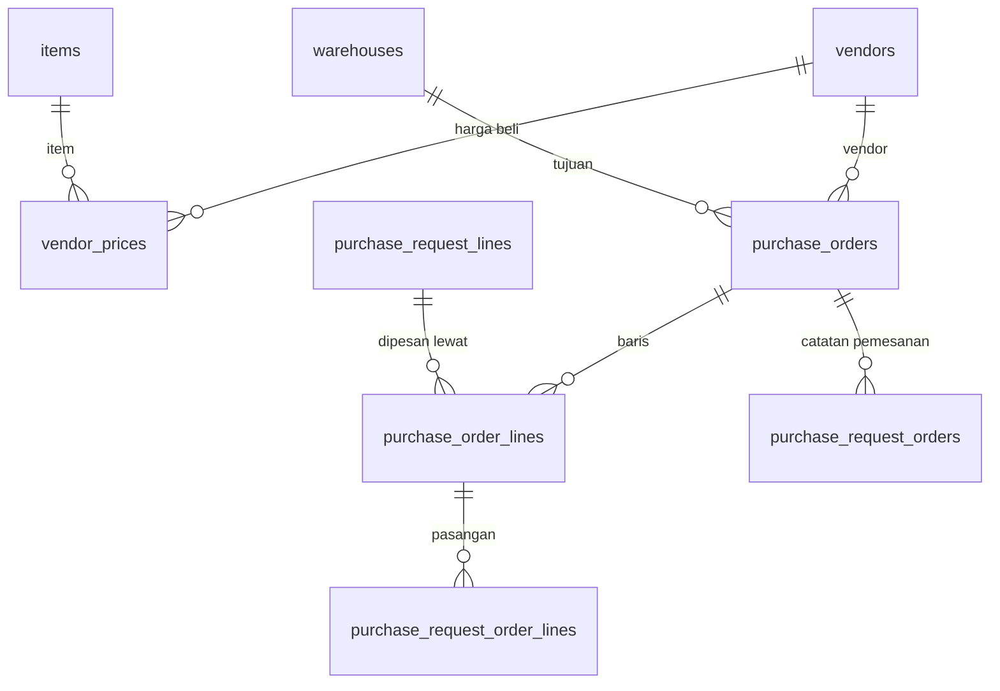

# Spesifikasi Modul — `purchasing` (Purchasing inti, Fase 1b)

**Versi:** 0.1
**Tanggal:** 25 September 2026
**Status:** selesai Fase 1b — dibangun setelah Fase 1 WMS sesuai peta rilis [D-29](../wms/04-keputusan-dan-asumsi.md#d-29); keputusan yang tidak tertulis di dokumen dicatat sebagai [A-208](../wms/04-keputusan-dan-asumsi.md#a-208)–[A-218](../wms/04-keputusan-dan-asumsi.md#a-218) (*Perlu validasi*)
**Modul:** `purchasing` (PO, harga beli vendor)
**Fase:** F1b; evaluasi vendor, penawaran, three-way match `[F3]`
**Dokumen terkait:** [Lingkup & integrasi Purchasing](01-lingkup-dan-integrasi-wms.md) · [D-07](../wms/04-keputusan-dan-asumsi.md#d-07), [D-08](../wms/04-keputusan-dan-asumsi.md#d-08), [D-28](../wms/04-keputusan-dan-asumsi.md#d-28) · [Katalog §2.17](../wms/06-katalog-status-dan-enum.md#217-po-purchase-order--purchase_order-f1b) · [Glosarium §5](../wms/03-glosarium.md#5-dokumen-transaksi) · [26-purchase-request](../wms/26-purchase-request.md) · [20-approval](../wms/20-approval.md)
**Ketergantungan modul:** `purchase_request` (baris PRQ & catatan pemesanan), `receipt` (GRN vendor), `approval` (aturan nilai PO), `master` (vendor, item), `template` (cetak PO).

---

## 1. Tujuan & lingkup

WMS berhenti di **kebutuhan** (PRQ) dan **penerimaan fisik** (GRN). Purchasing inti mengisi celah di tengahnya: PRQ yang disetujui dikelompokkan menjadi **Purchase Order per vendor** dengan **harga beli**, PO disetujui berlapis berdasarkan **nilai uang** memakai mesin approval yang sama ([D-28](../wms/04-keputusan-dan-asumsi.md#d-28)), dan PO yang disetujui otomatis menjadi **catatan pemesanan** PRQ sehingga GRN vendor tinggal merujuknya ([01 §5.2](01-lingkup-dan-integrasi-wms.md#52-dari-purchasing-ke-wms)). PO ditutup saat semua baris diterima atau sisanya ditutup.

Harga hanya hidup di domain ini ([A-208](../wms/04-keputusan-dan-asumsi.md#a-208)); layar, cetak, dan kejadian WMS tetap tanpa harga ([D-07](../wms/04-keputusan-dan-asumsi.md#d-07)).

Tidak termasuk: PO tanpa PRQ, pajak/diskon/ongkir, pembayaran & termin (Akuntansi), evaluasi vendor & perbandingan penawaran `[F3]`, endpoint `/api/integrations/purchasing` `[F3]`, pemindahan kepemilikan master vendor (WMS tetap pemilik sampai Fase 3).

## 2. Aktor & permission

Permission baru, modul `purchase_order` dan `vendor_price` ([A-216](../wms/04-keputusan-dan-asumsi.md#a-216)). Tanpa role bawaan baru.

| Role bawaan | Permission |
|---|---|
| Admin Company | semua (8) |
| Penindak Lanjut PR | `po.view`, `po.create`, `po.submit`, `po.cancel`, `po.close`, `vendor_price.view`, `vendor_price.manage` |
| Manajemen | `po.view`, `po.approve`, `vendor_price.view` |
| Auditor Internal | `po.view`, `vendor_price.view` |
| Kepala Gudang, Staf, Driver, Pemohon, Auditor Eksternal, Klien | — (tidak melihat harga) |

`po.create` juga dipakai untuk mengubah draf dan mengubah ETA. Cakupan ([BR-ACC-05](../wms/05-aturan-bisnis.md#br-acc)): **gudang tujuan**; di luar cakupan = 404. Pembuat dan pengaju tidak memutus PO-nya sendiri ([BR-APR-03](../wms/05-aturan-bisnis.md#br-apr)).

## 3. Entitas & data

Migrasi tenant `2026_01_01_000210_create_purchasing_tables.php`; model di `app/Domain/Purchasing/Models`.

| Tabel | Kolom pokok |
|---|---|
| `vendor_prices` | `vendor_id`, `item_id`, `unit_price` decimal(18,2) per satuan dasar, `currency` (`IDR`), `valid_from`, `is_active`, `notes`, `created_by` — riwayat: harga baru = baris baru, harga lama dinonaktifkan, tidak dihapus (P-03) |
| `purchase_orders` | `number` (`PO/<gudang>/<yymm>/<urut>`), `vendor_id`, `warehouse_id` (tujuan), `status` (Katalog §2.17), `order_date`, `eta_date`, `currency`, `total_amount` decimal(18,2), `payment_terms` (salinan teks vendor), `notes`, `approval_snapshot_id`, `created_by`, `submitted_by/at`, `approved_by/at`, `reject_reason_id`, `cancel_reason_id`, `cancelled_at`, `close_reason_id`, `closed_at`, `completed_at` |
| `purchase_order_lines` | `purchase_order_id`, `purchase_request_line_id`, `item_id`, `qty_base`, `unit_price`, `line_amount`, `qty_received`, `qty_cancelled`, `notes` |
| `purchase_request_orders` (+) | `purchase_order_id` — catatan pemesanan yang lahir dari PO |
| `purchase_request_order_lines` (+) | `purchase_order_line_id` — pasangan baris PO |



Enum: status umum Katalog §1 (**tanpa status baru**, [A-209](../wms/04-keputusan-dan-asumsi.md#a-209)); `approval_document_type` dan `document_template_type` menambah `purchase_order`.

## 4. Mesin status

```yaml
purchase_order:
  initial: draft
  transitions:
    - {from: null, to: draft, action: po.create}
    - {from: draft, to: [pending_approval, approved], action: po.submit}           # tanpa aturan = approved (A-08)
    - {from: pending_approval, to: [approved, rejected], action: po.approve}
    - {from: approved, to: [partially_fulfilled, completed], action: system, when: grn_received}
    - {from: partially_fulfilled, to: completed, action: system, when: grn_received}
    - {from: partially_fulfilled, to: closed_short, action: po.close, guard: alasan}
    - {from: [draft, pending_approval, approved], to: cancelled, action: po.cancel, guard: alasan_dan_belum_ada_barang}
  terminal: [completed, closed_short, rejected, cancelled]
```

| Transisi | Implementasi | Efek samping |
|---|---|---|
| → `draft`, ubah draf | `Actions\CreatePurchaseOrder::handle/update` | baris dari PRQ, harga bawaan dari `Support\VendorPrices::current` |
| `draft →` | `Actions\SubmitPurchaseOrder` | snapshot approval; kondisi nilai PO ([A-212](../wms/04-keputusan-dan-asumsi.md#a-212)) |
| keputusan | `Actions\ApprovePurchaseOrder` → `DecideApproval`; `Support\PurchaseOrderApprovalHandler` | tolak = `rejected` + Alasan `*` |
| `→ approved` | `PurchaseOrderApprovalHandler::onApproved` → `Support\PurchaseOrderIssuer::issue` | **`po_created`**: satu catatan pemesanan per PRQ, PRQ `approved → forwarded` ([A-213](../wms/04-keputusan-dan-asumsi.md#a-213)) |
| ubah ETA | `Actions\UpdatePurchaseOrderEta` | **`po_updated`**: ETA catatan pemesanan ikut |
| GRN diterima | `PurchaseRequest\Support\PurchaseReceipts::received` → kejadian `OrderLinesReceived` → `Support\PurchaseOrderReceipts` | `qty_received` baris PO, status PO ([A-214](../wms/04-keputusan-dan-asumsi.md#a-214)) |
| batal / tutup sisa | `Actions\CancelPurchaseOrder`, `Actions\ClosePurchaseOrder` → `PurchaseOrderIssuer::release` | **`po_cancelled`**: `qty_ordered` catatan & baris PRQ dikurangi sisa ([A-215](../wms/04-keputusan-dan-asumsi.md#a-215)) |

## 5. Aturan bisnis yang berlaku

| Aturan | Ditegakkan di mana |
|---|---|
| [D-07](../wms/04-keputusan-dan-asumsi.md#d-07), [A-208](../wms/04-keputusan-dan-asumsi.md#a-208) | harga hanya di tabel/layar/cetak Purchasing; payload `stock_events` dan layar PRQ/GRN tanpa harga |
| [A-210](../wms/04-keputusan-dan-asumsi.md#a-210) | satu PO = satu vendor aktif × satu gudang tujuan; baris dari PRQ `approved`/`forwarded`/`partially_fulfilled` gudang itu; jumlah ≤ sisa belum dipesan − jumlah di PO draf/menunggu lain; diperiksa ulang saat disetujui |
| [A-211](../wms/04-keputusan-dan-asumsi.md#a-211) | IDR; harga satuan > 0 per satuan dasar; `line_amount = round(qty × harga, 2)`; `total_amount = Σ` |
| [BR-APR-07](../wms/05-aturan-bisnis.md#br-apr), [D-28](../wms/04-keputusan-dan-asumsi.md#d-28) | kondisi `order_value_min` hanya untuk `purchase_order`; jenis dokumen lain tetap tanpa uang |
| [BR-GRN-01](../wms/05-aturan-bisnis.md#br-grn), [BR-GRN-05](../wms/05-aturan-bisnis.md#br-grn) | GRN merujuk catatan pemesanan hasil PO; kelebihan terima ditolak (menjawab sementara [01 §7](01-lingkup-dan-integrasi-wms.md#7-pertanyaan-untuk-spesifikasi-purchasing-nanti) no. 2) |
| [BR-GEN-11](../wms/05-aturan-bisnis.md#br-gen) | Alasan wajib saat tolak/batal/tutup sisa |
| [A-215](../wms/04-keputusan-dan-asumsi.md#a-215) | PRQ yang punya catatan PO terbuka tidak bisa dibatalkan dari layar PRQ |

## 6. Layar

| Route | Komponen | Isi |
|---|---|---|
| `/purchase-orders` | `purchasing.purchase-order-list` | cari nomor PO/PRQ/vendor, filter gudang, vendor, status; nilai PO, ETA |
| `/purchase-orders/create` | `purchasing.purchase-order-form` | vendor `*`, gudang tujuan `*`, ETA, catatan; tabel baris PRQ terbuka gudang itu (sisa, vendor tetap item disarankan), jumlah & harga satuan per baris (bawaan dari daftar harga), total; *Simpan draf*, *Simpan & ajukan*. `?prq=<id>` memilih gudang dan baris PRQ itu |
| `/purchase-orders/{id}/edit` | sama | ubah draf |
| `/purchase-orders/{id}` | `purchasing.purchase-order-detail` | baris (dipesan, diterima, dibatalkan, harga, nilai), total; *Ajukan*, *Setujui/Tolak*, *Ubah ETA*, *Batalkan*, *Tutup sisa*, *Cetak PO*; PRQ & GRN terkait; riwayat approval; riwayat |
| `/vendor-prices` | `purchasing.vendor-price-list` | daftar harga berlaku per vendor × item, cari, tambah harga baru (menggantikan yang lama), nonaktifkan |
| `/print/purchase-order/{id}` | `DocumentPrinter` | PDF PO dengan harga ([A-217](../wms/04-keputusan-dan-asumsi.md#a-217)) |

Detail PRQ menampilkan tombol **Buat PO** (pemegang `po.create`, PRQ menerima pesanan). Sidebar **Pembelian → Purchase Request, Purchase Order, Harga beli vendor**; palet Ctrl+K *Purchase Order*, *PO baru*, *Harga beli vendor*. Semua transisi lewat aksi Livewire (POST).

## 7. Kejadian & integrasi

Kejadian Purchasing → WMS dijalankan dalam proses yang sama (bukan HTTP) karena satu aplikasi ([A-213](../wms/04-keputusan-dan-asumsi.md#a-213)):

| Kejadian ([01 §5.2](01-lingkup-dan-integrasi-wms.md#52-dari-purchasing-ke-wms)) | Pemicu | Efek di WMS |
|---|---|---|
| `po_created` | PO `approved` | catatan pemesanan per PRQ (`external_po_no` = nomor PO, ETA, baris ↔ baris PO); PRQ `forwarded` |
| `po_updated` | ubah ETA | ETA catatan pemesanan |
| `po_cancelled` | PO `cancelled` / `closed_short` | sisa dipesan dikurangi, PRQ tetap *Diteruskan* dan sisanya bisa dipesan lagi |

WMS → Purchasing: `goods_received` (payload tetap tanpa harga; `external_po_no` = nomor PO) dan kejadian domain `OrderLinesReceived` untuk jumlah diterima PO. Tidak ada `stock_event_type` baru.

## 8. Notifikasi

Tugas & keputusan approval PO memakai notifikasi approval generik (`approval.task_assigned`, `approval.decided`). Tidak ada kejadian notifikasi baru.

## 9. Laporan & dashboard

Daftar PO memuat filter status/vendor/gudang dan nilai. Laporan pembelian per vendor/periode `[F3]`.

## 10. Kasus uji (Given / When / Then)

Uji di `tests/Feature/Purchasing` (`PurchaseOrderTest`, `PurchaseOrderScreenTest`, `VendorPriceTest`); fixture `Concerns\PurchasingFixtures` (memakai `PurchaseFixtures` PRQ).

| ID | Given | When | Then | BR |
|---|---|---|---|---|
| TC-PO-01 | PRQ 100 baut disetujui, harga vendor 1.500 | PO draf 60 | nomor `PO/CKG/…`, harga bawaan 1.500, nilai 90.000; PRQ belum diteruskan | A-210, A-211 |
| TC-PO-02 | — | tanpa baris; jumlah 0 / > sisa; harga 0; vendor nonaktif; PRQ gudang lain; baris dipakai PO draf lain | ditolak BR-GEN-11, BR-LED-02, BR-REQ-08, A-211, BR-MST-05, A-210 | A-210 |
| TC-PO-03 | tanpa aturan | ajukan | `approved`; catatan pemesanan PRQ `PO/…`, PRQ `forwarded`, `qty_ordered` 60 | A-08, A-213 |
| TC-PO-04 | aturan nilai ≥ 1.000.000 → Manajemen | PO 90.000 lalu PO 1,5 jt | kecil langsung `approved`; besar `pending_approval`, pembuat tidak boleh, Manajemen setuju → `approved`; tolak tanpa alasan ditolak, dengan alasan `rejected` | A-212, BR-APR-03 |
| TC-PO-05 | PO disetujui 60 | GRN 40 lalu 20; lebih 1 | PO `partially_fulfilled` lalu `completed`; PRQ ikut; kelebihan BR-GRN-05; payload `goods_received` tanpa harga | A-214 |
| TC-PO-06 | PO disetujui | batal tanpa/dengan alasan; batal setelah terima | `cancelled`, `qty_ordered` PRQ kembali; BR-GEN-01 bila sudah ada barang | A-215 |
| TC-PO-07 | PO sebagian diterima | tutup sisa | `closed_short`, sisa bisa dipesan lagi (PO/catatan baru) | A-215 |
| TC-PO-08 | PO disetujui | ubah ETA; batalkan PRQ-nya | ETA catatan ikut; PRQ ditolak A-215 | A-213 |
| TC-PO-09 | role & cakupan | layar, menu, harga | 200/403/404 sesuai §2; Kepala Gudang tidak melihat menu PO/harga; staf gudang lain 404 | BR-ACC-05 |
| TC-PO-10 | layar | form dari PRQ → simpan & ajukan → detail setujui → cetak | nilai tampil Rp; PDF 200 hanya `po.view` | §6 |
| TC-VPR-01 | vendor & item | harga baru 1.500 lalu 1.600 | yang lama nonaktif, riwayat tetap; harga ≤ 0 ditolak; tanpa izin 403 | A-211 |

Uji modul lain yang berubah: TC-APR-03 (kunci nilai hanya untuk PO), TC-APR-17 (jenis di luar katalog), TC-APR-21 (8 aturan demo), TC-ACC-27b (permission `purchase_order`, `vendor_price`), TC-TPL (jenis template `purchase_order`).

## 11. Di luar lingkup modul ini

PO tanpa PRQ; pajak, diskon, ongkir, uang muka, pembayaran (Akuntansi); perbandingan penawaran & evaluasi vendor `[F3]`; kirim PO lewat email/WhatsApp; pembatalan per baris PO; migrasi kepemilikan master vendor.

## 12. Definisi selesai

- [x] Migrasi tenant 000210, model, enum; ERD digenerate ulang
- [x] Mesin status Katalog §2.17 tanpa status baru; approval nilai lewat mesin approval
- [x] PO → catatan pemesanan → GRN → PO selesai; batal & tutup sisa mengembalikan sisa
- [x] Layar PO, harga beli vendor, cetak PO, menu, palet
- [x] Permission & role di `ReferenceSeeder`; harga & aturan demo di seeder demo ([00-akun-uji](../00-akun-uji.md))
- [x] Semua TC-PO & TC-VPR lulus; `php artisan test` hijau
- [x] Dokumen diperbarui (versi naik + changelog README)

## 13. Catatan implementasi (25 September 2026)

Domain `app/Domain/Purchasing`: aksi `CreatePurchaseOrder` (+`update`), `SubmitPurchaseOrder`, `ApprovePurchaseOrder`, `UpdatePurchaseOrderEta`, `CancelPurchaseOrder`, `ClosePurchaseOrder`, `SaveVendorPrice`, `DeactivateVendorPrice`; `Support\PurchaseOrderLines`, `VendorPrices`, `PurchaseOrderApprovalHandler`, `PurchaseOrderIssuer`, `PurchaseOrderReceipts`, `Money`; policy; 4 komponen Livewire. Provider `PurchasingServiceProvider`; controller `Purchasing\PurchaseOrderController`, `Purchasing\VendorPriceController`.

Perubahan di modul lain: **Approval** — `ApprovalDocumentType::PurchaseOrder`, kunci kondisi `order_value_min`, `ApprovalContext::orderValue`, kolom di form aturan; **PRQ** — kejadian `OrderLinesReceived`, guard batal PRQ ber-PO terbuka, tombol *Buat PO*; **Template** — jenis `purchase_order`, kaki cetak "nilai dalam Rupiah" khusus PO.
