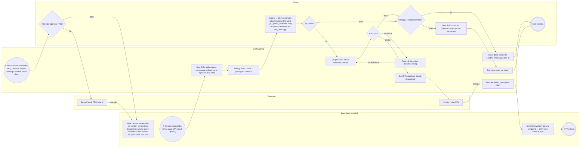
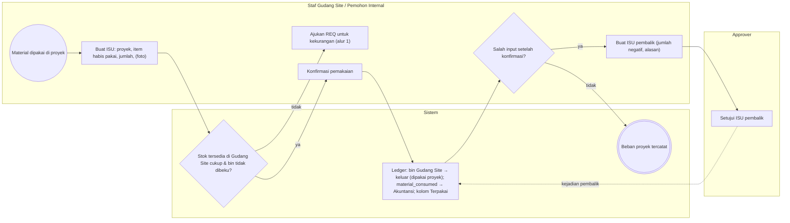

# Proses Bisnis To-Be — Alur 1–3 (permintaan–pengiriman, penerimaan, pemakaian)

**Versi:** 0.4 (Part 2, pasca-validasi & diskusi lanjutan 23 Sep 2026)
**Tanggal:** 23 September 2026
**Status:** asumsi A-25–A-49 dan A-51–A-66 disetujui 23 Sep 2026 (A-40 diubah); alur 1, 2, 7, 8 diperluas (purchasing, permintaan klien, pengiriman, audit); alur 5 memuat varian dari [A-50](04-keputusan-dan-asumsi.md#a-50) yang menunggu validasi; setiap alur mencantumkan asumsi yang dipakainya. Bila asumsi berubah, ubah data di [`diagram/_generate.py`](../diagram/_generate.py) dan jalankan ulang — file ini dan `.drawio` dibuat otomatis, **jangan diedit manual**.
**Dokumen terkait:** [Blueprint §7](01-blueprint.md#7-dokumen--alur-utama) · [Aturan Bisnis](05-aturan-bisnis.md) · [Katalog Status](06-katalog-status-dan-enum.md) · [Keputusan & Asumsi](04-keputusan-dan-asumsi.md) · [Alur 4–7](07a-proses-bisnis-lanjutan.md) · [Alur 8–10](07b-proses-bisnis-pendukung.md)

Daftar semua alur Part 2:

1. [Permintaan material sampai bukti terima](07-proses-bisnis.md#alur-1--permintaan-material-sampai-bukti-terima)
2. [Penerimaan dari vendor, QC, put-away, retur ke vendor](07-proses-bisnis.md#alur-2--penerimaan-dari-vendor-qc-put-away-retur-ke-vendor)
3. [Pemakaian material di Gudang Site](07-proses-bisnis.md#alur-3--pemakaian-material-di-gudang-site)
4. [Retur dari proyek dan pemilahan](07a-proses-bisnis-lanjutan.md#alur-4--retur-dari-proyek-dan-pemilahan)
5. [Transfer antar gudang dan antar proyek](07a-proses-bisnis-lanjutan.md#alur-5--transfer-antar-gudang-dan-antar-proyek)
6. [Konversi material, offcut, dan berita acara waste](07a-proses-bisnis-lanjutan.md#alur-6--konversi-material-offcut-dan-berita-acara-waste)
7. [Aset dipinjamkan: keluar, jatuh tempo, kembali, hilang](07a-proses-bisnis-lanjutan.md#alur-7--aset-dipinjamkan-keluar-jatuh-tempo-kembali-hilang)
8. [Stock opname: sesi, hitung buta, hitung ulang, rekonsiliasi](07b-proses-bisnis-pendukung.md#alur-8--stock-opname-sesi-hitung-buta-hitung-ulang-rekonsiliasi)
9. [Approval generik (semua jenis dokumen)](07b-proses-bisnis-pendukung.md#alur-9--approval-generik-semua-jenis-dokumen)
10. [Siklus langganan company (platform)](07b-proses-bisnis-pendukung.md#alur-10--siklus-langganan-company-platform)

Konvensi: ● awal · ⏱ awal berbasis waktu · ◇ gateway XOR · ◉ akhir · panah putus-putus = jalur balik (loop). Status memakai nilai `enum` dari Katalog Status. Diagram `.drawio` dibuka dengan diagrams.net / ekstensi Draw.io di VS Code.

---

## Alur 1 — Permintaan material sampai bukti terima

**Diagram:** [`diagram/bpmn-01-permintaan-sampai-terima.drawio`](../diagram/bpmn-01-permintaan-sampai-terima.drawio) · **Asumsi yang dipakai:** [A-07](04-keputusan-dan-asumsi.md#a-07), [A-30](04-keputusan-dan-asumsi.md#a-30), [A-31](04-keputusan-dan-asumsi.md#a-31), [A-33](04-keputusan-dan-asumsi.md#a-33), [A-35](04-keputusan-dan-asumsi.md#a-35), [A-39](04-keputusan-dan-asumsi.md#a-39), [A-41](04-keputusan-dan-asumsi.md#a-41), [A-54](04-keputusan-dan-asumsi.md#a-54), [A-55](04-keputusan-dan-asumsi.md#a-55), [A-56](04-keputusan-dan-asumsi.md#a-56), [A-57](04-keputusan-dan-asumsi.md#a-57), [A-60](04-keputusan-dan-asumsi.md#a-60), [A-61](04-keputusan-dan-asumsi.md#a-61), [A-63](04-keputusan-dan-asumsi.md#a-63), [A-64](04-keputusan-dan-asumsi.md#a-64), [A-65](04-keputusan-dan-asumsi.md#a-65) · **Aturan:** [BR-REQ-01–15](05-aturan-bisnis.md#br-req), [BR-STK-03–05](05-aturan-bisnis.md#br-stk), [BR-SJ-01–10](05-aturan-bisnis.md#br-sj), [BR-GEN-06](05-aturan-bisnis.md#br-gen) · **Status:** `REQ`, `PCK`, `SJ`, `DSC`

Alur inti outbound: dari kebutuhan material di proyek sampai barang diterima di tujuan dan REQ selesai. Mencakup tinjauan staf untuk permintaan klien, reservasi dua tahap, picking dengan short pick, pengiriman, bukti terima, dan selisih pengiriman.

**Lane (aktor):** Pemohon (Internal / Klien) · Staf Gudang · Kepala Gudang · Approver · Driver / Penerima · Sistem

### Langkah

| # | Lane | Langkah | Status / efek / aturan |
|---|---|---|---|
| 1 | Pemohon (Internal / Klien) | ● Kebutuhan material di proyek |  |
| 2 | Pemohon (Internal / Klien) | Buat & ajukan REQ (baris katalog / non-katalog, tanggal dibutuhkan) | REQ draft → submitted; [BR-REQ-01](05-aturan-bisnis.md#br-req) |
| 3 | Sistem | ◇ Pemohon klien? | [A-07](04-keputusan-dan-asumsi.md#a-07) |
| 4 | Staf Gudang | Tinjau: petakan non-katalog (klien boleh menolak pengganti 1 hari), tetapkan gudang sumber / pecah baris antar gudang, isi tanggal janji | REQ under_review; [BR-REQ-02–04](05-aturan-bisnis.md#br-req); [BR-REQ-13](05-aturan-bisnis.md#br-req); [BR-REQ-14](05-aturan-bisnis.md#br-req); [A-39](04-keputusan-dan-asumsi.md#a-39), [A-31](04-keputusan-dan-asumsi.md#a-31), [A-55](04-keputusan-dan-asumsi.md#a-55), [A-56](04-keputusan-dan-asumsi.md#a-56), [A-60](04-keputusan-dan-asumsi.md#a-60) |
| 5 | Sistem | Snapshot aturan approval; lewati lapis pengaju (SoD) | REQ pending_approval; [BR-APR-01](05-aturan-bisnis.md#br-apr), [BR-APR-03](05-aturan-bisnis.md#br-apr) |
| 6 | Sistem | ◇ Ada lapis approval? | [A-08](04-keputusan-dan-asumsi.md#a-08) |
| 7 | Approver | Setujui / tolak (alasan) — lihat alur 9 | BR-APR |
| 8 | Sistem | ◇ Disetujui? |  |
| 9 | Pemohon (Internal / Klien) | ◉ REQ ditolak | REQ rejected; notifikasi pemohon |
| 10 | Sistem | Reservasi lunak per gudang; kekurangan → TRF (alur 5) / PRQ (alur 2) | REQ approved; [BR-REQ-05](05-aturan-bisnis.md#br-req); [BR-STK-04](05-aturan-bisnis.md#br-stk); [A-30](04-keputusan-dan-asumsi.md#a-30) |
| 11 | Sistem | Buat PCK per gudang sumber; alokasi keras bin/lot/serial/potongan | PCK pending; REQ in_progress; [BR-STK-04](05-aturan-bisnis.md#br-stk) |
| 12 | Staf Gudang | Picking: scan bin & item → Loading Area; short pick + alasan | PCK in_progress → completed; [BR-SJ-01](05-aturan-bisnis.md#br-sj), [BR-SJ-02](05-aturan-bisnis.md#br-sj) |
| 13 | Staf Gudang | Buat SJ: gabungkan PCK ke tujuan sama (boleh beberapa REQ); cara kirim kendaraan sendiri / ekspedisi / diantar sendiri | SJ prepared; [BR-SJ-07](05-aturan-bisnis.md#br-sj); [BR-SJ-09](05-aturan-bisnis.md#br-sj); [A-57](04-keputusan-dan-asumsi.md#a-57) |
| 14 | Driver / Penerima | Konfirmasi muat & berangkat | SJ shipped; ledger → in_transit; goods_shipped |
| 15 | Driver / Penerima | Bukti terima per baris: baik / rusak (foto wajib) / kurang; per unit untuk serial & potongan; tanda tangan (driver atau tautan bertoken + OTP) | [BR-SJ-05](05-aturan-bisnis.md#br-sj); [A-41](04-keputusan-dan-asumsi.md#a-41); [A-64](04-keputusan-dan-asumsi.md#a-64) |
| 16 | Sistem | ◇ Semua baik & lengkap? |  |
| 17 | Sistem | Buat DSC: baris kurang / rusak; kurang & rusak tetap in_transit (rusak berkondisi Rusak); rusak dibawa balik driver | SJ partially_delivered; DSC open; [BR-SJ-06](05-aturan-bisnis.md#br-sj); [A-64](04-keputusan-dan-asumsi.md#a-64); [A-65](04-keputusan-dan-asumsi.md#a-65) |
| 18 | Kepala Gudang | Selesaikan DSC: kembali ke gudang / disesuaikan / klaim / kirim pengganti; klien masih perlu sisanya? | DSC resolved; [BR-SJ-10](05-aturan-bisnis.md#br-sj); delivery_discrepancy |
| 19 | Sistem | Efek stok per tujuan: jual putus keluar (goods_delivered), aset → on_site (asset_checked_out), gudang → GRN tujuan | SJ delivered; [BR-SJ-04](05-aturan-bisnis.md#br-sj); [A-25](04-keputusan-dan-asumsi.md#a-25) |
| 20 | Pemohon (Internal / Klien) | Konfirmasi terima atau ajukan keberatan kurang/rusak (otomatis terima setelah 3 hari; otomatis bila pemohon mengisi bukti terima sendiri) | [BR-REQ-10](05-aturan-bisnis.md#br-req); [A-63](04-keputusan-dan-asumsi.md#a-63) |
| 21 | Sistem | ◇ Keberatan? | [A-63](04-keputusan-dan-asumsi.md#a-63) |
| 22 | Sistem | ◇ Semua baris terpenuhi? |  |
| 23 | Sistem | Tunggu backorder (TRF / PRQ tiba → reservasi otomatis, cross-dock) | REQ partially_fulfilled; [BR-REQ-08](05-aturan-bisnis.md#br-req) |
| 24 | Sistem | ◉ REQ selesai | REQ completed; reservasi = 0 |

### Percabangan

| Gateway | Cabang → langkah |
|---|---|
| Pemohon klien? | *ya* → Tinjau: petakan non-katalog (klien boleh menolak pengganti 1 hari), tetapkan gudang sumber / pecah baris antar gudang, isi tanggal janji · *tidak* → Snapshot aturan approval; lewati lapis pengaju (SoD) |
| Ada lapis approval? | *ya* → Setujui / tolak (alasan) — lihat alur 9 · *tidak → otomatis disetujui* → Reservasi lunak per gudang; kekurangan → TRF (alur 5) / PRQ (alur 2) |
| Disetujui? | *tidak* → REQ ditolak · *ya* → Reservasi lunak per gudang; kekurangan → TRF (alur 5) / PRQ (alur 2) |
| Semua baik & lengkap? | *tidak* → Buat DSC: baris kurang / rusak; kurang & rusak tetap in_transit (rusak berkondisi Rusak); rusak dibawa balik driver · *ya* → Efek stok per tujuan: jual putus keluar (goods_delivered), aset → on_site (asset_checked_out), gudang → GRN tujuan |
| Keberatan? | *ya* → Buat DSC: baris kurang / rusak; kurang & rusak tetap in_transit (rusak berkondisi Rusak); rusak dibawa balik driver · *tidak* → Semua baris terpenuhi? |
| Semua baris terpenuhi? | *ya* → REQ selesai · *tidak* → Tunggu backorder (TRF / PRQ tiba → reservasi otomatis, cross-dock) |

### Diagram (Mermaid)

```mermaid
flowchart LR
  subgraph L0["Pemohon (Internal / Klien)"]
    f1_s(("Kebutuhan material di proyek"))
    f1_t1["Buat & ajukan REQ (baris katalog / non-katalog, tanggal dibutuhkan)"]
    f1_e_rej((("REQ ditolak")))
    f1_t14["Konfirmasi terima atau ajukan keberatan kurang/rusak (otomatis terima setelah 3 hari; otomatis bila pemohon mengisi bukti terima sendiri)"]
  end
  subgraph L1["Staf Gudang"]
    f1_t2["Tinjau: petakan non-katalog (klien boleh menolak pengganti 1 hari), tetapkan gudang sumber / pecah baris antar gudang, isi tanggal janji"]
    f1_t7["Picking: scan bin & item → Loading Area; short pick + alasan"]
    f1_t8["Buat SJ: gabungkan PCK ke tujuan sama (boleh beberapa REQ); cara kirim kendaraan sendiri / ekspedisi / diantar sendiri"]
  end
  subgraph L2["Kepala Gudang"]
    f1_t12["Selesaikan DSC: kembali ke gudang / disesuaikan / klaim / kirim pengganti; klien masih perlu sisanya?"]
  end
  subgraph L3["Approver"]
    f1_t4["Setujui / tolak (alasan) — lihat alur 9"]
  end
  subgraph L4["Driver / Penerima"]
    f1_t9["Konfirmasi muat & berangkat"]
    f1_t10["Bukti terima per baris: baik / rusak (foto wajib) / kurang; per unit untuk serial & potongan; tanda tangan (driver atau tautan bertoken + OTP)"]
  end
  subgraph L5["Sistem"]
    f1_g1{"Pemohon klien?"}
    f1_t3["Snapshot aturan approval; lewati lapis pengaju (SoD)"]
    f1_g2{"Ada lapis approval?"}
    f1_g3{"Disetujui?"}
    f1_t5["Reservasi lunak per gudang; kekurangan → TRF (alur 5) / PRQ (alur 2)"]
    f1_t6["Buat PCK per gudang sumber; alokasi keras bin/lot/serial/potongan"]
    f1_g4{"Semua baik & lengkap?"}
    f1_t11["Buat DSC: baris kurang / rusak; kurang & rusak tetap in_transit (rusak berkondisi Rusak); rusak dibawa balik driver"]
    f1_t13["Efek stok per tujuan: jual putus keluar (goods_delivered), aset → on_site (asset_checked_out), gudang → GRN tujuan"]
    f1_g6{"Keberatan?"}
    f1_g5{"Semua baris terpenuhi?"}
    f1_t15["Tunggu backorder (TRF / PRQ tiba → reservasi otomatis, cross-dock)"]
    f1_e((("REQ selesai")))
  end
  f1_s --> f1_t1
  f1_t1 --> f1_g1
  f1_g1 -->|"ya"| f1_t2
  f1_g1 -->|"tidak"| f1_t3
  f1_t2 --> f1_t3
  f1_t3 --> f1_g2
  f1_g2 -->|"ya"| f1_t4
  f1_g2 -->|"tidak → otomatis disetujui"| f1_t5
  f1_t4 --> f1_g3
  f1_g3 -->|"tidak"| f1_e_rej
  f1_g3 -->|"ya"| f1_t5
  f1_t5 --> f1_t6
  f1_t6 --> f1_t7
  f1_t7 --> f1_t8
  f1_t8 --> f1_t9
  f1_t9 --> f1_t10
  f1_t10 --> f1_g4
  f1_g4 -->|"tidak"| f1_t11
  f1_t11 --> f1_t12
  f1_t12 --> f1_t13
  f1_g4 -->|"ya"| f1_t13
  f1_t13 --> f1_t14
  f1_t14 --> f1_g6
  f1_g6 -.->|"ya"| f1_t11
  f1_g6 -->|"tidak"| f1_g5
  f1_g5 -->|"ya"| f1_e
  f1_g5 -->|"tidak"| f1_t15
  f1_t15 -.->|"barang tiba"| f1_t6
```

> Pembatalan: REQ bisa dibatalkan sampai sebelum ada SJ `shipped` (reservasi & PCK dilepas); setelah disetujui, klien mengajukan permintaan pembatalan baris yang dikonfirmasi staf ([BR-REQ-15](05-aturan-bisnis.md#br-req)). Klien boleh menambah baris sampai disetujui; sesudahnya menjadi REQ Tambahan ([BR-REQ-12](05-aturan-bisnis.md#br-req)). `closed_short` dari `partially_fulfilled` oleh Kepala Gudang/pemohon melepas sisa backorder; reservasi menggantung > 7 hari diperingatkan ([BR-STK-16](05-aturan-bisnis.md#br-stk)). Posisi barang rusak: tetap Dalam Perjalanan berkondisi Rusak sampai DSC selesai; kendaraan sendiri membawa balik → GRN retur → pemilahan; ekspedisi → RET + klaim ([BR-SJ-10](05-aturan-bisnis.md#br-sj)).

## Alur 2 — Penerimaan dari vendor, QC, put-away, retur ke vendor

**Diagram:** [`diagram/bpmn-02-penerimaan-qc-putaway-rtv.drawio`](../diagram/bpmn-02-penerimaan-qc-putaway-rtv.drawio) · **Asumsi yang dipakai:** [A-34](04-keputusan-dan-asumsi.md#a-34), [A-47](04-keputusan-dan-asumsi.md#a-47), [A-51](04-keputusan-dan-asumsi.md#a-51), [A-52](04-keputusan-dan-asumsi.md#a-52), [A-53](04-keputusan-dan-asumsi.md#a-53) · **Aturan:** [BR-GRN-01–05](05-aturan-bisnis.md#br-grn), [BR-REQ-08](05-aturan-bisnis.md#br-req), [BR-REQ-11](05-aturan-bisnis.md#br-req), [BR-APR-07](05-aturan-bisnis.md#br-apr), [BR-SJ-03](05-aturan-bisnis.md#br-sj) · **Status:** `PRQ`, `GRN`, `PUT`, `RTV`

Alur inti inbound, dimulai dari siklus PRQ Fase 1 (sumber: backorder REQ, manual Kepala Gudang, draf titik pesan ulang; approval bertingkat tanpa nilai uang; catatan pemesanan per vendor/toko online oleh Penindak Lanjut PR), lalu barang vendor diterima, diposting ke bin Penerimaan/Karantina, diperiksa (QC sebagai langkah), dan di-put-away atau cross-dock. Baris yang ditolak QC diproses lewat RTV.

**Lane (aktor):** Penindak Lanjut PR · Staf Gudang · Approver · Sistem

### Langkah

| # | Lane | Langkah | Status / efek / aturan |
|---|---|---|---|
| 1 | Staf Gudang | ● Kebutuhan beli: backorder REQ / manual Kepala Gudang / draf titik pesan ulang | PRQ draft|submitted; [BR-REQ-05](05-aturan-bisnis.md#br-req); [BR-REQ-11](05-aturan-bisnis.md#br-req) |
| 2 | Sistem | ◇ Ada lapis approval PRQ? | [BR-APR-07](05-aturan-bisnis.md#br-apr); jumlah / kategori / jenis vendor / asal |
| 3 | Approver | Setujui / tolak PRQ (alur 9) | PRQ approved|rejected |
| 4 | Penindak Lanjut PR | Buat catatan pemesanan per vendor: vendor tetap disarankan; vendor baru = sementara; toko online = no. pesanan + resi; ETA | PRQ forwarded; [A-51](04-keputusan-dan-asumsi.md#a-51); [A-52](04-keputusan-dan-asumsi.md#a-52); [A-53](04-keputusan-dan-asumsi.md#a-53) |
| 5 | Penindak Lanjut PR | ⏱ Tunggu barang tiba (ETA; lewat ETA masuk laporan) |  |
| 6 | Staf Gudang | Buat GRN; pilih catatan pemesanan & baris yang dipenuhi (bila ada) | GRN draft; [A-47](04-keputusan-dan-asumsi.md#a-47); [A-51](04-keputusan-dan-asumsi.md#a-51) |
| 7 | Staf Gudang | Hitung; isi lot / serial / potongan; Diterima | GRN received; [BR-GRN-01](05-aturan-bisnis.md#br-grn) |
| 8 | Sistem | Ledger → bin Penerimaan (atau Karantina bila wajib QC); goods_received; PRQ terpenuhi; reservasi ke REQ penunggu | [BR-GRN-01](05-aturan-bisnis.md#br-grn); [BR-REQ-08](05-aturan-bisnis.md#br-req) |
| 9 | Sistem | ◇ QC wajib? | pengaturan item / company |
| 10 | Staf Gudang | QC per baris: lolos / karantina / ditolak | qc_result; [BR-GRN-02](05-aturan-bisnis.md#br-grn) |
| 11 | Sistem | ◇ Hasil QC? |  |
| 12 | Staf Gudang | Tahan di Karantina; putuskan ulang | stock_status quarantine |
| 13 | Staf Gudang | Buat RTV dari baris ditolak (Karantina) | RTV submitted; [BR-GRN-04](05-aturan-bisnis.md#br-grn) |
| 14 | Sistem | ◇ Ditunggu REQ (backorder)? | [BR-SJ-03](05-aturan-bisnis.md#br-sj) |
| 15 | Staf Gudang | Cross-dock: pindah ke Loading Area (lanjut alur 1) | GRN completed; tanpa PUT |
| 16 | Approver | Setujui / tolak RTV | RTV approved / rejected |
| 17 | Sistem | Buat PUT; saran bin (kategori penyimpanan, kapasitas) | GRN completed; PUT pending; [BR-GRN-03](05-aturan-bisnis.md#br-grn) |
| 18 | Staf Gudang | Put-away: scan bin tujuan | PUT completed; ledger Penerimaan → bin |
| 19 | Staf Gudang | Kirim ke vendor (surat jalan retur) | RTV shipped; ledger Karantina → keluar; goods_rejected |
| 20 | Penindak Lanjut PR | Konfirmasi vendor; barang pengganti → GRN baru merujuk RTV | RTV completed |
| 21 | Sistem | ◉ Stok tersedia |  |
| 22 | Penindak Lanjut PR | ◉ RTV selesai |  |

### Percabangan

| Gateway | Cabang → langkah |
|---|---|
| Ada lapis approval PRQ? | *ya* → Setujui / tolak PRQ (alur 9) · *tidak* → Buat catatan pemesanan per vendor: vendor tetap disarankan; vendor baru = sementara; toko online = no. pesanan + resi; ETA |
| Tunggu barang tiba (ETA; lewat ETA masuk laporan) | *→* → Buat GRN; pilih catatan pemesanan & baris yang dipenuhi (bila ada) |
| QC wajib? | *ya* → QC per baris: lolos / karantina / ditolak · *tidak* → Ditunggu REQ (backorder)? |
| Hasil QC? | *lolos* → Ditunggu REQ (backorder)? · *karantina* → Tahan di Karantina; putuskan ulang · *ditolak* → Buat RTV dari baris ditolak (Karantina) |
| Ditunggu REQ (backorder)? | *ya* → Cross-dock: pindah ke Loading Area (lanjut alur 1) · *tidak* → Buat PUT; saran bin (kategori penyimpanan, kapasitas) |

### Diagram (Mermaid)

> GRN `received` tidak bisa dibatalkan; koreksi jumlah lewat ADJ. Kelebihan terima dibanding SJ/PRQ dicatat sebagai baris tanpa rujukan dan memicu ADJ ([BR-GRN-05](05-aturan-bisnis.md#br-grn)). GRN dari SJ (transfer) dan dari RET mengikuti alur 5 dan 4. Satu PRQ boleh dipesan ke beberapa vendor/toko online ([A-51](04-keputusan-dan-asumsi.md#a-51)); approval berdasarkan nilai uang ada di modul Purchasing dengan mesin approval yang sama (D-28).

## Alur 3 — Pemakaian material di Gudang Site

**Diagram:** [`diagram/bpmn-03-pemakaian-material-site.drawio`](../diagram/bpmn-03-pemakaian-material-site.drawio) · **Asumsi yang dipakai:** [A-32](04-keputusan-dan-asumsi.md#a-32) · **Aturan:** [BR-PRJ-08](05-aturan-bisnis.md#br-prj), [BR-GEN-03](05-aturan-bisnis.md#br-gen), [BR-GEN-04](05-aturan-bisnis.md#br-gen) · **Status:** `ISU`

Alur baru (A-32): barang habis pakai yang berada di Gudang Site keluar dari stok company saat dipakai proyek, sehingga beban material proyek tercatat dan laporan Material per Proyek punya kolom Terpakai.

**Lane (aktor):** Staf Gudang Site / Pemohon Internal · Approver · Sistem

### Langkah

| # | Lane | Langkah | Status / efek / aturan |
|---|---|---|---|
| 1 | Staf Gudang Site / Pemohon Internal | ● Material dipakai di proyek |  |
| 2 | Staf Gudang Site / Pemohon Internal | Buat ISU: proyek, item habis pakai, jumlah, (foto) | ISU draft; [BR-PRJ-08](05-aturan-bisnis.md#br-prj) |
| 3 | Sistem | ◇ Stok tersedia di Gudang Site cukup & bin tidak dibeku? | [BR-STK-06](05-aturan-bisnis.md#br-stk); [BR-OPN-02](05-aturan-bisnis.md#br-opn) |
| 4 | Staf Gudang Site / Pemohon Internal | Ajukan REQ untuk kekurangan (alur 1) |  |
| 5 | Staf Gudang Site / Pemohon Internal | Konfirmasi pemakaian | ISU confirmed |
| 6 | Sistem | Ledger: bin Gudang Site → keluar (dipakai proyek); material_consumed → Akuntansi; kolom Terpakai | BR §14 |
| 7 | Staf Gudang Site / Pemohon Internal | ◇ Salah input setelah konfirmasi? |  |
| 8 | Staf Gudang Site / Pemohon Internal | Buat ISU pembalik (jumlah negatif, alasan) | reversal_of_id; [BR-GEN-03](05-aturan-bisnis.md#br-gen) |
| 9 | Sistem | ◉ Beban proyek tercatat |  |
| 10 | Approver | Setujui ISU pembalik | [BR-GEN-04](05-aturan-bisnis.md#br-gen) |

### Percabangan

| Gateway | Cabang → langkah |
|---|---|
| Stok tersedia di Gudang Site cukup & bin tidak dibeku? | *tidak* → Ajukan REQ untuk kekurangan (alur 1) · *ya* → Konfirmasi pemakaian |
| Salah input setelah konfirmasi? | *tidak* → Beban proyek tercatat · *ya* → Buat ISU pembalik (jumlah negatif, alasan) |

### Diagram (Mermaid)

> ISU hanya untuk item habis pakai; aset tidak pernah 'dipakai habis' (lihat alur 7). ISU tidak memakai SJ karena tidak ada pergerakan antar lokasi.
