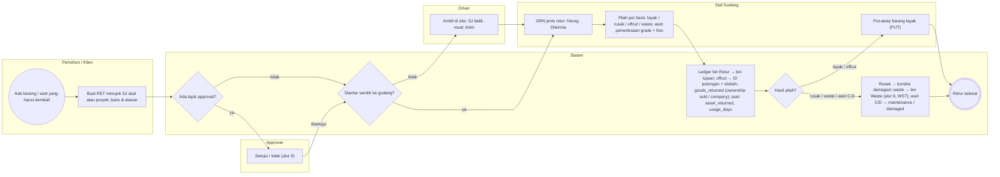
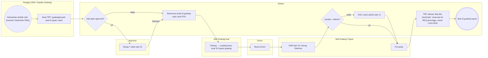
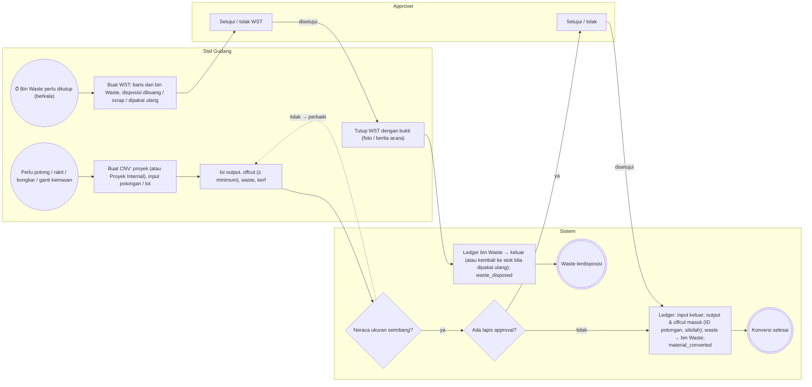
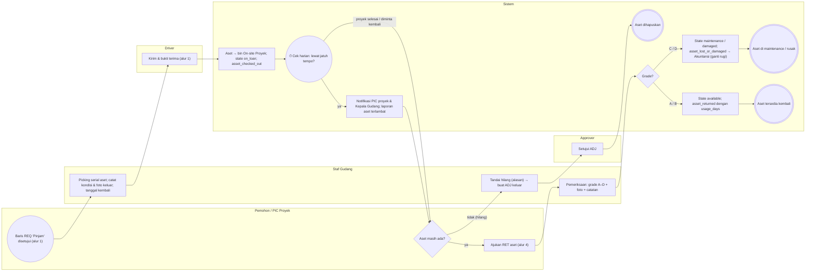

# Proses Bisnis To-Be — Alur 4–7 (retur, transfer, konversi & waste, aset)

**Versi:** 0.1 (draf Part 2)
**Tanggal:** 23 September 2026
**Status:** **draf berdasarkan nilai default asumsi A-25–A-49** yang belum divalidasi; setiap alur mencantumkan asumsi yang dipakainya. Bila asumsi berubah, ubah data di [`diagram/_generate.py`](../diagram/_generate.py) dan jalankan ulang — file ini dan `.drawio` dibuat otomatis, **jangan diedit manual**.
**Dokumen terkait:** [Blueprint §7](01-blueprint.md#7-dokumen--alur-utama) · [Aturan Bisnis](05-aturan-bisnis.md) · [Katalog Status](06-katalog-status-dan-enum.md) · [Keputusan & Asumsi](04-keputusan-dan-asumsi.md) · [Alur 1–3](07-proses-bisnis.md) · [Alur 8–10](07b-proses-bisnis-pendukung.md)

Lanjutan dari [07-proses-bisnis.md](07-proses-bisnis.md); daftar alur lengkap ada di sana.

Konvensi: ● awal · ⏱ awal berbasis waktu · ◇ gateway XOR · ◉ akhir · panah putus-putus = jalur balik (loop). Status memakai nilai `enum` dari Katalog Status. Diagram `.drawio` dibuka dengan diagrams.net / ekstensi Draw.io di VS Code.

---

## Alur 4 — Retur dari proyek dan pemilahan

**Diagram:** [`diagram/bpmn-04-retur-dan-pemilahan.drawio`](../diagram/bpmn-04-retur-dan-pemilahan.drawio) · **Asumsi yang dipakai (default):** [A-26](04-keputusan-dan-asumsi.md#a-26), [A-33](04-keputusan-dan-asumsi.md#a-33), [A-36](04-keputusan-dan-asumsi.md#a-36) · **Aturan:** [BR-RET-01–05](05-aturan-bisnis.md#br-ret), [BR-AST-03](05-aturan-bisnis.md#br-ast) · **Status:** `RET`, `SJ`, `GRN`, `AST`

Barang kembali dari proyek atau klien: sisa material, barang jual-putus yang tidak terpakai (A-26), atau aset yang selesai dipinjam. RET adalah dokumen niat; pergerakan fisik lewat SJ balik (opsional) dan GRN jenis retur, lalu dipilah.

**Lane (aktor):** Pemohon / Klien · Approver · Driver · Staf Gudang · Sistem

### Langkah

| # | Lane | Langkah | Status / efek / aturan |
|---|---|---|---|
| 1 | Pemohon / Klien | ● Ada barang / aset yang harus kembali |  |
| 2 | Pemohon / Klien | Buat RET merujuk SJ asal atau proyek; baris & alasan | RET submitted; [BR-RET-03](05-aturan-bisnis.md#br-ret), [BR-RET-05](05-aturan-bisnis.md#br-ret) |
| 3 | Sistem | ◇ Ada lapis approval? |  |
| 4 | Approver | Setujui / tolak (alur 9) | RET approved / rejected |
| 5 | Sistem | ◇ Diantar sendiri ke gudang? |  |
| 6 | Driver | Ambil di site: SJ balik, muat, kirim | SJ prepared → shipped; RET in_progress |
| 7 | Staf Gudang | GRN jenis retur: hitung, Diterima | GRN received; RET received; ledger → bin Retur |
| 8 | Staf Gudang | Pilah per baris: layak / rusak / offcut / waste; aset: pemeriksaan grade + foto | return_sorting; [BR-RET-04](05-aturan-bisnis.md#br-ret); [BR-AST-03](05-aturan-bisnis.md#br-ast) |
| 9 | Sistem | Ledger bin Retur → bin tujuan; offcut → ID potongan + silsilah; goods_returned (ownership sold / company); aset: asset_returned, usage_days | RET sorted; AST inspected; BR §14 |
| 10 | Sistem | ◇ Hasil pilah? |  |
| 11 | Staf Gudang | Put-away barang layak (PUT) | PUT |
| 12 | Sistem | Rusak → kondisi damaged; waste → bin Waste (alur 6, WST); aset C/D → maintenance / damaged |  |
| 13 | Sistem | ◉ Retur selesai |  |

### Percabangan

| Gateway | Cabang → langkah |
|---|---|
| Ada lapis approval? | *ya* → Setujui / tolak (alur 9) · *tidak* → Diantar sendiri ke gudang? |
| Diantar sendiri ke gudang? | *tidak* → Ambil di site: SJ balik, muat, kirim · *ya* → GRN jenis retur: hitung, Diterima |
| Hasil pilah? | *layak / offcut* → Put-away barang layak (PUT) · *rusak / waste / aset C-D* → Rusak → kondisi damaged; waste → bin Waste (alur 6, WST); aset C/D → maintenance / damaged |

### Diagram (Mermaid)

> Klien hanya bisa mengajukan RET untuk barang berstatus *Terkirim ke Klien* atau aset `on_loan` di proyeknya ([BR-RET-05](05-aturan-bisnis.md#br-ret)). Baris jual-putus yang kembali menghasilkan `goods_returned` dengan `ownership = sold` (retur penjualan di Akuntansi).

## Alur 5 — Transfer antar gudang dan antar proyek

**Diagram:** [`diagram/bpmn-05-transfer-antar-gudang-proyek.drawio`](../diagram/bpmn-05-transfer-antar-gudang-proyek.drawio) · **Asumsi yang dipakai (default):** [A-30](04-keputusan-dan-asumsi.md#a-30), [A-33](04-keputusan-dan-asumsi.md#a-33), [A-43](04-keputusan-dan-asumsi.md#a-43) · **Aturan:** [BR-RET-01](05-aturan-bisnis.md#br-ret), [BR-RET-02](05-aturan-bisnis.md#br-ret), [BR-STK-13](05-aturan-bisnis.md#br-stk), [BR-GEN-06](05-aturan-bisnis.md#br-gen) · **Status:** `TRF`, `PCK`, `SJ`, `GRN`, `PUT`

TRF dibuat manual atau otomatis dari backorder REQ. Sebagai dokumen niat, TRF memakai jalur fisik yang sama dengan pengiriman: PCK di gudang asal, SJ, GRN di gudang tujuan, PUT. Transfer antar proyek = transfer antar Gudang Site (atau bin on_site untuk aset).

**Lane (aktor):** Pengaju (Staf / Kepala Gudang) · Approver · Staf Gudang Asal · Driver · Staf Gudang Tujuan · Sistem

### Langkah

| # | Lane | Langkah | Status / efek / aturan |
|---|---|---|---|
| 1 | Pengaju (Staf / Kepala Gudang) | ● Kebutuhan pindah stok (manual / backorder REQ) |  |
| 2 | Pengaju (Staf / Kepala Gudang) | Buat TRF: gudang/proyek asal & tujuan, baris | TRF submitted; nomor memakai gudang asal ([A-43](04-keputusan-dan-asumsi.md#a-43)) |
| 3 | Sistem | ◇ Ada lapis approval? |  |
| 4 | Approver | Setujui / tolak (alur 9) | TRF approved / rejected |
| 5 | Sistem | Reservasi lunak di gudang asal; buat PCK | TRF approved → in_progress; PCK pending; [BR-STK-04](05-aturan-bisnis.md#br-stk) |
| 6 | Staf Gudang Asal | Picking → Loading Area; buat SJ tujuan gudang | PCK completed; SJ prepared |
| 7 | Driver | Muat & kirim | SJ shipped; ledger → in_transit (milik gudang asal); goods_shipped; [BR-STK-13](05-aturan-bisnis.md#br-stk) |
| 8 | Staf Gudang Tujuan | GRN dari SJ: hitung, Diterima | GRN received; SJ delivered; stock_transferred |
| 9 | Sistem | ◇ Jumlah = dikirim? |  |
| 10 | Sistem | DSC untuk selisih (alur 1) | DSC open |
| 11 | Staf Gudang Tujuan | Put-away | PUT completed |
| 12 | Sistem | TRF selesai; bila dari backorder: reservasi ke REQ penunggu, saran cross-dock | TRF completed; [BR-REQ-08](05-aturan-bisnis.md#br-req) |
| 13 | Sistem | ◉ Stok di gudang tujuan |  |

### Percabangan

| Gateway | Cabang → langkah |
|---|---|
| Ada lapis approval? | *ya* → Setujui / tolak (alur 9) · *tidak* → Reservasi lunak di gudang asal; buat PCK |
| Jumlah = dikirim? | *tidak* → DSC untuk selisih (alur 1) · *ya* → Put-away |

### Diagram (Mermaid)

> TRF bisa dibatalkan sampai sebelum SJ `shipped`; setelah itu koreksi lewat DSC atau TRF balik. Selama `in_transit`, stok masih dihitung milik gudang asal di laporan saldo.

## Alur 6 — Konversi material, offcut, dan berita acara waste

**Diagram:** [`diagram/bpmn-06-konversi-dan-waste.drawio`](../diagram/bpmn-06-konversi-dan-waste.drawio) · **Asumsi yang dipakai (default):** [A-06](04-keputusan-dan-asumsi.md#a-06), [A-19](04-keputusan-dan-asumsi.md#a-19), [A-36](04-keputusan-dan-asumsi.md#a-36) · **Aturan:** [BR-CNV-01–05](05-aturan-bisnis.md#br-cnv), [BR-GEN-04](05-aturan-bisnis.md#br-gen) · **Status:** `CNV`, `WST`

Pembeda utama produk: pipa/lembar dipotong menjadi item lain; sisa menjadi offcut (kembali ke stok dengan ID baru dan silsilah) atau waste. Waste ditutup lewat Berita Acara Waste dengan disposisi.

**Lane (aktor):** Staf Gudang · Approver · Sistem

### Langkah

| # | Lane | Langkah | Status / efek / aturan |
|---|---|---|---|
| 1 | Staf Gudang | ● Perlu potong / rakit / bongkar / ganti kemasan |  |
| 2 | Staf Gudang | ⏱ Bin Waste perlu ditutup (berkala) |  |
| 3 | Staf Gudang | Buat CNV: proyek (atau Proyek Internal), input potongan / lot | CNV draft; [BR-CNV-01](05-aturan-bisnis.md#br-cnv) |
| 4 | Staf Gudang | Buat WST: baris dari bin Waste, disposisi dibuang / scrap / dipakai ulang | WST submitted |
| 5 | Staf Gudang | Isi output, offcut (≥ minimum), waste, kerf | [BR-CNV-03](05-aturan-bisnis.md#br-cnv); [A-19](04-keputusan-dan-asumsi.md#a-19) |
| 6 | Approver | Setujui / tolak WST | WST approved |
| 7 | Staf Gudang | Tutup WST dengan bukti (foto / berita acara) | WST closed |
| 8 | Sistem | ◇ Neraca ukuran seimbang? | [BR-CNV-02](05-aturan-bisnis.md#br-cnv) |
| 9 | Sistem | ◇ Ada lapis approval? |  |
| 10 | Sistem | Ledger bin Waste → keluar (atau kembali ke stok bila dipakai ulang); waste_disposed | BR §14 |
| 11 | Approver | Setujui / tolak | CNV pending_approval |
| 12 | Sistem | ◉ Waste terdisposisi |  |
| 13 | Sistem | Ledger: input keluar; output & offcut masuk (ID potongan, silsilah); waste → bin Waste; material_converted | CNV completed; [BR-CNV-04](05-aturan-bisnis.md#br-cnv) |
| 14 | Sistem | ◉ Konversi selesai |  |

### Percabangan

| Gateway | Cabang → langkah |
|---|---|
| Neraca ukuran seimbang? | *tidak → perbaiki* → Isi output, offcut (≥ minimum), waste, kerf · *ya* → Ada lapis approval? |
| Ada lapis approval? | *ya* → Setujui / tolak · *tidak* → Ledger: input keluar; output & offcut masuk (ID potongan, silsilah); waste → bin Waste; material_converted |
| Bin Waste perlu ditutup (berkala) | *→* → Buat WST: baris dari bin Waste, disposisi dibuang / scrap / dipakai ulang |

### Diagram (Mermaid)

> CNV `completed` hanya bisa dibalik bila semua output & offcut masih di bin dan belum dipakai ([BR-CNV-05](05-aturan-bisnis.md#br-cnv)). Resep konversi (F2) hanya mempercepat pengisian, tidak mengunci hasil nyata.

## Alur 7 — Aset dipinjamkan: keluar, jatuh tempo, kembali, hilang

**Diagram:** [`diagram/bpmn-07-aset-dipinjamkan.drawio`](../diagram/bpmn-07-aset-dipinjamkan.drawio) · **Asumsi yang dipakai (default):** [A-29](04-keputusan-dan-asumsi.md#a-29), [A-38](04-keputusan-dan-asumsi.md#a-38) · **Aturan:** [BR-AST-01–07](05-aturan-bisnis.md#br-ast), [BR-STK-08](05-aturan-bisnis.md#br-stk), [BR-STK-14](05-aturan-bisnis.md#br-stk) · **Status:** `AST`, `ADJ`

Siklus aset ber-serial: keluar bersama pengiriman (alur 1), berada di bin virtual On-site Proyek, diingatkan saat lewat jatuh tempo, kembali lewat retur (alur 4) dengan pemeriksaan, atau ditandai hilang dan dihapuskan lewat ADJ.

**Lane (aktor):** Pemohon / PIC Proyek · Staf Gudang · Driver · Approver · Sistem

### Langkah

| # | Lane | Langkah | Status / efek / aturan |
|---|---|---|---|
| 1 | Pemohon / PIC Proyek | ● Baris REQ 'Pinjam' disetujui (alur 1) | line_ownership = loan; [A-38](04-keputusan-dan-asumsi.md#a-38) |
| 2 | Staf Gudang | Picking serial aset; catat kondisi & foto keluar; tanggal kembali | AST; due_return_date; [BR-STK-08](05-aturan-bisnis.md#br-stk) |
| 3 | Driver | Kirim & bukti terima (alur 1) | SJ delivered |
| 4 | Sistem | Aset → bin On-site Proyek; state on_loan; asset_checked_out | AST checked_out; [BR-AST-01](05-aturan-bisnis.md#br-ast) |
| 5 | Sistem | ⏱ Cek harian: lewat jatuh tempo? | [BR-AST-06](05-aturan-bisnis.md#br-ast) |
| 6 | Sistem | Notifikasi PIC proyek & Kepala Gudang; laporan aset terlambat |  |
| 7 | Pemohon / PIC Proyek | ◇ Aset masih ada? |  |
| 8 | Pemohon / PIC Proyek | Ajukan RET aset (alur 4) | RET |
| 9 | Staf Gudang | Tandai hilang (alasan) → buat ADJ keluar | asset_state lost; asset_lost_or_damaged; ADJ submitted |
| 10 | Staf Gudang | Pemeriksaan: grade A–D + foto + catatan | AST returned → inspected; [BR-AST-03](05-aturan-bisnis.md#br-ast) |
| 11 | Approver | Setujui ADJ | ADJ approved → posted; stock_adjusted |
| 12 | Sistem | ◇ Grade? |  |
| 13 | Sistem | ◉ Aset dihapuskan | asset_state written_off |
| 14 | Sistem | State available; asset_returned dengan usage_days | [BR-AST-05](05-aturan-bisnis.md#br-ast) |
| 15 | Sistem | State maintenance / damaged; asset_lost_or_damaged → Akuntansi (ganti rugi) | [BR-AST-04](05-aturan-bisnis.md#br-ast) |
| 16 | Sistem | ◉ Aset tersedia kembali |  |
| 17 | Sistem | ◉ Aset di maintenance / rusak |  |

### Percabangan

| Gateway | Cabang → langkah |
|---|---|
| Cek harian: lewat jatuh tempo? | *ya* → Notifikasi PIC proyek & Kepala Gudang; laporan aset terlambat · *proyek selesai / diminta kembali* → Aset masih ada? |
| Aset masih ada? | *ya* → Ajukan RET aset (alur 4) · *tidak (hilang)* → Tandai hilang (alasan) → buat ADJ keluar |
| Grade? | *A / B* → State available; asset_returned dengan usage_days · *C / D* → State maintenance / damaged; asset_lost_or_damaged → Akuntansi (ganti rugi) |

### Diagram (Mermaid)

> Peminjaman ke orang (bukan proyek klien) wajib memakai Proyek Internal agar bin on_site selalu punya proyek ([BR-AST-02](05-aturan-bisnis.md#br-ast)). Aset dalam maintenance tidak bisa dicadangkan (F2).
