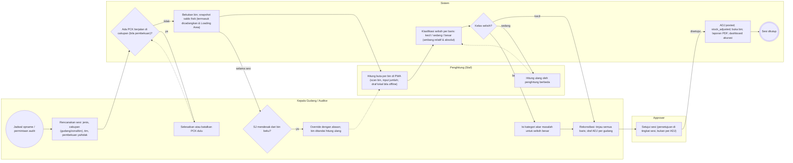
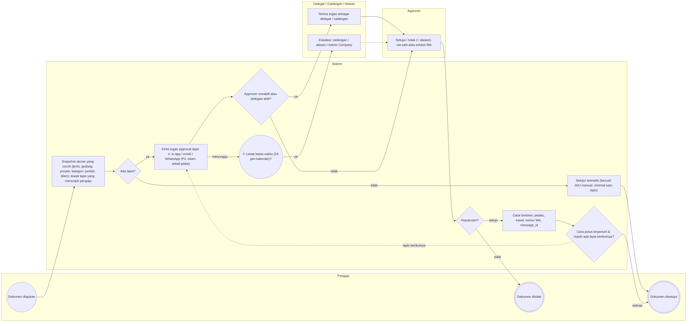
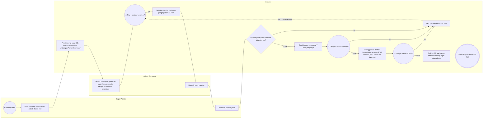

# Proses Bisnis To-Be — Alur 8–10 (opname, approval, langganan)

**Versi:** 0.1 (draf Part 2)
**Tanggal:** 23 September 2026
**Status:** **draf berdasarkan nilai default asumsi A-25–A-49** yang belum divalidasi; setiap alur mencantumkan asumsi yang dipakainya. Bila asumsi berubah, ubah data di [`diagram/_generate.py`](../diagram/_generate.py) dan jalankan ulang — file ini dan `.drawio` dibuat otomatis, **jangan diedit manual**.
**Dokumen terkait:** [Blueprint §7](01-blueprint.md#7-dokumen--alur-utama) · [Aturan Bisnis](05-aturan-bisnis.md) · [Katalog Status](06-katalog-status-dan-enum.md) · [Keputusan & Asumsi](04-keputusan-dan-asumsi.md) · [Alur 1–3](07-proses-bisnis.md) · [Alur 4–7](07a-proses-bisnis-lanjutan.md)

Lanjutan dari [07-proses-bisnis.md](07-proses-bisnis.md); daftar alur lengkap ada di sana.

Konvensi: ● awal · ⏱ awal berbasis waktu · ◇ gateway XOR · ◉ akhir · panah putus-putus = jalur balik (loop). Status memakai nilai `enum` dari Katalog Status. Diagram `.drawio` dibuka dengan diagrams.net / ekstensi Draw.io di VS Code.

---

## Alur 8 — Stock opname: sesi, hitung buta, hitung ulang, rekonsiliasi

**Diagram:** [`diagram/bpmn-08-stock-opname.drawio`](../diagram/bpmn-08-stock-opname.drawio) · **Asumsi yang dipakai (default):** [A-09](04-keputusan-dan-asumsi.md#a-09), [A-42](04-keputusan-dan-asumsi.md#a-42), [A-46](04-keputusan-dan-asumsi.md#a-46) · **Aturan:** [BR-OPN-01–08](05-aturan-bisnis.md#br-opn) · **Status:** `OPN`, `ADJ`

Sesi opname bulanan/tahunan/ad-hoc dengan pembekuan bin opsional, hitung buta, klasifikasi selisih berdasarkan ambang relatif dan absolut, hitung ulang oleh orang berbeda, dan rekonsiliasi yang menghasilkan satu ADJ per gudang yang disetujui di tingkat sesi.

**Lane (aktor):** Kepala Gudang / Auditor · Penghitung (Staf) · Approver · Sistem

### Langkah

| # | Lane | Langkah | Status / efek / aturan |
|---|---|---|---|
| 1 | Kepala Gudang / Auditor | ● Jadwal opname / permintaan audit |  |
| 2 | Kepala Gudang / Auditor | Rencanakan sesi: jenis, cakupan (gudang/zona/bin), tim, pembekuan ya/tidak | OPN planned |
| 3 | Sistem | ◇ Ada PCK berjalan di cakupan (bila pembekuan)? | [BR-OPN-02](05-aturan-bisnis.md#br-opn) |
| 4 | Kepala Gudang / Auditor | Selesaikan atau batalkan PCK dulu |  |
| 5 | Sistem | Bekukan bin; snapshot saldo fisik (termasuk dicadangkan & Loading Area) | OPN in_progress; bin frozen; [BR-OPN-01](05-aturan-bisnis.md#br-opn) |
| 6 | Kepala Gudang / Auditor | ◇ SJ mendesak dari bin beku? |  |
| 7 | Penghitung (Staf) | Hitung buta per bin di PWA (scan bin, input jumlah; draf lokal bila offline) | count_assignment; blind_count |
| 8 | Kepala Gudang / Auditor | Override dengan alasan; bin ditandai hitung ulang | [BR-OPN-02](05-aturan-bisnis.md#br-opn) |
| 9 | Sistem | Klasifikasi selisih per baris: kecil / sedang / besar (ambang relatif & absolut) | variance_class; [BR-OPN-04](05-aturan-bisnis.md#br-opn) |
| 10 | Sistem | ◇ Kelas selisih? |  |
| 11 | Kepala Gudang / Auditor | Isi kategori akar masalah untuk selisih besar | root_cause_category; [BR-OPN-07](05-aturan-bisnis.md#br-opn) |
| 12 | Penghitung (Staf) | Hitung ulang oleh penghitung berbeda | OPN recount; [BR-OPN-05](05-aturan-bisnis.md#br-opn) |
| 13 | Kepala Gudang / Auditor | Rekonsiliasi: tinjau semua baris; draf ADJ per gudang | OPN reconciling; ADJ submitted |
| 14 | Approver | Setujui sesi (persetujuan di tingkat sesi, bukan per ADJ) | OPN approved; [A-09](04-keputusan-dan-asumsi.md#a-09); [BR-OPN-06](05-aturan-bisnis.md#br-opn) |
| 15 | Sistem | ADJ posted; stock_adjusted; buka bin; laporan PDF; dashboard akurasi | OPN closed |
| 16 | Sistem | ◉ Sesi ditutup |  |

### Percabangan

| Gateway | Cabang → langkah |
|---|---|
| Ada PCK berjalan di cakupan (bila pembekuan)? | *ya* → Selesaikan atau batalkan PCK dulu · *tidak* → Bekukan bin; snapshot saldo fisik (termasuk dicadangkan & Loading Area) |
| Kelas selisih? | *sedang* → Hitung ulang oleh penghitung berbeda · *besar* → Isi kategori akar masalah untuk selisih besar · *kecil* → Rekonsiliasi: tinjau semua baris; draf ADJ per gudang |
| SJ mendesak dari bin beku? | *ya* → Override dengan alasan; bin ditandai hitung ulang |

### Diagram (Mermaid)

> Transaksi PWA offline yang tiba saat bin beku masuk antrean tinjauan (F2, [BR-OPN-03](05-aturan-bisnis.md#br-opn)). Auditor eksternal (F2) memakai akun tamu berbatas gudang & periode.

## Alur 9 — Approval generik (semua jenis dokumen)

**Diagram:** [`diagram/bpmn-09-approval-generik.drawio`](../diagram/bpmn-09-approval-generik.drawio) · **Asumsi yang dipakai (default):** [A-08](04-keputusan-dan-asumsi.md#a-08), [A-09](04-keputusan-dan-asumsi.md#a-09), [A-18](04-keputusan-dan-asumsi.md#a-18), [A-45](04-keputusan-dan-asumsi.md#a-45) · **Aturan:** [BR-APR-01–11](05-aturan-bisnis.md#br-apr) · **Status:** `(semua dokumen dengan pending_approval)`

Mesin approval yang dipakai REQ, TRF, RET, CNV, ADJ, WST, PRQ, RTV, dan OPN. Aturan di-snapshot saat diajukan, lapis diproses sesuai cara putus, dengan delegasi, eskalasi, dan pemisahan tugas.

**Lane (aktor):** Pengaju · Sistem · Approver · Delegat / Cadangan / Atasan

### Langkah

| # | Lane | Langkah | Status / efek / aturan |
|---|---|---|---|
| 1 | Pengaju | ● Dokumen diajukan | submitted |
| 2 | Sistem | Snapshot aturan yang cocok (jenis, gudang, proyek, kategori, jumlah, klien); lewati lapis yang menunjuk pengaju | [BR-APR-01](05-aturan-bisnis.md#br-apr), [BR-APR-03](05-aturan-bisnis.md#br-apr), [BR-APR-07](05-aturan-bisnis.md#br-apr) |
| 3 | Sistem | ◇ Ada lapis? |  |
| 4 | Sistem | Setujui otomatis (kecuali ADJ manual: minimal satu lapis) | approved; [BR-APR-02](05-aturan-bisnis.md#br-apr) |
| 5 | Sistem | Kirim tugas approval lapis n: in-app / email / WhatsApp (F2, token sekali pakai) | pending_approval; [BR-APR-10](05-aturan-bisnis.md#br-apr) |
| 6 | Sistem | ◇ Approver nonaktif atau delegasi aktif? | [BR-APR-05](05-aturan-bisnis.md#br-apr), [BR-APR-06](05-aturan-bisnis.md#br-apr) |
| 7 | Sistem | ⏱ Lewat batas waktu (24 jam kalender)? | [BR-APR-08](05-aturan-bisnis.md#br-apr) |
| 8 | Delegat / Cadangan / Atasan | Terima tugas sebagai delegat / cadangan | approval_decision delegated |
| 9 | Delegat / Cadangan / Atasan | Eskalasi: cadangan / atasan / Admin Company | approval_decision escalated |
| 10 | Approver | Setujui / tolak (+ alasan); via web atau tombol WA | [BR-APR-09](05-aturan-bisnis.md#br-apr): keputusan pertama menang |
| 11 | Sistem | ◇ Keputusan? |  |
| 12 | Pengaju | ◉ Dokumen ditolak | rejected; notifikasi |
| 13 | Sistem | Catat timeline: pelaku, kanal, nomor WA, message_id | document_timeline |
| 14 | Sistem | ◇ Cara putus terpenuhi & masih ada lapis berikutnya? | berurutan / salah satu / semua |
| 15 | Pengaju | ◉ Dokumen disetujui | approved |

### Percabangan

| Gateway | Cabang → langkah |
|---|---|
| Ada lapis? | *tidak* → Setujui otomatis (kecuali ADJ manual: minimal satu lapis) · *ya* → Kirim tugas approval lapis n: in-app / email / WhatsApp (F2, token sekali pakai) |
| Approver nonaktif atau delegasi aktif? | *ya* → Terima tugas sebagai delegat / cadangan · *tidak* → Setujui / tolak (+ alasan); via web atau tombol WA |
| Lewat batas waktu (24 jam kalender)? | *ya* → Eskalasi: cadangan / atasan / Admin Company |
| Keputusan? | *tolak* → Dokumen ditolak · *setuju* → Catat timeline: pelaku, kanal, nomor WA, message_id |
| Cara putus terpenuhi & masih ada lapis berikutnya? | *lapis berikutnya* → Kirim tugas approval lapis n: in-app / email / WhatsApp (F2, token sekali pakai) · *selesai* → Dokumen disetujui |

### Diagram (Mermaid)

> Orang yang sama di dua lapis berurutan cukup menyetujui sekali ([BR-APR-04](05-aturan-bisnis.md#br-apr)). Simulasi aturan wajib tersedia saat menyusun aturan ([BR-APR-11](05-aturan-bisnis.md#br-apr)).

## Alur 10 — Siklus langganan company (platform)

**Diagram:** [`diagram/bpmn-10-langganan-company.drawio`](../diagram/bpmn-10-langganan-company.drawio) · **Asumsi yang dipakai (default):** [A-11](04-keputusan-dan-asumsi.md#a-11), [A-12](04-keputusan-dan-asumsi.md#a-12), [A-27](04-keputusan-dan-asumsi.md#a-27), [A-44](04-keputusan-dan-asumsi.md#a-44) · **Aturan:** [BR-SUB-01–04](05-aturan-bisnis.md#br-sub) · **Status:** `subscription_status`

Dari pembuatan company sampai penghentian: provisioning otomatis, trial, tagihan bulanan dengan pembayaran manual, tenggang, penangguhan hanya-baca, dan pengakhiran dengan masa ekspor.

**Lane (aktor):** Super Admin · Admin Company · Sistem

### Langkah

| # | Lane | Langkah | Status / efek / aturan |
|---|---|---|---|
| 1 | Super Admin | ● Company baru |  |
| 2 | Super Admin | Buat company: subdomain, paket, durasi trial |  |
| 3 | Sistem | Provisioning: buat DB, migrasi, data awal, undangan Admin Company | subscription trial; [A-11](04-keputusan-dan-asumsi.md#a-11) |
| 4 | Admin Company | Terima undangan; jalankan wizard setup; setujui kebijakan privasi & ketentuan | NFR-11 |
| 5 | Sistem | ⏱ Trial / periode berakhir? |  |
| 6 | Sistem | Terbitkan tagihan bulanan; pengingat email / WA | subscription_invoice |
| 7 | Admin Company | Unggah bukti transfer | subscription_payment |
| 8 | Super Admin | Verifikasi pembayaran |  |
| 9 | Sistem | ◇ Pembayaran valid sebelum jatuh tempo? |  |
| 10 | Sistem | Jatuh tempo: tenggang 7 hari, pengingat | past_due; [BR-SUB-01](05-aturan-bisnis.md#br-sub) |
| 11 | Sistem | ⏱ Dibayar dalam tenggang? |  |
| 12 | Sistem | Ditangguhkan 30 hari: hanya-baca, antrean PWA ditahan, job & token WA berhenti | suspended; [BR-SUB-02](05-aturan-bisnis.md#br-sub); [A-44](04-keputusan-dan-asumsi.md#a-44) |
| 13 | Sistem | ⏱ Dibayar dalam 30 hari? |  |
| 14 | Sistem | Aktif; perpanjang masa aktif | subscription active |
| 15 | Sistem | Diakhiri: 90 hari hanya Admin Company login untuk ekspor | terminated; [BR-SUB-03](05-aturan-bisnis.md#br-sub) |
| 16 | Sistem | ◉ Data dihapus setelah 90 hari | [A-12](04-keputusan-dan-asumsi.md#a-12) |

### Percabangan

| Gateway | Cabang → langkah |
|---|---|
| Trial / periode berakhir? | *ya* → Terbitkan tagihan bulanan; pengingat email / WA |
| Pembayaran valid sebelum jatuh tempo? | *ya* → Aktif; perpanjang masa aktif · *tidak* → Jatuh tempo: tenggang 7 hari, pengingat |
| Dibayar dalam tenggang? | *ya* → Aktif; perpanjang masa aktif · *tidak* → Ditangguhkan 30 hari: hanya-baca, antrean PWA ditahan, job & token WA berhenti |
| Dibayar dalam 30 hari? | *ya* → Aktif; perpanjang masa aktif · *tidak* → Diakhiri: 90 hari hanya Admin Company login untuk ekspor |

### Diagram (Mermaid)

> Super Admin tidak bisa membuka data operasional company tanpa akses dukungan yang diberikan Admin Company ([BR-SUB-04](05-aturan-bisnis.md#br-sub)). Payment gateway (F3) menggantikan langkah unggah bukti & verifikasi manual.
