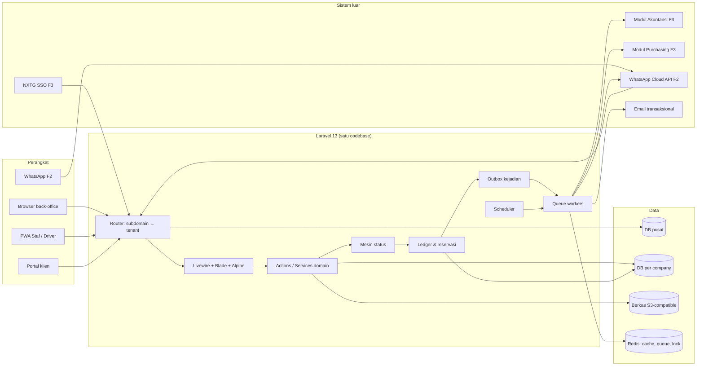

# Arsitektur Sistem

**Versi:** 0.17 (Part 3; v0.17: §12 Purchasing inti Fase 1b dibangun; §4, §10, §12 diselaraskan dengan kode 24 Sep 2026; §4 mesin approval, [A-92](04-keputusan-dan-asumsi.md#a-92); v0.9: §4 dan §12 modul Count/Adjustment; v0.10: §4 dan §12 modul Transfer/Retur; v0.16: §7 job konfirmasi otomatis & pengingat harian, §12 Pendukung F1; v0.15: §3 langkah 5, §7 siklus langganan, §12 modul Platform penuh; v0.14: §7 job titik pesan ulang, §12 modul PurchaseRequest; v0.13: §12 modul Asset; v0.12: §10 profil rumah XAMPP3 (A-162), §12 modul Conversion/Waste; v0.11: §12 modul Issue)
**Tanggal:** 24 September 2026
**Status:** berlaku (asumsi A-25–A-71 disetujui; [A-73](04-keputusan-dan-asumsi.md#a-73), [A-76](04-keputusan-dan-asumsi.md#a-76) menunggu validasi); keputusan arsitektur diberi ID `AD-xx` dan berlaku sampai diganti. Paket diverifikasi terhadap Laravel 13 pada 23 Sep 2026 (menutup [O-01](04-keputusan-dan-asumsi.md#o-01))
**Dokumen terkait:** [Blueprint §17](01-blueprint.md#17-stack-teknologi) · [Model data 08a](08a-model-data-inti.md) · [08b](08b-model-data-stok-dokumen.md) · [08c](08c-model-data-pendukung.md) · [Aturan Bisnis](05-aturan-bisnis.md) · [Riset §2.8](02-riset-wms-sejenis.md#28-riset-teknis-untuk-part-3)

---

## 1. Gambaran



Prinsip: satu aplikasi Laravel melayani database pusat dan semua database tenant; tidak ada layanan terpisah di Fase 1. Modul Akuntansi dan Purchasing (Fase 3) berada di luar aplikasi ini dan hanya berkomunikasi lewat kejadian.

## 2. Keputusan arsitektur

| ID | Keputusan | Alasan | Konsekuensi |
|---|---|---|---|
| AD-01 | **Tenancy multi-database dengan `stancl/tenancy` v3**, identifikasi lewat subdomain; DB pusat = koneksi `central`, DB tenant = koneksi `tenant` yang diganti per request | Satu-satunya paket multi-DB matang yang sudah mendukung Laravel 13 (§9); sesuai D-03 | Job antrean & scheduler harus membawa `tenant_id` (paket menyediakan); migrasi tenant lewat `tenants:migrate` dengan log ke `tenant_migration_runs` |
| AD-02 | **Struktur kode modular per domain** (`app/Domain/<Modul>/{Models,Actions,States,Livewire,Policies}`), bukan per lapisan | Spesifikasi modul Part 4 dan prompt Part 6 dipetakan 1:1 ke folder | Konvensi penamaan wajib ditulis di `CLAUDE.md` repo kode |
| AD-03 | **Mesin status sebagai enum PHP 8.3 + kelas transisi** per dokumen, dibangkitkan dari [Katalog Status](06-katalog-status-dan-enum.md); tidak memakai paket state machine | Katalog sudah menjadi sumber kebenaran; paket menambah abstraksi tanpa manfaat | Tes transisi otomatis dari blok YAML Katalog |
| AD-04 | **Ledger & reservasi dalam satu transaksi DB** dengan `SELECT … FOR UPDATE` pada `stock_balances`, urutan kunci tetap (item_id, bin_id, lot/serial/piece, status) untuk mencegah deadlock; Redis lock hanya untuk operasi lintas tabel panjang (opname mulai) | NFR-13, BR-STK-06 | Semua mutasi stok lewat satu `StockLedgerService::post()`; tidak ada model yang menulis `stock_movements` langsung |
| AD-05 | **Kejadian stok memakai pola outbox**: baris `stock_events` ditulis dalam transaksi yang sama dengan ledger; job `PublishStockEvents` memproses berurutan per `source`; konsumen Fase 1 = tabel saja (dibaca laporan), Fase 3 = adapter HTTP webhook/antrean ke Akuntansi & Purchasing | Jaminan tidak ada kejadian hilang; idempoten via `event_id` | `published_at` null = belum terkirim; pemantauan antrean outbox (NFR-15) |
| AD-06 | **Permission memakai `spatie/laravel-permission`** untuk role & permission, **cakupan role × scope diimplementasikan sendiri** (`role_assignments`) dan dievaluasi oleh Policy + global scope query | Paket tidak mendukung scope per penugasan; BR-GEN-09 | Setiap query daftar memakai `ScopedToUser` global scope per gudang/proyek |
| AD-07 | **Audit log memakai `spatie/laravel-activitylog`** (tabel `audit_logs` dengan konfigurasi nama), **timeline dokumen tabel sendiri** | BR-GEN-05 | Model dokumen memakai trait `LogsActivity` + `HasTimeline` |
| AD-08 | **PDF dengan `barryvdh/laravel-dompdf`**, barcode Code128 dengan `picqer/php-barcode-generator`, QR dengan `bacon/bacon-qr-code` v3 langsung (bukan `endroid` 6 yang menuntut PHP 8.4, bukan `simplesoftwareio` yang bergantung bacon v2) | Verifikasi §9; PHP 8.3 (D-04) | Template dokumen dirender Blade → HTML → DomPDF; label thermal memakai ukuran kertas khusus |
| AD-09 | **Impor/ekspor Excel dengan `maatwebsite/excel` v4**; pratinjau & validasi baris disimpan di `import_batches/rows` sebelum commit | Blueprint 6.3a | Impor besar dijalankan sebagai job antrean |
| AD-10 | **Berkas di disk S3-compatible** (produksi) / `local` (dev) lewat Flysystem; foto dikompres di sisi klien (PWA, canvas) sebelum unggah, batas 5 MB divalidasi server | NFR-14, A-23 | Penyedia ditentukan [O-14](04-keputusan-dan-asumsi.md#o-14) |
| AD-11 | **Antrean & cache di Redis**; antrean terpisah: `default`, `notifications`, `events`, `imports`, `sync` | Isolasi beban; job kejadian tidak tertahan impor besar | Worker minimal 2 proses (default+events, notifications+imports+sync) |
| AD-12 | **PWA Fase 1 = Blade + Alpine + service worker (Vite PWA plugin)**, draf lokal di IndexedDB via Alpine persist; **Fase 2** menambah antrean `sync_queue` klien → endpoint `/api/sync` idempoten (id UUID dari perangkat) | A-49, Blueprint §11 | Tidak ada SPA terpisah; PWA memakai halaman Livewire yang sama dengan layout ringkas |
| AD-13 | **Nomor dokumen** dari `document_sequences` dengan `FOR UPDATE`; nomor sementara `TMP-<uuid>` untuk dokumen offline | BR-GEN-06, A-43 | Kolom `number` boleh berubah sekali (TMP → final); riwayat di timeline |
| AD-14 | **Enum disimpan sebagai VARCHAR(30)** + validasi aplikasi, bukan tipe ENUM MySQL | Migrasi per tenant aman saat nilai bertambah | CHECK constraint opsional di MySQL 8 |
| AD-15 | **Semua waktu UTC di DB**, konversi ke zona company di lapisan presentasi (Carbon + `company_settings.timezone`) | BR-GEN-07 | Scheduler harian per company dijalankan per zona (job dipecah per tenant) |

## 3. Tenancy & siklus request

1. Request masuk ke `abc.wms-domain.id/...`. Middleware tenancy mencari `companies.subdomain`, memuat koneksi `tenant`, memeriksa `subscriptions.status`:
   - `active`/`trial` → normal; `past_due` → normal + spanduk; `suspended` → hanya GET (kecuali unggah bukti bayar); `terminated` → hanya login Admin Company & ekspor ([BR-SUB-02..03](05-aturan-bisnis.md#br-sub)).
2. `auth.wms-domain.id` (pusat) hanya melayani: login Super Admin, callback SSO ([A-28](04-keputusan-dan-asumsi.md#a-28)), pemilih company ([A-48](04-keputusan-dan-asumsi.md#a-48)), landing page.
3. Portal klien = route group `/portal` di subdomain company, guard `web` yang sama, dibatasi role Klien ([BR-PRJ-07](05-aturan-bisnis.md#br-prj)).
4. Job antrean & scheduler: `stancl/tenancy` membungkus job dengan `tenant_id`; scheduler memanggil `tenants:run` untuk perintah harian (eskalasi approval, aset jatuh tempo, pengingat opname, langganan).
5. Provisioning company (Super Admin): `Platform\Actions\CreateCompany` → simpan `companies` (TenantCreated: buat DB + `tenants:migrate`) → `ProvisionCompany`: `TenantDatabaseSeeder` (role bawaan, satuan, tipe gudang, bin virtual, alasan, template) → Admin Company + `user_invitations` → company `active`; gagal → tetap `provisioning`, bisa dilanjutkan ([17-platform-login](17-platform-login.md), [A-176](04-keputusan-dan-asumsi.md#a-176)). Database company tidak pernah dihapus otomatis ([A-179](04-keputusan-dan-asumsi.md#a-179)).

## 4. Struktur kode

```
app/
├── Domain/
│   ├── Platform/        (companies, plans, subscriptions — koneksi central)
│   ├── Access/          (users, roles, role_assignments, org)
│   ├── Master/          (clients, projects, vendors, items, uom, lots, serials, pieces)
│   ├── Warehouse/       (warehouses, zones, racks, levels, bins)
│   ├── Stock/           (StockLedgerService, ReservationService, balances, events outbox)
│   ├── Request/         (material_requests) … satu folder per modul dokumen:
│   ├── Picking/ Shipment/ Receipt/ Putaway/ VendorReturn/ Transfer/ Return/ Issue/
│   ├── Conversion/ Asset/ Count/ Adjustment/ Waste/ PurchaseRequest/
│   ├── Approval/        (rules, snapshots, tasks, decisions, WA F2)
│   └── Shared/          (Timeline, Numbering, Attachments, Notifications, Templates, Import)
│   └── <Modul>/{Models, Enums, Actions, States, Livewire, Policies, Events, Jobs, Views}
├── Http/Middleware/     (tenancy, subscription gate, scope)
resources/views/{layouts, components, <modul>}   lang/id/*.php
database/migrations/{central, tenant}            tests/{Feature/<Modul>, Unit}
```

Aturan: model tidak berisi logika bisnis; setiap aksi bernama sesuai permission (`request.approve` → `Domain\Request\Actions\ApproveMaterialRequest`). Transisi status hanya lewat `States\<Doc>Transition::apply()` yang memeriksa guard Katalog, menulis timeline, dan memancarkan event Laravel untuk efek samping (notifikasi, job).

> **Keadaan kode 24 Sep 2026 (Access s.d. Picking/Shipment):** `States\<Doc>Transition`, trait `HasTimeline`, dan tabel `document_timelines` **belum dibangun**; transisi dijaga di dalam kelas aksi (`SubmitRequest`, `ShipShipment`, …) dengan enum status dari Katalog. Picking tinggal di `Domain/Shipment`, bukan `Picking/`. `Stock` memakai `Support/StockLedger` (bukan `StockLedgerService`) dan `Actions/ManageReservation` (bukan `ReservationService`). `Shared` baru berisi `Reports/` dan `Files/` ([16-shared-laporan-berkas](16-shared-laporan-berkas.md)); `Platform` baru model, enum, dan login Super Admin ([17-platform-login](17-platform-login.md)). Beberapa aksi memegang lebih dari satu permission ([A-73](04-keputusan-dan-asumsi.md#a-73)). `Count/` dan `Adjustment/` dibangun terpisah sesuai pohon di atas ([21-opname-penyesuaian](21-opname-penyesuaian.md)); ADJ hasil opname dibuat dan diposting oleh `Count` lewat model dan `AdjustmentPoster` milik `Adjustment`. `Transfer/` dan `Return/` juga terpisah ([22-retur-transfer](22-retur-transfer.md)); kaki fisiknya memakai aksi `Shipment` (`CreatePickTask::forTransfer/forGoodsReturn`) dan `Receipt` (GRN transfer/retur), yang memanggil balik `TransferProgress`/`ReturnProgress` — pola yang sama dengan `RequestFulfillment`. Namespace `App\Domain\Return` sah di PHP 8 (kata kunci boleh menjadi segmen namespace); kelas dokumennya tetap `GoodsReturn`.

**Paket bersama ([D-28](04-keputusan-dan-asumsi.md#d-28)):** domain `Approval` dibangun sebagai paket internal (`packages/approval`) yang dipasang WMS dan, nanti, modul Purchasing untuk PO (`document_type = purchase_order`, kondisi nilai uang hanya di sana). *Keadaan kode:* di Fase 1 mesin tinggal di `app/Domain/Approval` dengan batas paket berupa kontrak `ApprovalHandler` + `ApprovalRegistry` — mesin tidak mengimpor modul dokumen, tiap modul mendaftarkan penangannya dari service provider; dipindah ke paket saat Purchasing dibangun ([A-92](04-keputusan-dan-asumsi.md#a-92), [20-approval](20-approval.md)). Domain `Purchasing` di WMS Fase 1 hanya berisi PRQ, catatan pemesanan, dan master vendor.

## 5. Stok: ledger, saldo, reservasi

- `StockLedgerService::post(MovementBatch)`: satu transaksi; kunci baris `stock_balances` dalam urutan tetap; tolak bila hasil < 0 ([BR-STK-06](05-aturan-bisnis.md#br-stk)); tulis `stock_movements`, perbarui `stock_balances`, tulis `stock_events` (outbox). Semua dokumen memanggil ini; tidak ada jalur lain.
- `ReservationService`: `reserveSoft(item, warehouse, qty, doc)` saat approval; `allocateHard(line, bin/lot/serial/piece)` saat PCK; `release(doc, reason)` ([BR-STK-05](05-aturan-bisnis.md#br-stk)). Stok tersedia dihitung `SUM(balances.available) − SUM(reservations.active)` per item × gudang, di-cache 5 detik untuk daftar.
- Saran bin/lot mengikuti `removal_strategy` efektif (item → kategori → company) dan matriks [BR §15](05-aturan-bisnis.md#15-matriks-kombinasi-pelacakan).
- Perintah `stock:rebuild-balances` membangun ulang saldo dari ledger (uji integritas berkala, NFR-15).

## 6. Kejadian stok & integrasi

- Outbox: `stock_events` (lihat [08b](08b-model-data-stok-dokumen.md)). Job `PublishStockEvents` per tenant setiap menit, urutan `id`, per `source_type+source_id`.
- Fase 1: kejadian hanya disimpan (laporan Material per Proyek membaca ledger, bukan outbox).
- Fase 3: adapter `EventPublisher` dengan driver `webhook` (HTTP POST + HMAC, retry eksponensial, idempoten via `event_id`) atau `queue` (antrean bersama bila Akuntansi satu server). Format payload: [Akuntansi §4.1](../akuntansi/01-lingkup-dan-integrasi-wms.md#41-payload-minimum).
- Kejadian masuk dari Purchasing (`po_created` dst.) lewat endpoint `/api/integrations/purchasing` bertoken per aplikasi (Blueprint §15).
- WhatsApp (F2): webhook `/api/webhooks/whatsapp` di domain pusat; penanda company di payload template → routing ke tenant (NFR-12); keputusan approval memakai `approval_tokens`.

## 7. Antrean, scheduler, notifikasi

| Job / perintah | Antrean | Jadwal | Isi |
|---|---|---|---|
| `PublishStockEvents` | events | tiap menit | outbox → konsumen |
| `EscalateApprovals` | default | tiap 15 menit | tugas lewat `due_at` → eskalasi ([BR-APR-06..08](05-aturan-bisnis.md#br-apr)) |
| `purchase-requests:reorder` | default | harian 06:00 | draf PRQ titik pesan ulang per company ([BR-REQ-11](05-aturan-bisnis.md#br-req), [A-175](04-keputusan-dan-asumsi.md#a-175)) |
| `notifications:daily` (dulu `AssetOverdueReport`) | notifications | harian 07:00 | pengingat aset lewat `due_return_date` ([BR-AST-06](05-aturan-bisnis.md#br-ast), [A-189](04-keputusan-dan-asumsi.md#a-189)) |
| `deliveries:auto-confirm` | default | harian 01:00 | konfirmasi terima otomatis lewat `receipt_confirm_days` ([BR-REQ-10](05-aturan-bisnis.md#br-req), [A-188](04-keputusan-dan-asumsi.md#a-188)) |
| `subscriptions:cycle` (`SubscriptionLifecycle`) | default (central) | harian 00:30 | tagihan H-7, jatuh tempo + tenggang, penangguhan, pengakhiran; purge hanya ditandai ([BR-SUB-01](05-aturan-bisnis.md#br-sub), [A-177](04-keputusan-dan-asumsi.md#a-177), [A-179](04-keputusan-dan-asumsi.md#a-179)) |
| `SendNotification` | notifications | on-demand | in-app/email; WA F2 dengan kuota per company |
| `ProcessImportBatch` | imports | on-demand | validasi & commit impor Excel |
| `ProcessSyncQueue` | sync | on-demand (F2) | transaksi offline → validasi → ledger atau `conflict` |
| `TenantBackup` | default (central) | harian 02:00 | dump per DB tenant ke S3, retensi 30 hari ([A-13](04-keputusan-dan-asumsi.md#a-13)) |

## 8. Keamanan & non-fungsional (peta ke NFR)

| NFR | Implementasi |
|---|---|
| NFR-01 | `APP_DEBUG=false`; view error bermerek per kode; Sentry/log terpusat |
| NFR-02 | Semua aksi lewat Livewire action / POST + CSRF; konfirmasi modal untuk aksi berisiko; tidak ada route GET pengubah data |
| NFR-03, NFR-11 | `audit_logs` + `document_timelines`; IP hanya untuk Admin; ekspor/hapus data pribadi atas permintaan lewat perintah `pdp:export`/`pdp:anonymize` |
| NFR-04 | Rate limit Laravel: login 5/menit/IP, API 60/menit/token, webhook 120/menit, tautan bukti terima 10/jam/token |
| NFR-05 | `TenantBackup` + uji restore bulanan ke staging |
| NFR-06 | Paginasi server, index sesuai 08a–08c, cache stok tersedia |
| NFR-07 | AD-15 |
| NFR-08 | `lang/id`, `lang/en` (stub) |
| NFR-09, NFR-16 | Layout `app` (desktop) dan `pwa` (mobile) dari NexaDash; uji Safari iOS ≥ 16.4 |
| NFR-10 | Komponen Blade dengan label/aria; `prefers-reduced-motion` |
| NFR-12 | Webhook WA di pusat + penanda company |
| NFR-13 | AD-04; uji beban 50 picking paralel di CI |
| NFR-14 | AD-10 |
| NFR-15 | Log JSON per tenant (`tenant_id` di konteks), health endpoint `/up` + per tenant, alarm antrean outbox > 100 belum terkirim |
| Autentikasi | Login lokal (Fortify-style: undangan, reset, 2FA TOTP opsional, kunci akun); SSO F3 = OAuth2 client di pusat → token sekali pakai → subdomain |

## 9. Verifikasi paket (Laravel 13, PHP 8.3) — 23 Sep 2026

| Kebutuhan | Paket | Versi | Laravel | PHP | Status |
|---|---|---|---|---|---|
| Framework | `laravel/framework` | 13.33.0 (22 Sep 2026) | — | ≥ 8.3 | ✔ |
| UI reaktif | `livewire/livewire` | 4.4.6 (21 Sep 2026) | ^10–^13 | — | ✔ |
| Multi-tenancy | `stancl/tenancy` | 3.10.1 (5 Agu 2026) | ^10–^13 | — | ✔ (AD-01) |
| Role & permission | `spatie/laravel-permission` | 8.3.0 (3 Jul 2026) | ^12, ^13 | — | ✔ (AD-06) |
| Audit log | `spatie/laravel-activitylog` | **4.12.3** | ^8–^13 | ≥ 8.1 | ✔ (AD-07) — v5.x menuntut PHP ≥ 8.4, tidak dipakai karena D-04 memakai PHP 8.3 |
| PDF | `barryvdh/laravel-dompdf` | 3.1.2 (21 Feb 2026) | ^9–^13 | ≥ 8.1 | ✔ |
| Excel | `maatwebsite/excel` | 4.0.3 (14 Sep 2026) | ^12, ^13 | ≥ 8.3 | ✔ |
| Barcode 1D | `picqer/php-barcode-generator` | 3.3.0 (22 Agu 2026) | agnostik | ≥ 8.2 | ✔ |
| QR | `bacon/bacon-qr-code` | 3.1.1 (5 Apr 2026) | agnostik | ≥ 8.1 | ✔ (langsung) |
| QR (alternatif ditolak) | `endroid/qr-code` 6.1.3 | — | — | **≥ 8.4** | ✘ tidak cocok D-04 |
| QR (alternatif ditolak) | `simplesoftwareio/simple-qrcode` 4.2.0 | 2021 | tidak dinyatakan | — | ✘ tidak terawat, bacon v2 |

Belum diverifikasi (ditentukan saat implementasi): paket PWA/Vite plugin, klien WhatsApp Cloud API (F2), driver S3 (`league/flysystem-aws-s3-v3` — bawaan Laravel).

**Terpasang 23 Sep 2026** (PHP 8.3.33, Composer 2.10): `laravel/framework` 13.33.0, `stancl/tenancy` 3.10.1, `spatie/laravel-permission` 8.3.0, `spatie/laravel-activitylog` 4.12.3, `livewire/livewire` 4.4.6, PHPUnit 12.5.35. Front-end di-bundle Vite tanpa CDN: Bootstrap 5.3, Bootstrap Icons, jQuery 3.7 (hanya untuk shell NexaDash dan plugin), font Inter di-host sendiri. **TOTP 2FA ditulis sendiri** (`App\Domain\Access\Support\TotpVerifier`, RFC 6238) sehingga tidak menambah paket.

## 10. Lingkungan

| Lingkungan | Keterangan |
|---|---|
| Pengembangan (kantor) | **XAMPP**: PHP 8.3.33 di `C:\xampp\php-8.3.33` (sudah `php` di PATH), **MariaDB 10.4.27** ([A-76](04-keputusan-dan-asumsi.md#a-76)), tanpa Redis (`CACHE_STORE=array`, antrean `database`), `php artisan serve` port 8000 dengan baris hosts manual. Langkah: [00-setup-lokal](../00-setup-lokal.md) |
| Pengembangan (rumah) | **XAMPP3** sejak 24 Sep 2026 ([A-162](04-keputusan-dan-asumsi.md#a-162)): repo `C:\xampp3\htdocs\wms`, PHP 8.3.33 di `C:\xampp3\php` (sudah `php` di PATH), **MariaDB 10.4.32**, tanpa Redis (`CACHE_STORE=array`), `php artisan serve` port 8000 dengan baris hosts manual (Apache XAMPP3 memegang port 80); Laragon + MySQL 8.4.3 tidak dipakai lagi; disk `local`; template NexaDash sebagai referensi di `template/` (statis, jQuery) → layout Blade di `resources/views/layouts` |
| Staging | Sama dengan produksi, data anonim; tempat uji restore backup |
| Produksi | Linux, PHP 8.3-FPM, Nginx, MySQL **8.4 LTS** (sama dengan dev), Redis, 2 worker queue, Supervisor; SSL wildcard ([O-05](04-keputusan-dan-asumsi.md#o-05)); S3-compatible ([O-14](04-keputusan-dan-asumsi.md#o-14)) |

Migrasi tenant di produksi: `tenants:migrate` per batch dengan log; gagal di satu tenant tidak menghentikan yang lain; hasil di `tenant_migration_runs` dan dashboard kesehatan tenant.

## 11. Risiko teknis yang tersisa

| Risiko | Mitigasi Part 4+ |
|---|---|
| Deadlock pada picking bersamaan | Urutan kunci tetap (AD-04), uji beban di CI, retry transaksi 3× |
| Query stok tersedia lambat pada gudang besar | Index (item_id, warehouse_id) di reservasi & saldo; materialisasi per gudang bila > 100 ribu baris saldo |
| Livewire di jaringan lemah (PWA) | Halaman PWA minim round-trip; aksi kritis (scan, hitung) memakai Alpine lokal lalu satu submit |
| Migrasi banyak tenant memakan waktu | Migrasi aditif saja (tanpa rename/drop di rilis yang sama), batch paralel terbatas |
| `stancl/tenancy` v4 belum stabil saat coding | Kunci ke ^3.10 sampai v4 diverifikasi |

## 12. Langkah berikutnya (Part 4)

1. A-25–A-71 disetujui (A-50 divalidasi 24 Sep 2026); model data dibuat ulang dari `_generate_erd.py` (v0.7, 24 Sep 2026). Modul Access, Master, Warehouse, Stock, Request, Picking/Shipment, Receipt/Putaway, Approval, Count/Adjustment, Return/Transfer, Template dokumen & label, Issue, Conversion/Waste, Asset, PurchaseRequest, Platform penuh, dan Pendukung F1 ([27-pendukung-f1](27-pendukung-f1.md)) selesai Fase 1 (model data v0.17; penangan approval ADJ dengan lapis minimum [A-09](04-keputusan-dan-asumsi.md#a-09), OPN dengan SoD [A-96](04-keputusan-dan-asumsi.md#a-96), TRF dan RET tanpa lapis minimum, ISU pembalik dengan lapis minimum [A-150](04-keputusan-dan-asumsi.md#a-150), CNV hanya bila ada aturan [A-153](04-keputusan-dan-asumsi.md#a-153), WST otomatis tanpa aturan, ADJ aset hilang dengan lapis minimum ADJ, PRQ otomatis tanpa aturan — semua jenis dokumen Katalog tersambung); berikutnya penutup (E2E alur panjang, tinjauan asumsi).
2. Spesifikasi modul memakai [template](_template-spesifikasi-modul.md), urutan: Access → Master → Warehouse → Stock → Request → Picking/Shipment → Receipt/Putaway → Approval → Count/Adjustment → Return/Transfer → Issue → Conversion/Waste → Asset → PurchaseRequest/VendorReturn → Platform.
3. Setiap spesifikasi modul menurunkan migrasi dari 08a–08c dan kasus uji dari Katalog & BR.
4. Urutan rilis mengikuti [D-29](04-keputusan-dan-asumsi.md#d-29): setelah modul Platform, **Purchasing inti** (Fase 1b) dibangun sebagai domain terpisah `app/Domain/Purchasing` yang memakai mesin Approval bersama — **selesai 25 Sep 2026** ([purchasing/02](../purchasing/02-purchasing-inti.md), [A-208](04-keputusan-dan-asumsi.md#a-208)); landing page Part 5 selesai ([30-landing-page](30-landing-page.md)); WhatsApp (2a), PWA offline (2b), SSO (3) menyusul. Persiapan pemilik produk: [00-checklist-persiapan](../00-checklist-persiapan.md).
