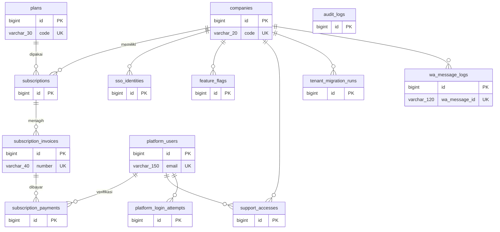
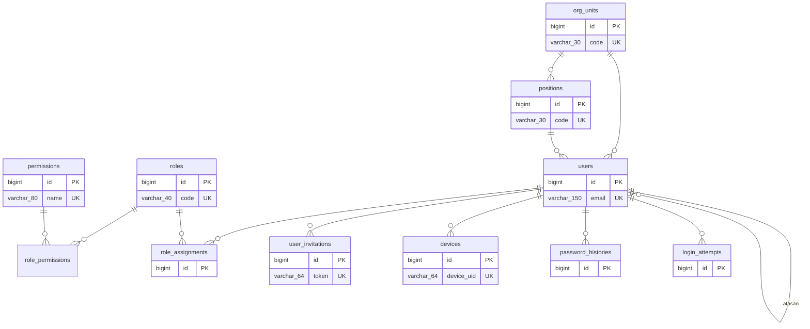
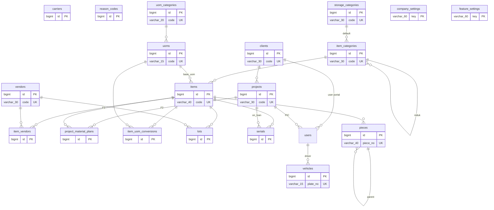
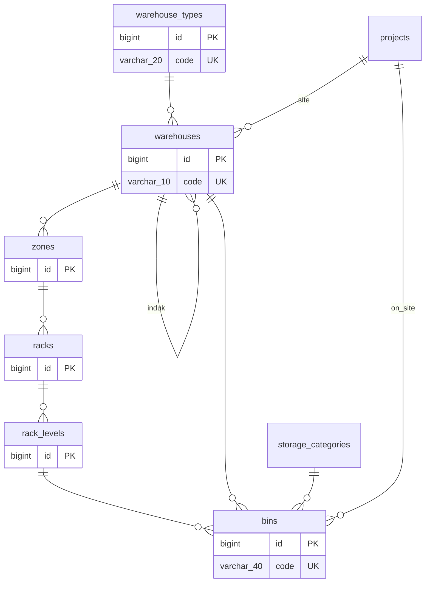

# Model Data — Pusat, akses & organisasi, master, gudang & lokasi

**Versi:** 0.19 (Part 3, diselaraskan dengan migrasi modul Access s.d. Pendukung F1, penutup & tinjauan kode 25 Sep 2026)
**Tanggal:** 25 September 2026
**Status:** berdasarkan Blueprint v0.4, Aturan Bisnis v0.4, Katalog Status v0.13, dan seluruh asumsi A-01–A-71 yang telah disetujui (terakhir A-71, 24 Sep 2026); selisih kode ↔ ERD dicatat di A-74 dan A-75 (perlu validasi); kolom implementasi modul Receipt/Putaway mengikuti A-78–A-84, modul Approval A-94, modul Count/Adjustment A-95–A-105, modul Transfer/Retur A-106–A-116, modul Template A-123, modul Issue A-117–A-118, modul Aset A-165, modul Purchase Request A-172, modul Platform A-184, Pendukung F1 A-189, kartu stok A-194. Dibuat otomatis oleh [`diagram/_generate_erd.py`](../diagram/_generate_erd.py) — **jangan diedit manual**; ubah data lalu jalankan ulang.
**Dokumen terkait:** [Arsitektur](08-arsitektur.md) · [Glosarium](03-glosarium.md) · [Katalog Status](06-katalog-status-dan-enum.md) · [Aturan Bisnis](05-aturan-bisnis.md) · [Stok & dokumen](08b-model-data-stok-dokumen.md) · [Pendukung](08c-model-data-pendukung.md)

Daftar area (116 tabel):

- [Database pusat (platform)](08a-model-data-inti.md#area-database-pusat-platform) — 13 tabel
- [User, role, cakupan, struktur organisasi (tenant)](08a-model-data-inti.md#area-user-role-cakupan-struktur-organisasi-tenant) — 11 tabel
- [Master data (tenant)](08a-model-data-inti.md#area-master-data-tenant) — 19 tabel
- [Gudang & lokasi (tenant)](08a-model-data-inti.md#area-gudang--lokasi-tenant) — 6 tabel
- [Stok: ledger, saldo, reservasi, kejadian (tenant)](08b-model-data-stok-dokumen.md#area-stok-ledger-saldo-reservasi-kejadian-tenant) — 4 tabel
- [Permintaan, picking, pengiriman, bukti terima, selisih (tenant)](08b-model-data-stok-dokumen.md#area-permintaan-picking-pengiriman-bukti-terima-selisih-tenant) — 12 tabel
- [Penerimaan, put-away, retur ke vendor, PR, transfer, retur, pemakaian (tenant)](08b-model-data-stok-dokumen.md#area-penerimaan-put-away-retur-ke-vendor-pr-transfer-retur-pemakaian-tenant) — 16 tabel
- [Konversi, resep, waste, aset (tenant)](08c-model-data-pendukung.md#area-konversi-resep-waste-aset-tenant) — 9 tabel
- [Stock opname & penyesuaian (tenant)](08c-model-data-pendukung.md#area-stock-opname--penyesuaian-tenant) — 6 tabel
- [Approval engine (tenant)](08c-model-data-pendukung.md#area-approval-engine-tenant) — 7 tabel
- [Timeline, audit, lampiran, notifikasi, template, penomoran, impor, sinkron (tenant)](08c-model-data-pendukung.md#area-timeline-audit-lampiran-notifikasi-template-penomoran-impor-sinkron-tenant) — 13 tabel

**Konvensi yang tidak diulang di setiap tabel:**
- Semua tabel tenant: `id BIGINT PK`, `created_at`, `updated_at`, `created_by`, `updated_by` (FK `users`). Semua waktu UTC ([BR-GEN-07](05-aturan-bisnis.md#br-gen)).
- **Belum diimplementasikan:** `created_by`/`updated_by`, `submitted_at`, `cancelled_at`, `reversal_of_id` (header) serta `line_no`, `uom_id`, `qty_input`, `source_line_type` (baris) belum ada di migrasi; jejak pembuat/pengubah diambil dari `audit_logs` dan jumlah baris disimpan dalam satuan dasar saja. Lihat [A-74](04-keputusan-dan-asumsi.md#a-74).
- Header dokumen: `number` (unik), `status` (enum Katalog), `source_type` + `source_id` (induk polimorfik), `reversal_of_id`, `notes`, `submitted_at`, `cancelled_at`, `cancel_reason_id`.
- Baris dokumen `<doc>_lines`: `line_no`, `item_id`, `uom_id` (satuan input), `qty_input`, `qty_base DECIMAL(18,4)`, `lot_id`, `serial_id`, `piece_id` (nullable sesuai `tracking_mode`), `source_line_type` + `source_line_id`.
- Enum memakai nilai dari [Katalog Status & Enum](06-katalog-status-dan-enum.md); di MySQL disimpan sebagai `VARCHAR(30)` + CHECK/validasi aplikasi, bukan tipe ENUM MySQL (agar migrasi per tenant aman).
- Kunci: 🔑 PK · ↗ FK · ◆ unik. Tabel abu-abu di `.drawio` = milik area lain (rujukan).

---

## Area: Database pusat (platform)

**Diagram:** [`diagram/erd-pusat.drawio`](../diagram/erd-pusat.drawio) · **Rujukan:** Blueprint §6.1, Blueprint §14, [BR-SUB](05-aturan-bisnis.md#br-sub)

Satu database untuk seluruh platform. Tidak menyimpan data operasional company. Semua tabel di sini memakai `company_id` bila terkait satu company. Tabel kerangka Laravel (`sessions`, `cache`, `cache_locks`, `jobs`, `job_batches`, `failed_jobs`, `password_reset_tokens`) ada di database pusat dan di setiap database tenant (tenant tanpa `job_batches`), tetapi tidak digambar.

### Diagram (Mermaid)

### Entitas

**`companies` — Company (tenant).** 🔑`id` bigint · ◆`code` varchar(20) *(kode pendek, dipakai di nomor dokumen)* · `name` varchar(150) · ◆`subdomain` varchar(63) *([A-01](04-keputusan-dan-asumsi.md#a-01))* · ◆`db_name` varchar(64) *(database tenant)* · `timezone` varchar(40) *(Asia/Jakarta)* · `status` enum *(provisioning|active|suspended|terminated)* · ↗`plan_id` bigint · `data` json *(kolom implementasi stancl/tenancy; admin_name, admin_email, provisioning_error, provisioned_at, status_reason (A-176, A-179, A-184))*

**`plans` — Paket.** 🔑`id` bigint · ◆`code` varchar(30) · `name` varchar(80) · `monthly_price` decimal(14,2) *(hanya di pusat (bukan WMS))* · `trial_days` smallint *(bawaan 14 ([A-11](04-keputusan-dan-asumsi.md#a-11), A-184))* · `wa_quota` int *(pesan/bulan, O-04)* · `storage_quota_mb` int · `is_active` bool

**`subscriptions` — Langganan.** 🔑`id` bigint · ↗`company_id` bigint · ↗`plan_id` bigint · `status` enum *(subscription_status)* · `trial_ends_at` datetime *([A-11](04-keputusan-dan-asumsi.md#a-11))* · `current_period_start` date · `current_period_end` date · `grace_ends_at` datetime *([A-12](04-keputusan-dan-asumsi.md#a-12))* · `suspended_at` datetime · `terminated_at` datetime · `purge_after` date *(+90 hari)*

**`subscription_invoices` — Tagihan langganan.** 🔑`id` bigint · ↗`subscription_id` bigint · ◆`number` varchar(40) · `period_start` date · `period_end` date · `amount` decimal(14,2) · `due_date` date · `status` enum *(subscription_invoice_status: open|paid|overdue|void)* · `paid_at` datetime *(A-184)*

**`subscription_payments` — Bukti bayar langganan.** 🔑`id` bigint · ↗`invoice_id` bigint · ↗`uploaded_by` bigint *(user tenant (id + company_id))* · `uploaded_by_name` varchar(100) *(A-184)* · `proof_path` varchar(255) · `amount` decimal(14,2) · `paid_at` date · ↗`verified_by` bigint *(platform_users)* · `verified_at` datetime · `status` enum *(subscription_payment_status: pending|verified|rejected)* · `notes` varchar(255) *(A-184)* · `reject_reason` varchar(255) *(wajib bila rejected (A-178, A-184))*

**`platform_users` — Super Admin.** 🔑`id` bigint · `name` varchar(100) · ◆`email` varchar(150) · `password` varchar(255) · `two_factor_secret` text *(opsional)* · `two_factor_recovery_codes` text *(A-200)* · `two_factor_confirmed_at` datetime *(A-200)* · `two_factor_last_step` bigint *(A-205)* · `remember_token` varchar(100) *(sesi ingat saya)* · `failed_login_count` smallint *(A-182, A-184)* · `locked_until` datetime *(A-182, A-184)* · `last_login_at` datetime

**`platform_login_attempts` — Percobaan masuk Super Admin.** 🔑`id` bigint · `email` varchar(150) · ↗`platform_user_id` bigint · `result` enum *(login_result)* · `ip_address` varchar(45) · `attempted_at` datetime
  ↳ NFR-04, A-182, A-184

**`audit_logs` — Jejak tindakan platform.** 🔑`id` bigint · `log_name` varchar(255) *(platform)* · `description` text · `subject_type` varchar(255) · `subject_id` bigint · `causer_type` varchar(255) · `causer_id` bigint *(platform_users)* · `properties` json · `ip_address` varchar(45)
  ↳ Skema sama dengan audit_logs tenant (spatie/activitylog); NFR-03, A-184

**`sso_identities` — Pemetaan identitas SSO.** 🔑`id` bigint · `provider` varchar(30) *(nxtg)* · `sub` varchar(191) *(ID user di SSO)* · ↗`company_id` bigint · `tenant_user_id` bigint *(user di DB tenant)* · `last_login_at` datetime
  ↳ UK(provider, sub, company_id); satu sub bisa terpeta ke banyak company → pemilih company ([A-48](04-keputusan-dan-asumsi.md#a-48))

**`feature_flags` — Feature flag per company.** 🔑`id` bigint · ↗`company_id` bigint · `key` varchar(60) *(mis. whatsapp, offline_sync, rfid)* · `enabled` bool · `config` json
  ↳ UK(company_id, key)

**`support_accesses` — Akses dukungan.** 🔑`id` bigint · ↗`company_id` bigint · ↗`platform_user_id` bigint · `granted_by_tenant_user_id` bigint · `starts_at` datetime · `ends_at` datetime · `reason` varchar(255) · `link_nonce_hash` varchar(64) *(A-199)* · `link_used_at` datetime *(A-199)* · `revoked_at` datetime
  ↳ [A-27](04-keputusan-dan-asumsi.md#a-27), [BR-SUB-04](05-aturan-bisnis.md#br-sub); setiap akses tercatat di audit_logs tenant; tautan masuk sekali pakai (A-199)

**`tenant_migration_runs` — Log migrasi per tenant.** 🔑`id` bigint · ↗`company_id` bigint · `batch` varchar(40) · `migration` varchar(191) · `status` enum *(ok|failed)* · `error` text · `ran_at` datetime

**`wa_message_logs` — Log pesan WhatsApp.** 🔑`id` bigint · ↗`company_id` bigint · `direction` enum *(out|in)* · `category` enum *(utility_template|service|inbound)* · ◆`wa_message_id` varchar(120) · `to_number` varchar(20) · `template` varchar(80) · `payload` json · `status` enum *(queued|sent|delivered|read|failed)* · `cost_units` decimal(10,4) *(untuk O-04)*
  ↳ Satu nomor platform ([A-24](04-keputusan-dan-asumsi.md#a-24)); routing balasan ke tenant lewat penanda company (NFR-12)

## Area: User, role, cakupan, struktur organisasi (tenant)

**Diagram:** [`diagram/erd-akses.drawio`](../diagram/erd-akses.drawio) · **Rujukan:** Blueprint §4.2, Blueprint §6.2, [BR-GEN-09](05-aturan-bisnis.md#br-gen), [A-46](04-keputusan-dan-asumsi.md#a-46)

Cakupan akses melekat pada penugasan role (BR-GEN-09). User klien adalah user biasa dengan `client_id` terisi dan hanya role Klien.

### Diagram (Mermaid)

### Entitas

**`users` — User.** 🔑`id` bigint · `name` varchar(100) · ◆`email` varchar(150) · `phone` varchar(20) *(WA untuk approval/OTP)* · `password` varchar(255) *(nullable bila hanya SSO)* · ↗`client_id` bigint *(terisi = user klien)* · ↗`org_unit_id` bigint · ↗`position_id` bigint · ↗`manager_id` bigint *(atasan langsung (self))* · `signature_path` varchar(255) · `is_active` bool · `locked_until` datetime *(kunci akun)* · `failed_login_count` tinyint *(reset saat login berhasil (NFR-04))* · `two_factor_secret` text · `two_factor_recovery_codes` text · `two_factor_confirmed_at` datetime · `two_factor_last_step` bigint *(A-205)* · ◆`sso_sub` varchar(191) *(nullable)* · `email_verified_at` datetime · `last_login_at` datetime · `password_changed_at` datetime · `remember_token` varchar(100)

**`roles` — Role.** 🔑`id` bigint · ◆`code` varchar(40) *(warehouse_head, …)* · `name` varchar(80) · `guard_name` varchar(30) *(wajib spatie/laravel-permission)* · `is_builtin` bool *(template bawaan)* · `is_client_role` bool *(tidak bisa digabung role internal)* · `is_active` bool
  ↳ UK(name, guard_name)

**`permissions` — Permission.** 🔑`id` bigint · ◆`name` varchar(80) *(kunci permission <modul>.<aksi> (dulu ditulis key))* · `guard_name` varchar(30) *(wajib spatie/laravel-permission)* · `module` varchar(30) · `label` varchar(100) *(label Bahasa Indonesia)*
  ↳ UK(name, guard_name)

**`role_permissions` — Role ↔ permission.** ↗`role_id` bigint · ↗`permission_id` bigint
  ↳ PK(role_id, permission_id)

**`role_assignments` — Penugasan role × cakupan.** 🔑`id` bigint · ↗`user_id` bigint · ↗`role_id` bigint · `scope_type` enum *(all|warehouse|project)* · `scope_id` bigint *(warehouse_id / project_id)* · `valid_from` date · `valid_until` date *(auditor eksternal)* · ↗`assigned_by` bigint *(users)*
  ↳ UK(user_id, role_id, scope_type, scope_id)

**`org_units` — Unit organisasi.** 🔑`id` bigint · ↗`parent_id` bigint *(self)* · ◆`code` varchar(30) · `name` varchar(100) · `is_active` bool

**`positions` — Jabatan.** 🔑`id` bigint · ↗`org_unit_id` bigint · ◆`code` varchar(30) · `name` varchar(100) · `level` int *(untuk 'atasan')* · `is_active` bool

**`user_invitations` — Undangan user.** 🔑`id` bigint · ↗`user_id` bigint · ◆`token` varchar(64) · `expires_at` datetime · `accepted_at` datetime · `sent_count` tinyint *(jumlah pengiriman undangan)*

**`devices` — Perangkat terdaftar.** 🔑`id` bigint · ↗`user_id` bigint · ◆`device_uid` varchar(64) · `name` varchar(80) · `platform` varchar(30) · `last_seen_at` datetime · `is_active` bool

**`password_histories` — Riwayat password.** 🔑`id` bigint · ↗`user_id` bigint · `password` varchar(255) *(hash)* · `created_at` datetime
  ↳ [BR-ACC-06](05-aturan-bisnis.md#br-acc): password baru tidak boleh sama dengan 3 terakhir; tanpa updated_at

**`login_attempts` — Catatan login.** 🔑`id` bigint · `email` varchar(150) · ↗`user_id` bigint *(nullable)* · `ip_address` varchar(45) · `channel` varchar(20) *(web|pwa|portal)* · `result` enum *(login_result: success|invalid|locked|inactive|no_role|wrong_portal|suspended)* · `attempted_at` datetime
  ↳ Laporan & audit login (NFR-03); append-only, tanpa created_at/updated_at; index (email, attempted_at)

## Area: Master data (tenant)

**Diagram:** [`diagram/erd-master.drawio`](../diagram/erd-master.drawio) · **Rujukan:** Blueprint §6.3a, §6.4, §6.5, §6.9, [BR-STK-08–12](05-aturan-bisnis.md#br-stk)

Master tidak pernah dihapus, hanya dinonaktifkan (P-03). Satuan dinamis: konversi global per kategori satuan + konversi khusus per item.

### Diagram (Mermaid)

### Entitas

**`clients` — Klien.** 🔑`id` bigint · ◆`code` varchar(30) · `name` varchar(150) · `tax_id` varchar(30) *(NPWP)* · `address` text · `contact_name` varchar(100) · `phone` varchar(20) · `email` varchar(150) · `is_active` bool

**`projects` — Proyek.** 🔑`id` bigint · ◆`code` varchar(30) · `name` varchar(150) · ↗`client_id` bigint *(null = Proyek Internal)* · `is_internal` bool *([A-06](04-keputusan-dan-asumsi.md#a-06))* · `status` enum *(project_status ([A-40](04-keputusan-dan-asumsi.md#a-40)))* · `address` text · `lat` decimal(10,7) · `lng` decimal(10,7) · `start_date` date · `target_end_date` date · ↗`pic_user_id` bigint · `closed_at` datetime · `close_reason` varchar(255)

**`vendors` — Vendor.** 🔑`id` bigint · ◆`code` varchar(30) · `name` varchar(150) · `tax_id` varchar(30) · `contact_name` varchar(100) · `phone` varchar(20) · `email` varchar(150) · `address` text · `payment_terms` varchar(60) *(teks, tanpa nilai)* · `vendor_type` enum *(company|shop|online_marketplace|individual ([A-52](04-keputusan-dan-asumsi.md#a-52)))* · `status` enum *(vendor_status: active|provisional|inactive ([A-53](04-keputusan-dan-asumsi.md#a-53)))* · `is_active` bool
  ↳ Dimiliki WMS sampai Purchasing aktif

**`item_vendors` — Vendor tetap per item.** 🔑`id` bigint · ↗`item_id` bigint · ↗`vendor_id` bigint · `priority` int *(1 = utama)* · `is_preferred` bool · `notes` varchar(255)
  ↳ UK(item_id, vendor_id); tanpa harga ([A-52](04-keputusan-dan-asumsi.md#a-52))

**`project_material_plans` — Rencana kebutuhan material (F2).** 🔑`id` bigint · ↗`project_id` bigint · ↗`item_id` bigint · `version` int · `planned_qty_base` decimal(18,4) · ↗`import_batch_id` bigint *(unggah Excel)* · `is_current` bool
  ↳ UK(project_id, item_id, version); stub di F1 ([BR-PRJ-09](05-aturan-bisnis.md#br-prj), [A-62](04-keputusan-dan-asumsi.md#a-62))

**`vehicles` — Kendaraan.** 🔑`id` bigint · ◆`plate_no` varchar(15) · `type` varchar(40) · ↗`default_driver_id` bigint *(users)* · `is_active` bool

**`carriers` — Ekspedisi pihak ketiga.** 🔑`id` bigint · `name` varchar(100) · `phone` varchar(20) · `is_active` bool

**`reason_codes` — Alasan.** 🔑`id` bigint · `context` enum *(reject|cancel|adjustment|waste|damage|short_pick|discrepancy|lost)* · `code` varchar(30) · `label` varchar(100) · `is_active` bool
  ↳ UK(context, code)

**`item_categories` — Kategori barang.** 🔑`id` bigint · ↗`parent_id` bigint *(self)* · ◆`code` varchar(30) · `name` varchar(100) · ↗`storage_category_id` bigint *(default)* · `removal_strategy` enum *(default, nullable)* · `tolerance_pct` decimal(5,2) *([BR-OPN-04](05-aturan-bisnis.md#br-opn))* · `tolerance_abs` decimal(18,4) · `abc_class` char(1) *(F2)* · `is_active` bool

**`storage_categories` — Kategori penyimpanan.** 🔑`id` bigint · ◆`code` varchar(30) · `name` varchar(100) · `capacity_mode` enum *(warn|block ([A-37](04-keputusan-dan-asumsi.md#a-37)))* · `is_active` bool

**`uom_categories` — Kategori satuan.** 🔑`id` bigint · ◆`code` varchar(20) *(count|length|weight|volume|area)* · `name` varchar(60) · ↗`reference_uom_id` bigint *(satuan acuan)* · `is_active` bool

**`uoms` — Satuan.** 🔑`id` bigint · ↗`uom_category_id` bigint · ◆`code` varchar(15) · `name` varchar(60) · `factor_to_reference` decimal(18,8) *(1 cm = 0.01 m)* · `rounding` decimal(18,4) · `is_active` bool

**`items` — Item.** 🔑`id` bigint · ◆`code` varchar(40) · `name` varchar(150) · ↗`item_category_id` bigint · `status` enum *(item_status (provisional = dari non-katalog))* · `ownership_model` enum · `default_line_ownership` enum *(buy|loan ([A-38](04-keputusan-dan-asumsi.md#a-38)))* · `tracking_mode` enum · `has_expiry` bool · ↗`base_uom_id` bigint · `is_cuttable` bool · `min_offcut_length` decimal(18,4) *(wajib bila is_cuttable ([A-19](04-keputusan-dan-asumsi.md#a-19)))* · `kerf` decimal(18,4) · `requires_qc` bool · `removal_strategy` enum *(override, nullable)* · `reorder_point` decimal(18,4) · `min_stock` decimal(18,4) · `barcode` varchar(64) *(Code128)* · `qr_payload` varchar(120) · `photo_path` varchar(255) · `dimensions` json *(dengan satuan)* · `weight` decimal(18,4) · ↗`weight_uom_id` bigint
  ↳ CHECK: ownership_model in (asset,both) ⇒ tracking_mode = serial ([BR-STK-08](05-aturan-bisnis.md#br-stk)); kombinasi sah BR §15

**`item_uom_conversions` — Konversi satuan khusus item.** 🔑`id` bigint · ↗`item_id` bigint · ↗`uom_id` bigint *(1 batang)* · `qty_base` decimal(18,4) *(= 6 m)* · `is_nominal_piece` bool *(hanya potongan nominal ([BR-STK-09](05-aturan-bisnis.md#br-stk)))* · `is_active` bool *(P-03: dilepas dari form = nonaktif, bukan dihapus)*
  ↳ UK(item_id, uom_id)

**`lots` — Lot / batch.** 🔑`id` bigint · ↗`item_id` bigint · `lot_no` varchar(60) · `expiry_date` date · `received_at` date · ↗`vendor_id` bigint · `attributes` json *(mis. heat number)*
  ↳ UK(item_id, lot_no)

**`serials` — Serial / aset.** 🔑`id` bigint · ↗`item_id` bigint · `serial_no` varchar(80) · `asset_state` enum *(asset_state ([BR-AST-01](05-aturan-bisnis.md#br-ast)))* · `condition_grade` char(1) · ↗`lot_id` bigint *(opsional)* · `expiry_date` date · `rfid_tag` varchar(64) *(F2)* · ↗`current_project_id` bigint *(saat on_loan)* · `due_return_date` date · `acquired_at` date *([A-66](04-keputusan-dan-asumsi.md#a-66))* · `meter_unit` enum *(hour|km|none)* · `meter_total` decimal(12,1) *(akumulasi)* · `expected_life_days` int · `expected_life_hours` decimal(12,1) · `condition_score` tinyint *(0–100 % terakhir ([BR-AST-08](05-aturan-bisnis.md#br-ast)))*
  ↳ UK(item_id, serial_no); sisa umur % dihitung ([BR-AST-08](05-aturan-bisnis.md#br-ast))

**`pieces` — Potongan.** 🔑`id` bigint · ↗`item_id` bigint · ◆`piece_no` varchar(40) *(P-000123)* · `length` decimal(18,4) *(dalam base_uom (panjang))* · `is_offcut` bool · ↗`parent_piece_id` bigint *(silsilah ([BR-CNV-04](05-aturan-bisnis.md#br-cnv)))* · `origin_type` varchar(30) *(grn|conversion|return)* · `origin_id` bigint · `is_consumed` bool

**`company_settings` — Pengaturan company.** 🔑`key` varchar(60) · `value` json
  ↳ zona waktu, ambang toleransi default, kapasitas bin, konfirmasi terima otomatis (3 hari), stock_lock_date ([BR-STK-15](05-aturan-bisnis.md#br-stk)), reservation_alert_days ([BR-STK-16](05-aturan-bisnis.md#br-stk)), review_sla_days ([BR-REQ-14](05-aturan-bisnis.md#br-req)), substitution_objection_days ([BR-REQ-13](05-aturan-bisnis.md#br-req)), receipt_confirm_days ([BR-REQ-10](05-aturan-bisnis.md#br-req)), asset_life_alert_pct ([BR-AST-08](05-aturan-bisnis.md#br-ast)), dll.

**`feature_settings` — Pengaturan fitur stok.** 🔑`key` varchar(60) *(lot|serial|piece|expiry|fefo|rfid|qc)* · `enabled` bool · `config` json
  ↳ Lapis 1 dari P-08

## Area: Gudang & lokasi (tenant)

**Diagram:** [`diagram/erd-gudang.drawio`](../diagram/erd-gudang.drawio) · **Rujukan:** Blueprint §6.2, §6.3, [BR-STK-02](05-aturan-bisnis.md#br-stk), [BR-STK-13](05-aturan-bisnis.md#br-stk), [BR-STK-14](05-aturan-bisnis.md#br-stk)

Lokasi adalah entitas (P-06). Kode bin diturunkan dari hierarki. Bin virtual `in_transit` (satu per gudang) dan `on_site` (satu per proyek) dibuat otomatis.

### Diagram (Mermaid)

### Entitas

**`warehouse_types` — Tipe gudang.** 🔑`id` bigint · ◆`code` varchar(20) *(MAIN|BRANCH|SITE|…)* · `name` varchar(60) · `is_builtin` bool · `is_active` bool

**`warehouses` — Gudang.** 🔑`id` bigint · ◆`code` varchar(10) *(segmen nomor dokumen)* · `name` varchar(100) · ↗`warehouse_type_id` bigint · ↗`parent_id` bigint *(self, hierarki)* · ↗`project_id` bigint *(wajib bila type = site; satu proyek boleh punya beberapa ([A-40](04-keputusan-dan-asumsi.md#a-40)))* · ↗`head_user_id` bigint *(Kepala Gudang)* · `address` text · `is_active` bool

**`zones` — Zona.** 🔑`id` bigint · ↗`warehouse_id` bigint · `code` varchar(10) · `name` varchar(60) · `is_active` bool
  ↳ UK(warehouse_id, code)

**`racks` — Rak.** 🔑`id` bigint · ↗`zone_id` bigint · `code` varchar(10) · `is_active` bool
  ↳ UK(zone_id, code)

**`rack_levels` — Level.** 🔑`id` bigint · ↗`rack_id` bigint · `code` varchar(10) · `is_active` bool
  ↳ UK(rack_id, code)

**`bins` — Bin.** 🔑`id` bigint · ↗`warehouse_id` bigint *(denormalisasi untuk query)* · ↗`rack_level_id` bigint *(null untuk bin virtual/dock)* · ◆`code` varchar(40) *(CKG-A-R03-L2-B05)* · `bin_type` enum *(bin_type)* · `bin_status` enum *(active|frozen|inactive)* · ↗`storage_category_id` bigint · `capacity_qty` decimal(18,4) · `capacity_weight` decimal(18,4) · `capacity_volume` decimal(18,4) · `capacity_length` decimal(18,4) · ↗`project_id` bigint *(hanya on_site)* · `is_virtual` bool · ↗`frozen_by_count_id` bigint *(stock_counts)* · `freeze_reason` varchar(255) *(alasan pembekuan)* · `count_flag` bool *(perlu dihitung ([A-67](04-keputusan-dan-asumsi.md#a-67), [BR-SJ-02](05-aturan-bisnis.md#br-sj)))*
