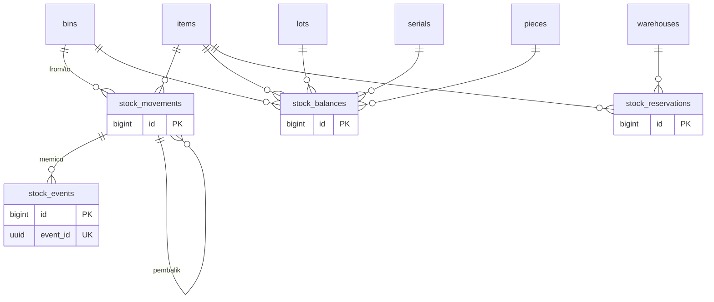
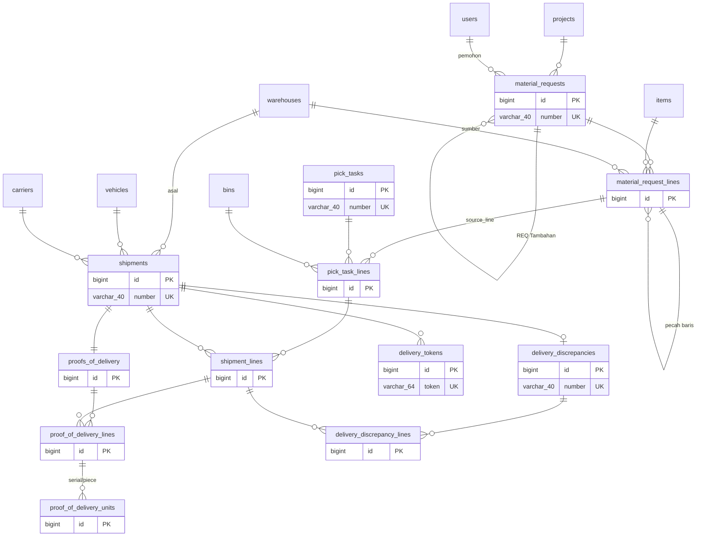
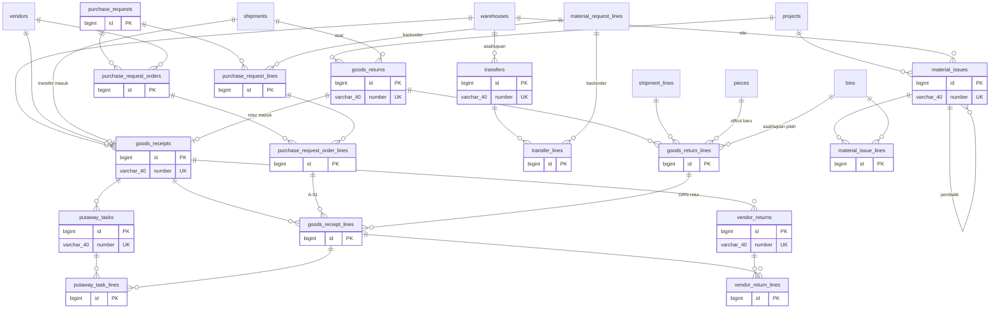

# Model Data — Stok, outbound, inbound & dokumen niat

**Versi:** 0.20 (Part 3, diselaraskan dengan migrasi modul Access s.d. Pendukung F1, penutup & tinjauan kode 25 Sep 2026, dan Purchasing inti Fase 1b)
**Tanggal:** 25 September 2026
**Status:** berdasarkan Blueprint v0.4, Aturan Bisnis v0.4, Katalog Status v0.13, dan seluruh asumsi A-01–A-71 yang telah disetujui (terakhir A-71, 24 Sep 2026); selisih kode ↔ ERD dicatat di A-74 dan A-75 (perlu validasi); kolom implementasi modul Receipt/Putaway mengikuti A-78–A-84, modul Approval A-94, modul Count/Adjustment A-95–A-105, modul Transfer/Retur A-106–A-116, modul Template A-123, modul Issue A-117–A-118, modul Aset A-165, modul Purchase Request A-172, modul Platform A-184, Pendukung F1 A-189, kartu stok A-194, Purchasing inti A-208–A-215. Dibuat otomatis oleh [`diagram/_generate_erd.py`](../diagram/_generate_erd.py) — **jangan diedit manual**; ubah data lalu jalankan ulang.
**Dokumen terkait:** [Arsitektur](08-arsitektur.md) · [Glosarium](03-glosarium.md) · [Katalog Status](06-katalog-status-dan-enum.md) · [Aturan Bisnis](05-aturan-bisnis.md) · [Inti](08a-model-data-inti.md) · [Pendukung](08c-model-data-pendukung.md)

Daftar area lengkap ada di [08a-model-data-inti.md](08a-model-data-inti.md).

**Konvensi yang tidak diulang di setiap tabel:**
- Semua tabel tenant: `id BIGINT PK`, `created_at`, `updated_at`, `created_by`, `updated_by` (FK `users`). Semua waktu UTC ([BR-GEN-07](05-aturan-bisnis.md#br-gen)).
- **Belum diimplementasikan:** `created_by`/`updated_by`, `submitted_at`, `cancelled_at`, `reversal_of_id` (header) serta `line_no`, `uom_id`, `qty_input`, `source_line_type` (baris) belum ada di migrasi; jejak pembuat/pengubah diambil dari `audit_logs` dan jumlah baris disimpan dalam satuan dasar saja. Lihat [A-74](04-keputusan-dan-asumsi.md#a-74).
- Header dokumen: `number` (unik), `status` (enum Katalog), `source_type` + `source_id` (induk polimorfik), `reversal_of_id`, `notes`, `submitted_at`, `cancelled_at`, `cancel_reason_id`.
- Baris dokumen `<doc>_lines`: `line_no`, `item_id`, `uom_id` (satuan input), `qty_input`, `qty_base DECIMAL(18,4)`, `lot_id`, `serial_id`, `piece_id` (nullable sesuai `tracking_mode`), `source_line_type` + `source_line_id`.
- Enum memakai nilai dari [Katalog Status & Enum](06-katalog-status-dan-enum.md); di MySQL disimpan sebagai `VARCHAR(30)` + CHECK/validasi aplikasi, bukan tipe ENUM MySQL (agar migrasi per tenant aman).
- Kunci: 🔑 PK · ↗ FK · ◆ unik. Tabel abu-abu di `.drawio` = milik area lain (rujukan).

---

## Area: Stok: ledger, saldo, reservasi, kejadian (tenant)

**Diagram:** [`diagram/erd-stok.drawio`](../diagram/erd-stok.drawio) · **Rujukan:** Blueprint §6.6, [BR-STK](05-aturan-bisnis.md#br-stk), BR §14, Akuntansi §4

Ledger append-only (BR-STK-01). Saldo adalah agregat yang dipelihara transaksional (dikunci baris, NFR-13) dan bisa dibangun ulang. Reservasi terpisah dari ledger (BR-STK-03). Kejadian stok ditulis ke outbox dalam transaksi yang sama.

### Diagram (Mermaid)

### Entitas

**`stock_movements` — Kartu stok (ledger).** 🔑`id` bigint · ↗`item_id` bigint · ↗`from_bin_id` bigint *(null = masuk dari luar)* · ↗`to_bin_id` bigint *(null = keluar)* · ↗`lot_id` bigint · ↗`serial_id` bigint · ↗`piece_id` bigint · `qty_base` decimal(18,4) *(selalu positif; arah dari from/to)* · `stock_status` enum *(kondisi yang berpindah (kondisi tujuan))* · `from_stock_status` enum *(kondisi di bin asal bila berbeda — perubahan kondisi (A-194))* · ↗`project_id` bigint · `document_type` varchar(30) · `document_id` bigint · `document_line_id` bigint · `document_number` varchar(40) *(disalin agar riwayat terbaca tanpa join)* · ↗`reason_code_id` bigint · `occurred_at` datetime *(UTC)* · ↗`performed_by` bigint · ↗`reverses_movement_id` bigint *(self; UK — satu baris hanya dibalik sekali)* · `notes` varchar(255)
  ↳ Tidak ada UPDATE/DELETE (trigger BEFORE UPDATE/DELETE + guard model). Index (item_id, to_bin_id), (document_type, document_id), (occurred_at)

**`stock_balances` — Saldo stok.** 🔑`id` bigint · ↗`item_id` bigint · ↗`bin_id` bigint · ↗`lot_id` bigint · ↗`serial_id` bigint · ↗`piece_id` bigint · `stock_status` enum *(available|quarantine|damaged)* · `qty_base` decimal(18,4) *(≥ 0 (CHECK))* · `piece_count` int *(untuk piece)* · `version` int *(optimistic lock cadangan)*
  ↳ UK(item_id, bin_id, lot_key, serial_key, piece_key, stock_status) — tiga kolom turunan COALESCE(x,0) karena MySQL tidak membandingkan NULL; dikunci FOR UPDATE saat mutasi

**`stock_reservations` — Reservasi.** 🔑`id` bigint · ↗`item_id` bigint · ↗`warehouse_id` bigint *(lunak)* · ↗`bin_id` bigint *(keras (nullable))* · ↗`lot_id` bigint · ↗`serial_id` bigint · ↗`piece_id` bigint · `qty_base` decimal(18,4) · `level` enum *(soft|hard ([BR-STK-04](05-aturan-bisnis.md#br-stk)))* · `document_type` varchar(30) *(material_request|transfer|pick_task|goods_return (A-111))* · `document_id` bigint · `document_line_id` bigint · `status` enum *(active|consumed|released)* · `released_reason` varchar(60) *([BR-STK-05](05-aturan-bisnis.md#br-stk))* · `released_at` datetime
  ↳ Stok tersedia = Σ balance.available − Σ reservasi active (per item, gudang)

**`stock_events` — Outbox kejadian stok.** 🔑`id` bigint · ◆`event_id` uuid · `schema_version` varchar(10) · `event_type` varchar(40) *(BR §14)* · `occurred_at` datetime · `recorded_at` datetime · `source_type` varchar(30) · `source_id` bigint · `source_number` varchar(40) *(nomor dokumen sumber, disalin)* · ↗`project_id` bigint · `payload` json *(Akuntansi §4.1)* · `reverses_event_id` uuid · `published_at` datetime *(null = belum dikonsumsi)* · `attempts` int · `last_error` text
  ↳ Ditulis dalam transaksi yang sama dengan stock_movements (pola outbox)

## Area: Permintaan, picking, pengiriman, bukti terima, selisih (tenant)

**Diagram:** [`diagram/erd-outbound.drawio`](../diagram/erd-outbound.drawio) · **Rujukan:** KS 2.1–2.4, [BR-REQ](05-aturan-bisnis.md#br-req), [BR-SJ](05-aturan-bisnis.md#br-sj), BR §1

Dokumen niat REQ dipisah dari pergerakan fisik PCK → SJ. Baris SJ merujuk baris PCK, baris PCK merujuk baris REQ/TRF, sehingga pemenuhan dihitung per baris.

### Diagram (Mermaid)

### Entitas

**`material_requests` — REQ header.** 🔑`id` bigint · ◆`number` varchar(40) *(REQ/<proyek>/<yymm>/<urut>)* · ↗`project_id` bigint *([A-22](04-keputusan-dan-asumsi.md#a-22))* · ↗`requester_id` bigint *(users)* · `requester_type` enum *(internal|client)* · `required_date` date *(header default)* · ↗`reviewed_by` bigint *(Ditinjau Staf)* · `reviewed_at` datetime · ↗`approval_snapshot_id` bigint *(approval_snapshots (20-approval))* · ↗`approved_by` bigint · `approved_at` datetime · ↗`closed_reason_id` bigint *(closed_short)* · ↗`cancel_reason_id` bigint *(cancelled)* · `origin` enum *(request_origin: regular|supplement ([A-54](04-keputusan-dan-asumsi.md#a-54)))* · ↗`parent_request_id` bigint *(REQ induk bila supplement)*
  ↳ kolom header dokumen standar (lihat konvensi)

**`material_request_lines` — REQ baris.** 🔑`id` bigint · ↗`material_request_id` bigint · ↗`item_id` bigint *(null bila non-katalog belum dipetakan)* · `non_catalog_text` varchar(255) *([A-39](04-keputusan-dan-asumsi.md#a-39))* · ↗`mapped_by` bigint · `mapped_at` datetime · `line_ownership` enum *(buy|loan ([A-38](04-keputusan-dan-asumsi.md#a-38)))* · `required_date` date · ↗`source_warehouse_id` bigint *([A-31](04-keputusan-dan-asumsi.md#a-31))* · `fulfillment_source` enum *(stock|transfer|purchase ([BR-REQ-05](05-aturan-bisnis.md#br-req)))* · `qty_base` decimal(18,4) · `qty_reserved` decimal(18,4) · `qty_shipped` decimal(18,4) · `qty_received` decimal(18,4) · `qty_backorder` decimal(18,4) · `nominal_length` decimal(18,4) *(piece: 'n potongan ukuran nominal')* · ↗`split_from_line_id` bigint *(self; pecah baris antar gudang ([A-56](04-keputusan-dan-asumsi.md#a-56)))* · `promised_date` date *(tanggal janji ([BR-REQ-14](05-aturan-bisnis.md#br-req)))* · `original_item_text` varchar(255) *(sebelum diganti ([A-55](04-keputusan-dan-asumsi.md#a-55)))* · `substituted_at` datetime · `substitution_deadline_at` datetime · `substitution_response` enum *(accepted|rejected|expired)* · `cancel_requested_at` datetime *(permintaan pembatalan klien ([A-61](04-keputusan-dan-asumsi.md#a-61)))* · ↗`cancel_reason_id` bigint · ↗`cancel_confirmed_by` bigint · `cancel_confirmed_at` datetime · `status` enum *(request_line_status: open|closed|cancelled — baris bisa dibatalkan sendiri)* · `notes` varchar(255) *(opsional)*
  ↳ kolom baris standar (lihat konvensi)

**`pick_tasks` — PCK header.** 🔑`id` bigint · ◆`number` varchar(40) *(PCK/<gudang>/<yymm>/<urut>)* · ↗`warehouse_id` bigint · ↗`assigned_to` bigint · `started_at` datetime · `completed_at` datetime · ↗`cancel_reason_id` bigint
  ↳ kolom header dokumen standar (lihat konvensi); source = material_request | transfer

**`pick_task_lines` — PCK baris (alokasi keras).** 🔑`id` bigint · ↗`pick_task_id` bigint · `source_line_id` bigint *(baris REQ/TRF yang dipenuhi)* · ↗`item_id` bigint · ↗`bin_id` bigint *(alokasi)* · ↗`suggested_bin_id` bigint · `qty_allocated` decimal(18,4) · `qty_picked` decimal(18,4) · ↗`short_reason_id` bigint *([BR-SJ-02](05-aturan-bisnis.md#br-sj))* · `override_reason` varchar(255) *(ganti saran)* · `scanned_at` datetime
  ↳ kolom baris standar (lihat konvensi)

**`shipments` — SJ header.** 🔑`id` bigint · ◆`number` varchar(40) *(SJ/<gudang>/<yymm>/<urut>)* · ↗`warehouse_id` bigint *(asal)* · `destination_type` enum *(project_client|site_warehouse|warehouse|vendor)* · ↗`destination_project_id` bigint · ↗`destination_warehouse_id` bigint · ↗`destination_vendor_id` bigint *(bila tujuan vendor)* · ↗`vehicle_id` bigint · ↗`driver_id` bigint · ↗`carrier_id` bigint · `tracking_no` varchar(60) · `shipment_method` enum *(own_fleet|carrier|self_delivered ([A-57](04-keputusan-dan-asumsi.md#a-57); self_delivered = transfer dalam proyek, [A-50](04-keputusan-dan-asumsi.md#a-50)))* · `carried_by_name` varchar(100) *(bila self_delivered)* · `loaded_at` datetime *(konfirmasi muat)* · `shipped_at` datetime · `delivered_at` datetime
  ↳ kolom header dokumen standar (lihat konvensi); [BR-SJ-07](05-aturan-bisnis.md#br-sj)

**`shipment_lines` — SJ baris.** 🔑`id` bigint · ↗`shipment_id` bigint · ↗`pick_task_line_id` bigint · `qty_shipped` decimal(18,4) · `qty_delivered` decimal(18,4) · `ownership_effect` enum *(sold|transfer|loan ([BR-SJ-04](05-aturan-bisnis.md#br-sj)))*
  ↳ kolom baris standar (lihat konvensi)

**`proofs_of_delivery` — Bukti terima.** 🔑`id` bigint · ↗`shipment_id` bigint *(UK)* · `received_by_name` varchar(100) · ↗`received_by_user_id` bigint *(nullable)* · `signature_path` varchar(255) *(berkas di disk company ([A-68](04-keputusan-dan-asumsi.md#a-68)))* · `photo_path` varchar(255) · `lat` decimal(10,7) · `lng` decimal(10,7) · `confirmed_at` datetime · `channel` enum *(driver_pwa|token_link)* · `requester_confirmed_at` datetime *([BR-REQ-10](05-aturan-bisnis.md#br-req))* · `confirmation` enum *(receipt_confirmation: confirmed|disputed|auto_confirmed ([A-63](04-keputusan-dan-asumsi.md#a-63)))* · `confirm_deadline_at` datetime *(confirmed_at + receipt_confirm_days)* · `disputed_at` datetime · ↗`device_id` bigint · `notes` varchar(255) *(opsional)*

**`proof_of_delivery_lines` — Bukti terima baris.** 🔑`id` bigint · ↗`proof_of_delivery_id` bigint · ↗`shipment_line_id` bigint · `qty_good` decimal(18,4) · `qty_damaged` decimal(18,4) *(foto wajib bila > 0)* · `qty_missing` decimal(18,4) · `damage_photo_path` varchar(255) *(berkas di disk company ([A-68](04-keputusan-dan-asumsi.md#a-68)))* · `notes` varchar(255) *(opsional)*
  ↳ Per baris SJ ([A-64](04-keputusan-dan-asumsi.md#a-64)); qty_good + qty_damaged + qty_missing = qty_shipped

**`proof_of_delivery_units` — Bukti terima per unit.** 🔑`id` bigint · ↗`proof_of_delivery_line_id` bigint · ↗`serial_id` bigint · ↗`piece_id` bigint · `condition` enum *(pod_unit_condition: good|damaged|missing)*
  ↳ Hanya tracking_mode serial/piece ([A-64](04-keputusan-dan-asumsi.md#a-64)); scan di PWA

**`delivery_tokens` — Tautan bukti terima bertoken.** 🔑`id` bigint · ↗`shipment_id` bigint · ◆`token` varchar(64) · `otp_hash` varchar(255) · `phone` varchar(20) · `expires_at` datetime *(24 jam)* · `used_at` datetime · `attempts` int *(rate limit NFR-04)*
  ↳ [A-41](04-keputusan-dan-asumsi.md#a-41), [BR-SJ-05](05-aturan-bisnis.md#br-sj)

**`delivery_discrepancies` — DSC header.** 🔑`id` bigint · ◆`number` varchar(40) *(DSC/<gudang>/<yymm>/<urut>)* · ↗`shipment_id` bigint · `origin` enum *(partial_delivery|client_dispute ([A-63](04-keputusan-dan-asumsi.md#a-63)))* · ↗`resolved_by` bigint · `resolved_at` datetime
  ↳ kolom header dokumen standar (lihat konvensi)

**`delivery_discrepancy_lines` — DSC baris.** 🔑`id` bigint · ↗`delivery_discrepancy_id` bigint · ↗`shipment_line_id` bigint · `discrepancy_type` enum *(missing|damaged ([A-64](04-keputusan-dan-asumsi.md#a-64)))* · `qty_base` decimal(18,4) · `disposition` enum *(discrepancy_disposition (+reship))* · `client_decision` enum *(still_needed|not_needed)* · ↗`reason_code_id` bigint · `claim_ref` varchar(60) · `photo_path` varchar(255) · `return_receipt_id` bigint *(GRN retur bila dibawa balik ([A-65](04-keputusan-dan-asumsi.md#a-65)); tanpa FK sampai modul receipt ada)*
  ↳ kolom baris standar (lihat konvensi); [BR-SJ-10](05-aturan-bisnis.md#br-sj)

## Area: Penerimaan, put-away, retur ke vendor, PR, transfer, retur, pemakaian (tenant)

**Diagram:** [`diagram/erd-inbound.drawio`](../diagram/erd-inbound.drawio) · **Rujukan:** KS 2.5–2.9, 2.15, 2.16, [BR-GRN](05-aturan-bisnis.md#br-grn), [BR-RET](05-aturan-bisnis.md#br-ret), [BR-PRJ-08](05-aturan-bisnis.md#br-prj), purchasing/01

GRN adalah satu-satunya dokumen masuk: dari vendor (dengan/tanpa PRQ), dari SJ (transfer), dari RET. TRF dan RET adalah dokumen niat (A-33). ISU mengeluarkan stok Gudang Site tanpa SJ.

### Diagram (Mermaid)

### Entitas

**`goods_receipts` — GRN header.** 🔑`id` bigint · ◆`number` varchar(40) *(GRN/<gudang>/<yymm>/<urut>)* · ↗`warehouse_id` bigint *(tujuan)* · `receipt_type` enum *(vendor|transfer|return)* · ↗`vendor_id` bigint · `vendor_doc_no` varchar(60) *(surat jalan vendor)* · `po_ref` varchar(60) *(F3: po_id)* · ↗`shipment_id` bigint *(bila dari SJ)* · ↗`goods_return_id` bigint *(bila dari RET (GRN retur, A-112))* · `received_at` datetime · ↗`received_by` bigint *(users; implementasi 19-receipt-putaway)* · `completed_at` datetime
  ↳ kolom header dokumen standar (lihat konvensi); source_type = vendor_return untuk barang pengganti RTV ([BR-GRN-04](05-aturan-bisnis.md#br-grn))

**`goods_receipt_lines` — GRN baris.** 🔑`id` bigint · ↗`goods_receipt_id` bigint · ↗`purchase_request_order_line_id` bigint *(baris catatan pemesanan → baris PRQ ([A-47](04-keputusan-dan-asumsi.md#a-47), [A-51](04-keputusan-dan-asumsi.md#a-51)))* · ↗`shipment_line_id` bigint · ↗`goods_return_line_id` bigint · `lot_no` varchar(60) *(isian draf; lot dibuat saat received)* · `expiry_date` date *(isian draf)* · `serial_no` varchar(80) *(isian draf; satu baris = satu unit)* · `piece_length` decimal(18,4) *(isian draf; potongan dibuat saat received)* · ↗`receiving_bin_id` bigint *(receiving|quarantine|return)* · `qty_received` decimal(18,4) · `qc_result` enum *(passed|quarantined|rejected)* · ↗`qc_by` bigint · `qc_at` datetime · ↗`qc_reason_id` bigint *(reason_codes (reject); wajib bila rejected)* · `qc_note` varchar(255) · `is_cross_dock` bool *([BR-SJ-03](05-aturan-bisnis.md#br-sj); selalu false di F1 ([A-83](04-keputusan-dan-asumsi.md#a-83)))* · `notes` varchar(255) *(opsional)*
  ↳ kolom baris standar (lihat konvensi)

**`putaway_tasks` — PUT header.** 🔑`id` bigint · ◆`number` varchar(40) *(PUT/<gudang>/<yymm>/<urut>)* · ↗`goods_receipt_id` bigint · ↗`warehouse_id` bigint · ↗`assigned_to` bigint · `completed_at` datetime
  ↳ kolom header dokumen standar (lihat konvensi)

**`putaway_task_lines` — PUT baris.** 🔑`id` bigint · ↗`putaway_task_id` bigint · ↗`goods_receipt_line_id` bigint · ↗`from_bin_id` bigint *(bin Penerimaan)* · ↗`suggested_bin_id` bigint *([BR-GRN-03](05-aturan-bisnis.md#br-grn), [A-84](04-keputusan-dan-asumsi.md#a-84))* · ↗`bin_id` bigint *(aktual)* · `qty_base` decimal(18,4) · `override_reason` varchar(255) *(wajib bila bin aktual ≠ saran)* · `scanned_at` datetime
  ↳ kolom baris standar (lihat konvensi)

**`vendor_returns` — RTV header.** 🔑`id` bigint · ◆`number` varchar(40) *(RTV/<gudang>/<yymm>/<urut>)* · ↗`warehouse_id` bigint · ↗`vendor_id` bigint · ↗`goods_receipt_id` bigint · ↗`approval_snapshot_id` bigint *([A-94](04-keputusan-dan-asumsi.md#a-94))* · ↗`submitted_by` bigint *(pengaju ([BR-APR-03](05-aturan-bisnis.md#br-apr)))* · ↗`approved_by` bigint *(pemutus)* · `approved_at` datetime · ↗`reject_reason_id` bigint *(reason_codes)* · `shipped_at` datetime · `vendor_confirmed_at` datetime · ↗`replacement_receipt_id` bigint *(GRN pengganti)*
  ↳ kolom header dokumen standar (lihat konvensi)

**`vendor_return_lines` — RTV baris.** 🔑`id` bigint · ↗`vendor_return_id` bigint · ↗`goods_receipt_line_id` bigint · ↗`bin_id` bigint *(bin Karantina asal)* · `stock_status` enum *(quarantine|damaged — kondisi yang keluar)* · `qty_base` decimal(18,4) · ↗`reason_code_id` bigint
  ↳ kolom baris standar (lihat konvensi)

**`purchase_requests` — PRQ header.** 🔑`id` bigint · ↗`warehouse_id` bigint *(tujuan)* · ↗`project_id` bigint *(opsional untuk PRQ manual (A-170))* · `origin` enum *(purchase_request_origin: backorder|manual|reorder_point ([BR-REQ-11](05-aturan-bisnis.md#br-req)))* · ↗`material_request_id` bigint *(REQ asal backorder (A-171, A-172))* · ↗`approval_snapshot_id` bigint *(A-172)* · ↗`created_by` bigint *(A-172)* · ↗`submitted_by` bigint · ↗`approved_by` bigint *(A-172)* · `approved_at` datetime *(A-172)* · ↗`reject_reason_id` bigint *(reason_codes (reject) (A-172))* · ↗`forwarded_by` bigint *(Penindak Lanjut PR)* · `forwarded_at` datetime · `fulfilled_at` datetime *(A-172)*
  ↳ kolom header dokumen standar (lihat konvensi); nomor memakai ALL ([A-43](04-keputusan-dan-asumsi.md#a-43)); vendor/PO/ETA ada di catatan pemesanan ([A-51](04-keputusan-dan-asumsi.md#a-51))

**`purchase_request_lines` — PRQ baris.** 🔑`id` bigint · ↗`purchase_request_id` bigint · ↗`material_request_line_id` bigint *(REQ penunggu)* · `required_date` date · `qty_base` decimal(18,4) · `qty_ordered` decimal(18,4) *(Σ baris catatan pemesanan)* · `qty_received` decimal(18,4) · `notes` varchar(255) *(A-172)*
  ↳ kolom baris standar (lihat konvensi)

**`purchase_request_orders` — Catatan pemesanan per vendor.** 🔑`id` bigint · ↗`purchase_request_id` bigint · ↗`purchase_order_id` bigint *(PO Purchasing asal (Fase 1b, A-213))* · ↗`vendor_id` bigint *(boleh provisional ([A-53](04-keputusan-dan-asumsi.md#a-53)))* · `external_po_no` varchar(60) *(PO eksternal / PO Purchasing (F3))* · `marketplace_order_no` varchar(60) *(toko online)* · `tracking_no` varchar(60) *(resi kurir)* · `eta_date` date · ↗`ordered_by` bigint *(Penindak Lanjut PR)* · `ordered_at` datetime · `vendor_note` varchar(255) *(alasan bila bukan vendor tetap ([A-52](04-keputusan-dan-asumsi.md#a-52), A-172))* · `notes` varchar(255) *(opsional)*
  ↳ Satu PRQ → n catatan ([A-51](04-keputusan-dan-asumsi.md#a-51)); Fase 1b juga lahir dari PO yang disetujui (po_created, A-213)

**`purchase_request_order_lines` — Baris catatan pemesanan.** 🔑`id` bigint · ↗`purchase_request_order_id` bigint · ↗`purchase_request_line_id` bigint · ↗`purchase_order_line_id` bigint *(baris PO pasangan (A-213))* · `qty_ordered` decimal(18,4) *(dikurangi saat PO batal/tutup sisa (A-215))* · `qty_received` decimal(18,4) · `po_line_ref` varchar(60) *(id baris PO)*
  ↳ Satu baris PRQ boleh dipecah ke beberapa vendor ([A-51](04-keputusan-dan-asumsi.md#a-51))

**`transfers` — TRF header.** 🔑`id` bigint · ◆`number` varchar(40) *(TRF/<gudang asal>/<yymm>/<urut> (A-115))* · ↗`from_warehouse_id` bigint · ↗`to_warehouse_id` bigint · ↗`from_project_id` bigint *(antar proyek; turunan Gudang Site asal)* · ↗`to_project_id` bigint *(turunan Gudang Site tujuan ([A-50](04-keputusan-dan-asumsi.md#a-50)))* · `origin` enum *(manual|backorder (transfer_origin))* · `status` enum *(KS 2.7)* · ↗`approval_snapshot_id` bigint · ↗`submitted_by` bigint *(pengaju ([BR-APR-03](05-aturan-bisnis.md#br-apr), A-115))* · ↗`approved_by` bigint · `approved_at` datetime · ↗`reject_reason_id` bigint · `completed_at` datetime *(GRN tujuan selesai (A-107))*
  ↳ kolom header dokumen standar (lihat konvensi); fisik lewat PCK/SJ/GRN (source_type = transfer); source = material_request bila backorder (A-106)

**`transfer_lines` — TRF baris.** 🔑`id` bigint · ↗`transfer_id` bigint · ↗`item_id` bigint · ↗`material_request_line_id` bigint *(bila dari backorder)* · `qty_base` decimal(18,4) · `qty_shipped` decimal(18,4) *(diisi SJ berangkat (A-107))* · `qty_received` decimal(18,4) *(diisi GRN transfer diterima)* · `notes` varchar(255) *(opsional)*
  ↳ kolom baris standar (lihat konvensi); lot/serial/potongan dipilih saat picking

**`goods_returns` — RET header.** 🔑`id` bigint · ◆`number` varchar(40) *(RET/<gudang tujuan>/<yymm>/<urut> (A-110))* · ↗`project_id` bigint · ↗`origin_shipment_id` bigint *(SJ asal, nullable)* · ↗`requester_id` bigint *(pengaju ([BR-APR-03](05-aturan-bisnis.md#br-apr)))* · ↗`from_warehouse_id` bigint *(Gudang Site asal stok (A-115))* · ↗`to_warehouse_id` bigint · `self_delivered` bool *(tanpa SJ balik (A-111))* · ↗`return_shipment_id` bigint *(SJ balik)* · `status` enum *(KS 2.8)* · ↗`approval_snapshot_id` bigint · ↗`approved_by` bigint · `approved_at` datetime · ↗`reject_reason_id` bigint · `received_at` datetime *(GRN retur diterima)* · `sorted_at` datetime · ↗`sorted_by` bigint *(A-115)*
  ↳ kolom header dokumen standar (lihat konvensi); nama tabel goods_returns (return = kata kunci PHP)

**`goods_return_lines` — RET baris.** 🔑`id` bigint · ↗`goods_return_id` bigint · ↗`item_id` bigint · ↗`lot_id` bigint · ↗`serial_id` bigint · ↗`piece_id` bigint · ↗`from_bin_id` bigint *(bin Gudang Site / On-site asal (A-110))* · ↗`origin_shipment_line_id` bigint · ↗`origin_discrepancy_line_id` bigint *(barang rusak ditinggal ekspedisi ([BR-RET-05](05-aturan-bisnis.md#br-ret), A-110))* · `ownership` enum *(sold|company (return_ownership, [BR-RET-03](05-aturan-bisnis.md#br-ret)))* · `stock_status` enum *(kondisi saat masuk bin Retur (A-112))* · `qty_base` decimal(18,4) *(jumlah diajukan)* · `qty_received` decimal(18,4) *(diterima GRN retur (A-115))* · ↗`split_from_line_id` bigint *(baris hasil pilah tambahan (A-113))* · `sorting` enum *(good|damaged|offcut|waste)* · `sorted_qty` decimal(18,4) · ↗`new_piece_id` bigint *(offcut hasil pilah)* · ↗`target_bin_id` bigint · ↗`reason_code_id` bigint *(rusak/waste ([BR-GEN-11](05-aturan-bisnis.md#br-gen)))* · `notes` varchar(255) *(opsional)*
  ↳ kolom baris standar (lihat konvensi)

**`material_issues` — ISU header.** 🔑`id` bigint · ◆`number` varchar(40) *(ISU/<Gudang Site>/<yymm>/<urut> (A-118))* · ↗`project_id` bigint · ↗`warehouse_id` bigint *(Gudang Site proyek)* · `status` enum *(KS 2.9)* · ↗`reversal_of_id` bigint *(ISU pembalik ([BR-GEN-03](05-aturan-bisnis.md#br-gen)))* · ↗`reason_code_id` bigint *(alasan pembalik (A-150))* · ↗`issued_by` bigint *(pembuat)* · ↗`confirmed_by` bigint *(A-118)* · `confirmed_at` datetime · ↗`approval_snapshot_id` bigint *(hanya ISU pembalik)* · ↗`submitted_by` bigint *(pengaju pembalik ([BR-APR-03](05-aturan-bisnis.md#br-apr), A-118))* · `submitted_at` datetime · ↗`approved_by` bigint · `approved_at` datetime · ↗`reject_reason_id` bigint · ↗`cancel_reason_id` bigint · `cancelled_at` datetime
  ↳ kolom header dokumen standar (lihat konvensi); [A-32](04-keputusan-dan-asumsi.md#a-32); pembalik tetap draft selama approval (A-150)

**`material_issue_lines` — ISU baris.** 🔑`id` bigint · ↗`material_issue_id` bigint · ↗`item_id` bigint · ↗`bin_id` bigint *(bin penyimpanan Gudang Site (A-117))* · ↗`lot_id` bigint · ↗`serial_id` bigint · ↗`piece_id` bigint *(potongan utuh (A-117))* · `qty_base` decimal(18,4) *(negatif pada ISU pembalik)* · `work_note` varchar(255) *(untuk apa dipakai)* · ↗`reversal_of_line_id` bigint *(baris asal pembalik (A-118))* · ↗`movement_id` bigint *(pergerakan kartu stok (A-118))*
  ↳ kolom baris standar (lihat konvensi)
