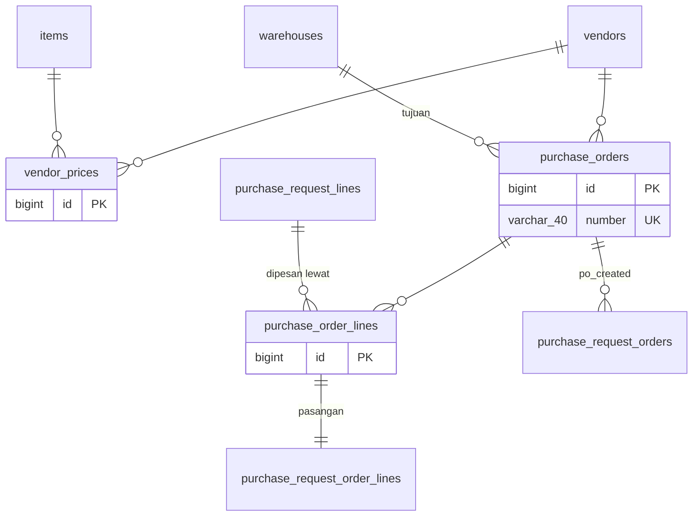
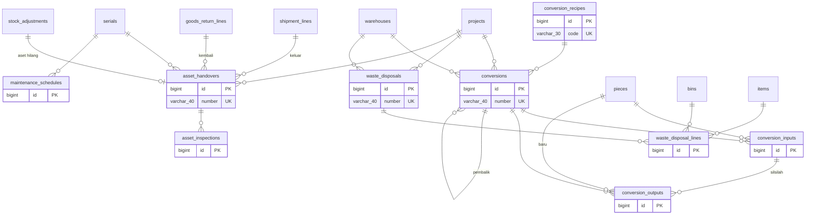
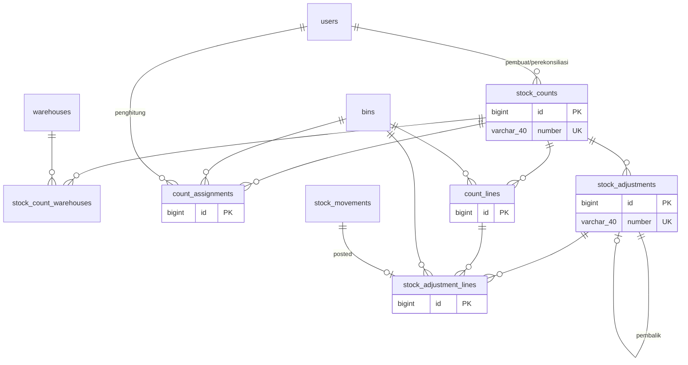
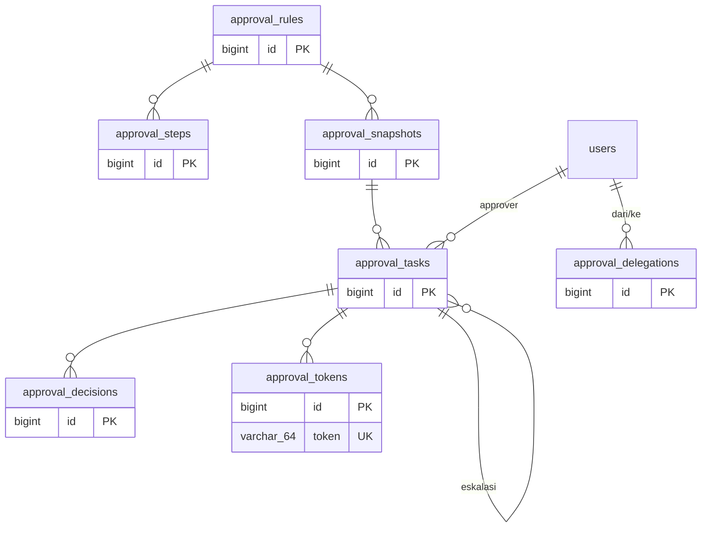
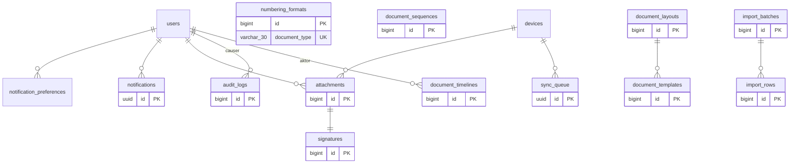

# Model Data — Konversi & aset, opname & penyesuaian, approval, umum

**Versi:** 0.22 (Part 3, diselaraskan dengan migrasi modul Access s.d. Pendukung F1, penutup & tinjauan kode 25 Sep 2026, Purchasing inti Fase 1b, lampiran generik, dan tinjauan pemilik produk 26 Sep 2026)
**Tanggal:** 26 September 2026
**Status:** berdasarkan Blueprint v0.4, Aturan Bisnis v0.4, Katalog Status v0.13, dan seluruh asumsi A-01–A-71 yang telah disetujui (terakhir A-71, 24 Sep 2026); selisih kode ↔ ERD dicatat di A-74 dan A-75 (perlu validasi); kolom implementasi modul Receipt/Putaway mengikuti A-78–A-84, modul Approval A-94, modul Count/Adjustment A-95–A-105, modul Transfer/Retur A-106–A-116, modul Template A-123, modul Issue A-117–A-118, modul Aset A-165, modul Purchase Request A-172, modul Platform A-184, Pendukung F1 A-189, kartu stok A-194, Purchasing inti A-208–A-215, lampiran A-238, override bin beku A-240, kelebihan terima A-245, tinjauan pemilik produk A-246 dst. ([04b](04b-asumsi-lanjutan.md)). Dibuat otomatis oleh [`diagram/_generate_erd.py`](../diagram/_generate_erd.py) — **jangan diedit manual**; ubah data lalu jalankan ulang.
**Dokumen terkait:** [Arsitektur](08-arsitektur.md) · [Glosarium](03-glosarium.md) · [Katalog Status](06-katalog-status-dan-enum.md) · [Aturan Bisnis](05-aturan-bisnis.md) · [Inti](08a-model-data-inti.md) · [Stok & dokumen](08b-model-data-stok-dokumen.md)

Daftar area lengkap ada di [08a-model-data-inti.md](08a-model-data-inti.md).

**Konvensi yang tidak diulang di setiap tabel:**
- Semua tabel tenant: `id BIGINT PK`, `created_at`, `updated_at`, `created_by`, `updated_by` (FK `users`). Semua waktu UTC ([BR-GEN-07](05-aturan-bisnis.md#br-gen)).
- **Belum diimplementasikan:** `created_by`/`updated_by`, `submitted_at`, `cancelled_at`, `reversal_of_id` (header) serta `line_no`, `uom_id`, `qty_input`, `source_line_type` (baris) belum ada di migrasi; jejak pembuat/pengubah diambil dari `audit_logs` dan jumlah baris disimpan dalam satuan dasar saja. Lihat [A-74](04-keputusan-dan-asumsi.md#a-74).
- Header dokumen: `number` (unik), `status` (enum Katalog), `source_type` + `source_id` (induk polimorfik), `reversal_of_id`, `notes`, `submitted_at`, `cancelled_at`, `cancel_reason_id`.
- Baris dokumen `<doc>_lines`: `line_no`, `item_id`, `uom_id` (satuan input), `qty_input`, `qty_base DECIMAL(18,4)`, `lot_id`, `serial_id`, `piece_id` (nullable sesuai `tracking_mode`), `source_line_type` + `source_line_id`.
- Enum memakai nilai dari [Katalog Status & Enum](06-katalog-status-dan-enum.md); di MySQL disimpan sebagai `VARCHAR(30)` + CHECK/validasi aplikasi, bukan tipe ENUM MySQL (agar migrasi per tenant aman).
- Kunci: 🔑 PK · ↗ FK · ◆ unik. Tabel abu-abu di `.drawio` = milik area lain (rujukan).

---

## Area: Purchasing inti: harga beli vendor & PO (tenant, Fase 1b)

**Diagram:** [`diagram/erd-purchasing.drawio`](../diagram/erd-purchasing.drawio) · **Rujukan:** KS 2.17, D-28, D-29, A-208, A-210, A-211, purchasing/02

Satu-satunya area bernilai uang di database company (A-208). PO dibuat dari baris PRQ untuk satu vendor dan satu gudang tujuan; saat disetujui menjadi catatan pemesanan PRQ (po_created) sehingga GRN vendor merujuknya. Tabel WMS hanya menyimpan rujukan ke PO, tanpa harga (D-07).

### Diagram (Mermaid)

### Entitas

**`vendor_prices` — Harga beli vendor.** 🔑`id` bigint · ↗`vendor_id` bigint · ↗`item_id` bigint · `unit_price` decimal(18,2) *(per satuan dasar (A-211))* · `currency` char(3) *(IDR)* · `valid_from` date · `is_active` bool *(harga lama dinonaktifkan, tidak dihapus (P-03))* · `notes` varchar(255) · ↗`created_by` bigint
  ↳ Harga berlaku = aktif, valid_from terbaru ≤ tanggal PO

**`purchase_orders` — PO header.** 🔑`id` bigint · ◆`number` varchar(40) *(PO/<gudang>/<yymm>/<urut>)* · ↗`vendor_id` bigint *(vendor aktif (A-210))* · ↗`warehouse_id` bigint *(tujuan)* · `status` enum *(KS 2.17 (status umum, A-209))* · `order_date` date · `eta_date` date *(po_updated)* · `currency` char(3) *(IDR)* · `total_amount` decimal(18,2) *(Σ nilai baris; kondisi approval order_value_min (A-212))* · `payment_terms` varchar(60) *(salinan teks termin vendor)* · ↗`approval_snapshot_id` bigint · ↗`submitted_by` bigint · ↗`approved_by` bigint · ↗`reject_reason_id` bigint · ↗`close_reason_id` bigint *(tutup sisa (A-215))* · `closed_at` datetime · `completed_at` datetime
  ↳ kolom header dokumen standar (lihat konvensi)

**`purchase_order_lines` — PO baris.** 🔑`id` bigint · ↗`purchase_order_id` bigint · ↗`purchase_request_line_id` bigint *(baris PRQ asal (A-210))* · ↗`item_id` bigint · `qty_base` decimal(18,4) · `qty_over_request` decimal(18,4) *(di atas sisa PRQ (A-246))* · `over_order_reason` varchar(255) *(wajib bila lebih, mis. MOQ (A-246))* · `unit_price` decimal(18,2) *(A-211)* · `line_amount` decimal(18,2) *(qty × harga)* · `qty_received` decimal(18,4) *(dari GRN (A-214))* · `qty_cancelled` decimal(18,4) *(sisa batal/tutup (A-215))* · `notes` varchar(255)
  ↳ kolom baris standar (lihat konvensi)

## Area: Konversi, resep, waste, aset (tenant)

**Diagram:** [`diagram/erd-konversi-aset.drawio`](../diagram/erd-konversi-aset.drawio) · **Rujukan:** KS 2.10, 2.11, 2.14, [BR-CNV](05-aturan-bisnis.md#br-cnv), [BR-AST](05-aturan-bisnis.md#br-ast)

Konversi memakai tabel input dan output terpisah agar neraca ukuran bisa divalidasi (BR-CNV-02). Aset memakai `serials` sebagai identitas; serah terima dan pemeriksaan adalah catatan per kejadian.

### Diagram (Mermaid)

### Entitas

**`conversions` — CNV header.** 🔑`id` bigint · ◆`number` varchar(40) *(CNV/<gudang>/<yymm>/<urut> (A-155))* · ↗`project_id` bigint *([BR-CNV-01](05-aturan-bisnis.md#br-cnv))* · ↗`warehouse_id` bigint *(satu gudang; Gudang Site hanya proyek pemilik (A-154))* · `conversion_type` enum *(cut|assemble|disassemble|repack)* · ↗`recipe_id` bigint *(F2)* · `status` enum *(KS 2.10)* · ↗`reversal_of_id` bigint *(CNV pembalik (A-157))* · ↗`reason_code_id` bigint *(alasan pembalik (A-157))* · `total_input` decimal(18,4) · `total_output` decimal(18,4) · `total_offcut` decimal(18,4) · `total_waste` decimal(18,4) · `total_kerf` decimal(18,4) · ↗`approval_snapshot_id` bigint *(hanya bila ada aturan (A-153))* · ↗`prepared_by` bigint *(pembuat (A-155))* · ↗`submitted_by` bigint *(pengaju ([BR-APR-03](05-aturan-bisnis.md#br-apr)))* · `submitted_at` datetime · ↗`approved_by` bigint · `approved_at` datetime · ↗`reject_reason_id` bigint *(ditolak = kembali draft (A-153))* · ↗`completed_by` bigint · `completed_at` datetime · ↗`cancel_reason_id` bigint · `cancelled_at` datetime
  ↳ kolom header dokumen standar (lihat konvensi)

**`conversion_inputs` — CNV input.** 🔑`id` bigint · ↗`conversion_id` bigint · ↗`item_id` bigint · ↗`bin_id` bigint *(bin penyimpanan (A-154))* · ↗`lot_id` bigint · ↗`piece_id` bigint *(potongan dipakai utuh (A-154))* · `qty_base` decimal(18,4) · ↗`reversal_of_line_id` bigint *(baris asal pembalik (A-155))* · ↗`movement_id` bigint *(pergerakan kartu stok (A-155))*

**`conversion_outputs` — CNV output / offcut / waste.** 🔑`id` bigint · ↗`conversion_id` bigint · `output_kind` enum *(output|offcut|waste|kerf)* · ↗`item_id` bigint *(output bisa item lain)* · ↗`bin_id` bigint *(waste → bin Waste; kerf kosong)* · `stock_status` enum *(Tersedia; waste Rusak (A-155))* · `qty_base` decimal(18,4) *(item per potong: panjang satu potongan)* · `lot_no` varchar(60) *(output berlot baru (A-154))* · ↗`lot_id` bigint *(warisan input atau dibuat saat selesai)* · ↗`new_piece_id` bigint *(potongan baru (silsilah via pieces.parent_piece_id))* · ↗`parent_input_id` bigint *(conversion_inputs (silsilah))* · ↗`reason_code_id` bigint *(alasan waste)* · `auto_waste` bool *(offcut < minimum → waste ([BR-CNV-03](05-aturan-bisnis.md#br-cnv)))* · ↗`reversal_of_line_id` bigint *(A-155)* · ↗`movement_id` bigint *(A-155)*

**`conversion_recipes` — Resep konversi (F2).** 🔑`id` bigint · ◆`code` varchar(30) · `name` varchar(100) · `definition` json *(input → output + sisa)* · `is_active` bool

**`waste_disposals` — WST header.** 🔑`id` bigint · ◆`number` varchar(40) *(WST/<gudang>/<yymm>/<urut> (A-155))* · ↗`warehouse_id` bigint · ↗`project_id` bigint *(wajib (A-159))* · `disposition` enum *(waste_disposition)* · ↗`target_bin_id` bigint *(dipakai ulang → bin penyimpanan (A-159))* · `status` enum *(KS 2.14)* · `evidence_attachment_id` bigint *(tabel lampiran belum ada ([A-68](04-keputusan-dan-asumsi.md#a-68)))* · `evidence_path` varchar(255) *(foto BA (A-160))* · `evidence_note` varchar(255) *(nomor BA bertanda tangan (A-160))* · ↗`approval_snapshot_id` bigint · ↗`submitted_by` bigint *(pengaju)* · ↗`approved_by` bigint · `approved_at` datetime · ↗`reject_reason_id` bigint · ↗`closed_by` bigint · `closed_at` datetime · ↗`cancel_reason_id` bigint · `cancelled_at` datetime
  ↳ kolom header dokumen standar (lihat konvensi)

**`waste_disposal_lines` — WST baris.** 🔑`id` bigint · ↗`waste_disposal_id` bigint · ↗`item_id` bigint · ↗`bin_id` bigint *(bin Waste)* · ↗`lot_id` bigint · ↗`serial_id` bigint · ↗`piece_id` bigint *(potongan utuh (A-159))* · `stock_status` enum *(kondisi di bin Waste (A-155))* · `qty_base` decimal(18,4) · ↗`reason_code_id` bigint *(opsional, konteks Waste)* · ↗`movement_id` bigint *(A-155)*
  ↳ kolom baris standar (lihat konvensi)

**`asset_handovers` — AST serah terima.** 🔑`id` bigint · ◆`number` varchar(40) *(AST/<gudang>/<yymm>/<urut> (A-165))* · ↗`serial_id` bigint · ↗`item_id` bigint *(A-165)* · ↗`project_id` bigint · ↗`warehouse_id` bigint *(gudang asal SJ (A-165))* · ↗`shipment_id` bigint *(A-165)* · ↗`shipment_line_id` bigint *(keluar)* · ↗`goods_return_id` bigint *(A-165)* · ↗`goods_return_line_id` bigint *(kembali)* · ↗`transfer_id` bigint *(TRF aset (A-249))* · ↗`previous_handover_id` bigint *(AST proyek sebelumnya (A-249))* · ↗`next_handover_id` bigint *(AST proyek berikutnya (A-249))* · `status` enum *(checked_out|returned|inspected|transferred)* · `checked_out_at` datetime · `due_return_date` date *(bawaan target selesai proyek (A-163))* · `condition_out` char(1) · `photo_out_id` bigint *(attachments; foto serah terima keluar, tanpa FK (A-238))* · `meter_out` decimal(12,1) *([A-66](04-keputusan-dan-asumsi.md#a-66))* · `returned_at` datetime · `usage_days` int *([BR-AST-05](05-aturan-bisnis.md#br-ast))* · `meter_in` decimal(12,1) *(≥ meter_out ([BR-AST-08](05-aturan-bisnis.md#br-ast)))* · `usage_hours` decimal(12,1) *(meter jam)* · `usage_km` decimal(12,1) *(meter km (A-165))* · `lost_at` datetime *(asset.mark_lost (A-167))* · ↗`lost_reason_id` bigint · ↗`stock_adjustment_id` bigint *(ADJ asset_lost (A-167))* · ↗`updated_by` bigint
  ↳ kolom header dokumen standar (lihat konvensi)

**`asset_inspections` — Pemeriksaan aset.** 🔑`id` bigint · ↗`asset_handover_id` bigint · ↗`serial_id` bigint · ↗`inspected_by` bigint · `inspected_at` datetime · `condition_grade` char(1) *(A–D)* · `condition_score` tinyint *(0–100 % wajib ([BR-AST-08](05-aturan-bisnis.md#br-ast)))* · `component_notes` json *(catatan per komponen)* · `photo_id` bigint *(attachments ([A-68](04-keputusan-dan-asumsi.md#a-68)))* · `photo_path` varchar(255) *(foto wajib (A-166))* · `meter_in` decimal(12,1) *(A-165)* · `meter_reset_reason` varchar(255) *(meter diganti (A-166))* · `notes` varchar(255) · `resulting_state` enum *(available|maintenance|damaged)*
  ↳ Riwayat kondisi aset ([A-66](04-keputusan-dan-asumsi.md#a-66)); grade → state (A-164)

**`maintenance_schedules` — Jadwal maintenance (F2).** 🔑`id` bigint · ↗`serial_id` bigint · `scheduled_at` date · `interval_days` int · `performed_at` date · `notes` varchar(255) · `status` enum *(planned|in_progress|done)*

## Area: Stock opname & penyesuaian (tenant)

**Diagram:** [`diagram/erd-opname.drawio`](../diagram/erd-opname.drawio) · **Rujukan:** KS 2.12, 2.13, [BR-OPN](05-aturan-bisnis.md#br-opn), [A-42](04-keputusan-dan-asumsi.md#a-42)

Sesi opname menyimpan snapshot saldo fisik per bin saat mulai (BR-OPN-01), hitungan per penghitung (hitung buta), klasifikasi selisih, dan menghasilkan satu ADJ per gudang.

### Diagram (Mermaid)

### Entitas

**`stock_counts` — OPN sesi.** 🔑`id` bigint · ◆`number` varchar(40) *(OPN/<gudang|ALL>/<yymm>/<urut>)* · `count_type` enum *(monthly|annual|adhoc|spot_check|cycle_abc ([BR-OPN-10](05-aturan-bisnis.md#br-opn)))* · `status` enum *(KS 2.13)* · `freeze_bins` bool · `scope` json *(gudang/zona/bin/item)* · `team_user_ids` json *(tim penghitung (A-104))* · `is_audit` bool *(dibuat Auditor ([BR-OPN-09](05-aturan-bisnis.md#br-opn), A-104))* · `planned_start` date · ↗`created_by` bigint *(pembuat)* · `started_at` datetime · ↗`submitted_by` bigint *(perekonsiliasi = pengaju approval (A-104))* · `reconciled_at` datetime · ↗`approved_by` bigint · `approved_at` datetime · ↗`reject_reason_id` bigint *(penolakan terakhir ([A-97](04-keputusan-dan-asumsi.md#a-97)))* · `closed_at` datetime · `lock_date_set` date *(kunci periode yang dimajukan ([BR-STK-15](05-aturan-bisnis.md#br-stk), A-101))* · `report_attachment_id` bigint *(arsip PDF laporan akhir saat ditutup; tanpa FK (A-238))* · ↗`approval_snapshot_id` bigint · ↗`cancel_reason_id` bigint
  ↳ kolom header dokumen standar (lihat konvensi); nomor memakai gudang atau ALL

**`stock_count_warehouses` — OPN ↔ gudang.** ↗`stock_count_id` bigint · ↗`warehouse_id` bigint · ↗`stock_adjustment_id` bigint *(satu ADJ per gudang ([BR-OPN-06](05-aturan-bisnis.md#br-opn)))*
  ↳ PK(stock_count_id, warehouse_id)

**`count_assignments` — Penugasan penghitung.** 🔑`id` bigint · ↗`stock_count_id` bigint · ↗`bin_id` bigint · ↗`counter_user_id` bigint *(kosong = belum ditugaskan)* · `round` int *(1 = pertama, 2 = hitung ulang (orang berbeda))* · `status` enum *(pending|done (count_assignment_status))* · `counted_at` datetime *(A-104)*
  ↳ UK(stock_count_id, bin_id, round)

**`count_lines` — Baris hitung.** 🔑`id` bigint · ↗`stock_count_id` bigint · ↗`bin_id` bigint · ↗`item_id` bigint · ↗`lot_id` bigint · ↗`serial_id` bigint · ↗`piece_id` bigint · `stock_status` enum *(kondisi saldo yang di-snapshot (A-104))* · `is_unexpected` bool *(temuan di luar snapshot (A-100))* · `system_qty` decimal(18,4) *(snapshot fisik)* · `counted_qty_r1` decimal(18,4) · `counted_qty_r2` decimal(18,4) · `is_recount` bool *(masuk hitung ulang ([A-99](04-keputusan-dan-asumsi.md#a-99)))* · `final_qty` decimal(18,4) · `variance_qty` decimal(18,4) · `variance_pct` decimal(8,4) · `variance_class` enum *(minor|moderate|major)* · `root_cause` enum *(root_cause_category)* · `note` varchar(255) · ↗`device_id` bigint

**`stock_adjustments` — ADJ header.** 🔑`id` bigint · ◆`number` varchar(40) *(ADJ/<gudang>/<yymm>/<urut>)* · ↗`warehouse_id` bigint · `origin` enum *(manual|count|discrepancy|asset_lost|over_receipt (adjustment_origin))* · ↗`stock_count_id` bigint · ↗`goods_receipt_id` bigint *(over_receipt: GRN asal (A-245))* · ↗`reversal_of_id` bigint *(ADJ pembalik ([BR-GEN-03](05-aturan-bisnis.md#br-gen)))* · ↗`reason_code_id` bigint · `status` enum *(KS 2.12)* · ↗`submitted_by` bigint *(pengaju ([BR-APR-03](05-aturan-bisnis.md#br-apr), A-104))* · ↗`approval_snapshot_id` bigint *(manual: wajib ([A-09](04-keputusan-dan-asumsi.md#a-09)))* · ↗`approved_by` bigint · `approved_at` datetime · ↗`reject_reason_id` bigint · `posted_at` datetime · ↗`cancel_reason_id` bigint
  ↳ kolom header dokumen standar (lihat konvensi)

**`stock_adjustment_lines` — ADJ baris.** 🔑`id` bigint · ↗`stock_adjustment_id` bigint · ↗`item_id` bigint · ↗`bin_id` bigint · ↗`lot_id` bigint · ↗`serial_id` bigint · ↗`piece_id` bigint · `lot_no` varchar(60) *(isian lot baru, dibuat saat posted (A-102))* · `expiry_date` date · `serial_no` varchar(80) *(isian serial baru (A-102))* · `piece_length` decimal(18,4) *(potongan baru (A-102))* · `qty_delta` decimal(18,4) *(±)* · `stock_status` enum · ↗`count_line_id` bigint · ↗`reversal_of_line_id` bigint *(baris asal yang dibalik ([BR-LED-05](05-aturan-bisnis.md#br-led)))* · ↗`reason_code_id` bigint · ↗`movement_id` bigint *(pergerakan kartu stok saat posted (A-104))* · `notes` varchar(255)
  ↳ kolom baris standar (lihat konvensi)

## Area: Approval engine (tenant)

**Diagram:** [`diagram/erd-approval.drawio`](../diagram/erd-approval.drawio) · **Rujukan:** Blueprint §8, KS 3, [BR-APR](05-aturan-bisnis.md#br-apr)

Aturan hidup (`approval_rules/steps`) di-snapshot ke `approval_snapshots` saat dokumen diajukan (BR-APR-01). Tugas per lapis dan keputusan dicatat terpisah agar delegasi, eskalasi, dan kanal WA bisa diaudit.

### Diagram (Mermaid)

### Entitas

**`approval_rules` — Aturan approval.** 🔑`id` bigint · `document_type` varchar(30) · `name` varchar(100) · `priority` int · `conditions` json *(gudang, proyek, kategori, kepemilikan, qty ≥, dari klien, jenis vendor, asal PRQ ([BR-APR-07](05-aturan-bisnis.md#br-apr)); F2: melebihi rencana)* · `is_active` bool

**`approval_steps` — Lapis aturan.** 🔑`id` bigint · ↗`approval_rule_id` bigint · `step_no` int · `approver_type` enum *(user|position|role|direct_manager|warehouse_head|project_pic)* · `approver_ref_id` bigint · `decision_mode` enum *(sequential|any|all)* · `backup_approver_type` enum · `backup_ref_id` bigint · `timeout_hours` int *(default 24)* · `channel` enum *(web|whatsapp|both)* · `require_pin` bool

**`approval_snapshots` — Snapshot per dokumen.** 🔑`id` bigint · `document_type` varchar(30) · `document_id` bigint · `document_number` varchar(40) *([A-94](04-keputusan-dan-asumsi.md#a-94))* · ↗`rule_id` bigint *(asal)* · `rule_name` varchar(100) *(nama aturan saat diajukan ([A-94](04-keputusan-dan-asumsi.md#a-94)))* · `context` json *(data dokumen yang dicocokkan ([A-94](04-keputusan-dan-asumsi.md#a-94)))* · `steps` json *(salinan lapis yang berlaku setelah SoD)* · `status` enum *(pending|approved|rejected|cancelled)* · `current_step` int · ↗`submitted_by` bigint · `submitted_at` datetime(6) *(mikrodetik ([A-94](04-keputusan-dan-asumsi.md#a-94)))* · `decided_at` datetime(6)
  ↳ UK(document_type, document_id, submitted_at)

**`approval_tasks` — Tugas approval per lapis.** 🔑`id` bigint · ↗`approval_snapshot_id` bigint · `step_no` int · ↗`approver_user_id` bigint *(resolusi approver_type)* · ↗`delegated_from_user_id` bigint *([BR-APR-05](05-aturan-bisnis.md#br-apr))* · ↗`escalated_from_task_id` bigint *([BR-APR-06](05-aturan-bisnis.md#br-apr))* · `due_at` datetime · `status` enum *(open|decided|superseded|expired)*

**`approval_decisions` — Keputusan.** 🔑`id` bigint · ↗`approval_task_id` bigint · `decision` enum *(approval_decision)* · ↗`decided_by` bigint · `decided_at` datetime · `channel` enum *(web|whatsapp)* · ↗`reason_code_id` bigint · `comment` varchar(255) · `wa_from_number` varchar(20) *([BR-APR-10](05-aturan-bisnis.md#br-apr))* · `wa_message_id` varchar(120) · ↗`approval_token_id` bigint

**`approval_delegations` — Delegasi.** 🔑`id` bigint · ↗`from_user_id` bigint · ↗`to_user_id` bigint · `starts_at` datetime · `ends_at` datetime · `document_types` json *(null = semua)* · `is_active` bool *(diakhiri, tidak dihapus)* · `notes` varchar(255) *([A-94](04-keputusan-dan-asumsi.md#a-94))*

**`approval_tokens` — Token WA (F2).** 🔑`id` bigint · ↗`approval_task_id` bigint · ◆`token` varchar(64) · `expires_at` datetime · `used_at` datetime · `wa_message_id` varchar(120)

## Area: Timeline, audit, lampiran, notifikasi, template, penomoran, impor, sinkron (tenant)

**Diagram:** [`diagram/erd-umum.drawio`](../diagram/erd-umum.drawio) · **Rujukan:** [BR-GEN-05](05-aturan-bisnis.md#br-gen), [BR-GEN-06](05-aturan-bisnis.md#br-gen), Blueprint §10–§12, NFR-03, NFR-14

Dua catatan resmi (BR-GEN-05): `document_timelines` untuk user, `audit_logs` untuk Admin. Penomoran dikunci di `document_sequences` (BR-GEN-06).

### Diagram (Mermaid)

### Entitas

**`document_timelines` — Timeline dokumen.** 🔑`id` bigint · `document_type` varchar(30) · `document_id` bigint · `from_status` varchar(30) · `to_status` varchar(30) · `action` varchar(40) *(permission)* · ↗`actor_id` bigint · `channel` enum *(web|pwa|whatsapp|system|token_link)* · `note` varchar(255) · ↗`reason_code_id` bigint · `occurred_at` datetime
  ↳ append-only; index (document_type, document_id)

**`audit_logs` — Jejak audit teknis.** 🔑`id` bigint · `log_name` varchar(255) *(kanal log, index)* · `description` text · `subject_type` varchar(255) *(record yang diubah (polimorfik))* · `subject_id` bigint · `event` varchar(255) *(created|updated|deleted|login|setting|support_access)* · `causer_type` varchar(255) *(pelaku: user tenant atau platform_users (akses dukungan))* · `causer_id` bigint · `properties` json *(nilai lama & baru)* · `ip_address` varchar(45) *(hanya Admin)* · `batch_uuid` uuid · `created_at` datetime · `updated_at` datetime
  ↳ append-only; skema spatie/laravel-activitylog 4.x dengan nama tabel audit_logs + ip_address ([A-75](04-keputusan-dan-asumsi.md#a-75))

**`attachments` — Lampiran.** 🔑`id` bigint · `attachable_type` varchar(40) *(alias: material_issue|asset_handover|stock_count (A-238))* · `attachable_id` bigint · `kind` enum *(attachment_kind: photo|document|signature|report)* · `disk` varchar(20) *(s3|local)* · `path` varchar(255) · `original_name` varchar(150) · `mime` varchar(60) · `size_bytes` int *(≤ 5 MB ([A-23](04-keputusan-dan-asumsi.md#a-23)))* · ↗`uploaded_by` bigint · ↗`device_id` bigint · `created_at` datetime
  ↳ berkas di disk local per company, dialirkan lewat route berizin; tanpa hapus fisik (P-03, A-238)

**`signatures` — Tanda tangan.** 🔑`id` bigint · ↗`user_id` bigint *(null bila penerima tanpa akun)* · `signer_name` varchar(100) · ↗`attachment_id` bigint · `captured_at` datetime · `source` enum *(profile|device)*

**`notifications` — Notifikasi.** 🔑`id` uuid · ↗`user_id` bigint · `type` varchar(60) *(kunci kejadian (A-189))* · `channel` enum *(in_app|email|whatsapp)* · `title` varchar(150) *(A-189)* · `body` varchar(500) *(A-189)* · `url` varchar(255) *(relatif ke subdomain company (A-189))* · `data` json · `document_type` varchar(30) · `document_id` bigint · `sent_at` datetime · `read_at` datetime

**`notification_preferences` — Preferensi kanal.** ↗`user_id` bigint · `event_key` varchar(60) · `in_app` bool · `email` bool · `whatsapp` bool *(dibatasi Admin Company)*
  ↳ PK(user_id, event_key)

**`document_layouts` — Layout induk.** 🔑`id` bigint · `name` varchar(80) · `logo_attachment_id` bigint *(tanpa FK sampai tabel lampiran ada (A-123))* · `logo_path` varchar(255) *(A-123)* · `header_html` text *(F1 teks biasa (A-122))* · `footer_html` text *(F1 teks biasa)* · `colors` json *({accent})* · `signature_blocks` json *({jenis: [label]} (A-125))* · `is_default` bool

**`document_templates` — Template dokumen.** 🔑`id` bigint · `document_type` varchar(30) · `name` varchar(80) · ↗`layout_id` bigint · `body_html` text *(F1 kosong = Blade bawaan; editor F2 (A-122))* · `paper` varchar(20) *(paper_size (A-120))* · `is_default` bool · `version` int
  ↳ UK(document_type, name, version)

**`numbering_formats` — Format nomor.** 🔑`id` bigint · ◆`document_type` varchar(30) · `pattern` varchar(80) *({KODE}/{GUDANG}/{TAHUN}/{BULAN}/{URUT})* · `reset_period` enum *(monthly|yearly|never)* · `pad` int *(4)* · `warehouse_segment` enum *(origin|fulfilling|all ([A-43](04-keputusan-dan-asumsi.md#a-43)))*

**`document_sequences` — Urutan nomor.** 🔑`id` bigint · `document_type` varchar(30) · `segment` varchar(20) *(kode gudang atau ALL)* · `period` varchar(7) *(2026-09)* · `last_number` int
  ↳ UK(document_type, segment, period); SELECT … FOR UPDATE

**`import_batches` — Impor Excel.** 🔑`id` bigint · `target` varchar(30) *(items|clients|vendors|bins|…)* · ↗`file_attachment_id` bigint · `status` enum *(validating|previewed|committed|failed)* · `total_rows` int · `error_rows` int · `committed_at` datetime

**`import_rows` — Baris impor.** 🔑`id` bigint · ↗`import_batch_id` bigint · `row_no` int · `data` json · `errors` json · `result_id` bigint *(id record yang dibuat)*

**`sync_queue` — Antrean sinkron PWA (F2).** 🔑`id` uuid *(dibuat di perangkat)* · ↗`device_id` bigint · ↗`user_id` bigint · `action` varchar(40) · `payload` json · `temp_number` varchar(50) *(TMP-…)* · `status` enum *(sync_status)* · `conflict_reason` varchar(255) · `received_at` datetime · `processed_at` datetime
