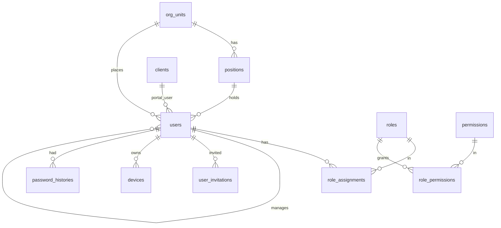

# Spesifikasi Modul — `access` (Akses, Autentikasi, Role & Cakupan, Organisasi)

**Versi:** 0.4
**Tanggal:** 23 September 2026
**Status:** **selesai untuk Fase 1** — kerangka aplikasi, autentikasi, seluruh layar §6.1–§6.7, domain, seeder, dan 82 pengujian sudah jalan. Sisa pekerjaan kecil & penyimpangan: §13
**Modul:** `access`
**Fase:** F1 (SSO F3 dan auditor eksternal F2 hanya stub)
**Dokumen terkait:** [Blueprint §4](01-blueprint.md#4-pengguna--peran), [§6.2](01-blueprint.md#62-struktur-organisasi--gudang), [§13](01-blueprint.md#13-autentikasi--sso) · [Aturan Bisnis](05-aturan-bisnis.md) · [Katalog Status](06-katalog-status-dan-enum.md) · [Glosarium §11](03-glosarium.md#11-role--akses) · [Model data akses](08a-model-data-inti.md#area-user-role-cakupan-struktur-organisasi-tenant), [pusat](08a-model-data-inti.md#area-database-pusat-platform) · [Arsitektur §3–§4](08-arsitektur.md#3-tenancy--siklus-request) · [Akun uji](../00-akun-uji.md)
**Ketergantungan modul:** tidak ada (modul pertama). Menyertakan **kerangka aplikasi**: tenancy (AD-01), layout Blade dari `template/`, middleware, seeder referensi. Modul `platform` (company, langganan) dibangun terpisah; Access hanya membaca `companies` dan `subscriptions` lewat middleware.

---

## 1. Tujuan & lingkup

Modul ini membuat WMS bisa dimasuki dengan aman per company dan menentukan **siapa boleh melakukan apa di gudang/proyek mana**. Pemakainya: Admin Company (mengelola user, role, organisasi), seluruh user internal (login, profil), user klien (login portal), dan Super Admin (akses dukungan berperiode).

Termasuk `[F1]`: login lokal per subdomain ([D-26](04-keputusan-dan-asumsi.md#d-26)); undangan user & atur password pertama; lupa/atur ulang password; 2FA TOTP opsional; kunci akun; profil (nama, WA, tanda tangan gambar, 2FA, perangkat); user CRUD dengan **nonaktif bukan hapus** (P-03); role & permission (template bawaan + role buatan); **penugasan role × cakupan** ([BR-GEN-09](05-aturan-bisnis.md#br-gen), [A-46](04-keputusan-dan-asumsi.md#a-46)); struktur organisasi (unit, jabatan, atasan langsung) untuk approval ([D-16](04-keputusan-dan-asumsi.md#d-16)); perangkat terdaftar (minimal: daftar & cabut); login portal klien ([BR-PRJ-07](05-aturan-bisnis.md#br-prj)); pemberian **akses dukungan** oleh Admin Company ([BR-SUB-04](05-aturan-bisnis.md#br-sub)).

Tidak termasuk: SSO NXTG `[F3]` (kolom `users.sso_sub` dan tabel `sso_identities` dibuat sebagai stub, [BR-GEN-10](05-aturan-bisnis.md#br-gen)); auditor eksternal `[F2]` (kolom `valid_until` sudah ada); manajemen company, paket, langganan (modul `platform`); notifikasi WhatsApp `[F2]`; impersonasi `[F2]`.

## 2. Aktor & permission

Permission ditulis `<modul>.<aksi>` dan disimpan di `permissions` dengan `module = access`.

| Role bawaan | Permission | Cakupan bawaan |
|---|---|---|
| Admin Company | semua `user.*`, `role.*`, `org.*`, `device.*`, `support_access.*`, `profile.update`, `auth.*` | semua |
| Manajemen | `user.view`, `role.view`, `org.view`, `profile.update`, `auth.*` | semua |
| Kepala Gudang | `user.view` (user di cakupannya), `device.view`, `profile.update`, `auth.*` | gudang yang ditugaskan |
| Staf Gudang, Driver, Pemohon Internal, Penindak Lanjut PR, Auditor Internal | `profile.update`, `auth.*`, `device.manage` (perangkat sendiri) | sesuai penugasan |
| Klien | `profile.update`, `auth.*` (hanya lewat `/portal`) | klien & proyeknya |

Daftar permission modul ini: `auth.login`, `auth.logout`, `auth.two_factor`, `profile.update`, `user.view`, `user.create`, `user.update`, `user.deactivate`, `user.invite`, `user.reset_password`, `user.impersonate` `[F2]`, `role.view`, `role.create`, `role.update`, `role.deactivate`, `role.assign`, `org.view`, `org.manage`, `device.view`, `device.manage`, `support_access.grant`, `support_access.revoke`. Permission modul lain didaftarkan oleh modul masing-masing ke tabel yang sama.

## 3. Entitas & data

Semua tabel di database **tenant** kecuali disebut *pusat*. Konvensi kolom umum (`id`, `created_at`, `updated_at`, `created_by`, `updated_by`) tidak diulang ([08a](08a-model-data-inti.md)). Kolom bertanda *(impl.)* adalah tambahan implementasi yang belum ada di ERD dan akan dimasukkan ke `_generate_erd.py` saat coding.

### 3.1 `users`

| Kolom | Tipe | Null | Keterangan |
|---|---|---|---|
| `name` | varchar(100) | — | |
| `email` | varchar(150) | — | unik per company ([BR-SUB-06](05-aturan-bisnis.md#br-sub)) |
| `phone` | varchar(20) | ya | nomor WA (E.164) untuk approval/OTP F2 |
| `password` | varchar(255) | ya | bcrypt; null bila hanya SSO F3 |
| `client_id` | bigint FK `clients` | ya | terisi = user klien |
| `org_unit_id`, `position_id` | bigint FK | ya | struktur organisasi |
| `manager_id` | bigint FK `users` | ya | atasan langsung (approval "atasan langsung", SoD) |
| `signature_path` | varchar(255) | ya | gambar tanda tangan (disk berkas) |
| `is_active` | bool | — | nonaktif = tidak bisa login, data tetap |
| `locked_until` | datetime | ya | kunci akun (NFR-04) |
| `two_factor_secret`, `two_factor_recovery_codes` | text | ya | TOTP; dienkripsi |
| `sso_sub` | varchar(191) | ya | unik; stub F3 |
| `email_verified_at`, `last_login_at`, `password_changed_at` *(impl.)* | datetime | ya | |
| `failed_login_count` *(impl.)* | tinyint | — | direset saat login sukses |

Indeks: `UK(email)`, `IDX(client_id)`, `IDX(manager_id)`, `IDX(is_active)`.

### 3.2 `roles`, `permissions`, `role_permissions`

`roles`: `code` varchar(40) UK (`company_admin`, `management`, `warehouse_head`, `warehouse_staff`, `driver`, `internal_requester`, `pr_follow_up`, `internal_auditor`, `external_auditor` F2, `client_user`), `name`, `is_builtin` bool (role bawaan tidak bisa dihapus, boleh disalin), `is_client_role` bool, `is_active` bool *(impl.)*. `permissions`: `key` varchar(80) UK, `module` varchar(30), `label` varchar(100) *(impl.)*. `role_permissions`: PK(`role_id`, `permission_id`). Implementasi memakai `spatie/laravel-permission` dengan nama tabel ini ([AD-06](08-arsitektur.md#2-keputusan-arsitektur)); guard tunggal `web`.

### 3.3 `role_assignments`

| Kolom | Tipe | Null | Keterangan |
|---|---|---|---|
| `user_id`, `role_id` | bigint FK | — | |
| `scope_type` | enum `all` · `warehouse` · `project` | — | `all` hanya untuk role internal ([BR-ACC-04](05-aturan-bisnis.md#br-acc)) |
| `scope_id` | bigint | ya | `warehouse_id` / `project_id`; null bila `all` |
| `valid_from`, `valid_until` | date | ya | `valid_until` untuk auditor eksternal F2 |
| `assigned_by` *(impl.)* | bigint FK `users` | — | |

`UK(user_id, role_id, scope_type, scope_id)`. Cakupan efektif user = gabungan semua penugasan aktif (tanggal berlaku) — dievaluasi oleh global scope `ScopedToUser` ([BR-ACC-05](05-aturan-bisnis.md#br-acc)).

### 3.4 `org_units`, `positions`, `user_invitations`, `devices`, `password_histories`

- `org_units`: `parent_id` self, `code` UK, `name`, `is_active` *(impl.)*.
- `positions`: `org_unit_id` FK, `code` UK, `name`, `level` int (1 = tertinggi; dipakai aturan approval "jabatan X").
- `user_invitations`: `user_id` FK, `token` varchar(64) UK (hash SHA-256 dari token acak 40 karakter), `expires_at` (+72 jam), `accepted_at`, `sent_count` *(impl.)*.
- `devices`: `user_id` FK, `device_uid` UK, `name`, `platform`, `last_seen_at`, `is_active`.
- `password_histories` *(impl.)*: `user_id` FK, `password` (hash), `created_at`; simpan 3 terakhir.
- *Pusat, dibaca saja:* `platform_users`, `companies`, `subscriptions`, `support_accesses`, `sso_identities` (stub).

**Status user (turunan, bukan enum baru):** *Diundang* = ada undangan belum diterima · *Aktif* = `is_active` dan undangan diterima · *Nonaktif* = `is_active = false` · *Terkunci* = `locked_until > now`. Label dipakai di daftar user dan badge.

## 4. Mesin status

Modul ini tidak punya dokumen berstatus di Katalog. Aturan implementasi yang berperilaku seperti transisi:

| Objek | Transisi | Implementasi | Efek samping |
|---|---|---|---|
| Undangan | dibuat → `accepted` (token valid, password diatur) | `AcceptInvitation` | `users.email_verified_at`, `is_active = true`; event `InvitationAccepted`; timeline user |
| Undangan | dibuat → kedaluwarsa (72 jam) | pengecekan saat dibuka | Admin dapat **kirim ulang** (`ResendInvitation`, `sent_count++`) |
| Akun | 5 gagal login berturut-turut → terkunci 15 menit | `RecordFailedLogin` | event `UserLocked` → notifikasi Admin; audit log |
| Akun | Aktif ↔ Nonaktif | `DeactivateUser` / `ReactivateUser` | semua sesi & token perangkat dicabut; guard [BR-ACC-02](05-aturan-bisnis.md#br-acc) |
| Password | diganti (profil / reset) | `ChangePassword` | simpan riwayat; sesi lain dihapus ([BR-ACC-06](05-aturan-bisnis.md#br-acc)); event `PasswordChanged` |
| Penugasan role | dibuat / diubah / dihapus | `AssignRole`, `RevokeRole` | event `RoleAssignmentChanged` → cache cakupan user dibersihkan; audit log |
| Akses dukungan | diberikan → berjalan → berakhir / dicabut | `GrantSupportAccess`, `RevokeSupportAccess` | tulis ke `support_accesses` (pusat) + `audit_logs` tenant ([BR-SUB-04](05-aturan-bisnis.md#br-sub)) |

Siklus request ([08 §3](08-arsitektur.md#3-tenancy--siklus-request)): middleware `InitializeTenancyBySubdomain` → `EnsureSubscriptionState` (`suspended` → hanya GET; `terminated` → hanya login Admin Company & ekspor, [BR-SUB-02–03](05-aturan-bisnis.md#br-sub)) → `auth` → `EnsureClientPortal` untuk `/portal` → `ScopedToUser`.

## 5. Aturan bisnis yang berlaku

| BR | Catatan implementasi |
|---|---|
| [BR-GEN-05](05-aturan-bisnis.md#br-gen) | `LogsActivity` pada `users`, `roles`, `role_assignments`, `org_units`, `positions`; nilai lama → baru; IP hanya untuk Admin |
| [BR-GEN-09](05-aturan-bisnis.md#br-gen) | cakupan pada penugasan; Policy memeriksa `role_assignments` aktif, bukan role user secara global |
| [BR-GEN-11](05-aturan-bisnis.md#br-gen) | semua form: field wajib bertanda `*`; nonaktifkan user = Alasan `*` + Keterangan opsional |
| [BR-SUB-03](05-aturan-bisnis.md#br-sub), [BR-SUB-04](05-aturan-bisnis.md#br-sub), [BR-SUB-06](05-aturan-bisnis.md#br-sub) | middleware langganan; akses dukungan berperiode; email unik per company |
| [BR-PRJ-07](05-aturan-bisnis.md#br-prj) | `/portal` hanya role Klien; login internal ditolak di portal dan sebaliknya |
| [BR-APR-03](05-aturan-bisnis.md#br-apr) | `manager_id` wajib diisi untuk role pemohon agar SoD & "atasan langsung" berjalan; peringatan bila kosong |
| [BR-ACC-01](05-aturan-bisnis.md#br-acc) | user tanpa penugasan role aktif tidak bisa login (kecuali `company_admin` bawaan) |
| [BR-ACC-02](05-aturan-bisnis.md#br-acc) | Admin Company terakhir yang aktif tidak bisa dinonaktifkan/dicabut rolenya |
| [BR-ACC-03](05-aturan-bisnis.md#br-acc) | role Klien eksklusif: validasi saat assign dan saat `client_id` diisi |
| [BR-ACC-04](05-aturan-bisnis.md#br-acc) | `scope_type = all` ditolak untuk `is_client_role` |
| [BR-ACC-05](05-aturan-bisnis.md#br-acc) | global scope `ScopedToUser` pada model bergudang/berproyek; Admin Company & Manajemen = `all` |
| [BR-ACC-06](05-aturan-bisnis.md#br-acc) | sesi per subdomain (cookie domain = subdomain company); ganti password menghapus sesi lain |
| NFR-01–04, NFR-10 ([Blueprint §16](01-blueprint.md#16-kebutuhan-non-fungsional)) | halaman error bermerek; CSRF; audit login; rate limit login 5/menit per IP+email; label form & kontras |

## 6. Layar

Layout: `template/partials/` → `resources/views/layouts/app.blade.php` (sidebar + header) dan `auth.blade.php` (tanpa sidebar, dari `template/auth/*.html`). jQuery hanya untuk plugin (DataTables, Select2); interaksi memakai Livewire + Alpine. Menu sidebar Fase 1 mengikuti urutan modul [08 §12](08-arsitektur.md#12-langkah-berikutnya-part-4). Semua form: field wajib bertanda `*` ([BR-GEN-11](05-aturan-bisnis.md#br-gen)).

Layar autentikasi memakai **controller + Blade** (form POST biasa, lebih mudah diuji dan sesuai NFR-02);
Livewire dipakai untuk layar pengelolaan yang interaktif (§6.3–§6.7).

### 6.1 Autentikasi — layout `auth`

| Route | Controller | Sumber template | Field (`*` wajib) | Aksi & aturan |
|---|---|---|---|---|
| `/login` | `LoginController` | `auth/login.html` | email `*`, password `*`, ingat saya | rate limit; gagal 5× → terkunci 15 menit; sukses → `last_login_at`; bila 2FA aktif → `/two-factor` |
| `/two-factor` | `TwoFactorController` | `auth/two-factor.html` | kode 6 digit `*` atau kode pemulihan | 5 percobaan |
| `/forgot-password` | `PasswordResetController` | `auth/forgot-password.html` | email `*` | selalu balasan sama (tidak membocorkan email); token 60 menit |
| `/reset-password/{token}` | `PasswordResetController` | `auth/reset-password.html` | password `*`, ulangi `*` | kebijakan password; riwayat 3 terakhir |
| `/invitation/{token}` | `InvitationController` | `auth/verify-email.html` | nama, password `*`, ulangi `*`, nomor WA | token 72 jam; kedaluwarsa → halaman minta kirim ulang |
| `/portal/login` | `LoginController` (mode portal) | `auth/login.html` | sama | hanya user `client_id` terisi; internal ditolak dengan pesan |
| `/logout` | POST | — | — | hapus sesi & token perangkat aktif |

Tidak dipakai: `auth/register.html`, `auth/lock-screen.html` (company dibuat Super Admin, user lewat undangan).

### 6.2 Profil — `/profile` — `Access\Profile`

Tab **Data diri** (nama `*`, email baca-saja, nomor WA, foto), **Tanda tangan** (unggah PNG/JPG ≤ 1 MB atau gambar di kanvas; dipakai dokumen), **Keamanan** (ganti password: lama `*`, baru `*`, ulangi `*`; 2FA aktif/nonaktif dengan QR + kode pemulihan), **Perangkat** (daftar perangkat, cabut). Portal klien memakai profil yang sama tanpa tab Perangkat.

### 6.3 Pengguna — `/users` — `Access\Users\Index`, `Form`, `Show`

| Kolom daftar | Filter | Aksi baris |
|---|---|---|
| Nama, email, role & cakupan (ringkas), unit/jabatan, status turunan, login terakhir | role, gudang/proyek cakupan, status, unit | lihat, ubah, undang ulang, nonaktifkan (Alasan `*` + Keterangan), reset password (kirim tautan) |

Form (`/users/create`, `/users/{id}/edit`):

| Field | Tipe | Wajib | Validasi | Keterangan |
|---|---|---|---|---|
| `name` | text | `*` | maks 100 | |
| `email` | email | `*` | unik per company | tidak bisa diubah setelah undangan diterima |
| `phone` | text | — | E.164 | |
| `org_unit_id`, `position_id` | select | — | jabatan harus milik unit | |
| `manager_id` | select user | — | bukan diri sendiri; peringatan bila kosong untuk pemohon | |
| `client_id` | select klien | — | wajib bila role Klien; kosong bila role internal | [BR-ACC-03](05-aturan-bisnis.md#br-acc) |
| Penugasan role (tabel) | role `*` + cakupan `*` (semua/gudang/proyek) + berlaku dari/sampai | `*` ≥ 1 | [BR-ACC-01](05-aturan-bisnis.md#br-acc), [BR-ACC-04](05-aturan-bisnis.md#br-acc) | tambah/hapus baris |
| Kirim undangan | toggle | — | default aktif saat buat | email undangan |

Detail (`/users/{id}`): tab Ringkasan, Penugasan Role, Perangkat, Riwayat (timeline + audit log ringkas).

### 6.4 Role — `/roles` — `Access\Roles\Index`, `Form`

Daftar role (bawaan bertanda, jumlah user). Form: `code` `*` (snake_case, unik), `name` `*`, `is_client_role`, **matriks permission per modul** (checkbox per aksi, tombol "salin dari role bawaan"). Role bawaan: permission bisa diubah, role tidak bisa dihapus/dinonaktifkan.

### 6.5 Struktur organisasi — `/org` — `Access\Org\Tree`

Pohon unit (tambah/ubah/nonaktifkan; `code` `*`, `name` `*`, induk), jabatan per unit (`code` `*`, `name` `*`, `level` `*`), daftar user per unit dengan atasan langsung. Dipakai aturan approval "atasan langsung" dan "jabatan X di unit Y".

### 6.6 Perangkat — `/devices` — `Access\Devices\Index`

Daftar perangkat semua user (Admin) / perangkat sendiri: nama, platform, terakhir terlihat, cabut. Pendaftaran perangkat terjadi saat login PWA (`device_uid` dari penyimpanan lokal).

### 6.7 Akses dukungan — `/settings/support-access` — `Access\SupportAccess`

Admin Company memberi izin ke Super Admin: alasan `*`, mulai `*`, selesai `*` (maks 7 hari), tombol cabut. Riwayat pemberian tampil dan tercatat di audit log ([BR-SUB-04](05-aturan-bisnis.md#br-sub)).

## 7. Kejadian stok & integrasi

Tidak ada kejadian stok. Audit log (`spatie/laravel-activitylog`, [AD-07](08-arsitektur.md#2-keputusan-arsitektur)) untuk users, roles, role_assignments, org_units, positions, support access. Event Laravel: `UserInvited`, `InvitationAccepted`, `UserLocked`, `PasswordChanged`, `RoleAssignmentChanged`, `SupportAccessGranted/Revoked`.

## 8. Notifikasi

| Kejadian | Penerima | Kanal | Template |
|---|---|---|---|
| Undangan dibuat / dikirim ulang | user baru | email | `access.invitation` (tautan 72 jam) |
| Lupa password | user | email | `access.reset_password` (60 menit) |
| Akun terkunci | user + Admin Company | email + in-app | `access.locked` |
| Penugasan role berubah | user | in-app | `access.role_changed` |
| Akses dukungan diberikan/dicabut | Admin Company, Super Admin | in-app + email | `access.support_access` |

## 9. Laporan & dashboard

| Laporan | Filter | Kolom | Ekspor |
|---|---|---|---|
| User × role × cakupan | role, gudang/proyek, status | user, role, cakupan, berlaku, atasan | Excel |
| Log login 30 hari | user, hasil | waktu, user, IP, kanal (web/PWA/portal), hasil | Excel |

## 10. Kasus uji (Given / When / Then)

| ID | Given | When | Then | BR |
|---|---|---|---|---|
| TC-ACC-01 | user aktif `staf1.ckg@demo.wms.test` | login email+password benar | masuk; `last_login_at` terisi; audit login | NFR-03 |
| TC-ACC-02 | user aktif | 5× password salah | `locked_until` = +15 menit; login ke-6 ditolak walau benar; notifikasi Admin | NFR-04 |
| TC-ACC-03 | user terkunci, 15 menit berlalu | login benar | masuk; `failed_login_count` = 0 | NFR-04 |
| TC-ACC-04 | 6 permintaan login dalam 1 menit dari IP sama | permintaan ke-6 | HTTP 429 | NFR-04 |
| TC-ACC-05 | Admin membuat user baru dengan undangan | buka tautan undangan < 72 jam, atur password | `accepted_at`, `email_verified_at` terisi; bisa login | — |
| TC-ACC-06 | undangan berumur > 72 jam | buka tautan | halaman kedaluwarsa; Admin kirim ulang → token baru, lama tidak berlaku | — |
| TC-ACC-07 | user lupa password | minta reset, buka tautan, atur password sama dengan 2 password sebelumnya | ditolak (riwayat 3 terakhir) | BR-ACC-06 |
| TC-ACC-08 | user dengan 2 sesi aktif | ganti password di profil | sesi lain berakhir | BR-ACC-06 |
| TC-ACC-09 | user mengaktifkan 2FA | login benar tanpa kode | diarahkan ke `/two-factor`; kode salah 5× → tolak | — |
| TC-ACC-10 | `kagudang.ckg` = Kepala Gudang CKG & Staf Gudang BKS | buka daftar gudang | hanya CKG & BKS; aksi approve hanya di CKG | A-04, BR-ACC-05 |
| TC-ACC-11 | user internal | Admin menambahkan role Klien | ditolak: role Klien eksklusif | BR-ACC-03 |
| TC-ACC-12 | user Klien | Admin memilih cakupan `all` | ditolak | BR-ACC-04 |
| TC-ACC-13 | user tanpa penugasan role aktif | login | ditolak dengan pesan "belum punya penugasan"; Admin diberi tahu | BR-ACC-01 |
| TC-ACC-14 | company hanya punya 1 Admin Company aktif | nonaktifkan Admin itu / cabut rolenya | ditolak | BR-ACC-02 |
| TC-ACC-15 | user dinonaktifkan (Alasan diisi) | user coba login; data historis dibuka | login ditolak; dokumen lama masih menampilkan namanya | P-03, BR-GEN-11 |
| TC-ACC-16 | nonaktifkan user tanpa Alasan | simpan | validasi: Alasan wajib `*`, Keterangan boleh kosong | BR-GEN-11 |
| TC-ACC-17 | user Klien `klien1@klien-satu.test` | login di `/login` (bukan portal) | ditolak; di `/portal/login` sukses; hanya menu portal | BR-PRJ-07 |
| TC-ACC-18 | user internal | login di `/portal/login` | ditolak | BR-PRJ-07 |
| TC-ACC-19 | langganan `terminated` | Staf login; Admin Company login | Staf ditolak; Admin masuk hanya ke ekspor | BR-SUB-03 |
| TC-ACC-20 | langganan `suspended` | user membuka daftar (GET) dan menyimpan form (POST) | GET berhasil dengan spanduk; POST ditolak | BR-SUB-02 |
| TC-ACC-21 | Admin memberi akses dukungan 2 hari | Super Admin membuka data company sebelum & setelah masa berlaku | hanya berhasil dalam masa berlaku; tercatat di audit log | BR-SUB-04 |
| TC-ACC-22 | subdomain tidak dikenal `xyz.wms.test` | buka | 404 bermerek, tanpa jejak stack | NFR-01 |
| TC-ACC-23 | form tanpa token CSRF | POST | 419 | NFR-02 |
| TC-ACC-24 | email sama dipakai di company lain | buat user | diterima (unik per company saja) | BR-SUB-06 |
| TC-ACC-25 | Admin mengubah permission role bawaan lalu menyalin ke role baru | simpan | role baru punya permission yang sama; role bawaan tidak bisa dihapus | — |
| TC-ACC-26 | penugasan role dengan `valid_until` kemarin | user buka data cakupan itu | tidak tampil; login tetap bisa bila ada penugasan lain | BR-ACC-01, BR-ACC-05 |
| TC-ACC-27 | seeder demo dijalankan | login setiap akun di [00-akun-uji](../00-akun-uji.md) | semua berhasil dengan role & cakupan sesuai tabel | — |

## 11. Di luar lingkup modul ini

SSO NXTG dan pemilih company (F3, modul `platform`/`sso`); manajemen company, paket, tagihan, verifikasi bayar (modul `platform`); auditor eksternal berbatas waktu (F2); WhatsApp (F2a); impersonasi user oleh Admin (F2); pengaturan company (zona waktu, format nomor) ada di modul `platform`/`shared`.

## 12. Definisi selesai

- [ ] Kerangka Laravel 13 (PHP 8.3.33) dengan `stancl/tenancy`, `spatie/laravel-permission`, `spatie/laravel-activitylog` (AD-01, AD-06, AD-07); koneksi `central` & `tenant`; `tenants:migrate`, `tenants:seed`
- [ ] Migrasi §3 (central & tenant), model, factory, seeder referensi (role bawaan + permission), `DemoSeeder` sesuai [00-akun-uji](../00-akun-uji.md)
- [ ] Layout `app` & `auth` dari `template/`; ≥ 3 layar modul ini memakainya; teks UI lewat `lang/id`
- [ ] Middleware tenancy, langganan, portal, `ScopedToUser`; Policy per aksi
- [ ] Semua TC-ACC lulus (Feature test); rate limit & CSRF diuji
- [ ] Audit log & timeline user terisi; notifikasi email undangan/reset berjalan (Mailpit lokal)
- [ ] Dokumen ini diperbarui bila implementasi menyimpang (versi naik); kolom *(impl.)* dimasukkan ke `_generate_erd.py`

## 13. Catatan implementasi (23 September 2026)

Status: kerangka aplikasi, autentikasi, lapisan domain, seeder, dan pengujian **selesai**;
layar pengelolaan (Pengguna, Role, Organisasi, Perangkat, Akses Dukungan) **belum dibuat**.

### 13.1 Yang sudah ada

| Bagian | Lokasi |
|---|---|
| Kerangka Laravel 13.33 + tenancy multi-database | `bootstrap/app.php`, `config/tenancy.php`, `app/Providers/TenancyServiceProvider.php` |
| Identifikasi tenant lewat `companies.subdomain` | `app/Http/Middleware/InitializeTenancyBySubdomain.php` |
| Gerbang langganan & portal klien | `app/Http/Middleware/EnsureSubscriptionState.php`, `EnsureClientPortal.php`, `EnsureInternalArea.php` |
| Migrasi pusat & tenant | `database/migrations/central`, `database/migrations/tenant` |
| Model, enum, action, policy | `app/Domain/Platform`, `app/Domain/Access` |
| Layar autentikasi + profil + beranda + portal | `resources/views/access`, `resources/views/layouts` |
| Layar Pengguna, Role, Organisasi, Perangkat, Akses Dukungan (§6.3–§6.7) | `app/Domain/Access/Livewire/{UserList,UserForm,UserDetail,RoleList,RoleForm,OrgTree,DeviceList,SupportAccessManager}.php`, `resources/views/livewire/access` |
| Controller halaman + menu Administrasi | `app/Http/Controllers/Access/{UserController,RoleController,OrgController,DeviceController,SupportAccessController}.php`, `resources/views/layouts/partials/sidebar.blade.php` |
| Halaman error bermerek (NFR-01) | `resources/views/errors` |
| Seeder | `database/seeders/PlatformSeeder.php`, `database/seeders/Tenant/*` |
| Pengujian | `tests/Feature/Access` — 82 uji, 542 asersi, semua lulus |

### 13.2 Penyimpangan dari §3–§6 dan alasannya

1. **Layar autentikasi memakai controller + Blade**, bukan komponen Livewire: hanya form POST,
   lebih sederhana dan langsung teruji lewat uji HTTP. Livewire tetap dipakai untuk layar
   pengelolaan.
2. **`permissions.name`** menyimpan kunci permission dan **`roles.guard_name` / `permissions.guard_name`**
   ditambahkan karena diwajibkan `spatie/laravel-permission` (AD-06).
3. **Tabel `model_has_roles` / `model_has_permissions` bawaan paket tidak dibuat.** Hubungan user→role
   memakai `role_assignments` yang membawa cakupan; permission dievaluasi lewat `Gate::before`
   di `AccessServiceProvider` (BR-GEN-09, BR-ACC-05).
4. **`companies.data`** (JSON) ditambahkan di database pusat karena dipakai `stancl/tenancy`
   (VirtualColumn) untuk atribut tenant di luar kolom tetap.
5. **Tabel `login_attempts`** ditambahkan untuk laporan "Log login 30 hari" (§9) dan NFR-03.
6. **`spatie/laravel-activitylog` 4.12** (bukan 5.x) karena 5.x menuntut PHP ≥ 8.4 sedangkan
   D-04 memakai PHP 8.3 — lihat [Arsitektur §9](08-arsitektur.md#9-verifikasi-paket-laravel-13-php-83--23-sep-2026).
7. **TOTP 2FA ditulis sendiri** (`App\Domain\Access\Support\TotpVerifier`, RFC 6238) agar tidak
   menambah paket.
8. **BR-ACC-05** saat ini diwujudkan lewat `User::accessibleWarehouseIds()`, `accessibleProjectIds()`,
   dan `canAccess*()` yang sudah diuji; trait global scope `App\Domain\Access\Support\ScopedToUser`
   sudah disiapkan dan mulai dipakai saat modul Warehouse/Master membawa tabel bergudang.
9. **TC-ACC-23** menguji terpasangnya middleware CSRF pada route tenant, karena Laravel melewati
   pemeriksaan CSRF di lingkungan pengujian; perilaku 419 diperiksa manual.
10. **`device.manage` saja berarti "perangkat sendiri"** (§2: Staf Gudang, Driver). Mencabut perangkat
   milik user lain menuntut `device.manage` **dan** `device.view`, sehingga hanya Admin Company yang bisa.
11. **Waktu akses dukungan** diisi pada layar memakai zona waktu company lalu disimpan UTC (BR-GEN-07).

### 13.3 Layar pengelolaan yang sudah ada

| Layar | Route | Komponen Livewire | Isi |
|---|---|---|---|
| Daftar pengguna | `/users` | `access.user-list` | Cari nama/email; filter role, status (turunan), unit, dan cakupan (jenis + id); aksi undang ulang, kirim tautan password, nonaktifkan (dialog *Alasan* `*` + *Keterangan* opsional), aktifkan kembali |
| Form pengguna | `/users/create`, `/users/{id}/edit` | `access.user-form` | Data diri, organisasi (unit, jabatan, atasan), klien, dan **penugasan role × cakupan** berulang dengan tanggal berlaku; toggle kirim undangan |
| Detail pengguna | `/users/{id}` | `access.user-detail` | Tab Ringkasan, Penugasan Role, Perangkat, Riwayat (audit log) |
| Daftar role | `/roles` | `access.role-list` | Jumlah permission & penugasan, penanda bawaan/klien, nonaktifkan & aktifkan role buatan company |
| Form role | `/roles/create`, `/roles/{id}/edit` | `access.role-form` | Kode (dikunci setelah dibuat), nama, sifat klien, **matriks permission per modul**, dan tombol salin dari role lain |
| Struktur organisasi | `/org` | `access.org-tree` | Pohon unit (tambah, ubah, sub-unit, nonaktifkan/aktifkan) dengan penjagaan lingkaran induk; jabatan per unit beserta level; daftar user di unit dengan jabatan dan atasan langsung |
| Perangkat | `/devices` | `access.device-list` | Perangkat PWA; pemegang `device.view` melihat seluruh company, user lain hanya miliknya; cari & filter status; cabut dan aktifkan kembali tanpa menghapus data |
| Akses dukungan | `/settings/support-access` | `access.support-access` | Admin Company memberi izin berperiode ke Super Admin (*Alasan* `*`, mulai, selesai, maksimum 7 hari), daftar izin yang berlaku, tombol cabut, dan riwayat pemberian |

Aksi domain yang menopangnya: `CreateUser`, `UpdateUser`, `ReactivateUser`, `SendPasswordReset`,
`SaveRole`, `DeactivateRole`, `SaveOrgUnit`, `DeactivateOrgUnit`, `SavePosition`, `RevokeDevice`,
`GrantSupportAccess` — menegakkan BR-ACC-01 s.d. BR-ACC-04, BR-SUB-04, P-03, dan BR-GEN-11.
Aturan yang diuji lewat layar: TC-ACC-UI-01–11 (pengguna), 20–27 (role), 30–37 (organisasi),
40–45 (perangkat), dan 50–54 (akses dukungan) di `tests/Feature/Access`.

### 13.4 Sisa pekerjaan modul ini

Seluruh layar §6 sudah ada. Yang masih terbuka:

1. ~~Unggah tanda tangan di profil~~ — **selesai 24 Sep 2026** memakai disk lokal per company ([A-68](04-keputusan-dan-asumsi.md#a-68)); legalitas tanda tangan tetap menunggu [O-13](04-keputusan-dan-asumsi.md#o-13).
2. ~~Pengaturan 2FA di profil~~ — **selesai 24 Sep 2026**: kode QR, konfirmasi, delapan kode pemulihan sekali pakai, dan pematian yang menuntut password.
3. ~~Laporan §9 beserta ekspor Excel~~ — **selesai 24 Sep 2026** lewat layar laporan bersama di `/reports`.
4. ~~Pemilihan gudang/proyek pada cakupan memakai id angka~~ — **selesai 24 Sep 2026**: keduanya kini memakai daftar nama.
5. ~~Kolom *(impl.)* dimasukkan ke generator ERD~~ — **selesai 24 Sep 2026**; 08a–08c dibuat ulang.
