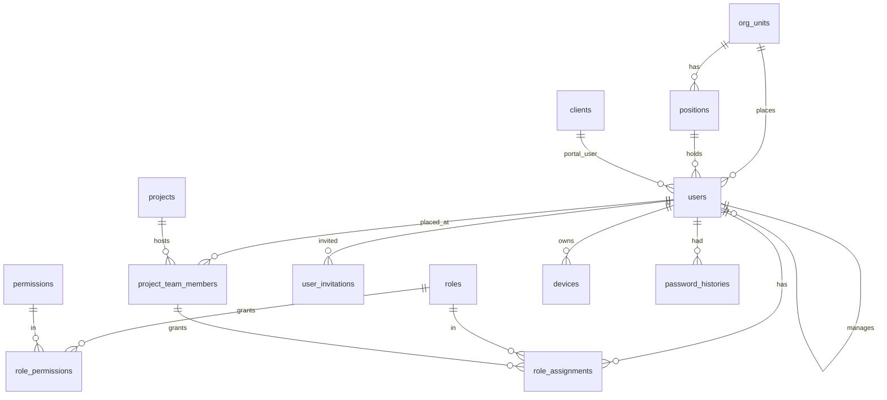

# Spesifikasi Modul — `access` (Akses, Autentikasi, Role & Cakupan, Organisasi)

**Versi:** 0.19
**Tanggal:** 1 Oktober 2026
**Status:** **selesai untuk Fase 1** — kerangka aplikasi, autentikasi, seluruh layar §6.1–§6.7, domain, seeder, dan 100 pengujian sudah jalan. Sisa pekerjaan kecil & penyimpangan: §13; v0.10: §6.2 kanvas tanda tangan profil jalan, §13 butir 1 (A-264); v0.13: role Driver menjadi *Driver (lama)* — tidak ditawarkan untuk user baru, tanpa hak berangkat/bukti terima; seeder demo tanpa akun driver ([A-311](04b-asumsi-lanjutan.md#a-311), [A-314](04b-asumsi-lanjutan.md#a-314)); v0.14: form pengguna **pilih peran dulu** dan **tanpa isian tanggal**, kartu **Undangan** yang bisa disalin, jalur **buatkan password**, dan **Tim site** sebagai satu-satunya akses berbatas waktu ([A-331](04b-asumsi-lanjutan.md#a-331)–[A-337](04b-asumsi-lanjutan.md#a-337); §3.3, §3.4, §6.3, §8, §10 TC-ACC-40–44, §13.5); v0.15: **peta jabatan** (atasan jabatan, level otomatis) dan **atasan langsung efektif** (isian manual menimpa jabatan) ([A-344](04b-asumsi-lanjutan.md#a-344), [A-345](04b-asumsi-lanjutan.md#a-345); §6.3, §6.5, TC-ACC-45); perbaikan audit keamanan undangan, buatkan password, proyek Klien, dan pindah klien ([A-351](04b-asumsi-lanjutan.md#a-351); TC-ACC-41f, TC-ACC-43b, TC-ACC-43c); v0.16: daftar pilihan proyek mengikuti cakupan pembaca, termasuk form Retur portal Klien ([A-354](04b-asumsi-lanjutan.md#a-354), TC-ACC-46); v0.17: pilihan **Atasan langsung (bila beda dari jabatan)** bisa dicari, tiap orang bertanda badge jabatan + unit ([A-358](04b-asumsi-lanjutan.md#a-358); §6.3, TC-ACC-47); v0.18: P2 — jabatan mengikuti unit, atasan berkelompok & dicari ke server, lingkaran atasan ditolak (juga di Atasan jabatan), dan pilihan yang bisa dicari di seluruh layar Pengaturan & pengguna ([A-385](04b-asumsi-lanjutan.md#a-385)–[A-388](04b-asumsi-lanjutan.md#a-388); §6.3, §6.5, TC-ACC-48–51c); v0.19: sapuan keamanan cari ke server untuk akun Klien di layar portal & layar yang terbuka dengan izinnya — form/daftar REQ, tambahan baris portal, form Retur portal, layar laporan (§10 TC-ACC-52; tanpa perubahan perilaku)
**Modul:** `access`
**Fase:** F1 (SSO F3 dan auditor eksternal F2 hanya stub)
**Dokumen terkait:** [Blueprint §4](01-blueprint.md#4-pengguna--peran), [§6.2](01-blueprint.md#62-struktur-organisasi--gudang), [§13](01-blueprint.md#13-autentikasi--sso) · [Aturan Bisnis](05-aturan-bisnis.md) · [Katalog Status](06-katalog-status-dan-enum.md) · [Glosarium §11](03-glosarium.md#11-role--akses) · [Model data akses](08a-model-data-inti.md#area-user-role-cakupan-struktur-organisasi-tenant), [pusat](08a-model-data-inti.md#area-database-pusat-platform) · [Arsitektur §3–§4](08-arsitektur.md#3-tenancy--siklus-request) · [Akun uji](../00-akun-uji.md)
**Ketergantungan modul:** tidak ada (modul pertama). Menyertakan **kerangka aplikasi**: tenancy (AD-01), layout Blade dari `template/`, middleware, seeder referensi. Modul `platform` (company, langganan) dibangun terpisah; Access hanya membaca `companies` dan `subscriptions` lewat middleware.

---

## 1. Tujuan & lingkup

Modul ini membuat WMS bisa dimasuki dengan aman per company dan menentukan **siapa boleh melakukan apa di gudang/proyek mana**. Pemakainya: Admin Company (mengelola user, role, organisasi), seluruh user internal (login, profil), user klien (login portal), dan Super Admin (akses dukungan berperiode).

Termasuk `[F1]`: login lokal per subdomain ([D-26](04-keputusan-dan-asumsi.md#d-26)); undangan user & atur password pertama; lupa/atur ulang password; 2FA TOTP opsional; kunci akun; profil (nama, WA, tanda tangan gambar, 2FA, perangkat); user CRUD dengan **nonaktif bukan hapus** (P-03); role & permission (template bawaan + role buatan); **penugasan role × cakupan** ([BR-GEN-09](05-aturan-bisnis.md#br-gen), [A-46](04-keputusan-dan-asumsi.md#a-46)); struktur organisasi (unit, jabatan, atasan langsung) untuk approval ([D-16](04-keputusan-dan-asumsi.md#d-16)); perangkat terdaftar (minimal: daftar & cabut); login portal klien ([BR-PRJ-07](05-aturan-bisnis.md#br-prj)); pemberian **akses dukungan** oleh Admin Company ([BR-SUB-04](05-aturan-bisnis.md#br-sub)); **"Masuk sebagai"** (impersonasi) oleh Admin Company untuk presentasi alur lintas peran ([A-260](04b-asumsi-lanjutan.md#a-260), dimajukan dari F2).

Tidak termasuk: SSO NXTG `[F3]` (kolom `users.sso_sub` dan tabel `sso_identities` dibuat sebagai stub, [BR-GEN-10](05-aturan-bisnis.md#br-gen)); auditor eksternal `[F2]` (kolom `valid_until` sudah ada); manajemen company, paket, langganan (modul `platform`); notifikasi WhatsApp `[F2]`.

## 2. Aktor & permission

Permission ditulis `<modul>.<aksi>` dan disimpan di `permissions` dengan `module = access`.

| Role bawaan | Permission | Cakupan bawaan |
|---|---|---|
| Admin Company | semua `user.*`, `role.*`, `org.*`, `device.*`, `support_access.*`, `profile.update`, `auth.*` | semua |
| Manajemen | `user.view`, `role.view`, `org.view`, `profile.update`, `auth.*` | semua |
| Kepala Gudang | `user.view` (user di cakupannya), `device.view`, `profile.update`, `auth.*` | gudang yang ditugaskan |
| Staf Gudang, Driver (lama), Pemohon Internal, Penindak Lanjut PR, Auditor Internal | `profile.update`, `auth.*`, `device.manage` (perangkat sendiri) | sesuai penugasan |
| Klien | `profile.update`, `auth.*` (hanya lewat `/portal`) | klien & proyeknya |

Daftar permission modul ini: `auth.login`, `auth.logout`, `auth.two_factor`, `profile.update`, `user.view`, `user.create`, `user.update`, `user.deactivate`, `user.invite`, `user.reset_password`, `user.impersonate` ([A-260](04b-asumsi-lanjutan.md#a-260)), `role.view`, `role.create`, `role.update`, `role.deactivate`, `role.assign`, `org.view`, `org.manage`, `device.view`, `device.manage`, `support_access.grant`, `support_access.revoke`. Permission modul lain didaftarkan oleh modul masing-masing ke tabel yang sama.

## 3. Entitas & data

Semua tabel di database **tenant** kecuali disebut *pusat*. Konvensi kolom umum (`id`, `created_at`, `updated_at`, `created_by`, `updated_by`) tidak diulang ([08a](08a-model-data-inti.md)). Kolom bertanda *(impl.)* adalah tambahan implementasi yang belum ada di ERD dan akan dimasukkan ke `_generate_erd.py` saat coding.

### 3.1 `users`

| Kolom | Tipe | Null | Keterangan |
|---|---|---|---|
| `name` | varchar(100) | — | |
| `email` | varchar(150) | — | unik per company ([BR-SUB-06](05-aturan-bisnis.md#br-sub)) |
| `phone` | varchar(20) | ya | nomor WA (E.164) untuk approval/OTP F2 |
| `password` | varchar(255) | ya | bcrypt; null bila hanya SSO F3 |
| `client_id` | bigint FK `clients` | ya | terisi = user klien |
| `org_unit_id`, `position_id` | bigint FK | ya | struktur organisasi |
| `manager_id` | bigint FK `users` | ya | atasan langsung (approval "atasan langsung", SoD) |
| `signature_path` | varchar(255) | ya | gambar tanda tangan (disk berkas) |
| `is_active` | bool | — | nonaktif = tidak bisa login, data tetap |
| `locked_until` | datetime | ya | kunci akun (NFR-04) |
| `two_factor_secret`, `two_factor_recovery_codes` | text | ya | TOTP; dienkripsi |
| `two_factor_last_step` | bigint | ya | langkah waktu TOTP terakhir yang dipakai; kode tidak bisa dipakai ulang ([A-205](04-keputusan-dan-asumsi.md#a-205), migrasi tenant `000180`) |
| `sso_sub` | varchar(191) | ya | unik; stub F3 |
| `email_verified_at`, `last_login_at`, `password_changed_at` *(impl.)* | datetime | ya | |
| `failed_login_count` *(impl.)* | tinyint | — | direset saat login sukses |

Indeks: `UK(email)`, `IDX(client_id)`, `IDX(manager_id)`, `IDX(is_active)`.

### 3.2 `roles`, `permissions`, `role_permissions`

`roles`: `code` varchar(40) UK (`company_admin`, `management`, `warehouse_head`, `warehouse_staff`, `driver` (role lama — `Role::NOT_OFFERED`, form user hanya menampilkannya bagi user yang sudah memegangnya, [A-314](04b-asumsi-lanjutan.md#a-314)), `internal_requester`, `pr_follow_up`, `internal_auditor`, `external_auditor` F2, `client_user`), `name`, `is_builtin` bool (role bawaan tidak bisa dihapus, boleh disalin), `is_client_role` bool, `is_active` bool *(impl.)*. `permissions`: `key` varchar(80) UK, `module` varchar(30), `label` varchar(100) *(impl.)*. `role_permissions`: PK(`role_id`, `permission_id`). Implementasi memakai `spatie/laravel-permission` dengan nama tabel ini ([AD-06](08-arsitektur.md#2-keputusan-arsitektur)); guard tunggal `web`.

### 3.3 `role_assignments`

| Kolom | Tipe | Null | Keterangan |
|---|---|---|---|
| `user_id`, `role_id` | bigint FK | — | |
| `scope_type` | enum `all` · `warehouse` · `project` | — | `all` hanya untuk role internal ([BR-ACC-04](05-aturan-bisnis.md#br-acc)) |
| `scope_id` | bigint | ya | `warehouse_id` / `project_id`; null bila `all` |
| `valid_from`, `valid_until` | date | ya | `valid_until` untuk auditor eksternal F2 |
| `assigned_by` *(impl.)* | bigint FK `users` | — | |
| `project_team_member_id` *(impl.)* | bigint FK `project_team_members` | ya | terisi = baris ini **dikelola Tim site**; form pengguna tidak memuat, mengubah, atau menghapusnya ([A-337](04b-asumsi-lanjutan.md#a-337)) |

`UK(user_id, role_id, scope_type, scope_id)` — karena itu satu kunci hanya boleh dimiliki satu pihak: bila penugasan tetap sudah ada, Tim site tidak menimpanya ([A-343](04b-asumsi-lanjutan.md#a-343)). Sejak [A-337](04b-asumsi-lanjutan.md#a-337) `valid_from`/`valid_until` **tidak lagi diisi dari form pengguna**; data lama tetap ada dan tetap ditegakkan. Cakupan efektif user = gabungan semua penugasan aktif (tanggal berlaku) — dievaluasi oleh global scope `ScopedToUser` ([BR-ACC-05](05-aturan-bisnis.md#br-acc)).

### 3.4 `org_units`, `positions`, `user_invitations`, `devices`, `password_histories`

- `org_units`: `parent_id` self, `code` UK, `name`, `is_active` *(impl.)*.
- `positions`: `org_unit_id` FK, `code` UK, `name`, `level` int (1 = tertinggi; dipakai aturan approval "jabatan X").
- `user_invitations`: `user_id` FK, `token` varchar(64) UK (hash SHA-256 dari token acak 40 karakter), `token_plain` text *(impl., terenkripsi)* — token mentah supaya tautannya bisa ditampilkan & disalin lagi selama undangan belum dipakai ([A-333](04b-asumsi-lanjutan.md#a-333)), `expires_at` (+72 jam), `accepted_at`, `sent_count` *(impl.)*.
- `project_team_members` *(impl., [A-337](04b-asumsi-lanjutan.md#a-337))*: `project_id`, `user_id`, `role_id` (peran di site), `starts_on`, `ends_on`, `ended_at`, `end_reason_code_id`, `end_notes`, `reminded_at` (H-7 sekali), `grants_access`, `created_by`. Statusnya turunan: *Belum mulai · Aktif · Akan berakhir · Berakhir · Diakhiri*.
- `devices`: `user_id` FK, `device_uid` UK, `name`, `platform`, `last_seen_at`, `is_active`.
- `password_histories` *(impl.)*: `user_id` FK, `password` (hash), `created_at`; simpan 3 terakhir.
- *Pusat, dibaca saja:* `platform_users`, `companies`, `subscriptions`, `support_accesses`, `sso_identities` (stub).

```mermaid
erDiagram
  users ||--o{ role_assignments : has
  roles ||--o{ role_assignments : in
  roles ||--o{ role_permissions : grants
  permissions ||--o{ role_permissions : in
  org_units ||--o{ positions : has
  org_units ||--o{ users : places
  positions ||--o{ users : holds
  users ||--o{ users : manages
  users ||--o{ user_invitations : invited
  users ||--o{ project_team_members : placed_at
  projects ||--o{ project_team_members : hosts
  project_team_members ||--o{ role_assignments : grants
  users ||--o{ devices : owns
  users ||--o{ password_histories : had
  clients ||--o{ users : portal_user
```

**Status user (turunan, bukan enum baru):** *Diundang* = ada undangan belum diterima · *Aktif* = `is_active` dan undangan diterima · *Nonaktif* = `is_active = false` · *Terkunci* = `locked_until > now`. Label dipakai di daftar user dan badge.

## 4. Mesin status

Modul ini tidak punya dokumen berstatus di Katalog. Aturan implementasi yang berperilaku seperti transisi:

| Objek | Transisi | Implementasi | Efek samping |
|---|---|---|---|
| Undangan | dibuat → `accepted` (token valid, password diatur) | `AcceptInvitation` | `users.email_verified_at`, `is_active = true`; event `InvitationAccepted`; timeline user |
| Undangan | dibuat → kedaluwarsa (72 jam) | pengecekan saat dibuka | Admin dapat **kirim ulang** (`ResendInvitation`, `sent_count++`) |
| Akun | 5 gagal login berturut-turut → terkunci 15 menit | `RecordFailedLogin` | event `UserLocked` → notifikasi Admin; audit log |
| Akun | Aktif ↔ Nonaktif | `DeactivateUser` / `ReactivateUser` | semua sesi & token perangkat dicabut; guard [BR-ACC-02](05-aturan-bisnis.md#br-acc) |
| Password | diganti (profil / reset) | `ChangePassword` | simpan riwayat; sesi lain dihapus ([BR-ACC-06](05-aturan-bisnis.md#br-acc)); event `PasswordChanged` |
| Penugasan role | dibuat / diubah / dihapus | `AssignRole`, `RevokeRole` | event `RoleAssignmentChanged` → cache cakupan user dibersihkan; audit log |
| Akses dukungan | diberikan → berjalan → berakhir / dicabut | `GrantSupportAccess` (metode `grant()` dan `revoke()`, [A-73](04-keputusan-dan-asumsi.md#a-73)) | tulis ke `support_accesses` (pusat) + `audit_logs` tenant ([BR-SUB-04](05-aturan-bisnis.md#br-sub)) |
| Sesi "Masuk sebagai" | Admin → user lain → (ganti ke user lain) → kembali ke Admin / keluar | `ImpersonateUser` (metode `handle()` dan `stop()`, pola A-73), [A-260](04b-asumsi-lanjutan.md#a-260) | sesi menyimpan Admin asli (`impersonator_id`); `audit_logs` diberi `impersonated_by`; Admin nonaktif/bukan Admin lagi saat kembali → keluar penuh |

Siklus request ([08 §3](08-arsitektur.md#3-tenancy--siklus-request)): middleware `InitializeTenancyBySubdomain` → `EnsureSubscriptionState` (`suspended` → hanya GET; `terminated` → hanya login Admin Company & ekspor, [BR-SUB-02–03](05-aturan-bisnis.md#br-sub)) → `auth` → `EnsureClientPortal` untuk `/portal` → `ScopedToUser`.

## 5. Aturan bisnis yang berlaku

| BR | Catatan implementasi |
|---|---|
| [BR-GEN-05](05-aturan-bisnis.md#br-gen) | `LogsActivity` pada `users`, `roles`, `role_assignments`, `org_units`, `positions`; nilai lama → baru; IP hanya untuk Admin |
| [BR-GEN-09](05-aturan-bisnis.md#br-gen) | cakupan pada penugasan; Policy memeriksa `role_assignments` aktif, bukan role user secara global |
| [BR-GEN-11](05-aturan-bisnis.md#br-gen) | semua form: field wajib bertanda `*`; nonaktifkan user = Alasan `*` + Keterangan opsional |
| [BR-SUB-03](05-aturan-bisnis.md#br-sub), [BR-SUB-04](05-aturan-bisnis.md#br-sub), [BR-SUB-06](05-aturan-bisnis.md#br-sub) | middleware langganan; akses dukungan berperiode; email unik per company |
| [BR-PRJ-07](05-aturan-bisnis.md#br-prj) | `/portal` hanya role Klien; login internal ditolak di portal dan sebaliknya |
| [BR-APR-03](05-aturan-bisnis.md#br-apr) | `manager_id` wajib diisi untuk role pemohon agar SoD & "atasan langsung" berjalan; peringatan bila kosong |
| [BR-ACC-01](05-aturan-bisnis.md#br-acc) | user tanpa penugasan role aktif tidak bisa login (kecuali `company_admin` bawaan) |
| [BR-ACC-02](05-aturan-bisnis.md#br-acc) | Admin Company terakhir yang aktif tidak bisa dinonaktifkan/dicabut rolenya |
| [BR-ACC-03](05-aturan-bisnis.md#br-acc) | role Klien eksklusif: validasi saat assign dan saat `client_id` diisi |
| [BR-ACC-04](05-aturan-bisnis.md#br-acc) | `scope_type = all` ditolak untuk `is_client_role` |
| [BR-ACC-05](05-aturan-bisnis.md#br-acc) | global scope `ScopedToUser` pada model bergudang/berproyek; Admin Company & Manajemen = `all` |
| [BR-ACC-06](05-aturan-bisnis.md#br-acc) | sesi per subdomain (cookie domain = subdomain company); ganti password menghapus sesi lain |
| NFR-01–04, NFR-10 ([Blueprint §16](01-blueprint.md#16-kebutuhan-non-fungsional)) | halaman error bermerek; CSRF; audit login; rate limit login 5/menit per IP+email; label form & kontras |

## 6. Layar

Layout: `template/partials/` → `resources/views/layouts/app.blade.php` (sidebar + header) dan `auth.blade.php` (tanpa sidebar, dari `template/auth/*.html`). jQuery hanya untuk plugin (DataTables, Select2); interaksi memakai Livewire + Alpine. Menu sidebar: dua butir atas (Beranda, Tugas approval saya) lalu 11 grup lipat berurutan alur kerja dengan kotak *Cari menu* ([A-227](04-keputusan-dan-asumsi.md#a-227), v0.7; sebelumnya datar mengikuti urutan modul [08 §12](08-arsitektur.md#12-langkah-berikutnya-part-4)). Semua form: field wajib bertanda `*` ([BR-GEN-11](05-aturan-bisnis.md#br-gen)).

Layar autentikasi memakai **controller + Blade** (form POST biasa, lebih mudah diuji dan sesuai NFR-02);
Livewire dipakai untuk layar pengelolaan yang interaktif (§6.3–§6.7).

### 6.1 Autentikasi — layout `auth`

| Route | Controller | Sumber template | Field (`*` wajib) | Aksi & aturan |
|---|---|---|---|---|
| `/login` | `LoginController` | `auth/login.html` | email `*`, password `*`, ingat saya | rate limit; gagal 5× → terkunci 15 menit; sukses → `last_login_at`; bila 2FA aktif → `/two-factor` |
| `/two-factor` | `TwoFactorController` | `auth/two-factor.html` | kode 6 digit `*` atau kode pemulihan | 5 percobaan |
| `/forgot-password` | `PasswordResetController` | `auth/forgot-password.html` | email `*` | selalu balasan sama (tidak membocorkan email); token 60 menit |
| `/reset-password/{token}` | `PasswordResetController` | `auth/reset-password.html` | password `*`, ulangi `*` | kebijakan password; riwayat 3 terakhir |
| `/invitation/{token}` | `InvitationController` | `auth/verify-email.html` | nama, password `*`, ulangi `*`, nomor WA | token 72 jam; kedaluwarsa → halaman minta kirim ulang |
| `/portal/login` | `LoginController` (mode portal) | `auth/login.html` | sama | hanya user `client_id` terisi; internal ditolak dengan pesan |
| `/logout` | POST | — | — | hapus sesi & token perangkat aktif |

Tidak dipakai: `auth/register.html`, `auth/lock-screen.html` (company dibuat Super Admin, user lewat undangan).

### 6.2 Profil — `/profile` — `Access\Profile`

Tab **Data diri** (nama `*`, email baca-saja, nomor WA, foto), **Tanda tangan** (unggah PNG/JPG ≤ 5 MB ([A-68](04-keputusan-dan-asumsi.md#a-68)) atau gambar di kanvas; dipakai dokumen), **Keamanan** (ganti password: lama `*`, baru `*`, ulangi `*`; 2FA aktif/nonaktif dengan QR + kode pemulihan), **Perangkat** (daftar perangkat, cabut). Portal klien memakai profil yang sama tanpa tab Perangkat.

### 6.3 Pengguna — `/users` — `Access\Users\Index`, `Form`, `Show`

| Kolom daftar | Filter | Aksi baris |
|---|---|---|
| Nama, email, role & cakupan (ringkas), unit/jabatan, status turunan, login terakhir | role, gudang/proyek cakupan, status, unit | lihat, ubah, undang ulang, nonaktifkan (Alasan `*` + Keterangan), reset password (kirim tautan) |

Form (`/users/create`, `/users/{id}/edit`) — urutan **pilih peran dulu** ([A-331](04b-asumsi-lanjutan.md#a-331)), **tanpa isian tanggal** ([A-337](04b-asumsi-lanjutan.md#a-337)):

| Langkah | Isi | Wajib | Keterangan |
|---|---|---|---|
| 1. Data diri | `name`, `email`, `phone` (No. WA) | nama & email `*` | email tidak bisa diubah setelah undangan diterima; No. WA dipakai mengirim tautan |
| 2. Peran | kartu per role aktif (kecuali `Role::NOT_OFFERED`), satu kalimat penjelasan per kartu | `*` | kalimat, ikon, dan jenis pertanyaan dari `Support\RoleGuide` |
| 3. Pertanyaan sesuai peran | Kepala/Staf Gudang → gudang **tetap** (boleh > 1) · Pemohon Internal → proyek (boleh > 1) · Klien → klien `*` + proyek awal `*` ([A-336](04b-asumsi-lanjutan.md#a-336)) · Admin Company, Manajemen, Penindak Lanjut PR, Auditor → tanpa pertanyaan, cakupan otomatis *semua* | sesuai peran | Gudang Site **tidak** ditawarkan: penempatan di site lewat Tim site. Cakupan dipilih pada dimensi yang memang dipakai peran itu ([A-338](04b-asumsi-lanjutan.md#a-338)) |
| 4. Pengaturan lanjutan (terlipat) | unit organisasi (disarankan dari peran, [A-332](04b-asumsi-lanjutan.md#a-332)), jabatan, **Atasan langsung (bila beda dari jabatan)** (lihat di bawah), dan *Tambah peran lain* = baris peran × cakupan lama | — | terbuka sendiri di mode Ubah bila ada peran kedua atau penugasan bertanggal lama; baris bertanggal ditandai ⚠ dan tanggalnya dibawa apa adanya |
| 5. Cara masuk pertama kali | *Kirim undangan* (bawaan) atau *Buatkan password sekarang* ([A-334](04b-asumsi-lanjutan.md#a-334)) | `*` saat membuat | password minimal 10 karakter, ditampilkan sekali setelah simpan |

**Atasan langsung (bila beda dari jabatan)** ([A-358](04b-asumsi-lanjutan.md#a-358)): kotak pilihan yang bisa dicari (`<x-pilih>`, Tom Select). Paling atas *— Ikuti jabatan —* (= kosong, atasan dari peta jabatan, [A-345](04b-asumsi-lanjutan.md#a-345)); tiap orang tampil **Nama** + badge jabatan + unit kecil abu-abu (tanpa jabatan → tanpa badge; tanpa unit → tanpa teks unit), juga pada nilai yang sudah terpilih. Pencarian mencocokkan nama, jabatan, dan unit. Yang ditawarkan: pengguna aktif internal selain orang yang sedang diubah (Klien & nonaktif tidak). Atasan tersimpan yang kini nonaktif/tidak berlaku tetap tampil paling atas bertanda *(nonaktif)* / *(tidak berlaku)* supaya nilainya tidak hilang diam-diam. Keterangan A-345 di bawah kotak tidak berubah.

**P2 (1 Okt 2026).** *Jabatan* mengikuti *Unit organisasi* ([A-385](04b-asumsi-lanjutan.md#a-385)): hanya jabatan aktif unit itu; tanpa unit = semua jabatan aktif berkelompok per unit dan memilih jabatan mengisi unitnya; ganti unit mengosongkan jabatan yang tidak cocok; simpan menolak jabatan unit lain/nonaktif kecuali pasangan tersimpan yang tidak diubah. *Atasan langsung* berkelompok **Unit ini → Unit induk (terdekat dulu, naik sampai akar) → Unit lain** dan dicari ke server — ketik ≥ 2 huruf ([A-386](04b-asumsi-lanjutan.md#a-386), pola [16](16-shared-laporan-berkas.md) §6.5); nilai di luar daftar ditolak simpan. Atasan atau jabatan yang membuat **lingkaran atasan efektif** ditolak dengan rantai nama di isian Atasan langsung ([A-387](04b-asumsi-lanjutan.md#a-387)). Kotak lain di layar Pengaturan & pengguna (unit, jabatan, peran & cakupan baris, klien, filter Role/Unit, Tim site, Role, Struktur organisasi, Akses dukungan, approval) memakai `<x-pilih>` ([A-388](04b-asumsi-lanjutan.md#a-388)); status, cakupan, jenis, alasan tetap `<select>` biasa.

Pengguna yang **seluruh** cakupannya berasal dari Tim site tidak bisa diubah cakupannya dari form ini; layar mengarahkannya ke hub proyek.

Detail (`/users/{id}`): tab Ringkasan, Penugasan Role, **Penugasan site**, Perangkat, Riwayat (timeline + audit log ringkas), ditambah kartu **Undangan** ([A-333](04b-asumsi-lanjutan.md#a-333)) bagi pemegang `user.create` selama undangan belum dipakai/kedaluwarsa: *Tampilkan tautan* (tercatat di riwayat), *Salin*, *Kirim via WhatsApp*, *Kirim ulang* (tautan lama mati), dan *Buatkan password sekarang*. Penugasan bertanggal lama yang cakupannya proyek atau Gudang Site bisa dipindahkan lewat tombol *Jadikan Tim site* ([A-343](04b-asumsi-lanjutan.md#a-343)).

### 6.3a Tim site — tab di hub proyek `/projects/{id}` — `Access\ProjectTeam`

Satu-satunya tempat akses berbatas waktu ([A-337](04b-asumsi-lanjutan.md#a-337)). Daftar anggota: nama, pihak (kita / PIC klien), peran di site, mulai, selesai, status. Tombol *Tambah anggota* (orang `*`, peran di site `*`, mulai `*` = hari ini, selesai `*` = target selesai proyek), *Perpanjang*, dan *Akhiri lebih awal* (Alasan `*`). Mengatur menuntut `role.assign`; *Perpanjang* juga boleh bagi Kepala Gudang yang mencakup Gudang Site proyek itu ([A-342](04b-asumsi-lanjutan.md#a-342)). Riwayat anggota tidak pernah dihapus (P-03).

### 6.4 Role — `/roles` — `Access\Roles\Index`, `Form`

Daftar role (bawaan bertanda, jumlah user). Form: `code` `*` (snake_case, unik), `name` `*`, `is_client_role`, **matriks permission per modul** (checkbox per aksi, tombol "salin dari role bawaan"). Role bawaan: permission bisa diubah, role tidak bisa dihapus/dinonaktifkan.

### 6.5 Struktur organisasi — `/org` — `Access\Org\Tree`

Pohon unit (tambah/ubah/nonaktifkan; `code` `*`, `name` `*`, induk), jabatan per unit (`code` `*`, `name` `*`, **Atasan jabatan** — jabatan aktif mana pun, kosong = puncak), daftar user per unit dengan **atasan langsung efektif** bertanda *manual* / *dari jabatan* / *belum ada*. `level` tidak diketik: dihitung dari peta jabatan (atasan + 1) dan dihitung ulang untuk bawahannya; peta berputar ditolak, begitu pula atasan jabatan yang membuat lingkaran atasan pada **pemegangnya** lewat atasan manual ([A-387](04b-asumsi-lanjutan.md#a-387)); pilihan *Atasan jabatan* berkelompok per unit; jabatan yang masih menjadi atasan jabatan aktif tidak bisa dinonaktifkan ([A-344](04b-asumsi-lanjutan.md#a-344), [A-345](04b-asumsi-lanjutan.md#a-345)). Dipakai aturan approval "atasan langsung" (1/2 tingkat) dan "jabatan X di unit Y"; peta lengkapnya tampil di *Peta approval* ([20](20-approval.md) §6).

### 6.6 Perangkat — `/devices` — `Access\Devices\Index`

Daftar perangkat semua user (Admin) / perangkat sendiri: nama, platform, terakhir terlihat, cabut. Pendaftaran perangkat terjadi saat login PWA (`device_uid` dari penyimpanan lokal).

### 6.7 Akses dukungan — `/settings/support-access` — `Access\SupportAccess`

Admin Company memberi izin ke Super Admin: alasan `*`, mulai `*`, selesai `*` (maks 7 hari), tombol cabut. Riwayat pemberian tampil dan tercatat di audit log ([BR-SUB-04](05-aturan-bisnis.md#br-sub)).

### 6.8 Masuk sebagai — `/impersonate` — `Access\ImpersonationPicker`

Untuk pemegang `user.impersonate` bila sakelar `access.impersonation.enabled` menyala ([A-260](04b-asumsi-lanjutan.md#a-260)); menu *Pengaturan › Masuk sebagai*, menu header, aksi baris di Pengguna, dan tombol di detail pengguna.

| Bagian | Isi | Aksi |
|---|---|---|
| Panduan alur demo | Kartu per alur (Permintaan Material ke proyek, Pembelian ke vendor, Stock Opname, Portal Klien) dengan langkah bernomor: role, aksi singkat, user wakil role (user aktif yang memenuhi syarat; per role menurut urutan role bawaan dipilih id terkecil yang belum mewakili role lain) | tombol *Masuk sebagai <nama>* per langkah |
| Semua pengguna | Kartu: avatar inisial berwarna per role, nama, email, role × cakupan (kode gudang/proyek); cari nama/email, saring per role; yang tidak memenuhi syarat tampil pudar dengan alasannya | *Masuk sebagai* |
| Spanduk (semua halaman, termasuk portal) | "Mode presentasi — Anda sedang masuk sebagai <nama> · <role · cakupan>" lengket di bawah header | *Ganti peran* (satu user wakil per role), *Kembali ke <Admin>* |

Perpindahan hanya lewat POST (`/impersonate/{user}`, `/impersonate/leave`); `impersonate.leave` selalu boleh walau langganan dibatasi.

## 7. Kejadian stok & integrasi

Tidak ada kejadian stok. Audit log (`spatie/laravel-activitylog`, [AD-07](08-arsitektur.md#2-keputusan-arsitektur)) untuk users, roles, role_assignments, org_units, positions, support access. Event Laravel: `UserInvited`, `InvitationAccepted`, `UserLocked`, `PasswordChanged`, `RoleAssignmentChanged`, `SupportAccessGranted/Revoked`.

## 8. Notifikasi

| Kejadian | Penerima | Kanal | Template |
|---|---|---|---|
| Undangan dibuat / dikirim ulang | user baru | email | `access.invitation` (tautan 72 jam) |
| Lupa password | user | email | `access.reset_password` (60 menit) |
| Akun terkunci | user + Admin Company | email + in-app | `access.locked` |
| Penugasan role berubah | user | in-app | `access.role_changed` |
| Penempatan di site berakhir 7 hari lagi | orangnya, Kepala Gudang cakupan Gudang Site, pemegang `role.assign` | in-app + email (+ WhatsApp bila company mengizinkan) | `project_team.ending_soon`, sekali per keanggotaan ([A-340](04b-asumsi-lanjutan.md#a-340)) |
| Akses dukungan diberikan/dicabut | Admin Company, Super Admin | in-app + email | `access.support_access` |

## 9. Laporan & dashboard

| Laporan | Filter | Kolom | Ekspor |
|---|---|---|---|
| User × role × cakupan | role, gudang/proyek, status | user, role, cakupan, berlaku, atasan | Excel |
| Log login 30 hari | user, hasil | waktu, user, IP, kanal (web/PWA/portal), hasil | Excel |

## 10. Kasus uji (Given / When / Then)

| ID | Given | When | Then | BR |
|---|---|---|---|---|
| TC-ACC-01 | user aktif `staf1.ckg@demo.wms.test` | login email+password benar | masuk; `last_login_at` terisi; audit login | NFR-03 |
| TC-ACC-02 | user aktif | 5× password salah | `locked_until` = +15 menit; login ke-6 ditolak walau benar; notifikasi Admin | NFR-04 |
| TC-ACC-03 | user terkunci, 15 menit berlalu | login benar | masuk; `failed_login_count` = 0 | NFR-04 |
| TC-ACC-04 | 6 permintaan login dalam 1 menit dari IP sama | permintaan ke-6 | HTTP 429 | NFR-04 |
| TC-ACC-05 | Admin membuat user baru dengan undangan | buka tautan undangan < 72 jam, atur password | `accepted_at`, `email_verified_at` terisi; bisa login | — |
| TC-ACC-06 | undangan berumur > 72 jam | buka tautan | halaman kedaluwarsa; Admin kirim ulang → token baru, lama tidak berlaku | — |
| TC-ACC-07 | user lupa password | minta reset, buka tautan, atur password sama dengan 2 password sebelumnya | ditolak (riwayat 3 terakhir) | BR-ACC-06 |
| TC-ACC-08 | user dengan 2 sesi aktif | ganti password di profil | sesi lain berakhir | BR-ACC-06 |
| TC-ACC-09 | user mengaktifkan 2FA | login benar tanpa kode | diarahkan ke `/two-factor`; kode salah 5× → tolak | — |
| TC-ACC-10 | `kagudang.ckg` = Kepala Gudang CKG & Staf Gudang BKS | buka daftar gudang | hanya CKG & BKS; aksi approve hanya di CKG | A-04, BR-ACC-05 |
| TC-ACC-11 | user internal | Admin menambahkan role Klien | ditolak: role Klien eksklusif | BR-ACC-03 |
| TC-ACC-12 | user Klien | Admin memilih cakupan `all` | ditolak | BR-ACC-04 |
| TC-ACC-13 | user tanpa penugasan role aktif | login | ditolak dengan pesan "belum punya penugasan"; Admin diberi tahu | BR-ACC-01 |
| TC-ACC-14 | company hanya punya 1 Admin Company aktif | nonaktifkan Admin itu / cabut rolenya | ditolak | BR-ACC-02 |
| TC-ACC-15 | user dinonaktifkan (Alasan diisi) | user coba login; data historis dibuka | login ditolak; dokumen lama masih menampilkan namanya | P-03, BR-GEN-11 |
| TC-ACC-16 | nonaktifkan user tanpa Alasan | simpan | validasi: Alasan wajib `*`, Keterangan boleh kosong | BR-GEN-11 |
| TC-ACC-17 | user Klien `klien1@klien-satu.test` | login di `/login` (bukan portal) | ditolak; di `/portal/login` sukses; hanya menu portal | BR-PRJ-07 |
| TC-ACC-18 | user internal | login di `/portal/login` | ditolak | BR-PRJ-07 |
| TC-ACC-19 | langganan `terminated` | Staf login; Admin Company login | Staf ditolak; Admin masuk hanya ke ekspor | BR-SUB-03 |
| TC-ACC-20 | langganan `suspended` | user membuka daftar (GET) dan menyimpan form (POST) | GET berhasil dengan spanduk; POST ditolak | BR-SUB-02 |
| TC-ACC-21 | Admin memberi akses dukungan 2 hari | Super Admin membuka data company sebelum & setelah masa berlaku | hanya berhasil dalam masa berlaku; tercatat di audit log | BR-SUB-04 |
| TC-ACC-22 | subdomain tidak dikenal `xyz.wms.test` | buka | 404 bermerek, tanpa jejak stack | NFR-01 |
| TC-ACC-23 | form tanpa token CSRF | POST | 419 | NFR-02 |
| TC-ACC-24 | email sama dipakai di company lain | buat user | diterima (unik per company saja) | BR-SUB-06 |
| TC-ACC-25 | Admin mengubah permission role bawaan lalu menyalin ke role baru | simpan | role baru punya permission yang sama; role bawaan tidak bisa dihapus | — |
| TC-ACC-26 | penugasan role dengan `valid_until` kemarin | user buka data cakupan itu | tidak tampil; login tetap bisa bila ada penugasan lain | BR-ACC-01, BR-ACC-05 |
| TC-ACC-27 | seeder demo dijalankan | login setiap akun di [00-akun-uji](../00-akun-uji.md) | semua berhasil dengan role & cakupan sesuai tabel | — |
| TC-ACC-27c | `BlankDemoSeeder` dijalankan pada tenant kosong | hitung user, gudang, item, proyek | hanya `admin@demo.wms.test` (Admin Company, bisa masuk); 0 gudang/item/proyek; role & permission bawaan ada | — |
| TC-ACC-31 | Admin Company login | masuk sebagai Staf Gudang, lalu *Kembali* | bekerja sebagai staf dengan spanduk; kembali → sesi Admin, spanduk hilang | A-260 |
| TC-ACC-32 | Admin Company login | masuk sebagai user Klien | diarahkan ke `/portal` dengan spanduk; *Kembali* berhasil dari portal | A-260, BR-PRJ-07 |
| TC-ACC-33 | Kepala Gudang login | buka `/impersonate` / POST masuk sebagai staf | 403; sesi tidak berubah | A-260 |
| TC-ACC-34 | Admin Company | masuk sebagai diri sendiri, Admin Company lain, user nonaktif, user tanpa role | semua ditolak dengan pesan; tetap sebagai Admin | A-260, BR-ACC-01 |
| TC-ACC-35 | Admin sedang masuk sebagai staf | buka `/impersonate`, masuk sebagai user lain (mis. user Driver lama) | boleh (izin Admin asli); kini user itu, Admin asli tetap tersimpan | A-260 |
| TC-ACC-36 | Admin sedang masuk sebagai staf | staf mengubah profilnya | entri audit log memuat `impersonated_by` = Admin; log mulai ber-`causer` Admin | A-260, BR-GEN-05 |
| TC-ACC-37 | sakelar `access.impersonation.enabled` mati | buka `/impersonate` / POST masuk sebagai | 404 | A-260 |
| TC-ACC-38 | Admin masuk sebagai staf, lalu Admin dinonaktifkan | *Kembali* | keluar penuh ke `/login`. Juga: GET ke route transisi → 405; layar pemilih menampilkan alur & saringan role; langkah Staf memakai user yang hanya staf | A-260 |
| TC-ACC-39 | Admin Company; user lama ber-role Driver | buka form user baru; buka form user lama; user lama masuk | role *Driver (lama)* tidak ada di pilihan user baru, tetap tampil untuk user lama; user lama bisa masuk & melihat SJ tanpa `shipment.ship`/`shipment.confirm_delivery`; alur contoh *Masuk sebagai* tanpa langkah driver | [A-311](04b-asumsi-lanjutan.md#a-311), [A-314](04b-asumsi-lanjutan.md#a-314) |
| TC-ACC-40 | PIC klien beremail yang mengurus satu proyek | *Buat akun portal*; tambahkan role internal ke akun itu; beri cakupan `all`; ulangi pembuatan; PIC tanpa email / tanpa proyek | user role Klien ber-`client_id`, satu penugasan proyek, `client_contacts.user_id` terisi, dan keanggotaan Tim site dibuat; role internal ditolak BR-ACC-03; `all` ditolak BR-ACC-04; pengulangan & PIC tak lengkap ditolak dengan pesan jelas | [A-328](04b-asumsi-lanjutan.md#a-328), [A-339](04b-asumsi-lanjutan.md#a-339) |
| TC-ACC-41 | Form tambah pengguna | pilih Kepala Gudang lalu simpan tanpa gudang; centang dua gudang; pilih Manajemen; pilih Klien tanpa klien/proyek lalu lengkapi; buka form ubah user berpenugasan bertanggal lalu simpan | "Pilih minimal satu gudang." (tanpa `validation.`); dua penugasan tanpa tanggal; Manajemen tersimpan cakupan `all` tanpa pertanyaan; Klien menuntut klien & proyek, hasilnya masuk Tim site; *Pengaturan lanjutan* terbuka sendiri, tidak ada isian tanggal, dan tanggal lama tetap utuh | [A-331](04b-asumsi-lanjutan.md#a-331), [A-336](04b-asumsi-lanjutan.md#a-336), [A-337](04b-asumsi-lanjutan.md#a-337) |
| TC-ACC-42 | User baru yang sudah diundang | buka detail sebagai Admin lalu tampilkan tautan; sebagai Kepala Gudang; kirim ulang; terima undangan lalu buka lagi | token mentah tersimpan terenkripsi dan `token` tetap hash; tautan tampil & tercatat di riwayat; Kepala Gudang 403 dan tidak melihat tombolnya; kirim ulang membuat tautan baru, yang lama mati, `sent_count` naik; kartu hilang setelah dipakai | [A-333](04b-asumsi-lanjutan.md#a-333) |
| TC-ACC-43 | User yang masih diundang | Admin membuatkan password `pendek`, lalu password sah | password pendek ditolak; akun aktif & bisa masuk, undangan tertunda dibatalkan | [A-334](04b-asumsi-lanjutan.md#a-334), BR-ACC-06 |
| TC-ACC-44 | Anggota Tim site yang berakhir 3 hari lagi | jalankan `notifications:daily` dua kali; perpanjang lalu jalankan lagi; angkat penugasan bertanggal lama; periksa siapa boleh memperpanjang | orangnya, Kepala Gudang site, dan Admin masing-masing dapat **satu** pengingat; jalan kedua tidak menggandakan; setelah diperpanjang dikirim lagi; penugasan lama menjadi anggota Tim site tanpa berubah tanggal, cakupan bukan site ditolak; Kepala Gudang site boleh memperpanjang, kepala gudang lain & staf tidak | [A-340](04b-asumsi-lanjutan.md#a-340), [A-342](04b-asumsi-lanjutan.md#a-342), [A-343](04b-asumsi-lanjutan.md#a-343) |
| TC-ACC-45 | Direktur → Kepala Gudang (2 pemegang) → Staf Gudang | lapis Atasan langsung 1 tingkat, 2 tingkat; isi atasan manual; Kepala mengajukan REQ yang lapisnya dirinya | 1 tingkat → kedua Kepala; 2 tingkat → Direktur (label "2 tingkat"); manual menimpa jabatan; pengaju dialihkan ke atasan jabatannya | [A-344](04b-asumsi-lanjutan.md#a-344)–[A-346](04b-asumsi-lanjutan.md#a-346), BR-APR-03 |
| TC-ACC-41f | Klien A & B dengan proyek masing-masing | centang proyek A lalu ganti klien ke B; kirim proyek A lewat payload; ubah klien user yang masih di Tim site | centang dikosongkan; ditolak A-21; ditolak BR-ACC-03 | [A-351](04b-asumsi-lanjutan.md#a-351) |
| TC-ACC-43b | Akun aktif; akun nonaktif belum berpassword | kirim ulang undangan; buatkan password | ditolak; password tidak berubah; akun nonaktif tetap nonaktif | [A-351](04b-asumsi-lanjutan.md#a-351) |
| TC-ACC-43c | Undangan baru | serialisasi; terima undangan | `token`/`token_plain` tidak ikut `toArray()`; `token_plain` dikosongkan | [A-351](04b-asumsi-lanjutan.md#a-351) |
| TC-ACC-46 | Klien proyek A; proyek B milik klien lain berisi stok | buka form Retur portal; ganti id proyek ke B dari browser; pengaju internal bercakupan A mengganti ke B | hanya proyek A ditawarkan; gudang pengirim & stok proyek B tidak terbuka | [A-354](04b-asumsi-lanjutan.md#a-354) |
| TC-ACC-46b | Pemohon bercakupan proyek A; Admin | form Permintaan; filter laporan Daftar REQ | pemohon hanya A; Admin semua | [A-354](04b-asumsi-lanjutan.md#a-354) |
| TC-ACC-46c | Vendor aktif & nonaktif | form SJ | vendor nonaktif tidak ditawarkan | [A-310](04b-asumsi-lanjutan.md#a-310) |
| TC-ACC-47 | Andi (Kepala Gudang, unit Gudang), Beni (tanpa jabatan), Cici (tanpa unit), Dodi nonaktif, Eka Klien | buka Pengaturan lanjutan saat mengubah Fani | pilihan: *— Ikuti jabatan —* paling atas, "Andi · badge Kepala Gudang · Gudang", Beni tanpa badge, Cici tanpa unit; Fani, Dodi, Eka tidak ditawarkan | [A-358](04b-asumsi-lanjutan.md#a-358) |
| TC-ACC-47b | idem | pilih Andi lalu simpan (ubah & tambah pengguna); kosongkan lalu simpan; atasan tersimpan Dodi yang nonaktif | `manager_id` = Andi / null seperti sebelumnya; Dodi tampil paling atas bertanda *(nonaktif)* | [A-358](04b-asumsi-lanjutan.md#a-358), [A-345](04b-asumsi-lanjutan.md#a-345) |
| TC-ACC-48 | Unit Gudang (Kepala, Staf, jabatan nonaktif) & Keuangan (Akuntan) | pilih unit Gudang; pilih Kepala lalu ganti ke Keuangan; kosongkan unit lalu pilih Akuntan; kirim Akuntan dengan unit Gudang; simpan data lama tak cocok tanpa mengubahnya | hanya Kepala & Staf; jabatan dikosongkan; berkelompok per unit & unit terisi Keuangan; ditolak; tersimpan | [A-385](04b-asumsi-lanjutan.md#a-385) |
| TC-ACC-49 | Direksi › Operasional › Gudang, Keuangan; pengguna di tiap unit, tanpa unit, nonaktif, Klien | buka atasan untuk pengguna unit Gudang; `cariPilihan` "kepala gudang", "Klien", model `name`; kirim id Klien; cari sebagai staf tanpa hak | Unit ini → Unit induk (Operasional dulu, lalu Direksi) → Unit lain; diri/nonaktif/Klien tidak ada; hasil berkelompok; kosong; kosong; ditolak; kosong | [A-386](04b-asumsi-lanjutan.md#a-386), A-384 |
| TC-ACC-50 | Budi → Andi, Cici → Budi | isi atasan Andi = Cici; lalu Dodi | ditolak "… Andi → Cici → Budi → Andi …", Pengaturan lanjutan terbuka; Dodi tersimpan | [A-387](04b-asumsi-lanjutan.md#a-387) |
| TC-ACC-50b | Staf Gudang melapor ke Kepala Gudang (jabatan) | Kepala diberi atasan manual Staf; pengguna baru Kepala Gudang beratasan Staf; jabatan Staf dipasang di bawah Kepala saat Kepala beratasan manual Staf; lalu atasan manual dilepas | ditolak; ditolak (tidak dibuat); ditolak di *Atasan jabatan*; tersimpan | A-387, A-344 |
| TC-ACC-51 | Proyek klien A; staf, akun klien A, akun klien lain | Tim site: cari "timo"; kirim id akun klien lain; cari tanpa `role.assign` | Staf kita lalu Akun portal klien (klien A saja); ditolak; kosong | [A-388](04b-asumsi-lanjutan.md#a-388) |
| TC-ACC-51b | Admin, Direktur, akun Klien | cari rujukan approver user (lalu jenis role); pemohon Peta; pemohon Simulasi; delegat | internal aktif; kosong; Klien bertanda *klien*; Direktur; tanpa Klien | A-388, A-384 |
| TC-ACC-51c | Unit & jabatan | buka daftar pengguna, form jabatan, form role | kotak `<x-pilih>` (Role/Unit, Atasan jabatan berkelompok per unit, *Salin dari* ber-badge *bawaan*) | A-388 |
| TC-ACC-52 | Akun Klien **tanpa penugasan proyek** (id cakupan kosong); proyek kliennya & proyek klien lain | cari & minta label proyek di form REQ, daftar REQ, form Retur portal; simpan Retur dengan proyek klien lain; cari item & model lain di tambahan baris portal; cari proyek di layar laporan | hanya proyek kliennya; label proyek klien lain null; simpan ditolak di isian Proyek; item aktif saja, model lain kosong; laporan kosong | [A-354](04b-asumsi-lanjutan.md#a-354), [A-396](04b-asumsi-lanjutan.md#a-396) |

## 11. Di luar lingkup modul ini

SSO NXTG dan pemilih company (F3, modul `platform`/`sso`); manajemen company, paket, tagihan, verifikasi bayar (modul `platform`); auditor eksternal berbatas waktu (F2); WhatsApp (F2a); pengaturan company (zona waktu, format nomor) ada di modul `platform`/`shared`.

## 12. Definisi selesai

- [ ] Kerangka Laravel 13 (PHP 8.3.33) dengan `stancl/tenancy`, `spatie/laravel-permission`, `spatie/laravel-activitylog` (AD-01, AD-06, AD-07); koneksi `central` & `tenant`; `tenants:migrate`, `tenants:seed`
- [ ] Migrasi §3 (central & tenant), model, factory, seeder referensi (role bawaan + permission), `DemoSeeder` sesuai [00-akun-uji](../00-akun-uji.md)
- [ ] Layout `app` & `auth` dari `template/`; ≥ 3 layar modul ini memakainya; teks UI lewat `lang/id`
- [ ] Middleware tenancy, langganan, portal, `ScopedToUser`; Policy per aksi
- [ ] Semua TC-ACC lulus (Feature test); rate limit & CSRF diuji
- [ ] Audit log & timeline user terisi; notifikasi email undangan/reset berjalan (Mailpit lokal)
- [ ] Dokumen ini diperbarui bila implementasi menyimpang (versi naik); kolom *(impl.)* dimasukkan ke `_generate_erd.py`

## 13. Catatan implementasi (23 September 2026)

Status: kerangka aplikasi, autentikasi, lapisan domain, seeder, pengujian, dan seluruh layar pengelolaan (Pengguna, Role, Organisasi, Perangkat, Akses Dukungan) **selesai** — 100 uji per 24 Sep 2026.

Aksi domain yang ada di kode tetapi tidak disebut §4: `InviteUser` (kirim ulang undangan, menaikkan `user_invitations.sent_count`) dan `ManageTwoFactor` (aktifkan, konfirmasi, matikan 2FA, buat ulang kode pemulihan). Pencabutan akses dukungan adalah metode `GrantSupportAccess::revoke()`, bukan kelas `RevokeSupportAccess` ([A-73](04-keputusan-dan-asumsi.md#a-73)). Hasil login (`LoginResult`) terdaftar di [Katalog Status](06-katalog-status-dan-enum.md). Laporan §9 dijelaskan di [16-shared-laporan-berkas](16-shared-laporan-berkas.md).

### 13.1 Yang sudah ada

| Bagian | Lokasi |
|---|---|
| Kerangka Laravel 13.33 + tenancy multi-database | `bootstrap/app.php`, `config/tenancy.php`, `app/Providers/TenancyServiceProvider.php` |
| Identifikasi tenant lewat `companies.subdomain` | `app/Http/Middleware/InitializeTenancyBySubdomain.php` |
| Gerbang langganan & portal klien | `app/Http/Middleware/EnsureSubscriptionState.php`, `EnsureClientPortal.php`, `EnsureInternalArea.php` |
| Migrasi pusat & tenant | `database/migrations/central`, `database/migrations/tenant` |
| Model, enum, action, policy | `app/Domain/Platform`, `app/Domain/Access` |
| Layar autentikasi + profil + beranda + portal | `resources/views/access`, `resources/views/layouts` |
| Layar Pengguna, Role, Organisasi, Perangkat, Akses Dukungan (§6.3–§6.7) | `app/Domain/Access/Livewire/{UserList,UserForm,UserDetail,RoleList,RoleForm,OrgTree,DeviceList,SupportAccessManager}.php`, `resources/views/livewire/access` |
| Controller halaman + menu Administrasi | `app/Http/Controllers/Access/{UserController,RoleController,OrgController,DeviceController,SupportAccessController}.php`, `resources/views/layouts/partials/sidebar.blade.php` |
| Halaman error bermerek (NFR-01) | `resources/views/errors` |
| Seeder | `database/seeders/PlatformSeeder.php`, `database/seeders/Tenant/*` |
| Pengujian | `tests/Feature/Access` — 82 uji, 542 asersi, semua lulus |

### 13.2 Penyimpangan dari §3–§6 dan alasannya

1. **Layar autentikasi memakai controller + Blade**, bukan komponen Livewire: hanya form POST,
   lebih sederhana dan langsung teruji lewat uji HTTP. Livewire tetap dipakai untuk layar
   pengelolaan.
2. **`permissions.name`** menyimpan kunci permission dan **`roles.guard_name` / `permissions.guard_name`**
   ditambahkan karena diwajibkan `spatie/laravel-permission` (AD-06).
3. **Tabel `model_has_roles` / `model_has_permissions` bawaan paket tidak dibuat.** Hubungan user→role
   memakai `role_assignments` yang membawa cakupan; permission dievaluasi lewat `Gate::before`
   di `AccessServiceProvider` (BR-GEN-09, BR-ACC-05).
4. **`companies.data`** (JSON) ditambahkan di database pusat karena dipakai `stancl/tenancy`
   (VirtualColumn) untuk atribut tenant di luar kolom tetap.
5. **Tabel `login_attempts`** ditambahkan untuk laporan "Log login 30 hari" (§9) dan NFR-03.
6. **`spatie/laravel-activitylog` 4.12** (bukan 5.x) karena 5.x menuntut PHP ≥ 8.4 sedangkan
   D-04 memakai PHP 8.3 — lihat [Arsitektur §9](08-arsitektur.md#9-verifikasi-paket-laravel-13-php-83--23-sep-2026).
7. **TOTP 2FA ditulis sendiri** (`App\Domain\Access\Support\TotpVerifier`, RFC 6238) agar tidak
   menambah paket.
8. **BR-ACC-05** saat ini diwujudkan lewat `User::accessibleWarehouseIds()`, `accessibleProjectIds()`,
   dan `canAccess*()` yang sudah diuji; trait global scope `App\Domain\Access\Support\ScopedToUser`
   sudah disiapkan dan mulai dipakai saat modul Warehouse/Master membawa tabel bergudang.
9. **TC-ACC-23** menguji terpasangnya middleware CSRF pada route tenant, karena Laravel melewati
   pemeriksaan CSRF di lingkungan pengujian; perilaku 419 diperiksa manual.
10. **`device.manage` saja berarti "perangkat sendiri"** (§2: Staf Gudang, Pemohon Internal; Driver lama). Mencabut perangkat
   milik user lain menuntut `device.manage` **dan** `device.view`, sehingga hanya Admin Company yang bisa.
11. **Waktu akses dukungan** diisi pada layar memakai zona waktu company lalu disimpan UTC (BR-GEN-07).

### 13.3 Layar pengelolaan yang sudah ada

| Layar | Route | Komponen Livewire | Isi |
|---|---|---|---|
| Daftar pengguna | `/users` | `access.user-list` | Cari nama/email; filter role, status (turunan), unit, dan cakupan (jenis + id); aksi undang ulang, kirim tautan password, nonaktifkan (dialog *Alasan* `*` + *Keterangan* opsional), aktifkan kembali |
| Form pengguna | `/users/create`, `/users/{id}/edit` | `access.user-form` | Data diri, organisasi (unit, jabatan, atasan), klien (dipilih dari daftar klien aktif), dan **penugasan role × cakupan** berulang dengan tanggal berlaku; toggle kirim undangan |
| Detail pengguna | `/users/{id}` | `access.user-detail` | Tab Ringkasan, Penugasan Role, Perangkat, Riwayat (audit log) |
| Daftar role | `/roles` | `access.role-list` | Jumlah permission & penugasan, penanda bawaan/klien, nonaktifkan & aktifkan role buatan company |
| Form role | `/roles/create`, `/roles/{id}/edit` | `access.role-form` | Kode (dikunci setelah dibuat), nama, sifat klien, **matriks permission per modul**, dan tombol salin dari role lain |
| Struktur organisasi | `/org` | `access.org-tree` | Pohon unit (tambah, ubah, sub-unit, nonaktifkan/aktifkan) dengan penjagaan lingkaran induk; jabatan per unit beserta atasan jabatan & level otomatis; daftar user di unit dengan jabatan dan atasan langsung efektif |
| Perangkat | `/devices` | `access.device-list` | Perangkat PWA; pemegang `device.view` melihat seluruh company, user lain hanya miliknya; cari & filter status; cabut dan aktifkan kembali tanpa menghapus data |
| Beranda portal klien | `/portal` | `PortalDashboardController` | Kartu proyek aktif, permintaan berjalan, bukti terima yang perlu konfirmasi, retur berjalan; daftar proyek klien; **Stok On-site per proyek aktif** (*Di Gudang Site*, *Terkirim ke Klien*; BR-PRJ-05) dari `ReturnableStock` yang sama dengan form retur dan hub proyek. Uji TC-MST-26 (`tests/Feature/Master/PortalDashboardTest`) |
| Akses dukungan | `/settings/support-access` | `access.support-access` | Admin Company memberi izin berperiode ke Super Admin (*Alasan* `*`, mulai, selesai, maksimum 7 hari), daftar izin yang berlaku, tombol cabut, dan riwayat pemberian |
| Masuk sebagai (26 Sep 2026) | `/impersonate` | `access.impersonation-picker` | §6.8: panduan alur demo, kartu pengguna, spanduk *Ganti peran* / *Kembali*; `ImpersonationController`, `ImpersonateUser`, `Support\Impersonation`, `Support\DemoFlows`, `layouts/partials/impersonation-banner`. Uji TC-ACC-31–38 (`tests/Feature/Access/ImpersonationTest`) |

Aksi domain yang menopangnya: `CreateUser`, `UpdateUser`, `ReactivateUser`, `SendPasswordReset`,
`SaveRole`, `DeactivateRole`, `SaveOrgUnit`, `DeactivateOrgUnit`, `SavePosition`, `RevokeDevice`,
`GrantSupportAccess` — menegakkan BR-ACC-01 s.d. BR-ACC-04, BR-SUB-04, P-03, dan BR-GEN-11.
Aturan yang diuji lewat layar: TC-ACC-UI-01–11 (pengguna), 20–27 (role), 30–37 (organisasi),
40–45 (perangkat), dan 50–54 (akses dukungan) di `tests/Feature/Access`.

### 13.4 Sisa pekerjaan modul ini

Seluruh layar §6 sudah ada. Yang masih terbuka:

1. ~~Unggah tanda tangan di profil~~ — **selesai 24 Sep 2026** memakai disk lokal per company ([A-68](04-keputusan-dan-asumsi.md#a-68)); **gambar di kanvas** selesai 26 Sep 2026 bersama segel QR di cetakan ([A-264](04b-asumsi-lanjutan.md#a-264)); legalitas tanda tangan tetap menunggu [O-13](04-keputusan-dan-asumsi.md#o-13).
2. ~~Pengaturan 2FA di profil~~ — **selesai 24 Sep 2026**: kode QR, konfirmasi, delapan kode pemulihan sekali pakai, dan pematian yang menuntut password.
3. ~~Laporan §9 beserta ekspor Excel~~ — **selesai 24 Sep 2026** lewat layar laporan bersama di `/reports`.
4. ~~Pemilihan gudang/proyek pada cakupan memakai id angka~~ — **selesai 24 Sep 2026**: keduanya kini memakai daftar nama; klien pada form pengguna menyusul **25 Sep 2026** (daftar klien aktif, `exists:clients`).
5. ~~Kolom *(impl.)* dimasukkan ke generator ERD~~ — **selesai 24 Sep 2026**; 08a–08c dibuat ulang. Kolom `users` untuk 2FA, penguncian, dan riwayat password serta tabel `login_attempts` dan `password_histories` baru masuk ERD pada pencocokan 24 Sep 2026 (08a v0.7).
6. **Kolom `created_by`/`updated_by` dan skema `audit_logs`** berbeda dari ERD — menunggu [A-74](04-keputusan-dan-asumsi.md#a-74) dan [A-75](04-keputusan-dan-asumsi.md#a-75).
7. **Nomor WhatsApp di profil (27 Sep 2026)** — isian nomor pindah dari form *Data diri* ke kartu *WhatsApp* (`whatsapp.number`) dengan verifikasi kode; nomor yang diubah di mana pun kehilangan status terverifikasi (`User::booted`) — [A-275](04b-asumsi-lanjutan.md#a-275), [31-whatsapp](31-whatsapp.md).

### 13.5 Tim site — tanggal hanya untuk penempatan di site (29 September 2026)

Isian *Berlaku dari / Sampai* dicabut dari form pengguna ([A-337](04b-asumsi-lanjutan.md#a-337)). Tanggal kini hidup di `project_team_members` (migrasi tenant `000460`) yang memiliki `role_assignments` bertanggal miliknya lewat `role_assignments.project_team_member_id`. Tiga aksi: `AddProjectTeamMember`, `ExtendProjectTeamMember`, `EndProjectTeamMember` (Alasan `*`, tanpa hapus fisik), ditambah `AdoptAssignmentIntoSiteTeam` untuk mengangkat penugasan bertanggal lama.

Dua jebakan yang dijaga dan diuji:

1. **`role_assignments` unik pada (user, role, cakupan)** dan `AssignRole` memakai `updateOrCreate`. Bila penugasan **tetap** dengan kunci sama sudah ada, Tim site tidak menyentuhnya dan keanggotaannya disimpan `grants_access = false` — tanpa itu, mengakhiri penempatan akan memutus akses permanen orang tersebut ([A-343](04b-asumsi-lanjutan.md#a-343)).
2. **`UpdateUser::syncAssignments()` menghapus** penugasan yang tidak ada di daftar form. Baris ber-`project_team_member_id` dikecualikan dari pembanding dan dari penghapusan, dan `UserForm` tidak memuatnya ke `$assignments` maupun ke `assignmentsChanged()`.

Pemetaan peran → dimensi cakupan ada di `Support\SiteTeam::ROLE_SCOPES` ([A-338](04b-asumsi-lanjutan.md#a-338)); pengingat H-7 di `Notification\Support\DailyReminders::siteTeamEndingSoon()` dengan penjaga `reminded_at`. Layarnya komponen tersendiri `Access\Livewire\ProjectTeam` yang disisipkan sebagai tab hub proyek, supaya `ProjectDetail` dan bladenya tidak melewati batas ±450 baris.

Form pengguna dipecah: `Livewire\Concerns\ComposesRoleAssignments` menerjemahkan antara layar (satu peran utama + centang) dan baris `role_assignments`, dan bladenya menjadi `partials/user-form-{peran,cakupan,lanjutan,akses}.blade.php`. Kartu Undangan ada di `partials/undangan-card.blade.php`, memakai pola salin-papan-klip dan berbagi WhatsApp yang sudah dipakai layar rak dan detail SJ.

Uji: `tests/Feature/Access/{UserFormRoleTest,InvitationLinkTest,PortalAccountTest,SiteTeamReminderTest}` (TC-ACC-40–44) dan `tests/Feature/Master/ProjectTeamTest` (TC-MST-43, TC-MST-44).
