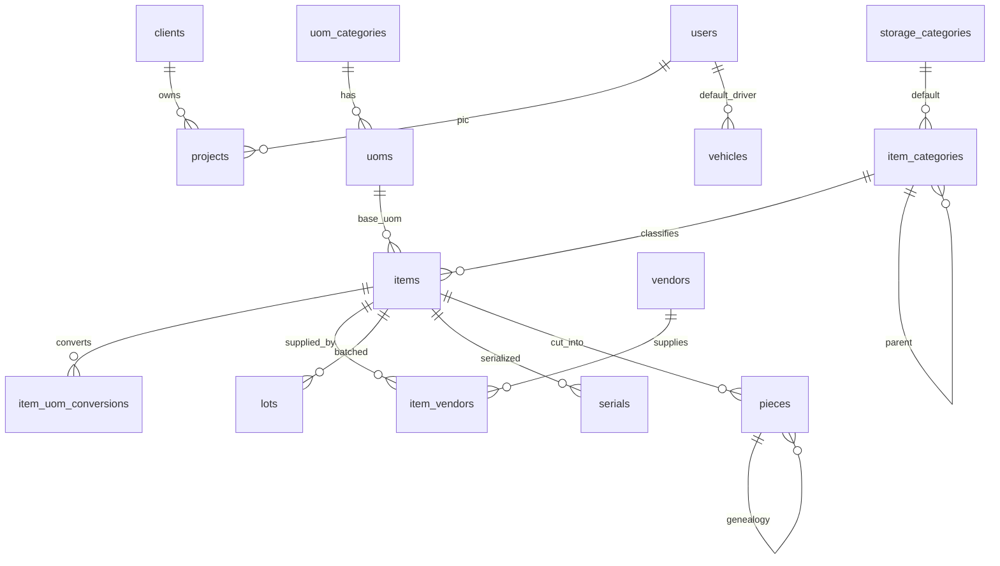

# Spesifikasi Modul — `master` (Klien, Proyek, Vendor, Item, Satuan, Referensi)

**Versi:** 0.6
**Tanggal:** 25 September 2026
**Status:** **selesai untuk Fase 1** — sembilan layar, tiga belas aksi domain, dan 37 uji hijau; penyimpangan implementasi dicatat §13; v0.4: guard penutupan proyek BR-PRJ-02/04, wizard setup awal, impor item dari Excel ([27-pendukung-f1](27-pendukung-f1.md), [A-187](04-keputusan-dan-asumsi.md#a-187), [A-191](04-keputusan-dan-asumsi.md#a-191), [A-192](04-keputusan-dan-asumsi.md#a-192)); v0.6: layar Pengaturan company ([A-230](04-keputusan-dan-asumsi.md#a-230), §6, §13.5 no. 8)
**Modul:** `master`
**Fase:** F1 (rencana kebutuhan material `[F2]` hanya stub)
**Dokumen terkait:** [Blueprint §6.3a](01-blueprint.md#63a-master-data-lain), [§6.4](01-blueprint.md#64-item-barang), [§6.5](01-blueprint.md#65-satuan-dinamis-uom), [§6.9](01-blueprint.md#69-proyek) · [Aturan Bisnis](05-aturan-bisnis.md) · [Katalog Status](06-katalog-status-dan-enum.md) · [Glosarium](03-glosarium.md) · [Model data master](08a-model-data-inti.md#area-master-data-tenant) · [Akun uji](../00-akun-uji.md)
**Ketergantungan modul:** `access` (user, cakupan role, audit log). Modul `warehouse` memakai `projects` dan `storage_categories`; modul `stock` memakai `items`, `uoms`, `lots`, `serials`, `pieces`.

---

## 1. Tujuan & lingkup

Modul ini menyediakan **data acuan** yang dipakai seluruh dokumen WMS: siapa kliennya, proyek apa yang berjalan, vendor mana yang memasok, barang apa yang dikelola, dalam satuan apa, dan alasan baku untuk tolak/batal/penyesuaian. Tanpa modul ini tidak ada dokumen yang bisa dibuat.

Termasuk `[F1]`: klien; proyek beserta statusnya ([A-40](04-keputusan-dan-asumsi.md#a-40)); vendor dengan jenis dan vendor sementara ([A-52](04-keputusan-dan-asumsi.md#a-52), [A-53](04-keputusan-dan-asumsi.md#a-53)); kategori barang; kategori penyimpanan; kategori satuan, satuan, dan konversi antar satuan ([D-11](04-keputusan-dan-asumsi.md#d-11)); item beserta mode pelacakan, model kepemilikan, aturan potong, dan titik pesan ulang; konversi satuan khusus item; vendor tetap per item; master alasan; kendaraan dan ekspedisi; pengaturan company dan pengaturan fitur stok (P-08).

Tabel **lot, serial, potongan** dibuat di sini karena melekat pada item, tetapi **barisnya lahir dari transaksi** (GRN, konversi, pemilahan retur), bukan diketik manual. Modul ini hanya menampilkannya sebagai daftar baca-saja di detail item.

Tidak termasuk: gudang, zona, rak, bin (modul `warehouse`); saldo & kartu stok (modul `stock`); harga beli/jual (D-07 — modul Purchasing & Akuntansi); rencana kebutuhan material `[F2]` (tabel dibuat sebagai stub, [BR-PRJ-09](05-aturan-bisnis.md#br-prj)); penutupan proyek yang butuh saldo stok ([BR-PRJ-02](05-aturan-bisnis.md#br-prj)) — di modul ini hanya perubahan status tanpa guard stok, guard penuh menyusul di modul `stock`.

## 2. Aktor & permission

Permission modul ini memakai awalan per entitas dan disimpan dengan `module = master`.

| Role bawaan | Permission |
|---|---|
| Admin Company | semua permission modul ini |
| Manajemen | semua `*.view` |
| Kepala Gudang | `client.view`, `project.view`, `vendor.view`, `item.view`, `item.update`, `uom.view`, `reference.view`, `reference.manage` |
| Staf Gudang | `item.view`, `uom.view`, `project.view`, `reference.view` |
| Pemohon Internal, Driver, Penindak Lanjut PR, Auditor | `item.view`, `project.view` (+ `vendor.view`, `vendor.create` untuk Penindak Lanjut PR — vendor sementara, [A-53](04-keputusan-dan-asumsi.md#a-53)) |
| Klien | tidak ada (portal memakai data proyeknya sendiri) |

Daftar: `client.view|create|update|deactivate`, `project.view|create|update|close`, `vendor.view|create|update|deactivate`, `item.view|create|update|deactivate`, `item_category.view|manage`, `uom.view|manage`, `reference.view|manage` (alasan, kategori penyimpanan, kendaraan, ekspedisi), `company_setting.view|manage`.

## 3. Entitas & data

Semua tabel di database **tenant**. Kolom umum (`id`, `created_at`, `updated_at`, `created_by`, `updated_by`) tidak diulang. Master tidak pernah dihapus, hanya dinonaktifkan (P-03).

### 3.1 `clients`, `projects`

`clients`: `code` varchar(30) UK, `name` varchar(150), `tax_id` (NPWP), `address`, `contact_name`, `phone`, `email`, `is_active`.

`projects`: `code` varchar(30) UK, `name` varchar(150), `client_id` FK (null = Proyek Internal), `is_internal` bool ([A-06](04-keputusan-dan-asumsi.md#a-06)), `status` enum `project_status` ([A-40](04-keputusan-dan-asumsi.md#a-40)), `address`, `lat`, `lng`, `start_date`, `target_end_date`, `pic_user_id` FK `users`, `closed_at`.

> **Penyimpangan ERD:** kolom `projects.site_warehouse_id` **tidak dibuat**. [A-40](04-keputusan-dan-asumsi.md#a-40) menetapkan satu proyek boleh punya **beberapa** Gudang Site, sehingga relasinya satu-ke-banyak lewat `warehouses.project_id` (modul `warehouse`).

### 3.2 `vendors`, `item_vendors`

`vendors`: `code` UK, `name`, `tax_id`, `contact_name`, `phone`, `email`, `address`, `payment_terms` (teks, tanpa nilai uang — D-07), `vendor_type` enum, `status` enum `vendor_status`, `is_active`.

`item_vendors` (vendor tetap): `item_id` FK, `vendor_id` FK, `priority` int (1 = utama), `is_preferred` bool, `notes`. `UK(item_id, vendor_id)`. Tanpa harga ([A-52](04-keputusan-dan-asumsi.md#a-52)).

### 3.3 Satuan: `uom_categories`, `uoms`, `item_uom_conversions`

`uom_categories`: `code` UK (`count`, `length`, `weight`, `volume`, `area`), `name`, `reference_uom_id` FK `uoms` (satuan acuan kategori).
`uoms`: `uom_category_id` FK, `code` UK, `name`, `factor_to_reference` decimal(18,8), `rounding` decimal(18,4), `is_active`.
`item_uom_conversions`: `item_id`, `uom_id`, `qty_base` decimal(18,4), `is_nominal_piece` bool. `UK(item_id, uom_id)`. Dipakai hanya untuk **input** transaksi ([BR-STK-09](05-aturan-bisnis.md#br-stk)).

### 3.4 `item_categories`, `storage_categories`, `items`

`item_categories`: `parent_id` self, `code` UK, `name`, `storage_category_id` FK (default), `removal_strategy` enum nullable, `tolerance_pct`, `tolerance_abs` ([BR-OPN-04](05-aturan-bisnis.md#br-opn)), `abc_class` `[F2]`, `is_active`.

`storage_categories`: `code` UK, `name`, `capacity_mode` enum `warn|block` ([A-37](04-keputusan-dan-asumsi.md#a-37)), `is_active`.

`items`: `code` UK, `name`, `item_category_id` FK, `status` enum `item_status`, `ownership_model` enum, `default_line_ownership` enum ([A-38](04-keputusan-dan-asumsi.md#a-38)), `tracking_mode` enum, `has_expiry` bool, `base_uom_id` FK, `is_cuttable` bool, `min_offcut_length` ([A-19](04-keputusan-dan-asumsi.md#a-19)), `kerf`, `requires_qc` bool, `removal_strategy` enum nullable (override kategori), `reorder_point`, `min_stock` ([BR-REQ-11](05-aturan-bisnis.md#br-req)), `barcode`, `qr_payload`, `photo_path`, `dimensions` json, `weight`, `weight_uom_id` FK.

### 3.5 `lots`, `serials`, `pieces` (diisi transaksi)

`lots`: `item_id`, `lot_no`, `expiry_date`, `received_at`, `vendor_id`, `attributes` json. `UK(item_id, lot_no)`.
`serials`: `item_id`, `serial_no`, `asset_state`, `condition_grade`, `lot_id`, `expiry_date`, `rfid_tag` `[F2]`, `current_project_id`, `due_return_date`, `acquired_at`, `meter_unit`, `meter_total`, `expected_life_days`, `expected_life_hours`, `condition_score` ([A-66](04-keputusan-dan-asumsi.md#a-66)). `UK(item_id, serial_no)`.
`pieces`: `item_id`, `piece_no` UK, `length`, `is_offcut`, `parent_piece_id` (silsilah, [BR-CNV-04](05-aturan-bisnis.md#br-cnv)), `origin_type`, `origin_id`, `is_consumed`.

### 3.6 Referensi & pengaturan

`reason_codes`: `context` enum (`reject`, `cancel`, `adjustment`, `waste`, `damage`, `short_pick`, `discrepancy`, `lost`), `code`, `label`, `is_active`. `UK(context, code)`. Wajib ada isinya sebelum dokumen bisa ditolak/dibatalkan ([BR-GEN-02](05-aturan-bisnis.md#br-gen)).
`vehicles`: `plate_no` UK, `type`, `default_driver_id` FK `users`, `is_active`.
`carriers`: `name`, `phone`, `is_active`.
`company_settings`: `key` PK, `value` json. `feature_settings`: `key` PK, `enabled`, `config` json (lapis 1 dari P-08).
`project_material_plans` `[F2]`: stub ([BR-PRJ-09](05-aturan-bisnis.md#br-prj)).

## 4. Mesin status

Satu-satunya dokumen berstatus di modul ini adalah **proyek** ([KS enum `project_status`](06-katalog-status-dan-enum.md#3-enum-lain)).

| Dari | Ke | Aksi | Aktor | Guard | Efek |
|---|---|---|---|---|---|
| — | `active` | `project.create` | Admin Company / Manajemen | Kode & nama terisi; klien terisi kecuali Proyek Internal | — |
| `active` | `closed` | `project.close` | Admin Company / Manajemen | **Fase modul ini:** tidak ada dokumen terbuka yang diketahui. Guard penuh (saldo Gudang Site = 0, aset kembali, DSC selesai) ditambahkan modul `stock` ([BR-PRJ-02](05-aturan-bisnis.md#br-prj)) | `closed_at` terisi; Gudang Site dinonaktifkan ([BR-PRJ-04](05-aturan-bisnis.md#br-prj), modul `warehouse`) |
| `active` | `cancelled` | `project.close` | Admin Company | Alasan `*` | reservasi dilepas (modul `stock`) |
| `closed` / `cancelled` | `archived` | `project.close` | Admin Company | — | proyek tidak menerima dokumen baru |

Status item (`active`, `provisional`, `inactive`) dan vendor (`active`, `provisional`, `inactive`) adalah **atribut**, bukan mesin status dokumen; keduanya berubah lewat aksi biasa.

## 5. Aturan bisnis yang berlaku

| BR | Catatan implementasi |
|---|---|
| [BR-GEN-05](05-aturan-bisnis.md#br-gen) | Semua master memakai `LogsActivity` (audit log) |
| [BR-GEN-11](05-aturan-bisnis.md#br-gen) | Field wajib `*`; menonaktifkan master memakai Alasan `*` + Keterangan opsional |
| [BR-STK-08](05-aturan-bisnis.md#br-stk) | `ownership_model` ∈ {asset, both} **wajib** `tracking_mode = serial` |
| [BR-STK-09](05-aturan-bisnis.md#br-stk), [BR-STK-10](05-aturan-bisnis.md#br-stk) | Item `piece`: satuan dasar wajib kategori **panjang**; konversi kemasan hanya `is_nominal_piece` |
| [BR-STK-11](05-aturan-bisnis.md#br-stk) | Kombinasi `tracking_mode` × `removal_strategy` × kedaluwarsa × `ownership_model` mengikuti [matriks BR §15](05-aturan-bisnis.md#15-matriks-kombinasi-pelacakan); di luar matriks ditolak saat menyimpan |
| [BR-STK-12](05-aturan-bisnis.md#br-stk) | Kedaluwarsa hanya `lot`/`serial`; `fefo` menuntut `has_expiry` |
| [BR-CNV-03](05-aturan-bisnis.md#br-cnv) | `min_offcut_length` wajib bila `is_cuttable` |
| [BR-REQ-03](05-aturan-bisnis.md#br-req) | Item `provisional` harus dilengkapi Admin sebelum GRN pertama; ditandai di daftar |
| [BR-REQ-11](05-aturan-bisnis.md#br-req) | `reorder_point` & `min_stock` memicu draf PRQ harian (modul `purchase-request`) |
| [BR-PRJ-01](05-aturan-bisnis.md#br-prj) | Hanya proyek `active` menerima dokumen baru |
| [A-06](04-keputusan-dan-asumsi.md#a-06) | Wajib ada satu **Proyek Internal** (`is_internal`) untuk konversi & peminjaman non-klien |
| [A-52](04-keputusan-dan-asumsi.md#a-52), [A-53](04-keputusan-dan-asumsi.md#a-53) | Jenis vendor; vendor `provisional` dibuat saat memesan dan dilengkapi Admin |
| P-03 | Master tidak dihapus; nonaktif ditolak bila masih dipakai data aktif |

Aturan baru modul ini (diusulkan masuk [05-aturan-bisnis](05-aturan-bisnis.md) sebagai `BR-MST`):

- **BR-MST-01** Kode master unik per company, huruf besar, dan tidak bisa diubah setelah dibuat.
- **BR-MST-02** Satuan dasar item tidak bisa diubah setelah item punya lot/serial/potongan atau pernah dipakai dokumen.
- **BR-MST-03** Kategori satuan wajib punya satuan acuan dengan `factor_to_reference = 1`.
- **BR-MST-04** Proyek Internal tidak boleh punya klien dan tidak bisa dinonaktifkan/ditutup selama masih dipakai konversi.
- **BR-MST-05** Master hanya bisa dinonaktifkan bila tidak dipakai data aktif (item aktif di kategori, proyek aktif milik klien, dan seterusnya).

## 6. Layar

Semua layar memakai layout back-office dan komponen Livewire, mengikuti pola modul Access. Field wajib bertanda `*`.

| Route | Komponen | Isi |
|---|---|---|
| `/clients` | `master.client-list` | Daftar + form klien (kode, nama, NPWP, alamat, kontak); nonaktifkan dengan Alasan `*` |
| `/projects` | `master.project-list` | Daftar + form proyek (kode, nama, klien atau Proyek Internal, PIC, tanggal, alamat & titik peta); nama menaut ke hub |
| `/projects/{id}` | `master.project-detail` | **Hub proyek** (Blueprint §6.9, [A-228](04-keputusan-dan-asumsi.md#a-228)): kepala + Gudang Site, tombol aksi (permintaan, transfer ke proyek lain, pemakaian, konversi, retur, laporan material), kartu ringkas (stok on-site, permintaan terbuka, aset di proyek, menunggu approval), tab Permintaan · Pengiriman · Stok on-site (Di Gudang Site / Aset di proyek / Terkirim ke klien) · Pemakaian · Konversi & waste · Retur & transfer · Aset · Approval · Riwayat; ubah status / tutup proyek dengan checklist BR-PRJ-02 |
| `/vendors` | `master.vendor-list` | Daftar + form vendor (jenis, status, kontak, termin); menandai vendor `provisional` yang perlu dilengkapi |
| `/items` | `master.item-list` | Daftar item dengan filter kategori, mode pelacakan, kepemilikan, status; penanda item Sementara |
| `/items/create`, `/items/{id}/edit` | `master.item-form` | Form item lengkap dengan validasi matriks kombinasi, konversi satuan khusus, dan vendor tetap |
| `/items/{id}` | `master.item-detail` | Ringkasan, konversi satuan, vendor tetap, lot/serial/potongan (baca-saja), riwayat |
| `/item-categories` | `master.item-category-list` | Pohon kategori + form (kategori penyimpanan default, strategi, ambang toleransi) |
| `/uoms` | `master.uom-list` | Kategori satuan + satuan di dalamnya, faktor ke satuan acuan |
| `/references` | `master.reference-list` | Tab: Alasan, Kategori penyimpanan, Kendaraan, Ekspedisi |
| `/settings/company` | `master.company-settings-form` | **Pengaturan company** ([A-230](04-keputusan-dan-asumsi.md#a-230)): ambang hari/persen dari `company_settings` (§13.5 no. 8 + `count_*`, `asset_life_alert_pct`) berkelompok dengan bawaan & rentang; saklar fitur lapis 1 (P-08) dengan penanda *dipakai n item*; zona waktu company; kunci periode hanya ditautkan. `company_setting.view` melihat, `company_setting.manage` menyimpan (`SaveCompanySettings`: hanya kunci yang berubah ditulis) |

## 7. Kejadian stok & integrasi

Tidak ada kejadian stok. Master vendor dan item dibaca modul Purchasing ([purchasing/01](../purchasing/01-lingkup-dan-integrasi-wms.md)); saat modul Purchasing aktif, kepemilikan master vendor berpindah dan WMS hanya membaca.

## 8. Notifikasi

| Kejadian | Penerima | Kanal |
|---|---|---|
| Item `provisional` dibuat dari baris non-katalog | Admin Company | in-app |
| Proyek ditutup / dibatalkan | PIC proyek, Kepala Gudang terkait | in-app |

## 9. Laporan & dashboard

| Laporan | Filter | Kolom |
|---|---|---|
| Daftar item | kategori, mode pelacakan, status | kode, nama, kategori, satuan dasar, mode, kepemilikan, titik pesan ulang |
| Item sementara | — | kode, nama, dibuat dari REQ, umur |
| Proyek | status, klien | kode, nama, klien, PIC, tanggal, jumlah Gudang Site |

## 10. Kasus uji (Given / When / Then)

| ID | Given | When | Then | BR |
|---|---|---|---|---|
| TC-MST-01 | Admin membuat klien baru | simpan dengan kode huruf kecil | kode disimpan huruf besar dan unik | BR-MST-01 |
| TC-MST-02 | Klien punya proyek aktif | nonaktifkan klien | ditolak dengan pesan jelas | BR-MST-05 |
| TC-MST-03 | Admin membuat proyek untuk klien | simpan | status `active`, `is_internal` false | BR-PRJ-01 |
| TC-MST-04 | Admin membuat Proyek Internal | mengisi klien | ditolak | BR-MST-04 |
| TC-MST-05 | Proyek `active` | tutup proyek | status `closed`, `closed_at` terisi | BR-PRJ-02 |
| TC-MST-06 | Proyek `closed` | arsipkan | status `archived` | BR-PRJ-01 |
| TC-MST-07 | Vendor baru jenis toko online | simpan | `vendor_type = online_marketplace`, status `active` | A-52 |
| TC-MST-08 | Vendor `provisional` | dilengkapi Admin | status menjadi `active` | A-53 |
| TC-MST-09 | Kategori satuan tanpa satuan acuan | simpan | ditolak | BR-MST-03 |
| TC-MST-10 | Satuan baru di kategori panjang | simpan faktor 0,01 | tersimpan dan bisa dipakai konversi | Blueprint §6.5 |
| TC-MST-11 | Item `ownership_model = asset` | pilih `tracking_mode = lot` | ditolak: aset wajib serial | BR-STK-08 |
| TC-MST-12 | Item `tracking_mode = piece` | satuan dasar bukan kategori panjang | ditolak | BR-STK-09 |
| TC-MST-13 | Item `tracking_mode = none` | pilih strategi `fefo` | ditolak (matriks BR §15) | BR-STK-11 |
| TC-MST-14 | Item `tracking_mode = lot`, strategi `fefo` | `has_expiry` tidak dicentang | ditolak | BR-STK-12 |
| TC-MST-15 | Item `is_cuttable` | `min_offcut_length` kosong | ditolak | BR-CNV-03 |
| TC-MST-16 | Item punya lot | ubah satuan dasar | ditolak | BR-MST-02 |
| TC-MST-17 | Item dengan konversi "1 batang = 6 m" | simpan | konversi tersimpan, ditandai potongan nominal | BR-STK-09 |
| TC-MST-18 | Item dengan dua vendor tetap | simpan prioritas 1 dan 2 | urutan vendor tersimpan | A-52 |
| TC-MST-19 | Kategori barang punya item aktif | nonaktifkan kategori | ditolak | BR-MST-05 |
| TC-MST-20 | Master alasan konteks `cancel` | simpan | tersedia untuk dialog pembatalan | BR-GEN-02 |
| TC-MST-21 | Kendaraan dengan driver bawaan | simpan | relasi ke user driver tersimpan | Blueprint §6.3a |
| TC-MST-22 | User tanpa `item.create` | buka form item | 403 | BR-GEN-09 |
| TC-MST-23 | Seeder demo dijalankan | periksa master | klien, proyek, vendor sesuai [00-akun-uji](../00-akun-uji.md) | — |

## 11. Di luar lingkup modul ini

Gudang & lokasi (modul `warehouse`); saldo, kartu stok, reservasi (modul `stock`); harga (D-07); impor Excel master (dibangun bersama modul `shared`); penutupan proyek dengan guard stok penuh ([BR-PRJ-02](05-aturan-bisnis.md#br-prj)); rencana kebutuhan material `[F2]`.

## 12. Definisi selesai

- [x] Migrasi tenant, model, dan enum untuk seluruh tabel §3 (19 model, 13 enum)
- [x] Aksi domain per permission (`SaveClient`, `DeactivateClient`, `SaveProject`, `ChangeProjectStatus`, `SaveVendor`, `DeactivateVendor`, `SaveItem`, `DeactivateItem`, `SaveItemCategory`, `DeactivateItemCategory`, `SaveUomCategory`, `SaveUom`, `SaveReference`) dengan validasi §5
- [x] Sembilan layar §6 memakai layout NexaDash dan menu "Master data"
- [x] Seeder referensi (kategori & satuan standar, alasan, kategori penyimpanan, saklar fitur) dan `MasterDemoSeeder` sesuai [00-akun-uji](../00-akun-uji.md)
- [x] Cakupan role di modul Access memakai **daftar nama proyek**, bukan id angka
- [x] Semua TC-MST lulus; `php83 artisan test` hijau (119 uji / 697 asersi)
- [x] Dokumen ini diperbarui: §13 mencatat penyimpangan implementasi

## 13. Catatan implementasi (23 September 2026)

### 13.1 Penyimpangan dari spesifikasi

1. **`projects.site_warehouse_id` tidak dibuat.** [A-40](04-keputusan-dan-asumsi.md#a-40) menetapkan satu
   proyek boleh punya beberapa Gudang Site, jadi relasinya satu-ke-banyak lewat `warehouses.project_id`
   di modul `warehouse`. Sudah dicatat sebagai kotak kutipan di §3.1.
2. **Kode `uom_categories` disimpan huruf besar** (`COUNT`, `LENGTH`, …) mengikuti BR-MST-01, sedangkan
   [Katalog Status](06-katalog-status-dan-enum.md) menulisnya huruf kecil. `UomCategory::enum()` mencocokkan
   tanpa memandang besar-kecil huruf, sehingga kedua bentuk tetap dikenali.
3. **Konversi kemasan per item boleh lintas kategori satuan.** "1 batang = 6 m" memang menghubungkan
   satuan hitung dengan satuan panjang ([BR-STK-09](05-aturan-bisnis.md#br-stk)); yang dilarang hanya
   mengulang satuan dasar itu sendiri. Konversi **antar satuan sejenis** tetap lewat `factor_to_reference`
   di dalam satu kategori ([D-11](04-keputusan-dan-asumsi.md#d-11)).
4. **`company_settings` dan `feature_settings` tidak memakai `LogsActivity`** karena kunci primernya teks
   sedangkan `audit_logs.subject_id` bilangan. Perubahannya dicatat manual lewat properti di
   `CompanySetting::put()` dan `FeatureSetting::toggle()`, sehingga BR-GEN-05 tetap terpenuhi.
5. **Layar Referensi menggabungkan empat master kecil** (alasan, kategori penyimpanan, kendaraan,
   ekspedisi) dalam satu komponen bertab, bukan empat layar terpisah — sesuai §6 tetapi diwujudkan
   sebagai satu kelas `ReferenceList` dengan satu aksi `SaveReference`.
6. **Sembilan komponen Livewire, bukan tujuh baris tabel §6**, karena form dan detail item dipisah dari
   daftarnya agar route `/items/create`, `/items/{id}/edit`, dan `/items/{id}` punya komponen sendiri.

### 13.2 Keputusan implementasi

1. **Matriks kombinasi pelacakan dipisah ke satu kelas** `App\Domain\Master\Support\TrackingCombination`.
   Kelas itu mengembalikan daftar pelanggaran per field, lalu dipakai dua kali: sebagai petunjuk langsung
   di form item dan sebagai penjaga sebenarnya di `SaveItem`. Layar boleh salah, aksi tidak boleh.
2. **`MasterCode`** membakukan seluruh kode master: huruf besar, spasi menjadi strip, karakter lain dibuang,
   dan perubahan kode pada baris yang sudah ada ditolak (BR-MST-01).
3. **Vendor aktif menuntut telepon atau email.** Tanpa kontak, vendor disimpan sebagai *Sementara*
   ([A-53](04-keputusan-dan-asumsi.md#a-53)) supaya pemesanan tetap bisa jalan tanpa data karangan.
4. **Proyek Internal tidak bisa ditutup** karena menjadi tumpuan konversi dan peminjaman non-klien
   ([A-06](04-keputusan-dan-asumsi.md#a-06)); tombol ubah status disembunyikan untuk proyek itu.
5. **Guard penutupan proyek masih ringan.** Urutan status dijaga (`active → closed|cancelled → archived`),
   tetapi pemeriksaan saldo Gudang Site nol, aset sudah kembali, dan DSC selesai
   ([BR-PRJ-02](05-aturan-bisnis.md#br-prj)) **belum ada** — modul `stock` sudah selesai tetapi `ChangeProjectStatus` belum memanggil `StockGuard`; lihat §13.4 nomor 7.
6. **`SaveItem` mempertahankan nilai lama** `min_offcut_length` dan `kerf` bila field-nya tidak dikirim,
   supaya simpan ulang dari layar lain tidak diam-diam menghapus aturan potong.
7. **Satuan `BATANG`** ditambahkan ke seeder kategori `COUNT` sebagai contoh kemasan untuk item per potong.

### 13.3 Layar yang sudah ada

| Layar | Route | Komponen Livewire | Isi |
|---|---|---|---|
| Klien | `/clients` | `master.client-list` | Daftar + form sebaris; nonaktifkan dengan *Alasan* `*` + *Keterangan* opsional; ditolak bila masih ada proyek aktif |
| Proyek | `/projects` | `master.project-list` | Daftar + form (klien atau Proyek Internal, PIC, tanggal, titik peta); dialog ubah status dengan pilihan tujuan yang sah saja |
| Vendor | `/vendors` | `master.vendor-list` | Daftar + form dengan jenis dan status; penanda vendor Sementara; filter jenis & status |
| Item | `/items` | `master.item-list` | Filter kategori, mode pelacakan, kepemilikan, status; tombol *Resmikan* untuk item Sementara |
| Form item | `/items/create`, `/items/{id}/edit` | `master.item-form` | Pilihan yang tidak sah otomatis hilang; petunjuk pelanggaran matriks tampil sebelum Simpan; konversi kemasan dan vendor tetap dalam satu form |
| Detail item | `/items/{id}` | `master.item-detail` | Tab Ringkasan, Lot, Serial, Potongan, Riwayat — tiga tab tengah baca-saja karena barisnya lahir dari transaksi |
| Kategori item | `/item-categories` | `master.item-category-list` | Pohon bertingkat, pewarisan toleransi opname, penjagaan lingkaran induk |
| Satuan | `/uoms` | `master.uom-list` | Kategori satuan di kiri, satuannya di kanan; kategori baru dibuat sekaligus dengan satuan acuannya |
| Data referensi | `/references` | `master.reference-list` | Tab Alasan, Kategori penyimpanan, Kendaraan, Ekspedisi |

Uji yang menopangnya ada di `tests/Feature/Master`: `ClientProjectTest` (TC-MST-01–06),
`VendorUomTest` (TC-MST-07–10), `ItemTest` (TC-MST-11–18), `ReferenceTest` (TC-MST-19–21),
dan `MasterScreenTest` (TC-MST-22–23).

### 13.4 Hub proyek (25 September 2026)

`Master\Livewire\ProjectDetail` + `ProjectController@show` (`projects.show`, `whereNumber`; di luar cakupan proyek = 404). Tab mengambil data hanya saat dibuka (paginate 20 dengan `pageName` per tab); Stok on-site memakai `Return\Support\ReturnableStock::forProject` supaya angkanya sama dengan form retur; tab Approval membaca `approval_snapshots` menunggu dengan `context->project_id` dan tautan lewat `ApprovalRegistry`. Form REQ/RET membaca `?project=` dan TRF membaca `?from_warehouse=` (pola `IssueForm`). "Ubah status" dihapus dari daftar proyek. Uji TC-MST-25/25b (`tests/Feature/Master/ProjectDetailTest.php`).

### 13.5 Sisa pekerjaan modul ini

1. ~~Laporan §9 beserta ekspor Excel~~ — **selesai 24 Sep 2026** lewat layar laporan bersama di `/reports`.
2. **Notifikasi §8** (item sementara dibuat, proyek ditutup) — menunggu modul notifikasi Fase 2.
3. ~~Unggah foto item~~ — **selesai 24 Sep 2026** memakai disk lokal per company ([A-68](04-keputusan-dan-asumsi.md#a-68)).
4. ~~Impor Excel master~~ — **selesai** ([27-pendukung-f1](27-pendukung-f1.md): item, proyek, vendor, saldo awal).
5. **Rencana kebutuhan material** `[F2]` — tabelnya sudah ada sebagai stub, layarnya belum ([BR-PRJ-09](05-aturan-bisnis.md#br-prj)).
6. ~~Cakupan gudang pada penugasan role memakai id angka~~ — **selesai 24 Sep 2026** setelah modul Warehouse ada;
   keduanya kini memakai daftar nama.
7. ~~Guard penutupan proyek~~ — **selesai 25 Sep 2026** (`ProjectClosureChecklist`, [A-187](04-keputusan-dan-asumsi.md#a-187)); sejak v0.5 checklist-nya ditampilkan di hub proyek sebelum menutup ([A-228](04-keputusan-dan-asumsi.md#a-228), TC-MST-25b).
8. ~~Layar pengaturan company~~ — **selesai 25 Sep 2026** di `/settings/company` ([A-230](04-keputusan-dan-asumsi.md#a-230), TC-MST-27 `CompanySettingsTest`); daftar kunci, bawaan, dan rentangnya dipusatkan di `Support\CompanySettingCatalog` (ditambah `count_tolerance_pct` 1 %, `count_tolerance_abs` 1, `count_moderate_pct` 5 %, `asset_life_alert_pct` 20 %). Kunci yang dibaca kode:

   | Kunci | Bawaan | Dipakai di | Arti |
   |---|---|---|---|
   | `review_sla_days` | 1 | `RequestList` ([14-request](14-request.md)) | Batas hari REQ ditinjau sebelum ditandai terlambat |
   | `substitution_objection_days` | 1 | `ReviewRequest` ([BR-REQ-13](05-aturan-bisnis.md#br-req)) | Tenggat keberatan klien atas penggantian |
   | `receipt_confirm_days` | 3 | `ConfirmDelivery` ([15-picking-shipment](15-picking-shipment.md)) | Batas konfirmasi terima oleh klien |
   | `discrepancy_alert_days` | 7 | `DiscrepancyList` ([15-picking-shipment](15-picking-shipment.md)) | Umur DSC terbuka yang ditandai |
   | `reservation_alert_days` | 7 | `ReservationList` ([13-stock](13-stock.md)) | Umur reservasi yang ditandai menggantung |
   | `stock_lock_date` | kosong | `LockStockPeriod`, `StockLedger` ([BR-STK-15](05-aturan-bisnis.md#br-stk)) | Tanggal kunci periode stok |
