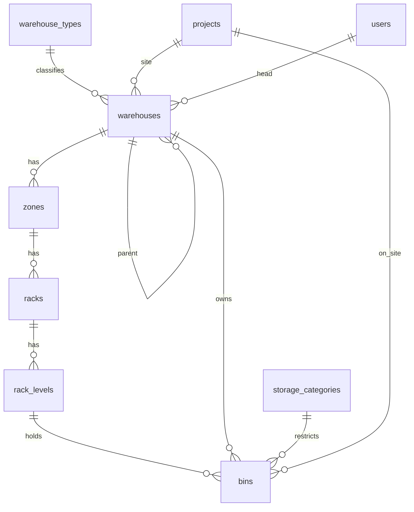

# Spesifikasi Modul — `warehouse` (Gudang, Zona, Rak, Level, Bin)

**Versi:** 0.10
**Tanggal:** 26 September 2026
**Status:** **selesai untuk Fase 1** — empat layar, delapan aksi domain, dan 28 uji hijau; penyimpangan implementasi dicatat §13; v0.6: label bin Code128 + QR dicetak lewat modul Template ([18](18-template-dokumen-label.md)), ukuran sementara [A-120](04-keputusan-dan-asumsi.md#a-120); v0.9: **denah gudang 2D** dengan ukuran/posisi opsional, rak area & bin ikut terpakai untuk barang besar, tanggal masuk & FIFO, kolom zona/rak/level dan ubah bin di `/bins` ([A-254](04b-asumsi-lanjutan.md#a-254), [A-255](04b-asumsi-lanjutan.md#a-255), [A-256](04b-asumsi-lanjutan.md#a-256)); v0.10: impor struktur gudang (zona, rak, level, bin) dari Excel ([A-258](04b-asumsi-lanjutan.md#a-258), §13.4c)
**Modul:** `warehouse`
**Fase:** F1
**Dokumen terkait:** [Blueprint §6.2](01-blueprint.md#62-struktur-organisasi--gudang), [§6.3](01-blueprint.md#63-lokasi-rak--bin--wajib) · [Aturan Bisnis](05-aturan-bisnis.md) · [Katalog Status](06-katalog-status-dan-enum.md) · [Glosarium](03-glosarium.md) · [Model data gudang](08a-model-data-inti.md#area-gudang--lokasi-tenant) · [Akun uji](../00-akun-uji.md)
**Ketergantungan modul:** `access` (user, cakupan role, audit log) dan `master` (proyek untuk Gudang Site, kategori penyimpanan untuk bin). Modul `stock` menulis saldo ke `bins`; modul `request`, `shipment`, `receipt` memakai `warehouses.code` sebagai segmen nomor dokumen.

---

## 1. Tujuan & lingkup

Modul ini menyediakan **tempat**: di gudang mana barang berada, dan di petak mana persisnya. Tanpa modul ini tidak ada satu pun dokumen stok yang bisa menyebut lokasi, karena P-06 menetapkan lokasi sebagai entitas, bukan teks bebas.

Termasuk `[F1]`: tipe gudang yang bisa ditambah company; hierarki gudang berbentuk pohon dengan Gudang Site terikat proyek ([A-40](04-keputusan-dan-asumsi.md#a-40)); zona, rak, level, dan bin dengan kode yang diturunkan dari hierarki; jenis bin termasuk dua bin virtual ([A-29](04-keputusan-dan-asumsi.md#a-29)); kapasitas bin sebagai peringatan atau blokir ([A-37](04-keputusan-dan-asumsi.md#a-37)); pembekuan bin saat opname; pembuat bin massal; label barcode dan QR per bin.

Tidak termasuk: saldo, kartu stok, dan reservasi (modul `stock`); saran put-away ([BR-GRN-03](05-aturan-bisnis.md#br-grn), modul `receipt`); sesi opname yang membekukan bin ([BR-OPN-02](05-aturan-bisnis.md#br-opn), modul `count`) — di sini hanya kolom dan aksi pembekuannya; penutupan Gudang Site otomatis saat proyek ditutup ([BR-PRJ-04](05-aturan-bisnis.md#br-prj)) yang menuntut saldo nol, jadi penjagaannya menyusul di modul `stock`.

## 2. Aktor & permission

Permission modul ini disimpan dengan `module = warehouse`.

| Role bawaan | Permission |
|---|---|
| Admin Company | semua permission modul ini |
| Manajemen | semua `*.view` |
| Kepala Gudang | `warehouse.view`, `warehouse.update`, `bin.view`, `bin.manage`, `warehouse_type.view` |
| Staf Gudang | `warehouse.view`, `bin.view` |
| Driver, Pemohon Internal, Penindak Lanjut PR | `warehouse.view` |
| Auditor Internal | `warehouse.view`, `bin.view`, `warehouse_type.view` |
| Klien | tidak ada |

Daftar: `warehouse.view|create|update|deactivate`, `bin.view|manage`, `warehouse_type.view|manage`. Impor struktur gudang dari Excel memakai `bin.manage` ([A-258](04b-asumsi-lanjutan.md#a-258)).

Cakupan berlaku penuh di sini: pemegang penugasan bercakupan gudang hanya melihat gudangnya sendiri ([BR-ACC-05](05-aturan-bisnis.md#br-acc)). Modul ini adalah pemakai pertama trait `ScopedToUser` (AD-06).

## 3. Entitas & data

Semua tabel di database **tenant**. Kolom umum (`id`, `created_at`, `updated_at`, `created_by`, `updated_by`) tidak diulang. Gudang dan bin tidak pernah dihapus, hanya dinonaktifkan (P-03).

### 3.1 `warehouse_types`

`code` varchar(20) UK · `name` varchar(60) · `is_builtin` bool. Bawaan: `main` Gudang Utama, `branch` Gudang Cabang, `site` Gudang Site (Blueprint §6.2). Tipe bawaan tidak bisa dihapus maupun diubah kodenya.

### 3.2 `warehouses`

`code` varchar(10) UK (segmen `{GUDANG}` nomor dokumen, [BR-GEN-06](05-aturan-bisnis.md#br-gen)) · `name` varchar(100) · `warehouse_type_id` FK · `parent_id` FK self (hierarki) · `project_id` FK `projects` (wajib bila tipe `site`; satu proyek boleh punya beberapa, [A-40](04-keputusan-dan-asumsi.md#a-40)) · `head_user_id` FK `users` (Kepala Gudang) · `address` text · `is_active` bool.

### 3.3 `zones`, `racks`, `rack_levels`

`zones`: `warehouse_id` FK, `code` varchar(10), `name` varchar(60). `UK(warehouse_id, code)`.
`racks`: `zone_id` FK, `code` varchar(10). `UK(zone_id, code)`.
`rack_levels`: `rack_id` FK, `code` varchar(10). `UK(rack_id, code)`.

Gudang site sederhana boleh memakai satu zona dan satu bin bawaan ([A-02](04-keputusan-dan-asumsi.md#a-02)).

### 3.4 `bins`

`warehouse_id` FK (denormalisasi untuk query) · `rack_level_id` FK nullable (null untuk bin virtual dan bin dok) · `code` varchar(40) UK (mis. `CKG-A-R03-L2-B05`) · `bin_type` enum · `bin_status` enum · `storage_category_id` FK · `capacity_qty`, `capacity_weight`, `capacity_volume`, `capacity_length` decimal(18,4) · `project_id` FK (hanya `on_site`) · `is_virtual` bool · `frozen_by_count_id` (FK `stock_counts`, modul `count`) · `count_flag` bool.

> **Tambahan terhadap ERD:** kolom `count_flag` belum ada di [08a](08a-model-data-inti.md#area-gudang--lokasi-tenant) padahal istilahnya sudah terdaftar di [Glosarium](03-glosarium.md) dan dipakai [BR-SJ-02](05-aturan-bisnis.md#br-sj) ("short pick menandai bin untuk dihitung"). Ditambahkan di sini sebagai [A-67](04-keputusan-dan-asumsi.md#a-67), menunggu validasi.

## 4. Mesin status

Gudang tidak punya mesin status dokumen; hanya `is_active`. Bin punya `bin_status` ([KS §3](06-katalog-status-dan-enum.md#3-enum-lain)).

| Dari | Ke | Aksi | Aktor | Guard | Efek |
|---|---|---|---|---|---|
| — | `active` | `bin.manage` | Kepala Gudang | Kode bin unik, hierarki lengkap | Bin siap menerima stok |
| `active` | `frozen` | `bin.manage` | Kepala Gudang / Auditor | Alasan `*` | Bin menolak PCK/PUT/SJ/ISU baru ([BR-OPN-02](05-aturan-bisnis.md#br-opn)) |
| `frozen` | `active` | `bin.manage` | Kepala Gudang | — | `frozen_by_count_id` dikosongkan |
| `active` | `inactive` | `bin.manage` | Kepala Gudang | Saldo dan reservasi nol ([BR-GEN-04](05-aturan-bisnis.md#br-gen)) | Bin hilang dari pilihan dokumen baru |
| `inactive` | `active` | `bin.manage` | Kepala Gudang | — | — |

Bin virtual (`in_transit`, `on_site`) tidak bisa dinonaktifkan selama gudang atau proyeknya masih aktif.

## 5. Aturan bisnis yang berlaku

| BR | Catatan implementasi |
|---|---|
| [BR-STK-02](05-aturan-bisnis.md#br-stk) | Lokasi = bin, termasuk bin virtual; tidak ada status "Dalam Perjalanan" pada saldo |
| [BR-STK-07](05-aturan-bisnis.md#br-stk) | Kapasitas bin: peringatan bawaan, blokir bila kategori penyimpanannya `block` ([A-37](04-keputusan-dan-asumsi.md#a-37)) |
| [BR-STK-13](05-aturan-bisnis.md#br-stk) | Bin `in_transit` milik gudang asal, satu per gudang |
| [BR-STK-14](05-aturan-bisnis.md#br-stk) | Bin `on_site` terikat satu proyek, hanya menampung aset |
| [BR-GEN-04](05-aturan-bisnis.md#br-gen) | Gudang dan bin tidak bisa dinonaktifkan bila saldo atau reservasi ≠ 0 |
| [BR-GEN-06](05-aturan-bisnis.md#br-gen) | `warehouses.code` menjadi segmen `{GUDANG}` nomor dokumen |
| [BR-ACC-05](05-aturan-bisnis.md#br-acc) | Daftar gudang dan bin dibatasi cakupan penugasan role |
| [BR-PRJ-04](05-aturan-bisnis.md#br-prj) | Setiap Gudang Site dinonaktifkan saat proyek `closed` dan saldonya nol |
| [BR-OPN-02](05-aturan-bisnis.md#br-opn) | Bin `frozen` menolak dokumen baru; penegakannya di modul `stock` |
| D-09, D-15 | Rak dan bin wajib; hierarki gudang dinamis |

Aturan baru modul ini (`BR-WH`, ditambahkan ke [05-aturan-bisnis](05-aturan-bisnis.md#br-wh)):

- **BR-WH-01** Kode bin diturunkan dari hierarki `{GUDANG}-{ZONA}-{RAK}-{LEVEL}-{BIN}` dan tidak bisa diubah setelah dibuat.
- **BR-WH-02** Setiap gudang baru otomatis mendapat bin bawaan: `receiving`, `staging`, `quarantine`, `return`, `waste`, dan satu bin virtual `in_transit` miliknya sendiri.
- **BR-WH-03** Bin `on_site` dibuat satu per proyek, hanya menampung aset, dan `project_id`-nya wajib.
- **BR-WH-04** Gudang bertipe `site` wajib punya `project_id`; tipe lain wajib tidak punya.
- **BR-WH-05** Hierarki gudang tidak boleh melingkar; gudang tidak boleh menjadi induknya sendiri, langsung maupun berantai.
- **BR-WH-06** Kapasitas bin ditegakkan menurut `capacity_mode` kategori penyimpanannya: `warn` memberi peringatan, `block` menolak penempatan.
- **BR-WH-07** Gudang dan bin dinonaktifkan, tidak dihapus, dan ditolak bila masih dipakai.

## 6. Layar

| Route | Komponen | Isi |
|---|---|---|
| `/warehouses` | `warehouse.warehouse-list` | Pohon gudang dengan tipe, induk, proyek, kepala gudang, jumlah bin; form sebaris; nonaktifkan dengan Alasan `*` |
| `/warehouses/{id}` | `warehouse.warehouse-detail` | Tab Zona & rak (dengan pembuat bin massal), Bin, dan Riwayat; tombol **Denah gudang** |
| `/warehouses/{id}/layout` | `warehouse.warehouse-layout` | **Denah 2D** ([A-254](04b-asumsi-lanjutan.md#a-254)): zona → rak berwarna status atau umur stok; klik rak → level → bin → isi (item, jumlah, lot/serial/potongan, tanggal masuk, umur, *tertua — ambil dulu*); cari bin/item/lot/serial/potongan; mode **Atur denah** (`bin.manage`): ukuran zona, ukuran/posisi/arah rak (geser di grid 0,5 m), rak area, tandai bin ikut terpakai ([A-255](04b-asumsi-lanjutan.md#a-255)) |
| `/bins` | `warehouse.bin-list` | Seluruh bin lintas gudang; filter gudang, jenis, status, **zona, rak**; kolom zona · rak · level & kapasitas lengkap; **Ubah** (kategori, kapasitas, mode kapasitas per bin); bekukan dan cairkan; cetak label |
| `/imports` kartu *Struktur gudang* | `ImportController` + `ImportWarehouseStructure` | Impor zona, rak, level, dan bin untuk gudang yang sudah ada; templat `/imports/bins/template`; semua-atau-tidak, galat per baris; tombol *Impor Excel* di `/bins` ([A-258](04b-asumsi-lanjutan.md#a-258)) |
| `/warehouse-types` | `warehouse.type-list` | Master tipe gudang; tipe bawaan hanya bisa diubah namanya |

Field wajib bertanda `*` ([BR-GEN-11](05-aturan-bisnis.md#br-gen)). Label bin memakai barcode Code128 dan QR (AD-08); ukuran kertas dibuat dapat diatur karena [O-09](04-keputusan-dan-asumsi.md#o-09) belum diputuskan.

## 7. Kejadian stok & integrasi

Tidak ada kejadian stok. Modul `stock` membaca `bins` untuk saldo dan `warehouses` untuk reservasi lunak; modul dokumen membaca `warehouses.code` untuk penomoran.

## 8. Notifikasi

| Kejadian | Penerima | Kanal |
|---|---|---|
| Gudang dinonaktifkan | Admin Company, kepala gudang terkait | in-app |
| Bin dibekukan sesi opname | Kepala gudang | in-app |

## 9. Laporan & dashboard

| Laporan | Filter | Kolom |
|---|---|---|
| Daftar gudang | tipe, status, proyek | kode, nama, tipe, induk, proyek, kepala gudang, jumlah zona, jumlah bin |
| Daftar bin | gudang, jenis, status, kategori penyimpanan | kode, gudang, jenis, status, kategori, kapasitas |

## 10. Kasus uji (Given / When / Then)

| ID | Given | When | Then | BR |
|---|---|---|---|---|
| TC-WH-01 | Admin membuat gudang baru | simpan dengan kode huruf kecil | kode disimpan huruf besar dan unik | BR-MST-01 |
| TC-WH-02 | Gudang baru tersimpan | periksa binnya | lima bin bawaan dan satu bin `in_transit` terbentuk | BR-WH-02 |
| TC-WH-03 | Admin memilih tipe `site` tanpa proyek | simpan | ditolak | BR-WH-04 |
| TC-WH-04 | Admin memilih tipe `main` dengan proyek | simpan | ditolak | BR-WH-04 |
| TC-WH-05 | Gudang A induk dari B | menjadikan A anak dari B | ditolak | BR-WH-05 |
| TC-WH-06 | Gudang punya zona A, rak R03, level L2 | membuat bin B05 | kode menjadi `CKG-A-R03-L2-B05` | BR-WH-01 |
| TC-WH-07 | Bin sudah dibuat | mengubah kodenya | ditolak | BR-WH-01 |
| TC-WH-08 | Zona dengan rak dan level | pembuat bin massal 3 bin | tiga bin berurutan terbentuk tanpa tabrakan kode | BR-WH-01 |
| TC-WH-09 | Bin aktif | bekukan dengan alasan | status `frozen`, alasan tercatat | BR-OPN-02 |
| TC-WH-10 | Bin beku | cairkan | status `active`, penanda sesi dikosongkan | BR-OPN-02 |
| TC-WH-11 | Bin virtual `in_transit` | nonaktifkan | ditolak | BR-WH-02 |
| TC-WH-12 | Proyek aktif | buat bin `on_site` | satu bin per proyek, `project_id` terisi | BR-WH-03 |
| TC-WH-13 | Bin `on_site` | dibuat tanpa proyek | ditolak | BR-WH-03 |
| TC-WH-14 | Kategori penyimpanan `block` | bin memakai kategori itu | penegakan kapasitas menjadi blokir | BR-WH-06 |
| TC-WH-15 | Kategori penyimpanan `warn` | kapasitas terlampaui | peringatan, bukan penolakan | BR-STK-07 |
| TC-WH-16 | Gudang punya bin aktif | nonaktifkan gudang | ditolak dengan pesan jelas | BR-WH-07 |
| TC-WH-17 | User bercakupan gudang CKG | buka daftar gudang | hanya CKG yang tampil | BR-ACC-05 |
| TC-WH-18 | User tanpa `warehouse.create` | buka form gudang | 403 | BR-GEN-09 |
| TC-WH-19 | Tipe gudang bawaan | hapus atau ubah kodenya | ditolak | P-03 |
| TC-WH-21 | Zona 12 × 6 m | rak area seluruh zona; isi 1 unit lalu item lain | kode `…-AREA`, ukuran = zona, `block` kapasitas 1; isi kedua BR-WH-06; tidak disarankan put-away | A-255 |
| TC-WH-22 | Bin utama & tetangga | tandai ikut terpakai (utama kosong / tanpa alasan / tetangga berisi / sah); keluarkan isi utama | BR-WH-06, BR-GEN-11, BR-WH-06; tercatat & tidak disarankan; lepas otomatis | A-255 |
| TC-WH-23 | Rak tanpa posisi | data denah; ukuran negatif; ukuran zona & rak; geser 2,26/1,74 lalu 50/50 | ditata otomatis; BR-GEN-11; snap 2,5/1,5; dijepit 7/4 di dalam zona | A-254 |
| TC-WH-24 | Baut masuk 40 hari & 2 hari lalu | data denah dengan cari; label lot | tertua di bin lama, umur 40, 2 hasil cari; label "Masuk dd/mm/yyyy" | A-256 |
| TC-WH-25 | Kepala Gudang & staf | layar denah, panel rak, geser, rak area; staf; daftar bin saring rak, ubah kapasitas | 200 + tombol; isi & tertua; posisi 1/1; rak area; staf tanpa tombol & 403; kolom zona·rak·level, kapasitas 20 blokir | A-254, A-255 |
| TC-WH-26 | Gudang CKG dengan A-R01-L1-B01 | kartu & templat; impor 5 baris (zona C baru, rak R01/R02, level L1/L2, A-R01-L3; jenis boleh label; kapasitas koma) | 1 zona, 2 rak, 4 level, 5 bin berkode hierarki; zona A dipakai ulang; log impor & *Zona dibuat* | A-258 |
| TC-WH-26b | — | 1 baris benar + gudang asing, jenis `receiving`, kapasitas −5, level kosong, jenis asing, `on_site` | galat baris 3–8, baris 2 tidak; nol zona/rak/level/bin | A-258, A-207 |
| TC-WH-26c | Bin CKG-A-R01-L1-B01 kapasitas 50 | impor kode yang sama; kode sama dua kali di berkas | "sudah dipakai", kapasitas tetap 50; "ganda di berkas (sama dengan baris 2)"; nol tersimpan | BR-WH-01 |
| TC-WH-26d | Staf gudang; Kepala Gudang CKG; Kepala Gudang BKS | templat & unggah; buka `/imports`; impor baris CKG | 403; hanya kartu struktur gudang; "di luar cakupan", baris BKS ikut batal | BR-GEN-09, BR-ACC-05 |
| TC-WH-20 | Seeder demo dijalankan | periksa gudang | CKG, BKS, KRW1, KRW2 sesuai [00-akun-uji](../00-akun-uji.md) §2 | — |

## 11. Di luar lingkup modul ini

Saldo, kartu stok, reservasi (modul `stock`); saran put-away (modul `receipt`); sesi opname (modul `count`); impor Excel **gudang** (menunggu [O-12](04-keputusan-dan-asumsi.md#o-12); zona–rak–level–bin sudah bisa diimpor, [A-258](04b-asumsi-lanjutan.md#a-258)); ukuran label dan jenis printer (menunggu [O-09](04-keputusan-dan-asumsi.md#o-09)).

## 12. Definisi selesai

- [x] Migrasi tenant, model, dan enum untuk seluruh tabel §3 (6 model, 2 enum)
- [x] Aksi domain per permission dengan validasi §5 (`SaveWarehouse`, `DeactivateWarehouse`, `SaveWarehouseType`, `SaveLocation`, `SaveBin`, `ChangeBinStatus`, `GenerateBins`, `EnsureSystemBins`)
- [x] Empat layar §6 memakai layout NexaDash dan menu "Gudang"
- [x] Seeder tipe gudang bawaan dan gudang demo sesuai [00-akun-uji](../00-akun-uji.md) §2
- [x] Cakupan gudang di modul Access memakai **daftar nama gudang**, bukan id angka
- [x] Semua TC-WH lulus; `php83 artisan test` hijau (162 uji / 863 asersi)
- [x] Dokumen ini diperbarui: §13 mencatat penyimpangan implementasi

## 13. Catatan implementasi (24 September 2026)

### 13.1 Penyimpangan dari spesifikasi

1. **Kode tipe gudang disimpan huruf besar** (`MAIN`, `BRANCH`, `SITE`) mengikuti BR-MST-01, sedangkan
   Blueprint §6.2 menulisnya huruf kecil. `WarehouseType::isSite()` mencocokkan tanpa memandang
   besar-kecil huruf, sama seperti yang dilakukan kategori satuan di modul Master.
2. **Satu bin `on_site` per proyek, bukan per Gudang Site.** Blueprint §6.3 menulis "satu per proyek",
   sedangkan [A-40](04-keputusan-dan-asumsi.md#a-40) memperbolehkan satu proyek punya beberapa Gudang Site.
   Yang dipakai adalah bunyi Blueprint: bin dicari lintas gudang, jadi proyek dengan dua Gudang Site tetap
   punya satu bin On-site.
3. **`bins.freeze_reason` ditambahkan** di luar ERD supaya alasan pembekuan tersimpan bersama binnya,
   bukan hanya di audit log. `frozen_by_count_id` dibuat tanpa foreign key karena `stock_counts` baru
   lahir di modul `count`; foreign key-nya dipasang migrasi modul Count/Adjustment (v0.5,
   [21-opname-penyesuaian](21-opname-penyesuaian.md), [A-104](04-keputusan-dan-asumsi.md#a-104)).
4. **`zones`, `racks`, dan `rack_levels` diberi kolom `is_active`** yang tidak ada di ERD, supaya
   hierarki lokasi bisa dinonaktifkan tanpa dihapus (P-03) seperti master lainnya.
5. **Tiga tingkat hierarki lokasi ditangani satu kelas aksi** `SaveLocation`, bukan tiga kelas terpisah,
   karena aturannya identik: kode dibakukan huruf besar, unik di dalam induknya, dan terkunci setelah
   dibuat karena ikut membentuk kode bin.

### 13.2 Keputusan implementasi

1. **Modul ini pemakai pertama `ScopedToUser`.** Trait pembatas cakupan sudah ada sejak modul Access
   tetapi tidak pernah dipasang di satu model pun. `Warehouse` dan `Bin` memakainya, sehingga BR-ACC-05
   akhirnya ditegakkan lewat global scope, bukan penyaringan ad-hoc di tiap layar.
2. **Arti "cakupan kosong" disatukan.** Sebelumnya `accessibleProjectIds()` mengembalikan array kosong
   untuk user yang hanya dibatasi gudang, dan tiga tempat menafsirkannya berbeda. Sekarang metode itu
   tidak pernah mengembalikan array kosong: `null` berarti tidak dibatasi pada dimensi tersebut.
3. **Gudang di luar cakupan menghasilkan 404, bukan 403.** Route model binding memakai global scope yang
   sama, jadi keberadaan gudang milik cakupan lain pun tidak terkonfirmasi.
4. **Bin bawaan dibuat ulang setiap kali gudang disimpan.** `EnsureSystemBins` aman dijalankan berulang,
   sehingga gudang lama yang dibuat sebelum BR-WH-02 ada ikut dilengkapi saat diubah.
5. **Pembuat bin massal menghitung ulang nomor tiap putaran**, bukan sekali di awal, supaya kode yang
   sudah ada di level itu tidak tertabrak.
6. **Menonaktifkan gudang ikut menonaktifkan binnya**, dan mengaktifkannya kembali hanya menghidupkan bin
   sistem. Bin penyimpanan yang sengaja dimatikan tidak ikut terbalik.

### 13.3 Layar yang sudah ada

| Layar | Route | Komponen Livewire | Isi |
|---|---|---|---|
| Daftar gudang | `/warehouses` | `warehouse.warehouse-list` | Pohon gudang, form sebaris, pilihan proyek yang hanya aktif untuk tipe Gudang Site, nonaktifkan dengan Alasan `*` |
| Detail gudang | `/warehouses/{id}` | `warehouse.warehouse-detail` | Tab Zona & rak (dengan pembuat bin massal), Bin, dan Riwayat |
| Bin | `/bins` | `warehouse.bin-list` | Filter gudang, jenis, status, penanda hitung; bekukan, cairkan, nonaktifkan, tandai hitung |
| Tipe gudang | `/warehouse-types` | `warehouse.type-list` | Master tipe; tipe bawaan hanya bisa diubah namanya |

Uji yang menopangnya ada di `tests/Feature/Warehouse`: `WarehouseTest` (TC-WH-01–05, 16, 19),
`BinTest` (TC-WH-06–15), dan `WarehouseScreenTest` (TC-WH-17, 18, 20).

### 13.4 Tautan cepat (25 September 2026)

Halaman gudang (`warehouse-detail`) menampilkan tombol tautan cepat ke daftar yang sudah menyaring gudang itu (saldo stok, reservasi, picking, SJ, GRN, put-away, PRQ, PO) dan badge proyek Gudang Site menaut ke hub proyek ([A-228](04-keputusan-dan-asumsi.md#a-228)).

### 13.4b Denah gudang (26 September 2026)

Migrasi tenant `000280_add_layout_columns_to_warehouse_tables` (semua kolom opsional). `Support\WarehouseLayoutData` menyusun zona → rak (posisi otomatis 4 rak per baris bila kosong) → level → bin → isi; status rak beku › terpakai › penuh › terisi › kosong; umur isi dari pergerakan masuk terakhir; baris tertua per item ditandai (FIFO). `Actions\SaveWarehouseLayout` (`bin.manage`): ukuran zona/rak/level, geser rak (snap 0,5 m, dijepit di dalam zona), `areaRack` (rak + level L1 + bin `AREA`, `capacity_mode = block`, bawaan 1 unit, opsi seluruh zona). `Actions\MarkBinsOccupied`: bin tetangga kosong ditandai `occupied_by_bin_id` + alasan; dilepas manual atau otomatis lewat observer `StockMovement::created` saat bin utama kosong. `StockLedger::tambah` menghitung kapasitas bin bermode sendiri dari **total isi bin**; `PutawaySuggester` melewati bin ikut terpakai. `Livewire\WarehouseLayout` — SVG + Alpine (tanpa library baru), `WarehousePolicy::manageLayout`. `/bins`: kolom & filter zona/rak/level, ubah bin lewat `SaveBin` (kini menerima `capacity_mode`). Label lot/potongan mencantumkan tanggal masuk ([A-256](04b-asumsi-lanjutan.md#a-256)). Uji TC-WH-21–25; `ui-check` 6b.

### 13.4c Impor struktur gudang (26 September 2026)

`Actions\ImportWarehouseStructure` (`bin.manage`) meniru impor Master: `Master\Support\ExcelRows` membaca berkas, `ImportBatch` menjalankan semua baris dalam satu transaksi dan membatalkan semuanya bila ada satu galat. Per baris: gudang dicari tanpa global scope lalu diperiksa `canAccessWarehouse` dan aktif; zona → rak → level dicari dulu (baris sebelumnya ikut terlihat karena satu transaksi), yang belum ada dibuat `SaveLocation`, yang nonaktif menolak baris; bin lewat `SaveBin` sehingga BR-WH-01/02/03, AD-14, dan log *Bin dibuat* sama dengan layar. `WarehouseRuleException` dibungkus menjadi `MasterRuleException` agar tampil sebagai galat baris. Kode bin ganda di dalam berkas ditolak sebelum `SaveBin`. Satu log ringkas `Impor struktur gudang dari Excel: n bin`. Pintu masuk: kartu `#impor-bins` di `/imports`, menu *Impor Excel* (kini juga untuk `bin.manage`), palet, tombol di `/bins`. Uji TC-WH-26–26d; `ui-check` 6c ([A-258](04b-asumsi-lanjutan.md#a-258)).

### 13.5 Sisa pekerjaan modul ini

1. ~~**Label bin barcode dan QR**~~ — **selesai** lewat modul Template ([18-template-dokumen-label](18-template-dokumen-label.md) §5.3): tautan *Cetak label* di `/bins`. Ukuran kertas final dan jenis printer tetap menunggu [O-09](04-keputusan-dan-asumsi.md#o-09); sampai itu, [A-120](04-keputusan-dan-asumsi.md#a-120).
2. ~~**Penjagaan saldo dan reservasi nol** sebelum menonaktifkan gudang atau bin ([BR-GEN-04](05-aturan-bisnis.md#br-gen))~~ — selesai di modul [`stock`](13-stock.md) lewat `StockGuard`.
3. ~~Penutupan Gudang Site otomatis saat proyek ditutup~~ — **selesai** ([BR-PRJ-04](05-aturan-bisnis.md#br-prj)): `Master\Actions\ChangeProjectStatus` menonaktifkan Gudang Site yang sudah kosong (bin ikut nonaktif + jejak) saat proyek ditutup; gudang berisi stok menahan penutupan lewat `ProjectClosureChecklist` ([A-187](04-keputusan-dan-asumsi.md#a-187), TC-MST-25b).
4. ~~**Impor Excel bin**~~ — **selesai 26 Sep 2026**: zona, rak, level, dan bin untuk gudang yang sudah ada (§13.4c, [A-258](04b-asumsi-lanjutan.md#a-258)). **Impor gudang** sendiri tetap menunggu [O-12](04-keputusan-dan-asumsi.md#o-12).
5. ~~**Laporan §9** beserta ekspor Excel~~ — **selesai 24 Sep 2026**: *Daftar Gudang* dan *Daftar Bin* di `/reports` ([16-shared-laporan-berkas](16-shared-laporan-berkas.md)).
6. ~~**`count_flag` menunggu persetujuan**~~ — [A-67](04-keputusan-dan-asumsi.md#a-67) disetujui 24 Sep 2026; kolomnya dipakai modul Picking untuk short pick.
