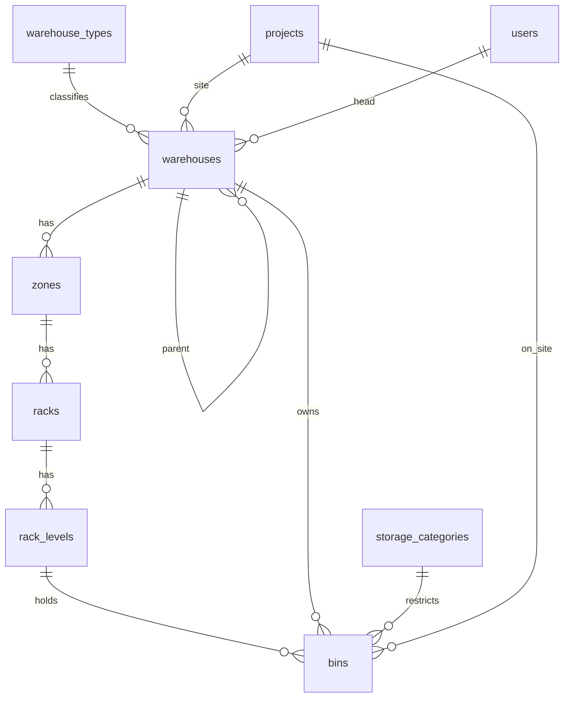

# Spesifikasi Modul — `warehouse` (Gudang, Zona, Rak, Level, Bin)

**Versi:** 0.18
**Tanggal:** 1 Oktober 2026
**Status:** **selesai untuk Fase 1** — empat layar, delapan aksi domain, dan 28 uji hijau (awal); penyimpangan implementasi dicatat §13; v0.6: label bin Code128 + QR dicetak lewat modul Template ([18](18-template-dokumen-label.md)), ukuran sementara [A-120](04-keputusan-dan-asumsi.md#a-120); v0.9: **denah gudang 2D** dengan ukuran/posisi opsional, rak area & bin ikut terpakai untuk barang besar, tanggal masuk & FIFO, kolom zona/rak/level dan ubah bin di `/bins` ([A-254](04b-asumsi-lanjutan.md#a-254), [A-255](04b-asumsi-lanjutan.md#a-255), [A-256](04b-asumsi-lanjutan.md#a-256)); v0.10: impor struktur gudang (zona, rak, level, bin) dari Excel ([A-258](04b-asumsi-lanjutan.md#a-258), §13.4c); v0.11: zona/rak/level/bin ditambah langsung dari denah ([A-271](04b-asumsi-lanjutan.md#a-271)) dan impor gudang dari Excel ([A-272](04b-asumsi-lanjutan.md#a-272)); v0.12: rak di denah berisi petak bin per level, label level di luar ([A-281](04b-asumsi-lanjutan.md#a-281)); v0.13: panel isi bin denah menampilkan uraian kemasan ([A-293](04b-asumsi-lanjutan.md#a-293), TC-WH-30); v0.14: **denah gedung** — ukuran gedung, zona digeser & diubah ukuran di dalam gedung, objek denah tanpa stok (pintu, dock, jalur forklift, pilar, kantor, area bebas), zoom, geser halus, putar, peringatan tumpukan, panel rak berdesain ulang (tampak depan, isi per bin, tab Isi | Atur), nonaktif rak/zona, mode Denah di Daftar Gudang ([A-320](04b-asumsi-lanjutan.md#a-320)–[A-325](04b-asumsi-lanjutan.md#a-325), TC-WH-31–TC-WH-37); v0.15: tautan model data menunjuk [08b](08b-model-data-stok-dokumen.md#area-gudang--lokasi-tenant) setelah area *Gudang & lokasi* dipindah ke sana; v0.16: **Denah ringan** — data sekali muat, gambar di browser, klik rak = isi rak saja, mode Atur dengan Urungkan + satu *Simpan perubahan* (galat per objek, satu transaksi), versi daftar untuk HP, *Lanjutan* dilipat, kode pendek bin ([A-352](04b-asumsi-lanjutan.md#a-352), [A-353](04b-asumsi-lanjutan.md#a-353); §6, §10 TC-WH-38–41, §13.10); v0.17: **struktur rak nyata** — Gabung Bin/Pisah (samping/atas, sementara/permanen) menggantikan bin ikut terpakai, hapus bin yang belum pernah dipakai, lebar bin, area lantai berkapasitas bebas, kapasitas per seluruh isi bin ([A-359](04b-asumsi-lanjutan.md#a-359)–[A-364](04b-asumsi-lanjutan.md#a-364); §3.4, §4, §5, §6, §10 TC-WH-42–49b, §13.11); v0.18: **Tempat Simpan barang** & mode Tata letak — spesifikasi dipecah ke [12a-tata-letak-barang](12a-tata-letak-barang.md) ([A-365](04b-asumsi-lanjutan.md#a-365)–[A-372](04b-asumsi-lanjutan.md#a-372); §13.12)
**Modul:** `warehouse`
**Fase:** F1
**Dokumen terkait:** [Blueprint §6.2](01-blueprint.md#62-struktur-organisasi--gudang), [§6.3](01-blueprint.md#63-lokasi-rak--bin--wajib) · [Aturan Bisnis](05-aturan-bisnis.md) · [Katalog Status](06-katalog-status-dan-enum.md) · [Glosarium](03-glosarium.md) · [Model data gudang](08b-model-data-stok-dokumen.md#area-gudang--lokasi-tenant) · [Akun uji](../00-akun-uji.md)
**Ketergantungan modul:** `access` (user, cakupan role, audit log) dan `master` (proyek untuk Gudang Site, kategori penyimpanan untuk bin). Modul `stock` menulis saldo ke `bins`; modul `request`, `shipment`, `receipt` memakai `warehouses.code` sebagai segmen nomor dokumen.

---

## 1. Tujuan & lingkup

Modul ini menyediakan **tempat**: di gudang mana barang berada, dan di petak mana persisnya. Tanpa modul ini tidak ada satu pun dokumen stok yang bisa menyebut lokasi, karena P-06 menetapkan lokasi sebagai entitas, bukan teks bebas.

Termasuk `[F1]`: tipe gudang yang bisa ditambah company; hierarki gudang berbentuk pohon dengan Gudang Site terikat proyek ([A-40](04-keputusan-dan-asumsi.md#a-40)); zona, rak, level, dan bin dengan kode yang diturunkan dari hierarki; jenis bin termasuk dua bin virtual ([A-29](04-keputusan-dan-asumsi.md#a-29)); kapasitas bin sebagai peringatan atau blokir ([A-37](04-keputusan-dan-asumsi.md#a-37)); pembekuan bin saat opname; pembuat bin massal; label barcode dan QR per bin.

Tidak termasuk: saldo, kartu stok, dan reservasi (modul `stock`); saran put-away ([BR-GRN-03](05-aturan-bisnis.md#br-grn), modul `receipt`); sesi opname yang membekukan bin ([BR-OPN-02](05-aturan-bisnis.md#br-opn), modul `count`) — di sini hanya kolom dan aksi pembekuannya; penutupan Gudang Site otomatis saat proyek ditutup ([BR-PRJ-04](05-aturan-bisnis.md#br-prj)) yang menuntut saldo nol, jadi penjagaannya menyusul di modul `stock`.

## 2. Aktor & permission

Permission modul ini disimpan dengan `module = warehouse`.

| Role bawaan | Permission |
|---|---|
| Admin Company | semua permission modul ini |
| Manajemen | semua `*.view` |
| Kepala Gudang | `warehouse.view`, `warehouse.update`, `bin.view`, `bin.manage`, `warehouse_type.view` |
| Staf Gudang | `warehouse.view`, `bin.view` |
| Driver, Pemohon Internal, Penindak Lanjut PR | `warehouse.view` |
| Auditor Internal | `warehouse.view`, `bin.view`, `warehouse_type.view` |
| Klien | tidak ada |

Daftar: `warehouse.view|create|update|deactivate`, `bin.view|manage`, `warehouse_type.view|manage`. Impor struktur gudang dari Excel memakai `bin.manage` ([A-258](04b-asumsi-lanjutan.md#a-258)).

Cakupan berlaku penuh di sini: pemegang penugasan bercakupan gudang hanya melihat gudangnya sendiri ([BR-ACC-05](05-aturan-bisnis.md#br-acc)). Modul ini adalah pemakai pertama trait `ScopedToUser` (AD-06).

## 3. Entitas & data

Semua tabel di database **tenant**. Kolom umum (`id`, `created_at`, `updated_at`, `created_by`, `updated_by`) tidak diulang. Gudang dan bin tidak pernah dihapus, hanya dinonaktifkan (P-03).

### 3.1 `warehouse_types`

`code` varchar(20) UK · `name` varchar(60) · `is_builtin` bool. Bawaan: `main` Gudang Utama, `branch` Gudang Cabang, `site` Gudang Site (Blueprint §6.2). Tipe bawaan tidak bisa dihapus maupun diubah kodenya.

### 3.2 `warehouses`

`code` varchar(10) UK (segmen `{GUDANG}` nomor dokumen, [BR-GEN-06](05-aturan-bisnis.md#br-gen)) · `name` varchar(100) · `warehouse_type_id` FK · `parent_id` FK self (hierarki) · `project_id` FK `projects` (wajib bila tipe `site`; satu proyek boleh punya beberapa, [A-40](04-keputusan-dan-asumsi.md#a-40)) · `head_user_id` FK `users` (Kepala Gudang) · `address` text · `is_active` bool.

### 3.3 `zones`, `racks`, `rack_levels`

`zones`: `warehouse_id` FK, `code` varchar(10), `name` varchar(60), `length_m`/`width_m` (A-254) dan `pos_x`/`pos_y` decimal(8,2) opsional — posisi di gedung, meter ([A-320](04b-asumsi-lanjutan.md#a-320)). `UK(warehouse_id, code)`.
`racks`: `zone_id` FK, `code` varchar(10). `UK(zone_id, code)`.
`rack_levels`: `rack_id` FK, `code` varchar(10). `UK(rack_id, code)`.

Gudang site sederhana boleh memakai satu zona dan satu bin bawaan ([A-02](04-keputusan-dan-asumsi.md#a-02)).

`warehouses.length_m`/`width_m` decimal(8,2) opsional = garis luar gedung di denah ([A-320](04b-asumsi-lanjutan.md#a-320)).

`floor_plan_objects` ([A-320](04b-asumsi-lanjutan.md#a-320)): `warehouse_id` FK, `object_type` (`floor_plan_object_type`: `door`, `dock`, `forklift_lane`, `pillar`, `office`, `open_area`), `name` varchar(60), `pos_x`/`pos_y`/`length_m`/`width_m` decimal(8,2), `rotation` 0/90/180/270, `is_active`. Tanpa stok (P-01), tidak dihapus (P-03).

### 3.4 `bins`

`warehouse_id` FK (denormalisasi untuk query) · `rack_level_id` FK nullable (null untuk bin virtual dan bin dok) · `code` varchar(40) UK (mis. `CKG-A-R03-L2-B05`) · `bin_type` enum · `bin_status` enum · `storage_category_id` FK · `capacity_qty`, `capacity_weight`, `capacity_volume`, `capacity_length` decimal(18,4) · `project_id` FK (hanya `on_site`) · `is_virtual` bool · `frozen_by_count_id` (FK `stock_counts`, modul `count`) · `count_flag` bool.

Tambahan tata letak (A-255, A-359–A-363): `capacity_mode` (per bin, menimpa kategori) · `occupied_by_bin_id` FK self = **bin utama** bila bin ini **Bin Tergabung** · `merge_direction` (`bin_merge_direction`: `side`/`above`) · `merge_type` (`bin_merge_type`: `temporary`/`permanent`) · `occupied_reason` (alasan gabung) · `occupied_at` · `width_m` decimal(8,2) opsional (Lebar Bin; kosong = rata bagi lebar rak).

> **Tambahan terhadap ERD:** kolom `count_flag` belum ada di [08a](08b-model-data-stok-dokumen.md#area-gudang--lokasi-tenant) padahal istilahnya sudah terdaftar di [Glosarium](03-glosarium.md) dan dipakai [BR-SJ-02](05-aturan-bisnis.md#br-sj) ("short pick menandai bin untuk dihitung"). Ditambahkan di sini sebagai [A-67](04-keputusan-dan-asumsi.md#a-67), menunggu validasi.

```mermaid
erDiagram
  warehouse_types ||--o{ warehouses : classifies
  warehouses ||--o{ warehouses : parent
  warehouses ||--o{ zones : has
  zones ||--o{ racks : has
  racks ||--o{ rack_levels : has
  rack_levels ||--o{ bins : holds
  warehouses ||--o{ bins : owns
  storage_categories ||--o{ bins : restricts
  projects ||--o{ warehouses : site
  projects ||--o{ bins : on_site
  users ||--o{ warehouses : head
```

## 4. Mesin status

Gudang tidak punya mesin status dokumen; hanya `is_active`. Bin punya `bin_status` ([KS §3](06-katalog-status-dan-enum.md#3-enum-lain)).

| Dari | Ke | Aksi | Aktor | Guard | Efek |
|---|---|---|---|---|---|
| — | `active` | `bin.manage` | Kepala Gudang | Kode bin unik, hierarki lengkap | Bin siap menerima stok |
| `active` | `frozen` | `bin.manage` | Kepala Gudang / Auditor | Alasan `*` | Bin menolak PCK/PUT/SJ/ISU baru ([BR-OPN-02](05-aturan-bisnis.md#br-opn)) |
| `frozen` | `active` | `bin.manage` | Kepala Gudang | — | `frozen_by_count_id` dikosongkan |
| `active` | `inactive` | `bin.manage` | Kepala Gudang | Saldo dan reservasi nol ([BR-GEN-04](05-aturan-bisnis.md#br-gen)) | Bin hilang dari pilihan dokumen baru |
| `inactive` | `active` | `bin.manage` | Kepala Gudang | — | — |

Bin virtual (`in_transit`, `on_site`) tidak bisa dinonaktifkan selama gudang atau proyeknya masih aktif.

Di luar mesin status: bin penyimpanan di rak yang **belum pernah dipakai** boleh **dihapus** dari mode Atur denah ([A-362](04b-asumsi-lanjutan.md#a-362), BR-WH-09); bin dalam gabungan harus dipisah dulu sebelum dinonaktifkan ([A-359](04b-asumsi-lanjutan.md#a-359)).

## 5. Aturan bisnis yang berlaku

| BR | Catatan implementasi |
|---|---|
| [BR-STK-02](05-aturan-bisnis.md#br-stk) | Lokasi = bin, termasuk bin virtual; tidak ada status "Dalam Perjalanan" pada saldo |
| [BR-STK-07](05-aturan-bisnis.md#br-stk) | Kapasitas bin: peringatan bawaan, blokir bila kategori penyimpanannya `block` ([A-37](04-keputusan-dan-asumsi.md#a-37)) |
| [BR-STK-13](05-aturan-bisnis.md#br-stk) | Bin `in_transit` milik gudang asal, satu per gudang |
| [BR-STK-14](05-aturan-bisnis.md#br-stk) | Bin `on_site` terikat satu proyek, hanya menampung aset |
| [BR-GEN-04](05-aturan-bisnis.md#br-gen) | Gudang dan bin tidak bisa dinonaktifkan bila saldo atau reservasi ≠ 0 |
| [BR-GEN-06](05-aturan-bisnis.md#br-gen) | `warehouses.code` menjadi segmen `{GUDANG}` nomor dokumen |
| [BR-ACC-05](05-aturan-bisnis.md#br-acc) | Daftar gudang dan bin dibatasi cakupan penugasan role |
| [BR-PRJ-04](05-aturan-bisnis.md#br-prj) | Setiap Gudang Site dinonaktifkan saat proyek `closed` dan saldonya nol |
| [BR-OPN-02](05-aturan-bisnis.md#br-opn) | Bin `frozen` menolak dokumen baru; penegakannya di modul `stock` |
| D-09, D-15 | Rak dan bin wajib; hierarki gudang dinamis |

Aturan baru modul ini (`BR-WH`, ditambahkan ke [05-aturan-bisnis](05-aturan-bisnis.md#br-wh)):

- **BR-WH-01** Kode bin diturunkan dari hierarki `{GUDANG}-{ZONA}-{RAK}-{LEVEL}-{BIN}` dan tidak bisa diubah setelah dibuat.
- **BR-WH-02** Setiap gudang baru otomatis mendapat bin bawaan: `receiving`, `staging`, `quarantine`, `return`, `waste`, dan satu bin virtual `in_transit` miliknya sendiri.
- **BR-WH-03** Bin `on_site` dibuat satu per proyek, hanya menampung aset, dan `project_id`-nya wajib.
- **BR-WH-04** Gudang bertipe `site` wajib punya `project_id`; tipe lain wajib tidak punya.
- **BR-WH-05** Hierarki gudang tidak boleh melingkar; gudang tidak boleh menjadi induknya sendiri, langsung maupun berantai.
- **BR-WH-06** Kapasitas bin ditegakkan menurut `capacity_mode` kategori penyimpanannya: `warn` memberi peringatan, `block` menolak penempatan. Sejak [A-361](04b-asumsi-lanjutan.md#a-361) yang dibandingkan selalu **seluruh isi bin**; bin utama gabungan memakai jumlah kapasitas semua petaknya.
- **BR-WH-07** Gudang dan bin dinonaktifkan, tidak dihapus, dan ditolak bila masih dipakai. Sejak A-324 juga rak (semua bin kosong & tidak dibekukan) dan zona (raknya sudah nonaktif) dari denah. Pengecualian: BR-WH-09.
- **BR-WH-08** Gabung Bin: stok hanya di bin utama; bin tergabung wajib kosong (tanpa saldo, reservasi, tugas terbuka), bersebelahan di rak yang sama (samping = satu tingkat berurutan; atas = petak bernomor sama di tingkat atasnya), dan menolak pergerakan stok sendiri. Kode bin tidak berubah ([A-359](04b-asumsi-lanjutan.md#a-359)).
- **BR-WH-09** Bin penyimpanan di rak yang belum pernah dirujuk data mana pun (semua foreign key ke `bins`) boleh dihapus; bin yang pernah dipakai hanya dinonaktifkan ([A-362](04b-asumsi-lanjutan.md#a-362)).
- Denah ([A-320](04b-asumsi-lanjutan.md#a-320)–[A-325](04b-asumsi-lanjutan.md#a-325)): kode zona/rak/level/bin tetap terkunci (BR-WH-01); rak tidak pindah zona; objek denah tidak menyentuh stok; tumpukan hanya diperingatkan; mengubah = `bin.manage` + cakupan gudang, melihat = `warehouse.view`.

## 6. Layar

| Route | Komponen | Isi |
|---|---|---|
| `/warehouses` | `warehouse.warehouse-list` | Pohon gudang dengan tipe, induk, proyek, kepala gudang, jumlah bin; tombol **Denah** per baris; pengalih **Tabel \| Denah** (`?tampilan=denah&gudang=`): mode Denah menampilkan denah gudang terpilih hanya-lihat ([A-323](04b-asumsi-lanjutan.md#a-323)); form sebaris; nonaktifkan dengan Alasan `*` |
| `/warehouses/{id}` | `warehouse.warehouse-detail` | Tab Zona & rak (dengan pembuat bin massal), Bin, dan Riwayat; tombol **Denah gudang** |
| `/warehouses/{id}/layout` | `warehouse.warehouse-layout` | **Denah 2D** ([A-254](04b-asumsi-lanjutan.md#a-254)): zona → rak = kotak berisi **petak bin per level** (label `L1`… di luar kotak, `L1` paling bawah), tiap petak berwarna status atau umur stok ([A-281](04b-asumsi-lanjutan.md#a-281)); klik rak → level → bin → isi (item, jumlah, lot/serial/potongan, tanggal masuk, umur, *tertua — ambil dulu*); cari bin/item/lot/serial/potongan; mode **Atur denah** (`bin.manage`): nama & ukuran zona, ukuran/posisi/arah rak (geser di grid 0,5 m), rak area, tandai bin ikut terpakai ([A-255](04b-asumsi-lanjutan.md#a-255)); **tambah zona, rak (+ level + bin), level, dan bin** langsung dari denah ([A-271](04b-asumsi-lanjutan.md#a-271)) Isi bin menampilkan jumlah + uraian kemasan, mis. "116 BOX (9 DUS 8 BOX)" ([A-293](04b-asumsi-lanjutan.md#a-293)). **Sejak v0.14 satu kanvas gedung** ([A-320](04b-asumsi-lanjutan.md#a-320)): garis gedung, zona di koordinat gedung (seret & tarik sudut), objek denah (tambah/geser/ubah ukuran/putar/nama/nonaktif), zoom +/−/pas layar, tombol panah 0,5 m (Shift 0,1 m), R putar, peringatan tumpukan ([A-321](04b-asumsi-lanjutan.md#a-321)); **panel rak**: *Rak R01 · Zona A — nama*, ringkasan, tampak depan (L1 paling bawah), klik petak → isi bin itu (label *L1-B01* + kode penuh + salin), tab **Isi \| Atur** (Atur hanya di mode Atur denah: ukuran & posisi, arah, putar, tambah level/bin, bin ikut terpakai, nonaktifkan rak [A-324](04b-asumsi-lanjutan.md#a-324)); panel zona & objek di mode Atur. **Sejak A-353 (Denah ringan):** halaman dirender sekali; data denah JSON digambar di browser; warna, cari (indeks per bin), zoom tanpa request; klik rak/petak → isi rak saja (`isiRak`); panel rak menampilkan **kode pendek** ([A-352](04b-asumsi-lanjutan.md#a-352)). Mode **Atur denah** (hanya layar ≥ 768 px): bilah alat *Urungkan* · *Putar 90°* · *Simpan perubahan (n)*; kartu **Tambah** (zona, rak + tingkat + bin, area lantai) selalu terbuka; kartu **Lanjutan** terlipat (ukuran gedung, tombol objek denah, peringatan tumpukan); panel rak tab *Atur* (nama, arah, tambah tingkat/bin, nonaktif; ukuran & posisi terlipat). Tombol **Daftar/Gambar**; layar < 768 px dan gudang > 2.000 bin langsung tampil versi daftar. **Sejak v0.17 (struktur rak nyata):** tab *Atur* rak berisi kisi **Petak (bin)** — ketuk petak untuk memilih; ≥ 2 petak → **Gabung bin** (bin utama, arah Samping/Atas, sifat Sementara/Permanen, alasan `*`); satu petak → **Pisah** (alasan wajib bila permanen), **Lebar bin (m)**, **Hapus bin** (hanya bila belum pernah dipakai) atau **Nonaktifkan bin** (alasan); area lantai → **Kapasitas area lantai** jumlah/berat/volume (kosong = tanpa batas). Gabungan digambar satu blok berlabel kode pendek bin utama ⧉; panel isi & versi daftar menulis "R01 · L1 · 01 + 02" ([A-359](04b-asumsi-lanjutan.md#a-359)–[A-364](04b-asumsi-lanjutan.md#a-364)) |
| `/bins` | `warehouse.bin-list` | Seluruh bin lintas gudang; filter gudang, jenis, status, **zona, rak**; kolom zona · rak · level & kapasitas lengkap; **Ubah** (kategori, kapasitas, mode kapasitas per bin); bekukan dan cairkan; cetak label |
| `/imports` kartu *Gudang* | `ImportController` + `ImportWarehouses` | Impor gudang baru (tipe, induk, proyek Gudang Site, kepala gudang, alamat) beserta bin bawaannya; templat `/imports/warehouses/template`; izin `warehouse.create`; tombol *Impor Excel* di `/warehouses` ([A-272](04b-asumsi-lanjutan.md#a-272)) |
| `/imports` kartu *Struktur gudang* | `ImportController` + `ImportWarehouseStructure` | Impor zona, rak, level, dan bin untuk gudang yang sudah ada; templat `/imports/bins/template`; semua-atau-tidak, galat per baris; tombol *Impor Excel* di `/bins` ([A-258](04b-asumsi-lanjutan.md#a-258)) |
| `/warehouse-types` | `warehouse.type-list` | Master tipe gudang; tipe bawaan hanya bisa diubah namanya |

Field wajib bertanda `*` ([BR-GEN-11](05-aturan-bisnis.md#br-gen)). Label bin memakai barcode Code128 dan QR (AD-08); ukuran kertas dibuat dapat diatur karena [O-09](04-keputusan-dan-asumsi.md#o-09) belum diputuskan.

## 7. Kejadian stok & integrasi

Tidak ada kejadian stok. Modul `stock` membaca `bins` untuk saldo dan `warehouses` untuk reservasi lunak; modul dokumen membaca `warehouses.code` untuk penomoran.

## 8. Notifikasi

| Kejadian | Penerima | Kanal |
|---|---|---|
| Gudang dinonaktifkan | Admin Company, kepala gudang terkait | in-app |
| Bin dibekukan sesi opname | Kepala gudang | in-app |

## 9. Laporan & dashboard

| Laporan | Filter | Kolom |
|---|---|---|
| Daftar gudang | tipe, status, proyek | kode, nama, tipe, induk, proyek, kepala gudang, jumlah zona, jumlah bin |
| Daftar bin | gudang, jenis, status, kategori penyimpanan | kode, gudang, jenis, status, kategori, kapasitas |

## 10. Kasus uji (Given / When / Then)

| ID | Given | When | Then | BR |
|---|---|---|---|---|
| TC-WH-01 | Admin membuat gudang baru | simpan dengan kode huruf kecil | kode disimpan huruf besar dan unik | BR-MST-01 |
| TC-WH-02 | Gudang baru tersimpan | periksa binnya | lima bin bawaan dan satu bin `in_transit` terbentuk | BR-WH-02 |
| TC-WH-03 | Admin memilih tipe `site` tanpa proyek | simpan | ditolak | BR-WH-04 |
| TC-WH-04 | Admin memilih tipe `main` dengan proyek | simpan | ditolak | BR-WH-04 |
| TC-WH-05 | Gudang A induk dari B | menjadikan A anak dari B | ditolak | BR-WH-05 |
| TC-WH-06 | Gudang punya zona A, rak R03, level L2 | membuat bin B05 | kode menjadi `CKG-A-R03-L2-B05` | BR-WH-01 |
| TC-WH-07 | Bin sudah dibuat | mengubah kodenya | ditolak | BR-WH-01 |
| TC-WH-08 | Zona dengan rak dan level | pembuat bin massal 3 bin | tiga bin berurutan terbentuk tanpa tabrakan kode | BR-WH-01 |
| TC-WH-09 | Bin aktif | bekukan dengan alasan | status `frozen`, alasan tercatat | BR-OPN-02 |
| TC-WH-10 | Bin beku | cairkan | status `active`, penanda sesi dikosongkan | BR-OPN-02 |
| TC-WH-11 | Bin virtual `in_transit` | nonaktifkan | ditolak | BR-WH-02 |
| TC-WH-12 | Proyek aktif | buat bin `on_site` | satu bin per proyek, `project_id` terisi | BR-WH-03 |
| TC-WH-13 | Bin `on_site` | dibuat tanpa proyek | ditolak | BR-WH-03 |
| TC-WH-14 | Kategori penyimpanan `block` | bin memakai kategori itu | penegakan kapasitas menjadi blokir | BR-WH-06 |
| TC-WH-15 | Kategori penyimpanan `warn` | kapasitas terlampaui | peringatan, bukan penolakan | BR-STK-07 |
| TC-WH-16 | Gudang punya bin aktif | nonaktifkan gudang | ditolak dengan pesan jelas | BR-WH-07 |
| TC-WH-17 | User bercakupan gudang CKG | buka daftar gudang | hanya CKG yang tampil | BR-ACC-05 |
| TC-WH-18 | User tanpa `warehouse.create` | buka form gudang | 403 | BR-GEN-09 |
| TC-WH-19 | Tipe gudang bawaan | hapus atau ubah kodenya | ditolak | P-03 |
| TC-WH-21 | Zona 12 × 6 m | rak area seluruh zona kapasitas 1 (sejak A-364 diisi eksplisit); isi 1 unit lalu item lain | kode `…-AREA`, ukuran = zona, `block` kapasitas 1; isi kedua BR-WH-06; tidak disarankan put-away | A-255 |
| TC-WH-22 | Bin utama berisi & tetangga | gabung sementara samping (tanpa alasan / tetangga berisi / sah); keluarkan isi utama | BR-GEN-11, BR-WH-08; tergabung (samping, sementara) & tidak disarankan; dipisah otomatis — *diubah v0.17, dulu "ikut terpakai"* | A-255, [A-360](04b-asumsi-lanjutan.md#a-360) |
| TC-WH-23 | Rak tanpa posisi | data denah; ukuran negatif; ukuran zona & rak; geser 2,26/1,74 lalu 50/50 | ditata otomatis; BR-GEN-11; snap 2,5/1,5; dijepit 7/4 di dalam zona | A-254 |
| TC-WH-24 | Baut masuk 40 hari & 2 hari lalu | data denah dengan cari; label lot | tertua di bin lama, umur 40, 2 hasil cari; label "Masuk dd/mm/yyyy" | A-256 |
| TC-WH-25 | Kepala Gudang & staf | layar denah, panel rak, geser, rak area; staf; daftar bin saring rak, ubah kapasitas | 200 + tombol; isi & tertua; posisi 1/1; rak area; staf tanpa tombol & 403; kolom zona·rak·level, kapasitas 20 blokir | A-254, A-255 |
| TC-WH-26 | Gudang CKG dengan A-R01-L1-B01 | kartu & templat; impor 5 baris (zona C baru, rak R01/R02, level L1/L2, A-R01-L3; jenis boleh label; kapasitas koma) | 1 zona, 2 rak, 4 level, 5 bin berkode hierarki; zona A dipakai ulang; log impor & *Zona dibuat* | A-258 |
| TC-WH-26b | — | 1 baris benar + gudang asing, jenis `receiving`, kapasitas −5, level kosong, jenis asing, `on_site` | galat baris 3–8, baris 2 tidak; nol zona/rak/level/bin | A-258, A-207 |
| TC-WH-26c | Bin CKG-A-R01-L1-B01 kapasitas 50 | impor kode yang sama; kode sama dua kali di berkas | "sudah dipakai", kapasitas tetap 50; "ganda di berkas (sama dengan baris 2)"; nol tersimpan | BR-WH-01 |
| TC-WH-26d | Staf gudang; Kepala Gudang CKG; Kepala Gudang BKS | templat & unggah; buka `/imports`; impor baris CKG | 403; hanya kartu struktur gudang; "di luar cakupan", baris BKS ikut batal | BR-GEN-09, BR-ACC-05 |
| TC-WH-27 | Zona D, Kepala Gudang di denah mode atur | rak R05 3 level × 2 bin kapasitas 40; level tanpa kode; rak ganda / 0 level / 51 bin; level di rak area; layar: zona E → rak 2×3 → level → 2 bin → ubah nama zona; staf | kode `CKG-D-R05-L1-B01`…`L3-B02`, `L4`; BR-WH-01/BR-GEN-11 tanpa sisa; BR-WH-06; `CKG-E-R01-L3-B01`, `…-L1-B05`; nama baru; 403 | A-271 |
| TC-WH-28 | CKG ada, proyek PRJ-201, user kepala.sby | impor SBY (induk CKG, kepala via email), SBY2 (tipe dari nama, induk SBY dari baris sebelumnya), Site PRJ-201 | 3 gudang; induk & proyek & kepala terisi; bin bawaan + in_transit; log impor | A-272, BR-WH-02 |
| TC-WH-28b | — | 1 baris benar + kode ada, Site tanpa proyek, cabang berproyek, tipe/induk/kepala asing, kode kosong | galat baris 3–9, baris 2 tidak; nol gudang & bin tersimpan | A-272, A-207, BR-WH-04 |
| TC-WH-28c | Kepala Gudang tanpa `warehouse.create` | buka `/imports`, templat, unggah | kartu Gudang tidak tampil; 403; tidak ada gudang | BR-GEN-09 |
| TC-WH-29 | Zona D: R01 (1 level × 3 bin, B01 berisi), R02 4 level × 6 bin, R03 2 × 2 | data denah; layar denah | R02 `kolom` 6, gambar 5,0 × 2,2 m, fisik tetap 2 m; level urut L4…L1; petak B01…B06; status petak B01 terisi, B02 kosong; rak sebaris tidak bertumpuk; SVG memuat `data-rak="R02"`, B06, L4 | A-281 |
| TC-WH-30 | Baut 100 di bin, DUS = 12 | panel isi bin | uraian "8 DUS 4 …" | [A-293](04b-asumsi-lanjutan.md#a-293) |
| TC-WH-31 | Kepala Gudang, mode Atur | ukuran gedung 30 × (kosong), lalu 30 × 18,5; ubah ukuran zona 10,2 × 6,1; seret ke 4,26/2,74 lalu 99/99; simpan posisi di form zona | ditolak bila sebelah; tersimpan; 10 × 6 di (4,5; 2,5); dijepit (20; 12,5); denah memakai koordinat gedung | [A-320](04b-asumsi-lanjutan.md#a-320) |
| TC-WH-32 | Gedung 20 × 10 m | tambah dock; seret 17,3/3,2; ukuran 6 × 2; putar; nama kosong lalu *Dock utara* + jenis pintu; nonaktifkan; jenis tak dikenal | ukuran bawaan 4 × 4; (16; 3) 6 × 2; rotasi 90, tampak 2 × 6; nama wajib; tersimpan; tidak digambar & tidak dihapus; kartu stok tidak bertambah; BR-GEN-11 | [A-320](04b-asumsi-lanjutan.md#a-320), [A-322](04b-asumsi-lanjutan.md#a-322) |
| TC-WH-33 | Rak di bawah pilar, zona D & E beririsan, kantor di luar gedung, jalur forklift memotong rak | bangun denah; geser halus 0,1 lalu 0,5; putar rak; geser jauh | peringatan *Rak D-R01 ↔ Pilar P2*, *Zona D ↔ Zona E*, *keluar dari garis gedung*, jalur forklift tidak; simpan tetap jalan; (1,1; 1,5) arah `v`; dijepit dengan ukuran tampak atas | [A-321](04b-asumsi-lanjutan.md#a-321), [A-322](04b-asumsi-lanjutan.md#a-322) |
| TC-WH-34 | Rak berstok | ubah kode rak; form rak dengan `zone_id` lain; nonaktifkan rak/zona; tanpa alasan; kosongkan lalu nonaktifkan dari layar | BR-WH-01; zona & kode tetap; BR-GEN-04 / BR-WH-07 / BR-GEN-11; rak, level, bin nonaktif, tidak dihapus, tidak digambar; zona bisa dinonaktifkan | [A-324](04b-asumsi-lanjutan.md#a-324), [A-325](04b-asumsi-lanjutan.md#a-325) |
| TC-WH-35 | Staf Gudang (`warehouse.view`); Kepala Gudang di sematan Daftar Gudang; Kepala Gudang gudang lain | buka denah; geser/ukuran/tambah objek/ukuran gedung/Atur denah | boleh melihat, aksi 403; sematan hanya-lihat 403; gudang lain 404 | BR-GEN-09, [A-323](04b-asumsi-lanjutan.md#a-323) |
| TC-WH-36 | Rak R01 dengan B02 berisi | pilih rak; klik B01; tab Atur di luar/di dalam mode Atur | B02 dibuka lebih dulu (isi BAUT-M12, *L1-B02*); B01 *Bin kosong*; tab Atur hanya di mode Atur, kembali ke Isi saat selesai | [A-320](04b-asumsi-lanjutan.md#a-320) |
| TC-WH-37 | Kepala Gudang | buka `/warehouses`; mode Denah | tombol Denah per baris; denah gudang pertama tampil hanya-lihat + *Buka denah penuh* | [A-323](04b-asumsi-lanjutan.md#a-323) |
| TC-WH-20 | Seeder demo dijalankan | periksa gudang | CKG, BKS, KRW1, KRW2 sesuai [00-akun-uji](../00-akun-uji.md) §2 | — |
| TC-WH-38 | Kepala Gudang, mode Atur | simpan zona & rak baru (id sementara) + geser + putar + objek; lalu kiriman berisi 4 perubahan salah (isian kosong, rak baru tidak sah + geser yang bergantung padanya, operasi tak dikenal, rak tak ada); lalu 501 operasi | berhasil satu transaksi, satu baris *Perubahan denah disimpan*, satu baris riwayat per putar; galat per objek dan **semua** dibatalkan (termasuk zona sah); lebih dari 500 ditolak | [A-353](04b-asumsi-lanjutan.md#a-353) |
| TC-WH-39 | Rak berisi | klik rak di denah; rak gudang lain | respons tanpa HTML, hanya isi rak (< 10 KB), tingkat teratas dulu, tertua dihitung atas gudang; rak gudang lain ditolak | [A-353](04b-asumsi-lanjutan.md#a-353) |
| TC-WH-40 | Bin berisi | buka halaman denah | data denah tanpa isi bin tetapi dengan indeks cari; ada versi daftar & tombol Daftar/Gambar; tanpa `wire:poll` | [A-353](04b-asumsi-lanjutan.md#a-353) |
| TC-WH-41 | — | kode pendek | "B001 · L5 · 01", area "AB1 · Area", bin sistem kode lengkap; awalan zona hanya bila kode rak kembar antar-zona | [A-352](04b-asumsi-lanjutan.md#a-352) |
| TC-WH-42 | Rak R01 3 tingkat × 3 petak, Kepala Gudang | gabung L1-B01+B02 samping permanen & L1-B03+L2/L3-B03 atas sementara lewat Simpan perubahan; lalu petak tak berurutan, rak lain, nomor petak beda, utama bukan paling bawah, arah asing, bin tergabung jadi utama | tersimpan, kode tetap, satu baris riwayat per gabung, data denah `tergabung`/`utama`; BR-WH-08 ×5 & BR-GEN-11 | [A-359](04b-asumsi-lanjutan.md#a-359) |
| TC-WH-43 | B03 berisi | gabung B01+B02+B03; gabung B01+B02 lalu stok masuk ke B02; nonaktifkan B02 | BR-WH-08 "harus kosong", tidak ada yang tergabung; BR-WH-08 "digabung ke bin utama …"; BR-WH-08 "Pisah dulu" | [A-359](04b-asumsi-lanjutan.md#a-359) |
| TC-WH-44 | Gabungan permanen & sementara | bin utama dikosongkan; pisah permanen tanpa/dengan alasan; pisah sementara lewat op `pisah` | tetap tergabung; BR-GEN-11 lalu terpisah + riwayat; terpisah tanpa alasan | [A-359](04b-asumsi-lanjutan.md#a-359), [A-360](04b-asumsi-lanjutan.md#a-360) |
| TC-WH-45 | Bin "ikut terpakai" lama tanpa arah/sifat + gabungan permanen baru | isi balik migrasi `000500` (dua kali); stok masuk ke bin lama | 1 baris jadi samping/sementara, alasan tetap, permanen tidak ditimpa, ulang = 0; BR-WH-08 | [A-360](04b-asumsi-lanjutan.md#a-360) |
| TC-WH-46 | L3-B01 bersih, L3-B02 pernah masuk-keluar (saldo 0) | panel rak; hapus bersih + bekas sekaligus; hapus bersih + nonaktif bekas; hapus bin Penerimaan & bin utama/tergabung | `boleh_hapus` true/false; galat per objek "pernah dipakai", semua batal; terhapus + riwayat, bekas nonaktif; ditolak "bin sistem", "bin tergabung", "Pisah dulu" | [A-362](04b-asumsi-lanjutan.md#a-362) |
| TC-WH-46b | Skema tenant | baca `information_schema` FK ke `bins` | sama persis dengan `BinUsage::REFERENSI` | [A-362](04b-asumsi-lanjutan.md#a-362) |
| TC-WH-47 | Bin L1-B01 | op `lebar_bin` "1,2"; "-1"; "" | 1,2 m di data & denah, bin lain null; ditolak tanpa mengubah; dikosongkan | [A-363](04b-asumsi-lanjutan.md#a-363) |
| TC-WH-48 | Area lantai baru tanpa kapasitas | isi 1.000; op `kapasitas_area` 1.500 unit / 2.000 kg; isi sampai penuh + 1; "abc" & rak biasa | tanpa batas; tersimpan & ada di data denah; BR-WH-06; galat per objek, tidak berubah | [A-364](04b-asumsi-lanjutan.md#a-364) |
| TC-WH-49 | Bin kapasitas 10 blokir, tetangga 5 | baut 6 + kabel 5; gabung lalu kabel 9 lalu 1; tetangga tanpa kapasitas | BR-WH-06 (seluruh isi); kapasitas 15, penuh, BR-WH-06; tanpa batas | [A-361](04b-asumsi-lanjutan.md#a-361) |
| TC-WH-49b | Gabungan permanen; Kepala Gudang & Staf Gudang | buka denah; staf `simpanPerubahan` hapus bin | kisi Atur petak, label gabungan versi daftar, data `utama`; 403 dan bin tetap ada | [A-359](04b-asumsi-lanjutan.md#a-359), BR-GEN-09 |

## 11. Di luar lingkup modul ini

Saldo, kartu stok, reservasi (modul `stock`); saran put-away (modul `receipt`); sesi opname (modul `count`); impor Excel **gudang** (menunggu [O-12](04-keputusan-dan-asumsi.md#o-12); zona–rak–level–bin sudah bisa diimpor, [A-258](04b-asumsi-lanjutan.md#a-258)); ukuran label dan jenis printer (menunggu [O-09](04-keputusan-dan-asumsi.md#o-09)).

## 12. Definisi selesai

- [x] Migrasi tenant, model, dan enum untuk seluruh tabel §3 (6 model, 2 enum)
- [x] Aksi domain per permission dengan validasi §5 (`SaveWarehouse`, `DeactivateWarehouse`, `SaveWarehouseType`, `SaveLocation`, `SaveBin`, `ChangeBinStatus`, `GenerateBins`, `EnsureSystemBins`)
- [x] Empat layar §6 memakai layout NexaDash dan menu "Gudang"
- [x] Seeder tipe gudang bawaan dan gudang demo sesuai [00-akun-uji](../00-akun-uji.md) §2
- [x] Cakupan gudang di modul Access memakai **daftar nama gudang**, bukan id angka
- [x] Semua TC-WH lulus; `php83 artisan test` hijau (162 uji / 863 asersi)
- [x] Dokumen ini diperbarui: §13 mencatat penyimpangan implementasi

## 13. Catatan implementasi (24 September 2026)

### 13.1 Penyimpangan dari spesifikasi

1. **Kode tipe gudang disimpan huruf besar** (`MAIN`, `BRANCH`, `SITE`) mengikuti BR-MST-01, sedangkan
   Blueprint §6.2 menulisnya huruf kecil. `WarehouseType::isSite()` mencocokkan tanpa memandang
   besar-kecil huruf, sama seperti yang dilakukan kategori satuan di modul Master.
2. **Satu bin `on_site` per proyek, bukan per Gudang Site.** Blueprint §6.3 menulis "satu per proyek",
   sedangkan [A-40](04-keputusan-dan-asumsi.md#a-40) memperbolehkan satu proyek punya beberapa Gudang Site.
   Yang dipakai adalah bunyi Blueprint: bin dicari lintas gudang, jadi proyek dengan dua Gudang Site tetap
   punya satu bin On-site.
3. **`bins.freeze_reason` ditambahkan** di luar ERD supaya alasan pembekuan tersimpan bersama binnya,
   bukan hanya di audit log. `frozen_by_count_id` dibuat tanpa foreign key karena `stock_counts` baru
   lahir di modul `count`; foreign key-nya dipasang migrasi modul Count/Adjustment (v0.5,
   [21-opname-penyesuaian](21-opname-penyesuaian.md), [A-104](04-keputusan-dan-asumsi.md#a-104)).
4. **`zones`, `racks`, dan `rack_levels` diberi kolom `is_active`** yang tidak ada di ERD, supaya
   hierarki lokasi bisa dinonaktifkan tanpa dihapus (P-03) seperti master lainnya.
5. **Tiga tingkat hierarki lokasi ditangani satu kelas aksi** `SaveLocation`, bukan tiga kelas terpisah,
   karena aturannya identik: kode dibakukan huruf besar, unik di dalam induknya, dan terkunci setelah
   dibuat karena ikut membentuk kode bin.

### 13.2 Keputusan implementasi

1. **Modul ini pemakai pertama `ScopedToUser`.** Trait pembatas cakupan sudah ada sejak modul Access
   tetapi tidak pernah dipasang di satu model pun. `Warehouse` dan `Bin` memakainya, sehingga BR-ACC-05
   akhirnya ditegakkan lewat global scope, bukan penyaringan ad-hoc di tiap layar.
2. **Arti "cakupan kosong" disatukan.** Sebelumnya `accessibleProjectIds()` mengembalikan array kosong
   untuk user yang hanya dibatasi gudang, dan tiga tempat menafsirkannya berbeda. Sekarang metode itu
   tidak pernah mengembalikan array kosong: `null` berarti tidak dibatasi pada dimensi tersebut.
3. **Gudang di luar cakupan menghasilkan 404, bukan 403.** Route model binding memakai global scope yang
   sama, jadi keberadaan gudang milik cakupan lain pun tidak terkonfirmasi.
4. **Bin bawaan dibuat ulang setiap kali gudang disimpan.** `EnsureSystemBins` aman dijalankan berulang,
   sehingga gudang lama yang dibuat sebelum BR-WH-02 ada ikut dilengkapi saat diubah.
5. **Pembuat bin massal menghitung ulang nomor tiap putaran**, bukan sekali di awal, supaya kode yang
   sudah ada di level itu tidak tertabrak.
6. **Menonaktifkan gudang ikut menonaktifkan binnya**, dan mengaktifkannya kembali hanya menghidupkan bin
   sistem. Bin penyimpanan yang sengaja dimatikan tidak ikut terbalik.

### 13.3 Layar yang sudah ada

| Layar | Route | Komponen Livewire | Isi |
|---|---|---|---|
| Daftar gudang | `/warehouses` | `warehouse.warehouse-list` | Pohon gudang, form sebaris, pilihan proyek yang hanya aktif untuk tipe Gudang Site, nonaktifkan dengan Alasan `*` |
| Detail gudang | `/warehouses/{id}` | `warehouse.warehouse-detail` | Tab Zona & rak (dengan pembuat bin massal), Bin, dan Riwayat |
| Bin | `/bins` | `warehouse.bin-list` | Filter gudang, jenis, status, penanda hitung; bekukan, cairkan, nonaktifkan, tandai hitung |
| Tipe gudang | `/warehouse-types` | `warehouse.type-list` | Master tipe; tipe bawaan hanya bisa diubah namanya |

Uji yang menopangnya ada di `tests/Feature/Warehouse`: `WarehouseTest` (TC-WH-01–05, 16, 19),
`BinTest` (TC-WH-06–15), dan `WarehouseScreenTest` (TC-WH-17, 18, 20).

### 13.4 Tautan cepat (25 September 2026)

Halaman gudang (`warehouse-detail`) menampilkan tombol tautan cepat ke daftar yang sudah menyaring gudang itu (saldo stok, reservasi, picking, SJ, GRN, put-away, PRQ, PO) dan badge proyek Gudang Site menaut ke hub proyek ([A-228](04-keputusan-dan-asumsi.md#a-228)).

### 13.4b Denah gudang (26 September 2026)

Migrasi tenant `000280_add_layout_columns_to_warehouse_tables` (semua kolom opsional). `Support\WarehouseLayoutData` menyusun zona → rak (posisi otomatis 4 rak per baris bila kosong) → level → bin → isi; status rak beku › terpakai › penuh › terisi › kosong; umur isi dari pergerakan masuk terakhir; baris tertua per item ditandai (FIFO). `Actions\SaveWarehouseLayout` (`bin.manage`): ukuran zona/rak/level, geser rak (snap 0,5 m, dijepit di dalam zona), `areaRack` (rak + level L1 + bin `AREA`, `capacity_mode = block`, bawaan 1 unit, opsi seluruh zona). `Actions\MarkBinsOccupied`: bin tetangga kosong ditandai `occupied_by_bin_id` + alasan; dilepas manual atau otomatis lewat observer `StockMovement::created` saat bin utama kosong. `StockLedger::tambah` menghitung kapasitas bin bermode sendiri dari **total isi bin**; `PutawaySuggester` melewati bin ikut terpakai. `Livewire\WarehouseLayout` — SVG + Alpine (tanpa library baru), `WarehousePolicy::manageLayout`. `/bins`: kolom & filter zona/rak/level, ubah bin lewat `SaveBin` (kini menerima `capacity_mode`). Label lot/potongan mencantumkan tanggal masuk ([A-256](04b-asumsi-lanjutan.md#a-256)). Uji TC-WH-21–25; `ui-check` 6b.

### 13.4c Impor struktur gudang (26 September 2026)

`Actions\ImportWarehouseStructure` (`bin.manage`) meniru impor Master: `Master\Support\ExcelRows` membaca berkas, `ImportBatch` menjalankan semua baris dalam satu transaksi dan membatalkan semuanya bila ada satu galat. Per baris: gudang dicari tanpa global scope lalu diperiksa `canAccessWarehouse` dan aktif; zona → rak → level dicari dulu (baris sebelumnya ikut terlihat karena satu transaksi), yang belum ada dibuat `SaveLocation`, yang nonaktif menolak baris; bin lewat `SaveBin` sehingga BR-WH-01/02/03, AD-14, dan log *Bin dibuat* sama dengan layar. `WarehouseRuleException` dibungkus menjadi `MasterRuleException` agar tampil sebagai galat baris. Kode bin ganda di dalam berkas ditolak sebelum `SaveBin`. Satu log ringkas `Impor struktur gudang dari Excel: n bin`. Pintu masuk: kartu `#impor-bins` di `/imports`, menu *Impor Excel* (kini juga untuk `bin.manage`), palet, tombol di `/bins`. Uji TC-WH-26–26d; `ui-check` 6c ([A-258](04b-asumsi-lanjutan.md#a-258)).

### 13.4d Tambah struktur dari denah (27 September 2026)

`SaveWarehouseLayout::newRack` (rak + level `L1`…`Ln` + `GenerateBins` per level, satu transaksi; batas 20 level × 50 bin) dan `newLevel` (kode kosong = `L` berikutnya; rak area ditolak BR-WH-06); `zone()` kini juga menerima nama. `Livewire\WarehouseLayout`: `tambahZona` (`SaveLocation::saveZone`), `tambahRak`, `tambahLevel`, `tambahBin`, semuanya `manageLayout` dan mengosongkan galat lama sebelum dijalankan. Uji TC-WH-27 ([A-271](04b-asumsi-lanjutan.md#a-271)).

### 13.4f Tampilan denah berisi petak bin (28 September 2026)

`WarehouseLayoutData`: skala `SKALA` 80 px/m; per rak `kolom` (bin terbanyak per level), ukuran gambar `w`/`h` = maks(ukuran fisik, `kolom` × 0,8 m + bingkai / level × 0,5 m + bingkai), status per bin (`beku` › `terpakai` › `penuh` › `terisi` › `kosong`) dan akhiran kode `short`; tata otomatis dua langkah memakai ukuran gambar (maks 4 rak atau 12 m per baris, jarak 0,5 m, baris 1 m); gambar zona selalu memuat semua rak. View: nama rak di atas kotak, label level di kiri luar, petak bin + `<title>` kode lengkap, teks memakai `currentColor` agar terbaca di tema gelap. `pos_x/pos_y`, `moveRack`, dan penjepitan di zona tetap memakai ukuran fisik. Uji TC-WH-29; `ui-check` 6b ([A-281](04b-asumsi-lanjutan.md#a-281)).

### 13.4e Impor gudang (27 September 2026)

`Actions\ImportWarehouses` (`warehouse.create`) memakai pola impor yang sama (`ExcelRows`, `ImportBatch` semua-atau-tidak) dan `SaveWarehouse` per baris, sehingga kode huruf besar, BR-WH-02/04/05, dan log *Gudang dibuat* sama dengan form; `WarehouseRuleException` dibungkus menjadi galat baris. Tipe dicari dari kode atau nama tipe aktif; induk tanpa global scope + `canAccessWarehouse`; proyek + `canAccessProject`; kepala gudang dari email user aktif. Kartu `#impor-warehouses`, tombol di `/warehouses`, menu *Impor Excel* & palet untuk `warehouse.create`. Uji TC-WH-28–28c ([A-272](04b-asumsi-lanjutan.md#a-272)).

### 13.9 Denah gedung sesuai kenyataan (28 September 2026)

Migrasi `000440` (`warehouses.length_m/width_m`, `zones.pos_x/pos_y`, `floor_plan_objects`). `WarehouseLayoutData` menghasilkan `gedung`, `kanvas`, zona ber-`x/y` gedung, `objects`, dan `tumpukan`; tampilan memakai satu SVG + komponen Alpine `denahGedung` (`resources/js/wms/floor-plan.js`: seret, tarik sudut, zoom, panah, R) tanpa pustaka baru. Aksi: `SaveWarehouseLayout::building/moveZone/resizeZone/resizeRack/rotateRack` (penjepitan memakai ukuran tampak atas rak — arah & bawaan 2 × 1 m), `SaveFloorPlanObject`, `DeactivateLocation`. Komponen `WarehouseLayout` punya `ringkas` untuk sematan hanya-lihat di Daftar Gudang. Rak otomatis kini mulai 1 m dari atas zona (ruang judul). Denah demo CKG 30 × 18 m ([00-akun-uji](../00-akun-uji.md) §2). Belum ada alur *Pindah bin* ([A-325](04b-asumsi-lanjutan.md#a-325)).

### 13.10 Denah ringan (30 September 2026)

`WarehouseLayout` tinggal pembungkus: `render()` sekali (data `WarehouseLayoutData::payload()` di tag `<script type="application/json">`), lalu tiga aksi `#[Renderless]`: `isiRak(id)` (`WarehouseLayoutData::rakDetail`), `simpanPerubahan(ops)` (`ApplyLayoutChanges`), `muatUlang()`. Semua aksi lama (`pilih`, `geser`, `geserHalus`, `ubahUkuran`, `putar`, `tambahZona/Rak/Level/Bin`, `buatArea`, `simpanGedung/Objek/Rak/Zona`, `nonaktifkan`, `tandaiTerpakai/lepasTerpakai`) digantikan jenis operasi `geser`, `ukuran`, `putar`, `gedung`, `zona`, `rak`, `objek`, `tinggi_level`, `objek_baru`, `zona_baru`, `rak_baru`, `level_baru`, `bin_baru`, `area_baru`, `tandai`, `lepas`, `nonaktif`, yang memakai aksi domain yang sama. Gambar SVG dibuat `resources/js/wms/floor-plan.js` (string SVG, delegasi pointer); partial lama `rack-panel`, `zone-panel`, `object-panel`, `floor-plan-object`, `layout-structure-forms` diganti `denah-panel`, `denah-atur`, `denah-daftar`, `denah-nonaktif`. Diperbaiki sekalian: variabel `$ruleCode` yang tidak pernah ada (galat "Undefined variable" pada pesan aturan umum), riwayat ganda saat rak/objek digeser/diputar/diubah (log otomatis model dimatikan di aksi yang menulis log sendiri; isian berubah dicatat sebagai `perubahan`), dan menu *Tambah objek* yang terpotong (T-07) — kini tombol biasa di *Lanjutan*.

Beban diukur di gudang uji 10 rak × 5 tingkat × 4 bin (200 bin, 60 berisi):

| Interaksi | Sebelum | Sesudah |
|---|---|---|
| Buka halaman | 1 request, 237 KB, 32 query | 1 request, 142 KB (data denah 53 KB), 32 query |
| Klik rak | 1 request, 201 KB (gambar ulang semua), 19 query | 1 request, 7,4 KB, 19 query, tanpa HTML |
| Klik bin / ganti tab | 1 request, 201 KB | 0 request |
| Geser rak | 1 request per lepas, 209 KB | 0 request (masuk antrean) |
| Tombol panah | 1 request per ketukan (±30/detik bila ditahan) | 0 request |
| Cari | 1 request per jeda ketik, 217 KB | 0 request |
| Simpan perubahan | — (tiap aksi langsung) | 1 request per simpan (mis. 3 perubahan: 54 KB termasuk data denah baru) |

### 13.11 Struktur rak nyata (1 Oktober 2026)

Migrasi tenant `000500` (`bins.merge_direction`, `merge_type`, `width_m`; isi balik "ikut terpakai" → gabung sementara samping, `isiBalik()` dipakai uji). Enum `BinMergeDirection`, `BinMergeType` (katalog 06 §3). Aksi baru `MergeBins` (menggantikan `MarkBinsOccupied`; `merge`, `split`, `releaseWhenEmpty` hanya untuk sementara), `DeleteBin` + `Support\BinUsage` (26 referensi FK, uji skema TC-WH-46b), `SaveBinShape` (`width`, `areaCapacity`). `ApplyLayoutChanges` menambah op `gabung`, `pisah`, `hapus_bin`, `lebar_bin`, `kapasitas_area`, `nonaktif` jenis `bin` (lewat `ChangeBinStatus::deactivate`); op `tandai`/`lepas` dihapus. `Bin`: relasi `mainBin`/`mergedBins`, `isMerged()`, `acceptsMovement()` menolak bin tergabung, `effectiveCapacity()`; `capacityCountsWholeBin()` dihapus karena `StockLedger::tambah` kini selalu menghitung seluruh isi bin (A-361). `StockLedger::assertBinsUsable` menolak bin tergabung dengan `BR-WH-08` sebelum pemeriksaan status. `WarehouseLayoutData`: per bin `utama`, `utama_kode`, `arah`, `sifat`, `alasan_gabung`, `tergabung`, `lebar`, kapasitas gabungan; per area `kapasitas_area`; `rakDetail` menambah `boleh_hapus`. `floor-plan.js`: `blokPetak` (lebar & blok gabungan), `labelGabung`, aksi petak; partial baru `denah-atur-petak`. `/bins` menulis "digabung ke … (samping, sementara)". Uji `StrukturRakTest` (TC-WH-42–49b); TC-WH-21 & TC-WH-22 disesuaikan (A-364, A-360).

### 13.12 Tempat Simpan barang (1 Oktober 2026)

Tata letak gudang Bagian 3 — spesifikasi lengkap di [12a-tata-letak-barang](12a-tata-letak-barang.md) (Tempat Simpan, BR-WH-10 Khusus Barang Ini, Buka Tempat Khusus, kartu di detail item, mode *Tata letak barang* di Denah, impor Excel, Cetak denah; TC-WH-46c, TC-WH-50–60). Migrasi tenant `000510`. FK baru ke `bins`: `storage_dedication_overrides.bin_id` (pemakaian, `BinUsage::REFERENSI`) dan `item_storage_locations.bin_id` (pengaturan, `BinUsage::KONFIGURASI` — ikut dilepas saat bin dihapus, [A-368](04b-asumsi-lanjutan.md#a-368)); uji skema TC-WH-46b kini membandingkan gabungan keduanya.

### 13.5 Sisa pekerjaan modul ini

1. ~~**Label bin barcode dan QR**~~ — **selesai** lewat modul Template ([18-template-dokumen-label](18-template-dokumen-label.md) §5.3): tautan *Cetak label* di `/bins`. Ukuran kertas final dan jenis printer tetap menunggu [O-09](04-keputusan-dan-asumsi.md#o-09); sampai itu, [A-120](04-keputusan-dan-asumsi.md#a-120).
2. ~~**Penjagaan saldo dan reservasi nol** sebelum menonaktifkan gudang atau bin ([BR-GEN-04](05-aturan-bisnis.md#br-gen))~~ — selesai di modul [`stock`](13-stock.md) lewat `StockGuard`.
3. ~~Penutupan Gudang Site otomatis saat proyek ditutup~~ — **selesai** ([BR-PRJ-04](05-aturan-bisnis.md#br-prj)): `Master\Actions\ChangeProjectStatus` menonaktifkan Gudang Site yang sudah kosong (bin ikut nonaktif + jejak) saat proyek ditutup; gudang berisi stok menahan penutupan lewat `ProjectClosureChecklist` ([A-187](04-keputusan-dan-asumsi.md#a-187), TC-MST-25b).
4. ~~**Impor Excel bin**~~ — **selesai 26 Sep 2026**: zona, rak, level, dan bin untuk gudang yang sudah ada (§13.4c, [A-258](04b-asumsi-lanjutan.md#a-258)). **Impor gudang** sendiri ~~menunggu O-12~~ — **selesai 27 Sep 2026** (§13.4e, [A-272](04b-asumsi-lanjutan.md#a-272)).
5. ~~**Laporan §9** beserta ekspor Excel~~ — **selesai 24 Sep 2026**: *Daftar Gudang* dan *Daftar Bin* di `/reports` ([16-shared-laporan-berkas](16-shared-laporan-berkas.md)).
6. ~~**`count_flag` menunggu persetujuan**~~ — [A-67](04-keputusan-dan-asumsi.md#a-67) disetujui 24 Sep 2026; kolomnya dipakai modul Picking untuk short pick.
7. ~~**Tambah zona/rak/level langsung dari denah**~~ — **selesai 27 Sep 2026** (§13.4d, [A-271](04b-asumsi-lanjutan.md#a-271)).
