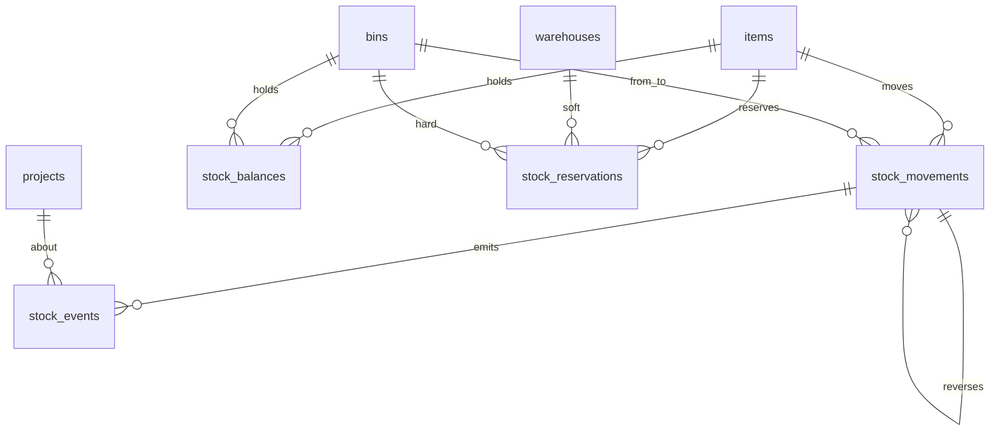

# Spesifikasi Modul — `stock` (Kartu Stok, Saldo, Reservasi, Kejadian)

**Versi:** 0.11
**Tanggal:** 25 September 2026
**Status:** terimplementasi (Fase 1) — modul keempat setelah [Warehouse](12-warehouse.md); v0.5: kunci periode otomatis dari sesi opname bulanan dan `reverse()` untuk dokumen pembalik ([21-opname-penyesuaian](21-opname-penyesuaian.md)); v0.6: `Stock\Support\RemovalOrder` — urutan alokasi FIFO/FEFO/sisa potongan/manual untuk PCK ([27-pendukung-f1](27-pendukung-f1.md), [A-185](04-keputusan-dan-asumsi.md#a-185)); v0.7: kolom `stock_movements.from_stock_status` — perubahan kondisi bisa dibangun ulang & dibalik dengan benar ([A-194](04-keputusan-dan-asumsi.md#a-194))
**Modul:** `stock`
**Fase:** F1
**Dokumen terkait:** [Blueprint §6.6](01-blueprint.md#66-stok) · [Aturan Bisnis](05-aturan-bisnis.md) · [Matriks kejadian stok](05-aturan-bisnis.md#14-matriks-kejadian-stok) · [Katalog Status](06-katalog-status-dan-enum.md) · [Glosarium](03-glosarium.md) · [Model data stok](08b-model-data-stok-dokumen.md#area-stok-ledger-saldo-reservasi-kejadian-tenant) · [Akuntansi §4](../akuntansi/01-lingkup-dan-integrasi-wms.md)
**Ketergantungan modul:** `master` (item, lot, serial, potongan, alasan) dan `warehouse` (bin). Seluruh modul dokumen sesudahnya — Request, Picking/Shipment, Receipt/Putaway, Return/Transfer, Issue, Conversion, Count/Adjustment — menulis stok **hanya** lewat modul ini.

---

## 1. Tujuan & lingkup

Modul ini memegang satu-satunya jalan stok boleh berubah. P-01 menetapkan stok hanya berubah lewat kartu stok yang tidak bisa diedit maupun dihapus, dan saldo adalah hasil agregasi yang bisa dibangun ulang dari kartu itu. Semua modul dokumen berikutnya memanggil modul ini; tidak ada satu pun yang menulis saldo sendiri.

Termasuk `[F1]`: kartu stok append-only; saldo per item × bin × lot/serial/potongan × kondisi yang dipelihara dalam satu transaksi database dengan penguncian baris ([NFR-13](01-blueprint.md#16-kebutuhan-non-fungsional)); reservasi lunak dan alokasi keras beserta aturan pelepasannya; outbox kejadian stok ([AD-05](08-arsitektur.md)); penguncian periode stok ([BR-STK-15](05-aturan-bisnis.md#br-stk)); pembalikan pergerakan; penomoran dokumen ([AD-13](08-arsitektur.md), [BR-GEN-06](05-aturan-bisnis.md#br-gen)) yang dipakai seluruh modul dokumen.

Tidak termasuk: dokumen apa pun (REQ, PCK, SJ, GRN, ADJ, dan seterusnya) — modul ini hanya menyediakan jalur posting yang mereka pakai; saran put-away ([BR-GRN-03](05-aturan-bisnis.md#br-grn)); sesi opname ([BR-OPN](05-aturan-bisnis.md#br-opn)); pengiriman kejadian ke Akuntansi dan Purchasing lewat HTTP (Fase 3 — Fase 1 cukup tabel outbox yang dibaca laporan).

## 2. Aktor & permission

Permission modul ini disimpan dengan `module = stock`.

| Role bawaan | Permission |
|---|---|
| Admin Company | semua permission modul ini |
| Manajemen | `stock.view`, `reservation.view`, `stock_event.view` |
| Kepala Gudang | `stock.view`, `reservation.view`, `reservation.release` |
| Staf Gudang | `stock.view`, `reservation.view` |
| Driver, Pemohon Internal, Penindak Lanjut PR | `stock.view` |
| Auditor Internal | `stock.view`, `reservation.view`, `stock_event.view` |
| Klien | tidak ada (portal memakai data proyeknya sendiri) |

Daftar: `stock.view`, `stock.lock_period`, `reservation.view`, `reservation.release`, `stock_event.view`.

**Tidak ada permission `stock.post`.** Memposting stok bukan tindakan user melainkan akibat dari dokumen; izinnya melekat pada aksi dokumen masing-masing (mis. `receipt.post`, `adjustment.post`). Modul ini memeriksa aturan stok, bukan siapa yang menekan tombol.

## 3. Entitas & data

Semua tabel di database **tenant**. Kolom umum (`id`, `created_at`, `updated_at`, `created_by`, `updated_by`) tidak diulang.

### 3.1 `stock_movements` — kartu stok

`item_id` FK · `from_bin_id` FK (null = masuk dari luar) · `to_bin_id` FK (null = keluar) · `lot_id`, `serial_id`, `piece_id` FK · `qty_base` decimal(18,4) **selalu positif**, arah ditentukan pasangan from/to · `stock_status` enum (kondisi yang berpindah) · `project_id` FK · `document_type` varchar(30), `document_id`, `document_line_id` · `reason_code_id` FK · `occurred_at` datetime UTC · `performed_by` FK · `reverses_movement_id` FK self.

> **Append-only.** Tidak ada `UPDATE` maupun `DELETE` (P-01, BR-STK-01). Koreksi dilakukan dengan baris pembalik yang menunjuk baris asal lewat `reverses_movement_id`.

Indeks: `(item_id, to_bin_id)`, `(item_id, from_bin_id)`, `(document_type, document_id)`, `occurred_at`.

### 3.2 `stock_balances` — saldo

`item_id`, `bin_id`, `lot_id`, `serial_id`, `piece_id` FK · `stock_status` enum · `qty_base` decimal(18,4) ≥ 0 · `piece_count` int (untuk item per potong) · `version` int.

`UK(item_id, bin_id, lot_id, serial_id, piece_id, stock_status)`. Dikunci `FOR UPDATE` saat mutasi, dengan urutan kunci tetap (item, bin, lot, serial, piece, status) untuk mencegah *deadlock* ([AD-04](08-arsitektur.md)).

### 3.3 `stock_reservations` — reservasi

`item_id` FK · `warehouse_id` FK (reservasi lunak) · `bin_id`, `lot_id`, `serial_id`, `piece_id` FK (alokasi keras) · `qty_base` decimal(18,4) · `level` enum `soft|hard` · `document_type`, `document_id`, `document_line_id` · `status` enum `active|consumed|released` · `released_reason` varchar(60) · `released_at` datetime.

Stok tersedia = Σ saldo `available` − Σ reservasi `active`, dihitung per item per gudang ([BR-STK-03](05-aturan-bisnis.md#br-stk)).

### 3.4 `stock_events` — outbox kejadian

`event_id` uuid UK · `schema_version` · `event_type` (dari [matriks §14](05-aturan-bisnis.md#14-matriks-kejadian-stok)) · `occurred_at`, `recorded_at` · `source_type`, `source_id` · `project_id` FK · `payload` json · `reverses_event_id` uuid · `published_at` (null = belum dikonsumsi) · `attempts` int · `last_error` text.

Ditulis dalam transaksi yang sama dengan kartu stok (pola outbox, [AD-05](08-arsitektur.md)), sehingga tidak ada kejadian yang hilang bila proses gagal di tengah.

### 3.5 `document_sequences` — nomor dokumen

`document_type` varchar(30) · `segment` varchar(20) (gudang atau `ALL`) · `period` varchar(7) (`YYYY-MM`) · `last_number` int. `UK(document_type, segment, period)`.

Dikunci `SELECT … FOR UPDATE` saat mengambil nomor berikutnya ([AD-13](08-arsitektur.md), [BR-GEN-06](05-aturan-bisnis.md#br-gen)). Dokumen luring memakai nomor sementara `TMP-<uuid>` yang diganti saat sinkron.

## 4. Mesin status

Kartu stok tidak punya status: barisnya lahir sudah final. Yang punya status adalah **reservasi**.

| Dari | Ke | Pemicu | Guard | Efek |
|---|---|---|---|---|
| — | `active` | REQ/TRF `approved` (lunak) atau PCK dibuat (keras) | Stok tersedia mencukupi | Stok tersedia berkurang |
| `active` | `consumed` | Baris terpenuhi menjadi pergerakan | Pergerakan tercatat lebih dulu | Reservasi berhenti mengurangi stok tersedia |
| `active` | `released` | Dokumen `rejected`, `cancelled`, `closed_short`; proyek `closed`/`cancelled`; PCK dibatalkan (keras saja) | Alasan `*` | Stok tersedia kembali |

[BR-STK-16](05-aturan-bisnis.md#br-stk): reservasi `active` tanpa PCK lebih dari `reservation_alert_days` (bawaan 7) masuk laporan Reservasi Menggantung. Pelepasannya tetap lewat aksi dokumen, tidak pernah otomatis.

## 5. Aturan bisnis yang berlaku

| BR | Catatan implementasi |
|---|---|
| P-01, [BR-STK-01](05-aturan-bisnis.md#br-stk) | Satu pintu tulis: `StockLedger::post()`. Model kartu stok menolak `update` dan `delete` di lapisan aplikasi |
| [BR-STK-02](05-aturan-bisnis.md#br-stk) | Lokasi = bin; kondisi = `available`, `quarantine`, `damaged`. Tidak ada status lokasi pada saldo |
| [BR-STK-03](05-aturan-bisnis.md#br-stk), [BR-STK-04](05-aturan-bisnis.md#br-stk) | Reservasi lunak per item per gudang; alokasi keras menunjuk bin, lot, serial, atau potongan |
| [BR-STK-05](05-aturan-bisnis.md#br-stk) | Pelepasan reservasi lewat satu aksi dengan alasan, dipanggil modul dokumen |
| [BR-STK-06](05-aturan-bisnis.md#br-stk) | Saldo tidak boleh negatif; ditolak dengan pesan yang menyebut bin dan jumlah yang kurang |
| [BR-STK-07](05-aturan-bisnis.md#br-stk), [BR-WH-06](05-aturan-bisnis.md#br-wh) | Kapasitas bin: peringatan atau blokir menurut kategori penyimpanan |
| [BR-STK-08](05-aturan-bisnis.md#br-stk) | Pergerakan aset wajib menyebut serial |
| [BR-STK-09](05-aturan-bisnis.md#br-stk) | Item per potong: saldo dilaporkan sebagai jumlah potongan **dan** total panjang |
| [BR-STK-13](05-aturan-bisnis.md#br-stk) | Saldo bin `in_transit` dihitung sebagai milik gudang asal |
| [BR-STK-14](05-aturan-bisnis.md#br-stk) | Bin `on_site` hanya menerima item beraset; barang habis pakai ditolak |
| [BR-STK-15](05-aturan-bisnis.md#br-stk) | Mutasi dengan `occurred_at` ≤ `stock_lock_date` ditolak, termasuk dokumen pembalik |
| [BR-GEN-04](05-aturan-bisnis.md#br-gen) | Gudang, bin, dan item dengan saldo atau reservasi bukan nol tidak bisa dinonaktifkan — penjagaan yang ditunda dua modul lalu akhirnya dipasang di sini |
| [BR-GEN-07](05-aturan-bisnis.md#br-gen) | `occurred_at` selalu UTC |
| [AD-04](08-arsitektur.md), [AD-05](08-arsitektur.md), [AD-13](08-arsitektur.md) | Ledger dan outbox satu transaksi; urutan kunci tetap; nomor dokumen dikunci baris |

Aturan baru modul ini (`BR-LED`, ditambahkan ke [05-aturan-bisnis](05-aturan-bisnis.md#br-led)):

- **BR-LED-01** Setiap pergerakan wajib punya asal, tujuan, atau keduanya. Baris tanpa keduanya ditolak.
- **BR-LED-02** `qty_base` selalu lebih besar dari nol; arah ditentukan pasangan asal dan tujuan, bukan tanda bilangan.
- **BR-LED-03** Pergerakan item berpelacakan wajib menyebut turunan yang sesuai: lot untuk `lot`, serial untuk `serial`, potongan untuk `piece`.
- **BR-LED-04** Satu serial hanya boleh berada di satu bin pada satu waktu; saldonya selalu satu atau nol.
- **BR-LED-05** Pembalikan menyalin pergerakan asal dengan asal dan tujuan ditukar, menunjuk barisnya lewat `reverses_movement_id`, dan hanya boleh sekali per baris.
- **BR-LED-06** Kejadian stok ditulis dalam transaksi yang sama dengan pergerakannya; kegagalan menulis kejadian membatalkan pergerakan.

## 6. Layar

| Route | Komponen | Isi |
|---|---|---|
| `/stock` | `stock.balance-list` | Saldo per item dengan pengelompokan gudang; kolom tersedia, dicadangkan, karantina, rusak; untuk item per potong ditambah jumlah potongan |
| `/stock/items/{item}` | `stock.stock-card` | Kartu stok satu item: saldo per bin dan riwayat pergerakan dengan penyaring gudang, bin, dan tanggal |
| `/stock/reservations` | `stock.reservation-list` | Reservasi aktif, lunak dan keras, dengan penanda menggantung dan tombol lepas beserta Alasan `*` |
| `/stock/events` | `stock.event-list` | Outbox kejadian: jenis, sumber, waktu, status terkirim, dan galat terakhir |
| `/settings/stock-period` | `stock.period-lock` | Tanggal kunci periode beserta riwayat pemajuannya |

## 7. Kejadian stok & integrasi

Seluruh baris [matriks §14](05-aturan-bisnis.md#14-matriks-kejadian-stok) diterbitkan dari modul ini. Fase 1 berhenti di tabel outbox yang dibaca laporan; adapter HTTP ke Akuntansi dan Purchasing menyusul di Fase 3 ([AD-05](08-arsitektur.md)). Payload tidak pernah memuat nilai uang ([D-07](04-keputusan-dan-asumsi.md#d-07)).

## 8. Notifikasi

| Kejadian | Penerima | Kanal | Keadaan |
|---|---|---|---|
| Reservasi menggantung melewati ambang | Kepala Gudang (pemegang `reservation.release` di gudangnya), pemohon | in-app, harian | `stock.reservation_stale`, satu entri per dokumen ([A-235](04-keputusan-dan-asumsi.md#a-235)) |
| Periode stok dikunci | Admin Company, seluruh Kepala Gudang (pemegang `warehouse.update`) | in-app | `stock.period_locked` |
| Kejadian outbox gagal terkirim berulang | Admin Company | in-app | belum — tanpa penerbit sampai adapter [F3] ([A-237](04-keputusan-dan-asumsi.md#a-237)) |

## 9. Laporan & dashboard

| Laporan | Filter | Kolom |
|---|---|---|
| Saldo stok | gudang, kategori, item, kondisi | item, gudang, bin, lot/serial/potongan, kondisi, jumlah, tersedia |
| Kartu stok | item, gudang, rentang tanggal | waktu, dokumen, asal, tujuan, jumlah, kondisi, pelaku |
| Reservasi menggantung | gudang, umur | dokumen, item, gudang, jumlah, umur hari |
| Stok di bawah titik pesan ulang | gudang, kategori | item, tersedia, titik pesan ulang, selisih |

## 10. Kasus uji (Given / When / Then)

| ID | Given | When | Then | BR |
|---|---|---|---|---|
| TC-STK-01 | Bin kosong | posting masuk 10 | saldo bin menjadi 10, satu baris kartu stok | BR-STK-01 |
| TC-STK-02 | Saldo 10 | posting keluar 4 | saldo menjadi 6 | BR-STK-01 |
| TC-STK-03 | Saldo 5 | posting keluar 6 | ditolak, saldo tetap 5 | BR-STK-06 |
| TC-STK-04 | Pergerakan tercatat | mencoba mengubah atau menghapus barisnya | ditolak | P-01 |
| TC-STK-05 | Pergerakan tanpa asal dan tujuan | posting | ditolak | BR-LED-01 |
| TC-STK-06 | Jumlah nol atau negatif | posting | ditolak | BR-LED-02 |
| TC-STK-07 | Item berlot tanpa menyebut lot | posting | ditolak | BR-LED-03 |
| TC-STK-08 | Serial sudah ada di bin A | posting masuk serial sama ke bin B | ditolak selama masih di A | BR-LED-04 |
| TC-STK-09 | Pergerakan tercatat | posting pembalik | saldo kembali, baris menunjuk asal | BR-LED-05 |
| TC-STK-10 | Pergerakan sudah dibalik | membalik lagi | ditolak | BR-LED-05 |
| TC-STK-11 | Posting apa pun | periksa outbox | satu kejadian tertulis dalam transaksi yang sama | BR-LED-06 |
| TC-STK-12 | Kejadian gagal ditulis | posting | pergerakan ikut dibatalkan | BR-LED-06 |
| TC-STK-13 | Tanggal kunci 30 Sep | posting dengan `occurred_at` 29 Sep | ditolak | BR-STK-15 |
| TC-STK-14 | Saldo tersedia 10, reservasi aktif 4 | hitung stok tersedia | 6 | BR-STK-03 |
| TC-STK-15 | Reservasi lunak dibuat | dikonsumsi pergerakan | status `consumed`, stok tersedia tidak berubah dua kali | BR-STK-05 |
| TC-STK-16 | Reservasi aktif | dilepas dengan alasan | status `released`, stok tersedia kembali | BR-STK-05 |
| TC-STK-17 | Reservasi melebihi stok tersedia | dibuat | ditolak | BR-STK-03 |
| TC-STK-18 | Bin berkategori blokir, kapasitas 50 | posting masuk 51 | ditolak | BR-WH-06 |
| TC-STK-19 | Bin berkategori peringatan, kapasitas 50 | posting masuk 51 | diterima, peringatan tercatat | BR-STK-07 |
| TC-STK-20 | Bin `on_site` | posting item habis pakai | ditolak | BR-STK-14 |
| TC-STK-21 | Gudang punya saldo bukan nol | nonaktifkan gudang | ditolak | BR-GEN-04 |
| TC-STK-22 | Item punya saldo bukan nol | nonaktifkan item | ditolak | BR-GEN-04 |
| TC-STK-23 | Nomor dokumen diambil dua kali bersamaan | ambil nomor | tidak ada nomor kembar | BR-GEN-06 |
| TC-STK-24 | Item per potong | lihat saldo | jumlah potongan dan total panjang keduanya tampil | BR-STK-09 |
| TC-STK-25 | Saldo dibangun ulang dari kartu stok | bandingkan dengan tabel saldo | sama persis | BR-STK-01 |
| TC-STK-26 | User tanpa `stock.view` | buka layar saldo | 403 | BR-GEN-09 |
| TC-STK-27 | Saldo 20, reservasi aktif 5 | buka layar saldo; cari dengan barcode item | kolom Tersedia menunjukkan 15, Dicadangkan 5; barcode cocok menampilkan item, barcode lain tidak | BR-STK-03, [A-201](04-keputusan-dan-asumsi.md#a-201) |
| TC-STK-28 | Item punya saldo dan pergerakan | buka kartu stok | saldo per bin dan riwayat tampil, baris pembalik ditandai | BR-STK-01 |
| TC-STK-29 | Item bersaldo di dua gudang | saring kartu stok per gudang | hanya bin gudang itu yang tampil | BR-ACC-05 |
| TC-STK-30 | Reservasi aktif | lepas dari layar tanpa alasan | ditolak; dengan alasan berhasil | BR-GEN-11 |
| TC-STK-31 | Staf Gudang tanpa `reservation.release` | tekan Lepas | 403; reservasi gudang lain tidak tampil | BR-GEN-09 |
| TC-STK-32 | Kejadian gagal terkirim | buka outbox | galat terakhir dan jumlah percobaan tampil | AD-05 |
| TC-STK-33 | Periode terkunci sampai kemarin | kunci mundur seminggu | ditolak dengan kode BR-STK-15; riwayat pemajuan tampil | BR-STK-15 |
| TC-STK-34 | Company demo baru | jalankan `DemoSeeder` dua kali | saldo empat item contoh terbentuk lewat kartu stok, tiap pergerakan punya kejadian outbox, jalankan ulang tidak menggandakan | P-01, BR-LED-06, A-72 |

## 11. Di luar lingkup modul ini

Seluruh dokumen (modul masing-masing); saran put-away; sesi opname; pengiriman kejadian lewat HTTP (Fase 3); rekonsiliasi saldo terjadwal; laporan akurasi opname.

## 12. Definisi selesai

- [x] Migrasi tenant, model, dan enum untuk seluruh tabel §3
- [x] `StockLedger` sebagai satu-satunya pintu tulis, dengan penguncian baris dan urutan kunci tetap
- [x] Reservasi lunak dan keras beserta aturan pelepasannya
- [x] Outbox kejadian dalam transaksi yang sama
- [x] Penguncian periode stok dan penomoran dokumen
- [x] Lima layar §6 dan menu "Stok"
- [x] Penjagaan [BR-GEN-04](05-aturan-bisnis.md#br-gen) dipasang di modul Master dan Warehouse
- [x] Semua TC-STK lulus; `php83 artisan test` hijau
- [x] Dokumen ini diperbarui bila implementasi menyimpang (versi naik + changelog README)

## 13. Catatan implementasi (24 September 2026)

Kelas di kode: `StockLedger` (satu-satunya pintu tulis saldo), `MovementRequest`, `StockGuard`, `DocumentNumber` di `Support/`; dua aksi domain `LockStockPeriod` (`stock.lock_period`) dan `ManageReservation` (buat, konsumsi, lepas reservasi; pelepasan manual memeriksa `reservation.release`, [A-71](04-keputusan-dan-asumsi.md#a-71)). Kolom turunan dan trigger di §13.1 juga berjalan di MariaDB 10.4 ([A-76](04-keputusan-dan-asumsi.md#a-76)). Stok awal company demo dimasukkan `StockDemoSeeder` lewat `StockLedger` ([A-72](04-keputusan-dan-asumsi.md#a-72)); uji TC-STK-34. `availableQty()` hanya menjumlah bin `storage` ([A-85](04-keputusan-dan-asumsi.md#a-85)).

### 13.1 Penyimpangan dari spesifikasi

1. **`stock_balances` memakai kolom turunan untuk kunci uniknya.** Kunci `item × bin × lot × serial ×
   potongan × kondisi` tidak bisa langsung dibuat unik karena tiga kolomnya boleh kosong, dan MySQL
   memperlakukan setiap NULL sebagai nilai berbeda sehingga baris kembar tetap lolos. Yang dipakai adalah
   tiga kolom turunan `lot_key`, `serial_key`, dan `piece_key` berisi `COALESCE(<kolom>, 0)`; kunci unik
   dibangun di atasnya. Tanpa ini BR-STK-01 hanya dijaga kode, bukan database.
2. **Larangan mengubah kartu stok ditegakkan dua lapis.** Selain `booted()` di model, ada trigger
   `BEFORE UPDATE` dan `BEFORE DELETE` di `stock_movements`. P-01 adalah jaminan terkuat modul ini dan
   tidak boleh bergantung pada satu lapisan yang bisa dilewati oleh query builder atau seeder.
3. **Penunjuk baris pembalik ikut saat INSERT.** Semula `reverses_movement_id` diisi setelah baris
   tersimpan; trigger di atas menolaknya. `MovementRequest::$reversesMovementId` dibuat khusus untuk itu
   dan hanya diisi oleh `StockLedger::reverse()`.
4. **Ambang reservasi menggantung disimpan sebagai pengaturan company** (`reservation_alert_days`,
   bawaan 7 hari) sesuai [A-59](04-keputusan-dan-asumsi.md#a-59), bukan ditanam di kode.
5. **Tombol Lepas reservasi manual** ada di layar meskipun BR-STK-05 dan BR-STK-16 menulis pelepasan
   hanya lewat aksi dokumen. Di Fase 1 modul dokumennya belum semuanya ada, sehingga reservasi
   menggantung akan mengunci stok selamanya. Dicatat sebagai [A-71](04-keputusan-dan-asumsi.md#a-71):
   katup darurat untuk pemegang `reservation.release`, selalu dengan Alasan dan tercatat di audit log.
6. **Riwayat kunci periode dibaca dari log aktivitas**, bukan tabel tersendiri. Pemajuan kunci sudah
   tercatat di sana lengkap dengan pelakunya; menyimpannya dua kali hanya menambah sumber kebenaran kedua.
7. **Kunci periode juga dimajukan sistem** (sejak modul Count/Adjustment): sesi opname **bulanan** yang
   `closed` memanggil `LockStockPeriod` dengan tanggal sehari sebelum sesi dimulai, hanya bila lebih maju
   dari kunci sekarang; pelakunya approver terakhir, tercatat di log dan `stock_counts.lock_date_set`
   ([BR-STK-15](05-aturan-bisnis.md#br-stk), [A-101](04-keputusan-dan-asumsi.md#a-101)).
8. **`StockLedger::reverse()` untuk dokumen pembalik.** Parameter opsional baru: jenis dan payload
   kejadian serta rujukan dokumen pembalik (jenis, id, baris, nomor). ADJ pembalik memakainya supaya
   pergerakan balik tercatat atas nama ADJ pembalik dan kejadiannya `stock_adjusted` ber-`reverses_event_id`
   (matriks §14); `emit()` kini mengisi kolom `stock_events.reverses_event_id` dari payload. Pemanggil
   lama tidak berubah ([A-102](04-keputusan-dan-asumsi.md#a-102)).

### 13.2 Keputusan implementasi

1. **Satu pintu tulis, tanpa perkecualian.** `StockLedger::post()` adalah satu-satunya jalan mengubah
   saldo (P-01, AD-04). Modul dokumen berikutnya memanggilnya, tidak pernah menyentuh `stock_balances`.
2. **Arah pergerakan ditentukan pasangan bin, bukan tanda bilangan** (BR-LED-02). Jumlah selalu positif;
   `from_bin_id` kosong berarti masuk, `to_bin_id` kosong berarti keluar.
3. **Urutan penguncian baris tetap** — bin asal lalu bin tujuan menurut id menaik — supaya dua transfer
   berlawanan arah tidak saling mengunci (NFR-13).
4. **Tidak ada permission `stock.post`.** Memposting stok adalah akibat dokumen; izinnya melekat pada
   aksi dokumen masing-masing. Modul ini memeriksa aturan stok, bukan siapa yang menekan tombol.
5. **Kolom Tersedia di layar saldo sudah dikurangi reservasi aktif**, dihitung sekali untuk seluruh
   halaman lewat satu query agregat, bukan per baris.
6. **Reservasi menggantung ditandai, tidak dilepas otomatis** (BR-STK-16). Janji yang dibuat sebuah
   dokumen hanya boleh dibatalkan orang, dan selalu dengan alasan.
7. **`StockGuard` menutup [BR-GEN-04](05-aturan-bisnis.md#br-gen)** yang tertunda sejak modul Warehouse:
   `DeactivateWarehouse`, `ChangeBinStatus::deactivate`, dan `DeactivateItem` kini menolak bila masih ada
   saldo atau reservasi aktif.

### 13.3 Layar yang sudah ada

| Layar | Route | Komponen Livewire | Isi |
|---|---|---|---|
| Saldo stok | `/stock` | `stock.balance-list` | Agregat per item × gudang; Tersedia, Dicadangkan, Karantina, Rusak, Potongan; saldo nol disembunyikan kecuali diminta |
| Kartu stok | `/stock/items/{item}` | `stock.stock-card` | Saldo per bin dan riwayat pergerakan; penyaring gudang, bin, dan rentang tanggal; baris pembalik ditandai |
| Reservasi | `/stock/reservations` | `stock.reservation-list` | Reservasi lunak dan keras, penanda menggantung, tombol Lepas dengan Alasan `*` |
| Kejadian stok | `/stock/events` | `stock.event-list` | Outbox baca saja; ringkasan belum terkirim, gagal berulang, total |
| Kunci periode | `/settings/stock-period` | `stock.period-lock` | Tanggal kunci dan riwayat pemajuannya dari log aktivitas |

Uji yang menopangnya ada di `tests/Feature/Stock`: `StockLedgerTest` (TC-STK-01–13, 25),
`ReservationTest` (TC-STK-14–17), `StockGuardTest` (TC-STK-18–24), dan `StockScreenTest`
(TC-STK-26–33).

### 13.4 Sisa pekerjaan modul ini

1. **Pengiriman kejadian lewat HTTP** ke Akuntansi dan Purchasing — Fase 3; Fase 1 berhenti di tabel outbox.
2. **Rekonsiliasi saldo terjadwal** memakai `StockLedger::rebuildFromLedger()` — menunggu keputusan jadwal.
3. ~~Laporan §9 beserta ekspor Excel~~ — **selesai 25 Sep 2026**: *Kartu stok*, *Reservasi menggantung*, *Stok di bawah titik pesan ulang* (dan *Saldo stok* sejak Pendukung F1) di [16-shared-laporan-berkas §3.2](16-shared-laporan-berkas.md#32-definisi-laporan-terdaftar-reportsdefinitions) ([A-232](04-keputusan-dan-asumsi.md#a-232)).
4. ~~Penutupan Gudang Site otomatis saat proyek ditutup~~ — **selesai** ([BR-PRJ-04](05-aturan-bisnis.md#br-prj)) lewat `ChangeProjectStatus` ([12-warehouse §13](12-warehouse.md), [A-187](04-keputusan-dan-asumsi.md#a-187)).
5. **Pemberitahuan §8** — reservasi menggantung dan periode dikunci selesai 25 Sep 2026 ([A-233](04-keputusan-dan-asumsi.md#a-233), [A-235](04-keputusan-dan-asumsi.md#a-235)); outbox gagal menunggu penerbit [F3] ([A-237](04-keputusan-dan-asumsi.md#a-237)).
