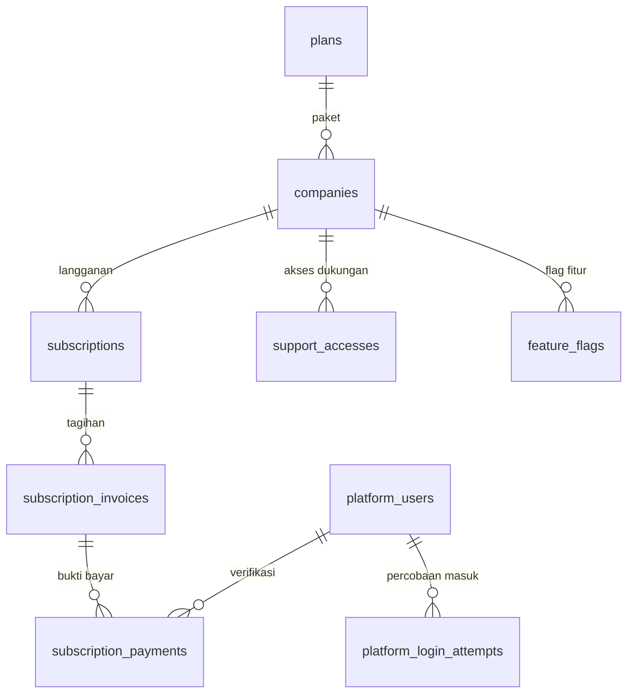

# Spesifikasi Modul — `platform` (Platform & Langganan)

**Versi:** 0.5
**Tanggal:** 25 September 2026
**Status:** selesai Fase 1 — v0.1 mencatat login Super Admin & gerbang langganan yang dibangun tanpa spesifikasi; v0.2 modul Platform penuh (modul kelima belas setelah [Purchase Request](26-purchase-request.md)): pembuatan company otomatis, paket & trial, tagihan & bukti bayar manual, siklus status terjadwal, penangguhan manual, flag fitur, masuk lewat akses dukungan, dan penyelesaian temuan §13.2 v0.1. Keputusan yang tidak tertulis di dokumen dicatat sebagai [A-176](04-keputusan-dan-asumsi.md#a-176)–[A-184](04-keputusan-dan-asumsi.md#a-184) (*Perlu validasi*); v0.3: ekspor PDF laporan (`reports.pdf`) ikut diizinkan saat langganan diakhiri ([27-pendukung-f1](27-pendukung-f1.md), [A-190](04-keputusan-dan-asumsi.md#a-190))
**Modul:** `platform` (`app/Domain/Platform`, `app/Http/Controllers/Platform`)
**Fase:** F1 (pembayaran manual); payment gateway `[F3]`; login SSO & pemilih company `[F3]`; WhatsApp `[F2]`
**Dokumen terkait:** [Blueprint §4.1](01-blueprint.md#41-level-platform-database-pusat) · [Blueprint §14](01-blueprint.md#14-platform--langganan) · [Aturan Bisnis §BR-SUB](05-aturan-bisnis.md#br-sub) · [Arsitektur §3](08-arsitektur.md#3-tenancy--siklus-request) · [Model data pusat](08a-model-data-inti.md#area-database-pusat-platform) · [Katalog Status §3](06-katalog-status-dan-enum.md#3-enum-lain) · [Proses bisnis alur 10](07b-proses-bisnis-pendukung.md#alur-10--siklus-langganan-company-platform) · [Akun uji §1](../00-akun-uji.md#1-platform-database-pusat)
**Ketergantungan modul:** `access` (guard `platform`, `CreateUser`/`InviteUser`, `GrantSupportAccess`, `LoginController` tenant), `shared` (`StoreUpload`), seeder acuan tenant (`TenantDatabaseSeeder`).

---

## 1. Tujuan & lingkup

Mengelola company sebagai pelanggan SaaS, dari dibuat sampai diakhiri ([alur 10](07b-proses-bisnis-pendukung.md#alur-10--siklus-langganan-company-platform)):

- **Super Admin** (domain pusat): membuat company (database, migrasi, data acuan, undangan Admin Company, trial), mengatur paket, memverifikasi bukti bayar, menangguhkan/mengaktifkan company, menyalakan flag fitur, membuka company lewat akses dukungan.
- **Sistem** (job harian): menerbitkan tagihan, memindah status langganan `trial/active → past_due → suspended → terminated` ([BR-SUB-01](05-aturan-bisnis.md#br-sub)).
- **Admin Company** (subdomain company): melihat tagihan dan mengunggah bukti transfer; memberi/mencabut akses dukungan (sudah ada di modul Access).
- **Gerbang akses** setiap request tenant menurut status langganan dan status company.

Nilai uang di modul ini (harga paket, nominal tagihan) adalah **harga langganan platform di database pusat**, bukan nilai barang WMS; larangan [D-07](04-keputusan-dan-asumsi.md#d-07) untuk data tenant tetap berlaku.

Tidak termasuk: payment gateway `[F3]`; pengingat email/WA tagihan (menunggu modul notifikasi); wizard setup awal & persetujuan kebijakan privasi (NFR-11, O-11 — Pendukung F1); penghapusan database setelah `purge_after` ([A-179](04-keputusan-dan-asumsi.md#a-179)); SSO `[F3]`.

## 2. Aktor & permission

| Aktor | Guard | Hak |
|---|---|---|
| Super Admin | `platform` (tabel pusat `platform_users`) | semua layar §6.1; tanpa permission `<modul>.<aksi>` |
| Admin Company | `web` (tenant) | `billing.view`, `billing.pay` (lewat `*`), `support_access.grant/revoke` |
| User company lain | `web` | dibatasi gerbang §5.1; tidak melihat tagihan |
| Sistem | — | `subscriptions:cycle` harian 00:30 |

Permission tenant baru modul `billing` (2) hanya dipegang Admin Company ([A-178](04-keputusan-dan-asumsi.md#a-178)). Super Admin **tidak** bisa membuka data operasional company kecuali lewat akses dukungan yang sedang berlaku ([BR-SUB-04](05-aturan-bisnis.md#br-sub), [A-180](04-keputusan-dan-asumsi.md#a-180)).

## 3. Entitas & data

Semua di koneksi `central`. Migrasi `database/migrations/central/2026_01_01_000010_create_platform_tables.php` (ERD) dan `…000020_extend_platform_tables.php` (kolom & tabel di luar ERD, [A-184](04-keputusan-dan-asumsi.md#a-184)). Tidak ada tabel tenant baru.

| Model | Tabel | Catatan |
|---|---|---|
| `Company` | `companies` | turunan stancl `BaseTenant`; atribut JSON `data`: `admin_name`, `admin_email`, `provisioning_error`, `provisioned_at`, `status_reason` |
| `Plan` | `plans` | `monthly_price`, **`trial_days`** (bawaan 14, [A-11](04-keputusan-dan-asumsi.md#a-11)), kuota WA & berkas, `is_active` |
| `Subscription` | `subscriptions` | `periodEnd()` = akhir periode berbayar, atau akhir trial bila belum pernah dibayar |
| `SubscriptionInvoice` | `subscription_invoices` | nomor `INV/<yymm>/<urut>`, periode, nominal, jatuh tempo, status, **`paid_at`** |
| `SubscriptionPayment` | `subscription_payments` | bukti di disk company pengunggah; **`uploaded_by_name`, `notes`, `reject_reason`** |
| `PlatformUser` | `platform_users` | **`failed_login_count`, `locked_until`** |
| `PlatformLoginAttempt` | `platform_login_attempts` (baru) | email, user, `login_result`, IP, waktu |
| `PlatformAuditLog` | `audit_logs` (pusat, baru) | skema spatie/activitylog sama dengan tenant; `log_name = platform` |
| `SupportAccess`, `FeatureFlag` | ERD | tanpa perubahan |

Enum: `CompanyStatus`, `SubscriptionStatus` (v0.1); **`InvoiceStatus`** (`open` Belum Dibayar · `paid` Lunas · `overdue` Lewat Jatuh Tempo · `void` Dibatalkan) dan **`PaymentStatus`** (`pending` Menunggu Verifikasi · `verified` Terverifikasi · `rejected` Ditolak) — nilai dari ERD 08a, didaftarkan di [Katalog §3](06-katalog-status-dan-enum.md#3-enum-lain) v0.17. Tanpa status baru.



## 4. Mesin status

```yaml
company_status:           # companies.status
  - {from: null, to: provisioning, action: platform.create_company}
  - {from: provisioning, to: active, action: system, when: database+acuan+admin_ok}    # ProvisionCompany (ulang bila gagal)
  - {from: active, to: suspended, action: super_admin, guard: alasan}                  # A-179, manual
  - {from: suspended, to: active, action: super_admin}
  - {from: [active, suspended], to: terminated, action: system, when: subscription_terminated}
subscription_status:      # BR-SUB-01, A-12, A-177
  - {from: null, to: trial, action: platform.create_company, effect: trial_ends_at = +trial_days}
  - {from: [trial, active], to: past_due, action: system, when: tagihan_open_lewat_jatuh_tempo, effect: grace_ends_at = jatuh_tempo + 7 hari}
  - {from: past_due, to: suspended, action: system, when: tenggang_habis}
  - {from: suspended, to: terminated, action: system, when: 30_hari_ditangguhkan, effect: purge_after = +90 hari}
  - {from: [trial, active, past_due, suspended], to: active, action: verifikasi_bukti_bayar}
invoice_status:
  - {from: null, to: open, action: system, when: H-7 akhir masa berjalan}
  - {from: open, to: overdue, action: system, when: lewat jatuh tempo}
  - {from: [open, overdue], to: paid, action: verifikasi_bukti_bayar}
payment_status:
  - {from: null, to: pending, action: billing.pay, guard: satu_bukti_menunggu_per_tagihan}
  - {from: pending, to: [verified, rejected], action: super_admin, guard: alasan_bila_tolak}
```

| Transisi | Implementasi | Efek |
|---|---|---|
| buat company | `Actions\CreateCompany` → `Company::save()` (TenantCreated: buat DB + migrasi) → `Actions\ProvisionCompany` | `TenantDatabaseSeeder`, Admin Company + undangan (`CreateUser`), status `active`; gagal → `provisioning_error`, tombol *Lanjutkan provisioning* |
| tagihan & status | `Support\SubscriptionLifecycle` via `subscriptions:cycle` | lihat A-177; jejak di `audit_logs` pusat |
| bukti bayar | `Actions\SubmitSubscriptionPayment` (`billing.pay`) | berkas foto ≤ 5 MB di disk company |
| verifikasi / tolak | `Actions\VerifySubscriptionPayment` | lunas → langganan `active` sampai akhir periode tagihan; tenggang & penangguhan dihapus |
| tangguh / aktifkan | `Actions\ChangeCompanyStatus` | efek hanya-baca seperti `suspended` |
| flag fitur | `Actions\SetFeatureFlag` | kunci `whatsapp`, `offline_sync`, `rfid` (stub) |
| akses dukungan | `Actions\EnterSupportAccess` → `Access\Actions\StartSupportSession` | sesi hanya-baca atas nama Admin pemberi izin |
| paket | `Actions\SavePlan` | tanpa hapus (P-03) |

## 5. Aturan bisnis yang berlaku

### 5.1 Gerbang akses — `app/Http/Middleware/EnsureSubscriptionState.php`

Dipasang pada grup route tenant dan endpoint Livewire (v0.1). Status efektif = status langganan terbaru, diperberat status company ([A-179](04-keputusan-dan-asumsi.md#a-179)).

| Keadaan | Perilaku | BR |
|---|---|---|
| company `provisioning` | 503 "Company sedang disiapkan" | A-176 |
| `trial`, `active` | normal | BR-SUB-01 |
| `past_due` | normal + spanduk kuning dengan tautan *Buka tagihan* | BR-SUB-01 |
| `suspended` (langganan atau company ditangguhkan manual) | hanya metode aman + update Livewire cari/filter/halaman ([A-196](04-keputusan-dan-asumsi.md#a-196)); kecuali `billing.payment.store`. Spanduk merah | [BR-SUB-02](05-aturan-bisnis.md#br-sub) |
| `terminated` | hanya Admin Company, hanya GET ke *Beranda*, *Laporan* (termasuk ekspor), *Tagihan langganan*, *Profil* (+ update Livewire hanya-baca, A-196); lainnya 403 | [BR-SUB-03](05-aturan-bisnis.md#br-sub), [A-181](04-keputusan-dan-asumsi.md#a-181) |
| sesi akses dukungan | hanya metode aman + update Livewire hanya-baca (kecuali keluar); izin berakhir/dicabut → keluar paksa + 403; spanduk biru | [BR-SUB-04](05-aturan-bisnis.md#br-sub), [A-180](04-keputusan-dan-asumsi.md#a-180) |

Route autentikasi tenant (termasuk `support.enter*`) selalu lolos.

### 5.2 Aturan lain

| Rujukan | Ditegakkan |
|---|---|
| [BR-SUB-01](05-aturan-bisnis.md#br-sub), [A-12](04-keputusan-dan-asumsi.md#a-12) | `SubscriptionLifecycle`: tagihan H-7, tenggang 7 hari, hanya-baca 30 hari, simpan 90 hari |
| [A-195](04-keputusan-dan-asumsi.md#a-195) | verifikasi tagihan yang periodenya sudah lewat memulai periode satu bulan dari hari verifikasi; tagihan yang terbit setelah akhir periode lewat jatuh tempo +7 hari |
| [A-11](04-keputusan-dan-asumsi.md#a-11) | trial bawaan per paket (14 hari), bisa diubah per company saat dibuat (0–90) |
| [BR-SUB-04](05-aturan-bisnis.md#br-sub), [A-27](04-keputusan-dan-asumsi.md#a-27) | tautan bertanda tangan 5 menit, **sekali pakai** (nonce; tautan baru menggugurkan yang lama, [A-199](04-keputusan-dan-asumsi.md#a-199)), hanya bila ada izin berlaku milik Super Admin itu; tercatat di audit log tenant & pusat |
| [BR-SUB-06](05-aturan-bisnis.md#br-sub) | akun Super Admin terpisah; Admin Company dibuat di database company |
| NFR-04, [A-182](04-keputusan-dan-asumsi.md#a-182) | login Super Admin: rate limit + kunci setelah N gagal (config `access.login`), `platform_login_attempts` |
| NFR-04, [A-200](04-keputusan-dan-asumsi.md#a-200) | 2FA Super Admin opsional (TOTP + kode pemulihan) lewat *Keamanan akun*; masuk → `/admin/two-factor` bila aktif; migrasi pusat `000040` (`platform_users.two_factor_recovery_codes`, `two_factor_confirmed_at`) dan `000050` (`two_factor_last_step`, [A-205](04-keputusan-dan-asumsi.md#a-205)); kode salah ikut hitungan kunci akun |
| NFR-03 | tindakan Super Admin dan sistem di `audit_logs` pusat |
| P-03, [A-179](04-keputusan-dan-asumsi.md#a-179) | `TenantDeleted` tidak lagi menghapus database; paket & company tidak dihapus |
| [BR-GEN-11](05-aturan-bisnis.md#br-gen) | alasan wajib saat tolak bukti bayar & tangguhkan company |

## 6. Layar

### 6.1 Super Admin — domain pusat (`routes/web.php`, `layouts.platform`)

| Route | Controller | Isi |
|---|---|---|
| `GET/POST /admin/login`, `POST /admin/logout` | `PlatformLoginController` | v0.1 + penguncian (A-182) |
| `GET /admin` | `PlatformDashboardController` | cari company; paket, status company & langganan, masa berjalan, penanda *gagal disiapkan* / *siap dihapus*; jumlah bukti bayar menunggu |
| `GET /admin/companies/create`, `POST /admin/companies` | `CompanyController@create/store` | kode `*`, nama `*`, subdomain `*`, paket `*`, durasi trial, zona waktu `*`, nama & email Admin Company `*` |
| `GET /admin/companies/{id}` | `CompanyController@show` | ringkasan langganan, tagihan & bukti bayar, riwayat, tangguhkan/aktifkan, flag fitur, akses dukungan + *Buka company (hanya-baca)* |
| `POST /admin/companies/{id}/provision · suspend · reactivate · flags · support` | `CompanyController` | tindakan §4 |
| `GET /admin/payments`, `POST …/{id}/verify · reject`, `GET …/{id}/proof` | `PaymentController` | daftar bukti (saring status), verifikasi, tolak dengan alasan, lihat bukti dari disk company |
| `GET /admin/plans`, `…/create`, `…/{id}/edit`, `POST /admin/plans`, `POST /admin/plans/{id}` | `PlanController` | paket |

### 6.2 Company — subdomain (`routes/tenant.php`)

| Route | Izin | Isi |
|---|---|---|
| `GET /billing` (`billing.index`) | `billing.view` | status, paket, masa berjalan, tenggang; daftar tagihan + bukti; form *Kirim bukti* per tagihan yang menunggu |
| `POST /billing/invoices/{id}/payments` (`billing.payment.store`) | `billing.pay` | jumlah `*`, tanggal transfer `*`, foto bukti `*`, keterangan |
| `GET /billing/payments/{id}/proof` | `billing.view` | bukti milik company sendiri |
| `GET/POST /support/enter/{id}` (`support.enter*`, bertanda tangan) | — | konfirmasi lalu buka sesi dukungan |

Menu **Administrasi → Tagihan langganan**; palet Ctrl+K.

## 7. Kejadian stok & integrasi

Tidak ada kejadian stok. `subscriptions:cycle` (harian 00:30, `routes/console.php`) berjalan di database pusat saja.

## 8. Notifikasi

| Kejadian | Penerima | Keadaan |
|---|---|---|
| Undangan Admin Company pertama | Admin Company | email (`UserInvitationNotification`) |
| Tagihan terbit, jatuh tempo, ditangguhkan | pemegang `billing.view` (Admin Company) | lonceng + email `subscription.billing` dari `Support\BillingNotifier` lewat `subscriptions:cycle` ([A-202](04-keputusan-dan-asumsi.md#a-202)); spanduk & layar tagihan tetap |
| Bukti bayar menunggu | Super Admin | belum — penghitung di beranda |

## 9. Laporan & dashboard

Beranda Super Admin (§6.1). Laporan platform lain belum ada.

## 10. Kasus uji

Uji di `tests/Feature/Platform` (17 uji).

| ID | Given | When | Then | Rujukan |
|---|---|---|---|---|
| TC-PLT-01 / 01b / 01c | seeder | v0.1 | tetap | — |
| TC-PLT-02 / 02b / 02c | login Super Admin | v0.1 | tetap | — |
| TC-PLT-03 | Super Admin, paket trial 10 hari | buat company: subdomain `admin`, kode `TEST`; lalu `prv` | galat subdomain & kode; company `PRV` `active`, DB `…prv`, trial 10 hari, 10 role bawaan, Admin Company tanpa password + 1 undangan, jejak audit; provisioning ulang ditolak | A-176 |
| TC-PLT-04 | periode berakhir 5 hari lagi, paket Rp 500.000 | siklus hari ini (2×), +6, +13, +40, +44 hari | 1 tagihan `INV/yymm/0001` jatuh tempo = akhir periode, Admin Company diberi tahu (lonceng + email, A-202); `past_due` tenggang +12 + pemberitahuan; `suspended`; belum; `terminated`, `purge_after` +134, company diakhiri | BR-SUB-01, A-177 |
| TC-PLT-05 | tagihan terbit | unggah tanpa bukti / 0 / tanggal depan; unggah; ulang; tolak tanpa/dengan alasan; `suspended` lalu unggah ulang; verifikasi; verifikasi lagi | galat ×3; `pending`, bukti terbuka; ditolak (satu menunggu); galat lalu `rejected`, tagihan tetap `open`; unggah boleh; `active` sampai akhir periode, `paid`; galat | A-178, BR-SUB-02 |
| TC-PLT-06 | — | staf/Admin buka tagihan; company ditangguhkan manual; langganan diakhiri; company `provisioning` | 403/200 + menu; baca 200 + spanduk, tulis 403; Admin: laporan & tagihan 200, item 403, staf 403; 503 | A-179, A-181 |
| TC-PLT-07 | langganan diakhiri | unggah bukti; verifikasi bukti lama | 403; galat BR-SUB-03 | BR-SUB-03 |
| TC-PLT-08 | batas 3 gagal | 3 password salah, lalu benar; kunci habis | terkunci, tetap ditolak, 2 catatan `locked`; masuk, hitungan 0, catatan `success` | A-182 |
| TC-PLT-09 | — | tamu buka paket; paket tanpa nama; paket `Pro`; ubah tanpa centang aktif | redirect; galat; kode `pro` trial 30; harga 800.000, nonaktif, tidak ditawarkan saat buat company | P-03 |
| TC-PLT-10 | company aktif | tangguhkan tanpa/dengan alasan; staf menulis; aktifkan (2×); flag whatsapp nyala/mati, kunci asing | galat; `suspended` + alasan; 403; `active`, galat; flag berubah, galat | A-179, A-183 |
| TC-PLT-11 | Admin Company | minta tautan tanpa izin; beri izin; Super Admin lain; tautan; tanda tangan rusak; konfirmasi; masuk; baca; tulis; cabut | galat; galat; tautan ke subdomain; 403; 200; masuk sebagai Admin pemberi; tautan dipakai ulang 403; spanduk; 403; sesi gugur 403 | BR-SUB-04, A-180, A-199 |
| TC-PLT-13 | Super Admin tanpa 2FA | buka Keamanan akun; mulai; konfirmasi salah/benar; masuk ulang; kode salah; kode pemulihan | lencana *2FA mati*; galat; kode pemulihan tampil, jejak audit; diarahkan ke `/admin/two-factor`, belum masuk; galat; masuk, sisa kode berkurang satu | A-200 |
| TC-PLT-12 | langganan `suspended`, tagihan periode lampau `overdue` | verifikasi bukti; siklus harian | `active`, periode mulai hari ini s.d. +1 bulan; tidak `past_due` | A-195 |

Uji lain yang berubah: TC-ACC-27b (2 permission `billing`); TC-ACC-28g (update Livewire hanya-baca lolos saat `suspended`, aksi 403 — A-196).

## 11. Di luar lingkup modul ini

Payment gateway `[F3]`; SSO & pemilih company `[F3]`; pengingat tagihan (notifikasi); penghapusan database setelah masa simpan; wizard setup awal & kebijakan privasi (Pendukung F1); penagihan kuota WA (O-04).

## 12. Definisi selesai

- [x] Route login/beranda/logout Super Admin; seeder pusat (v0.1)
- [x] `CreateCompany` + provisioning otomatis (DB, migrasi, data acuan, Admin Company + undangan), dapat dilanjutkan bila gagal
- [x] Paket & trial; tagihan, unggah & verifikasi bukti bayar; siklus status terjadwal
- [x] Penangguhan manual, flag fitur, akses dukungan hanya-baca
- [x] Temuan §13.2 v0.1 diselesaikan (lihat §13.1)
- [x] TC-PLT-01 s.d. TC-PLT-13 lulus; `php artisan test` hijau
- [x] Dokumen diperbarui (versi naik + changelog README)

## 13. Catatan implementasi (25 September 2026)

Domain `app/Domain/Platform`: 9 aksi (`CreateCompany`, `ProvisionCompany`, `SavePlan`, `SubmitSubscriptionPayment`, `VerifySubscriptionPayment`, `ChangeCompanyStatus`, `SetFeatureFlag`, `EnterSupportAccess` + `Access\Actions\StartSupportSession`), `Support\SubscriptionLifecycle`, `InvoiceNumber`, `PlatformAudit`, `Console\RunSubscriptionCycleCommand`; controller `Platform\{PlatformDashboard, Company, Payment, Plan, Billing, SupportSession}Controller`; provider `PlatformServiceProvider`. Layar pusat memakai controller + Blade (tanpa Livewire; endpoint Livewire hanya untuk tenant).

### 13.1 Temuan v0.1 yang diselesaikan

| Temuan v0.1 §13.2 | Penyelesaian |
|---|---|
| 1. Company baru tanpa data acuan; docblock `ProductionSeeder` salah | `ProvisionCompany` menjalankan `TenantDatabaseSeeder`; docblock dikoreksi |
| 2. `terminated` membuka semua GET | hanya layar ekspor, tagihan, profil, beranda (A-181) |
| 3. `suspended` memblokir aksi Livewire hanya-baca | v0.4: update properti & pindah halaman diloloskan, aksi lain tetap 403 (A-196) |
| 4. `companies.status` tidak diperiksa | status efektif memperhitungkan status company; `provisioning` 503 (A-179) |
| 5. Route `billing.payment.store` belum ada | ada (§6.2) |
| 6. Login Super Admin tanpa penguncian & catatan | penguncian + `platform_login_attempts` + audit (A-182); v0.4: 2FA Super Admin opsional (A-200) |
| 7. `TenantDeleted` menghapus database | pendengar dikosongkan (A-179) |

### 13.2 Keputusan implementasi

1. **Provisioning sinkron** di request Super Admin (antrean `sync` Fase 1); langkah idempoten sehingga *Lanjutkan provisioning* aman diulang.
2. **Bukti bayar disimpan di disk company**, dibaca Super Admin lewat konteks tenant sementara; database pusat hanya menyimpan path.
3. **Sesi dukungan memakai akun Admin pemberi izin** dalam mode hanya-baca, bukan akun bayangan baru di database company (A-180).
4. **`audit_logs` pusat** memakai skema yang sama dengan tenant; model `PlatformAuditLog` dipatok ke koneksi `central`.

### 13.3 Sisa pekerjaan

1. Pengingat tagihan WA dan notifikasi bukti bayar ke Super Admin (email tagihan ke company sudah, A-202).
2. Mewajibkan 2FA bagi Super Admin bila A-200 diubah.
3. Penghapusan database setelah `purge_after` sebagai tindakan terpisah yang tercatat.
4. ~~Wizard setup awal & persetujuan kebijakan privasi~~ — **selesai** ([27-pendukung-f1](27-pendukung-f1.md), [A-191](04-keputusan-dan-asumsi.md#a-191)); naskah final ketentuan tetap menunggu [O-11](04-keputusan-dan-asumsi.md#o-11).
