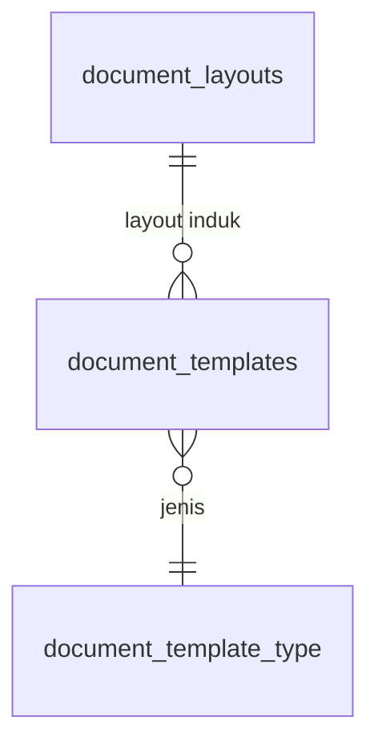

# Spesifikasi Modul — `template` (Template Dokumen & Label)

**Versi:** 0.2
**Tanggal:** 24 September 2026
**Status:** selesai Fase 1, dibangun paralel dengan modul Retur/Transfer di branch `feat/template-label`. Keputusan yang tidak tertulis di dokumen lain dicatat sebagai [A-120](04-keputusan-dan-asumsi.md#a-120)–[A-126](04-keputusan-dan-asumsi.md#a-126) (*Perlu validasi*). v0.2: dokumen ISU (Bukti Pemakaian Material) dari modul Issue ([23-pemakaian](23-pemakaian.md), [A-152](04-keputusan-dan-asumsi.md#a-152)).
**Modul:** `template`
**Fase:** F1: template bawaan dan layout induk per company, cetak PDF dokumen, label barcode/QR untuk bin, item, lot, dan potongan. Editor template penuh `[F2]`.
**Dokumen terkait:** [Blueprint §6.10, §12, §18](01-blueprint.md#12-template-dokumen) · [D-07](04-keputusan-dan-asumsi.md#d-07), [D-14](04-keputusan-dan-asumsi.md#d-14), [D-25](04-keputusan-dan-asumsi.md#d-25) · [AD-08](08-arsitektur.md) · [Model data 08c](08c-model-data-pendukung.md) (`document_layouts`, `document_templates`) · [BR-WH-01](05-aturan-bisnis.md#br-wh) · [O-09](04-keputusan-dan-asumsi.md#o-09), [O-13](04-keputusan-dan-asumsi.md#o-13)
**Ketergantungan modul:** `access` (permission, tanda tangan profil), `master` (item, lot, potongan), `warehouse` (bin), `shipment` (SJ, PCK, bukti terima, DSC), `receipt` (RTV), `adjustment` (ADJ), `count` (laporan OPN), `shared` (`StoreUpload`).

---

## 1. Tujuan & lingkup

Dokumen fisik tetap dibutuhkan di gudang dan di lapangan. Surat jalan ikut dibawa driver, picklist dipegang picker, berita acara ditandatangani, dan setiap bin serta barang butuh label yang bisa dipindai. Modul ini mencetak dokumen-dokumen itu sebagai PDF (Blade → HTML → dompdf, AD-08) dengan **layout induk per company**: logo, kop, warna aksen, footer, blok tanda tangan, dan QR dokumen. Modul ini juga mencetak **label** Code128 + QR untuk bin, item, lot, dan potongan.

Semua cetakan **tanpa harga atau nilai uang** (D-07).

Tidak termasuk:
- editor template penuh dengan variabel `{nomor_dokumen}` dan sejenisnya `[F2]`
- verifikasi QR publik tanpa login `[F2]`
- label aset/serial dan BA Serah Terima Aset (menunggu modul Aset)
- BA Waste (menunggu modul Konversi/Waste)
- dokumen modul yang belum dibangun: TRF, RET, PRQ (ISU ditambah v0.2)
- pencetakan langsung ke printer thermal lewat driver; F1 menghasilkan PDF berukuran label

## 2. Aktor & permission

Permission disimpan dengan `module = template` ([A-124](04-keputusan-dan-asumsi.md#a-124)).

| Permission | Arti | Role bawaan |
|---|---|---|
| `document_layout.manage` | Mengubah layout induk dan kertas per template | Admin Company |
| `label.print` | Mencetak label bin/item/lot/potongan | Admin Company, Kepala Gudang, Staf Gudang |

**Cetak dokumen tidak punya permission sendiri.** Siapa pun yang boleh melihat dokumen (`view` di policy dokumen asal, beserta cakupan gudangnya, BR-ACC-05) boleh mencetaknya, karena mencetak tidak mengubah data ([A-124](04-keputusan-dan-asumsi.md#a-124)). Label juga butuh izin lihat datanya: `bin.view` untuk label bin, `item.view` untuk label item, lot, dan potongan.

## 3. Entitas & data

Migrasi: `database/migrations/tenant/2026_01_01_000200_create_document_template_tables.php`, mengikuti [ERD 08c](08c-model-data-pendukung.md). Kolom di luar ERD tercatat di [A-123](04-keputusan-dan-asumsi.md#a-123). Model: `Template\Models\DocumentLayout`, `DocumentTemplate`.

### 3.1 `document_layouts` — Layout Induk

| Kolom | Tipe | Null | Keterangan |
|---|---|---|---|
| `id` | bigint | — | PK |
| `name` | varchar(80) | — | "Standar" |
| `logo_attachment_id` | bigint | ✔ | disiapkan untuk tabel lampiran; F1 kosong, tanpa FK |
| `logo_path` | varchar(255) | ✔ | *di luar ERD*: berkas logo di disk tenant (PNG/JPEG, maks 5 MB, NFR-14) |
| `header_html` | text | ✔ | F1: **teks biasa** (alamat, telepon), di-escape saat dicetak ([A-122](04-keputusan-dan-asumsi.md#a-122)) |
| `footer_html` | text | ✔ | F1: teks biasa |
| `colors` | json | ✔ | `{"accent": "#1f4e79"}` |
| `signature_blocks` | json | ✔ | `{jenis_dokumen: ["Dibuat oleh", …]}`; kosong = bawaan §5.2 |
| `is_default` | bool | — | F1 satu layout per company |
| `created_at`, `updated_at` | datetime | ✔ | |

### 3.2 `document_templates` — Template Dokumen

| Kolom | Tipe | Null | Keterangan |
|---|---|---|---|
| `id` | bigint | — | PK |
| `document_type` | varchar(30) | — | enum `document_template_type` ([Katalog §3](06-katalog-status-dan-enum.md#3-enum-lain)) |
| `name` | varchar(80) | — | "Bawaan" |
| `layout_id` | bigint | ✔ | FK `document_layouts` |
| `body_html` | text | ✔ | F1 kosong = template Blade bawaan; diisi editor `[F2]` |
| `paper` | varchar(20) | — | enum `paper_size`; lebar kolom diperbesar dari varchar(10) ([A-123](04-keputusan-dan-asumsi.md#a-123)) |
| `is_default` | bool | — | satu bawaan per jenis |
| `version` | int | — | 1 |

UK(`document_type`, `name`, `version`). Baris bawaan dibuat `TemplateReferenceSeeder` (provisioning) dan dibuat otomatis saat pertama dibutuhkan bila belum ada.

## 4. Mesin status

Tidak ada. Layout dan template tidak berstatus; label dan PDF tidak disimpan. Mencetak tidak mengubah status dokumen asal. Karena itu route cetak memakai GET (bukan transisi, P-04).

| Aksi | Implementasi | Efek samping |
|---|---|---|
| Simpan layout | `Template\Actions\SaveDocumentLayout::handle` | log `template` (BR-GEN-05) |
| Unggah / hapus logo | `SaveDocumentLayout::storeLogo` / `removeLogo` | berkas lama dibuang (`StoreUpload`) |
| Cetak dokumen | `Template\Support\DocumentPrinter` lewat `PrintController@document` | — |
| Cetak label | `Template\Actions\PrintLabels` lewat `PrintController@labels` | — |

## 5. Aturan bisnis yang berlaku

| Aturan | Ditegakkan di mana |
|---|---|
| [D-07](04-keputusan-dan-asumsi.md#d-07) | Template tidak memuat kolom harga/nilai; uji memastikan tidak ada kata "harga", "Rp", atau "total" di PDF |
| [BR-WH-01](05-aturan-bisnis.md#br-wh) | Label bin mencetak `bins.code` yang tidak bisa diubah |
| [BR-ACC-05](05-aturan-bisnis.md#br-acc), [BR-GEN-09](05-aturan-bisnis.md#br-gen) | Cetak dokumen memakai policy `view` dokumen asal, jadi di luar cakupan = 403 |
| [BR-GEN-10](05-aturan-bisnis.md#br-gen) | Template AST/WST dan editor `[F2]` berupa stub yang menjawab "belum tersedia" |
| [BR-GEN-05](05-aturan-bisnis.md#br-gen) | Perubahan layout dicatat di log aktivitas `template` |
| NFR-14 | Logo ≤ 5 MB, PNG/JPEG, tipe dibaca dari isi berkas |

### 5.1 Dokumen bawaan F1

| `document_type` | Dokumen | Isi baris | Kertas bawaan |
|---|---|---|---|
| `shipment` | Surat Jalan (SJ) | item, jumlah, satuan, lot/serial/potongan, asal PCK/REQ | A4 |
| `proof_of_delivery` | Bukti Terima | per baris baik/rusak/kurang, penerima, waktu, kanal | A4 |
| `pick_task` | Picklist (PCK) | urut bin, item, jumlah dialokasikan, kolom centang | A4 |
| `delivery_discrepancy` | BA Selisih Pengiriman (DSC) | baris kurang/rusak, disposisi | A4 |
| `vendor_return` | Surat Retur ke Vendor (RTV) | item, jumlah, alasan QC ([A-80](04-keputusan-dan-asumsi.md#a-80)) | A4 |
| `stock_adjustment` | BA Penyesuaian (ADJ) | bin, item, ±jumlah, alasan | A4 |
| `material_issue` | Bukti Pemakaian Material (ISU, v0.2) | bin, item, lot/serial/potongan, jumlah (negatif pada pembalik), keperluan; proyek & Gudang Site di kepala | A4 |
| `stock_count` | Laporan Stock Opname | tetap `/counts/{id}/report` (modul Count); memakai kop layout induk | A4 lanskap |
| `asset_handover`, `waste_disposal` | BA Serah Terima Aset, BA Waste | stub sampai modulnya ada | A4 |

Label (§5.3): `label_bin`, `label_item`, `label_lot`, `label_piece`.

### 5.2 Kop, tanda tangan, dan QR

- **Kop:** logo, nama company, teks kop, nomor dokumen dan status, lalu QR dokumen di pojok kanan. QR berisi tautan halaman detail internal, jadi harus login untuk membukanya ([A-121](04-keputusan-dan-asumsi.md#a-121)).
- **Blok tanda tangan bawaan:**
  - SJ: Dibuat oleh · Pengemudi · Penerima
  - Bukti terima: Pengemudi · Penerima
  - PCK: Picker · Diperiksa
  - DSC: Kepala Gudang · Pengemudi
  - RTV: Dibuat oleh · Disetujui · Vendor
  - ADJ: Diajukan · Disetujui
  - ISU: Dicatat oleh · Dikonfirmasi · PIC proyek (v0.2)
  - OPN: Rekonsiliasi · Disetujui

  Nama pelaku yang diketahui ikut tercetak menurut urutan kotak: kotak ke-n memuat pelaku ke-n dari daftar bawaan. Tanda tangan penerima pada bukti terima diambil dari `proofs_of_delivery.signature_path`. Gambar tanda tangan dari profil (`users.signature_path`) dicetak bila ada. Keabsahan hukumnya masih [O-13](04-keputusan-dan-asumsi.md#o-13) ([A-125](04-keputusan-dan-asumsi.md#a-125)).
- **Status:** dokumen bisa dicetak di status apa pun. Dokumen `cancelled` diberi tanda air "DIBATALKAN" ([A-126](04-keputusan-dan-asumsi.md#a-126)).

### 5.3 Label ([A-120](04-keputusan-dan-asumsi.md#a-120), [A-121](04-keputusan-dan-asumsi.md#a-121))

| Label | Teks | Code128 | QR |
|---|---|---|---|
| Bin | kode bin (besar), gudang | `bins.code` | `bins.code` |
| Item | kode, nama, satuan dasar | `items.barcode`, atau `items.code` bila kosong | `items.qr_payload`, atau `items.code` bila kosong |
| Lot | item, nomor lot, kedaluwarsa | `lot_no` | `<kode item>\|<lot_no>` |
| Potongan | item, nomor potongan, panjang | `piece_no` | `piece_no` |

Kertas: `label_50x30` (thermal 50×30 mm, satu label per halaman) atau `label_a4_3x8` (A4, 24 label 70×37 mm). Kertas bawaan diambil dari template; saat mencetak boleh dipilih lain. Salinan 1–10 per label. Paling banyak 200 label per cetak: 200 label ±90 MB dan ±14 detik, sedangkan 500 label melewati batas memori 128 MB.

## 6. Layar

| Route | Komponen | Isi |
|---|---|---|
| `GET /print/{type}/{id}` | `Template\PrintController@document` | PDF inline (`application/pdf`) untuk jenis §5.1 |
| `/labels` | `template.label-print` | Pilih jenis label `*`; filter gudang (bin) atau cari; tabel dengan kotak centang; kertas `*`; salinan `*`; tombol **Cetak label** membuka PDF di tab baru |
| `GET /labels/print` | `PrintController@labels` | PDF label (`type`, `ids`, `paper`, `copies`) |
| `/settings/document-layout` | `template.document-layout-form` | Nama, teks kop, footer, warna aksen, logo (unggah/hapus), blok tanda tangan per jenis (satu baris per blok, maks 4), tabel template (jenis, kertas, "Bawaan", tombol **Editor template — Fase 2** nonaktif), tombol **Contoh cetak** |
| `GET /settings/document-layout/preview` | `PrintController@preview` | PDF contoh kop + tanda tangan |

Tombol **Cetak** (tab baru) ada di detail SJ (juga *Cetak bukti terima* bila ada, dan *Cetak BA* per DSC), detail PCK, detail RTV, dan detail ADJ. Tautan **Cetak label** ada di daftar bin dan detail item. Menu: *Administrasi → Layout dokumen* dan *Cetak label*, juga lewat palet Ctrl+K. Semuanya disaring permission.

## 7. Kejadian stok & integrasi

Tidak ada. Modul ini hanya membaca.

## 8. Notifikasi

Tidak ada.

## 9. Laporan & dashboard

Tidak ada. Laporan PDF §9 Blueprint memakai kop dari modul ini setelah ekspor PDF laporan dibangun (lihat [16-shared-laporan-berkas](16-shared-laporan-berkas.md) §13).

## 10. Kasus uji (Given / When / Then)

Uji di `tests/Feature/Template` (15 uji): `DocumentPrintTest`, `LabelPrintTest`, `DocumentLayoutTest`. Isi PDF diperiksa dari HTML yang sama (`DocumentPrinter::view`, `PrintLabels::view`) karena teks PDF dompdf terkompresi.

| ID | Given | When | Then | Aturan |
|---|---|---|---|---|
| TC-TPL-01 | Rantai GRN → REQ → PCK → SJ berangkat → bukti terima kurang (DSC) | cetak SJ, bukti terima, PCK, DSC | `200 application/pdf`; teks memuat nomor dokumen, kode item, jumlah; tanpa "Rp"/"harga" | §5.1, D-07 |
| TC-TPL-02 | RTV dan ADJ | cetak | PDF dengan nomor dan baris | §5.1 |
| TC-TPL-03 | SJ gudang CKG; staf bercakupan gudang lain; klien (tanpa `pick.view`) | cetak SJ / PCK | SJ tidak terlihat (403/404); PCK 403; staf CKG 200 | BR-ACC-05, BR-GEN-09 |
| TC-TPL-04 | Jenis tidak dikenal, label, OPN, id tak ada / AST / WST | cetak | 404 / 501 "belum tersedia" (stub) | BR-GEN-10 |
| TC-TPL-05 | SJ dibatalkan | cetak | tanda air "DIBATALKAN" | A-126 |
| TC-TPL-06 | Layout dengan teks kop, footer, logo PNG, blok tanda tangan SJ diubah | cetak SJ | kop, footer, dan label blok baru tercetak; teks `<b>` tampil sebagai teks | §5.2, A-122 |
| TC-TPL-07 | Admin Company | simpan layout (warna bukan hex, blok > 4, kertas dokumen untuk label) | ditolak validasi tanpa simpan sebagian; yang sah tersimpan, blok sama dengan bawaan tidak disimpan, log `template` | BR-GEN-05, A-125 |
| TC-TPL-07b | Admin Company | unggah logo PDF / PNG 6 MB / PNG sah; hapus | ditolak / ditolak / tersimpan dan bisa dipratinjau / berkas dihapus | NFR-14 |
| TC-TPL-08 | Kepala Gudang / Staf / Manajemen | buka layar, contoh cetak, unggah logo | 403; Admin 200 dan contoh cetak PDF | §2 |
| TC-TPL-09 | Bin CKG-A-R01-L1-B01, item berbarcode, lot, potongan | cetak label tiap jenis, kertas 50×30 dan A4 3×8, salinan 2 | PDF; jumlah halaman thermal = label × salinan; teks memuat kode | §5.3, A-120 |
| TC-TPL-10 | Driver / Penindak Lanjut PR (tanpa `label.print`); bin gudang lain; ids × salinan > 200, salinan 11, kertas A4, tanpa id | cetak label | 403 / 404 / 422 | §2, BR-ACC-05 |
| TC-TPL-11 | Tanpa baris `document_templates` | cetak SJ | baris bawaan dibuat otomatis; kertas A4 | §3.2 |
| TC-TPL-12 | Payload | `LabelPayload` untuk item tanpa barcode, lot | Code128 = kode item; QR lot = `KODE\|LOT` | A-121 |
| TC-TPL-13 | Role berbeda; layar cetak label | buka beranda; pilih 2 bin × 3 salinan; ganti jenis | menu *Layout dokumen* hanya Admin, *Cetak label* Admin/Kepala/Staf; "Cetak 6 label"; pilihan dikosongkan, kertas bawaan jenis baru | §6 |
| TC-TPL-14 | Laporan opname | unduh `/counts/{id}/report` | memakai kop layout induk | §5.1 |

## 11. Di luar lingkup modul ini

Editor template dan variabel `[F2]`; beberapa layout per company `[F2]`; verifikasi QR publik `[F2]`; log cetak/jumlah cetak ulang; label serial/aset dan BA AST (modul Aset); BA WST (modul Konversi/Waste); dokumen TRF/RET/PRQ; ekspor PDF laporan §9 (16-shared); cetak langsung ke printer (PWA/driver printer).

## 12. Definisi selesai

- [x] Migrasi, model, enum, seeder bawaan (`TemplateReferenceSeeder` di provisioning dan DEMO)
- [x] Enam dokumen §5.1 tercetak dengan kop layout induk; OPN memakai kop
- [x] Empat jenis label, dua ukuran kertas
- [x] Layar layout dokumen dan cetak label, tombol Cetak di detail dokumen, menu, palet
- [x] 2 permission dan role di `ReferenceSeeder`; `DemoSeederTest` menghitung modul `template`
- [x] Semua TC-TPL lulus; `php artisan test` hijau
- [x] Dokumen diperbarui (versi naik + changelog README)

## 13. Catatan implementasi (24 September 2026)

Domain `app/Domain/Template`:
- `Enums\DocumentTemplateType`, `PaperSize`
- `Models\DocumentLayout`, `DocumentTemplate`
- `Actions\SaveDocumentLayout` (`handle`, `storeLogo`, `removeLogo`), `PrintLabels`
- `Support\DocumentPrinter`, `PrintAssets`, `BarcodeImage`, `LabelPayload`, `PdfRenderer`, `PrintFormat`
- `Livewire\DocumentLayoutForm`, `LabelPrint`

Di luar domain: provider `TemplateServiceProvider`, controller `Template\PrintController` dan `DocumentLayoutController`, view `resources/views/print/*` dan `template/*`.

### 13.1 Keputusan implementasi

1. **Gambar barcode/QR sebagai PNG data URI.** Code128 digambar picqer lewat GD. QR diambil dari matriks bacon lalu digambar sendiri lewat GD, karena penulis PNG bawaan bacon butuh imagick. SVG tidak dipakai karena dukungan SVG dompdf terbatas.
2. **Subset font dinyalakan** (`PdfRenderer`), sehingga PDF turun dari ±880 KB menjadi ±18 KB.
3. **dompdf mengabaikan `box-sizing`**, jadi ukuran label = ukuran kertas − padding. Pemisah halaman memakai `page-break-before` pada halaman kedua dan seterusnya, karena `:last-child` tidak didukung.
4. **Cetak dokumen di luar cakupan menjawab 404** untuk model yang memakai `ScopedToUser`, karena dokumennya memang tidak terlihat. Policy `view` yang memeriksa cakupan (SJ) menjawab 403.
5. **Kinerja** (mesin kantor, PHP 8.3):
   - SJ 50 baris: 0,85 detik dan 62 MB, memenuhi kriteria [02-riset](02-riset-wms-sejenis.md) (< 2 detik).
   - Label 200 buah: ±14 detik dan ±90 MB.
   - Label 500 buah: ±150 MB dan sampai 35 detik, melewati `memory_limit` 128 MB dan batas waktu 30 detik. Karena itu batas cetak diturunkan ke **200 label** ([A-120](04-keputusan-dan-asumsi.md#a-120)).
   - Uji dibatasi pada sedikit render PDF karena memori suite uji ikut menumpuk.
6. **Laporan opname** (`count/report.blade.php`, modul Count) hanya ditambah `@include('print.partials.kop')`; controller dan rutenya tidak berubah.

### 13.2 Sisa pekerjaan

1. [O-09](04-keputusan-dan-asumsi.md#o-09): ukuran label final dan printer thermal yang didukung. Ukuran sekarang sementara ([A-120](04-keputusan-dan-asumsi.md#a-120)).
2. Editor template dan variabel `[F2]`; verifikasi QR publik `[F2]`.
3. Label serial/aset dan BA AST, BA WST, dokumen TRF/RET/PRQ: ditambahkan saat modulnya dibangun, dengan menambah kasus di `DocumentTemplateType` dan `DocumentPrinter`. Dokumen ISU sudah ditambah dengan cara itu ([23-pemakaian](23-pemakaian.md) §13.1, uji TC-ISU-17).
4. Ekspor PDF laporan §9 memakai `print.partials.kop` dan `PdfRenderer` ([16-shared-laporan-berkas](16-shared-laporan-berkas.md) §13).
