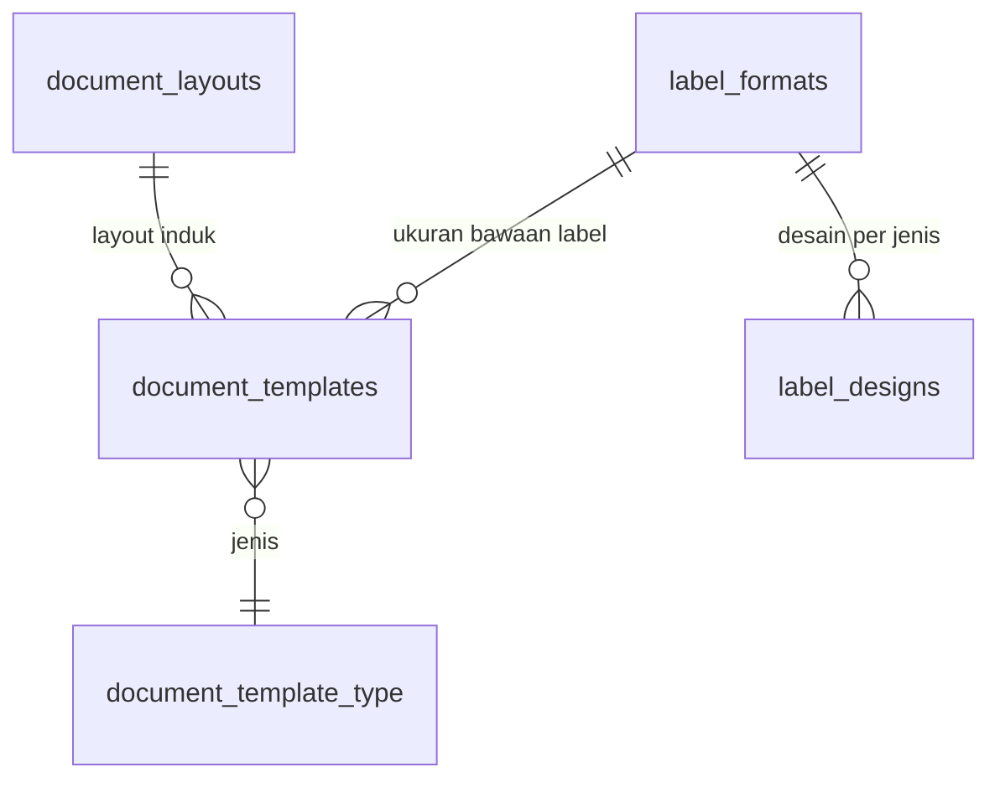

# Spesifikasi Modul — `template` (Template Dokumen & Label)

**Versi:** 0.14
**Tanggal:** 28 September 2026
**Status:** selesai Fase 1, dibangun paralel dengan modul Retur/Transfer di branch `feat/template-label`. Keputusan yang tidak tertulis di dokumen lain dicatat sebagai [A-120](04-keputusan-dan-asumsi.md#a-120)–[A-126](04-keputusan-dan-asumsi.md#a-126) (*Perlu validasi*). v0.2: dokumen ISU (Bukti Pemakaian Material) dari modul Issue ([23-pemakaian](23-pemakaian.md), [A-152](04-keputusan-dan-asumsi.md#a-152)). v0.3: Bukti Konversi Material (jenis `conversion` baru) dan BA Waste aktif dari modul Konversi & Waste ([24-konversi-waste](24-konversi-waste.md), [A-160](04-keputusan-dan-asumsi.md#a-160)). v0.4: BA Serah Terima Aset aktif dari modul Aset ([25-aset](25-aset.md)); tidak ada lagi jenis stub. v0.9: **ukuran label = master per company** dan **desain label** yang bisa ditata (geser/ubah ukuran, barcode/QR/keduanya) — [A-261](04b-asumsi-lanjutan.md#a-261), [A-262](04b-asumsi-lanjutan.md#a-262); §2, §3.2–§3.4, §5.3, §6, §10 (TC-TPL-17–21), §12, §13; menjawab [O-09](04-keputusan-dan-asumsi.md#o-09). v0.10: **riwayat cetak** & cap CETAK ULANG ([A-263](04b-asumsi-lanjutan.md#a-263)), **segel tanda tangan ber-QR** + halaman verifikasi publik ([A-264](04b-asumsi-lanjutan.md#a-264)) — §3.5–§3.6, §5.2, §6, §10 (TC-TPL-22–25), §13.1 no. 8.; v0.11: label potongan hanya bila saklar per potong menyala ([A-284](04b-asumsi-lanjutan.md#a-284), §5.3, §10 TC-TPL-26); v0.12: kolom satuan setiap cetakan disertai uraian kemasan; Bukti Penerimaan Barang GRN vendor berkolom Dikirim vendor/Baik/Rusak/Kurang ([A-293](04b-asumsi-lanjutan.md#a-293), [A-295](04b-asumsi-lanjutan.md#a-295), §10 TC-TPL-27); v0.14: SJ memuat nama & HP driver (tanpa akun), No. PO klien, kotak *Penerima (tanda tangan & cap)*; Bukti Terima memuat No. GR klien ([A-311](04b-asumsi-lanjutan.md#a-311), [A-313](04b-asumsi-lanjutan.md#a-313), [A-316](04b-asumsi-lanjutan.md#a-316))
**Modul:** `template`
**Fase:** F1: template bawaan dan layout induk per company, cetak PDF dokumen, label barcode/QR untuk bin, item, lot, dan potongan dengan ukuran label dari master per company dan desain yang bisa ditata (A-261, A-262). Editor template dokumen penuh `[F2]`.
**Dokumen terkait:** [Blueprint §6.10, §12, §18](01-blueprint.md#12-template-dokumen) · [D-07](04-keputusan-dan-asumsi.md#d-07), [D-14](04-keputusan-dan-asumsi.md#d-14), [D-25](04-keputusan-dan-asumsi.md#d-25) · [AD-08](08-arsitektur.md) · [Model data 08c](08c-model-data-pendukung.md) (`document_layouts`, `document_templates`, `label_formats`, `label_designs`) · [BR-WH-01](05-aturan-bisnis.md#br-wh) · [O-09](04-keputusan-dan-asumsi.md#o-09), [O-13](04-keputusan-dan-asumsi.md#o-13)
**Ketergantungan modul:** `access` (permission, tanda tangan profil), `master` (item, lot, potongan), `warehouse` (bin), `shipment` (SJ, PCK, bukti terima, DSC), `receipt` (RTV), `adjustment` (ADJ), `count` (laporan OPN), `shared` (`StoreUpload`).

---

## 1. Tujuan & lingkup

Dokumen fisik tetap dibutuhkan di gudang dan di lapangan. Surat jalan ikut dibawa driver (tanpa akun, nama & HP tercetak) lalu ditandatangani & dicap penerima, picklist dipegang picker, berita acara ditandatangani, dan setiap bin serta barang butuh label yang bisa dipindai. Modul ini mencetak dokumen-dokumen itu sebagai PDF (Blade → HTML → dompdf, AD-08) dengan **layout induk per company**: logo, kop, warna aksen, footer, blok tanda tangan, dan QR dokumen. Modul ini juga mencetak **label** untuk bin, item, lot, dan potongan: ukurannya dipilih dari **master ukuran label** company (gulungan thermal atau lembar berisi beberapa label, [A-261](04b-asumsi-lanjutan.md#a-261)) dan isinya mengikuti **desain label** per jenis × ukuran — posisi teks, barcode Code128, QR, dan logo bisa digeser dan diubah ukurannya, serta dipilih barcode saja, QR saja, atau keduanya ([A-262](04b-asumsi-lanjutan.md#a-262)).

Semua cetakan **tanpa harga atau nilai uang** (D-07).

Tidak termasuk:
- editor template penuh dengan variabel `{nomor_dokumen}` dan sejenisnya `[F2]`
- verifikasi QR publik tanpa login `[F2]`
- label aset/serial (BA Serah Terima Aset ditambah v0.4)
- BA Waste dan Bukti Konversi Material (ditambah v0.3)
- dokumen modul yang belum dibangun: TRF, RET, PRQ (ISU ditambah v0.2)
- pencetakan langsung ke printer thermal lewat driver; F1 menghasilkan PDF berukuran label

## 2. Aktor & permission

Permission disimpan dengan `module = template` ([A-124](04-keputusan-dan-asumsi.md#a-124)).

| Permission | Arti | Role bawaan |
|---|---|---|
| `document_layout.manage` | Mengubah layout induk dan kertas dokumen; mengelola ukuran label dan desain label (A-261, A-262) | Admin Company |
| `label.print` | Mencetak label bin/item/lot/potongan | Admin Company, Kepala Gudang, Staf Gudang |

**Cetak dokumen tidak punya permission sendiri.** Siapa pun yang boleh melihat dokumen (`view` di policy dokumen asal, beserta cakupan gudangnya, BR-ACC-05) boleh mencetaknya, karena mencetak tidak mengubah data ([A-124](04-keputusan-dan-asumsi.md#a-124)). Label juga butuh izin lihat datanya: `bin.view` untuk label bin, `item.view` untuk label item, lot, dan potongan.

## 3. Entitas & data

Migrasi: `database/migrations/tenant/2026_01_01_000200_create_document_template_tables.php` dan `2026_01_01_000290_create_label_format_tables.php` (A-261, A-262; preset ukuran ikut dibuat), mengikuti [ERD 08c](08c-model-data-pendukung.md). Kolom di luar ERD tercatat di [A-123](04-keputusan-dan-asumsi.md#a-123). Model: `Template\Models\DocumentLayout`, `DocumentTemplate`, `LabelFormat`, `LabelDesign`.

### 3.1 `document_layouts` — Layout Induk

| Kolom | Tipe | Null | Keterangan |
|---|---|---|---|
| `id` | bigint | — | PK |
| `name` | varchar(80) | — | "Standar" |
| `logo_attachment_id` | bigint | ✔ | disiapkan untuk tabel lampiran; F1 kosong, tanpa FK |
| `logo_path` | varchar(255) | ✔ | *di luar ERD*: berkas logo di disk tenant (PNG/JPEG, maks 5 MB, NFR-14) |
| `header_html` | text | ✔ | F1: **teks biasa** (alamat, telepon), di-escape saat dicetak ([A-122](04-keputusan-dan-asumsi.md#a-122)) |
| `footer_html` | text | ✔ | F1: teks biasa |
| `colors` | json | ✔ | `{"accent": "#1f4e79"}` |
| `signature_blocks` | json | ✔ | `{jenis_dokumen: ["Dibuat oleh", …]}`; kosong = bawaan §5.2 |
| `is_default` | bool | — | F1 satu layout per company |
| `created_at`, `updated_at` | datetime | ✔ | |

### 3.2 `document_templates` — Template Dokumen

| Kolom | Tipe | Null | Keterangan |
|---|---|---|---|
| `id` | bigint | — | PK |
| `document_type` | varchar(30) | — | enum `document_template_type` ([Katalog §3](06-katalog-status-dan-enum.md#3-enum-lain)) |
| `name` | varchar(80) | — | "Bawaan" |
| `layout_id` | bigint | ✔ | FK `document_layouts` |
| `body_html` | text | ✔ | F1 kosong = template Blade bawaan; diisi editor `[F2]` |
| `paper` | varchar(20) | — | enum `paper_size`; lebar kolom diperbesar dari varchar(10) ([A-123](04-keputusan-dan-asumsi.md#a-123)). Sejak A-261 hanya dipakai dokumen; nilai `label_*` lama tetap tersimpan |
| `label_format_id` | bigint | ✔ | FK `label_formats`: ukuran bawaan jenis label (A-261); kosong = preset yang setara `paper` lama |
| `is_default` | bool | — | satu bawaan per jenis |
| `version` | int | — | 1 |

UK(`document_type`, `name`, `version`). Baris bawaan dibuat `TemplateReferenceSeeder` (provisioning) dan dibuat otomatis saat pertama dibutuhkan bila belum ada.

### 3.3 `label_formats` — Ukuran Label ([A-261](04b-asumsi-lanjutan.md#a-261))

| Kolom | Tipe | Null | Keterangan |
|---|---|---|---|
| `id` | bigint | — | PK |
| `code` | varchar(20) | — | UK; huruf besar, angka, tanda hubung; terkunci setelah dibuat |
| `name` | varchar(80) | — | nama di layar, mis. "Thermal 50×30 mm" |
| `media` | varchar(10) | — | enum `label_media`: `roll` (gulungan, satu label per halaman) · `sheet` (lembar, kolom × baris) |
| `width_mm`, `height_mm` | decimal(6,2) | — | ukuran satu label, 10–300 mm |
| `page_width_mm`, `page_height_mm` | decimal(6,2) | ✔ | lembar saja, 50–500 mm |
| `columns`, `rows` | tinyint | — | lembar: 1–10 kolom, 1–40 baris; gulungan 1 × 1 |
| `margin_top_mm`, `margin_left_mm`, `gap_x_mm`, `gap_y_mm` | decimal(6,2) | — | lembar: margin halaman dan jarak antar label; susunan harus muat di halaman |
| `is_active` | bool | — | dinonaktifkan, tidak dihapus (P-03) |

Preset dari migrasi: `THERMAL-50X30`, `THERMAL-40X30`, `THERMAL-100X50`, `THERMAL-100X150` (gulungan), `A4-3X8` (70×37 mm, 24 per lembar, pengganti `label_a4_3x8`), `A4-2X7` (99,1×38,1 mm, 14 per lembar). Company boleh menambah ukuran apa pun.

### 3.4 `label_designs` — Desain Label ([A-262](04b-asumsi-lanjutan.md#a-262))

| Kolom | Tipe | Null | Keterangan |
|---|---|---|---|
| `id` | bigint | — | PK |
| `document_type` | varchar(30) | — | `label_bin` · `label_item` · `label_lot` · `label_piece` |
| `label_format_id` | bigint | — | FK `label_formats` |
| `code_mode` | varchar(10) | — | enum `label_code_mode`: `barcode` · `qr` · `both` |
| `elements` | json | — | enam elemen tetap: `title`, `subtitle`, `detail`, `barcode`, `qr`, `logo`; masing-masing `visible`, `x`, `y`, `w`, `h` (mm, 0,1), `font` (pt 4–72), `bold`, `align`; `barcode.show_text` |
| `updated_by` | bigint | ✔ | FK `users` |
| `created_at`, `updated_at` | datetime | ✔ | |

UK(`document_type`, `label_format_id`). Tanpa baris = tata letak otomatis dari ukuran label (`LabelDesignRules::defaults`).

```mermaid
erDiagram
  document_layouts ||--o{ document_templates : "layout induk"
  document_templates }o--|| document_template_type : "jenis"
  label_formats ||--o{ document_templates : "ukuran bawaan label"
  label_formats ||--o{ label_designs : "desain per jenis"
```

### 3.5 `print_logs` — Riwayat Cetak ([A-263](04b-asumsi-lanjutan.md#a-263))

`id`, `document_type` (jenis cetak), `document_id`, `document_number`, `copy_no` (cetakan ke-n per dokumen × jenis), `printed_by` (FK `users`), `printed_at`, `ip`. Hanya ditambah. Indeks (`document_type`, `document_id`).

### 3.6 `signature_seals` — Segel Tanda Tangan ([A-264](04b-asumsi-lanjutan.md#a-264))

`id`, `token` (UK, 40 karakter acak), `document_type`, `document_id`, `document_number`, `block_no`, `block_label`, `signer_user_id` (FK `users`, kosong bila nama bebas), `signer_name`, `signer_title` (jabatan saat disegel), `acted_at` (waktu tindakan di dokumen, bila tercatat), `sealed_at`, `fingerprint` (HMAC-SHA256 kunci aplikasi atas isi segel). Indeks (`document_type`, `document_id`).

## 4. Mesin status

Tidak ada. Layout dan template tidak berstatus; label dan PDF tidak disimpan. Mencetak tidak mengubah status dokumen asal. Karena itu route cetak memakai GET (bukan transisi, P-04).

| Aksi | Implementasi | Efek samping |
|---|---|---|
| Simpan layout | `Template\Actions\SaveDocumentLayout::handle` | log `template` (BR-GEN-05) |
| Unggah / hapus logo | `SaveDocumentLayout::storeLogo` / `removeLogo` | berkas lama dibuang (`StoreUpload`) |
| Cetak dokumen | `Template\Support\DocumentPrinter` lewat `PrintController@document` | — |
| Cetak label | `Template\Actions\PrintLabels` lewat `PrintController@labels` | — |

## 5. Aturan bisnis yang berlaku

| Aturan | Ditegakkan di mana |
|---|---|
| [D-07](04-keputusan-dan-asumsi.md#d-07) | Template tidak memuat kolom harga/nilai; uji memastikan tidak ada kata "harga", "Rp", atau "total" di PDF |
| [BR-WH-01](05-aturan-bisnis.md#br-wh) | Label bin mencetak `bins.code` yang tidak bisa diubah |
| [BR-ACC-05](05-aturan-bisnis.md#br-acc), [BR-GEN-09](05-aturan-bisnis.md#br-gen) | Cetak dokumen memakai policy `view` dokumen asal, jadi di luar cakupan = 403 |
| [BR-GEN-10](05-aturan-bisnis.md#br-gen) | Template AST dan editor `[F2]` berupa stub yang menjawab "belum tersedia" |
| [BR-GEN-05](05-aturan-bisnis.md#br-gen) | Perubahan layout dicatat di log aktivitas `template` |
| NFR-14 | Logo ≤ 5 MB, PNG/JPEG, tipe dibaca dari isi berkas |

### 5.1 Dokumen bawaan F1

| `document_type` | Dokumen | Isi baris | Kertas bawaan |
|---|---|---|---|
| `shipment` | Surat Jalan (SJ) | item, jumlah, satuan, lot/serial/potongan, asal PCK/REQ; kepala: nama & HP driver, No. PO klien | A4 |
| `proof_of_delivery` | Bukti Terima | per baris baik/rusak/kurang, penerima, waktu, kanal, driver, No. GR klien | A4 |
| `pick_task` | Picklist (PCK) | urut bin, item, jumlah dialokasikan, kolom centang | A4 |
| `delivery_discrepancy` | BA Selisih Pengiriman (DSC) | baris kurang/rusak, disposisi | A4 |
| `vendor_return` | Surat Retur ke Vendor (RTV) | item, jumlah, alasan QC ([A-80](04-keputusan-dan-asumsi.md#a-80)) | A4 |
| `stock_adjustment` | BA Penyesuaian (ADJ) | bin, item, ±jumlah, alasan | A4 |
| `material_issue` | Bukti Pemakaian Material (ISU, v0.2) | bin, item, lot/serial/potongan, jumlah (negatif pada pembalik), keperluan; proyek & Gudang Site di kepala | A4 |
| `stock_count` | Laporan Stock Opname | tetap `/counts/{id}/report` (modul Count); memakai kop layout induk | A4 lanskap |
| `conversion` | Bukti Konversi Material (CNV, v0.3) | input (bin, item, lot/potongan, jumlah) dan hasil (jenis, bin, potongan baru, dari potongan induk), neraca input = output + offcut + waste + kerf | A4 |
| `waste_disposal` | BA Waste (WST, v0.3) | bin Waste, item, lot/serial/potongan, kondisi, jumlah, alasan; disposisi dan bukti di kepala | A4 |
| `asset_handover` | BA Serah Terima Aset (AST, v0.4) | aset & serial, proyek, gudang, SJ/RET; tabel keluar vs kembali (tanggal, jatuh tempo/hari pakai, kondisi, meter); catatan komponen pemeriksaan; blok *Diserahkan · Diterima · Dikembalikan* | A4 |

Label (§5.3): `label_bin`, `label_item`, `label_lot`, `label_piece`.

### 5.2 Kop, tanda tangan, dan QR

- **Kop:** logo, nama company, teks kop, nomor dokumen dan status, lalu QR dokumen di pojok kanan. QR berisi tautan halaman detail internal, jadi harus login untuk membukanya ([A-121](04-keputusan-dan-asumsi.md#a-121)).
- **Blok tanda tangan bawaan:**
  - SJ: Dibuat oleh · Pengemudi · Penerima (tanda tangan & cap) — foto SJ bertanda tangan menjadi bagian bukti terima ([A-316](04b-asumsi-lanjutan.md#a-316))
  - Bukti terima: Pengemudi · Penerima
  - PCK: Picker · Diperiksa
  - DSC: Kepala Gudang · Pengemudi
  - RTV: Dibuat oleh · Disetujui · Vendor
  - ADJ: Diajukan · Disetujui
  - ISU: Dicatat oleh · Dikonfirmasi · PIC proyek (v0.2)
  - CNV: Dikerjakan oleh · Disetujui · PIC proyek; WST: Dibuat oleh · Disetujui · Saksi (v0.3)
  - OPN: Rekonsiliasi · Disetujui

  Nama pelaku yang diketahui ikut tercetak menurut urutan kotak: kotak ke-n memuat pelaku ke-n dari daftar bawaan. Tanda tangan penerima pada bukti terima diambil dari `proofs_of_delivery.signature_path`. Gambar tanda tangan dari profil (`users.signature_path`) dicetak bila ada. Keabsahan hukumnya masih [O-13](04-keputusan-dan-asumsi.md#o-13) ([A-125](04-keputusan-dan-asumsi.md#a-125)).
- **Segel tanda tangan ([A-264](04b-asumsi-lanjutan.md#a-264)):** kotak yang pelakunya diketahui diberi QR 15 mm dan baris *waktu tindakan · segel XXXX-XXXX-XXXX · pindai QR untuk verifikasi*. Tanda tangan profil boleh diunggah atau digambar di kanvas. QR membuka `/verifikasi/{token}` tanpa login: company, jenis & nomor dokumen, status, tanggal, gudang/tujuan/proyek/vendor, jumlah baris, penanda tangan & waktunya, kode segel utuh/tidak cocok, tanda tangan lain di dokumen itu — tanpa barang, jumlah, harga.
- **Status:** dokumen bisa dicetak di status apa pun. Dokumen `cancelled` diberi tanda air "DIBATALKAN".
- **Riwayat cetak ([A-263](04b-asumsi-lanjutan.md#a-263)):** setiap cetak dicatat; kaki halaman menulis *cetakan ke-n*; cetakan ke-2 dst. SJ, Bukti Terima, dan PO diberi cap **CETAK ULANG ke-n**. Kartu *Riwayat cetak* tampil di layar detail lewat komponen *Dokumen terkait*.

### 5.3 Label ([A-120](04-keputusan-dan-asumsi.md#a-120) diganti [A-261](04b-asumsi-lanjutan.md#a-261), [A-121](04-keputusan-dan-asumsi.md#a-121) + [A-262](04b-asumsi-lanjutan.md#a-262))

| Label | Teks utama · kedua · keterangan | Code128 | QR |
|---|---|---|---|
| Bin | kode bin · gudang · jenis bin | `bins.code` | `bins.code` |
| Item | kode · nama · satuan dasar | `items.barcode`, atau `items.code` bila kosong | `items.qr_payload`, atau `items.code` bila kosong |
| Lot | nomor lot · item · tanggal masuk & kedaluwarsa | `lot_no` | `<kode item>\|<lot_no>` |
| Potongan | nomor potongan · item · panjang & tanggal masuk | `piece_no` | `piece_no` |
| Kemasan (induk/isi, [A-296](04b-asumsi-lanjutan.md#a-296)) | kode label · kode & nama item · isi (+ "1 DUS" untuk induk), tanggal masuk, vendor, nomor GRN, lot, kedaluwarsa, batch vendor — tanpa harga | `package_labels.code` | `package_labels.code` |
| Serial ([A-298](04b-asumsi-lanjutan.md#a-298)) | nomor seri · kode & nama item · tanggal masuk, vendor, nomor GRN asal | `serial_no` | `serial_no` |

Label potongan hanya dapat dipilih di cetak label, desainer label, dan layout dokumen bila saklar `piece` menyala; `?type=label_piece` saat saklar mati jatuh ke label bin ([A-284](04b-asumsi-lanjutan.md#a-284)).

1. **Ukuran** dipilih dari `label_formats` aktif. Gulungan = satu label per halaman seukuran label; lembar = halaman berukuran bebas dengan label di posisi `margin + indeks × (ukuran + jarak)`, urut baris lalu kolom. Bawaan per jenis label = `document_templates.label_format_id`; saat mencetak boleh dipilih ukuran aktif lain. Parameter `paper` lama tetap diterima (dipetakan ke preset).
2. **Desain** per jenis × ukuran: posisi dan ukuran setiap elemen dalam mm, huruf, tebal, rata; logo company opsional. **Kode yang dicetak** dipilih: barcode saja, QR saja, atau keduanya — elemen barcode/QR ikut pilihan ini. Isian di luar label dirapikan ke dalam batas saat disimpan dan saat dipakai (bila ukuran label berubah).
3. Salinan 1–10 per label; paling banyak 200 label per cetak (200 label ±90 MB dan ±14 detik; 500 label melewati batas memori 128 MB).
4. Menonaktifkan ukuran yang menjadi bawaan salah satu jenis label, atau ukuran aktif terakhir, ditolak.

## 6. Layar

| Route | Komponen | Isi |
|---|---|---|
| `GET /print/{type}/{id}` | `Template\PrintController@document` | PDF inline (`application/pdf`) untuk jenis §5.1 |
| `/labels` | `template.label-print` | Pilih jenis label `*`; filter gudang (bin) atau cari; tabel dengan kotak centang; **ukuran label** `*` (aktif, bawaan jenis); salinan `*`; tombol **Cetak label** membuka PDF di tab baru; tautan *Atur desain label ini* / *Kelola ukuran* bagi Admin |
| `GET /labels/print` | `PrintController@labels` | PDF label (`type`, `ids`, `format` = id ukuran, `copies`; `paper` lama tetap diterima) |
| `/labels/trace` | `label.label-trace` | **Telusuri label** ([A-302](04b-asumsi-lanjutan.md#a-302), izin `item.view`): isian pindai kode label → asal (GRN, vendor, tanggal terima, catatan pemesanan, PRQ/PO), lot & batch, lokasi terakhir, induk/isi, riwayat dengan tautan dokumen & SJ; kode item/lot/GRN → daftar label |
| `/settings/label-formats` | `template.label-format-manager` | Daftar ukuran (kode, nama, ukuran, bawaan untuk, status); form tambah/ubah dengan tombol halaman A4/Letter/F4, **Tengahkan susunan**, dan pratinjau susunan lembar (SVG); nonaktifkan/aktifkan |
| `/settings/label-designs` | `template.label-designer` | Pilih jenis & ukuran; kanvas seukuran label (kisi 1 mm/5 mm, perbesar/perkecil) berisi contoh data sungguhan; elemen digeser & diubah ukurannya (interact.js), panah = 0,5 mm; panel elemen (tampil/sembunyi) dan properti (X, Y, lebar, tinggi, huruf, tebal, rata, teks kode); pilihan **Barcode saja / QR saja / Barcode + QR**; **Tata ulang otomatis**; *Jadikan ukuran bawaan*; **Simpan desain** |
| `GET /verifikasi/{token}` | `SignatureVerifyController@show` | Publik (tanpa login, 30/menit): verifikasi segel tanda tangan ([A-264](04b-asumsi-lanjutan.md#a-264)) |
| `GET /settings/label-designs/preview` | `LabelDesignController@preview` | PDF satu halaman contoh dengan desain tersimpan (`type`, `format`) |
| `/settings/document-layout` | `template.document-layout-form` | Nama, teks kop, footer, warna aksen, logo (unggah/hapus), blok tanda tangan per jenis (satu baris per blok, maks 4), tabel template dokumen (jenis, kertas, "Bawaan", tombol **Editor template — Fase 2** nonaktif) dan tautan ke *Desain label* / *Ukuran label*, tombol **Contoh cetak** |
| `GET /settings/document-layout/preview` | `PrintController@preview` | PDF contoh kop + tanda tangan |

Tombol **Cetak** (tab baru) ada di detail SJ (juga *Cetak bukti terima* bila ada, dan *Cetak BA* per DSC), detail PCK, detail RTV, dan detail ADJ. Tautan **Cetak label** ada di daftar bin dan detail item. Menu: *Pengaturan → Layout dokumen*, *Desain label*, *Ukuran label*, dan *Laporan & cetak → Cetak label*, juga lewat palet Ctrl+K. Semuanya disaring permission.

## 7. Kejadian stok & integrasi

Tidak ada. Modul ini hanya membaca.

## 8. Notifikasi

Tidak ada.

## 9. Laporan & dashboard

Tidak ada. Laporan PDF §9 Blueprint memakai kop dari modul ini setelah ekspor PDF laporan dibangun (lihat [16-shared-laporan-berkas](16-shared-laporan-berkas.md) §13).

## 10. Kasus uji (Given / When / Then)

Uji di `tests/Feature/Template`: `DocumentPrintTest`, `LabelPrintTest`, `DocumentLayoutTest`, `LabelDesignTest` (TC-TPL-17–21, sejak v0.9). Isi PDF diperiksa dari HTML yang sama (`DocumentPrinter::view`, `PrintLabels::view`) karena teks PDF dompdf terkompresi.

| ID | Given | When | Then | Aturan |
|---|---|---|---|---|
| TC-TPL-01 | Rantai GRN → REQ → PCK → SJ berangkat → bukti terima kurang (DSC) | cetak SJ, bukti terima, PCK, DSC | `200 application/pdf`; teks memuat nomor dokumen, kode item, jumlah; tanpa "Rp"/"harga" | §5.1, D-07 |
| TC-TPL-02 | RTV dan ADJ | cetak | PDF dengan nomor dan baris | §5.1 |
| TC-TPL-03 | SJ gudang CKG; staf bercakupan gudang lain; klien (tanpa `pick.view`) | cetak SJ / PCK | SJ tidak terlihat (403/404); PCK 403; staf CKG 200 | BR-ACC-05, BR-GEN-09 |
| TC-TPL-04 | Jenis tidak dikenal, label, OPN, id tak ada, WST tak ada / AST | cetak | 404 / 501 "belum tersedia" (stub) | BR-GEN-10 |
| TC-TPL-05 | SJ dibatalkan | cetak | tanda air "DIBATALKAN" | A-126 |
| TC-TPL-06 | Layout dengan teks kop, footer, logo PNG, blok tanda tangan SJ diubah | cetak SJ | kop, footer, dan label blok baru tercetak; teks `<b>` tampil sebagai teks | §5.2, A-122 |
| TC-TPL-07 | Admin Company | simpan layout (warna bukan hex, blok > 4, kertas dokumen untuk label) | ditolak validasi tanpa simpan sebagian; yang sah tersimpan, blok sama dengan bawaan tidak disimpan, log `template` | BR-GEN-05, A-125 |
| TC-TPL-07b | Admin Company | unggah logo PDF / PNG 6 MB / PNG sah; hapus | ditolak / ditolak / tersimpan dan bisa dipratinjau / berkas dihapus | NFR-14 |
| TC-TPL-08 | Kepala Gudang / Staf / Manajemen | buka layar, contoh cetak, unggah logo | 403; Admin 200 dan contoh cetak PDF | §2 |
| TC-TPL-09 | Bin CKG-A-R01-L1-B01, item berbarcode, lot, potongan | cetak label tiap jenis, kertas 50×30 dan A4 3×8, salinan 2 | PDF; jumlah halaman thermal = label × salinan; teks memuat kode | §5.3, A-120 |
| TC-TPL-10 | Driver (lama) / Penindak Lanjut PR (tanpa `label.print`); bin gudang lain; ids × salinan > 200, salinan 11, kertas A4, tanpa id | cetak label | 403 / 404 / 422 | §2, BR-ACC-05 |
| TC-TPL-11 | Tanpa baris `document_templates` | cetak SJ | baris bawaan dibuat otomatis; kertas A4 | §3.2 |
| TC-TPL-12 | Payload | `LabelPayload` untuk item tanpa barcode, lot | Code128 = kode item; QR lot = `KODE\|LOT` | A-121 |
| TC-TPL-13 | Role berbeda; layar cetak label | buka beranda; pilih 2 bin × 3 salinan; ganti jenis | menu *Layout dokumen* hanya Admin, *Cetak label* Admin/Kepala/Staf; "Cetak 6 label"; pilihan dikosongkan, kertas bawaan jenis baru | §6 |
| TC-TPL-14 | Laporan opname | unduh `/counts/{id}/report` | memakai kop layout induk | §5.1 |
| TC-TPL-22 | SJ dicetak 3×, Bukti Terima 1×, ADJ 2×; driver tanpa izin | cetak | log 1/2/3 per jenis cetak; SJ ke-3 bercap *CETAK ULANG ke-3*, cetakan pertama tanpa cap; ADJ hanya *cetakan ke-2*; cetak ditolak tidak dicatat | A-263 |
| TC-TPL-23 | SJ dicetak 2× + Bukti Terima 1× | buka detail SJ / ADJ | kartu *Riwayat cetak* "3 kali", "cetak ulang", Bukti Terima / ADJ tanpa kartu | A-263 |
| TC-TPL-24 | ADJ diajukan staf | cetak 2×; buka `/verifikasi/{token}` tanpa login; token asing; baris segel diubah; ADJ dibatalkan | satu segel (Diajukan, waktu = dibuat), kode di cetakan; halaman menampilkan nomor, jenis, penanda tangan, kode *utuh*, tanpa barang; 404 *Segel tidak dikenal*; *tidak cocok*; *sudah dibatalkan* | A-264 |
| TC-TPL-25 | Staf | gambar tanda tangan di profil; kirim data rusak | tersimpan di disk; ditolak, tanda tangan lama tetap | A-264 |
| TC-TPL-26 | Saklar `piece` mati, ada potongan | buka cetak label `?type=label_piece`; nyalakan saklar | jatuh ke label bin, jenis label potongan tidak ada; lalu daftar potongan tampil | [A-284](04b-asumsi-lanjutan.md#a-284) |
| TC-TPL-27 | GRN vendor 3 DUS (1 rusak) | cetak Bukti Penerimaan Barang | kolom Dikirim vendor/Baik/Rusak/Kurang, "3 DUS", uraian kemasan | [A-293](04b-asumsi-lanjutan.md#a-293), [A-295](04b-asumsi-lanjutan.md#a-295) |
| TC-TPL-28 | GRN vendor baut 24 = 2 dus × 12 | cetak label kemasan (HTML & PDF) | kode induk, "Isi 12 PCS", vendor, nomor GRN, tanggal masuk; tanpa "harga"/"Rp"; PDF | [A-296](04b-asumsi-lanjutan.md#a-296), D-07 |
| TC-TPL-29 | GRN vendor genset serial GNS-77 selesai | cetak label serial | nomor seri + vendor + nomor GRN | [A-298](04b-asumsi-lanjutan.md#a-298) |
| TC-TPL-30 | — | sumber desain & pratinjau `label_package`/`label_serial`; menu cetak jenis Label kemasan | judul "Kode label kemasan"/"Nomor seri"; PDF pratinjau; daftar memuat label Di gudang & nomor GRN | [A-302](04b-asumsi-lanjutan.md#a-302) |
| TC-TPL-31 | induk isi 12 dipecah 4 label isi | cetak label isi | `…-0004`, masing-masing "Isi 3 PCS" | [A-296](04b-asumsi-lanjutan.md#a-296) |
| TC-TPL-32 | induk dengan 3 label isi | batal tanpa alasan; batal beralasan; staf gudang membuka Batalkan | BR-GEN-11; induk + 3 isi Batal, kejadian "Dibatalkan"; 403 | BR-LBL-05, [A-301](04b-asumsi-lanjutan.md#a-301) |
| TC-TPL-33 | induk di-put-away lalu dipecah 2 | buka `/labels/trace?code=<kode kecil>`; `?code=BAUT-M12`; beranda | asal vendor & GRN, riwayat Diterima/Ditaruh di bin/Dipecah, label isi; daftar label item; menu Telusuri label | [A-302](04b-asumsi-lanjutan.md#a-302) |
| TC-TPL-17 | Preset migrasi; ukuran baru gulungan 60×40,5; lembar A4 4×10 52×29,7 | simpan; posisi; kode/ nama/ lebar tidak sah; lembar tidak muat; ubah | 6 preset, bawaan bin = A4-3X8, item = THERMAL-50X30; posisi A4-2X7 benar; ditolak per kolom; "tidak muat ke samping"; kode terkunci | A-261 |
| TC-TPL-18 | THERMAL-50X30 bawaan; THERMAL-40X30 bukan | nonaktifkan; cetak dengan ukuran nonaktif; aktifkan; ukuran aktif terakhir | ditolak / nonaktif, tidak ditawarkan, cetak 422 `format` / aktif / ditolak | A-261, P-03 |
| TC-TPL-19 | Ukuran 100×50 | desain otomatis; simpan isian di luar label + kunci asing, QR saja, jadikan bawaan; cetak; ganti barcode / keduanya; ukuran diperkecil; kode tidak dikenal | di dalam label; dirapikan (x 70, y 0, huruf 72), kunci dibuang, barcode ikut kode; 1/1/2 gambar; satu baris desain; dirapikan saat dipakai; ditolak | A-262 |
| TC-TPL-20 | Admin & Kepala Gudang | buka layar ukuran/desain/contoh; menu; layar ukuran tambah Letter 2×5 + tengahkan; nonaktifkan bawaan; desainer simpan (array elemen) | Kepala 403, Admin 200 + PDF; menu hanya Admin; margin 6,35/12,7, 10 per lembar; galat `format`; desain & bawaan tersimpan, layar cetak ikut | A-261, A-262 |
| TC-TPL-21 | Lembar 2×3 90×80 margin 10/12 jarak 6/5; gulungan 75×25 | cetak 2 bin × 4 salinan; 2 item | 8 label, 2 halaman, label ke-4 di 108/95 mm; PDF 200; gulungan 2 halaman 75 mm | §5.3 |

## 11. Di luar lingkup modul ini

Editor template dan variabel `[F2]`; beberapa layout per company `[F2]`; verifikasi QR publik `[F2]`; log cetak/jumlah cetak ulang; label serial/aset; dokumen TRF/RET/PRQ; ekspor PDF laporan §9 (16-shared); cetak langsung ke printer (PWA/driver printer).

## 12. Definisi selesai

- [x] Migrasi, model, enum, seeder bawaan (`TemplateReferenceSeeder` di provisioning dan DEMO)
- [x] Enam dokumen §5.1 tercetak dengan kop layout induk; OPN memakai kop
- [x] Empat jenis label; ukuran label dari master per company, desain per jenis × ukuran (v0.9)
- [x] Layar layout dokumen, cetak label, ukuran label, desain label; tombol Cetak di detail dokumen, menu, palet
- [x] 2 permission dan role di `ReferenceSeeder`; `DemoSeederTest` menghitung modul `template`
- [x] Semua TC-TPL lulus; `php artisan test` hijau
- [x] Dokumen diperbarui (versi naik + changelog README)

## 13. Catatan implementasi (24 September 2026)

Domain `app/Domain/Template`:
- `Enums\DocumentTemplateType`, `PaperSize`, `LabelMedia`, `LabelCodeMode`
- `Models\DocumentLayout`, `DocumentTemplate`, `LabelFormat`, `LabelDesign`
- `Actions\SaveDocumentLayout` (`handle`, `storeLogo`, `removeLogo`), `PrintLabels`, `SaveLabelFormat`, `SetLabelFormatActive`, `SaveLabelDesign`
- `Support\DocumentPrinter`, `PrintAssets`, `BarcodeImage`, `LabelPayload`, `LabelDesignRules`, `PdfRenderer` (`makeCustom` untuk halaman berukuran mm), `PrintFormat`
- `Livewire\DocumentLayoutForm`, `LabelPrint`, `LabelFormatManager`, `LabelDesigner`; JS `resources/js/wms/label-designer.js` (paket npm `interactjs`, di-bundle Vite)

Di luar domain: provider `TemplateServiceProvider`, controller `Template\PrintController`, `DocumentLayoutController`, dan `LabelDesignController`, view `resources/views/print/*` dan `template/*`.

### 13.1 Keputusan implementasi

1. **Gambar barcode/QR sebagai PNG data URI.** Code128 digambar picqer lewat GD. QR diambil dari matriks bacon lalu digambar sendiri lewat GD, karena penulis PNG bawaan bacon butuh imagick. SVG tidak dipakai karena dukungan SVG dompdf terbatas.
2. **Subset font dinyalakan** (`PdfRenderer`), sehingga PDF turun dari ±880 KB menjadi ±18 KB.
3. **dompdf mengabaikan `box-sizing`**; sejak v0.9 setiap label dan elemennya diposisikan **absolut dalam mm**, dan tinggi halaman dikurangi 0,3 mm supaya dompdf tidak menambah halaman kosong. Pemisah halaman memakai `page-break-before` pada halaman kedua dan seterusnya, karena `:last-child` tidak didukung.
4. **Cetak dokumen di luar cakupan menjawab 404** untuk model yang memakai `ScopedToUser`, karena dokumennya memang tidak terlihat. Policy `view` yang memeriksa cakupan (SJ) menjawab 403.
5. **Kinerja** (mesin kantor, PHP 8.3):
   - SJ 50 baris: 0,85 detik dan 62 MB, memenuhi kriteria [02-riset](02-riset-wms-sejenis.md) (< 2 detik).
   - Label 200 buah: ±14 detik dan ±90 MB.
   - Label 500 buah: ±150 MB dan sampai 35 detik, melewati `memory_limit` 128 MB dan batas waktu 30 detik. Karena itu batas cetak diturunkan ke **200 label** ([A-120](04-keputusan-dan-asumsi.md#a-120)).
   - Uji dibatasi pada sedikit render PDF karena memori suite uji ikut menumpuk.
6. **Laporan opname** (`count/report.blade.php`, modul Count) hanya ditambah `@include('print.partials.kop')`; controller dan rutenya tidak berubah.
8. **Riwayat cetak & segel (v0.10, [A-263](04b-asumsi-lanjutan.md#a-263), [A-264](04b-asumsi-lanjutan.md#a-264)).** `DocumentPrinter::stream` mencatat `PrintHistory::record` (nomor cetakan dikunci `lockForUpdate`) sebelum merender; `view($type, $model, $copyNo)` meneruskan `cetakKe`/`cetakUlang` ke `print/layout`. Pelaku tiap jenis dokumen kini membawa waktu tindakannya (`['who', 'at']`); `SignatureSeals::issue` mencari segel yang sama (dokumen, kotak, nama, waktu) sebelum membuat baru. Halaman verifikasi mencari dokumen tanpa pengguna login dan hanya merangkum kolom identitas.
7. **Ukuran & desain label (v0.9, [A-261](04b-asumsi-lanjutan.md#a-261), [A-262](04b-asumsi-lanjutan.md#a-262)).** Satu sumber aturan `LabelDesignRules` untuk kanvas, penyimpanan, dan PDF: tinggi kotak teks 1,35 × ukuran huruf supaya huruf berekor tidak terpotong; QR selalu persegi (sisi terkecil kotak) dan dirata sesuai pilihan; barcode direntang selebar kotak dengan teks kode opsional di bawahnya. Kanvas desainer memakai **interact.js** (MIT, ±40 KB gz) dari npm, di-bundle Vite tanpa CDN; state di Alpine, disimpan lewat satu panggilan `$wire.simpan(elemen, kode, jadikanBawaan)`. Diverifikasi di Chromium headless: tambah ukuran, geser elemen, simpan, muat ulang, contoh PDF.

**26 Sep 2026 ([A-256](04b-asumsi-lanjutan.md#a-256)):** `LabelPayload::lot` mencantumkan *Masuk dd/mm/yyyy* (`lots.received_at`) di samping kedaluwarsa, dan `LabelPayload::piece` tanggal potongan lahir — membantu mengambil yang lama dulu (FIFO). Isi barcode/QR tidak berubah.

### 13.2 Sisa pekerjaan

1. ~~[O-09](04-keputusan-dan-asumsi.md#o-09) ukuran label final~~ — **dijawab 26 Sep 2026**: ukuran dipilih company sendiri dari master ukuran label ([A-261](04b-asumsi-lanjutan.md#a-261)). Cetak langsung ke printer lewat driver/ZPL tetap di luar lingkup (PDF seukuran label).
2. Editor template dan variabel `[F2]`; verifikasi QR publik `[F2]`.
3. ~~Dokumen TRF/RET/PRQ/GRN~~ — **selesai 25 Sep 2026** ([A-232](04-keputusan-dan-asumsi.md#a-232)): `transfer`, `goods_return`, `purchase_request`, `goods_receipt` di `DocumentTemplateType` + `DocumentPrinter` + `print/documents/*`, tombol *Cetak* di detail masing-masing; uji TC-TPL-15/16. Label serial/aset: ditambahkan saat modulnya dibangun, dengan menambah kasus di `DocumentTemplateType` dan `DocumentPrinter`. Dokumen ISU sudah ditambah dengan cara itu ([23-pemakaian](23-pemakaian.md) §13.1, uji TC-ISU-17), begitu juga CNV dan WST ([24-konversi-waste](24-konversi-waste.md) §13.1, uji TC-CNV-13), dan **Purchase Order** (v0.5, [purchasing/02](../purchasing/02-purchasing-inti.md)): jenis `purchase_order`, satu-satunya cetakan bernilai uang — kaki cetak menjadi "nilai dalam Rupiah" lewat variabel `bernilai` ([A-217](04-keputusan-dan-asumsi.md#a-217), uji TC-PO-10).
4. ~~Ekspor PDF laporan §9~~ — **selesai** ([16-shared-laporan-berkas](16-shared-laporan-berkas.md) §13.1, TC-RPT-05): memakai `print.partials.kop` dan `PdfRenderer`.

### 13.3 Label kemasan & label serial (28 September 2026)

Jenis `label_package` dan `label_serial` ([A-296](04b-asumsi-lanjutan.md#a-296), [A-298](04b-asumsi-lanjutan.md#a-298)) punya lengan eksplisit di `PrintLabels::load/payload`, `LabelPayload::package/serial`, `LabelDesignRules::sources`, `LabelDesigner::contoh`, `LabelDesignController::contoh`, dan `LabelPrint::rows` (daftar label kemasan hanya yang Di gudang; cari kode label, kode item, atau nomor GRN) — tanpa lengan eksplisit, `match` jatuh ke label potongan. Domain `app/Domain/Label` (model `PackageLabel`, `PackageLabelMove`; `PackageLabelLedger` satu-satunya penulis status label; aksi `CreatePackageLabels`, `CreateContentLabels`, `CancelLabel`; komponen `label.receipt-labels`, `label.label-trace`; concern `CapturesPackageLabels`), migrasi tenant `000410`. Aturan BR-LBL-01–05 di [05 §6a](05-aturan-bisnis.md#br-lbl). Uji `tests/Feature/Label/*` (TC-TPL-28–33, TC-GRN-28–32, TC-MST-38, TC-PCK-19–22, TC-SJ-21, TC-TRF-21, TC-ISU-20–21, TC-RET-23, TC-RPT-12).
