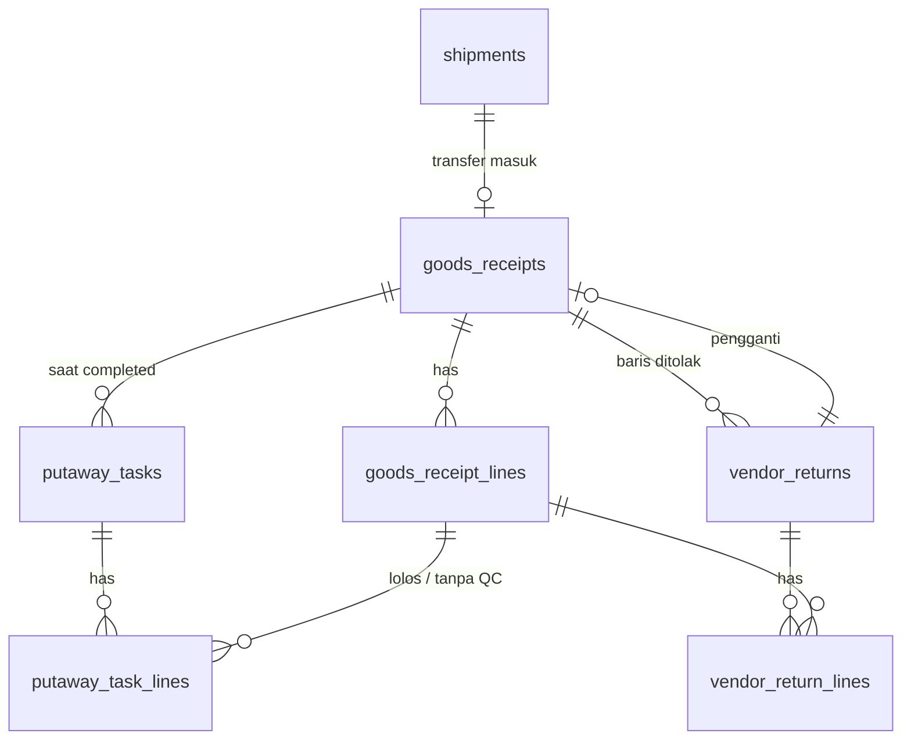

# Spesifikasi Modul — `receipt`, `putaway`, `vendor_return` (Penerimaan, QC, Put-away, Retur ke Vendor)

**Versi:** 0.6
**Tanggal:** 24 September 2026
**Status:** selesai Fase 1 — modul ketujuh setelah [Picking & Shipment](15-picking-shipment.md); keputusan yang tidak tertulis di dokumen dicatat sebagai [A-78](04-keputusan-dan-asumsi.md#a-78)–[A-84](04-keputusan-dan-asumsi.md#a-84) (*Perlu validasi*); v0.4: approval RTV lewat mesin approval ([20-approval](20-approval.md), [A-93](04-keputusan-dan-asumsi.md#a-93)); v0.5: GRN retur dan penyelesaian TRF ([22-retur-transfer](22-retur-transfer.md), [A-112](04-keputusan-dan-asumsi.md#a-112)); v0.6: surat retur RTV dicetak lewat modul Template ([18](18-template-dokumen-label.md))
**Modul:** `receipt`, `putaway`, `vendor_return`
**Fase:** F1 (GRN manual tanpa PO; terhubung PO di Fase 1b, D-29)
**Dokumen terkait:** [Blueprint §7](01-blueprint.md#7-dokumen--alur-utama) · [Aturan Bisnis §BR-GRN](05-aturan-bisnis.md#br-grn) · [Katalog Status §2.5, §2.6, §2.16](06-katalog-status-dan-enum.md) · [Glosarium](03-glosarium.md) · [Model data inbound](08b-model-data-stok-dokumen.md) · [Proses bisnis alur 2](07-proses-bisnis.md) dan [alur 5](07a-proses-bisnis-lanjutan.md)
**Ketergantungan modul:** `stock` (`StockLedger` satu-satunya pintu tulis saldo), `warehouse` (bin Penerimaan, Karantina QC, Dalam Perjalanan), `master` (vendor, item, lot/serial/potongan, alasan), `shipment` (SJ transfer yang diterima). `approval` (sejak v0.4). `transfer` dan `return` (sejak v0.5, [22-retur-transfer](22-retur-transfer.md)). Modul `purchase_request` belum ada; titik sambungnya stub ([BR-GEN-10](05-aturan-bisnis.md#br-gen)).

---

## 1. Tujuan & lingkup

Di sinilah stok lahir. GRN adalah **satu-satunya dokumen masuk** ([A-33](04-keputusan-dan-asumsi.md#a-33)); tanpa modul ini stok hanya bisa diisi seeder ([A-72](04-keputusan-dan-asumsi.md#a-72)).

Empat langkah, satu rantai:

- **GRN** — barang datang dari vendor (manual, tanpa PO) atau dari SJ transfer yang tujuannya gudang ini. Stok masuk saat `received`.
- **QC** — langkah per baris untuk item wajib QC: lolos, karantina, atau ditolak. Bukan status.
- **PUT** — tugas menaruh barang dari bin Penerimaan ke bin penyimpanan, dengan saran bin.
- **RTV** — barang ditolak QC dikembalikan ke vendor dari bin Karantina.

Tidak termasuk: pemilahan retur (modul Retur — GRN retur sendiri dibuat di sini, v0.5), baris GRN yang merujuk catatan pemesanan PRQ (modul PRQ/Purchasing), dan cross-dock sungguhan ([A-83](04-keputusan-dan-asumsi.md#a-83)).

## 2. Aktor & permission

Permission disimpan dengan `module = receipt`, `putaway`, dan `vendor_return`. Pembagian mengikuti kolom *Aktor* Katalog: membatalkan GRN dan PUT adalah hak Kepala Gudang, menyetujui RTV hak Approver.

| Role bawaan | Permission |
|---|---|
| Admin Company | semua (15) |
| Kepala Gudang | semua (15) |
| Staf Gudang | `receipt.view`, `receipt.create`, `receipt.receive`, `receipt.qc`, `receipt.complete`, `putaway.view`, `putaway.complete`, `vendor_return.view`, `vendor_return.create`, `vendor_return.ship`, `vendor_return.cancel` |
| Penindak Lanjut PR | `receipt.view`, `vendor_return.view`, `vendor_return.complete` |
| Manajemen | `receipt.view`, `putaway.view`, `vendor_return.view`, `vendor_return.approve` (approver bila ditunjuk aturan, [A-86](04-keputusan-dan-asumsi.md#a-86)) |
| Auditor Internal & Eksternal | `receipt.view`, `putaway.view`, `vendor_return.view` |

Daftar: `receipt.view`, `receipt.create`, `receipt.receive`, `receipt.qc` ([A-80](04-keputusan-dan-asumsi.md#a-80)), `receipt.complete`, `receipt.cancel`, `putaway.view`, `putaway.complete`, `putaway.cancel`, `vendor_return.view`, `vendor_return.create`, `vendor_return.approve`, `vendor_return.ship`, `vendor_return.complete`, `vendor_return.cancel`. Cakupan gudang ditegakkan global scope `ScopedToUser` pada `warehouse_id` ([BR-ACC-05](05-aturan-bisnis.md#br-acc)).

## 3. Entitas & data

Migrasi: `database/migrations/tenant/2026_01_01_000080_create_receipt_tables.php`. Semua jumlah dalam satuan dasar `DECIMAL(18,4)`.

### 3.1 `goods_receipts` — GRN header

| Kolom | Tipe | Catatan |
|---|---|---|
| `number` | varchar(40) UK | `GRN/<gudang>/<yymm>/<urut>`, terbit saat draf |
| `warehouse_id` | FK | gudang penerima |
| `receipt_type` | enum | `vendor` \| `transfer` \| `return` (KS §3) |
| `vendor_id`, `vendor_doc_no`, `po_ref` | FK, varchar | GRN vendor; `po_ref` teks bebas sampai F1b |
| `shipment_id` | FK | GRN transfer (SJ : GRN = 1 : 1) |
| `goods_return_id` | bigint | stub modul Retur, tanpa FK |
| `source_type`, `source_id` | varchar, bigint | `vendor_return` bila barang pengganti RTV ([BR-GRN-04](05-aturan-bisnis.md#br-grn)) |
| `status` | enum | Katalog §2.5 |
| `received_at`, `received_by`, `completed_at` | | |
| `cancel_reason_id`, `notes` | FK, varchar | |

### 3.2 `goods_receipt_lines` — satu lot, satu serial, atau satu potongan

| Kolom | Catatan |
|---|---|
| `item_id`, `qty_received` | serial selalu 1; potongan = panjangnya |
| `lot_no`, `expiry_date`, `serial_no`, `piece_length` | isian draf; turunannya dibuat saat `received` |
| `lot_id`, `serial_id`, `piece_id` | diisi saat `received` (vendor) atau disalin dari baris PCK (transfer) |
| `shipment_line_id` | baris SJ yang diterima (transfer) |
| `purchase_request_order_line_id`, `goods_return_line_id` | stub tanpa FK |
| `receiving_bin_id` | bin Penerimaan atau Karantina QC |
| `qc_result`, `qc_by`, `qc_at`, `qc_reason_id`, `qc_note` | langkah QC |
| `is_cross_dock` | selalu `false` di F1 ([A-83](04-keputusan-dan-asumsi.md#a-83)) |

### 3.3 `putaway_tasks`, `putaway_task_lines`

Header: `number` (`PUT/<gudang>/…`), `goods_receipt_id`, `warehouse_id`, `status` (Katalog §2.6), `assigned_to`, `completed_at`, `cancel_reason_id`, `notes`. Baris: `goods_receipt_line_id`, item/lot/serial/potongan, `from_bin_id` (Penerimaan), `suggested_bin_id`, `bin_id` (aktual), `qty_base`, `override_reason`, `scanned_at`.

### 3.4 `vendor_returns`, `vendor_return_lines`

Header: `number` (`RTV/<gudang>/…`), `warehouse_id`, `vendor_id`, `goods_receipt_id`, `status` (Katalog §2.16), `submitted_by`, `approved_by`, `approved_at`, `reject_reason_id`, `shipped_at`, `vendor_confirmed_at`, `replacement_receipt_id`, `cancel_reason_id`, `notes`. Baris: `goods_receipt_line_id`, item/lot/serial/potongan, `bin_id` (Karantina asal), `stock_status` (kondisi yang keluar), `qty_base`, `reason_code_id`.



### 3.5 Enum

Semua dari [Katalog Status](06-katalog-status-dan-enum.md): status §2.5, §2.6, §2.16; `qc_result`, `stock_status`, dan `receipt_type` (didaftarkan v0.8; sudah ada di ERD). **Tidak ada status baru.**

## 4. Mesin status

Diambil apa adanya dari Katalog §2.5, §2.6, §2.16:

```
GRN:  draft → received → completed          draft → cancelled
PUT:  pending → completed                    pending → cancelled
RTV:  submitted → pending_approval → approved → shipped → completed
      pending_approval → rejected            submitted|pending_approval|approved → cancelled
```

| Transisi | Aksi (permission) | Efek samping |
|---|---|---|
| — → `draft` / ubah draf | `SaveGoodsReceipt` (`receipt.create`) | nomor terbit; baris draf ditulis ulang utuh |
| `draft → received` | `ReceiveGoodsReceipt` (`receipt.receive`) | lot/serial/potongan dibuat; ledger masuk; kejadian §7; tautkan RTV yang diganti |
| langkah QC | `RecordQcResult` (`receipt.qc`) | lolos → Karantina ke Penerimaan; ditolak → kondisi Rusak; PUT bila GRN sudah selesai |
| `received → completed` | `CompleteGoodsReceipt` (`receipt.complete`) | PUT untuk baris tanpa QC dan lolos; `replan()` membuat ulang PUT yang dibatalkan |
| `draft → cancelled` | `CancelGoodsReceipt` (`receipt.cancel`) | Alasan `*` |
| `pending → completed` / `cancelled` | `CompletePutaway` (`putaway.complete`) / `CancelPutaway` (`putaway.cancel`) | ledger Penerimaan → bin; batal: barang tetap di Penerimaan |
| — → `submitted → pending_approval` | `CreateVendorReturn` (`vendor_return.create`) | diteruskan otomatis lalu `ApprovalEngine::submit()`; tanpa aturan langsung `approved` ([A-93](04-keputusan-dan-asumsi.md#a-93)) |
| `pending_approval → approved` / `rejected` | `ApproveVendorReturn` (`vendor_return.approve`) → `DecideApproval` | hanya pemegang tugas lapis berjalan; pengaju tidak boleh memutus ([BR-APR-03](05-aturan-bisnis.md#br-apr)); tolak = Alasan `*`; status berubah setelah keputusan akhir (`VendorReturnApprovalHandler`) |
| `approved → shipped` | `ShipVendorReturn` (`vendor_return.ship`) | ledger Karantina → keluar; `goods_rejected` |
| `shipped → completed` | `CompleteVendorReturn` (`vendor_return.complete`) | `vendor_confirmed_at` |
| `… → cancelled` | `CancelVendorReturn` (`vendor_return.cancel`) | Alasan `*`; barang tetap di Karantina |

Satu kelas aksi per permission (menjawab alternatif [A-73](04-keputusan-dan-asumsi.md#a-73) untuk modul ini). Semua transisi lewat POST (aksi Livewire); route hanya GET halaman.

## 5. Aturan bisnis yang berlaku

| Aturan | Ditegakkan di mana |
|---|---|
| [BR-GRN-01](05-aturan-bisnis.md#br-grn) | Ledger diposting saat `received` ke bin Penerimaan (Tersedia) atau Karantina QC (Karantina) bila wajib QC ([A-79](04-keputusan-dan-asumsi.md#a-79)) |
| [BR-GRN-02](05-aturan-bisnis.md#br-grn) | QC per baris; `completed` ditolak selama ada baris Karantina tanpa hasil; efek stok per hasil [A-78](04-keputusan-dan-asumsi.md#a-78) |
| [BR-GRN-03](05-aturan-bisnis.md#br-grn) | `PutawaySuggester` ([A-84](04-keputusan-dan-asumsi.md#a-84)); bin tujuan harus bin penyimpanan gudang yang sama; ganti saran = alasan wajib |
| [BR-GRN-04](05-aturan-bisnis.md#br-grn) | RTV hanya dari baris di bin Karantina berhasil QC `rejected`/`quarantined`; GRN pengganti merujuk RTV; baris yang dimuat RTV berjalan tidak bisa diputus ulang QC |
| [BR-GRN-05](05-aturan-bisnis.md#br-grn) | GRN transfer ≤ jumlah baik bukti terima; satu GRN aktif per SJ ([A-82](04-keputusan-dan-asumsi.md#a-82)) |
| [BR-LED-03](05-aturan-bisnis.md#br-led), [BR-LED-04](05-aturan-bisnis.md#br-led) | Nomor lot/serial/panjang wajib sesuai mode item; serial ganda dalam satu GRN ditolak |
| [BR-STK-09](05-aturan-bisnis.md#br-stk), [BR-STK-12](05-aturan-bisnis.md#br-stk) | Potongan per panjang; kedaluwarsa wajib bila item ber-`has_expiry`; lot sama dengan kedaluwarsa beda ditolak |
| [BR-STK-13](05-aturan-bisnis.md#br-stk), [BR-SJ-04](05-aturan-bisnis.md#br-sj) | Transfer: barang milik gudang asal (Dalam Perjalanan) sampai GRN tujuan `received` |
| [BR-STK-15](05-aturan-bisnis.md#br-stk), [BR-OPN-02](05-aturan-bisnis.md#br-opn), [BR-WH-06](05-aturan-bisnis.md#br-wh) | Oleh `StockLedger`: periode terkunci, bin beku, kapasitas blokir/peringatan |
| [BR-REQ-03](05-aturan-bisnis.md#br-req) | Item `provisional`/`inactive` tidak bisa diterima |
| [BR-GEN-04](05-aturan-bisnis.md#br-gen), [BR-GEN-03](05-aturan-bisnis.md#br-gen) | GRN `received` dan RTV `shipped` tidak bisa dibatalkan |
| [BR-GEN-10](05-aturan-bisnis.md#br-gen) | ~~`receipt_type = return` ditolak sampai modul Retur ada~~ — sejak v0.5 GRN retur hanya dari RET `in_progress` ke gudang tujuannya ([A-112](04-keputusan-dan-asumsi.md#a-112)) |
| [BR-GEN-11](05-aturan-bisnis.md#br-gen) | Batal GRN/PUT/RTV, tolak RTV, dan QC ditolak menuntut Alasan `*` |
| [BR-APR-01–09](05-aturan-bisnis.md#br-apr) | Mesin approval ([20-approval §5](20-approval.md#5-aturan-bisnis-yang-berlaku)); pengaju RTV tidak bisa memutus (policy + aksi + mesin) |

## 6. Layar

| Route | Komponen | Isi |
|---|---|---|
| `/receipts` | `receipt.receipt-list` | Daftar GRN (cari, status, sumber, gudang) dan SJ transfer yang menunggu diterima |
| `/receipts/create`, `/receipts/{id}/edit` | `receipt.receipt-form` | Sumber vendor (baris item; serial/panjang satu per baris teks) atau transfer (baris SJ, jumlah ≤ baik); pengganti RTV |
| `/receipts/{id}` | `receipt.receipt-detail` | Terima, QC per baris (dialog hasil + Alasan), selesai, batal, buat ulang PUT, tautan PUT/RTV, saran cross-dock, riwayat |
| `/putaways` | `receipt.putaway-list` | Tugas PUT per status dan gudang |
| `/putaways/{id}` | `receipt.putaway-detail` | Bin saran terisi; ganti bin + alasan; peringatan kapasitas; batal |
| `/vendor-returns` | `receipt.vendor-return-list` | Daftar RTV |
| `/vendor-returns/create` | `receipt.vendor-return-form` | Pilih GRN, jumlah dan Alasan per baris Karantina |
| `/vendor-returns/{id}` | `receipt.vendor-return-detail` | Setujui/tolak, kirim, konfirmasi vendor, batal, riwayat |

Menu sidebar **Penerimaan** (Penerimaan barang, Tugas put-away, Retur ke vendor) dan entri palet Ctrl+K, disaring permission.

## 7. Kejadian stok & integrasi

| Transisi | Pergerakan stok | Kejadian outbox |
|---|---|---|
| GRN vendor `received` | luar → Penerimaan (Tersedia) / Karantina QC (Karantina) | `goods_received` (`vendor_doc_no`, `po_ref`, `qc_required`) |
| GRN transfer `received` | Dalam Perjalanan gudang asal → Penerimaan gudang tujuan | `stock_transferred` (`phase = goods_receipt`, gudang & proyek asal/tujuan, [A-81](04-keputusan-dan-asumsi.md#a-81)) |
| QC lolos | Karantina QC (Karantina) → Penerimaan (Tersedia) | — |
| QC ditolak | Karantina QC: Karantina → Rusak (bin sama) | — |
| PUT `completed` | Penerimaan → bin penyimpanan | — |
| RTV `shipped` | Karantina QC → keluar | `goods_rejected` (`grn_ref`, vendor) |

## 8. Notifikasi

Belum dibangun (modul notifikasi belum ada): GRN menunggu QC → Staf Gudang; PUT menunggu → Staf; RTV menunggu approval → Kepala Gudang; RTV dikirim → Penindak Lanjut PR.

## 9. Laporan & dashboard

Belum dibangun; kerangka di [16-shared-laporan-berkas](16-shared-laporan-berkas.md): penerimaan per vendor/periode, barang di Karantina menurut umur, PUT tertunda, RTV terbuka.

## 10. Kasus uji (Given / When / Then)

Uji di `tests/Feature/Receipt`.

| ID | Given | When | Then | BR |
|---|---|---|---|---|
| TC-GRN-01 | Vendor, item tanpa pelacakan | simpan draf | nomor GRN/CKG/…, tanpa kartu stok | KS 2.5 |
| TC-GRN-02 | Draf tanpa QC | terima | saldo Penerimaan Tersedia, `goods_received` | BR-GRN-01 |
| TC-GRN-03 | Item wajib QC | terima | saldo Karantina QC berkondisi Karantina | BR-GRN-01, A-79 |
| TC-GRN-04 | Item lot ber-kedaluwarsa | draf tanpa lot / tanpa tanggal | ditolak; dengan keduanya lot dibuat saat terima | BR-LED-03, BR-STK-12 |
| TC-GRN-05 | Item serial | dua serial sama / dua serial beda | ditolak / dua baris qty 1, serial dibuat saat terima | BR-LED-04 |
| TC-GRN-06 | Item per potong | terima 6 m + 4,5 m | dua potongan, saldo 10,5 | BR-STK-09 |
| TC-GRN-07 | Item sementara | simpan draf | ditolak | BR-REQ-03 |
| TC-GRN-08 | Draf / GRN diterima | batal tanpa alasan / dengan alasan / GRN diterima | ditolak / `cancelled` / ditolak | BR-GEN-11, BR-GEN-04 |
| TC-GRN-09 | Baris Karantina tanpa hasil QC | selesaikan | ditolak | BR-GRN-02 |
| TC-GRN-10 | Tanpa QC + lolos + ditolak | selesaikan | satu PUT untuk dua baris pertama | KS 2.6 |
| TC-GRN-11 | SJ ke gudang BKS, bukti terima 18 baik 2 kurang | GRN transfer | sebelum bukti terima / gudang salah / 19 / GRN kedua ditolak; terima: BKS Penerimaan 18, CKG transit 2, `stock_transferred` | BR-SJ-04, BR-GRN-05, A-81, A-82 |
| TC-GRN-11b | Stok di Dalam Perjalanan | buat PCK | tidak dialokasikan | A-84 |
| TC-GRN-12 | — | GRN sumber retur tanpa RET | ditolak (v0.5; sebelumnya BR-GEN-10) | BR-RET-01 |
| TC-GRN-13 | Periode terkunci hari ini | terima | ditolak, tetap draf | BR-STK-15 |
| TC-GRN-14 | Baris di Karantina | QC lolos | pindah ke Penerimaan Tersedia, tanpa kejadian | A-78 |
| TC-GRN-15 | Baris di Karantina | QC ditolak tanpa/dengan alasan | ditolak / kondisi Rusak di Karantina | BR-GEN-11, A-78 |
| TC-GRN-16 | Baris dikarantina, GRN selesai | QC lolos | PUT dibuat saat itu | KS 2.5 |
| TC-GRN-17 | Baris tanpa QC / sudah ditolak | catat QC | ditolak | BR-GRN-02 |
| TC-GRN-18 | GRN vendor wajib QC | lolos → selesai → PUT → REQ → PCK → SJ → bukti terima | PCK mengambil dari bin hasil PUT; REQ `completed` | alur 1 + 2 |
| TC-GRN-19 | Staf, pemohon, auditor | buka layar | 200 / 403 / lihat saja | BR-GEN-09 |
| TC-GRN-20 | Staf | form + detail | draf (serial dipecah), terima, QC, selesai | §6 |
| TC-GRN-21 | Kepala Gudang BKS | buka GRN CKG | 404 | BR-ACC-05 |
| TC-PUT-01 | Bin kosong / bin berisi item sama | saran | bin kosong pertama / bin sejenis | BR-GRN-03, A-84 |
| TC-PUT-02 | PUT menunggu | selesaikan di saran | Penerimaan → bin, tanpa kejadian | KS 2.6 |
| TC-PUT-03 | PUT | ganti bin tanpa/dengan alasan | ditolak / tersimpan dengan alasan | BR-GRN-03 |
| TC-PUT-04 | PUT | bin Karantina / bin gudang lain | ditolak | BR-GRN-03 |
| TC-PUT-05 | Bin blokir / peringatan kapasitas | selesaikan | ditolak / tersimpan + peringatan | BR-WH-06 |
| TC-PUT-06 | PUT menunggu | batal tanpa/dengan alasan, lalu buat ulang | ditolak / barang tetap di Penerimaan / PUT baru | BR-GEN-11 |
| TC-PUT-07 | Bin berkapasitas kecil | saran | dilewati; semua penuh = tanpa saran | A-84 |
| TC-PUT-08 | Staf | layar detail PUT | ganti bin tanpa alasan ditolak; dengan alasan selesai | §6 |
| TC-RTV-01 | Baris ditolak QC | ajukan RTV | `pending_approval`, kondisi Rusak, alasan diwarisi | KS 2.16, A-80 |
| TC-RTV-02 | Baris tanpa QC / melebihi sisa | ajukan | ditolak | BR-GRN-04 |
| TC-RTV-03 | Pengaju = pemutus | setujui | ditolak; orang lain `approved` | BR-APR-03 |
| TC-RTV-04 | RTV menunggu | tolak tanpa/dengan alasan | ditolak / `rejected`, jumlah bebas lagi | BR-GEN-11 |
| TC-RTV-05 | RTV disetujui | kirim | Karantina → keluar, `goods_rejected` + `grn_ref` | matriks §14 |
| TC-RTV-06 | RTV dikirim | GRN pengganti, konfirmasi vendor | `completed`, `replacement_receipt_id` terisi | BR-GRN-04 |
| TC-RTV-07 | RTV menunggu / dikirim | batal | `cancelled` / ditolak | BR-GEN-03 |
| TC-RTV-08 | Baris dimuat RTV | QC ulang | ditolak | BR-GRN-04 |
| TC-RTV-09 | Staf, Kepala Gudang | layar form → setujui → kirim | `shipped` | §6 |

## 11. Di luar lingkup modul ini

GRN dari RET dan pemilahan retur (modul `return`); baris GRN yang merujuk catatan pemesanan dan reservasi otomatis backorder ke REQ penunggu ([BR-REQ-08](05-aturan-bisnis.md#br-req)) — modul `purchase_request`; penyelesaian TRF (modul `transfer`); ADJ untuk kelebihan terima; pemindaian PWA `[F2]`; label barcode.

## 12. Definisi selesai

- [x] Migrasi tenant, model, enum untuk seluruh tabel §3
- [x] Satu aksi domain per permission dengan validasi §5
- [x] Seluruh pergerakan stok lewat `StockLedger`
- [x] Delapan layar §6, menu "Penerimaan", palet
- [x] Permission & role di `ReferenceSeeder`; uji jumlah per modul
- [x] Semua TC-GRN, TC-PUT, TC-RTV lulus; `php artisan test` hijau
- [x] Dokumen diperbarui (versi naik + changelog README)

## 13. Catatan implementasi (24 September 2026)

Domain `app/Domain/Receipt`: dua belas aksi (`SaveGoodsReceipt`, `ReceiveGoodsReceipt`, `RecordQcResult`, `CompleteGoodsReceipt`, `CancelGoodsReceipt`, `CompletePutaway`, `CancelPutaway`, `CreateVendorReturn`, `ApproveVendorReturn`, `ShipVendorReturn`, `CompleteVendorReturn`, `CancelVendorReturn`), tiga policy, delapan komponen Livewire, dan kelas pendukung `ReceiptBins`, `QcRequirement`, `TrackingRecords`, `PutawaySuggester`, `PutawayPlanner`, `CrossDockCandidates`. Didaftarkan di `App\Providers\ReceiptServiceProvider`.

**Approval RTV lewat mesin approval (v0.4, [20-approval §13.3](20-approval.md#133-integrasi-req-dan-rtv)).** `CreateVendorReturn` memanggil `ApprovalEngine::submit()` setelah RTV masuk `pending_approval`; `CancelVendorReturn` menghentikan snapshot yang menunggu; `ApproveVendorReturn` mencatat keputusan pemegang tugas lewat `DecideApproval`, dan status `approved`/`rejected` ditulis `VendorReturnApprovalHandler` setelah keputusan akhir. Tanpa aturan RTV langsung disetujui ([A-93](04-keputusan-dan-asumsi.md#a-93), mengganti jalur sementara [A-80](04-keputusan-dan-asumsi.md#a-80)); data demo memasang aturan "RTV — kepala gudang". Detail RTV menampilkan panel *Riwayat approval*. TC-RTV-01, -03–07, -09 memasang aturan satu lapis Kepala Gudang; ID tidak berubah.

**GRN retur dan penyelesaian TRF (v0.5, [22-retur-transfer](22-retur-transfer.md)).** `SaveGoodsReceipt` menerima sumber `return`: RET `in_progress` ke gudang ini, satu GRN aktif per RET, jumlah ≤ jumlah baik bukti terima SJ balik atau ≤ jumlah RET bila tanpa SJ; SJ balik ditolak sebagai GRN transfer. `ReceiveGoodsReceipt` memindahkan barang retur ke bin **Retur** (`ReceiptBins::returnBin`) dari Dalam Perjalanan Gudang Site, dari bin Gudang Site/On-site, atau dari luar, dengan kondisi asalnya dan **tanpa kejadian** — kejadian terbit saat RET dipilah ([A-112](04-keputusan-dan-asumsi.md#a-112)); RET menjadi `received`. `receipt.complete` menolak GRN retur (selesai otomatis saat RET dipilah). GRN transfer mencatat `qty_received` baris TRF; `CompleteGoodsReceipt` menyelesaikan TRF lewat `TransferProgress::receiptCompleted` ([A-107](04-keputusan-dan-asumsi.md#a-107)); `CompletePutaway` mereservasi barang TRF backorder ke REQ penunggu ([A-108](04-keputusan-dan-asumsi.md#a-108)). Form GRN punya sumber *Retur dari proyek* (`?goods_return=`), detail GRN merujuk RET-nya. TC-GRN-12 disesuaikan (ID tetap).

### 13.1 Penyimpangan dari spesifikasi

1. **Kolom implementasi di luar ERD** (sudah digenerate ulang ke [08b](08b-model-data-stok-dokumen.md)): `number` pada GRN/PUT/RTV; `goods_receipts.received_by`; isian draf `lot_no`, `expiry_date`, `serial_no`, `piece_length`, serta `qc_reason_id`, `notes` pada baris GRN; `from_bin_id`, `override_reason` pada baris PUT; `submitted_by`, `approved_by`, `approved_at`, `reject_reason_id` pada RTV; `bin_id`, `stock_status` pada baris RTV.
2. **Baris draf GRN ditulis ulang utuh saat disimpan** (KS §1: draf boleh diubah/dihapus pembuat). Setelah `received` baris tidak pernah dihapus (P-03).
3. **Picking hanya dari bin `storage`** (`CreatePickTask`). Sebelumnya stok Tersedia di bin mana pun — termasuk Dalam Perjalanan milik gudang asal — ikut dialokasikan, sehingga GRN transfer bisa gagal ([A-84](04-keputusan-dan-asumsi.md#a-84), [15 §13.1](15-picking-shipment.md#131-penyimpangan-dari-spesifikasi)).
4. **Dua `stock_transferred` per transfer** ([A-81](04-keputusan-dan-asumsi.md#a-81)).

### 13.2 Keputusan implementasi

1. **Turunan pelacakan dibuat saat `received`**, bukan saat draf: draf yang dibatalkan tidak meninggalkan serial yatim yang menghalangi penerimaan berikutnya.
2. **QC lolos memindah barang kembali ke bin Penerimaan**, sehingga PUT dan cross-dock selalu berangkat dari satu bin ([A-78](04-keputusan-dan-asumsi.md#a-78)).
3. **PUT satu per GRN**, dibuat ulang lewat `CompleteGoodsReceipt::replan()` untuk baris tanpa PUT aktif (mis. setelah PUT dibatalkan) — Katalog tidak menyebut jalan kembali dari PUT `cancelled`.
4. **RTV tidak memakai tabel `shipments`**; dokumen RTV adalah surat jalan returnya ([A-80](04-keputusan-dan-asumsi.md#a-80)).

### 13.3 Sisa pekerjaan

1. **Cross-dock** ([A-83](04-keputusan-dan-asumsi.md#a-83)) — menunggu keputusan cara memuat baris cross-dock ke SJ; reservasi ke REQ penunggu sudah ada untuk barang TRF ([A-108](04-keputusan-dan-asumsi.md#a-108)), untuk PRQ menunggu modulnya.
2. ~~**GRN retur**~~ — **selesai v0.5** ([22-retur-transfer](22-retur-transfer.md)); GRN barang rusak yang dibawa balik (DSC `return_receipt_id`) sengaja tidak dibuat ([A-114](04-keputusan-dan-asumsi.md#a-114)).
3. **ADJ untuk kelebihan terima** (BR-GRN-05) — modul Adjustment.
4. **`StockLedger::rebuildFromLedger()` tidak mengenal perubahan kondisi**: kartu stok tidak menyimpan kondisi asal (`fromStockStatus`), sehingga QC dan barang rusak saat terima menghasilkan saldo turunan yang salah per kondisi. Saldo transaksional tetap benar; perlu kolom `from_stock_status` di `stock_movements` (keputusan modul Stock).
5. ~~**`StockLedger::availableQty()` menghitung semua bin gudang**~~ — **diperbaiki 24 Sep 2026**: hanya bin `storage` ([A-85](04-keputusan-dan-asumsi.md#a-85)); TC-GRN-11b kini membuktikan approval REQ menolak janji atas stok Dalam Perjalanan. Catatan semula: termasuk Penerimaan, Karantina berkondisi Tersedia, dan Dalam Perjalanan; approval REQ bisa menjanjikan barang yang belum di-put-away.
6. Notifikasi §8, laporan §9, pemindaian PWA `[F2]`. Cetak RTV dan label **selesai** lewat modul Template ([18-template-dokumen-label](18-template-dokumen-label.md)).
