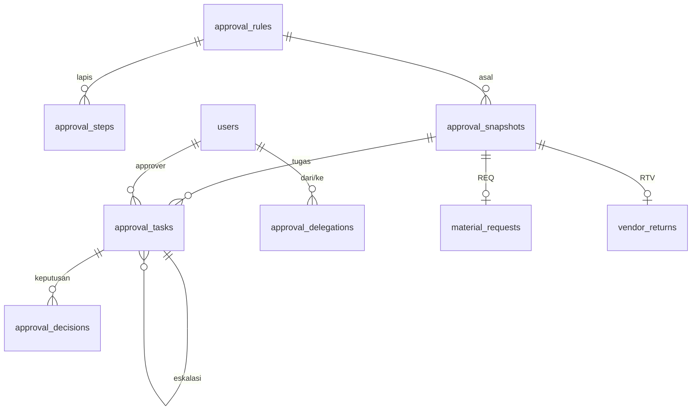

# Spesifikasi Modul — `approval` (Mesin Approval)

**Versi:** 0.5
**Tanggal:** 24 September 2026
**Status:** selesai Fase 1 — modul kedelapan setelah [Receipt/Putaway](19-receipt-putaway.md); REQ dan RTV sudah diputus lewat mesin ini; keputusan yang tidak tertulis di dokumen dicatat sebagai [A-86](04-keputusan-dan-asumsi.md#a-86)–[A-94](04-keputusan-dan-asumsi.md#a-94) (*Perlu validasi*); v0.3: ADJ dan OPN tersambung ([21-opname-penyesuaian](21-opname-penyesuaian.md), [A-96](04-keputusan-dan-asumsi.md#a-96), [A-105](04-keputusan-dan-asumsi.md#a-105)); v0.4: TRF dan RET tersambung ([22-retur-transfer](22-retur-transfer.md)); v0.5: ISU pembalik tersambung dengan lapis minimum ([23-pemakaian](23-pemakaian.md), [A-150](04-keputusan-dan-asumsi.md#a-150))
**Modul:** `approval`
**Fase:** F1 (web, delegasi, eskalasi, simulasi); approval via WhatsApp `[F2]` (Fase 2a) sebagai stub
**Dokumen terkait:** [Blueprint §8](01-blueprint.md#8-approval-engine) · [Aturan Bisnis §BR-APR](05-aturan-bisnis.md#br-apr) · [Katalog Status §3](06-katalog-status-dan-enum.md#3-enum-lain) · [Glosarium §9](03-glosarium.md#9-approval--notifikasi) · [Model data 08c](08c-model-data-pendukung.md#area-approval-engine-tenant) · [Alur 9](07b-proses-bisnis-pendukung.md#alur-9--approval-generik-semua-jenis-dokumen) · [D-17](04-keputusan-dan-asumsi.md#d-17), [D-18](04-keputusan-dan-asumsi.md#d-18), [D-28](04-keputusan-dan-asumsi.md#d-28)
**Ketergantungan modul:** `access` (user, role × cakupan, atasan langsung, jabatan), `master` (Alasan, kategori item, proyek), `warehouse`. Modul dokumen memasang diri lewat kontrak §3.9: `request`, `receipt` (RTV), `adjustment`, `count`, `transfer`, dan `return` sudah; `purchase_request`, `conversion`, `waste`, `issue`, dan modul Purchasing (PO, D-28) menyusul.

---

## 1. Tujuan & lingkup

Satu mesin approval untuk semua dokumen yang punya status `pending_approval` (alur 9). Company menyusun **aturan per jenis dokumen**: kondisi berlaku (tanpa nilai uang, [BR-APR-07](05-aturan-bisnis.md#br-apr)) dan **lapis** berurutan yang masing-masing menunjuk approver — user tertentu, jabatan, role dalam cakupan dokumen, atasan langsung pemohon, kepala gudang terkait, atau PIC proyek.

Saat dokumen diajukan, aturan yang cocok di-*snapshot* beserta approver nyatanya ([BR-APR-01](05-aturan-bisnis.md#br-apr)); approver memutus lapis demi lapis dari kotak **Tugas approval saya** atau dari halaman dokumen. Keputusan akhir dikembalikan ke modul dokumen, yang menjalankan akibatnya (REQ: reservasi lunak). Tanpa aturan, dokumen langsung disetujui ([A-08](04-keputusan-dan-asumsi.md#a-08)).

Termasuk: pemisahan tugas, orang sama di lapis berurutan, delegasi berperiode, eskalasi batas waktu dan approver nonaktif, simulasi, dan riwayat. Tidak termasuk: approval berbasis nilai uang (Purchasing, D-28), tombol WhatsApp dan token sekali pakai (Fase 2a), notifikasi in-app/email (modul notifikasi).

## 2. Aktor & permission

Permission modul disimpan dengan `module = approval`. **Keputusan** tidak memakai permission modul ini melainkan permission approve Katalog per dokumen (`request.approve`, `vendor_return.approve`, kelak `adjustment.approve`, `count.approve`, `pr.approve`, …): approver yang ditunjuk aturan harus memegangnya; yang tidak memegangnya dianggap tidak memenuhi syarat dan lapisnya dialihkan ([A-86](04-keputusan-dan-asumsi.md#a-86)).

| Role bawaan | Permission |
|---|---|
| Admin Company | semua (5) + semua permission approve dokumen |
| Manajemen | `approval_rule.view`, `approval.simulate`, `approval.delegate`; `request.approve`, `vendor_return.approve`, `adjustment.approve`, `count.approve`, `transfer.approve`, `return.approve` |
| Kepala Gudang | `approval_rule.view`, `approval.delegate`; `request.approve`, `vendor_return.approve`, `adjustment.approve`, `count.approve`, `transfer.approve`, `return.approve` |
| Auditor Internal | `approval_rule.view`; `count.approve` (BR-OPN-09, sejak v0.3) |
| Staf, Driver, Pemohon Internal, Penindak Lanjut PR, Klien, Auditor Eksternal | — |

Daftar: `approval_rule.view`, `approval_rule.manage`, `approval.simulate`, `approval.delegate`, `approval.escalate`. Kotak tugas terbuka untuk pemegang salah satu permission approve dokumen, pemegang tugas terbuka (delegat, hasil eskalasi), dan pemegang `approval.escalate` (gate `approval-inbox`).

## 3. Entitas & data

Migrasi: `database/migrations/tenant/2026_01_01_000090_create_approval_tables.php`, mengikuti [ERD 08c](08c-model-data-pendukung.md#area-approval-engine-tenant). Kolom di luar ERD sudah digenerate ulang ke ERD (§13.1).

### 3.1 `approval_rules`

`document_type` (§3.8), `name`, `priority` (kecil diperiksa dulu), `conditions` json, `is_active`. Tidak pernah dihapus, hanya dinonaktifkan (P-03).

`conditions` = `{match: all|any, warehouse_ids[], project_ids[], category_ids[], ownership_models[], line_count_min, line_qty_min, from_client, vendor_types[], purchase_request_origins[], count_types[]}`. Kondisi yang ditampilkan dibatasi per jenis dokumen (`ApprovalDocumentType::conditions()`); kunci lain dibuang saat disimpan. Kategori mengena sub-kategorinya; jumlah per baris dalam satuan dasar.

### 3.2 `approval_steps`

`step_no`, `approver_type`, `approver_ref_id` (user/jabatan/role), `decision_mode`, `backup_approver_type`, `backup_ref_id`, `timeout_hours` (bawaan 24, [A-18](04-keputusan-dan-asumsi.md#a-18)), `channel` (selalu `web` di F1), `require_pin` (stub F2).

### 3.3 `approval_snapshots`

Satu baris per pengajuan: `document_type`, `document_id`, `document_number`, `rule_id`, `rule_name`, `context` (data dokumen yang dicocokkan), `steps` (lapis setelah resolusi: `approver_user_ids`, `approver_names`, `notes`, `escalated_to_admin`), `status`, `current_step`, `submitted_by`, `submitted_at`, `decided_at`. UK(`document_type`, `document_id`, `submitted_at`) dengan waktu bermikrodetik.

### 3.4 `approval_tasks`, `approval_decisions`

Tugas: `approval_snapshot_id`, `step_no`, `approver_user_id`, `delegated_from_user_id`, `escalated_from_task_id`, `due_at`, `status`. Keputusan (append-only): `decision`, `decided_by` (kosong = sistem), `decided_at`, `channel`, `reason_code_id`, `comment`, kolom WA F2 (`wa_from_number`, `wa_message_id`, `approval_token_id`).

### 3.5 `approval_delegations`

`from_user_id`, `to_user_id`, `starts_at`, `ends_at`, `document_types` (null = semua), `is_active`, `notes`. Diakhiri, tidak dihapus.

### 3.6 `approval_tokens` — stub F2

Tabel ada ([BR-GEN-10](05-aturan-bisnis.md#br-gen)); belum ada kode yang menulisnya.

### 3.7 Kolom di tabel dokumen

`material_requests.approval_snapshot_id` kini ber-FK; `vendor_returns.approval_snapshot_id` ditambah.

### 3.8 Enum

Didaftarkan di [Katalog §3](06-katalog-status-dan-enum.md#3-enum-lain) v0.9 (sudah ada di ERD, **tanpa status dokumen baru**): `approval_document_type`, `approver_type`, `decision_mode`, `approval_snapshot_status`, `approval_task_status`, `condition_match`; `approval_decision` dan `approval_channel` sudah ada sebelumnya.

### 3.9 Kontrak dokumen (D-28)

Modul dokumen mendaftarkan satu penangan di `ApprovalRegistry` dari service provider-nya:

| Metode `ApprovalHandler` | Isi |
|---|---|
| `documentType()`, `approvePermission()` | jenis dokumen dan permission approve Katalog |
| `find()`, `findByNumber()`, `number()`, `url()`, `logName()` | membaca dokumen tanpa cakupan; log riwayat dokumen |
| `context()` | `ApprovalContext`: gudang, proyek, kategori (+ induk), kepemilikan, jumlah baris, jumlah terbesar per baris, dari klien, jenis vendor, asal PRQ, jenis opname, pemohon |
| `attachSnapshot()` | menautkan snapshot ke dokumen |
| `fallbackSteps()` | lapis minimum tanpa aturan — kosong = disetujui otomatis; titik sambung ADJ manual ([A-09](04-keputusan-dan-asumsi.md#a-09)) |
| `onApproved()`, `onRejected()` | akibat keputusan akhir di modul dokumen |

Terpasang: `material_request` → `Request\Support\RequestApprovalHandler`, `vendor_return` → `Receipt\Support\VendorReturnApprovalHandler`, `stock_adjustment` → `Adjustment\Support\StockAdjustmentApprovalHandler` (lapis minimum Kepala Gudang, A-09), `stock_count` → `Count\Support\StockCountApprovalHandler` (lapis minimum + SoD penghitung, [A-96](04-keputusan-dan-asumsi.md#a-96)), `transfer` → `Transfer\Support\TransferApprovalHandler` (gudang dokumen = gudang asal; reservasi & PCK saat disetujui, [A-107](04-keputusan-dan-asumsi.md#a-107)), `goods_return` → `Return\Support\GoodsReturnApprovalHandler` (gudang tujuan, kondisi *dari klien*; [A-111](04-keputusan-dan-asumsi.md#a-111)). TRF dan RET tanpa lapis minimum: tanpa aturan disetujui otomatis (A-08); data demo tidak memasang aturan TRF/RET.

## 4. Mesin status

Status dokumen tetap milik Katalog §2 (`pending_approval` → `approved`/`rejected`); mesin hanya memegang status snapshot dan tugas:

| Entitas | Dari | Ke | Pemicu |
|---|---|---|---|
| snapshot | — | `pending` | dokumen masuk `pending_approval` (`ApprovalEngine::submit`) |
| snapshot | — | `approved` | tanpa aturan dan tanpa lapis minimum (A-08) |
| snapshot | `pending` | `approved` | lapis terakhir terpenuhi → `onApproved` |
| snapshot | `pending` | `rejected` | satu penolakan → `onRejected` |
| snapshot | `pending` | `cancelled` | dokumen dibatalkan, klien menambah baris, atau diajukan ulang (`withdraw`) |
| tugas | — | `open` | lapis aktif; cara putus *berurutan* membuka satu per satu |
| tugas | `open` | `decided` | setuju/tolak, atau disetujui otomatis ([BR-APR-04](05-aturan-bisnis.md#br-apr)) |
| tugas | `open` | `superseded` | lapis terpenuhi oleh orang lain, dokumen ditolak/ditarik, atau dipindah ke delegat |
| tugas | `open` | `expired` | dieskalasi; tugas baru menunjuk asalnya |

| Aksi | Kelas | Permission |
|---|---|---|
| Ajukan / tarik | `Support\ApprovalEngine::submit()` / `withdraw()` | sistem (dipanggil aksi dokumen) |
| Setuju / tolak | `Actions\DecideApproval` (+ `ApproveRequest`, `ApproveVendorReturn` dari halaman dokumen) | `<dokumen>.approve` (A-86) |
| Kelola aturan | `Actions\SaveApprovalRule` (`handle`, `setActive`) | `approval_rule.manage` |
| Delegasi | `Actions\SaveDelegation` (`create`, `end`) | `approval.delegate` |
| Eskalasi manual / terjadwal | `Actions\EscalateApprovalTask` (`handle` / `runScheduled`) | `approval.escalate` / sistem |
| Simulasi | `Actions\SimulateApproval` | `approval.simulate` |

Semua keputusan lewat POST (aksi Livewire); route hanya GET halaman. Keputusan mengunci baris snapshot dan tugas (`lockForUpdate`), sehingga keputusan pertama menang ([BR-APR-09](05-aturan-bisnis.md#br-apr)).

## 5. Aturan bisnis yang berlaku

| Aturan | Ditegakkan di mana |
|---|---|
| [BR-APR-01](05-aturan-bisnis.md#br-apr) | Snapshot lapis + approver saat diajukan; ubah/nonaktifkan aturan tidak menyentuh dokumen yang menunggu |
| [BR-APR-02](05-aturan-bisnis.md#br-apr), [A-08](04-keputusan-dan-asumsi.md#a-08) | Tanpa aturan cocok: snapshot `approved` tanpa lapis, `onApproved(null)`; ADJ manual kelak lewat `fallbackSteps()` |
| [BR-APR-03](05-aturan-bisnis.md#br-apr), [BR-REQ-07](05-aturan-bisnis.md#br-req) | Pemohon/pengaju dibuang dari lapis; lapis yang hanya menunjuk pengaju dialihkan ke atasannya; keputusan pengaju ditolak mesin, delegat pun tidak boleh pengaju |
| [BR-APR-04](05-aturan-bisnis.md#br-apr) | Approver lapis berikutnya yang sudah menyetujui lapis sebelumnya disetujui otomatis dengan catatan |
| [BR-APR-05](05-aturan-bisnis.md#br-apr) | Delegasi berperiode, satu lompatan; delegasi berantai atau tumpang tindih ditolak ([A-89](04-keputusan-dan-asumsi.md#a-89)) |
| [BR-APR-06](05-aturan-bisnis.md#br-apr) | Approver nonaktif/tak berizin: saat diajukan dan oleh penjadwal → cadangan → atasan → Admin Company dengan peringatan ([A-88](04-keputusan-dan-asumsi.md#a-88), [A-90](04-keputusan-dan-asumsi.md#a-90)) |
| [BR-APR-07](05-aturan-bisnis.md#br-apr), D-07 | Kondisi hanya kuantitas, jumlah baris, gudang, proyek, kategori, kepemilikan, klien, jenis vendor, asal PRQ, jenis opname |
| [BR-APR-08](05-aturan-bisnis.md#br-apr) | `due_at` = dibuat + `timeout_hours` (bawaan 24 jam kalender); `approval:escalate` tiap jam |
| [BR-APR-09](05-aturan-bisnis.md#br-apr) | Kunci baris; tugas yang sudah diputus/digantikan menolak keputusan berikutnya |
| [BR-APR-10](05-aturan-bisnis.md#br-apr) | Stub: kolom WA dan tabel token ada, kanal selalu `web` |
| [BR-APR-11](05-aturan-bisnis.md#br-apr) | Simulasi di form aturan (draf, sebelum disimpan) dan layar simulasi, memakai perencana yang sama |
| [BR-GEN-11](05-aturan-bisnis.md#br-gen) | Tolak: Alasan (konteks penolakan) `*`, Keterangan opsional |
| [BR-REQ-12](05-aturan-bisnis.md#br-req) | Klien menambah baris saat menunggu: snapshot `cancelled`, tugas `superseded` |

## 6. Layar

| Route | Komponen | Isi |
|---|---|---|
| `/approvals` | `approval.task-inbox` | Tab *Menunggu saya*, *Sudah saya putus*, *Semua tugas terbuka* (pemegang `approval.escalate`, dengan tombol eskalasi); setujui, tolak (dialog Alasan `*` + Keterangan); tanda lewat batas, delegasi, hasil eskalasi |
| `/approval-rules` | `approval.rule-list` | Aturan per jenis, urut prioritas; ringkasan kondisi dan lapis; jumlah dokumen yang memakai; aktifkan/nonaktifkan |
| `/approval-rules/create`, `/approval-rules/{id}/edit` | `approval.rule-form` | Jenis `*`, nama `*`, prioritas `*`, aktif; kondisi sesuai jenis; lapis (approver `*`, cara putus `*`, batas waktu `*`, cadangan), urutkan/hapus lapis; **simulasi atas nomor dokumen contoh** sebelum disimpan |
| `/approval-delegations` | `approval.delegations` | Delegasi yang diberikan/diterima (Admin: semua, dan boleh atas nama orang lain); buat (delegat `*`, mulai `*`, sampai `*`, jenis dokumen, keterangan), akhiri |
| `/approval-simulation` | `approval.simulation` | Pilih jenis; dari nomor dokumen atau isian manual (gudang, proyek, kategori, kepemilikan, jumlah, pemohon, jenis vendor, klien); hasil: evaluasi tiap aturan, aturan dipakai, approver per lapis dengan catatan SoD/eskalasi |

Panel **Riwayat approval** (`approval.partials.history`) tampil di detail REQ, RTV, ADJ, OPN, TRF, dan RET (bukan di portal klien): setiap pengajuan, lapis, tugas, dan keputusan. Menu sidebar **Approval** (angka tugas terbuka pada *Tugas approval saya*) dan entri palet Ctrl+K, disaring permission.

## 7. Kejadian stok & integrasi

Mesin approval tidak menyentuh stok. Akibat stok keputusan akhir ada di penangan dokumen (REQ: reservasi lunak lewat `ManageReservation`). Jejak keputusan ditulis ke log aktivitas dokumen (`logName()`), jadi tampil di Riwayat dokumen. Modul Purchasing kelak memasang penangan `purchase_order` dengan kondisi nilai uang miliknya sendiri (D-28, [A-92](04-keputusan-dan-asumsi.md#a-92)).

## 8. Notifikasi

| Kejadian | Penerima | Kanal | Keadaan |
|---|---|---|---|
| Tugas dibuat / dialihkan | approver | in-app, email | **stub** `ApprovalNotifier::taskAssigned()` ([A-91](04-keputusan-dan-asumsi.md#a-91)); pengganti: angka di menu dan kotak tugas |
| Dokumen disetujui/ditolak | pengaju | in-app | stub `documentDecided()` |
| Tugas + tombol Setujui/Tolak | approver | WhatsApp | Fase 2a (BR-APR-10) |

## 9. Laporan & dashboard

Belum dibangun (kerangka [16-shared-laporan-berkas](16-shared-laporan-berkas.md)): tugas terbuka per approver dan umur, dokumen menunggu per jenis, rata-rata waktu putus per lapis, eskalasi per periode.

## 10. Kasus uji (Given / When / Then)

Uji di `tests/Feature/Approval`; TC-REQ dan TC-RTV yang menyentuh approval disesuaikan tanpa mengubah ID-nya (§13.3).

| ID | Given | When | Then | BR |
|---|---|---|---|---|
| TC-APR-01 | Tanpa aturan REQ | ajukan REQ lengkap | `approved`, reservasi lunak, snapshot `approved` tanpa lapis, riwayat "Disetujui otomatis" | A-08, BR-APR-02 |
| TC-APR-02 | Aturan prioritas 10 (≥3 baris), 100 (lainnya), 1 nonaktif | ajukan 1 dan 3 baris; aturan "salah satu" | aturan pertama yang cocok dipakai; nonaktif diabaikan | BR-APR-07, A-87 |
| TC-APR-03 | Konteks dokumen | cocokkan kondisi | kategori induk, jumlah baris, jumlah per baris, kepemilikan, klien, gudang; kunci uang dibuang | BR-APR-07, D-07 |
| TC-APR-04 | REQ menunggu | aturan diubah / dinonaktifkan | snapshot tetap; dokumen baru tanpa aturan disetujui otomatis | BR-APR-01 |
| TC-APR-05 | Pemohon juga Kepala Gudang | lapis role Kepala Gudang; pemohon memutus | pemohon dilewati; ditolak BR-APR-03/BR-REQ-07 | BR-APR-03 |
| TC-APR-05b | Lapis hanya menunjuk pemohon | ajukan | dialihkan ke atasan pemohon | BR-APR-03 |
| TC-APR-06 | Orang sama di lapis 1 dan 2 | setuju sekali | lapis 2 otomatis, lanjut lapis 3 | BR-APR-04 |
| TC-APR-07 | Dua lapis | approver lapis 2 lebih dulu; lalu berurutan | ditolak BR-APR-01; reservasi hanya setelah lapis akhir | D-17 |
| TC-APR-08 | Cukup salah satu | dua approver | keputusan pertama menang, kedua ditolak | BR-APR-09 |
| TC-APR-08b | Semua harus setuju | satu setuju | masih menunggu sampai semua | BR-APR-09 |
| TC-APR-08c | Berurutan | ajukan | tugas dibuka satu per satu | Blueprint §8.1 |
| TC-APR-09 | Kepala gudang CKG & kepala semua gudang | tolak tanpa/dengan alasan | ditolak / `rejected` + alasan, tugas lain ditutup; kepala gudang bercakupan didahulukan | BR-GEN-11, A-88 |
| TC-APR-10 | Delegasi aktif | ajukan; periode lewat | tugas ke delegat (`delegated`); kemudian kembali ke pemberi | BR-APR-05 |
| TC-APR-10b | Tugas terbuka | delegasi dibuat | tugas pindah ke delegat | BR-APR-05, A-89 |
| TC-APR-11 | Delegasi | ke diri sendiri, delegat tanpa izin, periode lewat, atas nama orang lain, berantai, tumpang tindih; akhiri | ditolak; diakhiri bukan dihapus; mesin satu lompatan | BR-APR-05, P-03 |
| TC-APR-12 | Tugas lewat 24 jam | `approval:escalate` | cadangan → atasan → Admin (peringatan); tugas lama `expired` + `escalated` | BR-APR-06, BR-APR-08 |
| TC-APR-13 | Approver nonaktif saat / sesudah diajukan | ajukan; penjadwal | dialihkan ke atasan | BR-APR-06 |
| TC-APR-14 | Tugas terbuka | eskalasi manual staf / Admin; tanpa tujuan | ditolak BR-GEN-09 / ke atasan / BR-APR-06 | A-90 |
| TC-APR-15 | REQ menunggu | dibatalkan | snapshot `cancelled`, tugas `superseded`, keputusan ditolak | BR-APR-09 |
| TC-APR-16 | Aturan tersimpan | simulasi dokumen, manual, draf | sama dengan hasil pengajuan; tidak menulis apa pun | BR-APR-11 |
| TC-APR-17 | Form aturan | jenis belum tersambung, tanpa lapis, rujukan kosong, batas waktu 0, ganti jenis; nonaktifkan | ditolak; tidak dihapus | D-17, P-03, BR-GEN-10 |
| TC-APR-18 | RTV | tanpa aturan / dengan aturan / tolak / batal | otomatis / kepala gudang / `rejected` / snapshot `cancelled` | A-80, A-93 |
| TC-APR-19 | Data demo | Indra ajukan REQ Genset | Andi lalu Budi; Sari & Indra ditolak; reservasi; PCK | alur 1 + 9 |
| TC-APR-20 | Role berbeda | buka lima halaman | 200/403 sesuai §2; menu & angka tugas | BR-GEN-09 |
| TC-APR-20b | Kotak tugas | setujui, tolak tanpa/dengan alasan, orang lain, eskalasi Admin | sesuai | §6 |
| TC-APR-20c | Form aturan | simulasi draf lalu simpan; nonaktifkan | aturan tersimpan tanpa kondisi kosong | BR-APR-11 |
| TC-APR-20d | Delegasi & simulasi | buat/akhiri; simulasi nomor & manual; detail REQ | panel Riwayat approval tampil | §6 |
| TC-APR-21 | DemoSeeder | jalankan dua kali | tiga aturan persis 00-akun-uji §5 | 00-akun-uji |
| TC-APR-22 | Role bawaan | periksa permission; aturan menunjuk staf | Kepala Gudang/Manajemen memegang approve; staf tak berizin dialihkan ke atasannya | A-86 |

## 11. Di luar lingkup modul ini

Approval via WhatsApp, token, PIN (Fase 2a); notifikasi in-app/email (modul notifikasi); approval berbasis nilai (Purchasing, D-28); penangan PRQ/CNV/WST (modul masing-masing; ADJ, OPN, TRF, RET, ISU sudah terpasang, termasuk lapis minimum ADJ manual A-09 dan SoD penghitung opname BR-OPN-09); laporan §9; kondisi "melebihi rencana proyek" `[F2]`.

## 12. Definisi selesai

- [x] Migrasi tenant, model, enum untuk seluruh tabel §3 (token sebagai stub)
- [x] Mesin: snapshot, lapis, cara putus, SoD, BR-APR-04, delegasi, eskalasi, penarikan
- [x] Kontrak `ApprovalHandler` + `ApprovalRegistry`; REQ dan RTV tersambung
- [x] Lima layar §6, panel riwayat di REQ/RTV, menu "Approval", palet
- [x] Perintah `approval:escalate` terjadwal tiap jam
- [x] Permission & role di `ReferenceSeeder`; aturan demo di `ApprovalDemoSeeder`
- [x] Semua TC-APR lulus; TC-REQ/TC-RTV tetap lulus; `php artisan test` hijau
- [x] Dokumen diperbarui (versi naik + changelog README)

## 13. Catatan implementasi (24 September 2026)

Domain `app/Domain/Approval`: `Contracts\ApprovalHandler`; `Support\ApprovalEngine`, `ApprovalPlanner`, `ApproverResolver`, `ConditionMatcher`, `ApprovalContext`, `ApprovalRegistry`, `ApprovalHistory`, `ApprovalNotifier` (stub); lima aksi (`DecideApproval`, `SaveApprovalRule`, `SaveDelegation`, `EscalateApprovalTask`, `SimulateApproval`); tiga policy; lima komponen Livewire; perintah `Console\EscalateApprovalsCommand`. Didaftarkan di `App\Providers\ApprovalServiceProvider` (registry singleton); penangan dokumen didaftarkan `RequestServiceProvider` dan `ReceiptServiceProvider`.

### 13.1 Penyimpangan dari spesifikasi

1. **Domain di `app/Domain/Approval`, bukan paket `packages/approval`** ([Arsitektur §4](08-arsitektur.md#4-struktur-kode)). Batas paketnya adalah kontrak §3.9: mesin tidak mengimpor modul dokumen mana pun. Dipindah ke paket saat Purchasing dibangun ([A-92](04-keputusan-dan-asumsi.md#a-92)).
2. **Kolom di luar ERD** (digenerate ulang ke [08c](08c-model-data-pendukung.md)): `approval_snapshots.document_number`, `rule_name`, `context`; `approval_delegations.notes`; `vendor_returns.approval_snapshot_id`. Waktu snapshot bermikrodetik agar UK ERD tidak bentrok saat diajukan ulang dalam detik yang sama.
3. **Keputusan memakai permission approve per dokumen**, bukan permission generik modul ([A-86](04-keputusan-dan-asumsi.md#a-86)).
4. **Notifikasi stub** ([A-91](04-keputusan-dan-asumsi.md#a-91)).

### 13.2 Keputusan implementasi

1. **Approver diresolusi saat diajukan**, bukan saat lapis aktif: SoD dan BR-APR-04 hanya bisa dinilai bila orangnya diketahui, dan simulasi harus memberi jawaban yang sama ([A-88](04-keputusan-dan-asumsi.md#a-88)). Delegasi diterapkan saat tugas dibuat.
2. **Kondisi digabung "semua" atau "salah satu"** (`condition_match`) karena aturan demo menulis "> 20 baris **atau** kategori Aset" ([A-87](04-keputusan-dan-asumsi.md#a-87)).
3. **Lapis ditulis ulang utuh saat aturan disimpan** — konfigurasi, bukan transaksi; salinan yang dipakai dokumen ada di snapshot, perubahan di audit log ([A-94](04-keputusan-dan-asumsi.md#a-94)).
4. **Tombol Setujui/Tolak di halaman dokumen hanya untuk pemegang tugas terbuka** (policy memanggil `ApprovalEngine::openTaskFor()`); Admin Company yang memegang `request.approve` tetapi tidak ditugaskan tidak lagi bisa menyetujui langsung.
5. **Eskalasi dijadwalkan tiap jam** (`routes/console.php`); perintah berjalan untuk semua company, atau hanya company aktif bila tenancy sudah diinisialisasi ([A-90](04-keputusan-dan-asumsi.md#a-90)).

### 13.3 Integrasi REQ dan RTV

- **REQ** ([14-request §13](14-request.md#13-catatan-implementasi-24-september-2026)): `SubmitRequest` (REQ internal lengkap) dan `ReviewRequest::submitToApproval` memanggil `submit()`; `CancelRequest` dan `AddRequestLines` memanggil `withdraw()`; `ApproveRequest` kini mencatat keputusan lapis lewat `DecideApproval`; reservasi pindah ke `RequestApprovalHandler::onApproved()`. Uji fixture yang dulu menyetujui langsung kini mengandalkan persetujuan otomatis tanpa aturan; uji approval (TC-REQ-05, -11–16, -17, -26d, -26e) memasang aturan satu lapis — ID tidak berubah.
- **RTV** ([19-receipt-putaway §13](19-receipt-putaway.md#13-catatan-implementasi-24-september-2026)): `CreateVendorReturn` memanggil `submit()`, `CancelVendorReturn` memanggil `withdraw()`, `ApproveVendorReturn` lewat `DecideApproval`. Tanpa aturan RTV langsung disetujui ([A-93](04-keputusan-dan-asumsi.md#a-93)); demo memasang aturan "RTV — kepala gudang". TC-RTV-01, -03–07, -09 memasang aturan itu.

### 13.4 Sisa pekerjaan

1. Penangan PRQ, CNV, WST — bersama modulnya. ADJ dan OPN sudah terpasang (v0.3, [21-opname-penyesuaian](21-opname-penyesuaian.md)); TRF dan RET (v0.4, [22-retur-transfer](22-retur-transfer.md)); ISU pembalik (v0.5, [23-pemakaian](23-pemakaian.md): `Issue\Support\MaterialIssueApprovalHandler`, lapis minimum Kepala Gudang Gudang Site → Manajemen, dokumen tetap `draft` selama menunggu, [A-150](04-keputusan-dan-asumsi.md#a-150)).
2. Notifikasi in-app/email saat tugas dibuat/dialihkan dan saat dokumen diputus (modul notifikasi); WhatsApp Fase 2a.
3. Laporan §9.
4. Tautan dokumen di kotak tugas mengikuti cakupan pembaca: approver di luar cakupan dokumen (mis. "user tertentu") memutus dari kotak tugas tanpa membuka halaman dokumen.
