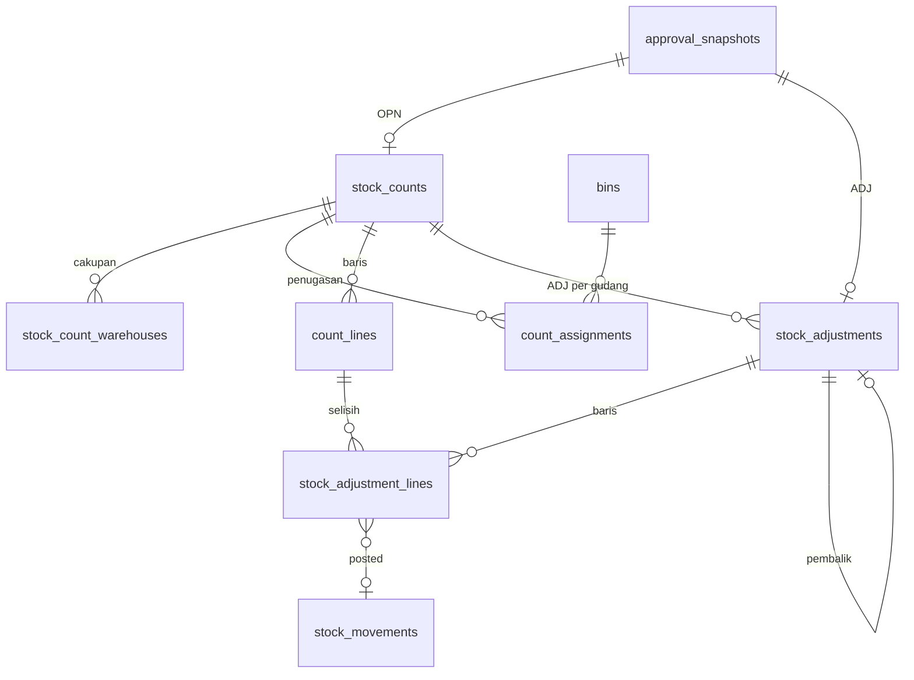

# Spesifikasi Modul — `count`, `adjustment` (Stock Opname & Penyesuaian Stok)

**Versi:** 0.3
**Tanggal:** 24 September 2026
**Status:** selesai Fase 1 — modul kesembilan setelah [Approval](20-approval.md); OPN dan ADJ manual diputus lewat mesin approval; keputusan yang tidak tertulis di dokumen dicatat sebagai [A-95](04-keputusan-dan-asumsi.md#a-95)–[A-105](04-keputusan-dan-asumsi.md#a-105) (*Perlu validasi*); v0.3: asal `asset_lost` tersambung dari modul Aset ([25-aset](25-aset.md), [A-167](04-keputusan-dan-asumsi.md#a-167))
**Modul:** `count` (OPN), `adjustment` (ADJ)
**Fase:** F1 (sesi bulanan/tahunan/ad-hoc/pemeriksaan mendadak, hitung buta, hitung ulang, approval sesi, ADJ manual & pembalik); cycle count ABC, PWA luring, auditor eksternal berbatas periode `[F2]`
**Dokumen terkait:** [Blueprint §9](01-blueprint.md#9-stock-opname--audit) · [Aturan Bisnis §BR-OPN](05-aturan-bisnis.md#br-opn), [§BR-LED](05-aturan-bisnis.md#br-led) · [Katalog Status §2.12, §2.13, §3](06-katalog-status-dan-enum.md) · [Glosarium §8](03-glosarium.md#8-stock-opname) · [Model data 08c](08c-model-data-pendukung.md#area-stock-opname--penyesuaian-tenant) · [Alur 8](07b-proses-bisnis-pendukung.md#alur-8--stock-opname-sesi-hitung-buta-hitung-ulang-rekonsiliasi) · [D-22](04-keputusan-dan-asumsi.md#d-22), [D-23](04-keputusan-dan-asumsi.md#d-23), [A-09](04-keputusan-dan-asumsi.md#a-09), [A-42](04-keputusan-dan-asumsi.md#a-42), [A-46](04-keputusan-dan-asumsi.md#a-46), [A-67](04-keputusan-dan-asumsi.md#a-67)
**Ketergantungan modul:** `stock` (`StockLedger` satu-satunya pintu tulis saldo, `LockStockPeriod`), `warehouse` (bin, pembekuan, penanda hitung), `master` (item, lot/serial/potongan, Alasan, toleransi kategori), `access` (role × cakupan, atasan), `approval` (kontrak §3.9 [20-approval](20-approval.md)).

---

## 1. Tujuan & lingkup

**Stock opname (OPN)** membandingkan saldo fisik per bin dengan hitungan fisik: Kepala Gudang atau Auditor merencanakan sesi (jenis, cakupan gudang/zona/bin/item, tim, pembekuan), sistem membekukan bin dan mengambil snapshot, penghitung menghitung **buta** dari halaman ramah HP, selisih diklasifikasi kecil/sedang/besar dengan ambang relatif **dan** absolut, selisih sedang dihitung ulang oleh orang lain, selisih besar wajib akar masalah, lalu hasil sesi diajukan ke approval. Setelah disetujui, satu ADJ per gudang diposting ke kartu stok, bin dibuka, sesi ditutup, dan sesi bulanan mengunci periode stok.

**Penyesuaian stok (ADJ)** manual mengoreksi stok ± per bin/lot/serial/potongan dengan Alasan wajib, selalu lewat minimal satu lapis approval ([A-09](04-keputusan-dan-asumsi.md#a-09)), dan dikoreksi hanya lewat ADJ pembalik.

Tidak termasuk: cycle count ABC `[F2]`, antrean tinjauan PWA luring ([BR-OPN-03](05-aturan-bisnis.md#br-opn) `[F2]`), override SJ mendesak dari bin beku (§13.3), write-off aset dan ADJ dari DSC ([A-98](04-keputusan-dan-asumsi.md#a-98)), nilai uang (D-07).

## 2. Aktor & permission

Permission disimpan dengan `module = count` dan `module = adjustment`. Katalog menulis `create/start/reconcile/approve/cancel` (OPN) dan `create/approve/cancel` (ADJ); `count.view`, `count.assign`, `count.record`, `adjustment.view` ditambah ([A-95](04-keputusan-dan-asumsi.md#a-95)). Keputusan approval memakai `count.approve` / `adjustment.approve` ([A-86](04-keputusan-dan-asumsi.md#a-86)).

| Role bawaan | Permission |
|---|---|
| Admin Company | semua (12) |
| Manajemen | `count.view`, `count.approve`, `adjustment.view`, `adjustment.approve` |
| Kepala Gudang | semua `count.*` (8) dan `adjustment.*` (4) |
| Staf Gudang | `count.view`, `count.record`, `adjustment.view`, `adjustment.create`, `adjustment.cancel` |
| Auditor Internal | semua `count.*` (8), `adjustment.view` — read-only terhadap mutasi ([BR-OPN-08](05-aturan-bisnis.md#br-opn)) |
| Auditor Eksternal `[F2]` | `count.view`, `count.record`, `adjustment.view` |
| Driver, Pemohon Internal, Penindak Lanjut PR, Klien | — |

Daftar: `count.view`, `count.create`, `count.start`, `count.assign`, `count.record`, `count.reconcile`, `count.approve`, `count.cancel`, `adjustment.view`, `adjustment.create`, `adjustment.approve`, `adjustment.cancel`. Cakupan gudang (BR-ACC-05): ADJ lewat `ScopedToUser` (`warehouse_id`); sesi OPN terlihat bila minimal satu gudangnya ada di cakupan pengguna.

## 3. Entitas & data

Migrasi: `database/migrations/tenant/2026_01_01_000100_create_count_adjustment_tables.php`, mengikuti [ERD 08c](08c-model-data-pendukung.md#area-stock-opname--penyesuaian-tenant); kolom di luar ERD sudah digenerate ulang ([A-104](04-keputusan-dan-asumsi.md#a-104)). Model: `Count\Models\StockCount`, `CountAssignment`, `CountLine`; `Adjustment\Models\StockAdjustment`, `StockAdjustmentLine`.

### 3.1 `stock_counts` — OPN

`number` (`OPN/<gudang|ALL>/<yymm>/<urut>`, BR-GEN-06), `count_type`, `status`, `freeze_bins` (selalu `false` untuk `spot_check`), `scope` json `{warehouse_ids, zone_ids, bin_ids, item_ids}`, `team_user_ids` json, `is_audit` (dibuat Auditor), `planned_start`, `created_by`, `started_at`, `submitted_by` + `reconciled_at` (perekonsiliasi = pengaju approval), `approved_by/at`, `reject_reason_id` (penolakan terakhir), `closed_at`, `lock_date_set`, `report_attachment_id` (stub), `approval_snapshot_id`, `cancel_reason_id`, `notes`. Gudang cakupan juga di `stock_count_warehouses` (PK sesi × gudang, `stock_adjustment_id` = ADJ gudang itu).

### 3.2 `count_assignments`, `count_lines`

Penugasan: `bin_id`, `counter_user_id` (kosong = belum ditugaskan), `round` (1/2), `status` (`pending`/`done`), `counted_at`; UK(sesi, bin, putaran). Baris: bin × item × lot/serial/potongan × `stock_status`, `system_qty` (snapshot), `counted_qty_r1/r2`, `is_recount`, `final_qty`, `variance_qty`, `variance_pct`, `variance_class`, `root_cause`, `note`, `is_unexpected` (temuan), `device_id` (stub PWA).

### 3.3 `stock_adjustments`, `stock_adjustment_lines` — ADJ

Header: `number` (`ADJ/<gudang>/<yymm>/<urut>`), `warehouse_id`, `origin` (`manual`/`count`/`asset_lost`; `discrepancy` stub), `stock_count_id`, `reversal_of_id`, `reason_code_id` (konteks `adjustment`), `status`, `submitted_by`, `approval_snapshot_id`, `approved_by/at`, `reject_reason_id`, `posted_at`, `cancel_reason_id`, `notes`. Baris: `bin_id`, `item_id`, `lot_id/serial_id/piece_id`, isian turunan baru `lot_no`, `expiry_date`, `serial_no`, `piece_length` (dibuat saat posting), `qty_delta` (±), `stock_status`, `count_line_id`, `reversal_of_line_id`, `reason_code_id`, `movement_id`, `notes`.

### 3.4 Enum

Status tetap dari Katalog §2.12 dan §2.13 (**tanpa status baru**). Enum `count_type`, `variance_class`, `root_cause_category` sudah ada; didaftarkan di [Katalog §3](06-katalog-status-dan-enum.md#3-enum-lain) v0.10: `count_assignment_status` (`pending`/`done`) dan `adjustment_origin` (sudah ada di ERD).

## 4. Mesin status

Tabel transisi di Katalog §2.12–§2.13; di sini hanya implementasinya. Semua transisi lewat aksi Livewire (POST); route hanya GET halaman dan laporan PDF.

| Transisi | Implementasi | Efek samping |
|---|---|---|
| OPN — → `planned` | `Count\Actions\CreateStockCount` | nomor; `is_audit` bila pembuat Auditor |
| `planned → in_progress` | `StartStockCount` | guard PCK berjalan & bin beku sesi lain (BR-OPN-02); `ChangeBinStatus::freeze`; snapshot `count_lines`; penugasan putaran 1 bergiliran, bin ber-`count_flag` dulu |
| — | `AssignCounter` (`count.assign`) | ganti penghitung; putaran 2 ≠ penghitung putaran 1 |
| — | `RecordCount::save/addLine/finish` (`count.record`) | hitung buta; setelah `finish` → `CountProgress::evaluate` |
| `in_progress → recount` | otomatis `CountProgress` | semua bin putaran 1 selesai + ada selisih sedang → penugasan putaran 2 ke anggota tim lain |
| — | `RecordCountRootCause` (`count.reconcile`) | akar masalah + catatan per baris |
| `in_progress`/`recount → reconciling` | `ReconcileStockCount` | guard semua terhitung & akar masalah besar; draf ADJ per gudang (`submitted`, kecuali spot check); `ApprovalEngine::submit` |
| `reconciling` (ditolak) | `StockCountApprovalHandler::onRejected` | tetap `reconciling`, Alasan dicatat; ajukan ulang lewat `ReconcileStockCount` ([A-97](04-keputusan-dan-asumsi.md#a-97)) |
| `reconciling → approved → closed` | `ApproveStockCount` / kotak tugas → `StockCountApprovalHandler::onApproved` → `StockCountCloser` | bin dibuka; ADJ `approved → posted`; `count_flag`; kunci periode bulanan ([A-101](04-keputusan-dan-asumsi.md#a-101)) |
| `planned → cancelled` | `CancelStockCount` | Alasan `*` |
| ADJ — → `submitted → pending_approval` | `Adjustment\Actions\CreateStockAdjustment::handle` / `reverse` | `ApprovalEngine::submit`; lapis minimum Kepala Gudang ([A-09](04-keputusan-dan-asumsi.md#a-09)) |
| `pending_approval → approved → posted` | `ApproveStockAdjustment` / kotak tugas → `StockAdjustmentApprovalHandler` → `AdjustmentPoster` | ledger ± per baris, kejadian `stock_adjusted` |
| `pending_approval → rejected` | sama | Alasan `*` |
| `submitted`/`pending_approval → cancelled` | `CancelStockAdjustment` | hanya ADJ manual; snapshot `cancelled` |

**Penangan approval** (kontrak [20-approval §3.9](20-approval.md#39-kontrak-dokumen-d-28)): `stock_count` → `Count\Support\StockCountApprovalHandler` (konteks: gudang, jenis opname, kategori & kepemilikan baris berselisih, jumlah baris, selisih terbesar; SoD: penghitung + perekonsiliasi + Kepala Gudang cakupan untuk sesi tahunan/audit; lapis minimum [A-96](04-keputusan-dan-asumsi.md#a-96)); `stock_adjustment` → `Adjustment\Support\StockAdjustmentApprovalHandler` (konteks: gudang, kategori, kepemilikan, jumlah baris, |qty| terbesar; lapis minimum Kepala Gudang, cadangan Manajemen).

## 5. Aturan bisnis yang berlaku

| Aturan | Ditegakkan di mana |
|---|---|
| [BR-OPN-01](05-aturan-bisnis.md#br-opn) | Snapshot = `stock_balances` > 0 di bin fisik cakupan, termasuk Loading Area dan yang dicadangkan ([A-100](04-keputusan-dan-asumsi.md#a-100)) |
| [BR-OPN-02](05-aturan-bisnis.md#br-opn) | `StartStockCount` menolak bila ada PCK `in_progress` di bin cakupan atau bin dibeku sesi lain; bin beku menolak pergerakan (`StockLedger`), PCK mulai (`ProcessPickTask`), dan ADJ baru. Override SJ mendesak belum ada (§13.3) |
| [BR-OPN-04](05-aturan-bisnis.md#br-opn), [A-42](04-keputusan-dan-asumsi.md#a-42) | `VarianceClassifier`: kecil ≤ ambang relatif **dan** absolut (1 % / 1 unit), sedang ≤ 5 %, selebihnya besar; ambang kategori menang ([A-99](04-keputusan-dan-asumsi.md#a-99)) |
| [BR-OPN-05](05-aturan-bisnis.md#br-opn) | Putaran 2 otomatis ke anggota tim lain; `AssignCounter` menolak penghitung pertama; hanya penghitung yang ditugaskan yang bisa mengisi |
| [BR-OPN-06](05-aturan-bisnis.md#br-opn), [A-09](04-keputusan-dan-asumsi.md#a-09) | Satu ADJ per gudang berselisih; ADJ opname tidak diajukan sendiri, diposting saat sesi disetujui |
| [BR-OPN-07](05-aturan-bisnis.md#br-opn) | `ReconcileStockCount` menolak selisih besar tanpa akar masalah |
| [BR-OPN-08](05-aturan-bisnis.md#br-opn) | Auditor Internal: buat/mulai/hitung/rekonsiliasi/setujui sesi; tanpa `adjustment.create` |
| [BR-OPN-09](05-aturan-bisnis.md#br-opn) | SoD di konteks approval + guard `ApproveStockCount` (penghitung ditolak); sesi tahunan/audit ke Auditor Internal/Manajemen ([A-96](04-keputusan-dan-asumsi.md#a-96)) |
| [BR-OPN-10](05-aturan-bisnis.md#br-opn) | `spot_check`: tanpa pembekuan, wajib daftar bin/item, klasifikasi sama, tanpa ADJ; bin berselisih besar diberi `count_flag` |
| [BR-STK-15](05-aturan-bisnis.md#br-stk) | Sesi bulanan `closed` → `LockStockPeriod` ke sehari sebelum sesi mulai (hanya maju); posting ADJ di periode terkunci ditolak buku besar |
| [BR-STK-01](05-aturan-bisnis.md#br-stk), [BR-LED-01–06](05-aturan-bisnis.md#br-led) | ADJ bergerak hanya lewat `StockLedger::post()`/`reverse()`; pembalik sekali per baris; kejadian di outbox dalam transaksi yang sama |
| [BR-STK-06](05-aturan-bisnis.md#br-stk) | Baris kurangi diperiksa saat diajukan dan saat diposting |
| [BR-GEN-02](05-aturan-bisnis.md#br-gen), [BR-GEN-11](05-aturan-bisnis.md#br-gen) | Alasan dokumen ADJ wajib (konteks penyesuaian); tolak/batal: Alasan `*` + Keterangan opsional |
| [BR-GEN-03](05-aturan-bisnis.md#br-gen) | ADJ `posted` tidak bisa dibatalkan; koreksi lewat ADJ pembalik (`reversal_of_id`) ([A-102](04-keputusan-dan-asumsi.md#a-102)) |
| [BR-APR-01–09](05-aturan-bisnis.md#br-apr) | Lewat mesin approval; hasil yang sedang diputus tidak bisa diubah |
| [A-67](04-keputusan-dan-asumsi.md#a-67) | Bin ber-`count_flag` didahulukan di form dan urutan penugasan; dilepas setelah dihitung |

## 6. Layar

| Route | Komponen | Isi |
|---|---|---|
| `/counts` | `count.count-list` | Kartu ringkasan (sedang dihitung, menunggu rekonsiliasi/approval, ditutup), cari, filter status/jenis; kolom akurasi dan jumlah selisih besar (setelah rekonsiliasi) — dashboard konsolidasi versi F1 |
| `/counts/create` | `count.count-form` | Jenis `*`, rencana mulai, pembekuan, gudang `*`, zona, bin (bin ⚑ perlu dihitung di atas), item, tim penghitung `*`, keterangan |
| `/counts/{id}` | `count.count-detail` | Mulai, penugasan (ganti penghitung), tabel rekonsiliasi — sistem, hitung 1/2, selisih, kelas, akar masalah — disembunyikan bagi yang masih menghitung ([A-103](04-keputusan-dan-asumsi.md#a-103)), rekonsiliasi & ajukan/ajukan ulang, setujui/tolak (dialog Alasan `*`), batal, laporan PDF, ADJ sesi, *Riwayat approval*, riwayat |
| `/counts/{id}/report` | `CountController@report` | PDF (dompdf) setelah sesi disetujui/ditutup |
| `/count-tasks` | `count.my-tasks` | **Ramah HP**: penugasan terbuka milik pengguna, bin ⚑ dulu, tanpa angka |
| `/count-tasks/{id}` | `count.count-entry` | **Ramah HP, hitung buta**: satu kartu per barang, isian jumlah besar (serial/potongan: Ada/Tidak ada), simpan sementara, temuan barang di luar daftar, selesai hitung bin |
| `/adjustments` | `adjustment.adjustment-list` | Cari, filter status/asal; asal (manual/opname/pembalik) |
| `/adjustments/create` | `adjustment.adjustment-form` | Gudang `*`, Alasan `*`, keterangan; baris: arah `*`, bin `*`, item `*`, kondisi, jumlah `*`, lot/serial/potongan sesuai mode. `?reversal_of=<id>` = form ADJ pembalik |
| `/adjustments/{id}` | `adjustment.adjustment-detail` | Baris ± dan pergerakan kartu stok; setujui/tolak, batal, *Buat ADJ pembalik*; *Riwayat approval* (ADJ manual), riwayat |

Menu sidebar **Opname & penyesuaian** (Stock opname · Hitungan saya · Penyesuaian stok) dan entri palet Ctrl+K (termasuk *Sesi opname baru*, *Penyesuaian baru*), disaring permission. Tugas approval OPN/ADJ tampil di *Tugas approval saya*.

## 7. Kejadian stok & integrasi

| Kejadian | Transisi pemicu | Rujukan |
|---|---|---|
| `stock_adjusted` (satu per baris, `movement_id`) | ADJ `posted` (manual atau hasil OPN); payload `adjustment_origin`, `direction`, `reason_code`, `count_session_ref` bila dari OPN | [Matriks §14](05-aturan-bisnis.md#14-matriks-kejadian-stok) |
| `stock_adjusted` pembalik (`reverses_event_id`) | ADJ pembalik `posted` | BR-GEN-03 |
| — | pembekuan/pembukaan bin, penanda hitung | log `warehouse` |

DSC `adjusted` tetap memposting sendiri dengan `delivery_discrepancy` ([A-98](04-keputusan-dan-asumsi.md#a-98)). `StockLedger::reverse()` kini menerima jenis/payload kejadian dan rujukan dokumen pembalik ([13-stock §13](13-stock.md#13-catatan-implementasi-24-september-2026)).

## 8. Notifikasi

| Kejadian | Penerima | Kanal | Keadaan |
|---|---|---|---|
| Tugas approval OPN/ADJ | approver | in-app, email | stub `ApprovalNotifier` ([A-91](04-keputusan-dan-asumsi.md#a-91)); angka di menu *Tugas approval saya* |
| Penugasan hitung | penghitung | in-app | belum; daftar *Hitungan saya* |
| Pengingat jadwal opname | Kepala Gudang | email | belum (scheduler, [Arsitektur §3](08-arsitektur.md#3-tenancy--siklus-request)) |

## 9. Laporan & dashboard

F1: ringkasan dan akurasi per sesi di `/counts`, laporan PDF per sesi. Belum: dashboard tren akurasi, top selisih, akar masalah per periode, laporan ADJ per alasan (kerangka [16-shared-laporan-berkas](16-shared-laporan-berkas.md)).

## 10. Kasus uji (Given / When / Then)

Uji di `tests/Feature/Count` (36 uji). Fixture `Concerns\CountFixtures`: gudang CKG, empat item (tiap mode pelacakan) bersaldo, Kepala Gudang, dua staf, Auditor Internal, Manajemen.

| ID | Given | When | Then | BR |
|---|---|---|---|---|
| TC-OPN-01 | Gudang CKG, tim staf | buat bulanan, spot check, lintas gudang, cycle ABC, tim kosong/driver/luar gudang | `planned`, `OPN/CKG/…`; spot check tanpa beku & wajib bin/item; `ALL`; ditolak sesuai aturan; sesi Auditor = audit | BR-OPN-10, BR-GEN-06, BR-GEN-09 |
| TC-OPN-02 | Saldo di bin simpan & Loading Area, bin ⚑ | mulai sesi seluruh gudang | bin fisik beku, bin virtual tidak; snapshot per lot/serial/potongan; bin ⚑ pertama; penugasan bergiliran | BR-OPN-01, BR-OPN-02, A-67 |
| TC-OPN-03 | PCK `in_progress` di bin cakupan | mulai sesi beku / spot check | ditolak BR-OPN-02 / spot check jalan tanpa beku | BR-OPN-02, BR-OPN-10 |
| TC-OPN-04 | Bin beku | posting masuk/keluar/pindah; PCK mulai | ditolak BR-OPN-02; bin luar cakupan bebas | BR-OPN-02 |
| TC-OPN-05 | Sesi berjalan | penghitung/staf/kepala melihat; orang lain mengisi; angka negatif | angka tersembunyi bagi penghitung; ditolak BR-OPN-05 / BR-LED-02 | Blueprint §9, A-103 |
| TC-OPN-06 | Penugasan bin B | selesai dengan baris kosong; serial; temuan baut/serial/lot tak dikenal/lot tercatat | ditolak; serial = ada/tidak; temuan tercatat `system 0`; ditolak BR-LED-03/BR-OPN-01 | A-100 |
| TC-OPN-07 | Ambang bawaan & kategori | klasifikasi | kecil/sedang/besar; sistem nol = besar; kategori induk menang; `count_moderate_pct` | BR-OPN-04, A-99 |
| TC-OPN-08 | Selisih sedang | putaran 1 selesai; tugaskan ulang | `recount`, putaran 2 ke orang lain; penghitung pertama ditolak; akhir = putaran 2 | BR-OPN-05 |
| TC-OPN-09 | Selisih besar tanpa sedang | putaran 1 selesai | tetap `in_progress`; kelas & selisih terisi | BR-OPN-04 |
| TC-OPN-10 | Belum/sudah terhitung | rekonsiliasi tanpa/dengan akar masalah | BR-OPN-05/BR-OPN-07; `reconciling`, draf ADJ `submitted` tanpa approval sendiri; lapis minimum ke atasan perekonsiliasi | BR-OPN-06, BR-OPN-07, A-96 |
| TC-OPN-11 | Sesi direkonsiliasi | Kepala Gudang setuju | `closed`; ADJ `posted`; saldo = hitungan; 2 kejadian `stock_adjusted` + `count_session_ref`; bin dibuka; ⚑ dilepas; saldo = kartu stok | BR-OPN-06, BR-STK-01, A-101 |
| TC-OPN-12 | Menunggu approval | ubah akar masalah; tolak tanpa/dengan alasan; ajukan ulang | BR-APR-01; BR-GEN-11; tetap `reconciling`, bin beku; ADJ lama `cancelled`, baru `posted` | A-97 |
| TC-OPN-13 | Aturan tahunan → Auditor | Kepala Gudang menghitung bulanan; sesi tahunan | penghitung dialihkan ke atasan & ditolak BR-OPN-09; tahunan ke Auditor, Kepala Gudang ditolak BR-APR-03 | BR-OPN-09 |
| TC-OPN-13b | Tanpa aturan | sesi tahunan diajukan Auditor | lapis minimum Auditor → atasannya; Kepala Gudang cakupan & penghitung di daftar SoD | A-96 |
| TC-OPN-14 | Aturan audit | spot check oleh Auditor | tanpa beku, tanpa ADJ, auditor lain menyetujui, stok tetap, bin berselisih besar ⚑ | BR-OPN-10, A-101 |
| TC-OPN-14b | Sesi bulanan | ditutup; sesi bulanan lebih lama | `stock_lock_date` = sehari sebelum mulai; tidak mundur; tanpa selisih tanpa ADJ | BR-STK-15 |
| TC-OPN-15 | Sesi `planned` / berjalan | batal tanpa/dengan alasan | BR-GEN-11 / `cancelled` / ditolak | Katalog §2.13 |
| TC-OPN-16 | Sesi ad-hoc Auditor | rekonsiliasi Auditor | ke Manajemen, disetujui, saldo terkoreksi | BR-OPN-08, BR-OPN-09 |
| TC-OPN-17 | Data demo | sesi tahunan CKG: Dedi & Eko hitung, hitung ulang orang lain, Andi rekonsiliasi | aturan demo → Kartika; Andi/Dedi BR-APR-03, Sari BR-APR-01; Kartika setuju → ditutup, saldo terkoreksi lewat ledger & kejadian | alur 8 + 9 |
| TC-OPN-18 | Role berbeda | buka halaman; PDF sebelum/sesudah | 200/403 sesuai §2; PDF 403 lalu `application/pdf` | BR-GEN-09 |
| TC-OPN-18b | Layar | form → detail mulai → ganti penghitung → hitung HP (tanpa angka) → rekonsiliasi (akar masalah) → setuju | berjalan dari layar; angka tersembunyi bagi penghitung | §6 |
| TC-OPN-18c | Layar | batal & tolak lewat dialog; staf setujui | Alasan wajib; 403 | BR-GEN-11 |
| TC-OPN-19 | Kepala Gudang / staf / driver | buka beranda | menu & palet sesuai izin | §6 |
| TC-ADJ-01 | Tanpa aturan | ajukan ADJ manual | `pending_approval`, `ADJ/CKG/…`, tugas Kepala Gudang, stok belum bergerak | A-09 |
| TC-ADJ-02 | Baris salah | alasan kosong, melebihi saldo, jumlah 0, bin virtual, lot kosong, lot baru tanpa kedaluwarsa, serial masih di bin, potongan tanpa panjang, arah kosong, tanpa baris, bin beku | ditolak BR-GEN-02/BR-STK-06/BR-LED-02/BR-SJ-10/BR-LED-03/BR-STK-12/BR-LED-04/BR-STK-09/BR-GEN-11/BR-OPN-02 | A-102 |
| TC-ADJ-03 | ADJ 6 baris (±, lot/serial/potongan baru, rusak) | disetujui | `posted`; saldo sesuai; turunan dibuat saat posting; `movement_id`; 6 kejadian `stock_adjusted` beralasan | BR-LED-01–06 |
| TC-ADJ-04 | Pengaju = Kepala Gudang | pengaju/staf lain memutus | BR-APR-03 / BR-APR-01; lapis ke atasan | BR-APR-03 |
| TC-ADJ-05 | Aturan > 100 unit dua lapis | 100 vs 150 unit | "ADJ lainnya" / Kepala Gudang lalu Manajemen; posting setelah lapis 2 | BR-APR-07, A-105 |
| TC-ADJ-06 | ADJ menunggu | tolak tanpa/dengan alasan | BR-GEN-11 / `rejected`, tanpa pergerakan | BR-GEN-11 |
| TC-ADJ-07 | ADJ manual/posted/opname | batal | `cancelled` + snapshot `cancelled` / BR-GEN-03 / BR-OPN-06 | Katalog §2.12 |
| TC-ADJ-08 | ADJ `posted` | pembalik dua kali; pembalik dibalik | pembalik butuh approval, membalik pergerakan (`reverses_movement_id`, `reverses_event_id`); kedua ditolak BR-LED-05 | BR-GEN-03, BR-LED-05 |
| TC-ADJ-09 | `stock_lock_date` = hari ini | setujui | ditolak BR-STK-15, keputusan dibatalkan seluruhnya | BR-STK-15 |
| TC-ADJ-10 | Role berbeda | buka halaman | 200/403 sesuai §2; panel riwayat approval | BR-GEN-09 |
| TC-ADJ-10b | Layar | form 2 baris → detail setuju → form pembalik → pembalik kedua | berjalan; pengaju 403; pembalik kedua 403 | §6 |
| TC-ADJ-10c | Layar | tolak & batal lewat dialog | Alasan wajib; status sesuai | BR-GEN-11 |
| TC-ADJ-11 | Data demo | Dedi ajukan −150 & +20 baut CKG | "ADJ di atas 100 unit": Sari BR-APR-01, Andi lalu Budi → posted; +20 cukup Andi | 00-akun-uji §5 |

## 11. Di luar lingkup modul ini

Cycle count ABC dan jadwal otomatis `[F2]`; PWA luring & antrean tinjauan `[F2]`; auditor eksternal berbatas gudang & periode `[F2]`; override SJ mendesak dari bin beku (§13.3); ADJ dari DSC dan write-off aset (modul Aset); notifikasi in-app/email; laporan tren §9.

## 12. Definisi selesai

- [x] Migrasi tenant, model, enum untuk seluruh tabel §3; ERD digenerate ulang
- [x] Mesin status Katalog §2.12–§2.13 tanpa status baru
- [x] Penangan approval OPN & ADJ terdaftar; aturan demo §5 diseed
- [x] Buku besar satu-satunya pintu stok; kejadian `stock_adjusted`; pembalik BR-LED-05
- [x] Delapan layar §6 (dua ramah HP), menu, palet, panel riwayat approval
- [x] 12 permission & role di `ReferenceSeeder`
- [x] Semua TC-OPN & TC-ADJ lulus; `php artisan test` hijau
- [x] Dokumen diperbarui (versi naik + changelog README)

## 13. Catatan implementasi (24 September 2026)

Domain `app/Domain/Count` (7 aksi, `Support\CountScope`, `VarianceClassifier`, `CountProgress`, `CountVisibility`, `StockCountCloser`, `StockCountApprovalHandler`, 2 policy, 5 komponen Livewire) dan `app/Domain/Adjustment` (3 aksi, `Support\AdjustmentLines`, `AdjustmentPoster`, `StockAdjustmentApprovalHandler`, 1 policy, 3 komponen Livewire), mengikuti [Arsitektur §4](08-arsitektur.md#4-struktur-kode) (`Count/`, `Adjustment/`). Provider `CountServiceProvider`, `AdjustmentServiceProvider`; controller `Count\CountController`, `Adjustment\AdjustmentController`.

### 13.1 Penyimpangan dari spesifikasi

1. **Permission tambahan** `count.view`, `count.assign`, `count.record`, `adjustment.view` ([A-95](04-keputusan-dan-asumsi.md#a-95)).
2. **Kolom di luar ERD** ([A-104](04-keputusan-dan-asumsi.md#a-104)), digenerate ulang ke [08c](08c-model-data-pendukung.md); `report_attachment_id` tanpa FK (tabel lampiran belum ada).
3. **OPN tanpa `rejected`**: penolakan mengembalikan ke perekonsiliasi dalam `reconciling` ([A-97](04-keputusan-dan-asumsi.md#a-97)).
4. **ADJ dari DSC tidak dibuat**; DSC tetap memposting sendiri ([A-98](04-keputusan-dan-asumsi.md#a-98)).
5. **`StockLedger::reverse()` diperluas** (jenis & payload kejadian, rujukan dokumen pembalik) dan `emit()` mengisi kolom `stock_events.reverses_event_id`; kontrak `post()` tetap.

### 13.2 Keputusan implementasi

1. **Approval sesi minimal satu lapis dan SoD lewat konteks** ([A-96](04-keputusan-dan-asumsi.md#a-96)); tanpa mengubah mesin approval — hanya `ApprovalDocumentType::conditions()` untuk ADJ dan penangkap galat layar.
2. **Klasifikasi & hitung ulang** ([A-99](04-keputusan-dan-asumsi.md#a-99)), **cakupan & snapshot** ([A-100](04-keputusan-dan-asumsi.md#a-100)), **penutupan** ([A-101](04-keputusan-dan-asumsi.md#a-101)), **baris ADJ & pembalik** ([A-102](04-keputusan-dan-asumsi.md#a-102)), **batas hitung buta** ([A-103](04-keputusan-dan-asumsi.md#a-103)).
3. **Urutan saat disetujui:** bin dibuka lebih dulu (buku besar menolak bin beku), lalu ADJ diposting dengan `occurred_at` = saat disetujui (koreksi di periode berjalan, BR-STK-15), lalu kunci periode dimajukan. Selisih dihitung dari snapshot; bila bin tidak dibeku dan saldo berubah sejak snapshot, posting kurangi yang melebihi saldo ditolak buku besar dan keputusan dibatalkan.
4. **Auditor Internal** kini memegang `count.approve` sehingga melihat *Tugas approval saya* (TC-APR-20 disesuaikan, ID tetap); aturan demo ADJ/OPN diseed ([A-105](04-keputusan-dan-asumsi.md#a-105), TC-APR-21: enam aturan).

### 13.3 Sisa pekerjaan

1. **Override SJ mendesak** dari bin beku ([BR-OPN-02](05-aturan-bisnis.md#br-opn)): belum ada aksi; bin beku sampai sesi disetujui.
2. Dashboard opname lengkap (tren akurasi, top selisih, akar masalah) dan laporan ADJ per alasan.
3. Laporan PDF disimpan sebagai lampiran (`report_attachment_id`) setelah modul lampiran ada.
4. Stok awal demo masih lewat `StockDemoSeeder` ([A-72](04-keputusan-dan-asumsi.md#a-72)); bisa dipindah ke ADJ bila A-72 diputuskan.
5. PWA luring, pemindaian barcode bin di halaman hitung, auditor eksternal berbatas periode `[F2]`.
6. **Aset hilang** (v0.3): `CreateStockAdjustment::forLostAsset` membuat ADJ asal `asset_lost` satu serial — boleh dari bin On-site yang ditolak ADJ manual — dengan alasan kehilangan, lewat approval yang sama (A-09); diposting → aset `written_off` ([25-aset](25-aset.md), [A-167](04-keputusan-dan-asumsi.md#a-167)).
