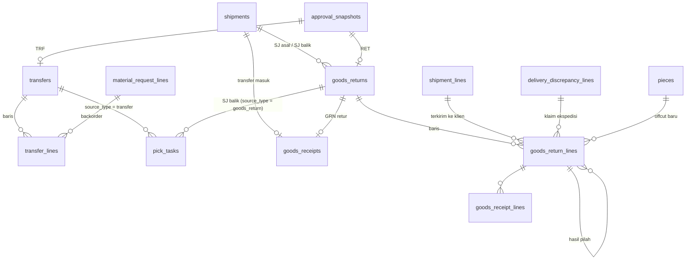

# Spesifikasi Modul — `transfer`, `return` (Transfer & Retur dari Proyek)

**Versi:** 0.2
**Tanggal:** 24 September 2026
**Status:** selesai Fase 1 — modul kesepuluh setelah [Count/Adjustment](21-opname-penyesuaian.md); TRF dan RET diputus lewat mesin approval; keputusan yang tidak tertulis di dokumen dicatat sebagai [A-106](04-keputusan-dan-asumsi.md#a-106)–[A-116](04-keputusan-dan-asumsi.md#a-116) (*Perlu validasi*)
**Modul:** `transfer` (TRF), `return` (RET)
**Fase:** F1 (TRF antar gudang, antar proyek, dalam proyek; TRF dari backorder REQ; RET dari Gudang Site, aset On-site, barang terkirim ke klien, barang rusak ditinggal ekspedisi; GRN retur; pemilahan); pemeriksaan aset saat kembali (modul Aset) sebagai titik sambung
**Dokumen terkait:** [Blueprint §7](01-blueprint.md#7-dokumen--alur-utama) · [Aturan Bisnis §BR-RET](05-aturan-bisnis.md#br-ret), [§BR-REQ](05-aturan-bisnis.md#br-req), [§BR-SJ](05-aturan-bisnis.md#br-sj) · [Katalog Status §2.7, §2.8, §3](06-katalog-status-dan-enum.md) · [Glosarium §5](03-glosarium.md#5-dokumen-transaksi) · [Model data 08b](08b-model-data-stok-dokumen.md) · [Alur 4 & 5](07a-proses-bisnis-lanjutan.md) · [A-26](04-keputusan-dan-asumsi.md#a-26), [A-33](04-keputusan-dan-asumsi.md#a-33), [A-40](04-keputusan-dan-asumsi.md#a-40), [A-50](04-keputusan-dan-asumsi.md#a-50), [A-65](04-keputusan-dan-asumsi.md#a-65)
**Ketergantungan modul:** `stock` (`StockLedger`, `ManageReservation`), `shipment` (PCK, SJ, bukti terima, DSC), `receipt` (GRN transfer & retur, PUT), `request` (baris bersumber transfer), `approval` (kontrak §3.9 [20-approval](20-approval.md)), `warehouse` (Gudang Site, bin Retur/Waste/On-site), `master` (item, lot/serial/potongan, Alasan).

---

## 1. Tujuan & lingkup

**TRF** adalah dokumen niat memindahkan stok company dari satu gudang ke gudang lain — antar gudang, antar proyek (antar Gudang Site), atau antar titik dalam satu proyek ([A-50](04-keputusan-dan-asumsi.md#a-50)). Ia dibuat manual oleh Staf/Kepala Gudang, atau otomatis oleh sistem saat REQ disetujui untuk baris bersumber transfer ([BR-REQ-05](05-aturan-bisnis.md#br-req)). TRF tidak menulis kartu stok: kaki keluarnya PCK → SJ di gudang asal, kaki masuknya GRN transfer + PUT di gudang tujuan ([A-33](04-keputusan-dan-asumsi.md#a-33)); statusnya maju dari kejadian dokumen-dokumen itu.

**RET** adalah dokumen niat mengembalikan barang dari proyek ke gudang: sisa stok Gudang Site, aset yang selesai dipinjam, barang jual-putus yang tidak terpakai (retur penjualan, [A-26](04-keputusan-dan-asumsi.md#a-26)), atau barang rusak yang ditinggal ekspedisi ([A-65](04-keputusan-dan-asumsi.md#a-65)). Barang diangkut dengan SJ balik (hanya stok Gudang Site) atau diantar sendiri, diterima GRN jenis retur ke bin Retur, lalu **dipilah** layak / rusak / offcut / waste ([BR-RET-04](05-aturan-bisnis.md#br-ret)).

Tidak termasuk: pemeriksaan aset (grade, skor, meter, hari pakai) dan state aset — modul Aset ([A-116](04-keputusan-dan-asumsi.md#a-116)); transfer aset On-site → On-site antar proyek; Berita Acara Waste untuk isi bin Waste (WST); nilai uang (D-07).

## 2. Aktor & permission

Permission disimpan dengan `module = transfer` dan `module = return`. Katalog menulis `transfer.create/approve/cancel` dan `return.create/approve/sort/cancel`; izin melihat `transfer.view` dan `return.view` ditambah ([A-109](04-keputusan-dan-asumsi.md#a-109)). Keputusan approval memakai `transfer.approve` / `return.approve` ([A-86](04-keputusan-dan-asumsi.md#a-86)). PCK dari detail dokumen memakai `pick.create`, SJ balik `shipment.create`, GRN retur `receipt.create`/`receipt.receive`.

| Role bawaan | Permission |
|---|---|
| Admin Company | semua (9) |
| Manajemen | `transfer.view`, `transfer.approve`, `return.view`, `return.approve` |
| Kepala Gudang | semua `transfer.*` (4) dan `return.*` (5) |
| Staf Gudang | `transfer.view`, `transfer.create`, `transfer.cancel`, `return.view`, `return.create`, `return.sort`, `return.cancel` |
| Pemohon Internal | `return.view`, `return.create`, `return.cancel` (proyeknya) |
| Klien | `return.view`, `return.create`, `return.cancel` lewat `/portal/returns` ([BR-RET-05](05-aturan-bisnis.md#br-ret)) |
| Auditor Internal & Eksternal | `transfer.view`, `return.view` |
| Driver, Penindak Lanjut PR | — |

Batal: pengaju dokumennya sendiri, atau pemegang permission approve dokumen itu ("Pengaju / Kepala Gudang"). Cakupan ([BR-ACC-05](05-aturan-bisnis.md#br-acc)): TRF terlihat bila gudang asal **atau** tujuan dalam cakupan; RET bila Gudang Site asal atau gudang tujuan dalam cakupan, atau — untuk pengguna bercakupan proyek — proyeknya. Di luar cakupan = 404.

## 3. Entitas & data

Migrasi: `database/migrations/tenant/2026_01_01_000110_create_transfer_return_tables.php`, mengikuti [ERD 08b](08b-model-data-stok-dokumen.md); kolom di luar ERD digenerate ulang ([A-115](04-keputusan-dan-asumsi.md#a-115)). Model: `Transfer\Models\Transfer`, `TransferLine`; `Return\Models\GoodsReturn`, `GoodsReturnLine`. `goods_receipts.goods_return_id` dan `goods_receipt_lines.goods_return_line_id` kini ber-FK.

### 3.1 `transfers`, `transfer_lines` — TRF

Header: `number` (`TRF/<gudang asal>/<yymm>/<urut>`, [BR-GEN-06](05-aturan-bisnis.md#br-gen)), `from_warehouse_id`, `to_warehouse_id`, `from_project_id`/`to_project_id` (diturunkan dari Gudang Site, [BR-WH-04](05-aturan-bisnis.md#br-wh)), `origin` (`manual`/`backorder`), `status`, `source_type`/`source_id` (REQ asal backorder), `approval_snapshot_id`, `submitted_by`, `approved_by/at`, `reject_reason_id`, `cancel_reason_id`, `cancelled_at`, `completed_at`, `notes`. Baris: `item_id`, `material_request_line_id` (backorder), `qty_base`, `qty_shipped`, `qty_received`, `notes`. Lot/serial/potongan dipilih saat picking. Jenis (antar gudang / antar proyek / dalam proyek) diturunkan dari proyek asal/tujuan, bukan kolom.

### 3.2 `goods_returns`, `goods_return_lines` — RET

Header: `number` (`RET/<gudang tujuan>/…`, [A-110](04-keputusan-dan-asumsi.md#a-110)), `project_id`, `origin_shipment_id` (SJ asal), `requester_id` (pengaju), `from_warehouse_id` (Gudang Site asal stok), `to_warehouse_id`, `self_delivered` (tanpa SJ balik), `return_shipment_id` (SJ balik), `status`, `approval_snapshot_id`, `approved_by/at`, `reject_reason_id`, `cancel_reason_id`, `cancelled_at`, `received_at`, `sorted_at`, `sorted_by`, `notes`.

Baris: `item_id`, `lot_id`/`serial_id`/`piece_id`, `from_bin_id` (bin Gudang Site atau On-site), `origin_shipment_line_id`, `origin_discrepancy_line_id` (klaim ekspedisi), `ownership` (`sold`/`company`, [BR-RET-03](05-aturan-bisnis.md#br-ret)), `stock_status` (kondisi saat tiba), `qty_base` (diajukan, tidak berubah), `qty_received`, `split_from_line_id` (baris hasil pilah tambahan, [A-113](04-keputusan-dan-asumsi.md#a-113)), `sorting`, `sorted_qty`, `new_piece_id`, `target_bin_id`, `reason_code_id`, `notes`. Asal baris (Di Gudang Site / Aset di Proyek / Terkirim ke Klien / Rusak ditinggal ekspedisi) diturunkan dari kolom-kolom itu.

### 3.3 Enum

Status tetap dari Katalog §2.7 dan §2.8 (**tanpa status baru**). Didaftarkan di [Katalog §3](06-katalog-status-dan-enum.md#3-enum-lain) v0.11 (sudah ada di ERD): `transfer_origin` (`manual`/`backorder`) dan `return_ownership` (`sold`/`company`); `return_sorting` dan `receipt_type = return` sudah ada.

## 4. Mesin status

Tabel transisi di Katalog §2.7–§2.8; di sini implementasinya. Semua transisi lewat aksi Livewire (POST); route hanya GET halaman.

| Transisi | Implementasi | Efek samping |
|---|---|---|
| TRF — → `submitted → pending_approval` | `Transfer\Actions\CreateTransfer` (`transfer.create`); sistem lewat `Support\BackorderTransfers::createFor` saat REQ disetujui | guard asal ≠ tujuan, gudang aktif, proyek aktif, cakupan, stok tersedia (manual); `ApprovalEngine::submit` |
| `pending_approval → approved → in_progress` | `ApproveTransfer` / kotak tugas → `TransferApprovalHandler::onApproved` | reservasi lunak per baris di gudang asal; `CreatePickTask::forTransfer` (savepoint) → PCK + `in_progress`; gagal = tetap `approved` ([A-107](04-keputusan-dan-asumsi.md#a-107)) |
| `pending_approval → rejected` | sama | Alasan `*` |
| `approved → in_progress` (manual) | `CreatePickTask::forTransfer` (`pick.create`) dari detail TRF | PCK untuk sisa yang belum dialokasikan |
| `in_progress → completed` | `TransferProgress::receiptCompleted` dipanggil `CompleteGoodsReceipt` | semua PCK final, semua yang dipetik termuat SJ, semua SJ ber-GRN `completed` |
| `submitted`/`pending_approval`/`approved → cancelled` | `CancelTransfer` (`transfer.cancel`) | tanpa PCK hidup; reservasi dilepas; snapshot `cancelled` |
| RET — → `submitted → pending_approval` | `Return\Actions\CreateGoodsReturn` (`return.create`) | calon dari `ReturnableStock`; `ApprovalEngine::submit` |
| `pending_approval → approved (→ in_progress)` | `ApproveGoodsReturn` / kotak tugas → `GoodsReturnApprovalHandler::onApproved` | cadangan keras stok Gudang Site; diantar sendiri → `in_progress`; SJ balik → `CreatePickTask::forGoodsReturn` ([A-111](04-keputusan-dan-asumsi.md#a-111)) |
| `approved → in_progress` | `CreateShipment` → `ReturnProgress::returnShipmentPrepared` | `return_shipment_id` |
| `in_progress → received` | `ReceiveGoodsReceipt` (GRN retur) → `ReturnProgress::received` | ledger ke bin Retur; `qty_received`; cadangan dilepas ([A-112](04-keputusan-dan-asumsi.md#a-112)) |
| `received → sorted` | `SortGoodsReturn` (`return.sort`) | ledger bin Retur → bin hasil; kejadian §7; GRN retur `completed` |
| `submitted`/`pending_approval`/`approved → cancelled` | `CancelGoodsReturn` (`return.cancel`) | PCK belum selesai ikut batal; PCK selesai = ditolak; cadangan dilepas |

**Penangan approval** (kontrak [20-approval §3.9](20-approval.md#39-kontrak-dokumen-d-28)): `transfer` → `Transfer\Support\TransferApprovalHandler` (konteks: gudang asal, proyek tujuan/asal, kategori, kepemilikan, jumlah baris, jumlah terbesar; SoD pengaju); `goods_return` → `Return\Support\GoodsReturnApprovalHandler` (konteks: gudang tujuan, proyek, kategori, kepemilikan, jumlah, dari klien; SoD pengaju). Tanpa aturan = disetujui otomatis ([A-08](04-keputusan-dan-asumsi.md#a-08)) — jalur ringan transfer dalam proyek ([BR-RET-02](05-aturan-bisnis.md#br-ret)).

## 5. Aturan bisnis yang berlaku

| Aturan | Ditegakkan di mana |
|---|---|
| [BR-RET-01](05-aturan-bisnis.md#br-ret) | TRF/RET tidak memanggil buku besar; fisik lewat PCK/SJ/GRN; approval lewat mesin |
| [BR-RET-02](05-aturan-bisnis.md#br-ret), [A-50](04-keputusan-dan-asumsi.md#a-50) | Asal ≠ tujuan (termasuk dua Gudang Site satu proyek); proyek diturunkan dari Gudang Site; SJ boleh `self_delivered`; GRN tujuan tanpa QC ([A-79](04-keputusan-dan-asumsi.md#a-79)) |
| [BR-RET-03](05-aturan-bisnis.md#br-ret) | `ownership = sold` untuk barang jual-putus, `company` lainnya; SJ asal terisi otomatis/dipilih dan divalidasi |
| [BR-RET-04](05-aturan-bisnis.md#br-ret) | `SortGoodsReturn`: layak → bin penyimpanan; rusak → kondisi Rusak; offcut → potongan baru + silsilah; waste → bin Waste ([A-113](04-keputusan-dan-asumsi.md#a-113)) |
| [BR-RET-05](05-aturan-bisnis.md#br-ret) | Klien tidak bisa meretur stok Gudang Site; calon klien = Terkirim ke Klien, aset di proyeknya, rusak ditinggal ekspedisi |
| [BR-REQ-05](05-aturan-bisnis.md#br-req), [A-106](04-keputusan-dan-asumsi.md#a-106) | REQ disetujui → TRF backorder; tanpa gudang asal yang cukup approval REQ tertahan |
| [BR-REQ-08](05-aturan-bisnis.md#br-req), [A-108](04-keputusan-dan-asumsi.md#a-108) | `CompletePutaway` → `BackorderTransfers::reserveArrivals`: reservasi lunak ke baris REQ penunggu; baris transfer bisa dipetik sebesar reservasinya |
| [BR-REQ-15](05-aturan-bisnis.md#br-req), [BR-REQ-09](05-aturan-bisnis.md#br-req) | REQ batal/tutup/baris batal → TRF backorder yang belum berjalan dibatalkan |
| [BR-SJ-04](05-aturan-bisnis.md#br-sj), [BR-STK-13](05-aturan-bisnis.md#br-stk) | SJ TRF/RET ke gudang: barang tetap di Dalam Perjalanan gudang asal sampai GRN |
| [BR-SJ-09](05-aturan-bisnis.md#br-sj) | `CreateShipment`: PCK TRF/RET wajib ke gudang tujuan dokumennya; PCK retur tidak digabung |
| [BR-GRN-05](05-aturan-bisnis.md#br-grn) | GRN retur ≤ jumlah baik SJ balik atau jumlah RET; satu GRN aktif per RET |
| [BR-STK-03](05-aturan-bisnis.md#br-stk), [BR-STK-04](05-aturan-bisnis.md#br-stk) | Reservasi lunak TRF di gudang asal saat disetujui → alokasi keras PCK; cadangan keras stok Gudang Site RET |
| [BR-STK-01](05-aturan-bisnis.md#br-stk), [BR-LED-01–06](05-aturan-bisnis.md#br-led) | Semua pergerakan lewat `StockLedger::post()`; kejadian di outbox dalam transaksi yang sama |
| [BR-CNV-03](05-aturan-bisnis.md#br-cnv), [BR-CNV-04](05-aturan-bisnis.md#br-cnv) | Offcut ≥ `min_offcut_length`, ≤ panjang asal; potongan baru menyimpan `parent_piece_id` |
| [BR-PRJ-01](05-aturan-bisnis.md#br-prj), [BR-PRJ-06](05-aturan-bisnis.md#br-prj) | Proyek aktif; klien hanya RET proyeknya |
| [BR-GEN-03](05-aturan-bisnis.md#br-gen), [BR-GEN-11](05-aturan-bisnis.md#br-gen) | Batal hanya sebelum barang berjalan; tolak/batal/rusak/waste menuntut Alasan `*` |
| [BR-APR-01–09](05-aturan-bisnis.md#br-apr) | Lewat mesin approval; pengaju tidak memutus (policy + aksi + mesin) |

## 6. Layar

| Route | Komponen | Isi |
|---|---|---|
| `/transfers` | `transfer.transfer-list` | Cari, filter status/asal dokumen; asal → tujuan, jenis, status |
| `/transfers/create` | `transfer.transfer-form` | Gudang asal `*`, tujuan `*` (jenis transfer tampil), keterangan; baris item `*` × jumlah `*` dengan stok tersedia gudang asal |
| `/transfers/{id}` | `transfer.transfer-detail` | Baris (jumlah/dikirim/diterima/REQ), PCK → SJ → GRN, setujui/tolak (dialog Alasan `*`), batal, *Buat tugas picking*, *Susun surat jalan* (prefill `?pick_task=`), *Terima di gudang tujuan*, *Riwayat approval*, riwayat |
| `/returns`, `/portal/returns` | `return.return-list` | Cari, filter status; proyek, gudang tujuan, pengangkutan |
| `/returns/create`, `/portal/returns/create` | `return.return-form` | Proyek `*`, gudang tujuan `*`, pengangkutan `*`; daftar barang yang bisa diretur per asal + jumlah maks |
| `/returns/{id}`, `/portal/returns/{id}` | `return.return-detail` | Baris & hasil pilah, setujui/tolak, batal, PCK & SJ balik, *Terima retur (GRN)*, **pemilahan** per baris dengan beberapa bagian (hasil, jumlah, bin, Alasan, panjang offcut), *Riwayat approval* (bukan portal), riwayat |

Menu sidebar **Transfer & retur** (Transfer · Retur dari proyek; klien ke portal) dan palet Ctrl+K (*Transfer*, *Transfer baru*, *Retur dari proyek*, *Retur baru*), disaring permission. Layar lain yang berubah: form GRN menerima sumber *Retur dari proyek* (`?goods_return=`), detail GRN merujuk RET-nya, form SJ menerima `?pick_task=`, detail REQ menampilkan TRF backorder, daftar picking menampilkan baris REQ transfer yang barangnya sudah tiba.

## 7. Kejadian stok & integrasi

| Kejadian | Pergerakan | Rujukan |
|---|---|---|
| `goods_shipped` | SJ TRF/RET berangkat: Loading Area → Dalam Perjalanan gudang asal | matriks §14 |
| `stock_transferred` (tanpa pergerakan) | bukti terima SJ TRF ([A-81](04-keputusan-dan-asumsi.md#a-81)); **tidak** untuk SJ balik RET | [A-112](04-keputusan-dan-asumsi.md#a-112) |
| `stock_transferred` (`phase = goods_receipt`) | GRN transfer: Dalam Perjalanan → Penerimaan gudang tujuan | [19-receipt-putaway §7](19-receipt-putaway.md#7-kejadian-stok--integrasi) |
| — | GRN retur: → bin Retur (tanpa kejadian) | A-112 |
| `goods_returned` | pemilahan: bin Retur → bin hasil; payload `return_number`, `ownership` (`sold` = retur penjualan), `sorting`, `source`, `origin_shipment_line_id`; offcut/waste potongan membawa `parent_piece_id` | matriks §14, [BR-RET-03](05-aturan-bisnis.md#br-ret) |
| `asset_returned` | pemilahan baris aset On-site; `inspection = null` sampai modul Aset | [A-116](04-keputusan-dan-asumsi.md#a-116) |

Reservasi: TRF memakai `document_type = transfer` (lunak, gudang asal); RET `goods_return` (keras, bin Gudang Site); keduanya diganti alokasi keras `pick_task` saat PCK dibuat.

## 8. Notifikasi

| Kejadian | Penerima | Kanal | Keadaan |
|---|---|---|---|
| Tugas approval TRF/RET | approver | in-app, email | stub `ApprovalNotifier` ([A-91](04-keputusan-dan-asumsi.md#a-91)); angka di *Tugas approval saya* |
| TRF masuk / SJ TRF tiba | Kepala Gudang tujuan | in-app | belum; tombol *Terima di gudang tujuan* di detail TRF |
| RET disetujui / diterima / dipilah | pemohon, klien | in-app, portal | belum; status di portal |

## 9. Laporan & dashboard

F1: daftar TRF/RET dengan filter status. Belum (kerangka [16-shared-laporan-berkas](16-shared-laporan-berkas.md)): TRF terbuka per gudang & umur, barang dalam perjalanan antar gudang, retur per proyek dan hasil pilah (kolom *Diretur* laporan Material per Proyek), posisi barang rusak di bin Retur.

## 10. Kasus uji (Given / When / Then)

Uji di `tests/Feature/Transfer` (16 uji) dan `tests/Feature/Return` (17 uji). Fixture `Transfer\Concerns\TransferFixtures`: CKG (induk) & BKS, proyek dengan Gudang Site KRW1/KRW2, bin penyimpanan tiap gudang, Baut 100 di CKG; `Return\Concerns\ReturnFixtures` menambah rantai REQ → SJ → bukti terima ke proyek.

| ID | Given | When | Then | BR |
|---|---|---|---|---|
| TC-TRF-01 | Tanpa aturan TRF | TRF CKG→BKS 30 | `TRF/CKG/…`, disetujui otomatis, PCK di CKG, `in_progress`; reservasi lunak → alokasi keras; tersedia CKG 70 | A-08, A-43, A-107 |
| TC-TRF-02 | — | asal = tujuan, tanpa baris, jumlah 0, melebihi stok, serial pecahan, item sementara, gudang nonaktif, luar cakupan, proyek ditutup | ditolak BR-RET-02/BR-RET-01/BR-LED-02/BR-STK-03/BR-LED-04/BR-REQ-03/BR-WH-07/BR-ACC-05/BR-PRJ-01 | Katalog §2.7 |
| TC-TRF-03 | Aturan satu lapis Kepala Gudang | ajukan; pengaju memutus; setujui; tolak tanpa/dengan alasan | `pending_approval` tanpa reservasi; BR-APR-03; `in_progress` + PCK; BR-GEN-11 / `rejected` | BR-APR-03, BR-GEN-11 |
| TC-TRF-04 | TRF menunggu / berjalan | batal tanpa/dengan alasan | BR-GEN-11 / `cancelled` + snapshot `cancelled`; berjalan ditolak BR-GEN-03 | Katalog §2.7 |
| TC-TRF-05 | Bin sumber dibeku | TRF disetujui; PCK manual; batal; PCK dibatalkan lalu dibuat ulang | tetap `approved` + reservasi; PCK ditolak lalu berhasil setelah bin aktif; batal melepas reservasi; PCK baru untuk sisa | A-107 |
| TC-TRF-06 | TRF 40 | PCK → SJ → bukti terima → GRN BKS → PUT | `qty_shipped`/`qty_received` 40; Dalam Perjalanan CKG sampai GRN; `stock_transferred`; TRF `completed`; tersedia BKS 40 | BR-SJ-04, BR-STK-13 |
| TC-TRF-07 | PCK TRF selesai | SJ ke proyek / gudang lain / BKS | ditolak BR-SJ-09 ×2; SJ BKS berefek `transfer` | BR-SJ-09 |
| TC-TRF-08 | Stok di KRW1 | TRF KRW1→KRW2 oleh PIC titik, SJ diantar sendiri, GRN; TRF ke Gudang Site proyek lain | dalam proyek (`from_project_id = to_project_id`), tanpa approval, `self_delivered`, GRN tanpa QC, `completed`; antar proyek | BR-RET-02, A-50 |
| TC-TRF-09 | TRF CKG→BKS | Kepala BKS / staf KRW1 membaca | terlihat / tidak + 404 | BR-ACC-05, A-109 |
| TC-TRF-10 | REQ baris transfer 30 ke BKS | disetujui → PCK REQ ditolak → TRF CKG→BKS dijalankan sampai PUT → PCK REQ → SJ proyek → bukti terima | TRF backorder dari induk; reservasi baru setelah PUT; REQ `completed`, baris `closed`, diterima 30 | BR-REQ-05, BR-REQ-08, A-106, A-108 |
| TC-TRF-11 | Tidak ada gudang dengan stok 500 | REQ baris transfer 500 disetujui | ditolak BR-REQ-05, tanpa TRF | BR-REQ-05 |
| TC-TRF-12 | BKS 150, CKG 100, pemenuh KRW1 | REQ 120 | asal BKS (terbanyak), proyek tujuan terisi | A-106 |
| TC-TRF-13 | Aturan TRF, TRF backorder menunggu | REQ dibatalkan | TRF `cancelled`, reservasi dilepas | BR-REQ-15, A-108 |
| TC-TRF-14 | Role berbeda | buka layar TRF | 200/403 sesuai §2 | BR-GEN-09 |
| TC-TRF-15 | Layar | form (asal = tujuan lalu benar) → daftar → tolak lewat dialog → setujui → batal | BR-RET-02; `pending_approval`; Alasan wajib; `rejected`/`in_progress`/`cancelled` | §6, BR-GEN-11 |
| TC-TRF-16 | PCK otomatis gagal | *Buat tugas picking* → *Susun surat jalan* (prefill) → beranda | PCK dibuat; SJ terisi gudang tujuan TRF; menu *Transfer & retur* sesuai izin | §6 |
| TC-RET-01 | Baut 20 di KRW1 | RET 12 diantar sendiri | `RET/CKG/…`, `in_progress`, `company`, cadangan keras 12, sisa calon 8 | A-110, A-111 |
| TC-RET-02 | — | melebihi, kunci tak dikenal, tanpa baris, ke Gudang Site, dua Gudang Site, pemohon proyek lain, proyek ditutup | ditolak BR-RET-03/BR-RET-02/BR-ACC-05/BR-PRJ-01 | BR-RET-03 |
| TC-RET-03 | Aturan RET | pengaju memutus; tolak tanpa alasan; setujui; tolak | BR-APR-03; BR-GEN-11; `in_progress`; `rejected`, jumlah bebas lagi | BR-APR-03 |
| TC-RET-04 | RET menunggu / SJ balik / PCK selesai / diproses | batal | `cancelled`; PCK ikut batal & cadangan lepas; ditolak BR-GEN-03 ×2 | A-111 |
| TC-RET-05 | Barang terkirim ke klien | RET SJ balik / diantar sendiri | ditolak BR-RET-03 / `sold` + SJ asal | A-111, BR-RET-03 |
| TC-RET-06 | Klien proyek & klien lain | retur stok site / terkirim; baca | BR-RET-05 / berhasil; klien lain tidak melihat | BR-RET-05, BR-PRJ-06 |
| TC-RET-07 | RET menunggu lalu diproses | GRN sebelum disetujui, gudang lain, melebihi, 4 dari 5, GRN kedua, selesaikan manual | BR-RET-01 ×2, BR-GRN-05; `received`; BR-RET-01; BR-RET-04 | A-112 |
| TC-RET-08 | RET 10 dari KRW1 | GRN; pilah 7 layak + 3 rusak | site → bin Retur tanpa kejadian; layak di bin simpan, rusak Rusak di bin Retur; baris hasil pilah; 2 `goods_returned` `company`; GRN `completed` | BR-RET-04, A-112, A-113 |
| TC-RET-09 | RET SJ balik | PCK KRW1 → SJ ke gudang lain/CKG → GRN sebelum bukti terima → bukti terima → GRN transfer → GRN retur → pilah | BR-SJ-09; `in_progress` + SJ balik; BR-SJ-04; tanpa `stock_transferred`; BR-RET-01; masuk bin Retur; `sorted` | A-111, A-112 |
| TC-RET-10 | 20 terkirim ke klien | RET 5, RET 16, GRN, pilah layak | sisa calon 15; BR-RET-03; dari luar ke bin Retur; `goods_returned` `sold` + baris SJ asal | BR-RET-03, A-26 |
| TC-RET-11 | SJ ekspedisi, 2 rusak, DSC `claimed` | RET klaim → GRN → waste tanpa/dengan alasan | calon 2; masuk Rusak; BR-GEN-11; bin Waste Rusak, `sorting = waste` | BR-RET-05, BR-SJ-10 |
| TC-RET-12 | Pipa 6 m terkirim, min offcut 1 | pilah offcut 0,5 / 7 / 2,5 | BR-CNV-03 / BR-STK-09; potongan baru 2,5 bersilsilah, asal terpakai, sisa 3,5 di bin Waste; kejadian `offcut` + `waste` | BR-RET-04, BR-CNV-03/04 |
| TC-RET-13 | Genset dipinjam ke proyek (On-site) | RET aset → GRN → pilah layak | keluar dari On-site; `asset_returned` dengan `inspection` | A-116 |
| TC-RET-14 | RET diproses / diterima | pilah sebelum diterima, jumlah kurang, rusak tanpa alasan, layak ke Karantina/gudang lain, offcut bukan potongan, kosong | ditolak BR-RET-04/BR-GEN-11; stok tetap di bin Retur | BR-RET-04 |
| TC-RET-15 | Role & portal | buka layar internal/portal | 200/403 sesuai §2; klien di portal tanpa *Riwayat approval*, area internal dipulangkan, RET proyek lain 404; menu ke portal | BR-GEN-09, BR-PRJ-06 |
| TC-RET-16 | Layar | form (melebihi lalu benar) → *Terima retur (GRN)* → form GRN retur → terima → pemilahan 8 + 2 (tanpa lalu dengan alasan) | BR-RET-03; draf GRN berjumlah bawaan; BR-GEN-11; `sorted`, saldo sesuai; detail GRN merujuk RET | §6 |
| TC-RET-17 | Aturan RET | pengaju tanpa tombol; tolak lewat dialog; setujui SJ balik; batal pengaju | Alasan wajib; `rejected`; `approved` + PCK; `cancelled` | §6, A-111 |

TC-GRN-12 ([19-receipt-putaway](19-receipt-putaway.md)) kini menguji GRN retur tanpa RET (BR-RET-01), ID tetap.

## 11. Di luar lingkup modul ini

Pemeriksaan aset saat kembali, state aset, meter & hari pakai (modul Aset, [A-116](04-keputusan-dan-asumsi.md#a-116)); transfer aset On-site → On-site antar proyek; WST untuk isi bin Waste; retur ke vendor dari barang rusak di bin Retur (RTV hanya dari Karantina, [BR-GRN-04](05-aturan-bisnis.md#br-grn)); notifikasi in-app/email; laporan §9; SJ balik untuk barang di tangan klien (butuh SJ tanpa PCK).

## 12. Definisi selesai

- [x] Migrasi tenant, model, enum untuk seluruh tabel §3; ERD digenerate ulang
- [x] Mesin status Katalog §2.7–§2.8 tanpa status baru; transisi lewat POST
- [x] Penangan approval TRF & RET terdaftar (tanpa aturan demo — [00-akun-uji §5](../00-akun-uji.md#5-aturan-approval-bawaan-demo))
- [x] TRF dari backorder REQ, reservasi ke REQ penunggu, PCK/SJ/GRN transfer, penyelesaian TRF
- [x] GRN retur, SJ balik, pemilahan dengan offcut/waste; kejadian `goods_returned`/`asset_returned`
- [x] Tiga layar TRF, tiga layar RET (back-office + portal), menu, palet, panel riwayat approval
- [x] 9 permission & role di `ReferenceSeeder`
- [x] Semua TC-TRF & TC-RET lulus; `php artisan test` hijau (461 uji)
- [x] Dokumen diperbarui (versi naik + changelog README)

## 13. Catatan implementasi (24 September 2026)

Domain `app/Domain/Transfer` (3 aksi: `CreateTransfer`, `ApproveTransfer`, `CancelTransfer`; `Support\TransferApprovalHandler`, `TransferProgress`, `BackorderTransfers`; 1 policy; 3 komponen Livewire) dan `app/Domain/Return` (4 aksi: `CreateGoodsReturn`, `ApproveGoodsReturn`, `SortGoodsReturn`, `CancelGoodsReturn`; `Support\GoodsReturnApprovalHandler`, `ReturnableStock`, `ReturnProgress`; 1 policy; 3 komponen Livewire), mengikuti [Arsitektur §4](08-arsitektur.md#4-struktur-kode) (`Transfer/`, `Return/`). Provider `TransferServiceProvider`, `ReturnServiceProvider`; controller `Transfer\TransferController`, `Return\ReturnController` (juga route portal).

### 13.1 Perubahan di modul lain

1. **Shipment** ([15 §13](15-picking-shipment.md#13-catatan-implementasi-24-september-2026)): `CreatePickTask` melayani REQ (termasuk baris transfer yang sudah direservasi), TRF (`forTransfer`), dan RET (`forGoodsReturn`); `CreateShipment` menjaga tujuan TRF/RET dan menandai RET `in_progress`; `ShipShipment` mencatat `qty_shipped` TRF; `ConfirmDelivery` tidak menerbitkan `stock_transferred` untuk SJ balik; `PickTaskLine::unshippedQty()` tidak lagi menghitung SJ yang dibatalkan; relasi `PickTaskLine::pickTask` dan `ShipmentLine::shipment` lintas cakupan; daftar picking menyaring `source_type` dan menampilkan baris REQ transfer yang siap dipetik; form SJ menerima `?pick_task=`.
2. **Receipt** ([19 §13](19-receipt-putaway.md#13-catatan-implementasi-24-september-2026)): GRN sumber `return` aktif (`SaveGoodsReceipt`, `ReceiveGoodsReceipt`, form GRN); GRN transfer mencatat `qty_received` dan menyelesaikan TRF; `receipt.complete` menolak GRN retur; PUT selesai mereservasi barang TRF backorder ke REQ penunggu.
3. **Request** ([14 §13](14-request.md#13-catatan-implementasi-24-september-2026)): `RequestApprovalHandler` membuat TRF backorder; `CancelRequest`, `CloseRequestShort`, `CancelRequestLine::confirm` melepas TRF backorder; detail REQ menampilkan TRF-nya.
4. **Approval** ([20 §13](20-approval.md#13-catatan-implementasi-24-september-2026)): TRF & RET tersambung; kondisi RET termasuk *dari klien*; layar approval menerjemahkan penolakan TRF/RET/pengiriman.

### 13.2 Keputusan implementasi

1. **TRF backorder** ([A-106](04-keputusan-dan-asumsi.md#a-106)), **siklus TRF** ([A-107](04-keputusan-dan-asumsi.md#a-107)), **reservasi saat put-away** ([A-108](04-keputusan-dan-asumsi.md#a-108)), **permission & cakupan** ([A-109](04-keputusan-dan-asumsi.md#a-109)).
2. **Asal baris RET** ([A-110](04-keputusan-dan-asumsi.md#a-110)), **SJ balik** ([A-111](04-keputusan-dan-asumsi.md#a-111)), **GRN retur** ([A-112](04-keputusan-dan-asumsi.md#a-112)), **pemilahan** ([A-113](04-keputusan-dan-asumsi.md#a-113)), **kolom di luar ERD** ([A-115](04-keputusan-dan-asumsi.md#a-115)).
3. **DSC `returned_to_warehouse` tidak diubah** ([A-114](04-keputusan-dan-asumsi.md#a-114)): barang rusak yang dibawa balik sudah berada di bin Retur gudang asal berkondisi Rusak — setara pemilahan `damaged` — tanpa GRN retur.
4. **Kegagalan PCK otomatis tidak membatalkan persetujuan**: dibungkus savepoint; alasan kegagalan masuk riwayat dokumen.

### 13.3 Sisa pekerjaan

1. Pemeriksaan aset saat kembali (grade, skor, meter, hari pakai) dan state aset — modul Aset; transfer aset On-site antar proyek ([A-116](04-keputusan-dan-asumsi.md#a-116)).
2. SJ balik untuk barang di tangan klien — butuh SJ yang tidak berangkat dari PCK.
3. Cross-dock barang TRF ke REQ penunggu tetap saran ([A-83](04-keputusan-dan-asumsi.md#a-83)).
4. Short pick PCK TRF tidak menambah backorder REQ penunggu; sisa baris REQ bersumber transfer dipenuhi ulang secara manual (TRF baru atau pecah baris).
5. Notifikasi §8, laporan §9, cetak SJ balik/berita acara retur.
