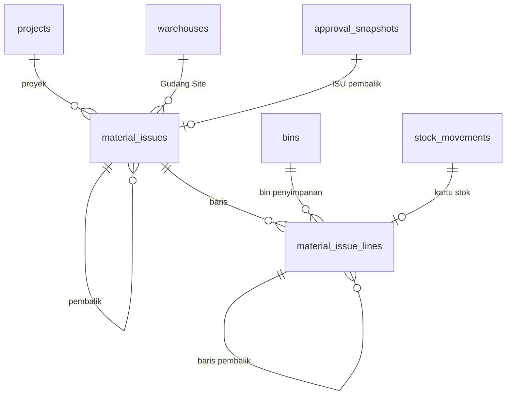

# Spesifikasi Modul — `issue` (Pemakaian Material di Site)

**Versi:** 0.5
**Tanggal:** 24 September 2026
**Status:** selesai Fase 1 — modul kesebelas setelah [Transfer/Retur](22-retur-transfer.md) dan [Template dokumen & label](18-template-dokumen-label.md); ISU pembalik diputus lewat mesin approval; keputusan yang tidak tertulis di dokumen dicatat sebagai [A-117](04-keputusan-dan-asumsi.md#a-117)–[A-119](04-keputusan-dan-asumsi.md#a-119) dan [A-150](04-keputusan-dan-asumsi.md#a-150)–[A-152](04-keputusan-dan-asumsi.md#a-152) (*Perlu validasi*)
**Modul:** `issue` (ISU)
**Fase:** F1 (ISU dari bin penyimpanan Gudang Site, ISU pembalik dengan approval, laporan Material per Proyek, cetak Bukti Pemakaian Material, foto pemakaian sebagai lampiran [A-238](04-keputusan-dan-asumsi.md#a-238))
**Dokumen terkait:** [Blueprint §6.9, §7, §9](01-blueprint.md#7-dokumen--alur-utama) · [Aturan Bisnis §BR-PRJ](05-aturan-bisnis.md#br-prj), [§BR-GEN](05-aturan-bisnis.md#br-gen), [§14 matriks kejadian](05-aturan-bisnis.md#14-matriks-kejadian-stok) · [Katalog Status §2.9, §3](06-katalog-status-dan-enum.md) · [Glosarium §5](03-glosarium.md#5-dokumen-transaksi) · [Model data 08b](08b-model-data-stok-dokumen.md) · [Alur 3](07-proses-bisnis.md#alur-3--pemakaian-material-di-gudang-site) · [A-32](04-keputusan-dan-asumsi.md#a-32), [A-40](04-keputusan-dan-asumsi.md#a-40), [A-50](04-keputusan-dan-asumsi.md#a-50), [A-85](04-keputusan-dan-asumsi.md#a-85)
**Ketergantungan modul:** `stock` (`StockLedger`, reservasi), `warehouse` (Gudang Site, bin penyimpanan), `master` (proyek, item, lot/serial/potongan, Alasan), `approval` (kontrak §3.9 [20-approval](20-approval.md)), `template` (cetak), `shared` (kerangka laporan).

---

## 1. Tujuan & lingkup

Barang habis pakai yang sudah berada di Gudang Site masih stok company sampai benar-benar dipakai. **ISU** mencatat pemakaian itu: barang keluar dari bin Gudang Site proyek lewat kartu stok dengan kejadian `material_consumed` penanda proyek, sehingga beban material proyek tercatat dan laporan **Material per Proyek** punya kolom *Terpakai* ([A-32](04-keputusan-dan-asumsi.md#a-32), [BR-PRJ-08](05-aturan-bisnis.md#br-prj)). ISU tidak memakai SJ karena tidak ada pergerakan antar lokasi.

Staf Gudang Site atau Pemohon Internal mencatat draf; Staf Gudang Site mengonfirmasi. Salah input setelah konfirmasi dikoreksi dengan **ISU pembalik** (jumlah negatif, Alasan `*`, approval — [BR-GEN-04](05-aturan-bisnis.md#br-gen)).

Tidak termasuk: aset (`asset`/`both`) — aset tidak dipakai habis dan kembali lewat retur/modul Aset ([BR-STK-08](05-aturan-bisnis.md#br-stk)); memotong potongan (konversi, modul Konversi); waste (WST); nilai uang ([D-07](04-keputusan-dan-asumsi.md#d-07)).

## 2. Aktor & permission

Permission disimpan dengan `module = issue`. Katalog §2.9 menulis `issue.create`, `issue.confirm`, `issue.cancel`; izin melihat `issue.view` dan keputusan pembalik `issue.approve` ([A-86](04-keputusan-dan-asumsi.md#a-86)) ditambah ([A-119](04-keputusan-dan-asumsi.md#a-119)).

| Role bawaan | Permission |
|---|---|
| Admin Company | semua (5) |
| Manajemen | `issue.view`, `issue.approve` |
| Kepala Gudang | semua (5) |
| Staf Gudang (termasuk Staf Gudang Site) | `issue.view`, `issue.create`, `issue.confirm`, `issue.cancel` |
| Pemohon Internal | `issue.view`, `issue.create`, `issue.cancel` (proyeknya) |
| Auditor Internal & Eksternal | `issue.view` |
| Driver, Penindak Lanjut PR, Klien | — |

Batal: pembuat, atau pemegang `issue.approve`. Ubah draf: pembuat, atau pemegang `issue.confirm` (staf yang akan mengonfirmasi). Cakupan ([BR-ACC-05](05-aturan-bisnis.md#br-acc)): Gudang Site **dan** proyek ISU harus dalam cakupan pengguna (global scope `ScopedToUser` pada `warehouse_id` dan `project_id`); di luar cakupan = 404. Cetak memakai izin `view` ([A-124](04-keputusan-dan-asumsi.md#a-124)).

## 3. Entitas & data

Migrasi: `database/migrations/tenant/2026_01_01_000120_create_issue_tables.php`, mengikuti [ERD 08b](08b-model-data-stok-dokumen.md); kolom di luar ERD digenerate ulang ([A-118](04-keputusan-dan-asumsi.md#a-118)). Model: `Issue\Models\MaterialIssue`, `MaterialIssueLine`.

### 3.1 `material_issues` — ISU

| Kolom | Tipe | Null | Keterangan |
|---|---|---|---|
| `number` | varchar(40) | — | unik; `ISU/<Gudang Site>/<yymm>/<urut>` ([BR-GEN-06](05-aturan-bisnis.md#br-gen): gudang pemenuh) |
| `project_id`, `warehouse_id` | bigint | — | FK; gudang = Gudang Site milik proyek itu |
| `status` | varchar(20) | — | KS 2.9: `draft`/`confirmed`/`cancelled` |
| `reversal_of_id` | bigint | ✔ | ISU asal bila pembalik ([BR-GEN-03](05-aturan-bisnis.md#br-gen)) |
| `reason_code_id` | bigint | ✔ | Alasan pembalikan (master Alasan konteks `cancel`) |
| `issued_by` | bigint | ✔ | pembuat |
| `confirmed_by`, `confirmed_at` | bigint, datetime | ✔ | konfirmasi (pembalik: pengaju, saat disetujui) |
| `approval_snapshot_id` | bigint | ✔ | hanya ISU pembalik |
| `submitted_by`, `submitted_at` | bigint, datetime | ✔ | pengaju pembalik ([BR-APR-03](05-aturan-bisnis.md#br-apr)) |
| `approved_by`, `approved_at`, `reject_reason_id` | | ✔ | keputusan terakhir pembalik |
| `cancel_reason_id`, `cancelled_at`, `notes` | | ✔ | batal (Alasan `*`), keterangan |

### 3.2 `material_issue_lines` — baris ISU

`item_id`, `bin_id` (bin penyimpanan Gudang Site), `lot_id`/`serial_id`/`piece_id`, `qty_base` (satuan dasar; **negatif** pada pembalik), `work_note` (keperluan, untuk apa dipakai), `reversal_of_line_id` (baris asal pembalik), `movement_id` (pergerakan kartu stok saat dikonfirmasi).



### 3.3 Enum

Status tetap Katalog §2.9 (**tanpa status baru**). `approval_document_type = material_issue` (sudah ada) kini tersambung. Katalog §3 v0.13 menambah `document_template_type = material_issue` (Bukti Pemakaian Material, [A-152](04-keputusan-dan-asumsi.md#a-152)).

## 4. Mesin status

Tabel transisi di Katalog §2.9; di sini implementasinya. Semua transisi lewat aksi Livewire (POST); route hanya GET halaman dan cetak.

```yaml
material_issue:
  initial: draft
  transitions:
    - {from: draft, to: confirmed, action: issue.confirm, when: not_reversal, effect: ledger_out_material_consumed}
    - {from: draft, to: draft, action: issue.confirm, when: reversal, effect: approval_submit}   # A-150
    - {from: draft, to: confirmed, action: issue.approve, when: reversal_last_step, effect: ledger_reverse}
    - {from: draft, to: draft, action: issue.approve, when: reversal_rejected}                  # A-150
    - {from: draft, to: cancelled, action: issue.cancel, effect: approval_withdraw_if_pending}
  terminal: [confirmed, cancelled]
```

| Transisi | Implementasi | Efek samping |
|---|---|---|
| — → `draft` | `Issue\Actions\CreateMaterialIssue::handle` (`issue.create`) | guard §5; calon dari `Support\IssuableStock`; draf tidak memegang stok |
| ubah draf | `CreateMaterialIssue::update` | baris draf diganti (belum dipakai ledger) |
| `draft → confirmed` | `ConfirmMaterialIssue` (`issue.confirm`) | stok diperiksa ulang; `Support\IssuePoster::consume` → `StockLedger::post` bin → keluar, `material_consumed`; `movement_id` per baris |
| ISU pembalik `draft` | `CreateMaterialIssue::reverse` | baris terpilih, jumlah negatif, `reversal_of_line_id`, Alasan `*` |
| pembalik diajukan | `ConfirmMaterialIssue` → `ApprovalEngine::submit` | tetap `draft` + snapshot menunggu ([A-150](04-keputusan-dan-asumsi.md#a-150)) |
| pembalik disetujui → `confirmed` | `ApproveMaterialIssue` / kotak tugas → `MaterialIssueApprovalHandler::onApproved` | `IssuePoster::reverse` → `StockLedger::reverse` per baris, `material_consumed` + `reverses_event_id` |
| pembalik ditolak | `ApproveMaterialIssue::reject` → `onRejected` | tetap `draft`, `reject_reason_id`; boleh diajukan ulang atau dibatalkan |
| `draft → cancelled` | `CancelMaterialIssue` (`issue.cancel`) | Alasan `*`; snapshot pembalik ditarik |

**Penangan approval** (kontrak [20-approval §3.9](20-approval.md#39-kontrak-dokumen-d-28)): `material_issue` → `Issue\Support\MaterialIssueApprovalHandler` (konteks: Gudang Site, proyek, kategori, kepemilikan, jumlah baris, jumlah terbesar tanpa tanda; SoD pembuat + pengaju). Tanpa aturan tetap **satu lapis**: Kepala Gudang Gudang Site, cadangan Manajemen ([A-150](04-keputusan-dan-asumsi.md#a-150)). ISU biasa tidak lewat mesin approval.

## 5. Aturan bisnis yang berlaku

| Aturan | Ditegakkan di mana |
|---|---|
| [BR-PRJ-08](05-aturan-bisnis.md#br-prj), [A-117](04-keputusan-dan-asumsi.md#a-117) | Hanya Gudang Site aktif milik proyek itu; hanya saldo Tersedia di bin **penyimpanan** ([A-85](04-keputusan-dan-asumsi.md#a-85)); hanya item `consumable` |
| [BR-STK-08](05-aturan-bisnis.md#br-stk), [BR-STK-14](05-aturan-bisnis.md#br-stk) | Aset (`asset`/`both`) ditolak dan tidak ditawarkan; bin On-site tidak pernah jadi sumber ISU |
| [BR-PRJ-01](05-aturan-bisnis.md#br-prj) | Proyek tidak aktif menolak ISU baru, konfirmasi, dan pembalik |
| [BR-STK-03](05-aturan-bisnis.md#br-stk), [BR-STK-06](05-aturan-bisnis.md#br-stk) | Per bin: saldo − alokasi keras; per item: Stok Tersedia Gudang Site (reservasi lunak ikut). Diperiksa saat draf dan **diulang saat konfirmasi** (Katalog §2.9 guard) |
| [BR-LED-02](05-aturan-bisnis.md#br-led), [BR-LED-04](05-aturan-bisnis.md#br-led), [BR-STK-09](05-aturan-bisnis.md#br-stk) | Jumlah > 0; serial per unit; potongan dipakai utuh ([A-117](04-keputusan-dan-asumsi.md#a-117)) |
| [BR-OPN-02](05-aturan-bisnis.md#br-opn) | Bin dibeku menolak ISU baru dan konfirmasi (juga dijaga `StockLedger`) |
| [BR-STK-01](05-aturan-bisnis.md#br-stk), [BR-LED-01–06](05-aturan-bisnis.md#br-led), [BR-STK-15](05-aturan-bisnis.md#br-stk) | Semua lewat `StockLedger::post()`/`reverse()`; kejadian di outbox dalam transaksi yang sama; periode terkunci ditolak |
| [BR-GEN-03](05-aturan-bisnis.md#br-gen), [BR-GEN-04](05-aturan-bisnis.md#br-gen), [BR-LED-05](05-aturan-bisnis.md#br-led) | `confirmed` tidak dibatalkan; ISU pembalik dengan approval; tiap baris dibalik sekali (pembalik batal melepas barisnya) |
| [BR-GEN-06](05-aturan-bisnis.md#br-gen) | Nomor `ISU/<Gudang Site>/…` |
| [BR-GEN-11](05-aturan-bisnis.md#br-gen) | Batal, tolak, dan pembalik menuntut Alasan `*` |
| [BR-APR-01–09](05-aturan-bisnis.md#br-apr) | Pembalik lewat mesin approval; pembuat dan pengaju tidak memutus |
| [BR-ACC-05](05-aturan-bisnis.md#br-acc) | Cakupan gudang dan proyek sekaligus |

## 6. Layar

| Route | Komponen | Isi |
|---|---|---|
| `/issues` | `issue.issue-list` | Cari nomor, filter proyek (`?project=`) dan status; proyek, Gudang Site, jumlah baris, penanda pembalik; tombol *Material per proyek* dan *Pemakaian baru* |
| `/issues/create`, `/issues/{id}/edit` | `issue.issue-form` | Proyek `*` (aktif, dalam cakupan), Gudang Site `*` (terpilih otomatis bila satu), keterangan; tabel stok Gudang Site yang bisa dipakai (item, lot/serial/potongan, bin, tersedia, jumlah dipakai, keperluan); bin dibeku tampil nonaktif; kosong → saran ajukan REQ (alur 3 langkah 4) |
| `/issues/{id}` | `issue.issue-detail` | Baris (jumlah, keperluan, nomor kartu stok, penanda *dibalik*), *Konfirmasi pemakaian* / *Ajukan pembalikan*, *Ubah draf*, *Setujui*/*Tolak* (dialog Alasan `*`), *Batalkan* (dialog Alasan `*`), *Buat ISU pembalik* (dialog: baris terpilih + Alasan `*`), badge *Menunggu approval*, *Riwayat approval* (pembalik), riwayat, tombol **Cetak** |
| `GET /print/material-issue/{id}` | `Template\PrintController@document` | PDF Bukti Pemakaian Material ([A-152](04-keputusan-dan-asumsi.md#a-152)) |
| `/reports/material-per-proyek` | `ReportViewer` | Laporan §9 |

Menu sidebar **Pemakaian di site → Pemakaian material** dan palet Ctrl+K (*Pemakaian material*, *Pemakaian baru*), disaring permission.

## 7. Kejadian stok & integrasi

| Kejadian | Pergerakan | Payload tambahan |
|---|---|---|
| `material_consumed` | ISU `confirmed`: bin penyimpanan Gudang Site → keluar; `project_id` terisi | `issue_number`, `project_code`, `warehouse_id`, `warehouse_code`, `work_note`, `direction = out` |
| `material_consumed` (pembalik) | ISU pembalik disetujui: keluar → bin asal (`reverses_movement_id`) | sama, `direction = reversal`, `reverses_event_id`, `reversal_of` |

Matriks [§14](05-aturan-bisnis.md#14-matriks-kejadian-stok) "Gudang Site → dipakai proyek". Tidak ada reservasi: draf tidak memegang stok, konfirmasi langsung memposting.

## 8. Notifikasi

| Kejadian | Penerima | Kanal | Keadaan |
|---|---|---|---|
| Tugas approval ISU pembalik | approver | in-app, email | stub `ApprovalNotifier` ([A-91](04-keputusan-dan-asumsi.md#a-91)); angka di *Tugas approval saya* |
| ISU dikonfirmasi / pembalik diputus | pembuat, PIC proyek | in-app | belum |

## 9. Laporan & dashboard

**Material per proyek** (`material-per-proyek`, `Shared\Reports\Definitions\ProjectMaterialReport` + `Issue\Support\ProjectMaterialSummary`, izin `issue.view`, [A-151](04-keputusan-dan-asumsi.md#a-151)). Penyaring: proyek (dalam cakupan), item (kode/nama). Per proyek × item, satuan dasar, ekspor Excel:

| Kolom | Sumber |
|---|---|
| Diminta | baris REQ proyek, REQ bukan draf/ditolak/batal, baris bukan batal |
| Terkirim | kartu stok: GRN/SJ yang masuk ke bin Gudang Site atau On-site proyek **dari luar proyek**, ditambah SJ jual-putus yang diterima (keluar ledger ber-proyek). Transfer antar titik proyek yang sama tidak dihitung ([A-50](04-keputusan-dan-asumsi.md#a-50)) |
| Terpakai | kartu stok ISU: keluar − pembalik |
| Diretur | GRN retur ber-proyek ke bin Retur ([A-112](04-keputusan-dan-asumsi.md#a-112)) |
| Di Gudang Site, Aset di proyek | saldo sekarang ([BR-PRJ-05](05-aturan-bisnis.md#br-prj)) |

Kolom *Dikonversi*, *Hasil konversi*, *Waste*, *Waste didisposisi* ditambah modul Konversi & Waste ([24-konversi-waste §9](24-konversi-waste.md#9-laporan--dashboard), v0.3). Belum: *Rencana* `[F2]` ([BR-PRJ-09](05-aturan-bisnis.md#br-prj)), tab *Pemakaian* di detail proyek (layar detail proyek belum ada).

## 10. Kasus uji (Given / When / Then)

Uji di `tests/Feature/Issue` (17 uji): `IssueTest`, `IssueReversalTest`, `IssueChainTest`, `IssueScreenTest`. Fixture `Issue\Concerns\IssueFixtures` memakai `ReturnFixtures`/`TransferFixtures` (CKG, BKS, proyek dengan Gudang Site KRW1/KRW2, Baut 100 di CKG) ditambah rantai REQ → SJ ke Gudang Site → GRN → PUT dan staf site bercakupan KRW1.

| ID | Given | When | Then | BR |
|---|---|---|---|---|
| TC-ISU-01 | Baut 20 di bin KRW1 | staf site catat 12 + keperluan, lalu konfirmasi dua kali | `ISU/KRW1/…/0001` draf tanpa pergerakan; `confirmed`, saldo 8, pergerakan bin → keluar ber-proyek, `material_consumed` dengan `work_note`; konfirmasi kedua BR-GEN-01 | KS 2.9, matriks §14 |
| TC-ISU-02 | — | gudang bukan site / site proyek lain, tanpa baris, jumlah negatif, bin CKG, melebihi (juga baris ganda), staf BKS, pemohon proyek lain, proyek ditutup | BR-PRJ-08 ×4, BR-LED-02, BR-STK-06 ×2, BR-ACC-05 ×2, BR-PRJ-01 (buat & konfirmasi); pemohon proyek boleh draf, tidak boleh konfirmasi | BR-PRJ-08, BR-PRJ-01 |
| TC-ISU-03 | Genset (aset) di bin KRW1 | lihat calon; ISU genset | tidak ditawarkan; BR-PRJ-08 | BR-STK-08 |
| TC-ISU-04 | Semen lot, meter air serial habis pakai, pipa potongan 6 m | potongan 2 m; serial 0,5; lot 20 + serial 1 + potongan 6 | BR-STK-09; BR-LED-04; `confirmed`, tiga kejadian, lot tercatat | BR-STK-09, BR-LED-03/04 |
| TC-ISU-05 | Draf 15, ISU lain 10 dikonfirmasi; TRF KRW1→KRW2 6 | konfirmasi draf; ISU 5; ISU 4 | BR-STK-06 dan draf tetap; calon max 4 (alokasi keras PCK); BR-STK-06; berhasil | BR-STK-03/04/06 |
| TC-ISU-06 | Draf lalu bin dibeku | ISU baru; konfirmasi draf | BR-OPN-02 ×2; saldo tetap | BR-OPN-02 |
| TC-ISU-07 | Draf dan ISU dikonfirmasi | batal tanpa alasan / alasan konteks lain / dengan alasan; konfirmasi yang dibatalkan; batal yang dikonfirmasi | BR-GEN-11 ×2; `cancelled`; BR-GEN-01; BR-GEN-04; batal oleh pembuat/Kepala Gudang saja | BR-GEN-11, BR-GEN-04 |
| TC-ISU-08 | Draf pemohon | ubah (pembuat/staf/pemohon lain), melebihi, lalu konfirmasi dan ubah lagi | izin sesuai A-119; baris & keterangan terganti; BR-STK-06; BR-GEN-01 | A-119 |
| TC-ISU-09 | ISU dikonfirmasi 2 baris, Manajemen ada | pembalik tanpa/salah alasan; pembalik baris baut; pembalik ganda; ajukan; putus oleh pembuat/pengaju; Manajemen setujui; pembalik sisa | BR-GEN-11 ×2; draf −12 ber-`reversal_of_line_id`; BR-LED-05, BR-GEN-03; tetap draf menunggu, BR-APR-01; snapshot lapis minimum → Manajemen; BR-APR-03 ×2; `confirmed`, saldo kembali 20, `reverses_movement_id`, `reverses_event_id`; semen −5 | BR-GEN-04, BR-LED-05, A-150 |
| TC-ISU-10 | Pembalik diajukan | tolak tanpa/dengan alasan; ajukan ulang; batal | BR-GEN-11; tetap `draft` + `reject_reason_id`; menunggu lagi; `cancelled`, snapshot `cancelled`, baris bisa dibalik lagi | A-150, BR-GEN-11 |
| TC-ISU-11 | Aturan ISU dua lapis (Kepala KRW1 → Manajemen) | ajukan pembalik; setujui berurutan | aturan dipakai; tetap draf setelah lapis 1; `confirmed` setelah lapis 2; ISU biasa tanpa snapshot | BR-APR-01, BR-APR-07 |
| TC-ISU-12 | REQ 30 → SJ ke KRW1 → GRN → PUT | ISU 12, RET 5, jual-putus 20, laporan; pembalik disetujui | laporan: diminta 50, terkirim 50, terpakai 12, diretur 5, di site 13, aset 0; setelah pembalik terpakai 0, di site 25; penyaring item; pemohon proyek lain kosong | BR-PRJ-08, A-151 |
| TC-ISU-13 | 10 terkirim ke KRW1 | TRF KRW1→KRW2 4 sampai PUT | terkirim tetap 10, di site 10; laporan untuk `issue.view` (auditor ya, driver tidak) | A-50, A-151 |
| TC-ISU-14 | Role & cakupan | buka layar, menu, laporan | 200/403/404 sesuai §2; staf CKG & pemohon proyek lain 404; klien dipulangkan; menu & palet; laporan 200/403 | BR-GEN-09, BR-ACC-05 |
| TC-ISU-15 | Layar | form (melebihi lalu benar) → daftar → konfirmasi → dialog pembalik (tanpa lalu dengan alasan) → ajukan → Manajemen setujui | BR-STK-06; draf + keperluan; `confirmed`; Alasan wajib; badge *Menunggu approval*; `confirmed`, saldo kembali | §6 |
| TC-ISU-16 | Layar | ubah draf pemohon; batal lewat dialog; tolak pembalik lewat dialog | jumlah terganti; Alasan wajib, `cancelled`; tetap draf + pesan ajukan ulang | §6, BR-GEN-11 |
| TC-ISU-17 | ISU dikonfirmasi & draf dibatalkan | cetak | HTML memuat nomor, judul, item, keperluan, blok *PIC proyek*, tanpa nilai uang; PDF 200; staf CKG 404; driver 403; tanda air DIBATALKAN; tombol di detail | 18 §5.1, D-07, A-152 |
| TC-ISU-18 | ISU dikonfirmasi | unggah foto pemakaian (POST) | lampiran `photo` tersimpan & terbuka lewat `/attachments/{id}`; staf gudang lain 404; PDF ditolak; tanpa `issue.create` 403; kartu *Foto pemakaian* di detail | A-238, NFR-14 |

Uji modul lain yang berubah: TC-ACC-27b (5 permission modul `issue`), TC-RPT-01 (8 laporan).

## 11. Di luar lingkup modul ini

Aset dan serah terima aset (modul Aset); memotong potongan untuk dipakai sebagian (modul Konversi); WST; pencatatan offline di PWA `[F2]`; checklist penutupan proyek yang menawarkan ISU pemakaian akhir ([BR-PRJ-02](05-aturan-bisnis.md#br-prj), modul Master); notifikasi §8; tanggal pakai mundur (kejadian memakai waktu konfirmasi).

## 12. Definisi selesai

- [x] Migrasi tenant, model, enum untuk §3; ERD digenerate ulang (model data v0.12)
- [x] Mesin status Katalog §2.9 tanpa status baru; transisi lewat POST
- [x] Penangan approval ISU pembalik terdaftar, lapis minimum; tanpa aturan demo ([00-akun-uji §5](../00-akun-uji.md#5-aturan-approval-bawaan-demo))
- [x] Kejadian `material_consumed` dan pembaliknya lewat `StockLedger`
- [x] Tiga layar, menu, palet, panel riwayat approval, cetak Bukti Pemakaian Material
- [x] Laporan Material per Proyek di `ReportRegistry`
- [x] 5 permission & role di `ReferenceSeeder`
- [x] Semua TC-ISU lulus; `php artisan test` hijau (493 uji)
- [x] Dokumen diperbarui (versi naik + changelog README)

## 13. Catatan implementasi (24 September 2026)

Domain `app/Domain/Issue` ([Arsitektur §4](08-arsitektur.md#4-struktur-kode) `Issue/`): 4 aksi (`CreateMaterialIssue` dengan `update`/`reverse`, `ConfirmMaterialIssue`, `CancelMaterialIssue`, `ApproveMaterialIssue`), `Support\IssuableStock`, `IssuePoster`, `MaterialIssueApprovalHandler`, `ProjectMaterialSummary`, 1 policy, 3 komponen Livewire. Provider `IssueServiceProvider`; controller `Issue\IssueController`; laporan `Shared\Reports\Definitions\ProjectMaterialReport`.

### 13.1 Perubahan di modul lain

1. **Template** ([18 §13](18-template-dokumen-label.md#13-catatan-implementasi-24-september-2026)): jenis `material_issue` di `DocumentTemplateType` dan `DocumentPrinter`, view `print/documents/material_issue`, blok tanda tangan *Dicatat oleh · Dikonfirmasi · PIC proyek* ([A-152](04-keputusan-dan-asumsi.md#a-152)).
2. **Approval** ([20 §13](20-approval.md#13-catatan-implementasi-24-september-2026)): `material_issue` tersambung; layar approval menerjemahkan penolakan ISU.
3. **Shared** ([16 §13](16-shared-laporan-berkas.md)): laporan kedelapan `material-per-proyek`.

### 13.2 Keputusan implementasi

1. **Sumber & bentuk baris** ([A-117](04-keputusan-dan-asumsi.md#a-117)), **kolom di luar ERD** ([A-118](04-keputusan-dan-asumsi.md#a-118)), **permission & cakupan** ([A-119](04-keputusan-dan-asumsi.md#a-119)).
2. **ISU pembalik tanpa status baru** ([A-150](04-keputusan-dan-asumsi.md#a-150)): menunggu approval ditandai snapshot, bukan status; ditolak tetap `draft`.
3. **Laporan Material per Proyek dari kartu stok** ([A-151](04-keputusan-dan-asumsi.md#a-151)); **cetak ISU** ([A-152](04-keputusan-dan-asumsi.md#a-152)).
4. **Draf tidak memegang stok.** Stok diperiksa saat draf disimpan dan diulang saat konfirmasi di dalam transaksi yang mengunci ISU; `StockLedger` tetap penjaga terakhir saldo bin.

### 13.3 Sisa pekerjaan

1. ~~Foto pemakaian (lampiran)~~ — selesai 25 Sep 2026: `POST /issues/{id}/photos` (`AttachIssuePhoto`, izin `issue.create`, ISU draf/terkonfirmasi, ≤ 10 foto) dan kartu *Foto pemakaian* di detail ([A-238](04-keputusan-dan-asumsi.md#a-238), TC-ISU-18). Sisa: notifikasi §8, tanggal pakai mundur.
2. Kolom *Rencana* `[F2]` di laporan (kolom waste sudah, v0.3). ~~Tab *Pemakaian* di detail proyek; checklist penutupan proyek~~ — **selesai**: hub proyek `/projects/{id}` tab *Pemakaian* ([A-228](04-keputusan-dan-asumsi.md#a-228)) dan `ProjectClosureChecklist` (BR-PRJ-02, [A-187](04-keputusan-dan-asumsi.md#a-187)).
3. ISU dari bin non-penyimpanan (mis. langsung dari bin Penerimaan site tanpa PUT) menunggu validasi [A-117](04-keputusan-dan-asumsi.md#a-117).
