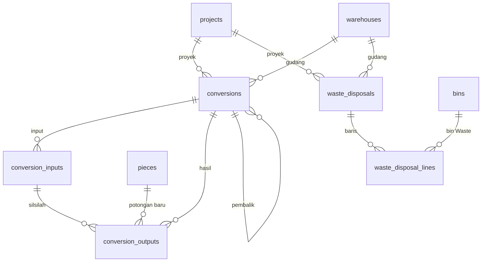

# Spesifikasi Modul — `conversion` & `waste` (Konversi Material dan Berita Acara Waste)

**Versi:** 0.5
**Tanggal:** 26 September 2026
**Status:** selesai Fase 1 — modul kedua belas setelah [Pemakaian material](23-pemakaian.md); dibangun di mesin rumah (XAMPP3, [A-162](04-keputusan-dan-asumsi.md#a-162)) dari rancangan WIP sesi kantor; keputusan yang tidak tertulis di dokumen dicatat sebagai [A-153](04-keputusan-dan-asumsi.md#a-153)–[A-161](04-keputusan-dan-asumsi.md#a-161) (*Perlu validasi*); v0.3: form dirancang ulang per jenis dengan hitung otomatis ([A-229](04-keputusan-dan-asumsi.md#a-229), §6, §13.3); v0.5: satu CNV potong untuk beberapa batang — pola sama (salin, FIFO) atau berbeda per batang ([A-253](04b-asumsi-lanjutan.md#a-253))
**Modul:** `conversion` (CNV) · `waste` (WST)
**Fase:** F1 (potong/rakit/bongkar/ganti kemasan dengan silsilah, offcut & waste, CNV pembalik, approval opsional, BA waste dengan bukti, cetak Bukti Konversi & BA Waste, kolom laporan Material per proyek); resep konversi `[F2]` stub ([BR-CNV-06](05-aturan-bisnis.md#br-cnv))
**Dokumen terkait:** [Blueprint §6.7, §7, §9, §12](01-blueprint.md#67-konversi-material-offcut--waste) · [Aturan Bisnis §BR-CNV](05-aturan-bisnis.md#br-cnv), [§BR-GEN](05-aturan-bisnis.md#br-gen), [§14 matriks kejadian](05-aturan-bisnis.md#14-matriks-kejadian-stok) · [Katalog Status §2.10, §2.14, §3](06-katalog-status-dan-enum.md) · [Glosarium §5](03-glosarium.md#5-dokumen-transaksi) · [Model data 08c](08c-model-data-pendukung.md) · [Alur 6](07a-proses-bisnis-lanjutan.md#alur-6--konversi-material-offcut-dan-berita-acara-waste) · [D-10](04-keputusan-dan-asumsi.md#d-10), [D-11](04-keputusan-dan-asumsi.md#d-11), [A-06](04-keputusan-dan-asumsi.md#a-06), [A-19](04-keputusan-dan-asumsi.md#a-19), [A-36](04-keputusan-dan-asumsi.md#a-36)
**Ketergantungan modul:** `stock` (`StockLedger`, reservasi), `warehouse` (bin penyimpanan & Waste), `master` (proyek, item bisa dipotong, lot/potongan, Alasan), `approval` (kontrak [20-approval §3.9](20-approval.md)), `template` (cetak), `shared` (unggah berkas, laporan), `issue` (laporan Material per proyek).

---

## 1. Tujuan & lingkup

Pembeda utama produk: pipa atau lembar dipotong menjadi item lain; sisanya menjadi **offcut** (kembali ke stok dengan ID potongan baru dan silsilah) atau **waste**. **CNV** mencatat satu konversi di satu gudang untuk satu proyek (Proyek Internal untuk persiapan stok, [D-10](04-keputusan-dan-asumsi.md#d-10), [A-06](04-keputusan-dan-asumsi.md#a-06)): input keluar, output & offcut masuk, waste ke bin Waste, kerf hilang — semuanya lewat kartu stok dengan kejadian `material_converted`. Pola yang sama untuk rakit, bongkar, dan ganti kemasan.

**WST** (Berita Acara Waste) menutup isi bin Waste gudang secara berkala dengan disposisi *dibuang*, *dijual scrap*, atau *dipakai ulang*, disetujui sesuai aturan, lalu ditutup dengan bukti (foto atau nomor BA) — kejadian `waste_disposed`.

Tidak termasuk: resep konversi (`[F2]`, tabel stub `conversion_recipes`); aset (tidak dikonversi, aset rusak/hilang lewat ADJ — [BR-AST-04](05-aturan-bisnis.md#br-ast)); item berserial sebagai input/output; nilai uang atau harga scrap ([D-07](04-keputusan-dan-asumsi.md#d-07)); lampiran generik ([A-68](04-keputusan-dan-asumsi.md#a-68)).

## 2. Aktor & permission

Permission disimpan dengan `module = conversion` dan `module = waste`. Katalog §2.10 menulis `conversion.create/submit/complete/approve/cancel`, §2.14 `waste.create/approve/close/cancel`; izin melihat ditambah ([A-158](04-keputusan-dan-asumsi.md#a-158)).

| Role bawaan | CNV | WST |
|---|---|---|
| Admin Company | semua (6) | semua (5) |
| Kepala Gudang | semua (6) | semua (5) |
| Manajemen | `view`, `approve` | `view`, `approve` |
| Staf Gudang | `view`, `create`, `submit`, `complete`, `cancel` | `view`, `create`, `close`, `cancel` |
| Auditor Internal & Eksternal | `view` | `view` |
| Pemohon Internal, Driver, Penindak Lanjut PR, Klien | — | — |

Batal CNV: pembuat/pengaju atau pemegang `conversion.approve`; ubah draf CNV: pembuat atau pemegang `conversion.complete`; batal WST: pengaju atau pemegang `waste.approve`. Cakupan ([BR-ACC-05](05-aturan-bisnis.md#br-acc)): gudang **dan** proyek dokumen dalam cakupan pengguna (`ScopedToUser`); di luar cakupan = 404. Cetak dan foto bukti memakai izin `view` ([A-124](04-keputusan-dan-asumsi.md#a-124)).

## 3. Entitas & data

Migrasi: `database/migrations/tenant/2026_01_01_000130_create_conversion_waste_tables.php`, mengikuti [ERD 08c](08c-model-data-pendukung.md); kolom di luar ERD digenerate ulang ([A-155](04-keputusan-dan-asumsi.md#a-155), model data v0.13). Model: `Conversion\Models\Conversion`, `ConversionInput`, `ConversionOutput`, `ConversionRecipe` (stub); `Waste\Models\WasteDisposal`, `WasteDisposalLine`.

### 3.1 `conversions` — CNV

`number` (`CNV/<gudang>/<yymm>/<urut>`, [BR-GEN-06](05-aturan-bisnis.md#br-gen)), `project_id`, `warehouse_id`, `conversion_type`, `recipe_id` (F2), `status` (KS 2.10), `reversal_of_id` + `reason_code_id` (pembalik), `total_input/output/offcut/waste/kerf`, `approval_snapshot_id`, `prepared_by`, `submitted_by/at`, `approved_by/at`, `reject_reason_id`, `completed_by/at`, `cancel_reason_id`, `cancelled_at`, `notes`.

### 3.2 `conversion_inputs` dan `conversion_outputs`

Input: `item_id`, `bin_id` (bin penyimpanan), `lot_id`/`piece_id`, `qty_base`, `reversal_of_line_id`, `movement_id`.

Hasil: `output_kind` (`output`/`offcut`/`waste`/`kerf`), `item_id`, `bin_id` (kosong untuk kerf), `stock_status` (Tersedia; waste Rusak), `qty_base` (item per potong: panjang satu potongan), `lot_no`/`lot_id`, `new_piece_id` (potongan baru saat selesai), `parent_input_id` (silsilah ke input), `reason_code_id` (alasan waste), `auto_waste`, `reversal_of_line_id`, `movement_id`.

### 3.3 `waste_disposals` dan `waste_disposal_lines` — WST

Header: `number` (`WST/<gudang>/…`), `warehouse_id`, `project_id`, `disposition`, `target_bin_id` (dipakai ulang), `status` (KS 2.14), `evidence_path`/`evidence_note` (`evidence_attachment_id` belum dipakai), `approval_snapshot_id`, `submitted_by`, `approved_by/at`, `reject_reason_id`, `closed_by/at`, `cancel_reason_id`, `cancelled_at`, `notes`. Baris: `item_id`, `bin_id` (bin Waste), `lot_id`/`serial_id`/`piece_id`, `stock_status`, `qty_base`, `reason_code_id`, `movement_id`.



### 3.4 Enum

Status tetap Katalog §2.10 dan §2.14 (**tanpa status baru**). Katalog §3 v0.14 mendaftarkan `conversion_type` dan `conversion_output_kind` (sudah di ERD) dan menambah `document_template_type = conversion` (Bukti Konversi Material); `waste_disposal` (BA Waste) tidak lagi stub. `approval_document_type` `conversion` dan `waste_disposal` kini tersambung.

## 4. Mesin status

Semua transisi lewat aksi Livewire (POST) kecuali penutupan WST (POST form unggah bukti); route lain hanya GET.

```yaml
conversion:
  initial: draft
  transitions:
    - {from: draft, to: pending_approval, action: conversion.submit, when: rule_matches, effect: approval_submit}   # A-153
    - {from: draft, to: completed, action: conversion.complete, when: no_rule, effect: ledger_material_converted}
    - {from: pending_approval, to: completed, action: conversion.approve, when: last_step, effect: ledger_material_converted}
    - {from: pending_approval, to: draft, action: conversion.approve, when: rejected}                               # A-153
    - {from: [draft, pending_approval], to: cancelled, action: conversion.cancel, effect: approval_withdraw_if_pending}
  terminal: [completed, cancelled]
waste_disposal:
  initial: submitted
  transitions:
    - {from: submitted, to: pending_approval, action: system, when: rule_matches}
    - {from: submitted, to: approved, action: system, when: no_rule}                                                 # A-08
    - {from: pending_approval, to: approved, action: waste.approve, when: last_step}
    - {from: pending_approval, to: rejected, action: waste.approve}
    - {from: approved, to: closed, action: waste.close, guard: evidence, effect: ledger_waste_disposed}               # A-160
    - {from: [submitted, pending_approval], to: cancelled, action: waste.cancel, effect: approval_withdraw_if_pending}
  terminal: [rejected, closed, cancelled]
```

| Transisi | Implementasi | Efek samping |
|---|---|---|
| — → CNV `draft` | `Conversion\Actions\CreateConversion::handle` | guard §5; input dari `Support\ConvertibleStock`, hasil dari `Support\ConversionLines`; draf tidak memegang stok |
| ubah draf | `CreateConversion::update` | baris diganti |
| `draft → pending_approval` | `SubmitConversion` | hanya bila `Support\ConversionApprovalRoute` menemukan aturan; input & neraca diperiksa dulu; `ApprovalEngine::submit` |
| `draft → completed` | `CompleteConversion` | hanya tanpa aturan; `Support\ConversionCompletion` → `ConversionPoster::post` |
| disetujui → `completed` | `ApproveConversion` / kotak tugas → `ConversionApprovalHandler::onApproved` | `ConversionCompletion` (selesai oleh pengaju) |
| ditolak → `draft` | `ApproveConversion::reject` → `onRejected` | `reject_reason_id`; boleh diubah, diajukan ulang, atau dibatalkan |
| CNV pembalik `draft` | `CreateConversion::reverse` | Alasan `*`, salinan baris, BR-CNV-05 diperiksa ([A-157](04-keputusan-dan-asumsi.md#a-157)) |
| pembalik selesai | jalan yang sama (submit/complete) | `ConversionReversibility` diulang; `ConversionPoster::reverse` |
| `→ cancelled` | `CancelConversion` | Alasan `*`; snapshot ditarik |
| — → WST `submitted` → `pending_approval`/`approved` | `Waste\Actions\CreateWasteDisposal` | baris dari `Support\DisposableWaste`; `ApprovalEngine::submit` langsung |
| `pending_approval → approved/rejected` | `ApproveWasteDisposal` / kotak tugas → `WasteDisposalApprovalHandler` | — |
| `approved → closed` | `CloseWasteDisposal` (via `WasteDisposalController@close`) | bukti wajib; saldo diulang; `WastePoster::post`; foto ke disk tenant |
| `→ cancelled` | `CancelWasteDisposal` | Alasan `*`; snapshot ditarik |

**Penangan approval**: `conversion` → `ConversionApprovalHandler` (konteks gudang, proyek, kategori & kepemilikan input dan hasil, jumlah baris input + hasil, input terbesar; SoD pembuat + pengaju; tanpa lapis minimum). `waste_disposal` → `WasteDisposalApprovalHandler` (tanpa aturan = disetujui otomatis).

## 5. Aturan bisnis yang berlaku

| Aturan | Ditegakkan di mana |
|---|---|
| [BR-CNV-01](05-aturan-bisnis.md#br-cnv), [D-10](04-keputusan-dan-asumsi.md#d-10) | Proyek wajib dan aktif; satu gudang aktif; Gudang Site hanya untuk proyek pemiliknya ([A-154](04-keputusan-dan-asumsi.md#a-154)); WST juga wajib proyek ([A-159](04-keputusan-dan-asumsi.md#a-159)) |
| [BR-CNV-02](05-aturan-bisnis.md#br-cnv) | Neraca ukuran untuk potong & ganti kemasan, satu satuan dasar, toleransi pembulatan; minimal satu output/offcut; diulang saat diajukan dan selesai ([A-156](04-keputusan-dan-asumsi.md#a-156)) |
| [BR-CNV-03](05-aturan-bisnis.md#br-cnv), [A-19](04-keputusan-dan-asumsi.md#a-19) | Input hanya item *Bisa dipotong/dikonversi*; offcut hanya item per potong; offcut < `min_offcut_length` otomatis waste |
| [BR-CNV-04](05-aturan-bisnis.md#br-cnv) | Potongan baru: `parent_piece_id` = potongan input induk, `origin_type = conversion`; baris hasil `parent_input_id`; output berlot mewarisi lot input item sama |
| [BR-CNV-05](05-aturan-bisnis.md#br-cnv), [BR-GEN-03/04](05-aturan-bisnis.md#br-gen) | `completed` tidak dibatalkan; CNV pembalik hanya bila semua hasil utuh di bin dan potongan hasil belum bergerak; satu pembalik aktif |
| [BR-STK-03/06](05-aturan-bisnis.md#br-stk), [A-85](04-keputusan-dan-asumsi.md#a-85) | Input: saldo Tersedia bin penyimpanan − alokasi keras; per item Stok Tersedia gudang |
| [BR-STK-08](05-aturan-bisnis.md#br-stk), [BR-AST-04](05-aturan-bisnis.md#br-ast) | Aset ditolak sebagai input, output, dan baris WST |
| [BR-STK-09](05-aturan-bisnis.md#br-stk), [BR-LED-03](05-aturan-bisnis.md#br-led) | Potongan dipakai/ditutup utuh; serial tidak dikonversi; lot output wajib bila tidak diwarisi |
| [BR-OPN-02](05-aturan-bisnis.md#br-opn) | Bin dibeku menolak input dan baris WST |
| [BR-STK-01](05-aturan-bisnis.md#br-stk), [BR-LED-01–06](05-aturan-bisnis.md#br-led) | Semua lewat `StockLedger::post()`/`reverse()`; kejadian di outbox dalam transaksi yang sama |
| [BR-GEN-02](05-aturan-bisnis.md#br-gen), [BR-GEN-11](05-aturan-bisnis.md#br-gen) | Batal, tolak, pembalik menuntut Alasan `*`; alasan waste dari konteks *Waste* |
| [BR-APR-01–03](05-aturan-bisnis.md#br-apr) | Snapshot; CNV tanpa aturan tidak diajukan (BR-APR-02); pembuat/pengaju tidak memutus |
| Katalog §2.14 guard bukti | Foto BA atau nomor BA wajib saat menutup ([A-160](04-keputusan-dan-asumsi.md#a-160)) |

## 6. Layar

| Route | Komponen | Isi |
|---|---|---|
| `/conversions` | `conversion.conversion-list` | Cari nomor, filter proyek & status; jenis, total input & waste, penanda pembalik; tombol *Berita acara waste* & *Konversi baru* |
| `/conversions/create`, `/{id}/edit` | `conversion.conversion-form` | Proyek `*`, gudang `*` (Gudang Site hanya milik proyek), **jenis sebagai tombol pilihan berpenjelasan**; form berubah per jenis ([A-229](04-keputusan-dan-asumsi.md#a-229)): **Potong** = satu batang (pilih/pindai) → tabel *Hasil potong* (item hasil bersatuan sama, panjang × jumlah), kerf dari master item dan sisa dihitung otomatis (offcut ≥ minimum, di bawahnya waste); **Ganti kemasan** = input dari stok (cari/pindai) → item tujuan bersatuan sama, susut otomatis waste; **Rakit/Bongkar** = input & hasil bebas (+ baris waste manual) tanpa neraca. Kartu **Ringkasan (otomatis)** memuat kalimat "6 m → 2 × 2,5 m + offcut 0,99 m + kerf 0,01 m", rincian, peringatan (kerf belum diatur), dan galat per baris; pilihan bin hasil bersama. Tombol *Simpan draf* dan **Simpan & selesaikan** (menjadi *Simpan & ajukan* bila ada aturan approval) |
| `/conversions/{id}` | `conversion.conversion-detail` | Kalimat ringkas + tombol **Buat BA Waste** (bila ada waste, mengisi gudang & proyek di form WST), total bersatuan, input, hasil + silsilah, *Selesaikan* / *Ajukan ke approval* (sesuai aturan), *Ubah draf*, *Setujui*/*Tolak*, *Batalkan*, *Buat CNV pembalik*, riwayat approval, riwayat, **Cetak** |
| `/waste-disposals`, `/create`, `/{id}` | `waste.waste-disposal-list/-form/-detail` | Form: gudang, proyek, disposisi (dipakai ulang → bin tujuan), isi bin Waste (tersedia setelah dipegang BA lain, alasan opsional); detail: *Setujui*/*Tolak*, *Batalkan*, form **Tutup BA waste** (foto dan/atau nomor BA), tautan foto bukti, **Cetak** |
| `POST /waste-disposals/{id}/close` · `GET …/evidence` | `Waste\WasteDisposalController` | Tutup dengan bukti; foto dialirkan setelah izin `view` |
| `GET /print/conversion/{id}`, `/print/waste-disposal/{id}` | `Template\PrintController@document` | PDF Bukti Konversi Material dan BA Waste ([A-160](04-keputusan-dan-asumsi.md#a-160)) |

Menu sidebar **Konversi & waste → Konversi material, Berita acara waste**; palet Ctrl+K (*Konversi material*, *Konversi baru*, *Berita acara waste*, *BA waste baru*), disaring permission.

## 7. Kejadian stok & integrasi

| Kejadian | Pergerakan | Payload tambahan |
|---|---|---|
| `material_converted` (`role = input`) | CNV selesai: bin penyimpanan → keluar | `conversion_number`, `conversion_type`, `project_code`, `warehouse_code`, `kerf_total` |
| `material_converted` (`output`/`offcut`/`waste`) | masuk bin penyimpanan / bin Waste (Rusak) | + `parent_input_id`, `parent_piece_id`, `parent_lot_id`, `auto_waste` |
| `material_converted` (pembalik) | hasil keluar, lalu input kembali (`reverses_movement_id`) | + `reverses_event_id`, `reversal_of` |
| `waste_disposed` | WST ditutup: bin Waste → keluar, atau → bin penyimpanan Tersedia bila dipakai ulang | `waste_disposal_number`, `disposition`, `target_bin_id`, `from_stock_status` |

Matriks [§14](05-aturan-bisnis.md#14-matriks-kejadian-stok) "Input → output/offcut/waste" dan "Bin Waste → keluar". Semua pergerakan membawa `project_id` dokumen. Tidak ada reservasi: draf tidak memegang stok.

## 8. Notifikasi

| Kejadian | Penerima | Kanal | Keadaan |
|---|---|---|---|
| Tugas approval CNV/WST | approver | in-app, email | stub `ApprovalNotifier` ([A-91](04-keputusan-dan-asumsi.md#a-91)) |
| CNV selesai / WST disetujui (siap ditutup) | pembuat, Kepala Gudang | in-app | belum |

## 9. Laporan & dashboard

Laporan **Material per proyek** ([23 §9](23-pemakaian.md#9-laporan--dashboard)) menambah kolom dari kartu stok ber-proyek ([A-161](04-keputusan-dan-asumsi.md#a-161)): *Dikonversi* (input CNV − pembalik), *Hasil konversi* (output + offcut − pembalik), *Waste* (waste CNV + pilah RET ke bin Waste − pembalik), *Waste didisposisi* (WST `closed`). Laporan khusus *Konversi & waste* dengan persentase waste per item (Blueprint §9) dan dashboard waste menunggu modul laporan lanjutan.

## 10. Kasus uji (Given / When / Then)

Uji di `tests/Feature/Conversion` dan `tests/Feature/Waste` (20 uji): `ConversionTest`, `ConversionApprovalTest`, `ConversionReversalTest`, `ConversionScreenTest`, `ConversionChainTest`, `WasteDisposalTest`. Fixture `Conversion\Concerns\ConversionFixtures` memakai `ReturnFixtures`/`TransferFixtures` (CKG, BKS, proyek dengan KRW1/KRW2) ditambah pipa per potong yang bisa dipotong (minimum offcut 0,5 m, kerf 0,005 m) dan batang 6 m di bin CKG.

| ID | Given | When | Then | BR |
|---|---|---|---|---|
| TC-CNV-01 | Batang 6 m | CNV 2 × 2,5 m + offcut 0,99 + kerf 0,01, lalu selesai | draf tanpa pergerakan, 4 baris hasil, total benar; `completed`, saldo 5,99, batang `is_consumed`, potongan baru bersilsilah (`origin_type = conversion`), 4 kejadian `material_converted` (input/output/output/offcut) dengan `kerf_total`; selesai kedua BR-GEN-01 | KS 2.10, BR-CNV-04 |
| TC-CNV-02 | Batang 6 m | hasil kurang, hanya waste, output tanpa item, jumlah 0, campur satuan | BR-CNV-02 ×4, BR-LED-02; selisih dalam toleransi diterima | BR-CNV-02, A-156 |
| TC-CNV-03 | Batang 6 m; baut bisa dipotong | offcut 0,3 m; offcut baut | waste otomatis ke bin Waste Rusak, potongan bukan offcut, total waste 0,3; BR-CNV-03 | BR-CNV-03 |
| TC-CNV-04 | — | tanpa proyek, jenis asing, Gudang Site proyek lain, proyek ditutup, staf BKS, potongan sebagian, melebihi, item tidak bisa dipotong, aset input/output, bin tujuan gudang lain; CNV di KRW1 untuk proyeknya | BR-CNV-01 ×2, BR-GEN-01, BR-PRJ-01, BR-ACC-05, BR-STK-09, BR-STK-06, BR-CNV-03, BR-STK-08 ×2, BR-STK-02; `CNV/KRW1/…` | A-154 |
| TC-CNV-05 | Baut, bracket berlot, semen berlot | rakit tanpa/dengan lot; ganti kemasan semen ke binB + waste beralasan; alasan konteks salah; output berserial | BR-LED-03; lot BR-2609 dibuat, tanpa neraca; lot semen diwarisi, 9 di binB, 1 di Waste; BR-GEN-02; BR-LED-03 | A-154, A-156 |
| TC-CNV-06 | Draf CNV | izin ubah; ubah draf; batang keluar lewat dokumen lain; selesai | pembuat & Kepala Gudang boleh, pemohon tidak; baris terganti; BR-CNV-01, tetap draf | A-154, A-158 |
| TC-CNV-07 | Draf; aturan CNV gudang CKG → Manajemen | ajukan tanpa aturan; ajukan; putus oleh pembuat/pengaju; tolak; ajukan ulang; setujui | BR-APR-02; selesai langsung BR-APR-01; `pending_approval` tanpa pergerakan; BR-APR-03 ×2, BR-GEN-11; kembali `draft` + alasan; `completed`, selesai oleh pengaju, 2 snapshot | A-153 |
| TC-CNV-08 | Draf, menunggu, selesai | batal tanpa/salah alasan; batal draf; batal menunggu; batal selesai | BR-GEN-11 ×2; staf lain tidak boleh, Kepala Gudang boleh; `cancelled`; snapshot `cancelled`; BR-GEN-04 | BR-GEN-04/11 |
| TC-CNV-09 | CNV selesai dengan waste otomatis | pembalik tanpa alasan, dari draf, ganda; selesaikan pembalik | BR-GEN-11, BR-GEN-03, BR-LED-05; saldo kembali 6 m & waste 0, batang tersedia, potongan hasil terpakai, 5 kejadian `reverses_event_id` (input terakhir); pembalik tidak bisa dibalik; batang bisa dikonversi lagi | A-157 |
| TC-CNV-10 | CNV selesai | offcut keluar lewat dokumen lain → buat pembalik; output dipindah setelah pembalik dibuat → selesaikan | BR-CNV-05 ×2, pembalik tetap draf | BR-CNV-05 |
| TC-CNV-11 | Role & cakupan | buka layar, menu, laporan | 200/403/404 sesuai §2; staf BKS 404; menu & palet; laporan memuat *Dikonversi* dan *Waste didisposisi* | BR-GEN-09, BR-ACC-05 |
| TC-CNV-12 | Layar | form (neraca salah lalu tambah offcut & kerf) → daftar → ubah draf → selesaikan → dialog pembalik → batal pembalik | BR-CNV-02; draf 4 hasil; isian terisi kembali; `completed`; Alasan wajib; pembalik tanpa *Ubah draf*, `cancelled` | §6 |
| TC-CNV-15 | Tiga batang 6 m | batang 1: 3 × 1,5; batang 2: 2 × 2 + 1 × 1,5; simpan; ubah draf; selesai | ringkasan 2 batang benar; 2 input, kerf & sisa per batang (offcut 1,485; waste 0,485 < 0,5); pola terisi kembali; `completed`, kedua batang habis; kalimat "2 × 6 M …" | A-253, BR-CNV-03 |
| TC-CNV-16 | Tiga batang | salin pola tanpa batang 1; salin ke 5 (hanya 2); ubah pola batang 3 berlebih; batang ganda | galat; 2 batang FIFO berpola sama + galat jumlah; galat `potong@` batang itu; galat `batang@` | A-253 |
| TC-CNV-13 | CNV selesai, WST | cetak | Bukti Konversi memuat nomor, judul, item, *Dikerjakan oleh*, potongan induk, tanpa harga; PDF 200, driver 403; BA Waste memuat *Saksi* | 18 §5.1, D-07, A-160 |
| TC-CNV-14 | SJ & retur baut rusak, pipa, aturan CNV → Kepala Gudang | pilah waste RET; CNV diputus di *Tugas approval saya*; CNV kedua dibalik; WST tutup kedua waste; laporan | waste 2 baut & 0,3 m; `completed`; laporan: dikonversi 6, hasil 5,695, waste 0,3/2, didisposisi 0,3/2; saldo = kartu stok | lintas modul, A-161 |
| TC-WST-01 | Baut 10 di bin Waste | WST dijual scrap 6; tutup tanpa bukti; tutup dengan nomor BA; tutup lagi | `approved` otomatis, `WST/CKG/…`; BR-GEN-01; `closed`, sisa 4, `waste_disposed` ber-proyek; BR-GEN-01 | A-08, A-160 |
| TC-WST-02 | Baut 10 di Waste | dipakai ulang tanpa bin / bin gudang lain / binB | BR-STK-02 ×2; 4 kembali ke binB Tersedia | A-159 |
| TC-WST-03 | Baut & potongan 0,3 m di Waste | melebihi, bukan bin Waste, kosong, tanpa proyek, disposisi asing, alasan salah, potongan sebagian; dua WST berebut | BR-STK-06, BR-STK-02 ×2, BR-CNV-01, BR-GEN-01, BR-GEN-02, BR-STK-09; jumlah dipegang BA lain BR-STK-06; potongan dibuang `is_consumed` | A-159 |
| TC-WST-04 | Aturan WST → Manajemen | tutup saat menunggu; putus oleh pengaju; tolak; ajukan lagi & setujui; batal disetujui; batal menunggu | BR-GEN-01, BR-APR-03, BR-GEN-11; `rejected` melepas jumlah; `approved`; BR-GEN-01; `cancelled`, snapshot `cancelled` | KS 2.14 |
| TC-WST-05 | WST disetujui | tutup dengan foto | `waste-disposals/<id>.jpg` di disk tenant, saldo 0 | A-160 |
| TC-WST-06 | Layar | form WST (melebihi lalu benar + alasan) → daftar → detail; POST tutup tanpa bukti / auditor / dengan foto; unduh bukti | BR-STK-06; `approved`; galat bukti, 403; `closed`; foto 200 (driver 403) | §6, A-160 |

Uji modul lain yang berubah: TC-ACC-27b (6 permission `conversion`, 5 `waste`), TC-APR-17 (contoh jenis belum tersambung kini `purchase_request`), TC-TPL-04 (`waste-disposal` tidak lagi 501).

## 11. Di luar lingkup modul ini

Resep konversi `[F2]`; rasio rakit/bongkar antar satuan; laporan khusus *Konversi & waste* dan dashboard persentase waste; checklist penutupan proyek yang menawarkan waste ([BR-PRJ-02](05-aturan-bisnis.md#br-prj)); notifikasi §8; lampiran generik; harga scrap (di luar WMS, [D-07](04-keputusan-dan-asumsi.md#d-07)); konversi offline di PWA `[F2]`.

## 12. Definisi selesai

- [x] Migrasi tenant, model, enum untuk §3; ERD digenerate ulang (model data v0.13)
- [x] Mesin status Katalog §2.10 dan §2.14 tanpa status baru; transisi lewat POST
- [x] Penangan approval CNV (opsional) dan WST (otomatis tanpa aturan) terdaftar; tanpa aturan demo ([00-akun-uji §5](../00-akun-uji.md#5-aturan-approval-bawaan-demo))
- [x] Kejadian `material_converted`, pembaliknya, dan `waste_disposed` lewat `StockLedger`
- [x] Enam layar, menu, palet, panel riwayat approval, cetak Bukti Konversi & BA Waste, unggah bukti
- [x] Kolom konversi & waste di laporan Material per proyek
- [x] 11 permission & role di `ReferenceSeeder`
- [x] Semua TC-CNV dan TC-WST lulus; `php artisan test` hijau
- [x] Dokumen diperbarui (versi naik + changelog README)

## 13. Catatan implementasi (24 September 2026)

Domain `app/Domain/Conversion`: 5 aksi (`CreateConversion` dengan `update`/`reverse`, `SubmitConversion`, `CompleteConversion`, `ApproveConversion`, `CancelConversion`), `Support\ConvertibleStock`, `ConversionLines`, `ConversionPoster`, `ConversionCompletion`, `ConversionReversibility`, `ConversionApprovalRoute`, `ConversionApprovalHandler`, 1 policy, 3 komponen Livewire. Domain `app/Domain/Waste`: 4 aksi (`CreateWasteDisposal`, `ApproveWasteDisposal`, `CloseWasteDisposal`, `CancelWasteDisposal`), `Support\DisposableWaste`, `WastePoster`, `WasteDisposalApprovalHandler`, 1 policy, 3 komponen. Satu provider `ConversionServiceProvider` untuk keduanya; controller `Conversion\ConversionController`, `Waste\WasteDisposalController`.

### 13.1 Perubahan di modul lain

1. **Master**: `Piece::nextPieceNo()` menjadi satu-satunya pembuat nomor potongan; dipakai GRN (`TrackingRecords`), ADJ (`AdjustmentPoster`), pilah RET (`SortGoodsReturn`), dan CNV ([22 §13](22-retur-transfer.md)).
2. **Template** ([18 §13](18-template-dokumen-label.md#13-catatan-implementasi-24-september-2026)): jenis `conversion` baru; `waste_disposal` aktif; view `print/documents/{conversion,waste_disposal}` ([A-160](04-keputusan-dan-asumsi.md#a-160)).
3. **Approval** ([20 §13](20-approval.md#13-catatan-implementasi-24-september-2026)): `conversion` & `waste_disposal` tersambung; layar approval menerjemahkan penolakan CNV/WST.
4. **Issue/Shared** ([23 §9](23-pemakaian.md#9-laporan--dashboard), [16 §13](16-shared-laporan-berkas.md)): empat kolom baru laporan Material per proyek.

### 13.2 Keputusan implementasi

1. **Dua jalan dari `draft` diputus satu kelas** (`ConversionApprovalRoute`): aksi dan policy memakai pencocokan aturan yang sama, jadi tombol di layar selalu sama dengan guard ([A-153](04-keputusan-dan-asumsi.md#a-153)).
2. **Draf tidak memegang stok**; input, neraca, dan BR-CNV-05 diulang di `ConversionCompletion` dalam transaksi yang mengunci dokumen.
3. **CNV pembalik positif**: baris pembalik menyalin jumlah asal (tidak negatif seperti ISU); arah pembalikan dibaca dari `reverses_movement_id` di kartu stok, termasuk di laporan.
4. **Bukti WST lewat form biasa**: unggahan Livewire berjalan di luar middleware tenant (seperti foto item).

### 13.3 Rancang ulang form per jenis (25 September 2026)

`Support\ConversionPlanner` (murni, tanpa basis data) mengubah isian sederhana per jenis menjadi baris `outputs` yang sudah lengkap untuk `CreateConversion`; form memakainya untuk pratinjau **dan** saat menyimpan sehingga angka di layar sama dengan yang diperiksa `ConversionLines::assertBalanced` — menutup bug lama `neraca()` yang mengalikan `count` untuk semua baris. Sisa Potong selalu dikirim sebagai `offcut`; `ConversionLines` tetap yang menurunkannya ke waste (`auto_waste`, BR-CNV-03). Draf yang diubah dibaca kembali ke isian per jenis (output ber-`count` dikelompokkan; sisa & kerf otomatis tidak menjadi baris). `kalimatDokumen()` dipakai detail CNV dan hub proyek. Pesan galat tidak lagi menyebut kode asumsi internal. Uji: TC-CNV-15 (`tests/Unit/Conversion/ConversionPlannerTest`), TC-CNV-12 ditulis ulang, TC-CNV-14 (ganti kemasan & rakit dari layar, Simpan & selesaikan / & ajukan, prefill WST); E2E P9.

**26 Sep 2026 — potong banyak batang ([A-253](04b-asumsi-lanjutan.md#a-253)):** `ConversionPlanner::potong` kini menerima beberapa batang; tiap baris ukuran merujuk batangnya lewat `parent`, kerf & sisa dihitung **per batang** (`potongSatu`), galat batang ke-2 dst. berkunci `potong@<kunci>` / `batang@<kunci>`, ringkasan memuat daftar per batang + total ("3 batang (18 m) → 9 × 2 m + …"). Form: batang pertama tetap `batang`/`potong`, batang tambahan di `tambahan` (pilih batang + pola sendiri), tombol **Tambah batang (pola berbeda)** dan **Salin pola batang 1 ke N batang (FIFO)** — batang lain item sama, bukan bin beku, urut potongan tertua (id potongan naik, [A-185](04-keputusan-dan-asumsi.md#a-185)). Ubah draf membaca ulang pola per batang dari `conversion_outputs.parent_input_id`. `kalimatDokumen` mengelompokkan batang sama panjang ("2 × 6 m PIPA"). Tanpa perubahan skema, poster, atau neraca server (Σ input − Σ hasil tetap diperiksa `ConversionLines`). Uji TC-CNV-15, TC-CNV-16.

### 13.4 Sisa pekerjaan

1. Resep `[F2]`, dashboard konversi, notifikasi §8, lampiran generik untuk bukti. ~~Laporan *Konversi & waste*~~ — **selesai** (`ConversionWasteReport`, [16-shared-laporan-berkas §3.2](16-shared-laporan-berkas.md)).
2. ~~Checklist penutupan proyek yang menawarkan waste~~ — **selesai** lewat `ProjectClosureChecklist` di hub proyek (BR-PRJ-02, [A-187](04-keputusan-dan-asumsi.md#a-187), [A-228](04-keputusan-dan-asumsi.md#a-228)).
3. Uji di MySQL 8.4 menunggu mesin dev/staging MySQL ([A-162](04-keputusan-dan-asumsi.md#a-162)).
