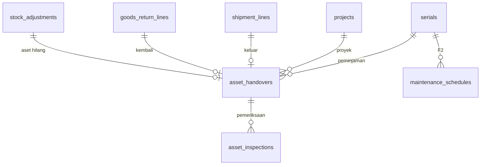

# Spesifikasi Modul — `asset` (Aset Dipinjamkan)

**Versi:** 0.6
**Tanggal:** 25 September 2026
**Status:** selesai Fase 1 — modul ketiga belas setelah [Konversi & Waste](24-konversi-waste.md); melengkapi stub pemeriksaan aset di retur ([A-116](04-keputusan-dan-asumsi.md#a-116)); keputusan yang tidak tertulis di dokumen dicatat sebagai [A-163](04-keputusan-dan-asumsi.md#a-163)–[A-169](04-keputusan-dan-asumsi.md#a-169) (*Perlu validasi*); v0.3: pengingat harian aset lewat jatuh tempo lewat notifikasi ([27-pendukung-f1](27-pendukung-f1.md), [A-189](04-keputusan-dan-asumsi.md#a-189))
**Modul:** `asset` (AST)
**Fase:** F1 (serah terima otomatis dari SJ, kembali lewat RET/GRN, pemeriksaan grade + skor + foto + meter, state aset mengikuti lokasi, aset hilang → ADJ, laporan aset dipinjamkan, cetak BA Serah Terima Aset); jadwal maintenance & pemicu meter `[F2]` stub ([BR-AST-07](05-aturan-bisnis.md#br-ast)); notifikasi jatuh tempo menunggu modul notifikasi
**Dokumen terkait:** [Blueprint §6.8](01-blueprint.md#68-aset-dipinjamkan) · [Aturan Bisnis §BR-AST](05-aturan-bisnis.md#br-ast), [§14 matriks kejadian](05-aturan-bisnis.md#14-matriks-kejadian-stok) · [Katalog Status §2.11, §3](06-katalog-status-dan-enum.md) · [Model data 08c](08c-model-data-pendukung.md) · [A-29](04-keputusan-dan-asumsi.md#a-29), [A-66](04-keputusan-dan-asumsi.md#a-66), [A-116](04-keputusan-dan-asumsi.md#a-116) · [22-retur-transfer](22-retur-transfer.md), [15-picking-shipment](15-picking-shipment.md), [21-opname-penyesuaian](21-opname-penyesuaian.md)
**Ketergantungan modul:** `stock` (`StockLedger`, reservasi, kejadian tanpa pergerakan), `shipment` (SJ aset ke proyek), `return` (RET aset On-site, pemilahan), `receipt` (GRN retur), `adjustment` (ADJ `asset_lost`), `master` (serial, meter, umur), `template` (cetak), `shared` (unggah berkas, laporan).

---

## 1. Tujuan & lingkup

Aset (genset, scaffolding, alat) dipinjamkan ke proyek dan kembali lagi; ia tetap milik company di bin virtual *On-site Proyek* ([A-29](04-keputusan-dan-asumsi.md#a-29)). Modul ini tidak membuat jalur stok baru — aset tetap keluar lewat REQ pinjam → PCK → SJ dan kembali lewat RET → GRN retur → pemilahan — tetapi menambahkan:

- **AST (serah terima aset)**: satu catatan per peminjaman satu serial, lahir otomatis saat SJ aset diterima proyek, `returned` saat GRN retur diterima, `inspected` setelah diperiksa (Katalog §2.11); memuat jatuh tempo, meter keluar-kembali, hari pakai ([BR-AST-05](05-aturan-bisnis.md#br-ast), [A-66](04-keputusan-dan-asumsi.md#a-66)).
- **Pemeriksaan** saat kembali: grade A–D + skor 0–100 % + catatan komponen + foto ([BR-AST-03](05-aturan-bisnis.md#br-ast), [BR-AST-08](05-aturan-bisnis.md#br-ast)) — riwayat kondisi aset.
- **State aset** (`serials.asset_state`) yang selalu mengikuti lokasi dan kondisinya ([BR-AST-01](05-aturan-bisnis.md#br-ast)).
- **Aset hilang** → ADJ keluar lewat approval → dihapuskan ([BR-AST-04](05-aturan-bisnis.md#br-ast)).
- **Jatuh tempo & sisa umur**: laporan *Aset dipinjamkan*, filter lewat jatuh tempo, peringatan sisa umur ([BR-AST-06](05-aturan-bisnis.md#br-ast), [BR-AST-08](05-aturan-bisnis.md#br-ast)).

Tidak termasuk: tarif sewa & penyusutan (Akuntansi, [D-07](04-keputusan-dan-asumsi.md#d-07)); jadwal maintenance `[F2]`; transfer aset On-site → On-site antar proyek ([A-116](04-keputusan-dan-asumsi.md#a-116)); notifikasi in-app/email.

## 2. Aktor & permission

Permission `module = asset`. Katalog §2.11 menulis `asset.inspect`; matriks §14 `asset.mark_lost`; `asset.view` dan `asset.manage` ditambah ([A-168](04-keputusan-dan-asumsi.md#a-168)).

| Role bawaan | Permission |
|---|---|
| Admin Company, Kepala Gudang | semua (4) |
| Staf Gudang | `asset.view`, `asset.inspect` |
| Manajemen, Auditor Internal & Eksternal | `asset.view` |
| Pemohon Internal, Driver, Penindak Lanjut PR, Klien | — |

`asset.manage` = profil masa pakai & melengkapi serah terima keluar. Cakupan ([BR-ACC-05](05-aturan-bisnis.md#br-acc)): AST terlihat bila gudang asal **dan** proyeknya dalam cakupan; aset terlihat bila binnya atau gudang AST-nya dalam cakupan; di luar cakupan = 404. Mencetak dan melihat foto memakai izin `view` ([A-124](04-keputusan-dan-asumsi.md#a-124)). Menyetujui ADJ aset hilang memakai `adjustment.approve`.

## 3. Entitas & data

Migrasi `database/migrations/tenant/2026_01_01_000140_create_asset_tables.php` mengikuti [ERD 08c](08c-model-data-pendukung.md); kolom di luar ERD ([A-165](04-keputusan-dan-asumsi.md#a-165), model data v0.14). Model: `Asset\Models\AssetHandover`, `AssetInspection`, `MaintenanceSchedule` (stub F2); identitas aset tetap `Master\Models\Serial`.

- **`asset_handovers`**: `number` (`AST/<gudang>/<yymm>/<urut>`), `serial_id`, `item_id`, `project_id`, `warehouse_id` (gudang asal SJ), `shipment_id`/`shipment_line_id`, `goods_return_id`/`goods_return_line_id`, `status`, `checked_out_at`, `due_return_date`, `condition_out`, `meter_out`, `returned_at`, `usage_days`, `meter_in`, `usage_hours`/`usage_km`, `lost_at`/`lost_reason_id`/`stock_adjustment_id`, `updated_by`, `notes`.
- **`asset_inspections`**: `asset_handover_id`, `serial_id`, `inspected_by/at`, `condition_grade`, `condition_score`, `component_notes` (json `[{component, note}]`), `photo_path`, `meter_in`, `meter_reset_reason`, `notes`, `resulting_state`.
- **`maintenance_schedules`** `[F2]`: stub tanpa layar.



Enum: status AST Katalog §2.11 (**tanpa status baru**); `condition_grade`, `asset_state`, `meter_unit` dari Katalog §3; `adjustment_origin = asset_lost` kini tersambung; `document_template_type = asset_handover` tidak lagi stub.

## 4. Mesin status

```yaml
asset_handover:
  initial: checked_out
  transitions:
    - {from: null, to: checked_out, action: system, when: shipment_loan_delivered, effect: asset_checked_out}   # ConfirmDelivery
    - {from: checked_out, to: returned, action: system, when: return_grn_received}                             # ReturnProgress
    - {from: returned, to: inspected, action: asset.inspect, guard: grade_score_components_photo}
  terminal: [inspected]
asset_state:            # BR-AST-01, disinkron dari kartu stok & reservasi (A-164)
  available -> reserved: alokasi keras serial / Loading Area
  reserved -> in_transit: SJ berangkat
  in_transit -> on_loan: SJ diterima proyek (bin On-site)
  on_loan -> returned: GRN retur (bin Retur)
  returned -> available|maintenance|damaged: asset.inspect (grade A/B, C, D)
  any -> lost: asset.mark_lost (tanpa pergerakan)
  lost -> written_off: ADJ asset_lost diposting
  lost -> (dihitung ulang): ditemukan kembali, ADJ ditolak/dibatalkan
```

| Transisi | Implementasi | Efek samping |
|---|---|---|
| → `checked_out` | `Shipment\Actions\ConfirmDelivery` → `Asset\Support\AssetCustody::checkOut` | AST baru; jatuh tempo bawaan = target selesai proyek (bila belum lewat); meter keluar = pembacaan terakhir; payload `asset_checked_out` diperkaya |
| lengkapi serah terima | `Asset\Actions\UpdateAssetHandover` (`asset.manage`) | tanggal kembali ≥ tanggal keluar, meter & grade keluar |
| → `returned` | `Return\Support\ReturnProgress::received` → `AssetCustody::returned` | hari pakai; AST susulan bila aset di On-site tanpa AST |
| → `inspected` | `Asset\Actions\InspectAsset` via `POST /asset-handovers/{id}/inspect` | riwayat pemeriksaan, pemakaian meter, grade/skor/akumulasi meter di serial, state = hasil grade; C/D menerbitkan `asset_lost_or_damaged` |
| pilah RET aset | `Return\Actions\SortGoodsReturn` + `AssetCustody::sortProblem` | wajib sudah diperiksa; A/B → layak, C/D → rusak; `asset_returned` membawa hasil pemeriksaan |
| hilang | `Asset\Actions\MarkAssetLost::handle` (`asset.mark_lost`) | state `lost`, `asset_lost_or_damaged`, ADJ `asset_lost` (`CreateStockAdjustment::forLostAsset`) menunggu approval |
| ditemukan | `MarkAssetLost::found` | hanya bila ADJ-nya ditolak/dibatalkan; state dihitung ulang |
| state lain | `Asset\Support\AssetStateSync` (observer `StockMovement::created`, `StockReservation::saved`) | pemetaan BR-AST-01, lihat §5 |

## 5. Aturan bisnis yang berlaku

| Aturan | Ditegakkan di mana |
|---|---|
| [BR-AST-01](05-aturan-bisnis.md#br-ast) | `AssetStateSync`: Penyimpanan Tersedia → `available` (atau `reserved` bila ada alokasi keras), Loading Area → `reserved`, Karantina → `maintenance`, Rusak/bin Waste → `damaged`, Dalam Perjalanan → `in_transit`, On-site → `on_loan` + proyek, Retur → `returned`, keluar lewat ADJ → `written_off`. Aset `lost` tidak berubah oleh pergerakan lain; pemilahan RET memakai hasil pemeriksaan ([A-164](04-keputusan-dan-asumsi.md#a-164)) |
| [BR-AST-02](05-aturan-bisnis.md#br-ast) | Peminjaman ke orang memakai Proyek Internal (SJ loan ke proyek; tidak ada jalur lain) |
| [BR-AST-03](05-aturan-bisnis.md#br-ast) | Pemeriksaan wajib sebelum dipilah; grade + foto wajib; C/D diteruskan lewat `asset_lost_or_damaged` |
| [BR-AST-04](05-aturan-bisnis.md#br-ast) | Hilang: Alasan `*` konteks kehilangan, kejadian tanpa pergerakan, ADJ keluar lewat approval ([A-09](04-keputusan-dan-asumsi.md#a-09)), `written_off` saat diposting; bukan dari Dalam Perjalanan (DSC, [BR-SJ-10](05-aturan-bisnis.md#br-sj)) |
| [BR-AST-05](05-aturan-bisnis.md#br-ast) | Hari pakai = hari kalender zona company, inklusif hari pertama |
| [BR-AST-06](05-aturan-bisnis.md#br-ast) | Lewat jatuh tempo: badge, filter daftar aset & AST, laporan *Aset dipinjamkan* ([A-169](04-keputusan-dan-asumsi.md#a-169)) |
| [BR-AST-08](05-aturan-bisnis.md#br-ast), [A-66](04-keputusan-dan-asumsi.md#a-66) | Skor 0–100 + catatan komponen wajib; meter kembali ≥ meter keluar kecuali meter diganti dengan alasan; sisa umur = 100 − max(hari/umur hari, meter/umur jam) × 100; peringatan < `asset_life_alert_pct` (bawaan 20 %) |
| [BR-STK-08](05-aturan-bisnis.md#br-stk), [BR-LED-04](05-aturan-bisnis.md#br-led) | Aset selalu per serial; satu serial satu bin |
| [BR-GEN-11](05-aturan-bisnis.md#br-gen), [BR-ACC-05](05-aturan-bisnis.md#br-acc) | Alasan wajib; cakupan gudang/proyek |

## 6. Layar

| Route | Komponen | Isi |
|---|---|---|
| `/assets` | `asset.asset-list` | Cari serial/item, filter state, proyek peminjam, lewat jatuh tempo; lokasi, jatuh tempo, grade/skor, sisa umur (merah bila di bawah ambang) |
| `/assets/{serial}` | `asset.asset-detail` | Ringkasan meter & umur, *Ubah profil masa pakai* (`asset.manage`), *Tandai hilang* (dialog Alasan `*`), *Ditemukan kembali*, tautan ADJ, riwayat serah terima, riwayat kondisi, kartu stok serial |
| `/asset-handovers` | `asset.handover-list` | Cari nomor/serial, filter status, proyek, lewat jatuh tempo |
| `/asset-handovers/{id}` | `asset.handover-detail` | Data keluar-kembali, *Lengkapi serah terima* (`asset.manage`), form **Periksa aset** (POST dengan foto, `asset.inspect`), hasil pemeriksaan + foto, riwayat, **Cetak** |
| `POST /asset-handovers/{id}/inspect`, `GET /asset-inspections/{id}/photo` | `Asset\AssetController` | Pemeriksaan; foto lewat route berizin |
| `GET /print/asset-handover/{id}` | `Template\PrintController@document` | PDF BA Serah Terima Aset, blok *Diserahkan · Diterima · Dikembalikan* |
| `/reports/aset-dipinjamkan` | `ReportViewer` | Laporan §9 |

Detail RET menampilkan nomor AST dan statusnya pada baris aset saat pemilahan. Menu sidebar **Aset dipinjamkan → Aset, Serah terima aset**; palet Ctrl+K.

## 7. Kejadian stok & integrasi

| Kejadian | Pergerakan | Payload tambahan |
|---|---|---|
| `asset_checked_out` | SJ loan diterima: Dalam Perjalanan → On-site | `handover_number`, `serial_id`, `serial_no`, `project_code`, `due_return_date`, `meter_unit`, `meter_out`, `condition_out` |
| `asset_returned` | pemilahan RET: bin Retur → bin hasil | `handover_number`, `usage_days`, `usage_hours`/`usage_km`, `meter_out`, `meter_in`, `inspection` {grade, skor, state hasil, waktu} |
| `asset_lost_or_damaged` | **tanpa pergerakan** — pemeriksaan C/D (`kind = damaged`) atau tanda hilang (`kind = lost`) | serial, grade/skor atau alasan, `handover_number` |
| `stock_adjusted` | ADJ `asset_lost` diposting: bin → keluar | `adjustment_origin = asset_lost` |

## 8. Notifikasi

| Kejadian | Penerima | Kanal | Keadaan |
|---|---|---|---|
| Aset lewat jatuh tempo (harian) | PIC proyek, Kepala Gudang | in-app, email | `asset.overdue` lewat `notifications:daily` ke pemegang `asset.manage` di proyek + PIC ([A-235](04-keputusan-dan-asumsi.md#a-235)) |
| Sisa umur di bawah ambang (harian) | Kepala Gudang | in-app | `asset.life_alert`, ambang `asset_life_alert_pct` (BR-AST-08) |
| Tugas approval ADJ aset hilang | approver | in-app | `approval.task_assigned` lewat `ApprovalNotifier` |

## 9. Laporan & dashboard

**Aset dipinjamkan** (`aset-dipinjamkan`, `Shared\Reports\Definitions\LoanedAssetReport`, izin `asset.view`): AST `checked_out` yang tidak hilang — nomor, proyek, item, serial, tanggal keluar, jatuh tempo, lewat (hari), hari pakai berjalan, meter keluar, status; penyaring proyek dan *hanya lewat jatuh tempo*; ekspor Excel. Kolom *Aset di proyek* laporan Material per proyek tetap dari saldo bin On-site.

## 10. Kasus uji (Given / When / Then)

Uji di `tests/Feature/Asset` (12 uji): `AssetLifecycleTest`, `AssetLossTest`, `AssetHandoverTest`, `AssetScreenTest`. Fixture `Asset\Concerns\AssetFixtures`: CKG, proyek + KRW1 + bin On-site, target selesai proyek +30 hari, genset GNS-01 (meter jam 100, umur 1000 hari/1000 jam, grade A) di binB, rantai pinjam/kembali sungguhan.

| ID | Given | When | Then | BR |
|---|---|---|---|---|
| TC-AST-01 | GNS-01 Tersedia | REQ pinjam → PCK → petik → SJ berangkat → diterima | `reserved` → `reserved` → `in_transit` → `on_loan` + proyek + jatuh tempo; AST `AST/CKG/…` meter keluar 100, grade A; `asset_checked_out` membawa nomor AST, serial, meter, jatuh tempo | BR-AST-01, KS 2.11 |
| TC-AST-02 | Dipinjam 3 hari lalu | RET + GRN retur; pilah sebelum diperiksa | AST `returned`, hari pakai 4, state `returned`, di bin Retur; BR-AST-03 | BR-AST-05, BR-AST-03 |
| TC-AST-03 | Aset kembali | periksa: grade E, skor 150, tanpa komponen, tanpa foto, tanpa meter, meter mundur; lalu C + ganti meter; periksa lagi; pilah layak/rusak | BR-AST-03, BR-AST-08 ×4, BR-AST-03; `inspected`, pemakaian 12 jam, `maintenance`, grade/skor/akumulasi 112, foto tersimpan, `asset_lost_or_damaged` damaged; BR-GEN-01; layak BR-AST-03, rusak ke Karantina tetap `maintenance`, `asset_returned` membawa pemeriksaan | BR-AST-03/08 |
| TC-AST-04 | Aset kembali | periksa A meter 180; pilah layak; pinjam lagi | `available`, akumulasi 180, pemakaian 80; sisa umur 82 %; AST kedua meter keluar 180 | A-66 |
| TC-AST-05 | GNS-01 di binB | pindah ke Karantina, kembali Tersedia, berubah Rusak, keluar ADJ; baut bergerak | `maintenance`, `available`, `damaged`, `written_off`; item bukan aset tak tersentuh | BR-AST-01 |
| TC-AST-06 | Dipinjam | izin; tanpa/salah alasan; Kepala BKS; tandai hilang; ulang; ditemukan; putus ADJ dari kotak tugas | Kepala ya, staf tidak; BR-GEN-11 ×2, BR-ACC-05; `lost`, ADJ `asset_lost` menunggu dari bin On-site −1, AST `lost_at`, kejadian `lost` ber-proyek; BR-AST-04 ×2; ADJ `posted`, saldo 0, `written_off` | BR-AST-04 |
| TC-AST-07 | Hilang, ADJ menunggu | ADJ ditolak; ditemukan; ulang | tetap `lost`; `on_loan` lagi + proyek, `lost_at` kosong; BR-GEN-01 | A-167 |
| TC-AST-08 | Dipinjam | izin; tanggal mundur, meter negatif, grade Z; lengkapi; lewat jatuh tempo; laporan; setelah kembali | Kepala ya, staf tidak; BR-AST-06, BR-AST-08, BR-AST-03; tersimpan & tanggal serial ikut; `isOverdue`, laporan lewat 2 hari / hari pakai 11; BR-GEN-01, laporan kosong | BR-AST-06 |
| TC-AST-09 | GNS-01 | profil satuan asing / umur negatif; profil sah; ambang 10 %; ubah meter saat dipinjam | BR-AST-08 ×2; sisa 15 % peringatan, lalu tidak; BR-AST-08; umur tersimpan; serial bukan aset BR-STK-08 | BR-AST-08 |
| TC-AST-10 | Role & cakupan | buka layar, menu | 200/403/404 sesuai §2; staf BKS 404 & tak melihat; serial bukan aset 404; menu | BR-GEN-09, BR-ACC-05 |
| TC-AST-11 | Layar | daftar & filter; lengkapi serah terima (salah lalu benar); POST periksa tanpa foto / auditor / dengan foto; foto; pilah; profil & tandai hilang lewat dialog | tampil/tersaring; BR-AST-06 lalu tersimpan; galat foto, 403, `inspected`; foto 200 (driver 403); `available`; BR-AST-08 lalu tersimpan; Alasan wajib, `lost`; staf tanpa tombol | §6 |
| TC-AST-12 | AST | cetak | nomor, judul, serial, blok *Dikembalikan*, tanpa harga; PDF 200, driver 403; tombol di detail | 18 §5.1, D-07 |
| TC-AST-13 | AST `checked_out` | unggah foto serah terima keluar dua kali | `photo_out_id` menunjuk foto terbaru, dua lampiran tersimpan; staf tanpa `asset.manage` 403; setelah kembali 403 | A-238, P-03 |

Uji modul lain yang berubah: TC-RET-13 (aset diperiksa dulu, `asset_returned` membawa pemeriksaan), TC-TPL-04 (`asset-handover` tak lagi 501), TC-ACC-27b (4 permission `asset`), TC-RPT-01 (9 laporan).

## 11. Di luar lingkup modul ini

Tarif sewa, penyusutan (Akuntansi); jadwal & pemicu maintenance `[F2]`; notifikasi jatuh tempo; transfer aset On-site antar proyek; checklist penutupan proyek "aset sudah kembali" ([BR-PRJ-02](05-aturan-bisnis.md#br-prj)); RFID `[F2]`.

## 12. Definisi selesai

- [x] Migrasi tenant, model, enum untuk §3; ERD digenerate ulang (model data v0.14)
- [x] Mesin status Katalog §2.11 tanpa status baru; state aset BR-AST-01 disinkron dari kartu stok
- [x] AST otomatis dari SJ & GRN retur; pemeriksaan dengan foto; aset hilang lewat ADJ
- [x] Kejadian `asset_checked_out`, `asset_returned` (dengan pemeriksaan), `asset_lost_or_damaged`
- [x] Empat layar, menu, palet, cetak BA Serah Terima Aset, laporan Aset dipinjamkan
- [x] 4 permission & role di `ReferenceSeeder`
- [x] Semua TC-AST lulus; `php artisan test` hijau
- [x] Dokumen diperbarui (versi naik + changelog README)

## 13. Catatan implementasi (24 September 2026)

Domain `app/Domain/Asset`: 4 aksi (`UpdateAssetHandover`, `UpdateAssetProfile`, `InspectAsset`, `MarkAssetLost` dengan `found`), `Support\AssetCustody`, `AssetStateSync`, `AssetQuery`, 2 policy (`AssetHandoverPolicy`, `AssetPolicy` untuk `Serial`), 4 komponen Livewire. Provider `AssetServiceProvider` (policy + observer); controller `Asset\AssetController`; laporan `Shared\Reports\Definitions\LoanedAssetReport`.

### 13.1 Perubahan di modul lain

1. **Shipment** ([15 §13](15-picking-shipment.md)): `ConfirmDelivery` memanggil `AssetCustody::checkOut` sebelum memindah aset ke On-site dan menambahkan payload AST ke `asset_checked_out`.
2. **Return** ([22 §13](22-retur-transfer.md)): `ReturnProgress::received` menandai AST `returned`; `SortGoodsReturn` menolak aset yang belum diperiksa atau hasil pilah yang tidak sesuai grade dan mengisi `inspection` (menggantikan `null` [A-116](04-keputusan-dan-asumsi.md#a-116)); detail RET menampilkan AST.
3. **Adjustment** ([21 §13](21-opname-penyesuaian.md)): `CreateStockAdjustment::forLostAsset` — ADJ asal `asset_lost` boleh dari bin On-site dan tetap lewat approval.
4. **Master**: `Serial::usagePercent` memakai max(hari, meter) sesuai BR-AST-08, ambang `asset_life_alert_pct`, `isOverdue` tidak lagi menghitung hari jatuh tempo sebagai lewat.
5. **Template** ([18 §13](18-template-dokumen-label.md)): `asset_handover` aktif; tidak ada lagi jenis stub.
6. **Shared** ([16 §13](16-shared-laporan-berkas.md)): laporan kesembilan `aset-dipinjamkan`.

### 13.2 Keputusan implementasi

1. **State aset lewat observer**, bukan panggilan di setiap modul: setiap pergerakan serial aset dari modul mana pun memperbarui state sesuai BR-AST-01 ([A-164](04-keputusan-dan-asumsi.md#a-164)). State `inspection` dari Katalog belum dipakai F1 — aset langsung dari `returned` ke hasil pemeriksaan.
2. **Pemeriksaan lewat POST form** (foto), sama dengan penutupan WST.
3. **AST susulan** untuk aset yang sudah di On-site tanpa AST (data sebelum modul ini), supaya pemeriksaan selalu punya induk.

### 13.3 Sisa pekerjaan

1. ~~Notifikasi jatuh tempo & sisa umur~~ — selesai 25 Sep 2026 ([A-235](04-keputusan-dan-asumsi.md#a-235)); jadwal maintenance `[F2]`.
2. Transfer aset On-site antar proyek. ~~Checklist penutupan proyek~~ — **selesai** (`ProjectClosureChecklist` menahan penutupan selama ada aset di proyek; [A-187](04-keputusan-dan-asumsi.md#a-187), TC-MST-25b).
3. ~~Foto serah terima keluar~~ — selesai 25 Sep 2026: `POST /asset-handovers/{id}/photo-out` (`AttachHandoverPhotoOut`, izin `asset.manage`, selama `checked_out`) mengisi `photo_out_id`; foto lama tetap sebagai lampiran ([A-238](04-keputusan-dan-asumsi.md#a-238), TC-AST-13).
