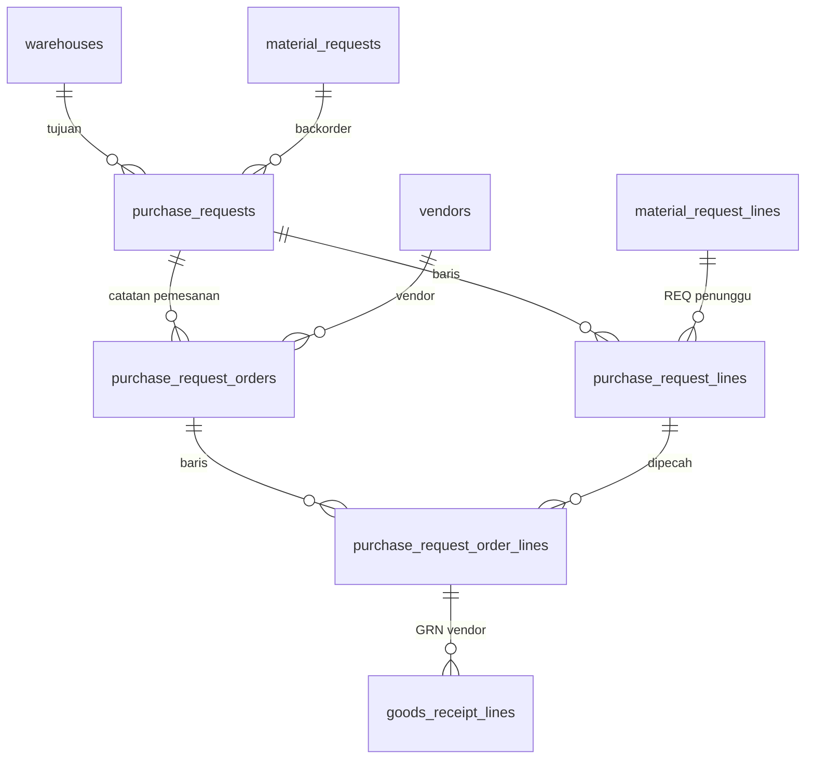

# Spesifikasi Modul — `purchase_request` (Purchase Request)

**Versi:** 0.2
**Tanggal:** 25 September 2026
**Status:** selesai Fase 1 — modul keempat belas setelah [Aset](25-aset.md); menyambung baris REQ bersumber pembelian ([BR-REQ-05](05-aturan-bisnis.md#br-req)) dan rujukan baris GRN vendor yang sebelumnya stub ([19-receipt-putaway](19-receipt-putaway.md) §3); keputusan yang tidak tertulis di dokumen dicatat sebagai [A-170](04-keputusan-dan-asumsi.md#a-170)–[A-175](04-keputusan-dan-asumsi.md#a-175) (*Perlu validasi*); v0.2: notifikasi PRQ disetujui & draf titik pesan ulang ([27-pendukung-f1](27-pendukung-f1.md), [A-189](04-keputusan-dan-asumsi.md#a-189))
**Modul:** `purchase_request` (PRQ)
**Fase:** F1 manual (PRQ dari backorder REQ, titik pesan ulang, dan manual; approval opsional; catatan pemesanan per vendor oleh Penindak Lanjut PR; GRN vendor merujuk catatan pemesanan; reservasi otomatis ke REQ penunggu); sambungan ke modul Purchasing (`po_created`) `[F3]`
**Dokumen terkait:** [Blueprint §6.3a](01-blueprint.md#63a-master-data-lain) · [Aturan Bisnis §BR-REQ](05-aturan-bisnis.md#br-req), [§BR-GRN](05-aturan-bisnis.md#br-grn), [§14 matriks kejadian](05-aturan-bisnis.md#14-matriks-kejadian-stok) · [Katalog Status §2.15, §3](06-katalog-status-dan-enum.md) · [Model data 08b](08b-model-data-stok-dokumen.md) · [A-47](04-keputusan-dan-asumsi.md#a-47), [A-51](04-keputusan-dan-asumsi.md#a-51)–[A-53](04-keputusan-dan-asumsi.md#a-53) · [14-request](14-request.md), [19-receipt-putaway](19-receipt-putaway.md), [20-approval](20-approval.md)
**Ketergantungan modul:** `request` (baris bersumber pembelian), `receipt` (GRN vendor, put-away), `approval` (aturan opsional), `stock` (kejadian tanpa pergerakan, reservasi lunak), `master` (item, vendor, vendor tetap per item, alasan), `warehouse` (gudang tujuan).

---

## 1. Tujuan & lingkup

WMS tidak mengelola harga, PO, maupun pembayaran ([D-07](04-keputusan-dan-asumsi.md#d-07), [D-08](04-keputusan-dan-asumsi.md#d-08)). Modul ini hanya **meminta** barang ke tim pembelian dan **mencatat** apa yang sudah dipesan supaya penerimaan bisa dicocokkan:

- **PRQ** lahir dari tiga asal (Katalog §3 `purchase_request_origin`): **backorder** baris REQ bersumber pembelian, **titik pesan ulang** (job harian, draf), atau **manual**.
- **Approval opsional** lewat mesin approval; kondisi khusus PRQ: jenis vendor dan asal ([BR-APR-07](05-aturan-bisnis.md#br-apr), [A-52](04-keputusan-dan-asumsi.md#a-52)).
- **Catatan pemesanan** per vendor/toko: nomor PO eksternal, nomor pesanan toko online, resi, perkiraan datang ([A-51](04-keputusan-dan-asumsi.md#a-51)); vendor baru boleh dibuat sementara ([A-53](04-keputusan-dan-asumsi.md#a-53)).
- **GRN vendor** merujuk baris catatan pemesanan; PRQ menjadi *Sebagian Terpenuhi* / *Dipenuhi*; barang backorder yang ditaruh direservasi ke REQ penunggunya ([BR-REQ-08](05-aturan-bisnis.md#br-req), [A-47](04-keputusan-dan-asumsi.md#a-47)).

Tidak termasuk: harga, PO, termin, pembayaran (Purchasing `[F3]`); cross-dock ([A-83](04-keputusan-dan-asumsi.md#a-83)); notifikasi ke Penindak Lanjut PR (modul notifikasi).

## 2. Aktor & permission

Permission `module = purchase_request`. Katalog §2.15 menulis `pr.create`, `pr.submit`, `pr.approve`, `pr.order`, `pr.cancel`; `pr.view` ditambah ([A-170](04-keputusan-dan-asumsi.md#a-170)).

| Role bawaan | Permission |
|---|---|
| Admin Company | semua (6) |
| Kepala Gudang | `pr.view`, `pr.create`, `pr.submit`, `pr.approve`, `pr.cancel` |
| Staf Gudang | `pr.view`, `pr.create` |
| Manajemen | `pr.view`, `pr.approve` |
| Penindak Lanjut PR | `pr.view`, `pr.order`, `pr.cancel` |
| Auditor Internal & Eksternal | `pr.view` |
| Pemohon Internal, Driver, Klien | — |

Cakupan ([BR-ACC-05](05-aturan-bisnis.md#br-acc)): **gudang tujuan**; di luar cakupan = 404. Pembuat dan pengaju tidak menyetujui PRQ-nya sendiri ([BR-APR-03](05-aturan-bisnis.md#br-apr)).

## 3. Entitas & data

Migrasi `database/migrations/tenant/2026_01_01_000150_create_purchase_request_tables.php` mengikuti [ERD 08b](08b-model-data-stok-dokumen.md); kolom di luar ERD dan konvensi dicatat [A-172](04-keputusan-dan-asumsi.md#a-172) (model data v0.15). Model di `app/Domain/PurchaseRequest/Models`.

- **`purchase_requests`**: `number` (`PRQ/ALL/<yymm>/<urut>`), `warehouse_id` (tujuan), `project_id?`, `origin`, `material_request_id?` (REQ asal backorder), `status`, `approval_snapshot_id`, `created_by`, `submitted_by/at`, `approved_by/at`, `reject_reason_id`, `forwarded_by/at`, `fulfilled_at`, `cancel_reason_id`, `cancelled_at`, `notes`.
- **`purchase_request_lines`**: `item_id`, `material_request_line_id?` (REQ penunggu), `required_date?`, `qty_base`, `qty_ordered` (Σ catatan), `qty_received` (Σ GRN), `notes`.
- **`purchase_request_orders`** (catatan pemesanan, tanpa status): `vendor_id`, `external_po_no`, `marketplace_order_no`, `tracking_no`, `eta_date`, `ordered_by/at`, `vendor_note` (alasan bila bukan vendor tetap, [A-52](04-keputusan-dan-asumsi.md#a-52)), `notes`.
- **`purchase_request_order_lines`**: `purchase_request_line_id`, `qty_ordered`, `qty_received`, `po_line_ref` `[F3]`.
- **`goods_receipt_lines.purchase_request_order_line_id`** kini FK logis dengan indeks (sebelumnya stub).



Enum: status Katalog §2.15 (**tanpa status baru**), `purchase_request_origin` Katalog §3; `vendor_type`, `vendor_status = provisional` dari Master.

## 4. Mesin status

```yaml
purchase_request:
  initial: draft | submitted
  transitions:
    - {from: null, to: draft, action: system, when: reorder_point_job}                       # ReorderPlanner
    - {from: null, to: submitted, action: [system, pr.create], effect: purchase_requested}   # backorder REQ / manual
    - {from: draft, to: submitted, action: pr.submit, effect: purchase_requested}
    - {from: submitted, to: [pending_approval, approved], action: system}                    # mesin approval, tanpa aturan = approved (A-08)
    - {from: pending_approval, to: [approved, rejected], action: pr.approve}
    - {from: approved, to: forwarded, action: pr.order, guard: minimal_satu_catatan_pemesanan}
    - {from: [forwarded, partially_fulfilled], to: [partially_fulfilled, fulfilled], action: system, when: grn_received}
    - {from: [draft, submitted, pending_approval, approved, forwarded], to: cancelled, action: pr.cancel, guard: alasan_dan_belum_ada_grn, effect: purchase_request_cancelled}
  terminal: [rejected, fulfilled, cancelled]
```

| Transisi | Implementasi | Efek samping |
|---|---|---|
| → `draft` | `Support\ReorderPlanner` via `purchase-requests:reorder` (harian 06:00) | draf per gudang ([A-175](04-keputusan-dan-asumsi.md#a-175)) |
| → `submitted` (manual) | `Actions\CreatePurchaseRequest::handle` (`pr.create`) → `Support\PurchaseRequestFlow::submit` | `purchase_requested`, lalu mesin approval |
| → `submitted` (backorder) | `Request\Support\RequestApprovalHandler::onApproved` → `Support\BackorderPurchases::createFor` | satu PRQ per gudang pemenuh ([A-171](04-keputusan-dan-asumsi.md#a-171)) |
| tinjau draf | `CreatePurchaseRequest::update` (`pr.submit`) | baris & catatan draf diganti |
| `draft → submitted` | `Actions\SubmitPurchaseRequest` (`pr.submit`) | sama dengan manual |
| approval | `Actions\ApprovePurchaseRequest` → `DecideApproval`; `Support\PurchaseRequestApprovalHandler` | tolak = `rejected` + Alasan `*` |
| catatan pemesanan | `Actions\OrderPurchaseRequest` (`pr.order`) | `approved → forwarded` pada catatan pertama; catatan boleh ditambah selama *Diteruskan/Sebagian Terpenuhi* |
| GRN diterima | `Receipt\Actions\ReceiveGoodsReceipt` → `Support\PurchaseReceipts::received` | `qty_received` baris catatan & PRQ; `partially_fulfilled`/`fulfilled` |
| put-away selesai | `Receipt\Actions\CompletePutaway` → `BackorderPurchases::reserveArrivals` | reservasi lunak ke baris REQ penunggu |
| batal | `Actions\CancelPurchaseRequest` (`pr.cancel`) | `purchase_request_cancelled` (bila pernah diajukan); approval menunggu ditarik |
| REQ batal/tutup | `CancelRequest`, `CancelRequestLine`, `CloseRequestShort` → `BackorderPurchases::releaseForRequestLines` | PRQ backorder yang belum diteruskan ikut batal |

## 5. Aturan bisnis yang berlaku

| Aturan | Ditegakkan di mana |
|---|---|
| [BR-REQ-05](05-aturan-bisnis.md#br-req) | Baris REQ bersumber `purchase` melahirkan PRQ `backorder` saat REQ disetujui; item non-katalog harus dipetakan dulu (BR-REQ-03) |
| [BR-REQ-08](05-aturan-bisnis.md#br-req), [A-47](04-keputusan-dan-asumsi.md#a-47) | Barang PRQ backorder yang ditaruh di gudang pemenuh direservasi lunak ke baris REQ penunggunya, sebatas kebutuhan & stok tersedia |
| [BR-REQ-09](05-aturan-bisnis.md#br-req), [BR-REQ-15](05-aturan-bisnis.md#br-req) | REQ/baris dibatalkan atau ditutup sisa → PRQ backorder yang belum diteruskan dibatalkan; yang sudah dipesan dibiarkan |
| [BR-REQ-11](05-aturan-bisnis.md#br-req) | Draf titik pesan ulang: tersedia < titik; jumlah = max(stok minimum − tersedia, titik); tidak dibuat ulang selama ada PRQ terbuka item & gudang itu |
| [BR-GRN-01](05-aturan-bisnis.md#br-grn), [A-51](04-keputusan-dan-asumsi.md#a-51) | Baris GRN vendor boleh merujuk baris catatan: gudang = tujuan PRQ, vendor = vendor catatan, item sama, PRQ *Diteruskan/Sebagian Terpenuhi* ([A-174](04-keputusan-dan-asumsi.md#a-174)) |
| [BR-GRN-05](05-aturan-bisnis.md#br-grn) | Jumlah GRN (kumulatif per baris catatan, termasuk draf GRN lain) ≤ sisa pesanan |
| [BR-APR-07](05-aturan-bisnis.md#br-apr), [A-52](04-keputusan-dan-asumsi.md#a-52) | Kondisi `vendor_types` & `purchase_request_origins`; jenis vendor PRQ dibaca menurut [A-173](04-keputusan-dan-asumsi.md#a-173) |
| [A-53](04-keputusan-dan-asumsi.md#a-53) | Vendor baru dari form catatan: nama `*`, jenis `*`, telepon; status `provisional` |
| [BR-GEN-11](05-aturan-bisnis.md#br-gen), [BR-ACC-05](05-aturan-bisnis.md#br-acc) | Alasan wajib saat tolak/batal; cakupan gudang tujuan (dan proyek bila diisi) |
| [D-07](04-keputusan-dan-asumsi.md#d-07) | Tanpa harga di tabel, layar, maupun payload |

## 6. Layar

| Route | Komponen | Isi |
|---|---|---|
| `/purchase-requests` | `purchase-request.purchase-request-list` | Cari nomor PRQ / PO / pesanan toko, filter gudang tujuan, asal, status; jumlah baris & catatan |
| `/purchase-requests/create` | `purchase-request.purchase-request-form` | PRQ manual: gudang tujuan `*`, proyek opsional, baris item/jumlah/tanggal dibutuhkan; **Ajukan PRQ** |
| `/purchase-requests/{id}/edit` | sama | Tinjau draf titik pesan ulang (`pr.submit`) |
| `/purchase-requests/{id}` | `purchase-request.purchase-request-detail` | Baris (diminta/dipesan/diterima), *Ajukan*, *Setujui/Tolak*, *Catat pemesanan* (vendor tetap disarankan, vendor baru sementara, jumlah per baris), *Batalkan*, daftar catatan pemesanan + GRN yang merujuk, riwayat approval, riwayat |
| `/receipts/create` (vendor) | `receipt.receipt-form` | Kartu **Pesanan PRQ ke vendor ini**: baris catatan yang menunggu barang untuk gudang & vendor terpilih, tombol *Tambah* mengisi baris GRN (item terkunci, jumlah = sisa) |

Menu sidebar **Pembelian → Purchase Request**; palet Ctrl+K *Purchase Request*, *PRQ manual*. Semua transisi lewat aksi Livewire (POST).

## 7. Kejadian stok & integrasi

| Kejadian | Pergerakan | Payload |
|---|---|---|
| `purchase_requested` | tanpa pergerakan | `purchase_request_number`, `origin`, gudang, proyek, nomor REQ, `lines[]` {item, `qty_base`, `required_date`} |
| `purchase_request_cancelled` | tanpa pergerakan | nomor, alasan |
| `goods_received` (GRN vendor) | vendor → Penerimaan/Karantina | tambahan `purchase_request_order_line_id`, `purchase_request_number`, `external_po_no` |

Fase 3: kejadian `po_created` dari Purchasing mengisi catatan pemesanan yang sama ([A-51](04-keputusan-dan-asumsi.md#a-51)).

## 8. Notifikasi

| Kejadian | Penerima | Kanal | Keadaan |
|---|---|---|---|
| PRQ disetujui / draf titik pesan ulang | Penindak Lanjut PR / Kepala Gudang | in-app | belum — daftar tersaring status sebagai pengganti |
| Tugas approval PRQ | approver | in-app | stub `ApprovalNotifier` |

## 9. Laporan & dashboard

Belum ada laporan khusus; daftar PRQ memuat filter yang dibutuhkan. Kartu stok dan kejadian `purchase_requested` terlihat di laporan kejadian stok.

## 10. Kasus uji (Given / When / Then)

Uji di `tests/Feature/PurchaseRequest` (12 uji): `PurchaseRequestTest`, `PurchaseRequestChainTest`, `PurchaseRequestScreenTest`; fixture `Concerns\PurchaseFixtures` (gudang, vendor, item dari `ReceiptFixtures`, rantai keluar `OutboundChain`, satu proyek).

| ID | Given | When | Then | BR |
|---|---|---|---|---|
| TC-PRQ-01 | Tanpa aturan | PRQ manual 2 baris | `PRQ…`, asal manual, `approved`; `purchase_requested` 2 baris tanpa harga | KS 2.15, A-08 |
| TC-PRQ-02 | — | tanpa baris; jumlah 0; item nonaktif; gudang di luar cakupan | BR-GEN-11, BR-LED-02, BR-MST-05, BR-ACC-05 | BR-ACC-05 |
| TC-PRQ-03 | Aturan toko online 2 lapis; vendor tetap baut = toko online | PRQ baut; putus; PRQ semen; tolak tanpa/dengan alasan | `pending_approval`; pembuat & Manajemen belum boleh, Kepala ya; `approved` setelah 2 lapis; semen `approved` langsung; BR-GEN-11 lalu `rejected`, tak bisa dipesan | BR-APR-07, BR-APR-03 |
| TC-PRQ-04 | PRQ 100 | pesan 120, 0; pesan 60; 40 ke toko baru; 1 lagi | BR-REQ-08, BR-GEN-11; `forwarded`; vendor `provisional`, rujukan "INV · resi"; Σ dipesan 100; BR-REQ-08 | A-51, A-53 |
| TC-PRQ-05 | PRQ 100 dipesan | GRN vendor lain, item lain, 101; draf 70 lalu 40 | BR-GRN-01 ×2, BR-GRN-05 ×2; terima 70 → `partially_fulfilled`, `goods_received` membawa PRQ & PO; terima 30 → `fulfilled`, tak bisa dibatalkan | BR-GRN-01/05 |
| TC-PRQ-06 | PRQ disetujui | batal tanpa/dengan alasan; batal setelah GRN; izin | BR-GEN-11; `cancelled` + `purchase_request_cancelled`; BR-GEN-01; staf tak batal/pesan, Penindak Lanjut pesan | KS 2.15 |
| TC-PRQ-07 | REQ baut 40 bersumber pembelian | REQ disetujui → PRQ → pesan → GRN → selesai → put-away → PCK → SJ | PRQ backorder `approved` baris → REQ; `fulfilled`; baris REQ reservasi lunak 40, tersedia 0; SJ diterima, REQ `completed` | BR-REQ-05/08 |
| TC-PRQ-08 | REQ pembelian | batal sebelum dipesan; batal setelah dipesan | PRQ `cancelled`; PRQ tetap `forwarded` | BR-REQ-09/15 |
| TC-PRQ-09 | Baut titik 10, minimum 30, stok 5 | job dua kali; tinjau 50; ajukan | satu draf 25 di CKG; tidak dobel; `approved` 50 | BR-REQ-11 |
| TC-PRQ-10 | Role & cakupan | buka layar, menu | 200/403/404 sesuai §2; ubah non-draf 403; staf BKS 404; menu & palet | BR-GEN-09, BR-ACC-05 |
| TC-PRQ-11 | Layar | form (jumlah 0 lalu benar) → daftar → catat pemesanan (vendor tetap tersaran) → batal lewat dialog | BR-LED-02; `approved` tanpa proyek; `forwarded`, semen tak dipesan; Alasan wajib lalu `cancelled` | §6 |
| TC-PRQ-12 | PRQ dipesan | form GRN vendor: *Tambah* pesanan, ubah 20, simpan, buka draf | nomor PRQ tampil; baris terisi & terkunci; rujukan tersimpan & dimuat ulang | A-174 |

Uji modul lain yang berubah: TC-ACC-27b (6 permission `purchase_request`), TC-APR-17 (jenis di luar katalog; semua jenis Katalog sudah tersambung), TC-APR-21 (7 aturan demo, termasuk PRQ toko online).

## 11. Di luar lingkup modul ini

Harga, PO, termin, pembayaran, perbandingan penawaran (Purchasing `[F3]`); cross-dock ([A-83](04-keputusan-dan-asumsi.md#a-83)); notifikasi; laporan kinerja vendor (waktu datang vs ETA) `[F2]`; pembatalan sebagian catatan pemesanan.

## 12. Definisi selesai

- [x] Migrasi tenant, model, enum §3; ERD digenerate ulang (model data v0.15)
- [x] Mesin status Katalog §2.15 tanpa status baru; approval opsional lewat mesin approval
- [x] Backorder REQ → PRQ → GRN → reservasi REQ; pembatalan ikut REQ
- [x] Job titik pesan ulang terjadwal harian
- [x] Kejadian `purchase_requested`, `purchase_request_cancelled`; payload `goods_received` diperkaya
- [x] Tiga layar + kartu pesanan di form GRN, menu, palet
- [x] 6 permission & role di `ReferenceSeeder`; aturan demo PRQ di `ApprovalDemoSeeder`
- [x] Semua TC-PRQ lulus; `php artisan test` hijau
- [x] Dokumen diperbarui (versi naik + changelog README)

## 13. Catatan implementasi (25 September 2026)

Domain `app/Domain/PurchaseRequest`: 5 aksi (`CreatePurchaseRequest` dengan `update`, `SubmitPurchaseRequest`, `ApprovePurchaseRequest`, `OrderPurchaseRequest`, `CancelPurchaseRequest`), `Support\PurchaseRequestFlow`, `PurchaseLines`, `PurchaseRequestApprovalHandler`, `BackorderPurchases`, `PurchaseReceipts`, `ReorderPlanner`, `Console\GenerateReorderRequestsCommand`, policy, 3 komponen Livewire. Provider `PurchaseRequestServiceProvider`; controller `PurchaseRequest\PurchaseRequestController`; jadwal di `routes/console.php`.

### 13.1 Perubahan di modul lain

1. **Request** ([14 §13](14-request.md)): `RequestApprovalHandler::onApproved` membuat PRQ backorder setelah TRF; `CancelRequest`, `CancelRequestLine`, `CloseRequestShort` melepas PRQ yang belum diteruskan.
2. **Receipt** ([19 §13](19-receipt-putaway.md)): `SaveGoodsReceipt` menerima & menjaga `purchase_request_order_line_id`; `ReceiveGoodsReceipt` mencatat jumlah diterima ke PRQ dan memperkaya `goods_received`; `CompletePutaway` mereservasi barang backorder PRQ; form GRN vendor punya kartu pesanan PRQ.
3. **Approval** ([20 §13](20-approval.md)): penangan PRQ terdaftar — semua jenis dokumen Katalog kini tersambung; kotak tugas menangkap `PurchaseRequestRuleException`; aturan demo *PRQ toko online*.

### 13.2 Keputusan implementasi

1. **PRQ backorder tidak menunggu tinjauan**: langsung diajukan seperti PRQ manual, karena REQ-nya sudah disetujui ([A-171](04-keputusan-dan-asumsi.md#a-171)).
2. **Jenis vendor untuk aturan** dibaca sebelum ada catatan pemesanan dari vendor tetap item ([A-173](04-keputusan-dan-asumsi.md#a-173)).
3. **Rujukan GRN per baris layar**, bukan per GRN: satu GRN boleh memuat beberapa PRQ dari vendor yang sama dan baris tanpa rujukan ([A-174](04-keputusan-dan-asumsi.md#a-174)).

### 13.3 Sisa pekerjaan

1. Notifikasi ke Penindak Lanjut PR dan Kepala Gudang (modul notifikasi).
2. Sambungan Purchasing `[F3]` (`po_created`, `po_line_ref`).
