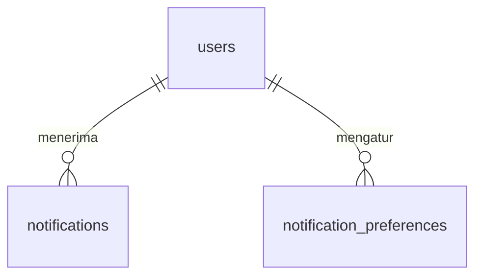

# Spesifikasi Modul — Pendukung Fase 1

**Versi:** 0.5
**Tanggal:** 25 September 2026
**Status:** selesai Fase 1 — kumpulan pekerjaan pendukung setelah modul [Platform](17-platform-login.md) (urutan prompt serah terima §2 butir 5); keputusan yang tidak tertulis di dokumen dicatat sebagai [A-185](04-keputusan-dan-asumsi.md#a-185)–[A-193](04-keputusan-dan-asumsi.md#a-193) (*Perlu validasi*); v0.4: pindai di form REQ & ISU ([A-206](04-keputusan-dan-asumsi.md#a-206)), impor vendor & saldo awal ([A-207](04-keputusan-dan-asumsi.md#a-207))
**Modul:** lintas modul — `stock` (strategi pengambilan), `shared` (Beranda, laporan, PDF), `master` (penutupan proyek, wizard setup, impor Excel), `request` (konfirmasi & keberatan terima), `notification` (baru), PWA
**Fase:** F1; WhatsApp `[F2]`, PWA offline penuh `[F2]`
**Dokumen terkait:** [Blueprint §6.9a, §10, §11, §18](01-blueprint.md) · [Aturan Bisnis BR-STK-04/10/12, BR-PRJ-02/04, BR-REQ-10, BR-SJ-10](05-aturan-bisnis.md) · [Model data 08c `notifications`](08c-model-data-pendukung.md) · [A-49](04-keputusan-dan-asumsi.md#a-49), [A-63](04-keputusan-dan-asumsi.md#a-63), [A-77](04-keputusan-dan-asumsi.md#a-77)
**Ketergantungan modul:** semua modul Fase 1 sebelumnya.

---

## 1. Tujuan & lingkup

Menutup butir Fase 1 [Blueprint §18](01-blueprint.md#18-peta-modul--fase-rilis) yang masih *sebagian* atau *belum* setelah semua modul dokumen selesai:

| # | Butir | Ringkas |
|---|---|---|
| 1 | Strategi pengambilan | Alokasi keras PCK mengikuti FIFO / FEFO / sisa potongan dulu / manual; lot kedaluwarsa dilewati; baris saldo yang sudah dialokasikan PCK lain tidak dijanjikan dua kali |
| 2 | Beranda dinamis | Kartu *pekerjaan menunggu* per izin & cakupan menggantikan kartu statis "Modul berikutnya" |
| 3 | Guard penutupan proyek | Checklist BR-PRJ-02 sebelum tutup/batal; Gudang Site dinonaktifkan saat ditutup (BR-PRJ-04) |
| 4 | Konfirmasi & keberatan terima | BR-REQ-10: *Terima* / *Ajukan keberatan* per SJ di layar REQ & portal; otomatis dikonfirmasi lewat batas |
| 5 | Notifikasi in-app & email | Lonceng, halaman notifikasi, preferensi kanal per kejadian, email opsional, pengingat harian |
| 6 | Laporan inti §6.9a + ekspor PDF | Saldo stok, mutasi periode, permintaan terbuka & barang rusak, konversi & waste, akurasi stok; PDF untuk semua laporan |
| 7 | Wizard setup awal | Checklist langkah dari data company, persetujuan ketentuan (NFR-11), tanda selesai |
| 8 | Impor dari Excel | Item, proyek (+klien baru), vendor, dan saldo awal (menjadi ADJ per gudang), semua-atau-tidak, lewat aturan form yang sama |
| 9 | PWA | Installable (manifest + service worker + halaman offline), pindai kamera (termasuk form REQ & ISU), draf lokal hitung opname & bukti terima (A-49) |

Tidak termasuk: WhatsApp `[F2]`; PWA offline penuh & antrean sinkron `[F2]`; impor bin; editor naskah ketentuan final (O-11); landing page (Part 5).

## 2. Aktor & permission

Tidak ada permission baru. Setiap butir memakai izin modul asalnya:

| Butir | Izin |
|---|---|
| Kartu Beranda | izin lihat modul kartu (`approval-inbox`, `request.review`, `pick.view`, `shipment.view`, `discrepancy.view`, `receipt.view`, `putaway.view`, `pr.view`, `pr.submit`, `count.view`, `asset.view`) |
| Tutup/batal proyek | `project.close` (tetap) |
| Terima / keberatan | `request.confirm_receipt`, `request.dispute_receipt` (sudah diseed ke Pemohon Internal & Klien sejak modul Request) + izin lihat REQ-nya |
| Notifikasi | setiap user untuk notifikasinya sendiri |
| Laporan baru | `stock.view` (saldo, mutasi), `request.view` (permintaan terbuka), `conversion.view`, `count.view` |
| Wizard setup | `company_setting.manage` |
| Impor item / proyek / vendor / saldo awal | `item.create` / `project.create` (+`client.create` untuk klien baru) / `vendor.create` / `adjustment.create` |

## 3. Entitas & data

Satu migrasi tenant baru `2026_01_01_000160_create_notification_tables.php` sesuai [ERD 08c](08c-model-data-pendukung.md):

- **`notifications`**: `id` uuid, `user_id`, `type` (kunci kejadian), `channel` (`in_app`/`email`/`whatsapp`), `title`, `body`, `url` (relatif), `data`, `document_type`, `document_id`, `sent_at`, `read_at` — `title`, `body`, `url` di luar ERD ([A-189](04-keputusan-dan-asumsi.md#a-189)).
- **`notification_preferences`**: PK(`user_id`, `event_key`), `in_app`, `email`, `whatsapp` (`[F2]`).

Pengaturan company baru (tabel `company_settings`, tanpa migrasi): `terms_accepted` {versi, oleh, waktu}, `setup_completed_at` ([A-191](04-keputusan-dan-asumsi.md#a-191)).

## 4. Mesin status

Tanpa status baru. Perubahan perilaku:

| Dokumen | Perubahan |
|---|---|
| PCK dibuat | alokasi keras mengikuti `Stock\Support\RemovalOrder` ([A-185](04-keputusan-dan-asumsi.md#a-185)) |
| Proyek `active → closed/cancelled` | ditolak `BR-PRJ-02` bila checklist belum bersih ([A-187](04-keputusan-dan-asumsi.md#a-187)) |
| Bukti terima `confirmation` | `null → confirmed / disputed / auto_confirmed` (Katalog §3 `receipt_confirmation`) |
| DSC `client_dispute` | lahir dari keberatan; diselesaikan tanpa pergerakan stok ([A-188](04-keputusan-dan-asumsi.md#a-188)) |

## 5. Aturan bisnis yang berlaku

| Aturan | Ditegakkan di mana |
|---|---|
| [BR-STK-04](05-aturan-bisnis.md#br-stk), BR-STK-10, BR-STK-12, matriks §15 | `RemovalOrder`: `fifo` = tanggal terima lot → perolehan serial → lahir potongan → saldo pertama terisi; `fefo` = kedaluwarsa terdekat lalu FIFO; `offcut_first` = sisa potongan lalu FIFO; `manual` = kode bin. Lot/serial kedaluwarsa tidak dialokasikan otomatis. `CreatePickTask` mengurangi alokasi keras aktif per baris saldo |
| [BR-PRJ-02](05-aturan-bisnis.md#br-prj), BR-PRJ-03, BR-PRJ-04 | `Master\Support\ProjectClosureChecklist` (REQ `submitted` s.d. `partially_fulfilled`, SJ `prepared`/`shipped`, DSC `open`, aset `on_loan`, saldo Gudang Site); barang jual putus terkirim tidak dihitung; `ChangeProjectStatus` menonaktifkan Gudang Site saat `closed` |
| [BR-REQ-10](05-aturan-bisnis.md#br-req), [A-63](04-keputusan-dan-asumsi.md#a-63) | `Request\Actions\RespondDeliveryReceipt`: hanya dalam `receipt_confirm_days`; keberatan per baris ≤ jumlah baik, rusak wajib foto, hanya baris REQ si pemohon; tanggapan satu per SJ dengan kunci baris ([A-197](04-keputusan-dan-asumsi.md#a-197)); lewat batas → `deliveries:auto-confirm` (harian 01:00) |
| [BR-SJ-10](05-aturan-bisnis.md#br-sj) | keberatan membuka DSC `client_dispute` (atau menambah baris ke DSC keberatan yang masih terbuka); `ResolveDiscrepancy` tidak memindah stok untuk DSC ini; `still_needed` mengurangi `qty_received` dan membuka lagi baris REQ yang masih berjalan, ditolak bila REQ sudah `completed` ([A-198](04-keputusan-dan-asumsi.md#a-198)) |
| Blueprint §10 | `Notification\Support\Notifier`: in-app bawaan nyala, email bawaan hanya tugas approval, tagihan, dan aset lewat jatuh tempo; pelaku & user nonaktif dilewati; pengingat yang sama belum dibaca tidak digandakan; email dikirim setelah commit dan galatnya tidak membatalkan aksi ([A-199](04-keputusan-dan-asumsi.md#a-199)) |
| Blueprint §6.9a, UX-11/12 | laporan terdaftar di `ReportRegistry`; ekspor PDF A4 mendatar lewat `PdfRenderer`; cakupan gudang/proyek pengguna ([A-190](04-keputusan-dan-asumsi.md#a-190)) |
| NFR-11 | wizard mewajibkan persetujuan ketentuan layanan & kebijakan privasi (naskah sementara sampai O-11) |
| [BR-MST-01](05-aturan-bisnis.md#br-mst), BR-MST-04, BR-STK-11 | impor lewat `SaveItem` / `SaveProject` / `SaveClient` (`Master\Support\ExcelRows`, `ImportBatch`); kode ganda, klien tak dikenal & kombinasi tidak sah ditolak per baris ([A-192](04-keputusan-dan-asumsi.md#a-192)); vendor lewat `SaveVendor` (A-52, A-53); saldo awal lewat `AdjustmentLines` lalu `CreateStockAdjustment` — satu ADJ manual per gudang beralasan *Saldo awal* (`OPENING`), tetap approval A-09, stok baru bergerak saat diposting (P-01, [A-207](04-keputusan-dan-asumsi.md#a-207)) |
| [A-121](04-keputusan-dan-asumsi.md#a-121), [A-206](04-keputusan-dan-asumsi.md#a-206) | `Master\Support\ScanCode` membaca kode/barcode/QR item, QR lot `<item>\|<lot>`, nomor lot/serial/potongan; dipakai form REQ & ISU |
| [A-49](04-keputusan-dan-asumsi.md#a-49) | draf hitung opname & bukti terima di perangkat ([A-193](04-keputusan-dan-asumsi.md#a-193)) |
| D-07 | laporan & notifikasi tanpa harga |

## 6. Layar

| Route | Isi |
|---|---|
| `/` (Beranda) | spanduk *Lanjutkan setup* (pengelola pengaturan), kartu pekerjaan menunggu bertaut ke daftar tersaring, penugasan role |
| Detail REQ & `/portal/requests/{id}` | kartu **Pengiriman & konfirmasi terima**: SJ, bukti terima, batas tanggapan, tombol *Terima* dan *Ajukan keberatan* (form per baris + foto) |
| `POST /requests/{id}/receipts/{pod}/confirm · dispute` (juga di `/portal/…`) | tanggapan pemohon |
| Header (lonceng) · `/notifications` · `/notifications/preferences` | 5 notifikasi belum dibaca, tandai dibaca lewat POST, semua notifikasi, preferensi lonceng/email per kejadian |
| `/reports/{kunci}` · `/reports/{kunci}/pdf` | 5 laporan baru; tombol **Ekspor PDF** di semua laporan |
| `/setup` · `POST /setup/terms · complete` | wizard setup (menu Administrasi → Setup awal, palet) |
| `/imports` · `/imports/{items,projects,vendors,opening-stock}/template` · `POST /imports/{…}` | impor item, proyek, vendor, saldo awal (tombol *Impor Excel* di daftar item, proyek, vendor; *Impor saldo awal* di daftar penyesuaian; palet; langkah wizard *Saldo awal*) |
| PWA | `/manifest.webmanifest`, `/sw.js`, `/offline.html`; tombol kamera pada input ber-`data-scan` (lot temuan opname, lot GRN, **Pindai item** di form REQ, **Pindai barang** di form ISU); status draf pada hitung opname & dialog bukti terima |

## 7. Kejadian stok & integrasi

Tidak ada kejadian stok baru. Job terjadwal baru: `deliveries:auto-confirm` (01:00), `stock:reconcile` (02:00, [A-243](04-keputusan-dan-asumsi.md#a-243)), `notifications:daily` (07:00: SLA tinjau REQ, reservasi menggantung, aset lewat jatuh tempo, sisa umur aset — `Notification\Support\DailyReminders`, [A-235](04-keputusan-dan-asumsi.md#a-235)). Semua job harian melewati company yang ditangguhkan ([A-236](04-keputusan-dan-asumsi.md#a-236)).

## 8. Notifikasi

| Kejadian (`type`) | Penerima | Email bawaan |
|---|---|---|
| `approval.task_assigned` | approver lapis aktif | ya |
| `approval.decided` | pengaju | tidak |
| `request.under_review` | pemegang `request.review` di proyek itu | tidak |
| `delivery.received` | pemohon REQ yang boleh mengonfirmasi | tidak |
| `discrepancy.opened` | pemegang `discrepancy.resolve` di gudang SJ | tidak |
| `purchase_request.approved` | pemegang `pr.order` di gudang tujuan | tidak |
| `purchase_request.reorder_draft` | pemegang `pr.submit` di gudang | tidak |
| `asset.overdue` | pemegang `asset.manage` di proyek aset + PIC proyek (harian) | ya |
| `asset.life_alert` | pemegang `asset.manage` (harian, sisa umur < ambang) | tidak |
| `item.provisional_created` | pemegang `item.create` | tidak |
| `project.closed` | PIC proyek + pemegang `warehouse.update` di proyek | tidak |
| `stock.period_locked` | pemegang `warehouse.update` | tidak |
| `stock.balance_mismatch` | pemegang `stock.lock_period` (rekonsiliasi harian `stock:reconcile`, [A-243](04-keputusan-dan-asumsi.md#a-243)) | ya |
| `stock.reservation_stale` | pemegang `reservation.release` di gudang + pemohon REQ (harian) | tidak |
| `request.review_overdue` | pemegang `request.review` di proyek (harian) | tidak |
| `request.decided` | pemohon REQ (bila bukan pengaju approval) | tidak |
| `request.line_substituted` · `request.promise_changed` · `request.line_cancel_decided` | pemohon REQ (klien → tautan portal) | tidak |
| `request.line_cancel_requested` | pemegang `request.confirm_cancel` di proyek | tidak |
| `subscription.billing` | pemegang `billing.view` (tagihan terbit, jatuh tempo, ditangguhkan — [A-202](04-keputusan-dan-asumsi.md#a-202)) | ya |

## 9. Laporan & dashboard

| Kunci | Judul | Izin | Isi |
|---|---|---|---|
| `saldo-stok` | Saldo stok | `stock.view` | gudang, bin, item, lot/serial/potongan, kondisi, jumlah, jumlah potong |
| `mutasi-periode` | Mutasi periode | `stock.view` | saldo awal, masuk, keluar, akhir per gudang & item; pindah antar bin satu gudang tidak dihitung |
| `permintaan-terbuka` | Permintaan terbuka & barang rusak | `request.view` | baris REQ terbuka + lewat hari; baris DSC terbuka + umur |
| `konversi-waste` | Konversi & waste | `conversion.view` | per proyek & item input: input, output, offcut, waste, kerf, % waste (pembalik mengurangi) |
| `akurasi-stok` | Akurasi stok | `count.view` | per sesi OPN: baris dihitung, cocok, akurasi %, selisih per kelas |

Kartu stok per item tetap layar `/stock/items/{id}` (13-stock). Total 14 laporan.

## 10. Kasus uji (Given / When / Then)

| ID | Berkas | Ringkas |
|---|---|---|
| TC-PCK-12 | `Shipment/RemovalStrategyTest` | FEFO: lot terdekat dulu, lot lewat dilewati; stok tidak kedaluwarsa habis → BR-SJ-01 |
| TC-PCK-13 / 14 / 15 | sama | FIFO saldo lama dulu; sisa potongan dulu; manual urut kode bin |
| TC-DSH-01 | `Shared/DashboardTest` | kartu sesuai izin (Kepala Gudang, Driver, Penindak Lanjut PR) |
| TC-MST-20 | `Master/ProjectClosureTest` | saldo Gudang Site menolak tutup & batal (BR-PRJ-02, saran ISU); kosong → ditutup, kedua Gudang Site nonaktif |
| TC-REQ-30 / 31 / 32 | `Request/DeliveryReceiptResponseTest` | terima dari layar, ulang ditolak, staf 403; keberatan (foto wajib, batas jumlah) → DSC `client_dispute`, diselesaikan tanpa pergerakan; lewat batas → `auto_confirmed` |
| TC-REQ-33 | sama | keberatan `still_needed`: REQ `completed` → ditolak BR-SJ-10; REQ berjalan → baris dibuka lagi, `qty_received` 8, backorder 2 |
| TC-NTF-01 … 06 | `Notification/NotificationTest` | tugas approval (in-app + email), keputusan, PRQ disetujui; bukti terima → pemohon, lonceng & buka; preferensi; tanpa duplikat, pelaku & nonaktif dilewati; SMTP mati → PRQ tetap tersimpan, email tidak dicatat; eskalasi → approver baru diberi tahu dengan asal tugas |
| TC-RPT-01 | `Shared/ReportTest` | 14 laporan; Driver + saldo-stok & mutasi-periode |
| TC-RPT-02 … 05 | `Shared/CoreReportTest` | saldo & cakupan; mutasi hari ini & periode berikutnya; konversi & waste 0,17 %; akurasi kosong; PDF semua laporan 200, Driver 403 |
| TC-MST-21 | `Master/SetupWizardTest` | spanduk, 403 staf, belum lengkap ditolak, setujui ketentuan, lengkap → selesai |
| TC-MST-22 | `Master/ItemImportTest` | templat; satu baris salah → tidak ada yang tersimpan + galat baris 3 & 4; impor benar; kode ganda ditolak |
| TC-MST-23 | sama | impor proyek: klien tak dikenal membatalkan semua; klien baru dibuat sekali & dipakai baris berikutnya; staf 403 |
| TC-MST-24 | `Count/OpeningStockImportTest` | impor vendor: kontak kosong (A-53), jenis asing, email salah → tidak ada yang tersimpan; jenis/status boleh label; kode dari nama; kode ganda ditolak |
| TC-ADJ-12 | sama | impor saldo awal: bin gudang lain, lot baru tanpa kedaluwarsa, serial ganda di berkas, item & kondisi asing → tidak ada ADJ; benar → satu ADJ `OPENING` per gudang menunggu approval, stok bergerak setelah disetujui (lot/serial/potongan dibuat saat posting) |
| TC-REQ-34 | `Request/RequestScreenTest` | pindai kode, barcode, QR lot: item mengisi baris kosong/baru jumlah 1, pindai ulang +1; kode asing ditolak |
| TC-ISU-18 | `Issue/IssueScreenTest` | pindai item tanpa lacak +1; item berlacak wajib nomor lot/serial/potongan; potongan terisi utuh, pindai ulang ditolak |
| TC-PWA-01 | `Shared/PwaTest` | manifest, ikon, service worker tanpa POST, offline, tautan manifest, penanda draf & pindai |
| TC-E2E-01 | `FullLifecycleTest` | rantai Fase 1 lintas modul dengan aksi sungguhan; saldo akhir = bangun ulang kartu stok, tanpa saldo negatif |
| TC-STK-26 | `Stock/StockLedgerTest` | perubahan kondisi tercatat (`from_stock_status`), bisa dibangun ulang, dan dibalik ke kondisi asal |
| TC-GEN-07 | `Shared/TimezoneDisplayTest` | waktu UTC tampil di zona company (`lokal()`), riwayat REQ memakai jam WIB |
| E2E P1–P9 | `tests/e2e/alur-pendukung.mjs` | dijalankan setelah `alur-req-sj.mjs` pada data demo segar; P9 = konversi Potong dari layar (batang 6 m → 2 × 2,5 m, offcut & kerf otomatis, selesai); P8 = PRQ → PO lewat layar → approval nilai Manajemen → GRN → PO selesai + cetak PO (purchasing/02); P7 = PRQ → pesan → GRN merujuk pesanan → put-away lewat layar sungguhan |

## 11. Di luar lingkup

WhatsApp; offline penuh & antrean sinkron; impor bin; naskah final ketentuan (O-11); ringkasan email harian; dashboard konsolidasi opname & waste berbentuk grafik.

## 12. Definisi selesai

- [x] Sembilan butir §1 dibangun dan diuji; `php artisan test` hijau
- [x] Migrasi tenant 000160; ERD 08c diselaraskan (model data v0.17)
- [x] Asumsi A-185–A-193 dicatat; dokumen modul terkait dinaikkan versinya

## 13. Catatan implementasi (25 September 2026)

### 13.1 Perubahan di modul lain

1. **Shipment** ([15](15-picking-shipment.md)): `CreatePickTask` memakai `RemovalOrder` dan mengurangi alokasi keras PCK lain per baris saldo (sebelumnya hanya ketersediaan per gudang yang diperiksa); `ResolveDiscrepancy` melewati pergerakan untuk DSC `client_dispute`; `ConfirmDelivery` mengirim notifikasi.
2. **Request** ([14](14-request.md)): `SubmitRequest` memberi tahu peninjau; konfirmasi/keberatan terima; [A-77](04-keputusan-dan-asumsi.md#a-77) tetap berlaku (REQ `completed` tanpa menunggu konfirmasi; keberatan setelahnya tetap membuka DSC).
3. **Master** ([11](11-master.md)): `ChangeProjectStatus` + checklist; wizard; impor item.
4. **Approval** ([20](20-approval.md)): `ApprovalNotifier` tidak lagi stub.
5. **Shared** ([16](16-shared-laporan-berkas.md)): 5 laporan, PDF, Beranda.
6. **PRQ** ([26](26-purchase-request.md)) & **Aset** ([25](25-aset.md)): notifikasi PRQ disetujui, draf titik pesan ulang, aset lewat jatuh tempo.
7. **Platform** ([17](17-platform-login.md)): `reports.pdf` ikut diizinkan saat `terminated`.
8. **Tampilan waktu (BR-GEN-07, NFR-07)**: 62 tampilan tanggal-jam di 34 view sebelumnya menampilkan jam UTC (mis. *Riwayat* REQ). Macro Carbon `lokal()` (AppServiceProvider) mengubah ke zona company; view memakai `->lokal()->format('d/m/Y H:i')`. Ditemukan lewat tangkapan layar E2E.
9. **E2E**: `tests/e2e/alur-req-sj.mjs` kini membaca saldo awal dari database (sebelumnya mengandaikan BAUT CKG 1.000); skrip baru `tests/e2e/alur-pendukung.mjs` (P1–P7) memeriksa konfirmasi terima, notifikasi, Beranda, laporan + PDF/Excel, wizard, impor, preferensi, dan berkas PWA di aplikasi sungguhan.
10. **Kartu stok — kondisi asal ([A-194](04-keputusan-dan-asumsi.md#a-194))**: uji rantai penuh `tests/Feature/FullLifecycleTest` (TC-E2E-01: GRN → QC → put-away → REQ jual putus → SJ → konfirmasi → kirim ke site → ISU → retur & pilah → CNV → OPN → ADJ → aset pinjam & kembali) menunjukkan saldo tidak bisa dibangun ulang untuk perubahan kondisi. Migrasi tenant `000170` menambah `stock_movements.from_stock_status`; `StockLedger::post` mengisinya, `rebuildFromLedger` dan `reverse` memakainya. Uji TC-STK-26.
11. **Tinjauan kode (25 Sep 2026 malam)** — perbaikan: email notifikasi setelah commit (A-199); bayar terlambat memulai periode baru (A-195, [17](17-platform-login.md)); update Livewire cari/halaman lolos di mode hanya-baca (A-196); tautan akses dukungan sekali pakai (A-199, migrasi pusat `000030`); keberatan dibatasi baris REQ sendiri + kunci (A-197); `still_needed` keberatan membuka lagi baris REQ (A-198); checklist penutupan diperluas & dalam transaksi (A-187). Uji: TC-NTF-05, TC-PLT-12, TC-ACC-28g, TC-REQ-33; TC-MST-20 & TC-PLT-11 diperluas. `TenantTestCase` kini memakai manajer transaksi uji Laravel sehingga `DB::afterCommit` berjalan di uji.
12. **Sesi kantor 25 Sep 2026** — pindai di form REQ & ISU (`ScanCode`, [A-206](04-keputusan-dan-asumsi.md#a-206)); impor vendor & saldo awal (`Master\Actions\ImportVendors`, `Adjustment\Actions\ImportOpeningStock`, alasan penyesuaian `OPENING` di `MasterReferenceSeeder`, [A-207](04-keputusan-dan-asumsi.md#a-207)). Uji TC-REQ-34, TC-ISU-18, TC-MST-24, TC-ADJ-12.

### 13.2 Sisa pekerjaan

1. ~~2FA Super Admin~~ — selesai (opsional, [A-200](04-keputusan-dan-asumsi.md#a-200), [17](17-platform-login.md)).
2. ~~Impor vendor & saldo awal~~ — selesai ([A-207](04-keputusan-dan-asumsi.md#a-207)); bin cukup lewat *Buat bin massal* (`GenerateBins`) karena butuh hierarki zona–rak–level.
3. ~~Pemindaian di form REQ/ISU~~ — selesai ([A-206](04-keputusan-dan-asumsi.md#a-206)); lot/serial di PCK sudah wajib sejak A-203; pencarian Item/Saldo/Aset, bin tujuan Put-away ([A-201](04-keputusan-dan-asumsi.md#a-201)) dan alur bin → item di PCK ([A-203](04-keputusan-dan-asumsi.md#a-203)) sudah bisa dipindai.
4. ~~Email pengingat tagihan langganan~~ — selesai lewat `Platform\Support\BillingNotifier` ([A-202](04-keputusan-dan-asumsi.md#a-202)).
