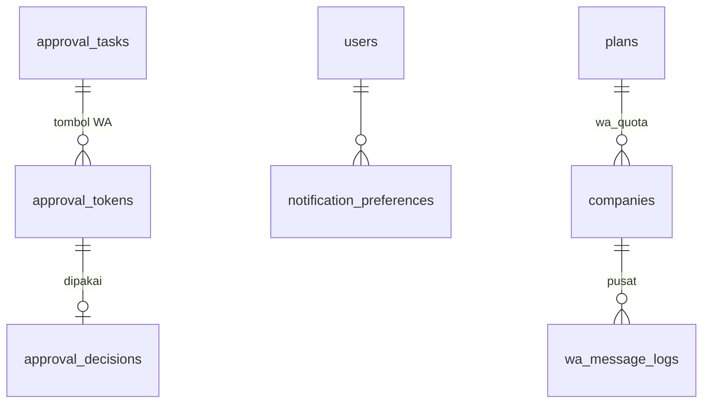

# Spesifikasi Modul — `whatsapp` (Notifikasi & Approval WhatsApp, Fase 2a)

**Versi:** 0.1
**Tanggal:** 27 September 2026
**Status:** terimplementasi (Fase 2a) — dibangun 27 Sep 2026 tanpa akun Meta (driver `log` & uji HTTP palsu, §13); rincian yang tidak tertulis di dokumen sebelumnya dicatat sebagai [A-274](04b-asumsi-lanjutan.md#a-274)–[A-280](04b-asumsi-lanjutan.md#a-280) *Perlu validasi*. Pendaftaran WhatsApp Cloud API & persetujuan template = pekerjaan pemilik produk ([checklist §5](../00-checklist-persiapan.md#5-checklist-pendaftaran-whatsapp-cloud-api-mulai-hari-pertama-fase-2a), [O-03](04-keputusan-dan-asumsi.md#o-03))
**Modul:** `whatsapp` (`app/Domain/WhatsApp`), menyentuh `notification`, `approval`, `access`, `shipment`, `platform`
**Fase:** F2 (Fase 2a, [D-29](04-keputusan-dan-asumsi.md#d-29))
**Dokumen terkait:** [Blueprint §8.2](01-blueprint.md#82-approval-via-whatsapp-f2), [§10](01-blueprint.md#10-notifikasi) · [Riset §2.6](02-riset-wms-sejenis.md#26-whatsapp-untuk-notifikasi--approval) · [BR-APR-10](05-aturan-bisnis.md#br-apr) · [A-24](04-keputusan-dan-asumsi.md#a-24) · [O-04](04-keputusan-dan-asumsi.md#o-04) · [Arsitektur §8](08-arsitektur.md) (webhook pusat) · [20-approval](20-approval.md) · [27-pendukung-f1](27-pendukung-f1.md) (notifikasi)
**Ketergantungan modul:** Notification (27), Approval (20), Platform (17), kanal pesan [A-273](04b-asumsi-lanjutan.md#a-273)

---

## 1. Tujuan & lingkup

Approver dan penanggung jawab lapangan jarang membuka aplikasi; WhatsApp membuat tugas sampai ke mereka dan approval bisa diputus dengan satu tombol. Modul ini menambahkan kanal **WhatsApp Cloud API resmi** (satu nomor platform untuk semua company, nama company di isi pesan — [A-24](04-keputusan-dan-asumsi.md#a-24)) untuk:

1. **Notifikasi** kejadian yang dipilih Admin Company, langsung atau sebagai **ringkasan harian** `[F2]`.
2. **Approval bertombol** *Setujui / Tolak / Lihat detail* dengan token sekali pakai ([BR-APR-10](05-aturan-bisnis.md#br-apr)).
3. **Kode verifikasi**: nomor WhatsApp user dan OTP bukti terima ([A-273](04b-asumsi-lanjutan.md#a-273)).
4. **Log & kuota** pemakaian per company dan per jenis pesan sebagai dasar harga paket ([O-04](04-keputusan-dan-asumsi.md#o-04)).

Tidak termasuk: percakapan bebas/chatbot (riset §2.6), PIN approval (lapis ber-PIN tetap web saja), penyedia BSP (hanya Cloud API langsung; kanal umum A-273 tetap tersedia untuk OTP), penagihan biaya pesan ke company (menunggu O-04).

## 2. Aktor & permission

| Role | Permission | Cakupan |
|---|---|---|
| Super Admin | menyalakan fitur `whatsapp` per company (`feature_flags`, [A-183](04-keputusan-dan-asumsi.md#a-183)); melihat pemakaian semua company | platform |
| Admin Company | `company_setting.manage` — kejadian yang boleh memakai WhatsApp + mode (langsung/ringkasan), balasan konfirmasi; `approval_rule.manage` — kanal lapis (Web / Web & WhatsApp) | company |
| Semua user internal | `profile.update` — nomor WhatsApp + verifikasi; preferensi kanal WhatsApp per kejadian | diri sendiri |
| Approver | memutus lewat tombol; tetap butuh izin approve dokumen (A-86) | tugas miliknya |

Tidak ada permission baru; semua lewat izin yang sudah ada.

## 3. Entitas & data

Tabel yang sudah disiapkan sejak Part 3 dipakai apa adanya; kolom baru ditandai **baru**.

| Tabel | Kolom dipakai / baru | Keterangan |
|---|---|---|
| pusat `wa_message_logs` | `company_id`, `direction` (out/in), `category` (`utility_template`/`authentication`/`service`/`inbound`), `wa_message_id` (unik), `to_number`, `template`, `payload`, `status` (`queued`/`sent`/`delivered`/`read`/`failed`), `cost_units` | satu baris per pesan; status diperbarui webhook |
| pusat `plans.wa_quota` | pesan template keluar per bulan; kosong = tanpa batas | [A-278](04b-asumsi-lanjutan.md#a-278) |
| pusat `feature_flags` kunci `whatsapp` | lapis 1 P-08 | sudah ada |
| `users` | `phone`; **baru** `phone_verified_at`, `wa_code_hash`, `wa_code_expires_at`, `wa_code_attempts`, `wa_digest_sent_at` | migrasi tenant `000360` |
| `notification_preferences.whatsapp` | preferensi per kejadian, bawaan mati | sudah ada |
| `company_settings` kunci **baru** `wa_events` (json: kejadian ⇒ `instant`/`digest`), `wa_confirm_reply` (0/1) | lapis 2 P-08 | tanpa migrasi |
| `approval_steps.channel` | `web` / `both` | sudah ada (F1 selalu `web`) |
| `approval_tokens` | `approval_task_id`, `token` (unik), `expires_at`, `used_at`, `wa_message_id` | sudah ada |
| `approval_decisions` | `channel = whatsapp`, `wa_from_number`, `wa_message_id`, `approval_token_id` | sudah ada |
| `delivery_tokens` | OTP lewat template autentikasi = kiriman otomatis A-273 | sudah ada |

## 4. Alur

| Langkah | Implementasi | Efek |
|---|---|---|
| Kirim template | `WhatsApp\Support\WhatsAppChannel::template()` → transport `cloud` (Graph API `POST /{phone_number_id}/messages`), `log`, atau `none` | baris `wa_message_logs` + `wa_message_id`; ditolak bila kuota habis |
| Notifikasi langsung | `Notifier` → `WhatsAppNotifier::instant()` setelah commit | template `wms_notifikasi`; baris `notifications` kanal `whatsapp` |
| Ringkasan harian | `notifications:daily` → `WhatsAppNotifier::digest()` | satu `wms_ringkasan` per user bila ada notifikasi baru sejak ringkasan terakhir |
| Tugas approval | `ApprovalNotifier::taskAssigned` → `ApprovalWhatsApp::offer()` bila lapis `both` | token baru, template `wms_approval` bertombol; notifikasi WA generik untuk tugas yang sama tidak dikirim |
| Tombol ditekan | webhook pusat `POST /webhooks/whatsapp` → `WhatsAppInbound` → inisialisasi tenant dari payload → `DecideViaWhatsApp` | Setujui: `ApprovalEngine::approve` kanal `whatsapp`; Tolak: balasan tautan web (alasan wajib); balasan konfirmasi opsional |
| Status pesan | webhook `statuses[]` | `wa_message_logs.status` |
| Verifikasi nomor | profil → *Kirim kode* → template `wms_kode` → isi kode | `phone_verified_at` |

Payload tombol: `APR|<tenant>|<token>|A` (Setujui) atau `…|R` (Tolak); `<tenant>` = id company pusat. URL tombol memakai pengalih pusat `https://<domain pusat>/buka/<kode company>/<path>` karena template hanya boleh satu basis URL ([A-276](04b-asumsi-lanjutan.md#a-276)).

## 5. Aturan bisnis yang berlaku

| BR | Catatan implementasi |
|---|---|
| [BR-APR-10](05-aturan-bisnis.md#br-apr) | keputusan WA mencatat `wa_from_number`, `wa_message_id`, `approval_token_id`, waktu; token sekali pakai, kedaluwarsa = batas waktu tugas (maks 72 jam) |
| BR-APR-03/09 | tetap dijaga `ApprovalEngine` (tugas sudah diputus/dialihkan → token ditolak dengan balasan singkat) |
| BR-WA-01 *(baru)* | Pesan WA hanya ke nomor **terverifikasi** milik user aktif; nomor pengirim tombol harus sama dengan nomor terverifikasi approver tugas itu |
| BR-WA-02 *(baru)* | Tiga lapis izin: fitur `whatsapp` company (Super Admin) → kejadian diizinkan Admin Company → preferensi user; tanpa salah satunya tidak ada pesan |
| BR-WA-03 *(baru)* | Kuota bulanan template per company (`plans.wa_quota`); habis → WA berhenti, in-app/email tetap, Admin Company diberi tahu sekali per bulan |
| BR-WA-04 *(baru)* | Webhook hanya diproses bila tanda tangan `X-Hub-Signature-256` sah; pesan masuk yang sama (`wa_message_id`) diproses sekali |
| [BR-GEN-11](05-aturan-bisnis.md#br-gen) | Tolak via WA tidak memutus: alasan wajib diisi di web |

## 6. Layar

| Route | Komponen | Isi |
|---|---|---|
| `/profile` | `access.whatsapp-number` | Nomor WhatsApp, status terverifikasi, *Kirim kode* (jeda 60 detik, maks 5 salah), isi kode; ganti nomor = verifikasi ulang |
| `/notifications/preferences` | (ada) | kolom **WhatsApp** hanya untuk kejadian yang diizinkan company; tanpa nomor terverifikasi → petunjuk ke profil |
| `/settings/company` kartu *WhatsApp* | `master.company-settings-form` | tampil bila fitur `whatsapp` menyala: daftar kejadian dengan pilihan *Mati / Langsung / Ringkasan harian*, saklar balasan konfirmasi, pemakaian bulan ini vs kuota |
| `/approval-rules/{id}` | `approval.rule-form` | per lapis: **Kanal** *Web* / *Web & WhatsApp* |
| pusat `/platform/companies/{id}` | (ada) | kartu **Pemakaian WhatsApp** bulan ini per jenis pesan & kuota |
| pusat `GET/POST /webhooks/whatsapp` | `WhatsAppWebhookController` | verifikasi `hub.challenge`; pesan masuk & status |
| pusat `/buka/{kode}/{path?}` | `WhatsAppRedirectController` | alih ke subdomain company (login bila perlu) |

## 7. Template Meta (diajukan pemilik produk, bahasa `id`)

| Nama | Kategori | Isi | Tombol |
|---|---|---|---|
| `wms_notifikasi` | Utility | `{{1}}: {{2}}` ⏎ `{{3}}` (company, judul, isi singkat) | URL *Buka* `…/buka/{{1}}` |
| `wms_approval` | Utility | `{{1}} — butuh persetujuan Anda` ⏎ `{{2}}` ⏎ `{{3}}` (company, dokumen & lapis, ringkasan) | balasan cepat *Setujui*, *Tolak*; URL *Lihat detail* |
| `wms_ringkasan` | Utility | `{{1}}: {{2}} hal baru untuk Anda sejak kemarin.` ⏎ `{{3}}` | URL *Buka* |
| `wms_kode` | Authentication | kode verifikasi (nomor WhatsApp & OTP bukti terima) | salin kode |

## 8. Notifikasi

Semua kejadian §8 modul lain ([27-pendukung-f1](27-pendukung-f1.md)) bisa diizinkan untuk WhatsApp; bawaan company: tidak ada (Admin Company memilih). Balasan konfirmasi setelah tombol = satu pesan layanan singkat, bisa dimatikan (riset §2.6 no. 2).

## 9. Laporan & dashboard

Pemakaian WhatsApp per company per bulan per kategori di layar company pusat dan kartu pengaturan company. Laporan biaya menunggu O-04.

## 10. Kasus uji (Given / When / Then)

| ID | Given | When | Then | BR |
|---|---|---|---|---|
| TC-WA-01 | Transport `cloud`, HTTP palsu | kirim template; Meta menolak; kuota habis | body Graph API benar + log `sent`; galat tercatat `failed`; kuota → tidak dikirim | BR-WA-03 |
| TC-WA-02 | User dengan nomor | kirim kode, kode salah ×5, kode benar, ganti nomor | template `wms_kode`; terkunci; `phone_verified_at`; verifikasi hilang | BR-WA-01 |
| TC-WA-03 | Fitur company, kejadian diizinkan *Langsung*, preferensi user | kejadian terjadi; salah satu lapis mati | `wms_notifikasi` ke nomor terverifikasi; tanpa pesan bila satu lapis mati | BR-WA-02 |
| TC-WA-04 | Kejadian mode *Ringkasan* | kejadian ×3 lalu job harian ×2 | tidak ada pesan langsung; satu `wms_ringkasan` berisi 3; job kedua tanpa pesan | BR-WA-02 |
| TC-WA-05 | Lapis `both`, approver terverifikasi | REQ diajukan | token + `wms_approval` bertombol; tanpa `wms_notifikasi` ganda | BR-APR-10 |
| TC-WA-06 | Tombol Setujui dari nomor approver | webhook bertanda tangan sah | REQ disetujui; keputusan `whatsapp` + nomor + id pesan + token; token terpakai; balasan konfirmasi | BR-APR-10 |
| TC-WA-07 | Token terpakai / kedaluwarsa / nomor lain / tanda tangan salah / pesan ganda | webhook | tidak ada keputusan; balasan singkat (kecuali tanda tangan salah = 403) | BR-WA-01, BR-WA-04 |
| TC-WA-08 | Tombol Tolak | webhook | tidak diputus; balasan berisi tautan web | BR-GEN-11 |
| TC-WA-09 | Webhook status | `delivered`, `read`, `failed` | status log diperbarui | — |
| TC-WA-10 | Layar | profil, preferensi, pengaturan company, aturan approval, company pusat, `/buka` | kolom/kartu tampil sesuai lapis; alih ke subdomain | BR-WA-02 |
| TC-WA-11 | OTP bukti terima, company WA aktif | terbitkan tautan | `wms_kode` ke nomor penerima; OTP tidak tampil ke staf | A-273, A-279 |

## 11. Di luar lingkup modul ini

PIN approval `[F2]` lanjutan, penyedia BSP, template per company, penagihan biaya pesan (O-04), WhatsApp untuk portal klien.

## 12. Definisi selesai

- [x] Transport `cloud`/`log`/`none`, log & kuota, webhook bertanda tangan, pengalih `/buka`
- [x] Verifikasi nomor, notifikasi langsung & ringkasan, approval bertombol, OTP lewat WA
- [x] Layar §6 dan uji TC-WA-01–11
- [ ] Template disetujui Meta & uji dengan nomor sungguhan (pemilik produk, O-03)

## 13. Catatan implementasi (27 September 2026)

### 13.1 Kode

| Bagian | Berkas |
|---|---|
| Transport | `app/Domain/WhatsApp/Transport/{WhatsAppTransport, CloudTransport, LogTransport, NullTransport, WhatsAppNotSent}`; dipilih `WhatsAppServiceProvider` dari `config('wms.whatsapp.driver')` |
| Kanal & log | `Support\WhatsAppChannel` (`enabled()` = transport + `Company::isFeatureEnabled('whatsapp')`, `quota()`, `template()`, `authCode()`, `text()`, `logInbound()`, `linkSuffix()`); model pusat `Models\WaMessageLog` (`thisMonth()`); `Company::url()` untuk URL subdomain |
| Pengaturan | `Support\WhatsAppSettings` (`wa_events`, `wa_confirm_reply`), `Actions\SaveWhatsAppSettings`, Livewire `whatsapp.company-settings` di Pengaturan company |
| Nomor | `Actions\VerifyWhatsAppNumber`, Livewire `whatsapp.number` di profil, `Support\WhatsAppRecipients`, `User::booted()` (ganti nomor = verifikasi hilang); migrasi tenant `000360` |
| Notifikasi | `Notifier::send(..., whatsapp: true)` → `Support\WhatsAppNotifier::instant()` setelah commit; `digest()` dari `notifications:daily`; kolom WhatsApp di preferensi notifikasi; kejadian baru `whatsapp.quota_exhausted` |
| Approval | `ApprovalNotifier::taskAssigned` → setelah commit `Support\ApprovalWhatsApp::offer()` atau notifikasi WA biasa; `Actions\DecideViaWhatsApp`; `ApprovalEngine::approve(..., $via)` menulis `channel/wa_from_number/wa_message_id/approval_token_id`; kanal per lapis di form aturan (`SaveApprovalRule` menerima `both`) |
| Webhook & tautan | `Http\Controllers\WhatsApp\WhatsAppWebhookController` (tanpa CSRF, `throttle:600,1`), `Support\WhatsAppInbound` (status maju saja, pesan ganda sekali, tenancy dipulihkan), `WhatsAppRedirectController` `/buka/{kode}/{path}` (path relatif saja) |
| OTP bukti terima | `DeliveryOtpSender::via()` = `whatsapp` bila kanal company aktif; layar SJ menampilkan tombol bagikan tautan tanpa kode |
| Pusat | kartu *Pemakaian WhatsApp bulan ini* di detail company Super Admin; label flag *Notifikasi & approval WhatsApp (Fase 2a)* |
| Uji lokal | `WMS_WA_DRIVER=log` + `php artisan whatsapp:simulate <nomor> "APR|…|A"` (payload dari `storage/logs/laravel.log`) |

Uji `tests/Feature/WhatsApp/WhatsAppTest.php` TC-WA-01–11 (8 metode).

### 13.2 Sisa pekerjaan modul ini

1. **Pemilik produk:** pendaftaran Meta ([checklist §5](../00-checklist-persiapan.md#5-checklist-pendaftaran-whatsapp-cloud-api-mulai-hari-pertama-fase-2a)), pengajuan 4 template §7, isi `.env` produksi (`WMS_WA_DRIVER=cloud`, token, phone number id, app secret, verify token), daftarkan URL webhook `https://<domain pusat>/api/webhooks/whatsapp`, keputusan [O-03](04-keputusan-dan-asumsi.md#o-03)/[O-04](04-keputusan-dan-asumsi.md#o-04) (kuota & biaya per paket).
2. Uji dengan nomor sungguhan setelah template disetujui (format komponen tombol bisa berbeda tipis dari dokumentasi).
3. `cost_units` di log pesan diisi setelah tarif ditetapkan (O-04); laporan biaya per company.
4. PIN approval untuk lapis berisiko tinggi (`approval_steps.require_pin`) — belum dirancang.
