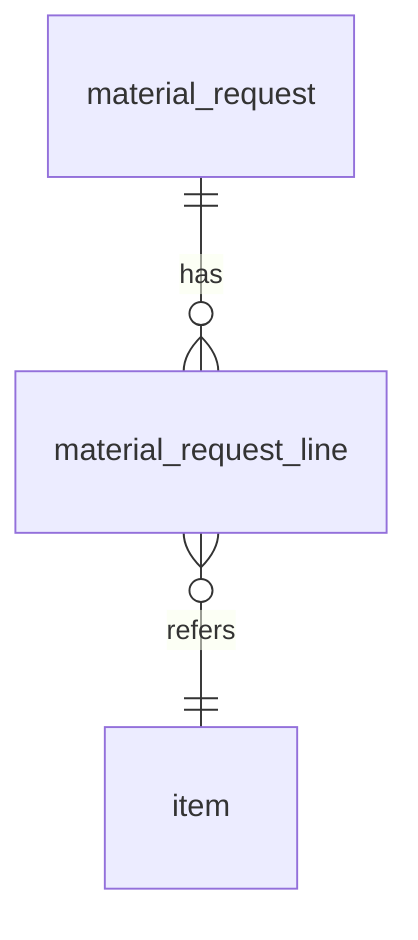

# [Template] Spesifikasi Modul — `<Nama Modul>`

> Template v0.2 (23 Sep 2026). Salin file ini menjadi `wms/1x-<modul>.md` di Part 4. Hapus teks petunjuk (blok kutipan) setelah diisi. Batas ±400 baris per modul; bila lebih, pecah menjadi dua modul. Setiap kalimat kebutuhan diberi tag fase `[F1]`/`[F2]`/`[F3]`.

**Versi:** 0.1
**Tanggal:** —
**Status:** draf / ditinjau / disetujui
**Modul:** `<kode modul>` (mis. `request`, `shipment`)
**Fase:** F1
**Dokumen terkait:** [Blueprint §x](01-blueprint.md) · [Aturan Bisnis](05-aturan-bisnis.md) · [Katalog Status](06-katalog-status-dan-enum.md) · [Glosarium](03-glosarium.md)
**Ketergantungan modul:** `<modul lain yang harus ada dulu>`

---

## 1. Tujuan & lingkup

> 3–5 kalimat: masalah yang diselesaikan, siapa pemakainya, apa yang **tidak** termasuk.

## 2. Aktor & permission

| Role | Permission (`<modul>.<aksi>`) | Cakupan |
|---|---|---|
| Staf Gudang | `request.create`, `request.submit` | gudang yang ditugaskan |

## 3. Entitas & data

> Satu tabel per entitas. Nama tabel dari glosarium. Sertakan kolom, tipe, nullable, FK, unik, indeks. Enum merujuk Katalog Status. Tambahkan blok Mermaid `erDiagram` untuk relasi antar entitas modul ini.

### 3.1 `material_request`

| Kolom | Tipe | Null | Keterangan |
|---|---|---|---|
| `id` | bigint | — | PK |
| `number` | varchar(40) | — | unik per company, format [BR-GEN-06](05-aturan-bisnis.md#br-gen) |
| `status` | enum | — | lihat [KS 2.1](06-katalog-status-dan-enum.md#21-req-permintaan-material--material_request-f1) |
| `project_id` | bigint | — | FK `project` |

## 4. Mesin status

> Jangan menyalin ulang tabel dari Katalog Status; rujuk bagiannya, lalu tuliskan **hanya** detail implementasi (event/listener, job, notifikasi yang dipicu per transisi).

| Transisi | Implementasi (service/aksi) | Efek samping (job, notifikasi, kejadian) |
|---|---|---|
| `draft → submitted` | `SubmitMaterialRequest` | notifikasi ke staf bila klien |

## 5. Aturan bisnis yang berlaku

> Daftar ID BR yang harus dipenuhi modul ini, dengan catatan implementasi bila perlu. Aturan **baru** yang hanya berlaku di modul ini diberi ID `BR-<MOD>-nn` dan diusulkan masuk ke [05-aturan-bisnis.md](05-aturan-bisnis.md).

| BR | Catatan implementasi |
|---|---|
| [BR-REQ-01](05-aturan-bisnis.md#br-req) | validasi `required_date` ≥ hari ini |

## 6. Layar

> Per layar: route, komponen Livewire, tujuan, field & validasi, aksi, keadaan kosong/error. Untuk PWA sebutkan perilaku offline Fase 1 (draf lokal) bila ada. Tabel & form mengikuti pola NexaDash yang sama di semua modul (P-11). **Field wajib ditandai `*`** di label; setiap aksi tolak/batal memakai dialog *Alasan* `*` (master Alasan) + *Keterangan* opsional ([BR-GEN-11](05-aturan-bisnis.md#br-gen)).

### 6.1 Daftar — `/requests` — `Request\Index`

| Kolom | Filter | Aksi baris |
|---|---|---|

### 6.2 Form — `/requests/create` — `Request\Form`

| Field | Tipe | Wajib | Validasi | Keterangan |
|---|---|---|---|---|
| `project_id` | select | `*` | proyek `active` | |
| `notes` | textarea | — | maks 500 karakter | keterangan opsional |

### 6.3 Detail — `/requests/{id}` — `Request\Show`

> Tab, tombol aksi per status (dari mesin status), timeline.

## 7. Kejadian stok & integrasi

| Kejadian | Transisi pemicu | Rujukan |
|---|---|---|

## 8. Notifikasi

| Kejadian | Penerima | Kanal | Template |
|---|---|---|---|

## 9. Laporan & dashboard

| Laporan | Filter | Kolom | Ekspor |
|---|---|---|---|

## 10. Kasus uji (Given / When / Then)

> Minimal: satu jalur sukses per transisi, satu per guard yang ditolak, satu per aturan BR yang dirujuk. ID `TC-<MOD>-nn`.

| ID | Given | When | Then | BR |
|---|---|---|---|---|
| TC-REQ-01 | REQ `draft` dengan 1 baris dan `required_date` terisi | `request.submit` | status `submitted`, timeline bertambah | BR-REQ-01 |

## 11. Di luar lingkup modul ini

> Sebutkan apa yang sengaja tidak dibangun di modul ini dan di modul mana itu berada.

## 12. Definisi selesai

- [ ] Migrasi, model, factory, seeder
- [ ] Mesin status sesuai Katalog (tes transisi lulus)
- [ ] Semua TC lulus
- [ ] Permission terdaftar & diuji
- [ ] Teks UI lewat file bahasa (`lang/id`)
- [ ] Timeline & audit log terisi
- [ ] Dokumen ini diperbarui bila implementasi menyimpang (versi naik)
